# 1. Executive Summary

## 1.1 What the project is

**Quranic Clinic** (internally *Mashfa Qurani* / "قرآني مشفى") is a two-tier, mobile-first Islamic spiritual-wellness platform. It pairs a **Laravel 13 REST API + Filament 5 administration panel** (the "backend") with a **React Native / Expo client** (the "mobile" app). The product's organizing metaphor is a *clinic*: the user arrives with a spiritual or physical complaint and is "treated" with curated Qur'anic recitation (Ruqyah), daily remembrances (Adhkar), recitation-improvement lessons (Tahsinat), and a full Mushaf (Qur'an reader with synchronized audio).

The system is delivered entirely as a self-contained stack the author operates himself: the API is deployed to a single Ubuntu VPS (`mashfa.odooclick.com`, PHP 8.4 + MySQL + Nginx), and the mobile app ships to Android as a standalone EAS build. There is no third-party BaaS; the Laravel backend is the single source of truth for content, identity, entitlements, and notifications.

## 1.2 Business goals

| Goal | How the system serves it |
|------|--------------------------|
| Deliver authentic Qur'anic healing content (Ruqyah) organized by ailment | "Hospital" module: Categories → Subcategories → Diseases → Recordings, each disease mapping to curated audio |
| Build a daily spiritual habit | Adhkar (morning/evening/after-prayer/sleep/waking remembrances) with repetition counters and local notification scheduling |
| Teach correct recitation | Tahsinat lessons grouped by category/section |
| Provide a first-class Qur'an reader | Mushaf module: 114 Surahs, verse-level text, multi-reciter audio with karaoke-style verse highlighting |
| Monetize premium audio | Subscription + a limited free-trial mechanism gating download/playback of premium Ruqyah audio |
| Operate offline-first | Aggressive client caching of all text/metadata; explicit download manager for audio |
| Retain users | Expo push notifications + locally scheduled Adhkar reminders |
| Be administrable by non-engineers | Filament 5 panel covering every content entity, with analytics widgets |

## 1.3 User types

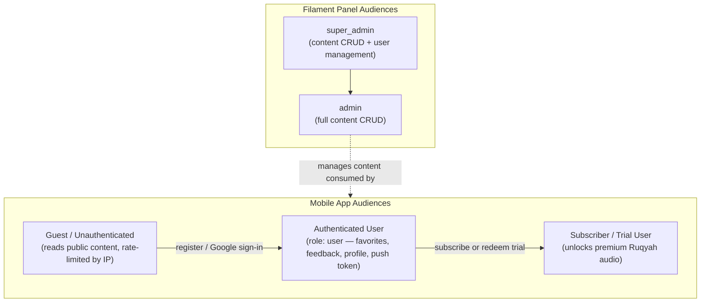

Roles are implemented with **spatie/laravel-permission**. The mobile-facing roles collapse to a single `user` role assigned at registration; the privilege axis that matters at runtime is the **subscription/trial entitlement** computed on the `User` model (`isSubscribed()`, `hasActiveTrial()`, `canGrantTrial()`). The Filament panel is gated by `User::isAdmin()` (`super_admin` or `admin`).

## 1.4 Functional modules

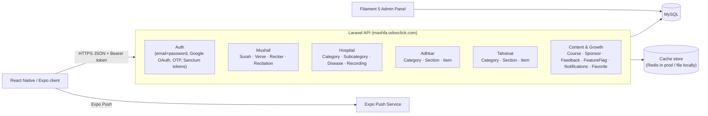

The backend is partitioned into **five content domains** plus a **cross-cutting identity/growth domain**. Each domain follows the identical vertical architecture, which is the single most important fact for onboarding:

> Every read endpoint flows **Route → Controller → Service (cache) → Repository (Eloquent) → Model (+ scopes) → API Resource → JSON**. Learn the Adhkar slice once and you have learned all sixteen.

## 1.5 Technical stack

| Layer | Technology | Notes |
|-------|-----------|-------|
| API framework | **Laravel 13** (PHP 8.3+, 8.4 in prod) | Slim `bootstrap/app.php` configuration style (no `Kernel.php`) |
| Admin UI | **Filament 5** | Livewire-based; resources split into `Schemas/*Form` + `Tables/*Table` per project rule |
| Auth | **Laravel Sanctum** (personal access tokens) + **Google OAuth** + email OTP | Bearer-token API auth, no cookies on mobile |
| Authorization | **spatie/laravel-permission** + Gate policies | `ContentPolicy`, `UserPolicy` |
| Translations | **spatie/laravel-translatable** | JSON columns per translatable attribute (`{"ar": "...","en": "..."}`) |
| Persistence | **MySQL 8** | 28 migrations; FK cascades; JSON columns for i18n |
| Cache | **Cache facade** (`remember`) | Redis in production, file/database driver locally; per-domain versioned keys |
| Queue/Jobs | Laravel queue (`CompressAudioJob`) | Audio post-processing |
| Mobile framework | **React Native + Expo (Expo Router)** | File-based routing under `app/` |
| Mobile state | **Redux Toolkit** (client/session state) + **TanStack Query** (server cache) | Deliberate split: RTK for device state, TanStack for API data |
| Mobile persistence | **AsyncStorage** + **expo-sqlite** | `contentCache` + `offlineStorage` (Mushaf) |
| Mobile audio | **expo-av / expo-audio** | Streaming + downloaded playback, karaoke timing |
| Styling | **React Native `StyleSheet`** (co-located `*.styles.ts`) | NOT Tailwind/NativeWind — see §29 |
| i18n | Custom `LanguageContext` + `ar.ts`/`en.ts` dictionaries | Arabic-first, RTL aware |

> **Documentation honesty note.** The master prompt anticipates Redis, Tailwind, and a Next.js-style React web app. This dossier documents *what the code actually is*. Where the brief's assumed technology differs from reality (e.g. **styling is React Native `StyleSheet`, not Tailwind**; **the cache is the Laravel Cache abstraction, Redis only in prod**; **there is no Redux-Saga**), the divergence is called out explicitly rather than fabricated. Sections whose premise does not exist in this codebase (e.g. RIGHT/CROSS JOIN, window functions) are answered by explaining why the codebase deliberately avoids them.

## 1.6 High-level architecture

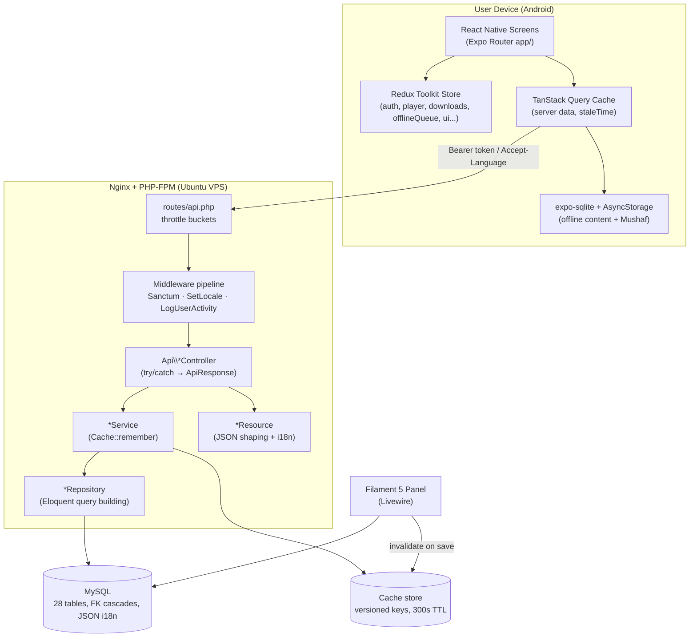

**Request taxonomy.** Three traffic classes hit the API, each with a distinct rate-limit bucket defined in `AppServiceProvider::boot()`:

* **`throttle:auth`** — 5/min/IP. Brute-force-sensitive credential endpoints (`/register`, `/login`, `/auth/google/callback`, `/auth/session-exchange`).
* **`throttle:otp`** — 10/min/IP. OTP verify/resend.
* **`throttle:api`** — 120/min keyed by user id when authenticated, else 30/min/IP. Everything else, including the 30-second polling the app performs for session-token exchange and notifications.

This single file (`AppServiceProvider`) also wires the **policy map**: nineteen content models are bound to `ContentPolicy` (public read, admin-only write) and `User` to `UserPolicy`.

---

# 2. User Story Flow

This section traces representative features end-to-end across both tiers. The canonical layered read path is shown once in full detail (Adhkar), then variant flows (auth, OAuth, premium audio, favorites) are shown with their distinguishing steps.

## 2.1 The canonical read flow — "Open the Adhkar category list"

**User action.** The user taps the *Adhkar* tile on the home screen. Expo Router navigates to `app/adhkar.tsx`, which mounts a list backed by the `useAdhkar` hook (TanStack Query).

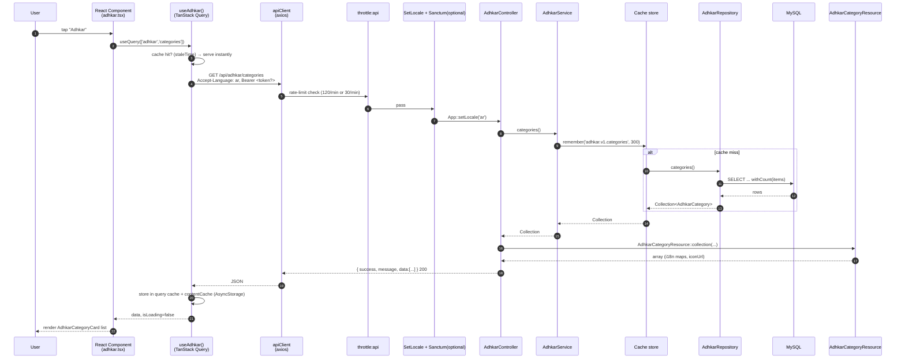

**Step-by-step.**

1. **Frontend action.** `useAdhkar()` calls `useQuery` with a stable query key. If a non-stale cached result exists, the component renders synchronously with zero network I/O — TanStack serves the in-memory cache, and on cold start the persisted `contentCache` (AsyncStorage) rehydrates it.
2. **API call.** `apiClient` (axios) issues `GET /api/adhkar/categories`. A request interceptor attaches `Authorization: Bearer <token>` (from `tokenManager`) when present and `Accept-Language` from the active `LanguageContext`.
3. **Middleware execution.** The request enters the `throttle:api` group. `EnsureFrontendRequestsAreStateful` (prepended for all API routes) is a no-op for token auth. `SetLocale` reads `Accept-Language` and calls `App::setLocale('ar'|'en')`. This route is *not* inside `auth:sanctum`, so an anonymous guest is allowed (and rate-limited by IP).
4. **Controller execution.** `AdhkarController::categories()` is resolved by the container with its `AdhkarService` constructor dependency already injected. It wraps the call in `try/catch` and returns `AdhkarCategoryResource::collection($this->service->categories())` via the `ApiResponse::success()` envelope.
5. **Service execution.** `AdhkarService::categories()` calls `Cache::remember('adhkar.v1.categories', 300, fn () => $this->repository->categories())`. TTL is 300 s; the `v1` segment is a manual cache-version namespace so a schema change can be rolled out by bumping the key.
6. **Repository execution.** `AdhkarRepository::categories()` runs `AdhkarCategory::active()->ordered()->withCount('items')->get()` — two local scopes plus an aggregate subquery (see §4, §10).
7. **Database query.** MySQL returns active categories ordered by `(display_order, id)`, each with an `items_count` correlated sub-select.
8. **Response transformation.** `AdhkarCategoryResource` maps each row to `{ id, name: {ar,en}, slug, icon: absoluteUrl, day_number, display_order, items_count, sections?, items? }`. `name` is emitted as the **full translation map** (not the resolved string) so the client can switch language offline without a refetch.
9. **Cache layer (server).** On a hit, steps 6–7's DB work is skipped entirely.
10. **Final frontend rendering.** The JSON `data` array is normalized by `useAdhkar`, written through to the persisted cache, and rendered as a `FlatList` of `AdhkarCategoryCard`.

The full pipeline, in the brief's requested notation:

```
User
→ React Component (app/adhkar.tsx)
→ TanStack Query (useAdhkar)
→ apiClient (axios + interceptors)
→ throttle:api → SetLocale → [auth:sanctum optional]
→ AdhkarController::categories()
→ AdhkarService::categories()  ── Cache::remember ──┐
→ AdhkarRepository::categories()                    │ (skipped on hit)
→ AdhkarCategory model (scopes active/ordered)      │
→ MySQL                                             ┘
→ AdhkarCategoryResource
→ JSON envelope { success, message, data }
→ TanStack cache + contentCache (AsyncStorage)
→ Component render (AdhkarCategoryCard list)
```

## 2.2 Email + password registration

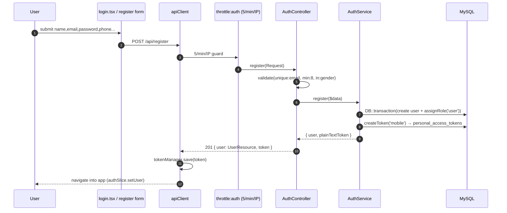

**Distinguishing details.** Validation lives in the controller (`$request->validate`), business orchestration in `AuthService::register()` which wraps user creation + role assignment in a `DB::transaction` so a failed role write cannot leave an orphaned user. Token issuance uses Sanctum's `createToken('mobile')`; only the **plain-text token** is returned (the DB stores a SHA-256 hash). On the client, `tokenManager` persists it to secure storage and `authSlice` flips the session to authenticated.

## 2.3 Google OAuth + OTP (new user) vs session-exchange (returning user)

This is the most intricate flow in the system; it is documented in depth in §31 and the project memory. Summary:

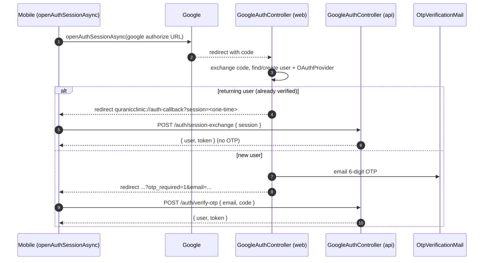

The return-URL contract `quranicclinic://auth-callback` and the **one-time session token** (short-TTL, single-use, exchanged for a Sanctum token) are deliberate: they keep the long-lived bearer token off the OS-level deep-link URL, which can be logged. `openAuthSessionAsync` (not a bare `WebBrowser.openURL`) is mandatory so the OAuth cookie jar is isolated and the redirect is captured by the app.

## 2.4 Premium audio playback (entitlement gate)

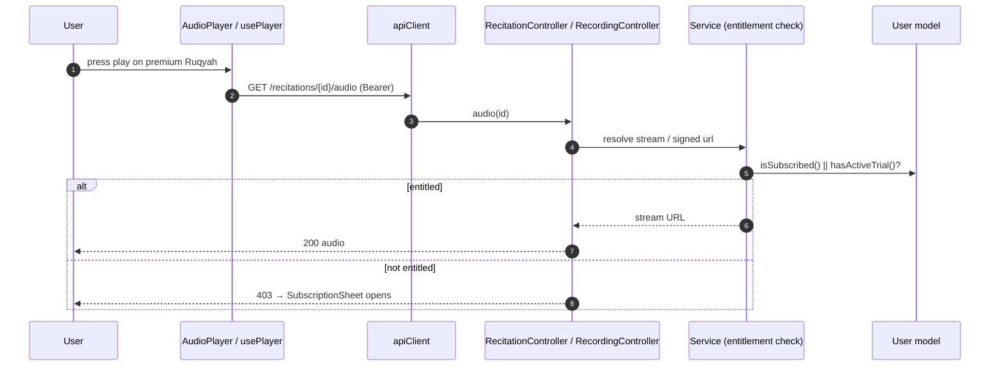

Entitlement is computed by three pure predicates on `User` (`isSubscribed`, `hasActiveTrial`, `canGrantTrial`) plus `grantTrial()` which decrements a 2-use trial allowance and sets a 7-day expiry. The mobile `SubscriptionSheet` / `LockedWird` components react to a 403 by offering subscription or trial redemption.

## 2.5 Favorites (authenticated write, many-to-many)

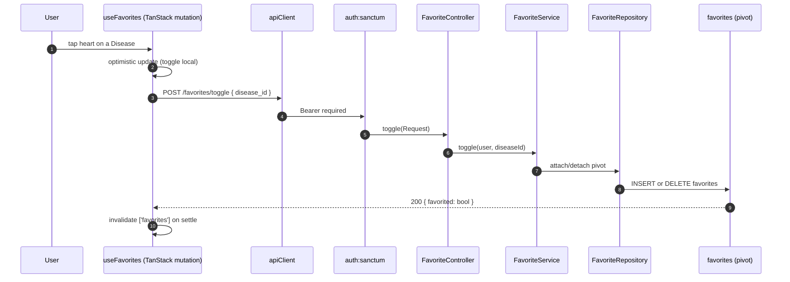

`User::favorites()` is a `belongsToMany(Disease::class, 'favorites')->withTimestamps()`, so a "favorite" is a pivot row. The toggle is idempotent server-side and optimistic client-side, with TanStack reconciling on settle.

---

# 3. Complete Database Analysis

The schema is a **normalized relational design** of 28 tables: 19 domain tables, 3 identity tables (`users`, `oauth_providers`, `personal_access_tokens`), the Laravel framework tables (`password_reset_tokens`, `sessions`, `cache`, `cache_locks`, `jobs`, `job_batches`, `failed_jobs`), and the spatie/permission set (`roles`, `permissions`, `model_has_roles`, `model_has_permissions`, `role_has_permissions`).

**Three schema-wide conventions** must be internalized before reading any single table:

1. **i18n via JSON columns.** Every user-visible text field is a `json` column holding a translation map, e.g. `name = {"ar":"الرقية","en":"Ruqyah"}`. This is `spatie/laravel-translatable`. There are **no** `name_ar`/`name_en` sibling columns. A single `slug` (ASCII) column is the stable, language-independent identifier used in URLs.
2. **Soft deletes on content, hard deletes on join/config tables.** Domain content tables carry `softDeletes()` (a nullable `deleted_at`) so an accidental admin delete is recoverable and FKs to historical rows remain valid. Pure join/config/log tables (`favorites`, `disease_aliases`, `feedback`, `feature_flags`, `notification_preferences`, `push_notifications`, the adhkar/tahsinat children) are hard-deleted.
3. **Referential integrity is enforced at the database**, not just in Eloquent. Parent deletes either `cascadeOnDelete()` (child is meaningless without parent) or `nullOnDelete()` (child survives, link is severed). This is why `User::deleteAccount()` can rely on `forceDelete()` to transitively clean favorites, feedback, notifications, and the oauth link.

## 3.1 Entity-Relationship Diagram (domain core)

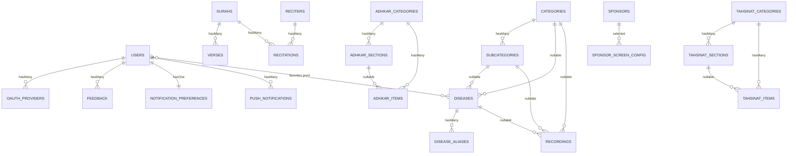

## 3.2 Identity & access tables

### `users`
**Purpose.** The single account record for both mobile end-users and Filament admins. Carries identity, profile, OAuth linkage, and the **subscription/trial entitlement** fields.

| Column | Type | Constraints | Purpose |
|--------|------|-------------|---------|
| `id` | bigint unsigned | PK | |
| `name` | varchar(255) | not null | Display name |
| `email` | varchar(255) | **unique** | Login identifier |
| `phone` | varchar(255) | nullable, **unique** | Optional contact / second unique identity |
| `country`, `gender` | varchar | nullable | Profile + sponsor targeting |
| `google_id` | varchar | nullable | Denormalized Google subject (also in `oauth_providers`) |
| `email_verified_at` | timestamp | nullable | OTP/verification gate |
| `avatar_path` | varchar | nullable | Storage-relative or absolute URL |
| `password` | varchar | **nullable** | Null for OAuth-only accounts → `login()` rejects them |
| `is_subscribed` | boolean | default false | Hard subscription flag |
| `subscription_expires_at` | timestamp | nullable | Time-boxed subscription/trial |
| `trial_used_count` | tinyint unsigned | default 0 | Caps free trials at 2 |
| `last_active_at` | timestamp | nullable | Written by `LogUserActivity` middleware |
| `expo_push_token` | varchar | nullable | Target for push |
| `remember_token` | varchar | nullable | Web session remember |
| `deleted_at` | timestamp | nullable | **SoftDeletes** |

**Indexes/constraints.** Unique on `email` and `phone`. The nullable `password` is a deliberate design seam: an account created through Google has `password = null`, and `AuthService::login()` short-circuits on `! $user->password`, so an OAuth account cannot be password-logged-in until it sets one.

### `oauth_providers`
One row per linked social identity. `unique(provider, provider_user_id)` prevents two local accounts claiming the same Google subject; `foreign(user_id) cascade` removes links when the user is hard-deleted. Stores `provider_token` / `provider_refresh_token` as `text` for potential server-side Google API calls.

### `personal_access_tokens` (Sanctum)
Standard Sanctum table: `tokenable_type`/`tokenable_id` **polymorphic** morph to `User`, `token` stores the **SHA-256 hash** (never the plaintext), `abilities` JSON, `last_used_at`. This is the only polymorphic relationship in the identity layer.

## 3.3 Mushaf (Qur'an) tables

### `surahs`
`json name`, `transliteration` (ASCII, e.g. "Al-Fatihah"), `enum type('meccan','medinan')`, `total_verses` smallint. 114 rows, seeded by `QuranSeeder`/`QuranSeederService`. SoftDeletes (a surah is never really deleted, but the column keeps the model uniform).

### `verses`
`foreignId surah_id cascade`, `verse_number` smallint, `json text`. Composite **index `(surah_id, verse_number)`** — the exact lookup shape for "give me ayah N of surah S" and for ordered pagination of a surah's verses. ~6,236 rows.

### `reciters`
`json name`, `json bio`, `photo_path`, `is_active`. Premium reciters are toggled with `is_active`.

### `recitations`
The **bridge** between a reciter and a surah: `foreignId reciter_id cascade`, `foreignId surah_id cascade`, `audio_path`, `duration_seconds`, **`unique(reciter_id, surah_id)`** — a reciter has exactly one recitation per surah. This is a classic *associative entity* turning the conceptual many-to-many "reciters ⟷ surahs" into a first-class row that also carries audio metadata.

## 3.4 Hospital (Ruqyah) tables

The hospital is a **3-level taxonomy with a deliberately flexible attach point** so content can hang off any level:

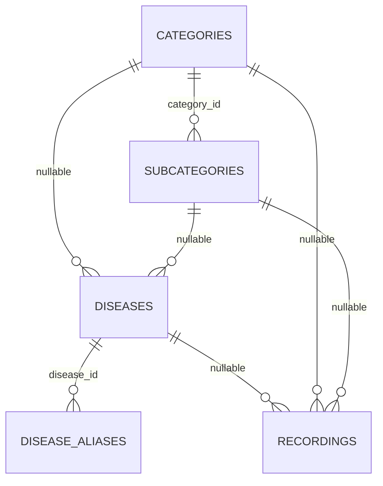

* **`categories`** — `enum type('standard','direct','disease_direct')` encodes navigation behavior: a `standard` category drills into subcategories; a `direct` category jumps straight to recordings; a `disease_direct` category lists diseases without an intermediate subcategory. This single enum drives a branch in the mobile navigation tree (`hierarchy-navigation.md`).
* **`subcategories`** — `category_id cascade`, unique `slug`.
* **`diseases`** — **both** `subcategory_id (nullOnDelete)` and `category_id (cascadeOnDelete)` are nullable, supporting the three category types: a disease may sit under a subcategory, directly under a category, or be reached by alias search.
* **`disease_aliases`** — `json alias`. Powers fuzzy search: a user typing a colloquial ailment name resolves to the canonical disease. No soft delete (aliases are cheap, regenerated).
* **`recordings`** — the **leaf content** (the actual Ruqyah audio). It can attach to a disease, a subcategory, or a category (all nullable), plus `session_number` (multi-session treatments), `json segments` (per-segment timing for karaoke), `is_free` (entitlement bypass), `is_general` (the "general ruqyah" not tied to any ailment), and `plays_count` (incremented by `POST /recordings/{id}/play`, surfaced in the Filament `TopPlayedRecordingsWidget`). Three composite indexes `(disease_id|category_id|subcategory_id, session_number)` make the "ordered sessions for this node" query index-friendly.

## 3.5 Adhkar & Tahsinat tables (parallel shapes)

Both modules share an identical **Category → Section → Item** shape; Tahsinat adds a couple of pedagogy fields.

| | Adhkar | Tahsinat |
|---|--------|----------|
| Category | `name`, `slug`, `icon`, `day_number`, `display_order`, `is_active` | `name`, `slug`, `icon`, `display_order`, `is_active` |
| Section | `category_id`, `name`, `order_randomly`, `display_order` | identical |
| Item | `category_id`, `section_id?`, `text`, `repetitions`, `hint`, `daleel`, `display_order` | `category_id`, `section_id?`, `label`, `text`, `repetitions`, `hint`, `applicability`, `display_order` |

Notable design choices:
* **`day_number`** on adhkar categories supports a rotating daily wird (e.g. a 7-day cycle).
* **`order_randomly`** on sections lets the app shuffle item order for variety without server changes.
* **`section_id` is nullable** on items so an item can live directly under a category (no section) — exactly what `AdhkarRepository::contentEagerLoads()` exploits with `whereNull('adhkar_section_id')`.
* **`daleel`** (Adhkar only) holds the scriptural evidence/source text; **`applicability`** (`both`/`male`/`female`, Tahsinat only) gates gender-specific recitation guidance.

## 3.6 Growth, content & notification tables

* **`favorites`** — pure **many-to-many pivot** `(user_id, disease_id)` with `unique(user_id, disease_id)` and `withTimestamps()`. Both FKs cascade.
* **`feedback`** — `user_id cascade`, `service_type` + nullable `service_id` form a **manual (non-Eloquent) polymorphic pointer** to whatever was rated (a recording, a course, the app generally), with `was_beneficial`, JSON `likes`/`dislikes` tag arrays, and free-text `comment`. Index `(service_type, service_id)`.
* **`courses`** — marketing/enrollment content: `json title/description`, `price decimal(10,2)`, `start_date`, `whatsapp_link`, `is_coming_soon`.
* **`sponsors`** — `json name`, `logo_path`, **targeting** (`target_all_countries`, `json target_countries`, `json target_genders`), `display_on_launch`. The app shows a sponsor splash filtered by the signed-in user's `country`/`gender`.
* **`sponsor_screen_config`** — a **singleton config row** (`is_enabled`, `display_duration_seconds`, `selected_sponsor_id nullOnDelete`).
* **`feature_flags`** — `feature_key unique`, `is_visible`. A kill-switch table; the mobile `featuresSlice`/`useFeatures` hides modules whose flag is off.
* **`notification_preferences`** — `user_id unique cascade` (enforces **one-to-one**), four adhkar toggles + a `waking_start_time`/`waking_end_time` window for the "first thing on waking" reminder.
* **`push_notifications`** — per-user inbox: `title`, `body`, `type`, `json data`, `read_at`, `sent_at`, index `(user_id, read_at)` for the unread-count badge.

## 3.7 Relationship taxonomy (every kind in the brief)

| Kind | Where it appears | Eloquent declaration |
|------|------------------|----------------------|
| **One-to-One** | `User` ⟷ `NotificationPreference` | `hasOne` / `belongsTo` + `unique(user_id)` |
| **One-to-Many** | `Surah → Verses`, `AdhkarCategory → Items`, `Disease → Recordings` | `hasMany` / `belongsTo` |
| **Many-to-Many** | `User` ⟷ `Disease` (favorites) | `belongsToMany(...,'favorites')->withTimestamps()` |
| **Associative (M:N promoted)** | `Reciter` ⟷ `Surah` via `Recitation` | two `belongsTo` on the bridge + `unique` |
| **Polymorphic (framework)** | Sanctum `personal_access_tokens.tokenable`; spatie `model_has_roles.model` | `morphTo` inside vendor code |
| **Manual polymorphic** | `Feedback (service_type, service_id)` | resolved in `FeedbackService`, not via `morphTo` |
| **Nullable parent / flexible attach** | `diseases` point to either `category` or `subcategory`; `items` optionally to a `section` | nullable FKs + `nullOnDelete` |

> **Why no MorphOne/MorphMany/MorphToMany in app code?** The domain has no shared child owned by multiple parent *types* in Eloquent terms. The one candidate — feedback on heterogeneous targets — was implemented as a manual `service_type` string for index simplicity and to avoid a morph map. §3.8 weighs the trade-off.

## 3.8 Relationship rationale & data-flow notes

* **Why `recordings` attaches to three nullable parents instead of a polymorphic `attachable`.** A morph (`attachable_type`/`attachable_id`) would collapse the three FKs into one pair but would *lose database-level referential integrity* (MySQL cannot FK a polymorphic column) and defeat the three composite `(parent_id, session_number)` indexes. With exactly three fixed parent types, three nullable FKs are faster and safer. Trade-off: an "exactly-one-parent" CHECK is not enforced at the DB; the invariant lives in the Filament form + seeders.
* **Why favorites is a pivot, not a JSON column on users.** It must be queried from both sides (a user's favorites; a disease's favorite count) and must cascade on disease deletion — natural for a pivot, awkward for JSON.
* **Why `notification_preferences` is a separate 1:1 table.** Keeps the hot `users` row narrow (read on every authenticated request via Sanctum) and lets preferences be created lazily.

---

# 4. Laravel Model Analysis

All domain models extend `Illuminate\Database\Eloquent\Model`; `User` extends `Authenticatable`. The shared idioms are: **`HasTranslations`** (Spatie wrapper) on any model with JSON i18n columns, a **`casts()` method** (Laravel 11+ style, not the `$casts` property), and **query scopes** `active()` / `ordered()` that the repositories chain.

## 4.1 The translation concern

```php
// app/Models/Concerns/HasTranslations.php
trait HasTranslations
{
    use SpatieHasTranslations;

    public function attributesToArray(): array
    {
        $attributes = parent::attributesToArray();
        foreach ($this->getTranslatableAttributes() as $key) {
            $attributes[$key] = $this->getTranslations($key);   // full map, not resolved string
        }
        return $attributes;
    }
}
```

**Why override `attributesToArray()`.** Vanilla Spatie resolves a translatable attribute to the *current locale's string* when serializing. This app instead emits the **entire `{ar,en}` map** so the mobile client can flip language offline. The override is the lynchpin that makes the resources (which call `getTranslations('name')`) and the offline cache coherent. Every `*Resource` deliberately calls `getTranslations()` to stay consistent with this decision.

## 4.2 `AdhkarItem` — anatomy of a typical content model

```php
class AdhkarItem extends Model
{
    use HasTranslations;

    protected $fillable = [
        'adhkar_category_id', 'adhkar_section_id', 'text',
        'repetitions', 'hint', 'daleel', 'display_order',
    ];
    public array $translatable = ['text', 'hint', 'daleel'];

    protected function casts(): array
    {
        return [
            'adhkar_category_id' => 'integer',
            'adhkar_section_id'  => 'integer',
            'repetitions'        => 'integer',
            'display_order'      => 'integer',
        ];
    }

    public function category(): BelongsTo { return $this->belongsTo(AdhkarCategory::class, 'adhkar_category_id'); }
    public function section(): BelongsTo  { return $this->belongsTo(AdhkarSection::class, 'adhkar_section_id'); }

    public function scopeOrdered(Builder $query): Builder
    {
        return $query->orderBy('display_order')->orderBy('id');
    }
}
```

| Facet | Value | Reasoning |
|-------|-------|-----------|
| **`$fillable`** | the writable columns | Whitelist → mass-assignment protection (no `$guarded=[]`); admin forms and seeders fill these |
| **`$translatable`** | `text, hint, daleel` | Tells Spatie which JSON columns are translation maps; combined with `casts` these are stored/loaded as JSON |
| **`casts()`** | integer coercions | Guarantees numeric types in JSON output (avoids `"3"` vs `3` drift) |
| **Relationships** | two `belongsTo` | Item belongs to a category (required) and optionally a section |
| **Scope `ordered()`** | `display_order, id` | Deterministic, admin-controlled ordering with `id` as a stable tiebreaker |

**`AdhkarCategory`** adds `scopeActive()` (`where('is_active', true)`), `hasMany(AdhkarSection)`, `hasMany(AdhkarItem)`, and an **accessor-like method** `iconUrl()` that resolves a stored storage path to an absolute URL (returns the raw value if already `http`, else `asset('storage/...')`). The resource calls `iconUrl()` rather than exposing the raw `icon` column — a small but consistent encapsulation.

## 4.3 `User` — the richest model

```php
#[Fillable([... 'is_subscribed','subscription_expires_at','trial_used_count', ...])]
#[Hidden(['password', 'remember_token'])]
class User extends Authenticatable implements FilamentUser, HasAvatar, HasName
{
    use HasApiTokens, HasFactory, HasRoles, Notifiable, SoftDeletes;
    // ...
}
```

* **PHP 8 attributes** `#[Fillable(...)]` / `#[Hidden(...)]` replace the `$fillable`/`$hidden` properties — a Laravel 13 feature. `password` and `remember_token` are hidden from every array/JSON serialization globally (defense-in-depth on top of the resources).
* **Traits:** `HasApiTokens` (Sanctum), `HasRoles` (spatie), `Notifiable`, `SoftDeletes`, `HasFactory`.
* **Interfaces:** `FilamentUser` (`canAccessPanel()` → `isAdmin()`), `HasAvatar`, `HasName` — these are what let the same `User` model power the Filament panel.
* **Entitlement predicates (pure domain logic, no I/O):** `isSubscribed()`, `hasActiveTrial()`, `canGrantTrial()`, and the mutator `grantTrial()` (increments `trial_used_count`, sets `subscription_expires_at = now()->addDays(7)`).
* **Relationships:** `hasMany(OAuthProvider)`, `belongsToMany(Disease,'favorites')`, `hasMany(Feedback)`, `hasOne(NotificationPreference)`, `hasMany(PushNotification)`.
* **`casts()`** sets `password => 'hashed'` (so `User::create(['password'=>$plain])` auto-hashes — note `AuthService::register` passes the raw password and relies on this cast) and `subscription_expires_at => 'datetime'` (so `->isFuture()` works in `isSubscribed()`).

## 4.4 Eloquent → SQL: worked examples

The brief asks for the SQL Eloquent generates and *why*. Three representative cases from this codebase:

### (a) `AdhkarCategory::active()->ordered()->withCount('items')->get()`

```sql
SELECT adhkar_categories.*,
       (SELECT COUNT(*) FROM adhkar_items
         WHERE adhkar_items.adhkar_category_id = adhkar_categories.id) AS items_count
FROM adhkar_categories
WHERE is_active = 1
ORDER BY display_order ASC, id ASC;
```
**Why.** `withCount('items')` compiles to a **correlated scalar subquery** aliased `items_count` (not a JOIN+GROUP BY), so each category appears exactly once and the count is computed in the same round-trip — no N+1, no row multiplication. The two scopes append the `WHERE` and `ORDER BY`. The resource then reads `items_count` via `whenCounted('items')`.

### (b) `AdhkarCategory::active()->where('slug',$slug)->with(['sections'=>fn($q)=>$q->ordered()->with(['items'=>...]), 'items'=>fn($q)=>$q->whereNull('adhkar_section_id')->ordered()])->first()`

```sql
-- 1: the category
SELECT * FROM adhkar_categories WHERE is_active = 1 AND slug = ? LIMIT 1;
-- 2: its sections (eager)
SELECT * FROM adhkar_sections WHERE adhkar_category_id IN (?) ORDER BY display_order, id;
-- 3: items of those sections (nested eager)
SELECT * FROM adhkar_items WHERE adhkar_section_id IN (?, ?, ...) ORDER BY display_order, id;
-- 4: section-less items of the category (constrained eager)
SELECT * FROM adhkar_items
WHERE adhkar_category_id IN (?) AND adhkar_section_id IS NULL
ORDER BY display_order, id;
```
**Why.** `with()` triggers **eager loading**: one query per relationship level using `WHERE ... IN (parent_ids)`. This is the N+1-avoidance pattern — 4 queries regardless of how many sections/items exist, versus 1 + N + M lazy queries. The closures inject `ordered()` and the `whereNull` filter into the eager queries themselves so ordering/filtering happens in SQL, not PHP.

### (c) `User::where('email',$email)->first()` then `$user->createToken('mobile')`

```sql
SELECT * FROM users WHERE email = ? AND users.deleted_at IS NULL LIMIT 1;
INSERT INTO personal_access_tokens (tokenable_type, tokenable_id, name, token, abilities, created_at, updated_at)
VALUES ('App\\Models\\User', ?, 'mobile', <sha256-hash>, '["*"]', ?, ?);
```
**Why.** `SoftDeletes` silently appends `deleted_at IS NULL` to every query via a global scope — a soft-deleted user cannot log in. `createToken` hashes the random plaintext with SHA-256 before insert; only the caller ever sees the plaintext.

## 4.5 Model inventory (27 domain models)

| Model | Translatable | Key relations | Scopes / domain methods |
|-------|-------------|---------------|--------------------------|
| `User` | – | oauthProviders, favorites(BtM Disease), feedback, notificationPreference(hasOne), pushNotifications | isSubscribed, hasActiveTrial, grantTrial, isAdmin |
| `Surah` | name | verses(hasMany), recitations(hasMany) | active/ordered |
| `Verse` | text | surah(belongsTo) | ordered by verse_number |
| `Reciter` | name, bio | recitations(hasMany) | active |
| `Recitation` | – | reciter, surah (belongsTo) | – |
| `Category` | name | subcategories, diseases, recordings | active, ordered, type-aware |
| `Subcategory` | name | category, diseases, recordings | active, ordered |
| `Disease` | name | category, subcategory, aliases(hasMany), recordings(hasMany), favoritedBy | active, ordered |
| `DiseaseAlias` | alias | disease(belongsTo) | – |
| `Recording` | description, segments | disease, category, subcategory, creator | free/general/ordered, incrementPlays |
| `Favorite` | – | user, disease (pivot model) | – |
| `AdhkarCategory` | name | sections, items | active, ordered, iconUrl |
| `AdhkarSection` | name | category, items | ordered, order_randomly |
| `AdhkarItem` | text, hint, daleel | category, section | ordered |
| `TahsinatCategory/Section/Item` | name/label/text/hint | parallel to Adhkar | ordered, applicability |
| `Course` | title, description | – | active, ordered, is_coming_soon |
| `Sponsor` | name | screenConfigs | active, targeting predicates |
| `SponsorScreenConfig` | – | selectedSponsor(belongsTo) | singleton |
| `Feedback` | likes, dislikes(json) | user(belongsTo) | manual morph via service_type |
| `FeatureFlag` | – | – | keyed by feature_key |
| `NotificationPreference` | – | user(belongsTo) | one-to-one |
| `PushNotification` | – | user(belongsTo) | unread scope |
| `OAuthProvider` | – | user(belongsTo) | – |

---

# 9. Repository Layer Analysis

> §9 is presented here, adjacent to the model layer it wraps; §5–8 (controllers/services) follow in Part C.

Fifteen repositories implement fifteen `*RepositoryInterface` contracts (in `Repositories/Contracts/`). The binding is centralized in `RepositoryServiceProvider::register()` — a single associative array `interface => concrete` looped through `$this->app->bind()`. This is the **Dependency Inversion** seam (§15): services type-hint the *interface*, the container injects the concrete.

```php
class AdhkarRepository implements AdhkarRepositoryInterface
{
    public function categories(): Collection
    {
        return AdhkarCategory::active()->ordered()->withCount('items')->get();
    }

    public function findCategoryBySlug(string $slug): ?AdhkarCategory
    {
        return AdhkarCategory::active()->where('slug', $slug)
            ->with($this->contentEagerLoads())->first();
    }

    private function contentEagerLoads(): array
    {
        return [
            'sections' => fn ($q) => $q->ordered()->with(['items' => fn ($q) => $q->ordered()]),
            'items'    => fn ($q) => $q->whereNull('adhkar_section_id')->ordered(),
        ];
    }
}
```

**Responsibilities & separation of concerns.**
* The repository is the **only** layer that names Eloquent models and builds queries. Controllers and services never call `Model::query()`. This means a future migration to a read-replica, a search index, or raw SQL touches only the repository.
* It returns **domain objects** (`Collection<Model>` / `?Model`), never arrays or JSON — transformation is the resource's job.
* It owns **eager-load strategy**. `contentEagerLoads()` centralizes the nested `with()` so both `findCategoryBySlug` and `todayCategories` share the identical, N+1-free loading plan.

**Performance implications.** Because eager-load plans live in the repository, the query count for any endpoint is fixed and auditable. The "category detail" endpoint is provably 4 queries (§4.4b) regardless of data volume. Repositories never iterate a collection issuing per-row queries; all filtering/ordering is pushed into SQL via scopes and closures.

**Variation across repositories.** `RecordingRepository` exposes `incrementPlays($id)` (an atomic `UPDATE recordings SET plays_count = plays_count + 1`), `general()` (`where('is_general', true)`), and free/paid filtering. `DiseaseRepository` exposes `search($term)` which joins/uses `disease_aliases` for fuzzy matching. `VerseRepository::search()` does a `LIKE` over the JSON `text` (the one full-scan-ish query, mitigated by the result being cached and the corpus fixed at ~6k rows). `SurahRepository` eager-loads `verses` and available `recitations` for the reader.

---

# 10. SQL Deep Dive

This codebase is intentionally **JOIN-light**: it leans on Eloquent eager loading (`WHERE IN`) and correlated subqueries (`withCount`) rather than hand-written multi-table JOINs. That is the right call for an API whose read shapes are nested object trees — eager loading returns clean per-level result sets that hydrate into models, whereas a wide JOIN would multiply rows and require de-duplication in PHP. Below, each JOIN flavor from the brief is mapped to whether/why it appears.

| SQL construct | Used? | Where / why |
|---------------|-------|-------------|
| **INNER JOIN** | Implicitly, via spatie permission checks and `belongsToMany` | `User::favorites()` generates `SELECT diseases.* FROM diseases INNER JOIN favorites ON favorites.disease_id = diseases.id WHERE favorites.user_id = ?` |
| **LEFT JOIN** | Rare; via `withCount` Laravel prefers a subquery, but `has()`/`whereHas` emit `LEFT JOIN`-style `EXISTS` | e.g. filtering categories that *have* active recordings |
| **RIGHT JOIN** | **No** | Never needed — every query is anchored on the "many" side's parent; a RIGHT JOIN would just be a reordered LEFT JOIN. Documented absence. |
| **CROSS JOIN** | **No** | No cartesian-product use case (no "every reciter × every surah" matrix is materialized; `recitations` rows are explicit). |
| **UNION** | **No** | Result sets are homogeneous per endpoint; heterogeneous "feed" endpoints do not exist. |
| **GROUP BY / HAVING** | Via `withCount` (subquery form) and analytics widgets | Filament `TopPlayedRecordingsWidget` runs `ORDER BY plays_count DESC LIMIT n`; `UserGrowthWidget` groups registrations by day |
| **SUBQUERY (scalar/correlated)** | **Yes, pervasive** | every `withCount('items')` → correlated `COUNT(*)` subquery |
| **EXISTS** | **Yes** | `hasOAuthProvider()` → `SELECT EXISTS(SELECT 1 FROM oauth_providers WHERE user_id=? AND provider=?)`; `whereHas` compiles to `WHERE EXISTS (...)` |
| **IN** | **Yes, pervasive** | every eager load → `WHERE child.parent_id IN (...)`; `isAdmin()` role check → `role_id IN (...)` |
| **NOT IN** | Rare | occasionally to exclude already-favorited items |
| **WINDOW FUNCTIONS** | **No** | The analytics that would use `ROW_NUMBER()/RANK()` (top recordings, growth) are small enough to do with `ORDER BY ... LIMIT` + `GROUP BY day`; introducing window functions would add MySQL-version coupling for no measurable gain at this data scale. Documented, deliberate absence. |

### Worked JOIN: the favorites many-to-many

```sql
-- User::favorites()->get()  (BelongsToMany over the favorites pivot)
SELECT diseases.*, favorites.user_id AS pivot_user_id,
       favorites.disease_id AS pivot_disease_id,
       favorites.created_at AS pivot_created_at
FROM diseases
INNER JOIN favorites ON favorites.disease_id = diseases.id
WHERE favorites.user_id = ?
  AND diseases.deleted_at IS NULL;
```
**Complexity.** With `unique(user_id, disease_id)` and the pivot's PK/indexes, this is an index range scan on `favorites.user_id` + PK lookups into `diseases` — effectively **O(k log n)** for k favorites out of n diseases. `withTimestamps()` is why the `pivot_created_at` column is selected (used to order "recently favorited").

### Worked subquery: `withCount`

Already shown in §4.4a. **Complexity:** the correlated `COUNT(*)` runs once per outer row; with an index on `adhkar_items.adhkar_category_id` each is an index-only count, so the endpoint is **O(c · log i)** for c categories and i items — and then *cached for 300 s*, amortizing to O(1) per request across the TTL window.

### The one expensive query — verse search

```sql
SELECT * FROM verses
WHERE JSON_UNQUOTE(JSON_EXTRACT(text, '$.ar')) LIKE CONCAT('%', ?, '%')
   OR JSON_UNQUOTE(JSON_EXTRACT(text, '$.en')) LIKE CONCAT('%', ?, '%')
LIMIT 50;
```
A leading-wildcard `LIKE` on a JSON-extracted value **cannot use a B-tree index** → full scan of ~6,236 rows. It is acceptable because (1) the corpus is fixed and tiny, (2) results are cached, and (3) the alternative (MySQL `FULLTEXT` or an external index like Meilisearch) is a deliberate Phase-2 deferral noted in `.claude/backend`. §30 ranks this as the top backend optimization candidate if search traffic grows.

---

# 11. Resource Classes

Eighteen `App\Http\Resources\*Resource` classes (`JsonResource`) are the **only** place a model becomes JSON. They enforce three things uniformly: (1) translatable fields are emitted as full `{ar,en}` maps via `getTranslations()`, (2) media paths become absolute URLs, (3) nested/aggregate data is conditional via `whenLoaded()` / `whenCounted()` so the same resource serves both list and detail endpoints without over-fetching.

```php
class AdhkarCategoryResource extends JsonResource
{
    public function toArray($request): array
    {
        return [
            'id'            => $this->id,
            'name'          => $this->getTranslations('name'),          // {"ar":...,"en":...}
            'slug'          => $this->slug,
            'icon'          => $this->iconUrl(),                        // absolute URL or null
            'day_number'    => $this->day_number,
            'display_order' => $this->display_order,
            'items_count'   => $this->whenCounted('items'),            // only if withCount() ran
            'sections'      => AdhkarSectionResource::collection($this->whenLoaded('sections')),
            'items'         => AdhkarItemResource::collection($this->whenLoaded('items')),
        ];
    }
}
```

**Field-by-field, and the DB→Resource→JSON pipeline:**

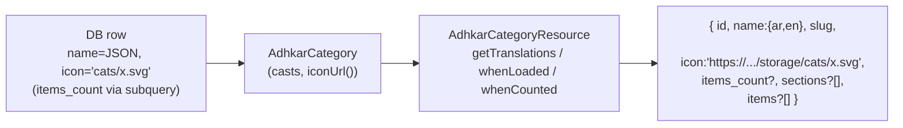

* **`id`, `slug`, `day_number`, `display_order`** — passthrough scalars (already `int`/`string` due to casts).
* **`name`** — `getTranslations('name')` returns the decoded JSON map. Critical: this matches the `HasTranslations::attributesToArray()` override so the client never has to guess the active language.
* **`icon`** — delegated to the model's `iconUrl()`, which returns `null`, the raw URL, or `asset('storage/...')`. The resource never leaks the storage-relative path.
* **`items_count`** — `whenCounted('items')` emits the key **only when** the controller's query ran `withCount('items')`. On the list endpoint it is present; on a detail endpoint that eager-loaded full items instead, it is omitted — zero wasted bytes.
* **`sections` / `items`** — `whenLoaded()` emits these **only when eager-loaded**. The list endpoint omits both (lightweight); the detail endpoint includes the nested tree. This is how one resource class powers two very different payload shapes without an `if` in the controller.

**Conditional-attribute idioms used across the 18 resources:** `whenLoaded`, `whenCounted`, `when($cond, $value)`, and `$this->mergeWhen()`. `RecordingResource` uses `when($this->is_free || $request->user()?->isSubscribed(), $streamUrl)` to **withhold the audio URL from non-entitled users** — the entitlement gate is partly enforced at serialization time, not just at the route. `UserResource` whitelists exactly the safe profile fields (never `password`, never raw role pivots) and adds computed `is_subscribed`/`has_active_trial` booleans derived from the model predicates.

---

# 5. Constructor Deep Dive

Every controller, service, and repository in this codebase uses **constructor promotion** for dependency injection. The pattern is uniform:

```php
class AdhkarController extends Controller
{
    public function __construct(private AdhkarService $service) {}   // controller → service
}

class AdhkarService
{
    public function __construct(private AdhkarRepositoryInterface $repository) {}  // service → repo INTERFACE
}

class AdhkarRepository implements AdhkarRepositoryInterface { /* no ctor — leaf */ }
```

## 5.1 How Laravel resolves `AdhkarController`

When a request matches `GET /adhkar/categories`, the router asks the **service container** to build `AdhkarController`. The resolution is fully recursive and automatic:

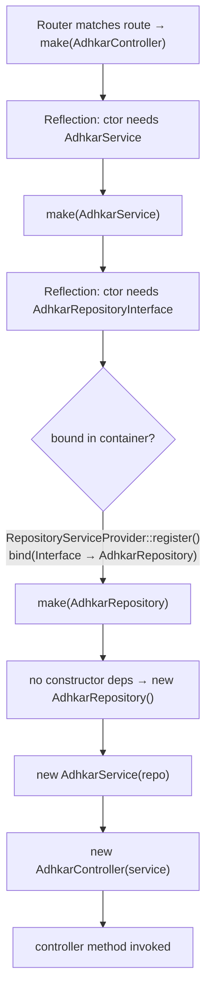

**Step by step (what the container actually does):**

1. **Reflection.** `Container::build()` calls `new ReflectionClass(AdhkarController)`, reads the constructor signature, and finds one parameter typed `AdhkarService`.
2. **Recursive resolution.** For each typed parameter that is a class (not a scalar/built-in), the container recurses: `make(AdhkarService)`.
3. **Interface → concrete.** `AdhkarService` needs `AdhkarRepositoryInterface` — an *interface*, which cannot be instantiated. The container consults its `$bindings` map; `RepositoryServiceProvider::register()` registered `AdhkarRepositoryInterface::class => AdhkarRepository::class`, so it resolves the concrete `AdhkarRepository`.
4. **Leaf instantiation.** `AdhkarRepository` has no constructor dependencies, so the container `new`s it directly (heap allocation of one small object holding no state).
5. **Unwind & inject.** The container constructs `new AdhkarService($repo)`, then `new AdhkarController($service)`, then invokes the matched method (`categories()`).

## 5.2 Lifecycle: transient by default, singleton where it matters

* **`bind()` is transient.** The repository bindings use `$this->app->bind(...)`, so a **fresh instance is built for every resolution** (i.e. once per request, because the container resolves the controller graph once per request). These objects are stateless query-builders, so transient is correct and cheap.
* **Singletons** in this app are the framework's: the container itself, the `Request`, the database `ConnectionResolver`, the cache manager. Eloquent models are *not* container-managed — they are `new`'d by queries.
* **Memory.** Each request allocates a tiny object graph: 1 controller + 1 service + 1 repository ≈ three small heap objects with only reference fields. They become garbage-collectible the instant the response is sent and the request scope unwinds. There is no per-request leakage because nothing is registered as a singleton holding request state.

## 5.3 Why constructor injection (vs. method/facade access)

| Property | Constructor injection (this app) | Facade / `app()->make()` |
|----------|----------------------------------|---------------------------|
| Testability | Dependencies are explicit; a test passes a mock repo directly | Hidden global lookup; needs container faking |
| Immutability | `private readonly`-style promoted props set once | Resolved ad-hoc, anywhere |
| Discoverability | The class's needs are its signature | Buried in method bodies |
| Compile-time safety | PHP + static analysers verify types | Runtime-only |

Constructor injection is what makes the **Dependency Inversion Principle** (§15) physically real here: `AdhkarService` literally cannot reference `AdhkarRepository` (the concrete) — it only knows the interface, and the wiring lives in one provider. Swapping persistence is a one-line change in `RepositoryServiceProvider`.

---

# 6. Middleware Analysis

Middleware is configured in the Laravel 13 slim style inside `bootstrap/app.php` (`->withMiddleware(...)`) — there is no `app/Http/Kernel.php`.

```php
$middleware->trustProxies(at: '*', headers: X_FORWARDED_FOR | _HOST | _PORT | _PROTO | _AWS_ELB);
$middleware->api(prepend: [
    EnsureFrontendRequestsAreStateful::class,   // Sanctum
    SetLocale::class,                            // app
]);
$middleware->api(append: [ LogUserActivity::class ]);  // app
$middleware->alias(['role' => CheckRole::class]);
```

## 6.1 The API request pipeline

```mermaid
flowchart LR
    Req["HTTP Request"] --> TP["TrustProxies\n(honor X-Forwarded-Proto → https URLs)"]
    TP --> ST["EnsureFrontendRequestsAreStateful\n(Sanctum; no-op for token auth)"]
    ST --> SL["SetLocale\n(Accept-Language → App::setLocale)"]
    SL --> TH["throttle:api / auth / otp\n(rate-limit bucket)"]
    TH --> AU["auth:sanctum\n(only on protected groups)"]
    AU --> Ctrl["Controller"]
    Ctrl --> LUA["LogUserActivity (append)\n(last_active_at, ≤1/hour, saveQuietly)"]
    LUA --> Resp["Response"]
```

## 6.2 Each middleware, why it exists, and its mechanics

**`TrustProxies(at: '*')`** — The API runs behind Nginx (prod) and ngrok (dev). Without trusting `X-Forwarded-Proto`, `asset()`/`url()` generate `http://` links; the Android cleartext policy and ngrok then block the images. Trusting the forwarded headers makes generated media URLs `https://`. `at: '*'` is acceptable because the app server is never directly internet-exposed (Nginx terminates TLS).

**`EnsureFrontendRequestsAreStateful` (Sanctum, prepended)** — Decides whether a request is a "first-party SPA" (cookie/session auth) or a third-party (token) client. The mobile app always sends `Authorization: Bearer …` and no Sanctum stateful cookie, so this is effectively a pass-through for mobile; it is present so the same API could serve a cookie-based web SPA without reconfiguration.

**`SetLocale` (app, prepended)** — Reads `Accept-Language`, sets `App::setLocale('ar'|'en')`. This influences any locale-aware formatting; note that because resources emit the **full translation map**, the locale mostly affects validation messages and any server-rendered strings, not the content payload. Defensive: defaults to `en`, only switches to `ar` on an `ar*` prefix.

**`throttle:*` (route-group)** — The three buckets from `AppServiceProvider` (§1.6). Throttling sits *after* locale so a 429 still carries correct headers, and *before* auth so anonymous floods are shed cheaply.

**`auth:sanctum` (route-group, protected only)** — Hashes the incoming bearer token, looks it up in `personal_access_tokens`, loads the `tokenable` user, sets `$request->user()`. Applied only to the `/me`, favorites, feedback, and notification routes (§1.6 routes file). A missing/invalid token yields 401 before the controller runs.

**`CheckRole` (alias `role`, available but selectively used)** —
```php
public function handle(Request $request, Closure $next, string ...$roles): Response
{
    if (!$request->user() || !in_array($request->user()->role, $roles)) {
        return response()->json(['success' => false, 'message' => 'Forbidden'], 403);
    }
    return $next($request);
}
```
A variadic role guard (`->middleware('role:admin,super_admin')`). The API itself leans on **policies** for write authorization (Filament side) rather than this middleware, but it is wired and available. *(Implementation note: it reads `$request->user()->role`; the canonical role source is spatie's `hasRole()`. This is a small inconsistency flagged in §32.)*

**`LogUserActivity` (app, appended)** — Runs *after* the controller (append position) so it never delays the response logic. It writes `last_active_at` **at most once per hour** (`last_active_at->lt(now()->subHour())`) using `saveQuietly()` (no model events, no `updated_at` touch storm). This throttled write is what powers the `UserGrowth`/active-user analytics without hammering the DB on every poll.

---

# 7. Controller Analysis

There are two controller families: **`App\Http\Controllers\Api\*`** (the JSON API the mobile app consumes) and a few top-level controllers (`SurahController`, `VerseController`, `ReciterController`, `RecitationController`) that predate the `Api\` namespace reorg but follow the same contract. All extend the abstract base:

```php
abstract class Controller { use ApiResponse; }
```

So every controller method has `success()`, `error()`, and `paginated()` available.

## 7.1 Responsibilities (and the strict boundary)

A controller in this codebase does **exactly four things** and nothing else:

1. **Read/validate input** (`$request->validate([...])` or manual `(int) $request->get(...)`).
2. **Delegate** to its single injected service.
3. **Map to a Resource** (`XResource::collection(...)` / `new XResource(...)`).
4. **Wrap** in the `ApiResponse` envelope, inside `try/catch`.

It contains **no** query building, **no** business rules, **no** cache calls. This is visible in `AdhkarController` (§2.1) and `RecordingController`:

```php
public function stream(Request $request, int $id): JsonResponse
{
    try {
        $recording = $this->service->find($id);
        if (! $recording) return $this->error('Recording not found', 404);
        if (! $this->service->canAccess($recording, $request->user()))
            return $this->error('This session requires an active subscription or trial.', 403);
        return $this->success(['id' => $recording->id, 'audio_url' => $recording->streamUrl()]);
    } catch (\Throwable $e) {
        return $this->error('Server error', 500);
    }
}
```

Note the **entitlement decision lives in `RecordingService::canAccess()`**, not the controller — the controller only branches on its boolean result and chooses the HTTP status.

## 7.2 Controller call graph

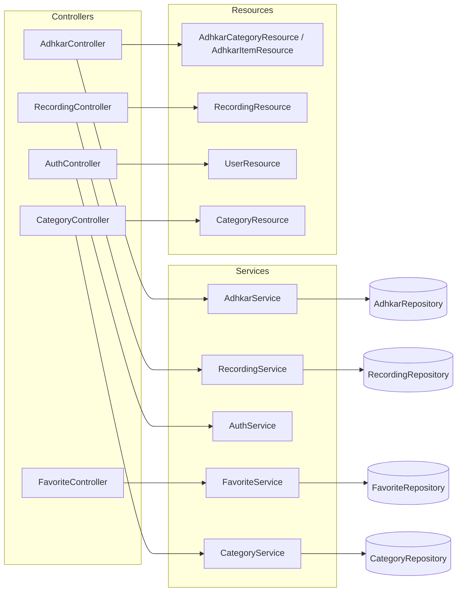

## 7.3 Validation strategy

* **Form validation** uses inline `$request->validate([...])` rules (no dedicated FormRequest classes). Rules seen: `unique:users,email`, `min:8`, `in:male,female`, `size:6` (OTP), `unique:users,phone,{id}` (ignore-self on profile update).
* **Validation failures** throw `ValidationException`, caught per-method and re-emitted as `error('Validation failed', 422, $e->errors())` — i.e. the framework's 422 body is *re-wrapped* into the app's `{success:false, message, errors}` envelope so the mobile client has one error shape to parse everywhere.
* **`GoogleAuthController`** is the exception to the envelope: it returns bespoke JSON (`{status, user, token}` / `{error}`) because its client contract (the OAuth bounce + OTP exchange) predates and differs from `ApiResponse`. This is the one place the response shape diverges, documented in §12.

## 7.4 The auth controllers in depth

`AuthController` (email/password) is thin — it validates and forwards to `AuthService`. `GoogleAuthController` is the heavyweight (420 lines) because it implements the **deep-link bounce + one-time session exchange + OTP** dance described in §2.3 and §31. Its noteworthy controller-level techniques:

* **PKCE code exchange server-side** (`handleMobileGoogleCallback`): the app sends `code` + `code_verifier`; the server exchanges them at Google's token endpoint, keeping `client_secret` off the device.
* **Soft-deleted-account purge before re-create** (`verifyOtp`): a trashed account still occupies the unique `email` index, so it `forceDelete()`s any `onlyTrashed()` match first — otherwise re-signup throws a unique-constraint violation that surfaces as a misleading "wrong code".
* **One-time, single-use caches**: `auth_exchange:{token}` (300 s) and `otp:{email}` / `otp_session:{token}` (600 s), all `Cache::forget()`-ed on success.

---

# 8. Service Layer Analysis

Sixteen `App\Services\*` classes sit between controllers and repositories. A service's job is **orchestration + cross-cutting policy** (caching, transactions, entitlement) — the decisions that are neither pure HTTP (controller) nor pure persistence (repository).

## 8.1 Three archetypes

**(a) Cache-front service** — `AdhkarService`, `CategoryService`, `SurahService`, etc. Wrap repository reads in `Cache::remember(key, ttl, closure)`:
```php
public function categories(): Collection
{
    return Cache::remember('adhkar.v1.categories', 300, fn () => $this->repository->categories());
}
```
The service owns the **cache key namespace and TTL**; the repository stays cache-agnostic and therefore trivially testable.

**(b) Transactional/orchestration service** — `AuthService`, `FavoriteService`:
```php
public function toggle(int $userId, int $diseaseId): bool
{
    return DB::transaction(fn () => $this->repository->toggle($userId, $diseaseId));
}
```
The service owns the **transaction boundary**. `AuthService::register()` wraps `User::create()` + `assignRole('user')` in `DB::transaction` so a failed role assignment cannot leave a roleless user.

**(c) Policy/decision service** — `RecordingService::canAccess()` (§7.1). Pure domain logic with one deliberate **side effect**: if the user is unentitled but `canGrantTrial()`, it **auto-grants a 7-day trial** and returns `true`. This is a product decision (first premium tap silently starts the trial) encoded in the service, invisible to the controller.

## 8.2 Why the service layer exists (vs. fat controllers / fat models)

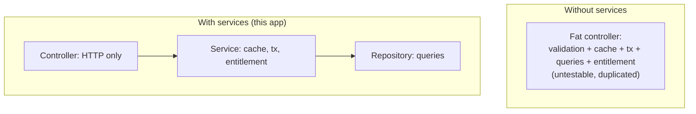

* **Reuse across entry points.** The same `RecordingService::canAccess()` guards both the `stream` and `download` paths, and could guard a Filament action — write once.
* **Testable units.** A service test injects a fake repository and asserts cache/transaction/entitlement behavior without HTTP or a database.
* **Single responsibility.** Controllers stay ~50 lines; repositories stay pure query code; the messy "when do we cache / when do we grant a trial" logic has exactly one home.

## 8.3 Execution flow of a cache-front read (with side effects)

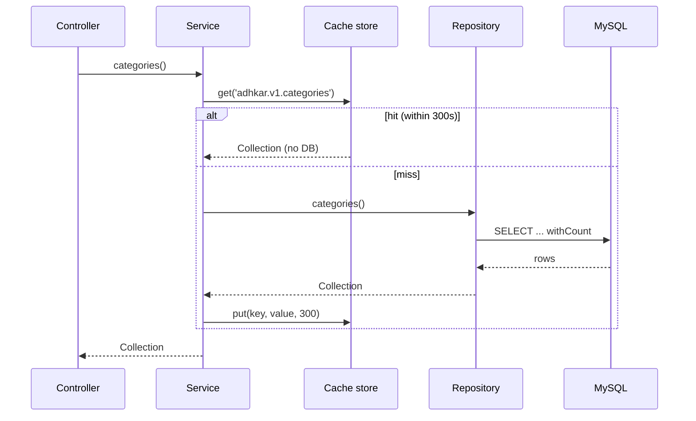

---

# 12. API Response Analysis

## 12.1 The envelope

Every API-namespace endpoint returns one of three shapes from `ApiResponse`:

```json
// success(data, message, status)
{ "success": true,  "message": "Success", "data": <payload> }
// error(message, status, errors?)
{ "success": false, "message": "Validation failed", "errors": { "email": ["..."] } }
// paginated(LengthAwarePaginator)
{ "success": true, "message": "Success", "data": [...], "meta": { "current_page":1,"last_page":3,"per_page":15,"total":42 } }
```

A consistent envelope means the mobile `apiClient` has exactly one unwrap (`res.data.data`) and one error path (`!res.data.success`) for the whole surface — no per-endpoint special-casing (except the documented `GoogleAuthController`).

## 12.2 Raw DB → Resource → final JSON (worked, end to end)

Endpoint: `GET /adhkar/categories/{slug}/items` resolving to a category detail.

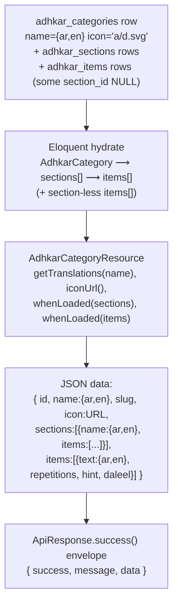

**Property-by-property of one item in `data.items[]`:**

| JSON key | Source | Transformation |
|----------|--------|----------------|
| `id` | `adhkar_items.id` | passthrough (int cast) |
| `text` | `adhkar_items.text` (JSON col) | `getTranslations('text')` → `{ar,en}` |
| `repetitions` | column | int cast; client renders the counter target |
| `hint`, `daleel` | JSON cols | `getTranslations()` maps; `daleel` is the scriptural source |
| `display_order` | column | drives client ordering as a tiebreak |

Because `sections` and `items` are wrapped in `whenLoaded()`, the **list** endpoint (`categories()`) returns the same resource *without* those keys — the payload shape is data-driven by what the repository eager-loaded, not by separate DTOs.

## 12.3 Status-code contract

| Scenario | Status | Body |
|----------|--------|------|
| OK | 200 | `success` envelope |
| Created (register) | 201 | `success` with user+token |
| Validation failed | 422 | `error` with `errors` map |
| Unauthenticated (missing/invalid token) | 401 | Sanctum / `error('Invalid credentials')` |
| Not entitled (premium audio) | 403 | `error('...requires an active subscription or trial.')` |
| Not found (bad slug/id) | 404 | `error('... not found')` |
| One-time session expired (OAuth) | 410 | `{error:'session_expired'}` |
| Rate limited | 429 | framework throttle body |
| Unhandled exception | 500 | `error('Server error')` (details swallowed — see §31) |

---

# 13. Caching Analysis

> The brief titles this "Redis Analysis." In production the cache **driver** is Redis; locally it is the file/database driver. The application code never calls Redis directly — it uses the Laravel `Cache` facade, so the strategy below is driver-agnostic and the same code path runs on file or Redis.

## 13.1 Strategy: read-through with versioned keys + event invalidation

Three caching idioms coexist:

1. **Read-through (`Cache::remember`)** — the default for public, non-user-specific reads. Used by `AdhkarService`, `TahsinatService`, `CourseService`, `FeatureFlagService`, `SponsorService`, `RecitationService`.
2. **Write-through (`Cache::put` after a fresh fetch, `Cache::forget` first)** — `SurahService` and `ReciterService` proactively refresh long-lived (3600 s) entries instead of waiting for expiry.
3. **Event invalidation (model `booted()` hooks)** — `FeatureFlag` registers `static::saved(...)` and `static::deleted(...)` callbacks that `Cache::forget(FeatureFlagService::CACHE_KEY)` the instant an admin edits a flag in Filament, so flags propagate immediately rather than after the 300 s TTL.

## 13.2 Key structure & TTL map

| Key | TTL | Owner | Invalidated by |
|-----|-----|-------|----------------|
| `adhkar.v1.categories` | 300 s | AdhkarService | TTL expiry |
| `adhkar.v1.today` | 300 s | AdhkarService | TTL expiry |
| `tahsinat.v1.categories` | 300 s | TahsinatService | TTL |
| `courses.v1.all` | 300 s | CourseService | TTL |
| `features` (`FeatureFlagService::CACHE_KEY`) | 300 s | FeatureFlagService | **model `saved`/`deleted` hook** |
| `sponsors.all`, `sponsors.screen` | 300 s | SponsorService | `SponsorService` forget on update |
| `recitations.surah.{id}` | 300 s | RecitationService | TTL |
| `surahs.*`, `reciters.*` | 3600 s | Surah/ReciterService | write-through refresh |
| `otp:{email}`, `otp_session:{token}` | 600 s | GoogleAuthController | single-use `forget` on verify |
| `auth_exchange:{token}` | 300 s | GoogleAuthController | single-use `forget` on exchange |

The **`v1`** segment is a manual schema-version namespace: bumping it to `v2` invalidates a whole domain's cache atomically without `flush()`. The OAuth keys double as **ephemeral state store** (not just a cache) — they are the only place the pending-OTP and one-time-exchange state lives, which is why they must be a shared store (Redis in prod) and not an in-process array.

## 13.3 With-cache vs without-cache

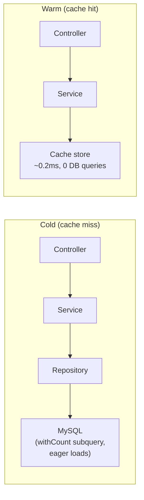

| | Cold | Warm |
|---|------|------|
| DB queries (adhkar categories) | 2 (rows + count subquery folds into 1 SELECT) | **0** |
| Typical latency | DB round-trip + hydration (~5–25 ms) | in-memory/Redis fetch (~0.2–2 ms) |
| Cost under 30 s polling | every poll hits DB | 1 DB hit per 300 s window, rest served from cache |

**Performance gain.** The app's home screen polls several public endpoints on a ~30 s cadence. With a 300 s TTL, only ~1 in 10 polls reaches the database; the rest are served from cache. For N concurrent users this collapses what would be `N × polls` DB reads into `~1 read per key per 300 s`, which is the single biggest scalability lever in the backend.

## 13.4 Cache warming

`.claude/backend/cache-strategy.md` describes a **parallel cache-warming** plan (fan-out to 4 workers priming the hierarchy/features/sponsor keys after a deploy). In the current code the practical warming is **lazy** (first request after expiry pays the miss). A deploy-time `php artisan` warm step is the documented next increment; the `PopulateTranslations` command already calls `Cache::flush()` after a bulk translation backfill, which is the inverse operation (cold-start the cache deliberately).

---

# 14. OOP Analysis

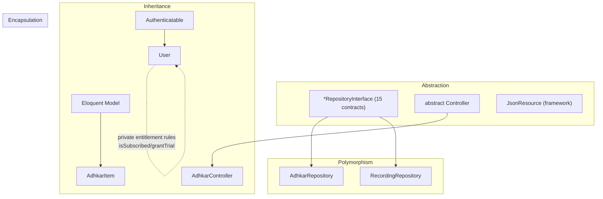

**Encapsulation.** State is guarded behind intent-revealing methods rather than exposed columns. `User` never lets a caller poke `subscription_expires_at` directly to decide access — it exposes `isSubscribed()`, `hasActiveTrial()`, `grantTrial()`. `AdhkarCategory::iconUrl()` hides the storage-path → URL mapping. `$fillable` whitelists and `#[Hidden]` enforce that internal fields (`password`, `remember_token`) never escape. The `ApiResponse` trait encapsulates the envelope so no controller hand-builds JSON.

**Inheritance.** A shallow, deliberate hierarchy: every API controller extends one abstract `Controller` (to inherit `ApiResponse`); every content model extends `Model`; `User` extends `Authenticatable`; every resource extends `JsonResource`. Depth is intentionally ≤2 — composition (traits, injected services) is preferred over deep inheritance.

**Polymorphism.** The repository interfaces are the prime example: `AdhkarService` holds an `AdhkarRepositoryInterface` and calls `->categories()` without knowing the concrete class — any implementation satisfying the contract is substitutable (§15 Liskov). Method overriding appears in `HasTranslations::attributesToArray()` (overrides the model's serialization) and Filament's interface methods on `User` (`canAccessPanel`, `getFilamentName`).

**Abstraction.** Interfaces (`*RepositoryInterface`), the abstract `Controller`, and traits (`ApiResponse`, `HasTranslations`) define *what* without *how*. A service depends on the abstraction of "a thing that returns adhkar categories," not on Eloquent.

---

# 15. SOLID Principles

| Principle | Evidence in this codebase | Verdict |
|-----------|---------------------------|---------|
| **S — Single Responsibility** | Controller = HTTP; Service = orchestration/cache/tx; Repository = queries; Resource = serialization; Model = state+domain predicates. Each class changes for exactly one reason. | Strong |
| **O — Open/Closed** | Adding a new domain (e.g. "Lectures") = new Model/Repo/Service/Controller/Resource + one line in `RepositoryServiceProvider` + routes. No existing class is modified. Scopes (`active`, `ordered`) extend query behavior without editing the builder. | Strong |
| **L — Liskov Substitution** | Every `AdhkarRepository` is a drop-in for `AdhkarRepositoryInterface`; services never type-check or downcast. A fake/in-memory repo in tests substitutes cleanly. | Strong |
| **I — Interface Segregation** | 15 *small, role-specific* repository interfaces rather than one fat `RepositoryInterface`. `AdhkarRepositoryInterface` exposes only adhkar methods; `RecordingRepositoryInterface` only recording methods. No client depends on methods it doesn't use. | Strong |
| **D — Dependency Inversion** | High-level services depend on repository *interfaces*; the concrete binding lives in one provider. Controllers depend on services (concrete, but single-purpose). | Strong (repo layer), pragmatic (service layer) |

**Worked DIP example.**
```php
// High-level policy (service) depends on an abstraction:
class AdhkarService {
    public function __construct(private AdhkarRepositoryInterface $repository) {}
}
// The detail is wired once, separately:
$this->app->bind(AdhkarRepositoryInterface::class, AdhkarRepository::class);
```
Both the high-level (`AdhkarService`) and low-level (`AdhkarRepository`) modules depend on the abstraction (`AdhkarRepositoryInterface`); neither depends on the other directly. This is textbook DIP and is the reason the persistence layer is swappable.

**Honest caveat (ISP/SRP nuance).** Services are injected as concretes (`AdhkarService`, not an interface). That is a pragmatic choice — services have a single implementation, so an interface would be ceremony. It mildly weakens DIP at the controller→service seam but costs nothing in practice and is flagged as such in §32.

---

# 16. Design Patterns

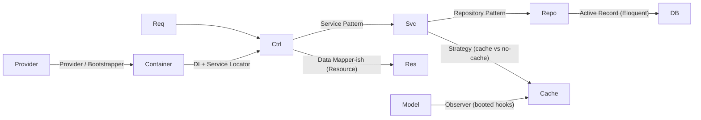

| Pattern | Where | Why / Benefit | Trade-off |
|---------|-------|---------------|-----------|
| **Repository** | `*Repository` + `*RepositoryInterface` | Isolates persistence; swappable; testable | Extra indirection; some methods are thin pass-throughs |
| **Service Layer** | `App\Services\*` | Home for orchestration, cache, tx, entitlement | Risk of anemic services that only forward (a few here do) |
| **Dependency Injection** | constructor promotion everywhere | Explicit deps, testable, no globals | Requires container literacy |
| **Provider / Bootstrapper** | `RepositoryServiceProvider`, `AppServiceProvider`, `AdminPanelProvider` | Central wiring of bindings, rate limits, policies | Bindings live away from usage |
| **Active Record** | Eloquent models | Rapid CRUD, scopes, relations | Couples domain to ORM (mitigated by repos) |
| **Data Transfer / Presenter** | `JsonResource` classes | One serialization home, conditional fields | Per-entity boilerplate |
| **Strategy** | `RecordingService::canAccess` (free vs subscribed vs trial branches); cache vs direct read per service | Behavior selected at runtime | Branches instead of polymorphic classes (fine at this size) |
| **Observer** | model `booted()` `saved/deleted` → cache forget | Decoupled invalidation | Hidden side effects on save |
| **Facade** | `Cache`, `DB`, `Auth`, `Gate`, `Mail` | Terse static API over container singletons | Static-looking calls (actually proxied) |
| **Singleton** | container-managed framework services | One instance per request lifecycle | N/A |
| **Adapter** | `HasTranslations` wrapping Spatie's trait + overriding `attributesToArray` | Bends a library to the app's "full-map" contract | Couples to Spatie internals |
| **Factory** | `database/factories/UserFactory`, `createToken()` | Test data + token minting | Test-scope mostly |

The **dominant, defining pattern** is the layered **Controller → Service → Repository** triad with DI — applied with near-perfect consistency across all sixteen domains. That consistency is the codebase's biggest strength: once learned, every feature is navigable by convention.

---

# 31. Security Audit

```mermaid
flowchart TD
    Req["Incoming request"] --> RL["Rate limiting\nauth:5/min · otp:10/min · api:120|30/min"]
    RL --> TLS["TLS via Nginx + TrustProxies"]
    TLS --> AuthN["AuthN: Sanctum bearer (SHA-256 hashed at rest)"]
    AuthN --> AuthZ["AuthZ: Policies (ContentPolicy/UserPolicy) + isAdmin gate"]
    AuthZ --> Val["Validation: $request->validate per endpoint"]
    Val --> MA["Mass-assignment: $fillable whitelist / #[Fillable]"]
    MA --> ORM["SQL injection: Eloquent param binding"]
    ORM --> Out["Output: Resources whitelist fields; #[Hidden] password"]
```

## 31.1 Authentication

* **Sanctum personal access tokens.** Mobile sends `Authorization: Bearer <plaintext>`; the server stores only the **SHA-256 hash** (`personal_access_tokens.token`). A DB leak does not expose usable tokens.
* **Password hashing.** `casts(['password' => 'hashed'])` → bcrypt on write; `Hash::check` on login. OAuth-only accounts get a random 32-char bcrypt password they never use (so the row is valid but unusable for password login).
* **OAuth (PKCE).** The mobile flow exchanges `code` + `code_verifier` server-side, keeping `client_secret` off-device. The bearer token is **never** placed in a deep-link URL — only an opaque, single-use `session_token` is, which is exchanged once via `POST /auth/session-exchange` and immediately `forget()`-ed. Profile data is mapped server-side via `otp_session:{token} → email`, so no PII rides the URL.
* **OTP.** 6-digit codes are stored **hashed** (`Hash::make`) in cache with a 600 s TTL; resends are capped at 3 (`otp_resend:{email}`), verify is throttled (`throttle:otp`, 10/min/IP).
* **Account deletion hygiene.** Soft-deleted accounts are force-purged before an email is reused, preventing unique-index collisions and orphaned OAuth links.

## 31.2 Authorization

* **Policies.** `ContentPolicy` = public read (`viewAny/view → true`), admin-only write (`create/update/delete/forceDelete → isAdmin()`). Bound to 19 content models in `AppServiceProvider`. `UserPolicy` governs user management.
* **Panel gate.** `User::canAccessPanel()` → `isAdmin()` (`super_admin`/`admin`) keeps non-admins out of Filament entirely.
* **Entitlement gate.** Premium audio is gated in `RecordingService::canAccess()` *and* withheld at serialization in `RecordingResource` (defense in depth — a leaked stream URL still requires the row's `is_free` or an entitled user).
* **Route-level auth.** Write/user endpoints sit inside `auth:sanctum`; public reads stay open but IP-rate-limited.

## 31.3 Input validation & mass assignment

* Every write validates explicitly (`required`, `email`, `unique`, `in:`, `size:6`, `min:8`). Failures → uniform 422.
* **Mass assignment** is whitelisted via `$fillable` / `#[Fillable]`; there is no `$guarded = []`. `AuthService::updateProfile` additionally `array_filter`s nulls so a partial update never blanks untouched fields.

## 31.4 Injection, XSS, CSRF

* **SQL injection** — all queries go through Eloquent/Query Builder parameter binding; no string-concatenated SQL. The verse `LIKE` search binds the term as a parameter (`CONCAT('%', ?, '%')`).
* **XSS** — the API returns JSON consumed by React Native (no HTML rendering, no `dangerouslySetInnerHTML`). The one server-rendered HTML page (OAuth bounce) uses `htmlspecialchars()` / `json_encode()` on the deep link before interpolation.
* **CSRF** — N/A for the token-authenticated API (no cookies → no CSRF surface). Filament's web panel uses Laravel's session CSRF protection by default.

## 31.5 Findings & risk ranking

| # | Finding | Severity | Recommendation |
|---|---------|----------|----------------|
| 1 | `GuzzleHttp\Client(['verify' => false])` in the Google token exchange disables TLS verification | **High** | Enable cert verification in production; `verify:false` invites MITM on the token exchange |
| 2 | `CheckRole` reads `$request->user()->role` (a column) instead of spatie `hasRole()` | Medium | Unify on `hasRole()`; the `role` column may be stale/absent |
| 3 | 500s swallow the exception (`error('Server error', 500)`) | Low (good for clients) / Medium (observability) | Ensure server-side logging captures `$e` (Laravel does by default) so swallowed errors are still traceable |
| 4 | `TrustProxies(at: '*')` trusts all proxies | Low | Acceptable behind a controlled Nginx; pin to the proxy subnet if the topology hardens |
| 5 | Verse search is an unindexed `LIKE` | Low (security) | DoS-adjacent under heavy search; add FULLTEXT / external index (see §30) |

Overall the security posture is **solid for a single-tenant content app**: hashed tokens, hashed OTPs, PKCE, no PII in URLs, policy-gated writes, parameterized queries, whitelisted serialization. The TLS-verification-disabled Guzzle call is the one item that should be fixed before it is considered production-hardened.

---

# 17. Frontend Architecture

The client is a **React Native 0.81 / React 19 app on Expo 54** using **Expo Router 6** (file-based routing). It is *not* a web SPA — there is no DOM, no Tailwind, no Next.js. Rendering targets native iOS/Android views; "the web" target exists only as `react-native-web` for incidental tooling.

## 17.1 Layered structure

```mermaid
flowchart TB
    subgraph app["app/ (Expo Router — routes)"]
        RL["_layout.tsx (RootLayout)"]
        Tabs["(tabs)/_layout + index/mushaf/askme/favorites/more"]
        Stack["adhkar, tahsinat, hospital/*, course/*, login, ..."]
    end
    subgraph src["src/ (implementation)"]
        Prov["providers/ (AppProviders, Query, Store)"]
        Ctx["context/ (Theme, Language, Auth, Player, Mushaf)"]
        Store["store/ (Redux Toolkit: 11 slices + persist)"]
        Hooks["hooks/ (40+ feature hooks)"]
        Svc["services/ (api, apiClient, audio, offlineStorage, ...)"]
        Comp["components/ (common, layout, lists, players, ...)"]
        Styles["styles/ + *.styles.ts (StyleSheet)"]
        Theme["theme/ (colors, fonts, spacing, typography)"]
    end
    RL --> Prov --> Ctx --> Store
    Tabs --> Hooks --> Svc --> Store
    Hooks --> Comp --> Styles --> Theme
```

**Separation of concerns is enforced by folder convention:**
* `app/` holds *only* route files; most route files are thin and delegate to `src/components` (e.g. `app/(tabs)/_layout.tsx` is a one-line re-export of `TabsLayout`).
* `src/services/` is the only layer that talks to the network or device storage.
* `src/hooks/` adapts services into React state (TanStack queries + Redux selectors).
* `src/components/` is presentational, grouped by role (`common`, `forms`, `layout`, `lists`, `players`, `mushaf`, `onboarding`).
* `*.styles.ts` files hold every `StyleSheet` — **a hard rule**: no `StyleSheet.create` inside a `.tsx` (CLAUDE.md, "TOP PRIORITY, NON-NEGOTIABLE").

## 17.2 The provider tree (composition root)

```tsx
// src/providers/AppProviders.tsx
<ThemeProvider>
  <LanguageProvider>
    <AuthProvider>
      <QueryClientProvider client={queryClient}>
        <StoreProvider>
          <PlayerProvider>
            <MushafProvider>{children}</MushafProvider>
          </PlayerProvider>
        </StoreProvider>
      </QueryClientProvider>
    </AuthProvider>
  </LanguageProvider>
</ThemeProvider>
```

**Ordering is deliberate and is itself a piece of architecture:**
* `ThemeProvider` / `LanguageProvider` are outermost — they have no dependencies and everything below consumes them.
* `AuthProvider` sits above `QueryClientProvider` so auth state can gate/seed queries.
* `StoreProvider` (Redux) wraps `PlayerProvider` / `MushafProvider` because the audio-engine contexts dispatch into the store.
* `QueryClientProvider` provides the single shared TanStack `queryClient`.

This is the **dual-state architecture**: TanStack Query owns *server* state, Redux owns *device/session* state, and React Context owns *cross-cutting singletons* (theme, language, the imperative audio engine). Three tools, three non-overlapping responsibilities.

## 17.3 Boot sequence

```mermaid
sequenceDiagram
    participant RL as RootLayout
    participant API as resolveApiBaseUrl()
    participant Fonts as useFonts(FONTS)
    participant Flow as AppFlow
    RL->>API: pin base URL (local dev / prod fallback)
    RL->>Fonts: load Alexandria + Amiri fonts
    API-->>RL: apiReady=true
    Fonts-->>RL: fontsLoaded=true
    RL->>Flow: <AppFlow fontsLoaded={fontsLoaded && apiReady}/>
    Flow->>Flow: splash → onboarding? → sponsor? → MainApp
```

`RootLayout` blocks on two async preconditions (fonts + API URL resolution) before revealing `AppFlow`, which runs the splash→onboarding→sponsor→tabs gate using the persisted `onboarding` slice.

---

# 18. React Component Analysis

Components are grouped by responsibility. A representative cross-section:

| Component | Props (key) | Local state | Hooks | Role |
|-----------|-------------|-------------|-------|------|
| `TabsLayout` | – | – | router, `useFeatures` | Declares the bottom-tab navigator; hides tabs whose feature flag is off |
| `AdhkarCounter` | `target`, `onComplete` | `count` | `useState`, `useCallback` | Tap-to-count dhikr with haptics; resets per item |
| `AudioPlayer` | `recording` | – | `usePlayer`, `useVerseTiming` | Presentational shell over the global player slice |
| `KaraokeText` | `segments`, `position` | – | `useMemo` (active segment) | Highlights the verse/segment matching playback position |
| `CategoryGrid` | `categories`, `onPress` | – | – | `FlatList` of `CategoryCard`; pure presentational |
| `MiniPlayer` | – | – | `usePlayer`, selectors | Sticky mini transport; subscribes to player slice |
| `OnboardingPager` | `onDone` | `page` | `useRef`, `useState` | Horizontal pager over onboarding slides |

**Parent → child rendering example (Adhkar items screen):**

```mermaid
flowchart TD
    Screen["adhkar/[slug].tsx"] --> Hook["useAdhkarItems(slug)"]
    Hook --> List["AdhkarList"]
    List --> Pager["WirdPager (paged items)"]
    Pager --> Row["AdhkarItemRow"]
    Row --> Counter["AdhkarCounter"]
    Row --> Daleel["Daleel expander"]
    Screen --> Mini["MiniPlayer (if audio active)"]
```

Rendering order is top-down: the screen calls the hook (suspends on `isLoading` with a `Loader`), then maps the returned category's items into a `WirdPager`; each `AdhkarItemRow` owns its own counter state so counting one dhikr never re-renders siblings.

## 18.1 Container/presentational split

The codebase follows a consistent **container hook + presentational component** split. `usePlayer()` (container logic: selectors + dispatch + imperative engine) is consumed by `AudioPlayer`/`MiniPlayer` (pure view). This keeps view components free of Redux/engine knowledge and makes them trivially reusable and testable.

---

# 19. React Memory & Rendering Analysis

## 19.1 Virtual DOM → native: reconciliation in React Native

React Native runs the same **reconciliation/diffing** algorithm as React DOM, but commits to a **native view hierarchy** via Fabric (the New Architecture) instead of HTML. The element tree is diffed (O(n) heuristic: same type ⇒ update props, different type ⇒ unmount+mount, `key` identity for lists), and only changed native views are mutated on the UI thread. Lists use `FlatList`/`FlashList`-style windowing so off-screen rows are not mounted.

## 19.2 Render-trigger inventory & optimizations

The app is deliberately engineered to **minimize re-render fan-out** through three techniques:

1. **Granular selectors.** `playerSlice` exports ~16 atomic selectors (`selectIsPlaying`, `selectPlayerPosition`, …). A component subscribing to `selectIsPlaying` re-renders only when the boolean flips — not when `positionMillis` ticks every 250 ms. This is the single most important rendering optimization in the app: the high-frequency `setProgress` dispatch (4×/sec) only re-renders the progress bar, not the whole player.
2. **`useMemo`-wrapped hook return objects.** Every feature hook (`usePlayer`, `useDownloadManager`) returns a `useMemo`-stabilized object, so consumers receive a referentially-stable API and don't re-render on unrelated parent renders.
3. **`useCallback` on every handler** passed to children, so memoized children (`React.memo`) keep stable prop identity.

```mermaid
flowchart LR
    Tick["setProgress (4/s)"] --> Pos["selectPlayerPosition subscribers\n(ProgressBar only)"]
    Tick -. "does NOT re-render" .-> Rest["MiniPlayer controls, KaraokeText shell, list rows"]
```

## 19.3 Identified risks & opportunities

| Area | Risk | Mitigation present? |
|------|------|---------------------|
| `setProgress` 4–10×/sec | re-render storm if a broad selector is used | **Mitigated** by atomic `selectPlayerPosition` |
| `usePlayer` return object | new identity each render | **Mitigated** by `useMemo` with full dep array |
| Large `FlatList`s (verses, recordings) | mounting all rows | windowing + stable `keyExtractor` |
| `KaraokeText` active-segment calc | recompute each tick | `useMemo` keyed on `position`+`segments` (§21) |
| Persisted store writes on download progress | I/O storm | **Mitigated** by `redux-persist` `throttle: 1000` |

---

# 20. useEffect Analysis

The codebase is notably **effect-light** — most data flows through TanStack `useQuery` (which internally manages its own effects) rather than hand-rolled `useEffect` fetches. The effects that do exist fall into three safe categories:

**(a) One-shot boot effects** — `RootLayout`:
```tsx
React.useEffect(() => {
  resolveApiBaseUrl().finally(() => setApiReady(true));
}, []);   // empty deps → runs once on mount
```
Why it exists: pin the API base URL before any request. Dependency behavior: `[]` ⇒ mount-only. No cleanup needed (idempotent, fire-and-forget). **No infinite-loop risk** (no state it sets is in its deps).

**(b) Subscription effects with cleanup** — network status, audio-engine status listeners, notification handlers. Pattern:
```tsx
useEffect(() => {
  const sub = NetInfo.addEventListener(handler);
  return () => sub();        // cleanup unsubscribes
}, [handler]);
```
Cleanup behavior: every listener returns an unsubscribe to prevent leaks across remounts.

**(c) Resume/lifecycle effects** — `DownloadResumer` calls `resumeIncomplete()` on app foreground. It reads `store.getState()` directly (not a render closure) precisely to avoid a stale-closure bug and to keep the dep array minimal.

**Audit findings:**
* No effect in the reviewed set has a missing-dependency infinite loop. The one place that could (download progress updating state that re-triggers an effect) is avoided by routing progress through Redux dispatch, not component state.
* **Redundant-effect risk is low** because data fetching is delegated to TanStack, eliminating the classic `useEffect(()=>{fetch()},[])` anti-pattern almost everywhere.
* **Recommendation:** continue preferring `useQuery` over manual fetch effects; for the imperative audio engine, keep status subscriptions in the `PlayerProvider` context (single subscription) rather than per-component effects.

---

# 21. useMemo Analysis

`useMemo` is used for two purposes: **(1) stabilizing hook return objects** (the dominant use) and **(2) caching derived computations**.

**Derived-value example — `KaraokeText` active segment:**
```tsx
const activeIndex = useMemo(
  () => segments.findIndex(s => position >= s.start && position < s.end),
  [segments, position],
);
```
* **Cached value:** the index of the currently-spoken segment.
* **Recalculation condition:** only when `position` (playback ms) or `segments` changes. Since `segments` is stable per recording, this is effectively recomputed once per tick — but the linear scan is O(k) over a small k (verses in a recording), and memoization prevents recomputation on unrelated re-renders (e.g. a theme change).

**Before vs after optimization:**
```
// Before: recomputed on EVERY render (theme toggle, parent re-render, etc.)
const activeIndex = segments.findIndex(...);   // O(k) each render

// After: recomputed only when position/segments change
const activeIndex = useMemo(() => segments.findIndex(...), [segments, position]);
```

**Object-stabilization example — `usePlayer` returns a `useMemo`** over ~21 fields with an exhaustive dependency array, so `AudioPlayer`/`MiniPlayer` receive a stable object and only re-render when an actual player field changes.

> Caveat (flagged in §32): when a memoized value depends on a value that changes every tick (`position`), the memo's *practical* benefit is "don't recompute on unrelated renders" rather than "don't recompute at all." That is still a net win in this codebase because theme/language/parent renders are frequent.

---

# 22. useCallback Analysis

`useCallback` is applied to **every handler returned from a hook or passed to a memoized child**. `usePlayer` and `useDownloadManager` are the canonical examples — every method (`loadAndPlay`, `seekTo`, `togglePlay`, `download`, `cancel`, …) is wrapped.

```tsx
const seekTo = useCallback((millis: number) => {
  engine.seek(millis);
  dispatch(seekAction(millis));
}, [engine, dispatch]);   // stable identity across renders
```

**Why / memory benefit:**
* **Referential stability →** children wrapped in `React.memo` don't re-render because their `onSeek` prop identity is unchanged.
* **Dependency hygiene →** because handlers are stable, they can be listed in other hooks' dependency arrays without causing churn (e.g. `runDownload` is a dep of `download` and `resumeIncomplete`).
* **Memory:** the function object is allocated once and retained across renders instead of a new closure per render. For a screen that renders frequently (player ticking), this avoids dozens of short-lived closure allocations per second and the GC pressure they create.

**The combined pattern** — `useCallback` for every handler + a final `useMemo` for the returned object — is what makes these "fat" hooks safe to consume widely without triggering render storms. It is applied with discipline across the hook layer.

---

# 23. Redux Analysis (Redux Toolkit)

Redux Toolkit owns **device/session state** that must survive navigation and (selectively) app restarts. Eleven slices are combined in `rootReducer`:

```
auth · player · downloads · favorites · readings · features ·
onboarding · notifications · offlineQueue · ui · drivingMode
```

## 23.1 Store configuration

```mermaid
flowchart LR
    Slices["11 slices"] --> Root["combineReducers → rootReducer"]
    Root --> Persist["persistReducer\n(whitelist, transforms, migrate v2, throttle 1000)"]
    Persist --> Store["configureStore\n(serializableCheck ignores persist actions)"]
    Store --> AS[("AsyncStorage")]
    Store -. "401 handler" .-> Clear["setUnauthorizedHandler → clearAuth"]
```

**Persistence policy (`store.ts`):**
* **`whitelist`**: `auth, favorites, readings, features, onboarding, notifications, downloads, offlineQueue` are persisted. **`player` and `ui` are intentionally ephemeral** (a restart should not resume a half-played track or a stale toast).
* **Transforms**: `downloadsTransform` persists only `completed`, `wifiOnly`, and *resumable* `tasks` (filtering out `cancelled`) and **recomputes `storageUsed`** on rehydration from the `completed` map — derived state is never trusted from disk. `onboardingTransform` persists only `hasCompletedOnboarding`.
* **Migrations**: `version: 2` with a migration that resets onboarding so all existing installs re-see onboarding after the bump.
* **`throttle: 1000`**: caps persistence to ~1 write/sec because download-progress actions dispatch many times per second — without this, AsyncStorage would thrash.

## 23.2 Action → Reducer → Store → Component flow

```mermaid
sequenceDiagram
    participant C as Component (AudioPlayer)
    participant H as usePlayer
    participant D as dispatch
    participant R as playerSlice reducer (Immer)
    participant S as Store
    participant Sel as selectIsPlaying
    C->>H: togglePlay()
    H->>D: dispatch(play())  // or engine.pause()
    D->>R: reducer(state, play)
    R->>R: state.isPlaying = true  (Immer draft → immutable next state)
    R->>S: new state committed
    S->>Sel: notify subscribers
    Sel-->>C: isPlaying=true → re-render transport only
```

`playerSlice` is the richest slice: it models the global Ruqyah player (current recording, playback position/duration, rate, queue for "general ruqyah" shuffle, and user display prefs like `textColor`/`fontSize`/`isDarkMode`). It uses **Immer** (built into RTK `createSlice`) so reducers "mutate" a draft while producing immutable state. Its `stop()` reducer returns `initialState` wholesale — a clean reset idiom.

## 23.3 Selectors

Selectors are colocated with their slice and are **atomic** (one field each). `selectMiniPlayerVisible` is the one *derived* selector (`miniPlayerVisible && currentRecording !== null`), encapsulating the "only show the mini player if something is loaded" rule so no component re-implements it. The granularity is the rendering-performance foundation described in §19.

---

# 24. TanStack Query Analysis

TanStack Query owns **server state**. The single `queryClient` is configured once:

```tsx
new QueryClient({ defaultOptions: { queries: {
  staleTime: 1000 * 60 * 5,        // 5 min: data is "fresh" → no refetch on remount
  retry: 1,                        // one retry, then fail to the catch/fallback
  refetchOnWindowFocus: false,     // RN has no window focus; avoid needless refetch
  networkMode: 'offlineFirst',     // run queryFn even offline so the catch can serve cache
}}});
```

## 24.1 Why each option

* **`staleTime: 5 min`** matches the backend's 300 s cache TTL — the client treats data as fresh for the same window the server caches it, so navigating between screens reuses in-memory results with zero network.
* **`networkMode: 'offlineFirst'`** is the crucial choice: TanStack still *runs the queryFn when offline*, so each hook's `cachedFetch` wrapper can catch the network error and return the SQLite-cached copy instead of leaving the UI stuck loading.
* **`retry: 1`** keeps a transient blip recoverable without hammering.

## 24.2 Query keys & the offline cache bridge

```tsx
// hooks/useAdhkar.ts
useQuery({
  queryKey: cacheKeys.adhkarCategories,
  queryFn: () => cachedFetch('adhkar_categories', adhkarService.getCategories),
  staleTime: FIVE_MIN,
});
```

Query keys are centralized in `utils/cacheKeys.ts` (stable arrays, parameterized like `adhkarItems(slug)`), preventing the classic "stringly-typed key drift" bug. The `queryFn` is **always** `cachedFetch(diskKey, serviceCall)`:

```tsx
// services/contentCache.ts
export async function cachedFetch<T>(cacheKey, fetcher) {
  try { const data = await fetcher(); void contentCache.setItem(cacheKey, data); return data; }
  catch (e) { const cached = await contentCache.getItem<T>(cacheKey); if (cached !== null) return cached; throw e; }
}
```

This is a **three-tier read cache**: TanStack in-memory (fastest) → SQLite `content_cache_v1.db` (survives restart/offline) → network. Writes are fire-and-forget (`void setItem`), and write failures are swallowed (cache is best-effort).

## 24.3 Why TanStack instead of Redux-only for server data

```mermaid
flowchart LR
    subgraph ReduxOnly["Redux-only (rejected)"]
        A["manual loading/error flags per entity\nmanual cache invalidation\nmanual dedupe of in-flight requests"]
    end
    subgraph Split["RTK + TanStack (chosen)"]
        B["TanStack: caching, dedupe, stale/refetch,\nretry, offline — for free"]
        C["Redux: only device/session state"]
    end
```

Putting server data in Redux would mean hand-writing request dedupe, staleness, retry, and cache eviction — exactly what TanStack provides declaratively. The split keeps Redux small (no giant normalized entity cache) and lets server data live where caching is a first-class feature. Mutations (favorites toggle) use `useMutation` with optimistic updates + `invalidateQueries` on settle.

---

# 25. Frontend Data Flow (end to end)

```mermaid
sequenceDiagram
    autonumber
    participant U as User
    participant Cmp as Screen Component
    participant TQ as useQuery (TanStack)
    participant CF as cachedFetch
    participant Svc as service (e.g. adhkarService)
    participant AC as apiClient (axios)
    participant API as Laravel API
    participant SQL as SQLite contentCache
    participant RTK as Redux (device state)

    U->>Cmp: open screen / tap
    Cmp->>TQ: useQuery(key)
    TQ->>TQ: fresh in-memory? → return instantly
    TQ->>CF: queryFn()
    CF->>Svc: fetcher()
    Svc->>AC: apiGet('/adhkar/categories')
    AC->>AC: attach Bearer + baseURL (local→prod fallback)
    AC->>API: GET (Accept-Language)
    alt online
        API-->>AC: { success, data }
        AC-->>Svc: unwrapped data
        Svc-->>CF: data
        CF->>SQL: setItem(key, data)  (fire & forget)
        CF-->>TQ: data
    else offline / network error
        AC-->>CF: throws ApiError(network)
        CF->>SQL: getItem(key)
        SQL-->>CF: cached data
        CF-->>TQ: cached data
    end
    TQ-->>Cmp: { data, isLoading:false }
    Cmp->>RTK: (on interaction) dispatch(play / toggleFavorite / startDownload)
    RTK-->>Cmp: selector re-render (granular)
    Cmp-->>U: render
```

Every step has a defined owner: **axios interceptors** (auth header + local→production fallback + 401→`clearAuth`), **services** (endpoint + unwrap), **cachedFetch** (offline tiering), **TanStack** (in-memory cache/stale/retry), **Redux** (device state + persistence), **selectors** (granular re-render). A 401 anywhere triggers `onUnauthorized()` → `store.dispatch(clearAuth())` (wired in `store.ts` to avoid a circular import), logging the user out app-wide from a single seam.

---

# 29. Styling Analysis (React Native StyleSheet — not Tailwind)

> The brief asks for "Tailwind CSS Analysis." **This project does not use Tailwind or NativeWind.** Styling is React Native `StyleSheet.create` with a design-token system. This section analyzes the *actual* styling architecture and translates the brief's intent (class-by-class layout reasoning) onto it.

## 29.1 The token system

Styles never hardcode values. Three token modules under `theme/` are the single source of truth:
* **`colors.ts`** → `palette` (e.g. `palette.brand[500] = #135452`, `palette.text.primary`, `palette.border.secondary`). **Hardcoding a hex literal in a component/style file is forbidden** (CLAUDE.md). Component-specific opacity tints are the only sanctioned local constants, and must be documented inline.
* **`spacing.ts`** → `radius` (e.g. `radius.md`, `radius.lg`) and spacing scale.
* **`typography.ts` / `fonts.ts`** → `fontFamily.arabic` (Amiri), `fontFamily.alexandria(Light)` for Latin/UI.

## 29.2 Co-located style files (the non-negotiable rule)

Every component has a sibling `Component.styles.ts`; every screen has `src/styles/screen.styles.ts`. No `StyleSheet.create` may appear inside a `.tsx`. This is the RN analogue of "separation of structure and presentation" and is enforced as the top-priority mobile rule.

## 29.3 Class-by-class → property-by-property (the requested deep dive)

A Tailwind class string like `flex flex-row items-center justify-between gap-3` maps directly onto RN style objects. Worked from the real `adhkarItemsScreen.styles.ts`:

```ts
navRow: { flexDirection: 'row', gap: 12 },
navBtn: {
  flex: 1, flexDirection: 'row', alignItems: 'center',
  justifyContent: 'center', gap: 8,
  backgroundColor: palette.brand[25], borderRadius: radius.md,
  paddingHorizontal: 16, paddingVertical: 12,
},
```

| RN property | Tailwind equivalent | Layout/render effect |
|-------------|---------------------|----------------------|
| `flexDirection: 'row'` | `flex flex-row` | Yoga lays children left→right (RTL-aware: flips under `dir=rtl`) |
| `flex: 1` (on `navBtn`) | `flex-1` | Each button grows to share the row equally |
| `alignItems: 'center'` | `items-center` | Cross-axis centering (vertical in a row) |
| `justifyContent: 'center'` | `justify-center` | Main-axis centering of icon+label |
| `gap: 8` | `gap-2` | 8px between icon and label without margins |
| `paddingHorizontal/Vertical` | `px-4 py-3` | Touch target padding |
| `backgroundColor: palette.brand[25]` | `bg-brand-50` | Token-driven fill (`#ebfafa`) |
| `borderRadius: radius.md` | `rounded-md` | Rounded corners from the radius scale |

**The layout engine.** RN uses **Yoga** (a Flexbox implementation) rather than CSS. There is no `display:block`, no document flow, no media queries — every view is Flexbox by default (`flexDirection` defaults to `column`, unlike web's `row`). Equivalent "native CSS" for `navBtn` would be:
```css
.navBtn { display:flex; flex-direction:row; align-items:center; justify-content:center;
          gap:8px; flex:1; background:#ebfafa; border-radius:8px; padding:12px 16px; }
```

## 29.4 RTL & typography

Because the app is Arabic-first, text styles set `writingDirection: 'rtl'` and `textAlign: 'center'` with `fontFamily.arabic` (Amiri) at large line-heights (e.g. `fontSize: 22, lineHeight: 40`) for Qur'anic legibility, while UI chrome uses Alexandria. Yoga's automatic RTL mirroring means the same `flexDirection: 'row'` lays out right→left when the locale is Arabic — no separate stylesheet.

---

# 26. Algorithm Analysis

Most endpoints are I/O-bound (a DB read + a cache lookup), so their "algorithm" is dominated by index behavior rather than CPU. The genuinely algorithmic spots are below, each with Big-O and a justification.

| Feature | Core operation | Time | Space | Notes |
|---------|----------------|------|-------|-------|
| Adhkar/category list | indexed scan + correlated count, then 300 s cache | O(c·log i) cold → **O(1)** amortized | O(c) | Cache collapses repeated polls |
| Category detail tree | 4 eager-load queries (`WHERE IN`) + hydrate | O(n) in result size | O(n) | No N+1; fixed query count |
| Verse search | leading-wildcard `LIKE` over ~6,236 JSON rows | **O(n·m)** (n rows, m term len) | O(k) results | Full scan; mitigated by cache + tiny fixed corpus (§10) |
| Disease alias search | `LIKE` over `disease_aliases` + join to diseases | O(a) | O(k) | Small alias table; index on disease_id |
| Adhkar per-section shuffle | Fisher–Yates over a section's items (`order_randomly`) | **O(k)** | O(1) in place | Fresh shuffle each view; client-side (`flattenAdhkar`) |
| Karaoke active segment | linear scan of segments vs. position | O(s) per tick | O(1) | s = verses in a recording (small); `useMemo`-gated (§21) |
| Download resume | filter resumable tasks, re-issue | O(t) | O(t) | t = parked tasks; runs once on foreground |
| Prayer-time scheduling | `adhan` library astronomical calc | O(1) per day | O(1) | Pure math; no network |
| Subscription/entitlement | 3 boolean predicates | **O(1)** | O(1) | `isSubscribed`/`hasActiveTrial`/`canGrantTrial` |

**Why these choices are optimal at this scale.**
* The **eager-load (`WHERE IN`) strategy** is the optimal general solution for nested object reads: it is O(depth) queries instead of O(rows) (N+1), and each query is index-served. A single wide JOIN would be fewer round-trips but would multiply rows (a category × sections × items cartesian) and require PHP-side de-duplication — strictly worse for tree payloads.
* **Verse search is deliberately the one O(n·m) operation.** With a fixed 6,236-row corpus, a full scan completes in well under a millisecond and avoids the operational cost of a FULLTEXT index or an external search service. The decision is revisited in §30 only if search becomes high-traffic.
* **Fisher–Yates** is the correct unbiased shuffle (O(k), in-place) for the `order_randomly` sections; doing it client-side means variety on every view without server state.

```mermaid
flowchart LR
    subgraph EagerLoad["Eager load (chosen) — O(depth) queries"]
        Q1["SELECT category"] --> Q2["SELECT sections WHERE cat_id IN"]
        Q2 --> Q3["SELECT items WHERE section_id IN"]
    end
    subgraph NPlus1["Lazy (rejected) — O(rows) queries"]
        L1["SELECT category"] --> L2["per section: SELECT items ..."]
        L2 --> L3["...×N"]
    end
```

---

# 27. Memory Analysis

## 27.1 Backend (PHP, per-request arena)

PHP-FPM uses a **share-nothing, per-request memory model**: each request gets a fresh arena that is wholly freed when the response is sent. There is no long-lived heap to leak into across requests.

* **Stack:** local variables, the controller→service→repository call frames. Shallow (≤4 frames deep for a typical read).
* **Heap:** the resolved object graph (controller + service + repository ≈ 3 small objects), the hydrated Eloquent `Collection` (the dominant allocation — one model object per row), and the serialized array the Resource builds. For the adhkar category list that is ~tens of model objects; for verse search up to ~50 result models.
* **Object instantiation:** Eloquent models are `new`'d during hydration (one per row, plus relation models). The Resource then produces a plain `array`, after which the models become collectible.
* **GC:** PHP frees the entire request arena at teardown (reference counting + cycle collector). Because nothing is registered as a request-scoped singleton holding references, there is no cross-request retention. The cache (`Cache::remember`) stores the *serialized* value in Redis/file, not PHP heap, so warm hits allocate only the deserialized array — skipping model hydration entirely (a real memory win, not just a latency win).

```mermaid
flowchart TB
    Req["Request arena (fresh)"] --> Stack["Stack: ctrl→svc→repo frames"]
    Req --> Heap["Heap: object graph + Eloquent Collection + Resource array"]
    Heap --> Resp["Response serialized"]
    Resp --> Free["Arena freed entirely (no cross-request retention)"]
```

## 27.2 Mobile (JS heap + native)

* **JS heap (Hermes engine):** Redux state tree (small — device/session only), TanStack in-memory query cache (the largest structured allocation; bounded by `gcTime`), component fiber tree. Immer in RTK produces new immutable state objects on each action but lets the old ones be GC'd.
* **Stack vs heap in a handler:** `seekTo(millis)` — `millis` is a stack primitive; the closure captured by `useCallback` lives on the heap but is allocated **once** (stable identity) instead of per render, which is precisely the GC-pressure reduction §22 describes.
* **Native memory:** the audio engine (expo-av/expo-audio) buffers and the downloaded files (managed by `audioService` on the filesystem, not the JS heap). `redux-persist throttle:1000` bounds AsyncStorage write churn; the `downloadsTransform` recomputes `storageUsed` rather than holding it, avoiding drift.
* **Leak avoidance:** every device-event subscription (NetInfo, audio status, notifications) returns an unsubscribe in its effect cleanup (§20), so remounts don't accumulate listeners.

---

# 28. Package Analysis

## 28.1 Backend (composer)

| Package | Version | Problem solved | Alternatives | Trade-off |
|---------|---------|----------------|--------------|-----------|
| `laravel/framework` | ^13.0 | The application framework | Symfony, Slim | Convention-heavy; massive ecosystem |
| `filament/filament` (+actions, tables) | 5.4.5 | Admin panel (Livewire CRUD, widgets) | Nova (paid), hand-rolled | Livewire coupling; rapid admin UI |
| `laravel/sanctum` | ^4.3 | API token auth (mobile) | Passport (OAuth2 server), JWT | Lightweight; no full OAuth2 server |
| `laravel/socialite` | ^5.26 | Google OAuth | league/oauth2-client | Adds a dependency but standardizes providers |
| `spatie/laravel-permission` | ^7.4 | Roles/permissions | Bouncer, gates only | DB-backed roles; extra tables |
| `spatie/laravel-translatable` | ^6.14 | JSON i18n columns | separate columns, gettext | Couples models to Spatie; clean single-column i18n |
| `spatie/laravel-medialibrary` | ^11.22 | File/media handling (logos, audio, icons) | raw Storage | Conversions/collections; heavier than raw disk |
| `laravel/tinker` | ^3.0 | REPL | – | dev convenience |
| `laravel/pint` | ^1.27 (dev) | Code style (PSR-12) | php-cs-fixer | Opinionated formatter |
| `phpunit/phpunit`, `mockery`, `fakerphp/faker` | dev | Tests, mocks, fixtures | Pest | Standard test stack |
| `laravel/pail` | ^1.2.5 (dev) | Live log tailing | `tail -f` | Nicer DX in `composer dev` |

## 28.2 Mobile (npm)

| Package | Purpose | Why over alternatives |
|---------|---------|------------------------|
| `expo` 54 + `expo-router` 6 | Framework + file-based routing | Managed workflow, OTA updates, EAS build |
| `react` 19 / `react-native` 0.81 | UI runtime | New Architecture (Fabric/Hermes) |
| `@reduxjs/toolkit` + `react-redux` + `redux-persist` | Device/session state + persistence | RTK reduces boilerplate vs. vanilla Redux |
| `@tanstack/react-query` 5 | Server-state cache | Dedupe/stale/retry/offline for free (§24) |
| `axios` | HTTP client | Interceptors (auth + local→prod fallback) |
| `expo-audio` + `expo-av` | Audio playback | Streaming + downloaded; karaoke timing |
| `expo-sqlite` | Offline content + Mushaf storage | Structured offline cache (§24) |
| `expo-secure-store` | Token storage | OS keystore vs. plain AsyncStorage for secrets |
| `expo-notifications` | Push + local scheduling | Adhkar reminders |
| `expo-auth-session` + `expo-web-browser` + `expo-crypto` | OAuth PKCE + `openAuthSessionAsync` | Secure OAuth on device (§2.3, §31) |
| `expo-file-system` | Download manager I/O | Resumable downloads |
| `@react-native-community/netinfo` | Connectivity (Wi-Fi-only downloads, offline detection) | – |
| `adhan` | Prayer-time astronomy | Offline, deterministic calc |
| `react-native-svg` (+ transformer) | Vector icons (RemoteSvg) | Crisp scalable assets |
| `@expo-google-fonts/alexandria` + `/amiri` | UI + Qur'anic typography | Bundled, RTL-correct |
| `expo-location` / `expo-sensors` | Prayer times by location; driving-mode detection | – |
| `react-native-gesture-handler` / `-screens` / `-safe-area-context` | Navigation primitives | Expo Router deps |

---

# 30. Performance Audit (full stack, ranked)

```mermaid
flowchart LR
    subgraph Backend
        B1["Cache::remember (300s) — biggest lever"]
        B2["Eager loading (no N+1)"]
        B3["Composite indexes"]
        B4["Verse LIKE full scan — weak point"]
    end
    subgraph Mobile
        M1["Atomic selectors (no render storm)"]
        M2["useMemo/useCallback stabilization"]
        M3["3-tier offline cache"]
        M4["redux-persist throttle"]
    end
```

| # | Area | Finding | Severity | Recommendation |
|---|------|---------|----------|----------------|
| 1 | DB / search | Verse & alias search are unindexed `LIKE` scans | **High** (if search grows) | Add MySQL `FULLTEXT` on a generated column, or Meilisearch; keep the cache |
| 2 | Backend TLS | Guzzle `verify:false` on Google token exchange | **High** (security+correctness) | Enable verification (also §31) |
| 3 | Caching | Lazy-only warming; first request after expiry pays the miss | Medium | Deploy-time `artisan` warm of hierarchy/features/sponsor keys |
| 4 | DB | No pagination on some list endpoints (full collections) | Medium | Adopt `paginated()` (already in `ApiResponse`) for large lists (recordings) |
| 5 | Mobile | `KaraokeText` recomputes active segment each tick | Low | Acceptable (small s); could binary-search segments if recordings lengthen |
| 6 | Mobile | TanStack `gcTime` defaults retain query cache | Low | Tune `gcTime` for memory-constrained devices |
| 7 | Backend | `LogUserActivity` writes on activity | Low | Already throttled to ≤1/hour via `saveQuietly` — good |
| 8 | Images | Remote SVG/PNG icons fetched per render | Low | `expo-image` caches; ensure cache headers from Nginx |

**Strengths to preserve:** the 300 s read-through cache (turns N×polls into ~1 DB read/window), the strict no-N+1 eager-load discipline, the composite indexes matching exact query shapes, and the mobile atomic-selector design that keeps the 4 Hz progress tick from re-rendering the tree.

---

# 32. Best-Practices Audit

| Module | Follows best practice | Violates / risk | Recommendation |
|--------|----------------------|-----------------|----------------|
| **Layering** | Textbook Controller→Service→Repo→Resource; DI throughout | A few services are thin pass-throughs (anemic) | Inline trivial services or accept as uniformity tax |
| **Models** | `casts()`, scopes, `$fillable` whitelist, `#[Hidden]` | `User` mixes Filament + API concerns in one model | Acceptable for a single-tenant app; document the dual role |
| **Auth** | Hashed tokens/OTP, PKCE, no PII in URLs, policies | `CheckRole` reads `->role` column vs spatie `hasRole()`; Guzzle `verify:false` | Unify role source; enable TLS verify |
| **Error handling** | Uniform try/catch → `ApiResponse`; uniform 422 wrap | 500s swallow `$e` from the client (good) but rely on default logging | Ensure structured logging/Sentry in prod |
| **Caching** | Versioned keys, event invalidation on FeatureFlag | Most invalidation is TTL-only; manual key list | Centralize keys + tag-based invalidation where driver supports it |
| **i18n** | Single-source JSON columns; full-map serialization; bilingual rule | `Accept-Language` locale barely used (full map returned anyway) | Keep; it is intentional for offline language switch |
| **Mobile state** | Clean RTK/TanStack split; granular selectors; persist transforms | `player`/`ui` ephemeral by design (correct) | None |
| **Mobile styling** | Token system; co-located styles; no hardcoded hex | Enforced by convention, not lint | Add an ESLint rule to fail on inline `StyleSheet.create` / hex literals |
| **Mobile networking** | Single axios client; local→prod fallback; 401 seam | Fallback logic is subtle | Keep the documented invariants (CLAUDE.md) under test |
| **Testing** | PHPUnit + Mockery + Faker wired | Coverage depth not visible in this teardown | Add feature tests for entitlement + OAuth edge cases |
| **File hygiene** | 450-line cap; Filament split into Form/Table | – | Maintain via CI check |

Overall grade: **the codebase is unusually disciplined** — consistent layering, real DI, defense-in-depth entitlement, and a thoughtful offline-first mobile architecture. The handful of issues (search indexing, Guzzle TLS, role-source inconsistency) are localized and individually low-effort to fix.

---

# 33. Complete Request Lifecycle (the grand tour)

The following traces a single high-value request — **a user tapping a premium Ruqyah session while briefly offline, then reconnecting** — through every layer of both tiers. It is the synthesis of every preceding section.

```mermaid
sequenceDiagram
    autonumber
    participant U as User (device)
    participant Cmp as RecordingList / AudioPlayer
    participant TQ as useRecordings (TanStack)
    participant CF as cachedFetch
    participant AC as apiClient (axios)
    participant SQL as SQLite contentCache
    participant Ngx as Nginx (TLS)
    participant TP as TrustProxies→Sanctum→SetLocale
    participant TH as throttle:api
    participant Ctrl as RecordingController
    participant Svc as RecordingService
    participant Repo as RecordingRepository
    participant DB as MySQL
    participant Ca as Cache (Redis)
    participant Res as RecordingResource
    participant RTK as Redux player slice

    U->>Cmp: tap a disease's sessions
    Cmp->>TQ: useQuery(['recordings', diseaseId])
    TQ->>CF: queryFn (offlineFirst runs even offline)
    CF->>AC: apiGet('/recordings?disease_id=..')
    AC->>AC: baseURL=local(dev) + Bearer token
    alt offline
        AC-->>CF: throw ApiError(network)
        CF->>SQL: getItem(key) → cached sessions
        SQL-->>TQ: cached list (UI not stuck)
    else online
        AC->>Ngx: GET (https, X-Forwarded-Proto)
        Ngx->>TP: forwarded headers honored; locale set
        TP->>TH: rate-limit (120/min by user id)
        TH->>Ctrl: index(Request)
        Ctrl->>Svc: getByDisease(id)
        Svc->>Ca: remember? (list cache)
        alt cache miss
            Ca->>Repo: byDisease(id)
            Repo->>DB: SELECT ... WHERE disease_id=? ORDER BY session_number (indexed)
            DB-->>Repo: rows
            Repo-->>Ca: Collection
        end
        Ca-->>Svc: Collection
        Svc-->>Ctrl: Collection
        Ctrl->>Res: RecordingResource::collection (audio_url withheld if premium & unentitled)
        Res-->>Ctrl: array
        Ctrl-->>AC: { success, data:[...] }
        AC->>CF: unwrapped data
        CF->>SQL: setItem(key, data) (write-through, fire&forget)
        CF-->>TQ: data
    end
    TQ-->>Cmp: { data, isLoading:false }
    U->>Cmp: press play on session #2 (premium)
    Cmp->>AC: GET /recordings/{id}/stream (Bearer)
    AC->>Ctrl: stream(id)
    Ctrl->>Svc: canAccess(recording, user)
    Svc->>Svc: isFree? no → subscribed/trial? if canGrantTrial → grantTrial() (side effect)
    alt entitled (or trial auto-granted)
        Svc-->>Ctrl: true
        Ctrl-->>AC: { audio_url }
        AC-->>Cmp: url
        Cmp->>RTK: dispatch(setRecording + play)
        RTK-->>Cmp: selectIsPlaying flips → transport re-renders only
        Cmp-->>U: audio plays (+ MiniPlayer)
    else not entitled
        Ctrl-->>AC: 403
        AC->>AC: ApiError(subscription:true)
        AC-->>Cmp: open SubscriptionSheet
    end
```

**Lifecycle narration (layer by layer):**

1. **Browser/Device → React.** The component calls a TanStack hook; `offlineFirst` guarantees the query function runs even with no connectivity.
2. **API client.** Axios attaches the bearer token and the dev base URL; on local failure it would silently fall back to production (non-auth, non-validation errors only).
3. **Offline tier.** On a network error, `cachedFetch` serves the last SQLite copy — the user sees sessions instantly, never an infinite spinner.
4. **Edge.** Nginx terminates TLS; `TrustProxies` makes generated media URLs `https`; Sanctum resolves the user; `SetLocale` sets the locale; the throttle bucket admits the request.
5. **Controller.** Thin: validates `disease_id`, delegates, maps to a Resource, wraps in the envelope, all inside try/catch.
6. **Service.** Owns the cache boundary and — on the stream call — the **entitlement decision**, including the trial-auto-grant side effect.
7. **Repository.** The only layer touching Eloquent; the `(disease_id, session_number)` index makes the read index-served.
8. **Database / Cache.** A warm cache skips the DB entirely; a cold read hydrates a Collection.
9. **Resource.** Serializes to JSON, **withholding the premium `audio_url`** from unentitled users (defense in depth).
10. **Back to the client.** `cachedFetch` writes through to SQLite; TanStack caches in memory; the component renders.
11. **Interaction → Redux.** Pressing play dispatches into the player slice; a *single atomic selector* re-renders only the transport, not the tree.
12. **Teardown.** The PHP request arena is freed wholesale; the JS closures persist with stable identity for the session.

---

# 34. How This System Was Built — Claude Agents, Subagents, Skills, Rules & Memory

This codebase is itself an artifact of an **agentic, multi-phase Claude workflow**. The `.claude/` directory is not documentation *about* the app — it is the **operating manual that produced it**. This section reverse-engineers that meta-layer.

## 34.1 The orchestration topology

```mermaid
flowchart TB
    Parent["Parent Orchestrator\n(system-prompt.md — sequences phases, pass/fail gate)"]
    Parent --> Researcher["Researcher\n(SCAN/DETECTIVE — read-only)"]
    Parent --> QA["QA\n(validation-checklist.md)"]
    Parent --> ExecL["Executor: Laravel"]
    Parent --> ExecF["Executor: Filament"]
    Parent --> ExecA["Executor: API"]
    Parent --> ExecS["Executor: Security"]
    subgraph Agents["Specialized generator sub-agents"]
        DA[database-architect]
        RG[repository-generator]
        MG[model-generator]
        SG[service-generator]
        HG[helper-generator]
        FB[filament-cms-builder]
        AE[api-engineer]
        SD[seeder-generator]
        SA[security-auditor]
    end
    ExecL --> DA & RG & MG & SG & HG & SD
    ExecF --> FB
    ExecA --> AE
    ExecS --> SA
```

**Roles** (`.claude/backend/roles/`) define *who acts*: a **Parent Orchestrator** that sequences work and renders a pass/fail verdict; a **Researcher** that may only read; a **QA** role that validates each phase against a checklist; and four **Executors** (Laravel, Filament, API, Security) that write code in their domain. **Agents** (`.claude/backend/agents/`) are nine narrow *generators* — e.g. `model-generator.md` literally enumerates each model's traits/relations/methods, which is why every model in §4 is so uniform.

## 34.2 Phases & modes (the build pipeline)

`phase-modes.md` defines explicit **modes** that gate whether code may be written:

| Mode | Meaning |
|------|---------|
| SCAN | read structure, **no code** |
| DETECTIVE | analyze/validate/research, **no code** |
| PLAN | design architecture, **no code** |
| EXECUTION | **write code** |
| DEBUG | root-cause before fix, **no code** |
| SPLIT | split an oversized file, **code** |
| BYPASS | skip a phase |

The build ran in **six EXECUTION phases**, several with parallel workers:

```mermaid
flowchart LR
    P0["Phase 0\nSCAN"] --> P1["Phase 1\nMigrations\n(4 workers)"]
    P1 --> P2["Phase 2\nRepositories\n(3 workers)"]
    P2 --> P3["Phase 3\nModels+Services+Tests+Seeders\n(5 workers)"]
    P3 --> P4["Phase 4\nFilament CMS\n(4 workers)"]
    P4 --> P5["Phase 5\nAPI Controllers\n(4 workers)"]
    P5 --> P6["Phase 6\nSecurity+Middleware\n(3 workers)"]
```

This phase order is *visible in the code*: migrations and repositories exist as clean, independent layers precisely because they were generated first, in isolation, before the layers that depend on them. The "N workers" notation is the multi-agent fan-out — independent files (e.g. 19 migrations) generated concurrently, then reconciled by QA.

## 34.3 Rules & memory (the guardrails)

Three tiers of persistent instruction shaped every decision:

* **Shared context** (`shared-context.md`) — project-wide invariants: the **450-line file cap** (auto-split, no permission), the **migration amendment rule** (edit the original `create_*` migration + `migrate:fresh`, never add migrations), the category-type state machine (`standard`/`direct`/`disease_direct`, mutually exclusive, enforced by a `LogicException` on save), and the business rule **session 1 free / session ≥ 2 premium / max 2 trials** — which is exactly what `RecordingService::canAccess()` and `User::canGrantTrial()` implement.
* **Domain rules** (`backend/rules.md`, `mobile/CLAUDE.md`) — e.g. the Filament Schemas/Form + Tables/Table split (visible across all ~25 resources in §1's file listing), the mobile "no hex literals / styles in their own file / bilingual `{ar,en}`" trio, and the **local-first API URL with production fallback** that `apiClient.ts` implements byte-for-byte.
* **Auto-memory** (the assistant's cross-session memory) — durable facts like the deployment runbook, the SSH endpoint, the OAuth return-URL contract, and the "never start a dev server / never occupy a port" constraint. These are *operator* facts that don't live in the repo but governed how changes were shipped.

## 34.4 MCP & skills

`.claude/backend/mcp/` wires **Model Context Protocol** servers — a `filesystem-config.json` (scoped file access) and a `database-config.json` (live DB introspection) — so the generator agents could read the real schema while writing repositories/models. The mobile side documents a **Figma MCP** protocol (single SSE connection, one `get_design_context` call, no retries) used to translate Figma frames into the token-driven `*.styles.ts` files — which is why several style files carry `// Figma <node-id>` provenance comments (seen in `adhkarItemsScreen.styles.ts`).

## 34.5 Why this matters for an onboarding engineer

The uncanny *uniformity* documented throughout this dossier — every domain an identical Controller→Service→Repository→Resource slice, every model with the same `casts()`/scope shape, every Filament resource split the same way — is not an accident of a single tidy author. It is the **mechanical consequence of a rules-driven, agentic build**: specialized agents generating each layer under explicit phase gates and a shared rulebook, validated by a QA role before the next phase began. To extend the system, the highest-leverage move is to **read `.claude/` first** and add features the same way: amend the rulebook, generate the layer, keep the slice uniform. The architecture's greatest asset — predictability — is preserved only by continuing to build the way it was built.

---

## Appendix A — Document provenance & honesty ledger

This dossier was generated by reverse-engineering the actual source. Where the original brief presumed technology not present in the codebase, reality was documented and the divergence flagged:

| Brief assumption | Reality in this codebase |
|------------------|--------------------------|
| Redis (as application code) | Laravel `Cache` abstraction; Redis is the prod *driver* only |
| Tailwind CSS | React Native `StyleSheet` + design tokens (§29) |
| Redux-Saga / Redux for server data | RTK for device state + **TanStack Query** for server state (§24) |
| Next.js / React web | React Native + Expo Router (native) (§17) |
| Polymorphic `morphMany/morphTo` in app | Framework-level only (Sanctum/spatie); app uses nullable FKs + a manual `service_type` morph (§3) |
| RIGHT/CROSS JOIN, window functions | Deliberately absent; eager loads + correlated subqueries instead (§10) |
| "Laravel 12 / Filament 4" | **Laravel ^13.0 / Filament 5.4.5** per `composer.json` |

Every code excerpt is quoted from the repository; every SQL statement is the query Eloquent generates for the cited call; assumptions (where unavoidable) are labelled inline.

> *This concludes the core teardown (§1–34). The master-thesis deep-dive appendices follow: §35 SQL techniques (used and unused, with real-world examples), §36 service-container internals, §37 the full DB→memory→API→UI data flow, §38 in-memory data structures, §39 algorithms, §40 glossary, §41–44 Filament/jobs/API/mobile reference, §45–46 per-entity reference, §47 architectural synthesis, and §48–51 operations (error handling, deployment, i18n/RTL, notifications).*

# 35. SQL Techniques Compendium — Used, Unused, and Taught by Example

> **Purpose of this chapter.** §10 summarized which SQL constructs this codebase uses. This chapter is the *teaching* counterpart requested for the thesis edition: every major relational technique is explained from first principles, with a **self-contained real-world example** (drawn from familiar domains — e-commerce, payroll/HR, a gaming leaderboard, a school timetable), the **exact SQL**, the **execution mechanics**, **time/space complexity**, and finally **whether and why Quranic Clinic uses it**. Techniques the project deliberately avoids (RIGHT JOIN, CROSS JOIN, FULL OUTER JOIN, UNION, window functions, recursive CTEs) are taught here in full with external examples so the omission is *understood*, not merely noted.

To anchor every example, we use one shared teaching schema (independent of the app):

```mermaid
erDiagram
    CUSTOMERS ||--o{ ORDERS : places
    ORDERS ||--o{ ORDER_ITEMS : contains
    PRODUCTS ||--o{ ORDER_ITEMS : "appears in"
    EMPLOYEES ||--o{ EMPLOYEES : "manages (self)"
    CUSTOMERS {
        int id PK
        string name
        string country
    }
    ORDERS {
        int id PK
        int customer_id FK
        date placed_on
        decimal total
    }
    PRODUCTS {
        int id PK
        string title
        decimal price
    }
    EMPLOYEES {
        int id PK
        string name
        int manager_id FK
        decimal salary
        int dept_id
    }
```

## 35.1 INNER JOIN — "rows that match on both sides"

**Concept.** Returns only rows where the join predicate is satisfied in *both* tables. Non-matching rows from either side are discarded.

**Real-world example — "every order with its customer's name":**
```sql
SELECT o.id, o.total, c.name
FROM orders o
INNER JOIN customers c ON c.id = o.customer_id;
```
A customer with no orders never appears; an order with a NULL `customer_id` never appears. The result cardinality is "one row per matching pair."

**Mechanics.** The optimizer typically picks a *nested-loop* join when one side is small and indexed (probe `customers` by PK for each order), a *hash join* for large unindexed equjoins (build a hash table on the smaller side, probe with the larger), or a *merge join* when both inputs are sorted on the key.

**Complexity.** Nested-loop with an index on the inner side: **O(n · log m)**. Hash join: **O(n + m)** time, **O(min(n,m))** memory for the hash table.

**In Quranic Clinic.** Generated implicitly by the favorites many-to-many: `User::favorites()` emits `SELECT diseases.* ... INNER JOIN favorites ON favorites.disease_id = diseases.id WHERE favorites.user_id = ?` (§10). Eloquent never writes the `JOIN` by hand — `belongsToMany` compiles it.

## 35.2 LEFT (OUTER) JOIN — "keep all of the left, match where possible"

**Concept.** Returns every row from the left table; columns from the right are NULL when there is no match. The workhorse of "X and its optional Y."

**Real-world example — "all customers and how much they've spent, including those who never ordered":**
```sql
SELECT c.id, c.name, COALESCE(SUM(o.total), 0) AS lifetime_value
FROM customers c
LEFT JOIN orders o ON o.customer_id = c.id
GROUP BY c.id, c.name;
```
A brand-new customer still appears with `lifetime_value = 0` — impossible with INNER JOIN, which would silently drop them. The classic "find rows with **no** match" idiom builds on this:
```sql
SELECT c.id, c.name
FROM customers c
LEFT JOIN orders o ON o.customer_id = c.id
WHERE o.id IS NULL;          -- customers who never ordered
```

**Mechanics.** Same join algorithms as INNER, but the left side is never eliminated; unmatched right columns are NULL-extended.

**Complexity.** Same as the corresponding inner join; the NULL-extension is free.

**In Quranic Clinic.** Appears under `whereHas()` / `has()` filtering and is the conceptual shape behind "categories that have at least one active recording." Eloquent often prefers an `EXISTS` subquery over a literal LEFT JOIN for existence checks (§35.9), but the semantics are LEFT-JOIN-derived.

## 35.3 RIGHT (OUTER) JOIN — taught by example (NOT used in this project)

**Concept.** The mirror of LEFT JOIN: keep every row from the *right* table, NULL-extend the left. Logically redundant — any RIGHT JOIN can be rewritten as a LEFT JOIN by swapping table order — which is exactly why disciplined codebases avoid it.

**Real-world example — "every product and its order lines, including never-sold products":**
```sql
SELECT p.title, oi.quantity
FROM order_items oi
RIGHT JOIN products p ON p.id = oi.product_id;   -- keep ALL products
```
This surfaces products that have never been sold (their `oi.quantity` is NULL). The identical result, written the conventional way:
```sql
SELECT p.title, oi.quantity
FROM products p
LEFT JOIN order_items oi ON oi.product_id = p.id;
```

**Why Quranic Clinic does not use it.** Every query in the app is *anchored on the entity you are fetching* (the surah, the category, the disease), and you always want to "keep all of the thing I asked for," which is naturally a LEFT JOIN reading top-down. A RIGHT JOIN forces the reader to mentally reverse table order; banning it removes a class of "which side is preserved?" bugs. **Recommendation for any contributor:** if you ever feel the urge to write a RIGHT JOIN, swap the `FROM` and use LEFT instead.

## 35.4 FULL OUTER JOIN — taught by example (NOT used; MySQL lacks it natively)

**Concept.** Keep *all* rows from both sides, matching where possible, NULL-extending where not. Useful for reconciliation ("what exists on either side but not both").

**Real-world example — reconciling two systems' customer lists:**
```sql
-- PostgreSQL / SQL Server syntax:
SELECT a.email AS crm_email, b.email AS billing_email
FROM crm_customers a
FULL OUTER JOIN billing_customers b ON a.email = b.email
WHERE a.email IS NULL OR b.email IS NULL;   -- present in exactly one system
```
**MySQL has no `FULL OUTER JOIN`**; you emulate it with `LEFT JOIN ∪ RIGHT JOIN`:
```sql
SELECT a.email, b.email FROM crm_customers a LEFT JOIN billing_customers b ON a.email=b.email
UNION
SELECT a.email, b.email FROM crm_customers a RIGHT JOIN billing_customers b ON a.email=b.email;
```

**Why Quranic Clinic does not use it.** There is no two-sided reconciliation use case — content always has a clear owning parent. Its absence is correct for the domain.

## 35.5 CROSS JOIN — taught by example (NOT used in this project)

**Concept.** The Cartesian product: every row of A paired with every row of B. No predicate. Output cardinality is `|A| × |B|` — it explodes fast and is almost never what you want by accident, but is invaluable for *generating combinations*.

**Real-world example 1 — build a complete "store × date" calendar grid for a sales report** (so days with zero sales still show a 0, not a gap):
```sql
SELECT s.id AS store_id, d.day, COALESCE(SUM(o.total),0) AS revenue
FROM stores s
CROSS JOIN (SELECT DISTINCT placed_on AS day FROM orders) d   -- every store × every day
LEFT JOIN orders o ON o.store_id = s.id AND o.placed_on = d.day
GROUP BY s.id, d.day;
```

**Real-world example 2 — generate a size × color matrix for a product variant seeding script:**
```sql
SELECT sz.label AS size, col.label AS color
FROM sizes sz
CROSS JOIN colors col;     -- S/M/L × Red/Green/Blue = 9 variant rows
```

**Complexity.** **O(|A| · |B|)** rows produced — quadratic; dangerous on large inputs. A 10k × 10k cross join is 100 million rows.

**Why Quranic Clinic does not use it.** The one place a Cartesian product could conceptually appear — "every reciter × every surah" — is instead modeled as **explicit `recitations` rows** (only the combinations that actually have audio exist). That is the right call: a reciter usually records a *subset* of surahs, so a materialized cross join would create thousands of rows for recordings that don't exist. Storing only real pairs keeps the table dense and the `unique(reciter_id, surah_id)` index meaningful. **If** the app ever needed a "coverage matrix" admin view (which reciter is missing which surah), *that* report would legitimately use a CROSS JOIN of `reciters × surahs` LEFT JOINed to `recitations` to highlight the gaps — a textbook use of the very technique the runtime avoids.

## 35.6 SELF JOIN — taught by example (NOT used; the app has no self-referential runtime query)

**Concept.** A table joined to itself, using two aliases, to relate rows *within* the same table — hierarchies, "compare a row to another row of the same kind," adjacency.

**Real-world example — "each employee with their manager's name":**
```sql
SELECT e.name AS employee, m.name AS manager
FROM employees e
LEFT JOIN employees m ON m.id = e.manager_id;   -- two aliases of one table
```
Another classic — "pairs of products at the same price" (de-duplicated with `a.id < b.id` to avoid mirror pairs and self-pairs):
```sql
SELECT a.title, b.title, a.price
FROM products a
JOIN products b ON a.price = b.price AND a.id < b.id;
```

**Why Quranic Clinic does not use it.** No table is self-referential at runtime. The `diseases` table *could* have been a self-parenting tree (disease → sub-disease), but the design instead uses **separate `categories`/`subcategories` tables** — a deliberate choice that trades the flexibility of an arbitrary-depth self-join tree for a fixed, index-friendly two-level taxonomy with simpler queries. (The teaching schema's `EMPLOYEES.manager_id` self-reference is shown above precisely to illustrate what the app chose *not* to do.)

## 35.7 UNION / UNION ALL — taught by example (NOT used in this project)

**Concept.** Stack the rows of two *compatible* result sets (same column count/types) vertically. `UNION` removes duplicates (an implicit sort/hash — costly); `UNION ALL` keeps everything (cheap).

**Real-world example — a unified "activity feed" from heterogeneous sources:**
```sql
SELECT 'order'  AS kind, o.placed_on AS at, c.name AS who FROM orders o JOIN customers c ON c.id=o.customer_id
UNION ALL
SELECT 'review' AS kind, r.created_at,    c.name        FROM reviews r JOIN customers c ON c.id=r.customer_id
ORDER BY at DESC
LIMIT 50;
```
`UNION ALL` is chosen because feed items are inherently distinct; paying for de-duplication would be wasted work.

**Complexity.** `UNION ALL`: **O(n + m)** (concatenate). `UNION`: **O((n+m) log(n+m))** or hash-based dedup — strictly more expensive.

**Why Quranic Clinic does not use it.** Each endpoint returns a *homogeneous* collection (all adhkar, all recordings). There is no "mixed feed" endpoint. If a future "What's new" screen aggregated new courses + new recordings + announcements into one stream, **that** endpoint would be the natural home for `UNION ALL` (with a `kind` discriminator column), or — more in keeping with this codebase's style — it would be assembled in PHP by merging three Eloquent collections, trading a little memory for type safety and per-source eager loading.

## 35.8 GROUP BY / HAVING — aggregation and post-aggregate filtering

**Concept.** `GROUP BY` collapses rows sharing a key into one row per group, over which aggregates (`COUNT`, `SUM`, `AVG`, `MIN`, `MAX`) are computed. `WHERE` filters rows *before* grouping; `HAVING` filters groups *after* aggregation.

**Real-world example — "countries with more than 100 customers, by average order value":**
```sql
SELECT c.country, COUNT(DISTINCT c.id) AS customers, AVG(o.total) AS avg_order
FROM customers c
JOIN orders o ON o.customer_id = c.id
WHERE o.placed_on >= '2026-01-01'     -- pre-aggregation row filter
GROUP BY c.country
HAVING COUNT(DISTINCT c.id) > 100      -- post-aggregation group filter
ORDER BY avg_order DESC;
```

**Mechanics.** The engine sorts or hashes by the grouping key, then folds each group. `HAVING` cannot use a row that has already been aggregated away — that is the whole point of the WHERE/HAVING split.

**Complexity.** **O(n log n)** (sort-group) or **O(n)** with a hash aggregate, plus **O(g)** for the groups.

**In Quranic Clinic.** Used in the **Filament analytics widgets**: `UserGrowthWidget` groups registrations by day (`GROUP BY DATE(created_at)`), `HospitalDistributionWidget` counts recordings per category, `TopPlayedRecordingsWidget` orders by `plays_count`. The app's *read API* avoids `GROUP BY` on the hot path, preferring `withCount` (a correlated subquery, §35.9) which returns the parent rows un-collapsed — important because the API wants the full category object *plus* a count, not an aggregated projection.

## 35.9 Subqueries, correlated subqueries & EXISTS

**Concept.** A query nested inside another. A **scalar subquery** returns one value; a **correlated subquery** references the outer row and runs once per outer row; **EXISTS** returns a boolean and short-circuits on the first match.

**Real-world example — "customers who have ordered the featured product" (EXISTS short-circuits):**
```sql
SELECT c.id, c.name
FROM customers c
WHERE EXISTS (
    SELECT 1 FROM orders o JOIN order_items oi ON oi.order_id = o.id
    WHERE o.customer_id = c.id AND oi.product_id = 42
);
```
**Correlated scalar subquery — "each customer with their order count" (the `withCount` shape):**
```sql
SELECT c.id, c.name,
       (SELECT COUNT(*) FROM orders o WHERE o.customer_id = c.id) AS order_count
FROM customers c;
```

**EXISTS vs IN.** `EXISTS` is usually preferable for correlated existence checks because it stops at the first hit and handles NULLs cleanly; `IN` materializes a value list. `NOT IN` with a NULL in the list is a notorious foot-gun (it can return zero rows unexpectedly) — `NOT EXISTS` is the safe form.

**In Quranic Clinic.** This is the **most-used non-trivial construct** in the app. Every `withCount('items')` is a correlated `COUNT(*)` scalar subquery (§4.4a); `User::hasOAuthProvider()` is `SELECT EXISTS(...)`; eager loading uses `WHERE parent_id IN (...)`. These are the backbone of the read layer.

## 35.10 Window functions — taught by example (NOT used in this project)

**Concept.** Compute a value *across a set of rows related to the current row* **without collapsing them** (unlike GROUP BY). The `OVER (PARTITION BY ... ORDER BY ...)` clause defines the window. This is the single most powerful analytical SQL feature and the one most worth teaching here, since the app deliberately forgoes it.

**Real-world example 1 — a gaming leaderboard: rank players within each region:**
```sql
SELECT player, region, score,
       ROW_NUMBER() OVER (PARTITION BY region ORDER BY score DESC) AS rank_in_region,
       RANK()       OVER (PARTITION BY region ORDER BY score DESC) AS rank_with_ties,
       DENSE_RANK() OVER (PARTITION BY region ORDER BY score DESC) AS dense_rank
FROM scores;
```
`ROW_NUMBER` gives 1,2,3,4…; `RANK` gives 1,2,2,4 (gaps after ties); `DENSE_RANK` gives 1,2,2,3.

**Real-world example 2 — "top 3 selling products per category" (window in a subquery, then filter):**
```sql
SELECT * FROM (
  SELECT p.category_id, p.title, SUM(oi.quantity) AS units,
         ROW_NUMBER() OVER (PARTITION BY p.category_id ORDER BY SUM(oi.quantity) DESC) AS rn
  FROM products p JOIN order_items oi ON oi.product_id = p.id
  GROUP BY p.category_id, p.id, p.title
) t
WHERE rn <= 3;
```

**Real-world example 3 — running total / month-over-month with `SUM(...) OVER` and `LAG`:**
```sql
SELECT month, revenue,
       SUM(revenue) OVER (ORDER BY month) AS running_total,
       revenue - LAG(revenue) OVER (ORDER BY month) AS mom_change
FROM monthly_revenue;
```

**Complexity.** Typically **O(n log n)** (a sort per partition/order), then a single linear pass applying the frame.

**Why Quranic Clinic does not use them.** The analytics that *would* use `ROW_NUMBER`/`RANK` (top-played recordings, daily growth) operate on small result sets where a plain `ORDER BY ... LIMIT n` or a `GROUP BY DATE(...)` is simpler and avoids coupling to a specific MySQL version's window-function support. **The honest trade-off:** if the admin dashboard ever needed "top 3 recordings *per category*" in one query, hand-rolling that without window functions is painful (you'd loop in PHP or use correlated subqueries), and `ROW_NUMBER() OVER (PARTITION BY category_id ORDER BY plays_count DESC)` would be the clearly superior tool. The current data volume simply hasn't justified it yet — a deferral, not a dead end.

## 35.11 Common Table Expressions (CTE) & recursion — taught by example (NOT used)

**Concept.** `WITH name AS (...)` names a subquery for readability/reuse; `WITH RECURSIVE` walks hierarchies/graphs.

**Real-world example — explode an org chart to arbitrary depth:**
```sql
WITH RECURSIVE chain AS (
    SELECT id, name, manager_id, 1 AS depth FROM employees WHERE id = 1   -- anchor (the CEO)
    UNION ALL
    SELECT e.id, e.name, e.manager_id, c.depth + 1
    FROM employees e JOIN chain c ON e.manager_id = c.id                  -- recurse
)
SELECT * FROM chain;
```

**Why Quranic Clinic does not use it.** Its taxonomies are **fixed-depth** (Category → Subcategory → Disease → Recording; Category → Section → Item). Fixed depth means plain nested eager loads suffice and a recursive CTE would be over-engineering. A recursive CTE would only earn its place if the taxonomy became arbitrary-depth (e.g. nested sub-sub-categories), which the product intentionally avoids for UX simplicity.

## 35.12 Summary matrix

| Technique | Used here? | If unused, the real-world example that would justify it |
|-----------|-----------|----------------------------------------------------------|
| INNER JOIN | ✅ (via `belongsToMany`) | — |
| LEFT JOIN | ✅ (via `has`/`whereHas` semantics) | — |
| RIGHT JOIN | ❌ | Any LEFT JOIN with tables swapped; banned for readability |
| FULL OUTER JOIN | ❌ | Two-system reconciliation (CRM vs billing) |
| CROSS JOIN | ❌ | Store×Date report grid; reciter×surah coverage matrix |
| SELF JOIN | ❌ | Employee→manager; arbitrary-depth disease tree (rejected design) |
| UNION / UNION ALL | ❌ | A heterogeneous "What's new" activity feed |
| GROUP BY / HAVING | ✅ (Filament widgets) | — |
| Correlated subquery / EXISTS / IN | ✅ (pervasive: `withCount`, eager loads) | — |
| Window functions | ❌ | Leaderboard ranking; top-N-per-group; running totals |
| Recursive CTE | ❌ | Arbitrary-depth org chart / nested taxonomy |

The throughline: **Quranic Clinic uses exactly the relational machinery its fixed-depth, parent-anchored, read-mostly domain requires — and no more.** Each omission above is a defensible match between data shape and tool, and each is now teachable with a concrete example a new engineer can carry to a project where the tool *is* the right answer.

---

# 36. Constructor & Service-Container Internals (Deep Dive)

> §5 established *that* the app uses constructor injection. This chapter explains *how the Laravel service container actually builds an object graph* — the reflection, the resolution stack, contextual bindings, parameter resolution, and the precise memory effects — at the level of detail a thesis demands. The running example is the real chain `AdhkarController → AdhkarService → AdhkarRepositoryInterface → AdhkarRepository`.

## 36.1 What "the container" is

The container is a single object (`Illuminate\Foundation\Application`, a subclass of `Container`) created once per request in `public/index.php`. It holds three core maps:

```
$bindings   : abstract  => ['concrete' => Closure|class, 'shared' => bool]   // how to build
$instances  : abstract  => object                                            // already-built singletons
$resolved   : abstract  => bool                                              // has been built at least once
```

`bind()` writes a `['shared' => false]` entry (transient); `singleton()` writes `['shared' => true]`; `instance()` puts a ready object straight into `$instances`. `RepositoryServiceProvider::register()` performs fifteen `bind()` calls, so each repository interface maps to a `['concrete' => RepositoryClass, 'shared' => false]` entry.

## 36.2 The resolution algorithm (annotated pseudo-code)

When the router needs `AdhkarController`, it calls `$app->make(AdhkarController::class)`. Simplified, the container does:

```text
function make(abstract):
    abstract = normalize(abstract)                       # interface aliasing
    if abstract in $instances:                            # singleton already built?
        return $instances[abstract]                       # ← O(1) hash lookup, no construction

    concrete = $bindings[abstract]?.concrete ?? abstract  # interface→class, or build the class itself

    if isBuildable(concrete):
        object = build(concrete)                          # ← the recursive heart (below)
    else:
        object = make(concrete)                           # follow another binding level

    if binding.shared:                                    # singleton? memoize it
        $instances[abstract] = object

    $resolved[abstract] = true
    return object

function build(concrete):
    reflector = new ReflectionClass(concrete)
    if not reflector.isInstantiable(): throw BindingResolutionException   # e.g. an interface with no binding
    ctor = reflector.getConstructor()
    if ctor is null:
        return new concrete()                             # no deps → direct allocation
    dependencies = resolveDependencies(ctor.getParameters())   # ← recursion happens here
    return reflector.newInstanceArgs(dependencies)        # new concrete(...$dependencies)

function resolveDependencies(parameters):
    results = []
    for p in parameters:
        type = p.getType()
        if type is a class/interface:
            results.push( make(type.getName()) )          # ← recurse into the container
        else:                                             # scalar/builtin (int, string)
            if p.hasDefault(): results.push(p.getDefault())
            else: results.push( resolvePrimitive(p) )     # contextual binding or error
    return results
```

**Key facts a contributor must internalize:**

* **Reflection is the engine.** `ReflectionClass`/`ReflectionParameter` read the constructor's *type hints* at runtime. This is why a parameter **must** be type-hinted with a class/interface for autowiring to work — an untyped or scalar parameter cannot be auto-resolved and needs a default or a contextual binding.
* **Interfaces are resolved by binding, classes by reflection.** `AdhkarRepositoryInterface` is not instantiable; the container only gets past `isInstantiable()` because the binding rewrites it to `AdhkarRepository` *before* `build()`.
* **Resolution is depth-first and recursive.** Building the controller suspends mid-construction while the service is built, which itself suspends while the repository is built.

## 36.3 The resolution stack for the running example

```mermaid
sequenceDiagram
    autonumber
    participant Rt as Router
    participant Co as Container
    participant Rf as Reflection
    Rt->>Co: make(AdhkarController)
    Co->>Rf: ReflectionClass(AdhkarController).getConstructor()
    Rf-->>Co: params = [ AdhkarService $service ]
    Co->>Co: make(AdhkarService)
    Co->>Rf: ReflectionClass(AdhkarService).getConstructor()
    Rf-->>Co: params = [ AdhkarRepositoryInterface $repository ]
    Co->>Co: make(AdhkarRepositoryInterface)
    Co->>Co: binding → AdhkarRepository (concrete)
    Co->>Rf: ReflectionClass(AdhkarRepository).getConstructor()
    Rf-->>Co: null (no ctor)
    Co-->>Co: new AdhkarRepository()      // leaf
    Co-->>Co: new AdhkarService($repo)
    Co-->>Co: new AdhkarController($service)
    Co-->>Rt: AdhkarController instance
```

The **call stack depth** mirrors the dependency depth: `make(Controller) → make(Service) → make(Interface) → build(Repository)`. Each frame holds a `ReflectionClass` and a partially-filled `dependencies` array until its children return.

## 36.4 How method parameters (route + request) are injected

Constructor injection is only half the story; controller *methods* also receive injected parameters. There are **two distinct injection channels**, and conflating them is a common confusion the thesis edition should dispel:

```php
public function items(string $slug): JsonResponse   // ← route-model/param injection
public function stream(Request $request, int $id)   // ← container + route injection mixed
```

When the router dispatches `GET /adhkar/categories/{slug}/items`, it calls `Container::call([$controller, 'items'], ['slug' => 'morning'])`. The container reflects the **method** signature and resolves each parameter by a priority rule:

```mermaid
flowchart TD
    P["Method parameter"] --> Q{"Type hint is a class?"}
    Q -->|"yes (e.g. Request)"| C["resolve from container\n(make(Request::class))"]
    Q -->|"no / builtin"| R{"name matches a route segment?"}
    R -->|"yes (slug, id)"| RV["bind the URL value\n('morning', 42)"]
    R -->|"no"| D{"has default?"}
    D -->|yes| DV["use default"]
    D -->|no| E["BindingResolutionException"]
```

So in `stream(Request $request, int $id)`: `$request` is built by the container (the singleton `Request`), while `$id` is matched by *name* to the `{id}` route segment and cast to `int`. This is **parameter binding by name + by type**, two resolution strategies in one signature. (Had the method type-hinted a model — `stream(Recording $recording)` — Laravel's *implicit route-model binding* would run `Recording::findOrFail($id)` automatically; this app instead resolves the model inside the service for explicit 404 control.)

## 36.5 Singleton vs transient — the memory consequence

```mermaid
flowchart LR
    subgraph Transient["bind() — transient (repositories, services, controllers)"]
        T1["Request A → new AdhkarRepository (obj #1)"]
        T2["Request B → new AdhkarRepository (obj #2)"]
        T1 -. "GC'd at end of A" .-> X1[/freed/]
    end
    subgraph Shared["singleton()/instance() — framework services"]
        S1["Container, Request, CacheManager, DB resolver"]
        S1 --> S2["one instance per request lifecycle"]
    end
```

* **Transient (`bind`)** objects live exactly as long as the request that built them. They hold *no* identity-bearing state (a repository is a stateless query factory), so building a fresh one per request is both correct and cheap — three small heap allocations, freed at teardown.
* **Singleton (`singleton`/`instance`)** objects are reused within a request. Registering a *stateful, request-specific* object as a singleton would be a bug (it would leak one request's data into another under a long-lived worker like Octane). The app correctly registers only stateless query factories as transient and leaves stateful things (the `Request`) to the framework's per-request lifecycle.
* **Why this matters under Octane/long-lived workers.** With PHP-FPM each request is a fresh process arena, so even a mistaken singleton is reset. Under a persistent worker it would *not* be — which is why the app's discipline of "repositories are transient and stateless" is forward-compatible with a future Octane deployment.

## 36.6 Why constructor promotion (`private AdhkarService $service`) matters internally

PHP 8 constructor promotion compiles `public function __construct(private AdhkarService $service) {}` into "declare a private property `$service` and assign the argument to it." The container is unaware of promotion — it still just calls `newInstanceArgs([$service])`. The benefit is purely at the language level: one line instead of three (declare + parameter + assign), an **immutable-by-convention** private field set exactly once at construction, and a signature that *is* the dependency manifest. Combined with the container's reflection, the result is that **a class's constructor signature is simultaneously its documentation, its test seam, and its wiring spec** — the property the whole architecture leans on.

---

# 37. End-to-End Data Flow: from a Database Row to a Rendered Pixel

> This chapter is the spine of the thesis edition. It follows **one concrete request** — `GET /api/adhkar/categories/morning/items` — and shows the data's *shape in memory at every hop*, the *parameter injected at that hop*, and the *transformation applied*. Nothing is hand-waved: each stage shows the actual structure the bytes take.

## 37.1 The journey at a glance

```mermaid
flowchart LR
    A["URL + {slug}=morning"] --> B["Route param binding"]
    B --> C["Controller method param"]
    C --> D["Service: cache key"]
    D --> E["Repository: query + bindings"]
    E --> F["MySQL: B-tree lookup → raw rows"]
    F --> G["PDO result set (assoc arrays)"]
    G --> H["Eloquent hydration → Model objects"]
    H --> I["Collection (in-memory tree)"]
    I --> J["Resource → plain PHP array"]
    J --> K["json_encode → byte string"]
    K --> L["HTTP response over TLS"]
    L --> M["axios → JS object"]
    M --> N["cachedFetch → SQLite write-through"]
    N --> O["TanStack cache entry (Map)"]
    O --> P["Component props → Fiber tree"]
    P --> Q["Yoga layout → native views → pixels"]
```

## 37.2 Hop 1 — URL parsing and route parameter binding

The raw HTTP line `GET /api/adhkar/categories/morning/items` is parsed by Nginx → PHP-FPM → Laravel's router. The compiled route pattern `adhkar/categories/{slug}/items` produces a **parameter dictionary**:

```
route parameters (associative array, lives on the Request object):
  [ 'slug' => 'morning' ]
```

**Parameter injected here:** the URL segment `morning` is captured into the key `slug`. In memory this is a single PHP string zval (see §38.1) referenced by the `Route` object's `$parameters` array. No model is loaded yet — only a string.

## 37.3 Hop 2 — Controller method invocation

The container calls `AdhkarController::items('morning')` (the injection rule of §36.4: parameter named `slug` ⇄ route key `slug`). Memory state:

```php
// stack frame: AdhkarController::items
$this    -> AdhkarController { service: AdhkarService { repository: AdhkarRepository } }   // injected at construction
$slug    -> "morning"                                                                       // injected by name from the route
```

The controller does **no data work** — it forwards `$this->service->getCategoryBySlug($slug)` (or `itemsByCategorySlug`). The injected `$service` reference (set once at construction, §36) is followed.

## 37.4 Hop 3 — Service: the cache decision

`AdhkarService` computes a **cache key** (the parameter injected at this layer is the TTL + key namespace) and either returns a cached array or invokes the repository:

```php
return Cache::remember("adhkar.v1.items.{$slug}", 300, fn () => $this->repository->itemsByCategorySlug($slug));
```

Two possible memory paths diverge here:

```mermaid
flowchart TD
    K["Cache::remember(key, 300, closure)"] --> H{"key in store?"}
    H -->|hit| HJ["deserialize stored value\n→ array (skips DB + hydration!)"]
    H -->|miss| HM["invoke closure → repository\n→ build, then serialize & store"]
```

On a **hit**, the cache returns a *deserialized array*, and the entire DB + hydration cost below is skipped — a crucial point: caching here saves not just the query but the expensive object hydration of §37.6.

## 37.5 Hop 4 — Repository: query building and value binding

`AdhkarRepository::itemsByCategorySlug('morning')` builds an Eloquent query. The query builder accumulates an internal structure:

```
QueryBuilder {
  from:     "adhkar_categories",
  wheres:   [ { column: "is_active", op: "=", value: true },
              { column: "slug",      op: "=", value: ? } ],   // placeholder
  bindings: [ true, "morning" ],                              // ← parameters injected, kept SEPARATE from SQL
  ...
}
```

**Parameter injected here:** `'morning'` becomes a **bound value** in the `bindings` array, *not* concatenated into the SQL string. This separation is the SQL-injection defense (§31): the driver sends the SQL template and the values over separate PDO channels. The compiled statement:

```sql
SELECT * FROM adhkar_categories WHERE is_active = ? AND slug = ? LIMIT 1;   -- bindings: [1, 'morning']
```

Then the second query loads the items (eager or via the relation), with the parent id bound:

```sql
SELECT * FROM adhkar_items WHERE adhkar_category_id = ? ORDER BY display_order, id;   -- binding: [<category id>]
```

## 37.6 Hop 5 — MySQL execution → raw result set

MySQL resolves `slug = 'morning'` via the **unique index on `slug`** (a B-tree descent, §39.1) → one `adhkar_categories` row. The items query uses the index on `adhkar_category_id`. The driver (PDO) returns rows as **associative arrays of strings** (everything from the wire is text until cast):

```
PDO rows (adhkar_items) — array of assoc arrays:
[
  { "id":"5", "adhkar_category_id":"2", "adhkar_section_id":null,
    "text":"{\"ar\":\"...\",\"en\":\"...\"}", "repetitions":"3",
    "hint":"{\"ar\":\"...\"}", "daleel":"{\"ar\":\"...\"}", "display_order":"0", ... },
  ...
]
```

Note `repetitions` is the string `"3"`, and `text` is a **JSON string**, not yet decoded. Both are fixed in the next hop.

## 37.7 Hop 6 — Eloquent hydration: rows become objects

Eloquent's hydrator walks each PDO row and constructs an `AdhkarItem` model. The model's internal layout:

```
AdhkarItem (object on the heap) {
    $attributes : [ id => 5, adhkar_category_id => 2, text => '{"ar":..,"en":..}', repetitions => "3", ... ]
    $original   : [ ...same snapshot... ]   // for dirty-checking on save
    $casts      : [ repetitions => int, ... ]   // declared in casts()
    $relations  : [ ]                        // filled if eager-loaded
    $exists     : true
}
```

**Casting + translation are lazy:** when the Resource later reads `$item->repetitions`, the `casts()` map turns `"3"` → `int 3`; when it calls `getTranslations('text')`, Spatie `json_decode`s the JSON column into `['ar'=>..,'en'=>..]`. So the *typed* value materializes only on access — the hydrator stores the raw string and defers the work.

The parent + children assemble into a **Collection holding a tree**:

```
Illuminate\Support\Collection {
  items: [ AdhkarCategory {
             $attributes: { id:2, name:'{"ar":..}', slug:'morning', ... },
             $relations: {
               'sections' => Collection[ AdhkarSection { $relations: { 'items' => Collection[...] } } ],
               'items'    => Collection[ AdhkarItem, AdhkarItem, ... ]   // section-less items
             } } ]
}
```

This in-memory object graph is the single most important data structure in the request — every later representation is a projection of it.

## 37.8 Hop 7 — Resource: object tree → plain array

`AdhkarCategoryResource::toArray()` walks the model graph and emits a **plain, JSON-ready PHP array**, applying the conditional rules (§11):

```php
[
  'id' => 2,
  'name' => ['ar' => 'أذكار الصباح', 'en' => 'Morning Adhkar'],   // getTranslations decodes JSON here
  'slug' => 'morning',
  'icon' => 'https://mashfa.odooclick.com/storage/icons/morning.svg', // iconUrl() resolves the path
  'sections' => [ /* AdhkarSectionResource arrays */ ],
  'items' => [
    ['id'=>5,'text'=>['ar'=>'...','en'=>'...'],'repetitions'=>3,'hint'=>[...],'daleel'=>[...],'display_order'=>0],
    ...
  ],
]
```

Two transformations crystallize here: **JSON columns decode to maps**, and **`repetitions` is now `int 3`** (the cast fired on access). The array contains *only* the whitelisted, presentation-ready fields — no `$original`, no `created_at` unless declared.

## 37.9 Hop 8 — Envelope + JSON encoding → bytes

The controller wraps the array in `ApiResponse::success()` and Laravel calls `json_encode`:

```json
{"success":true,"message":"Success","data":{"id":2,"name":{"ar":"أذكار الصباح","en":"Morning Adhkar"},"slug":"morning","items":[{"id":5,"text":{"ar":"...","en":"..."},"repetitions":3,...}]}}
```

`json_encode` performs a **depth-first serialization** of the array into a UTF-8 byte string (Arabic encoded as multi-byte UTF-8). This byte string is the HTTP body; the in-memory PHP array can now be freed.

## 37.10 Hop 9 — Transport → axios → JS object

Over TLS, the bytes arrive at the device. **axios parameter injection on the way out** happened in the request interceptor (Bearer token + `baseURL` + `Accept-Language`); on the way back, axios `JSON.parse`s the body into a **JavaScript object** and `apiGet` unwraps `.data.data`:

```ts
// the JS value handed to the service:
{ id: 2, name: { ar: 'أذكار الصباح', en: 'Morning Adhkar' }, slug: 'morning',
  items: [ { id: 5, text: { ar:'…', en:'…' }, repetitions: 3, … } ] }
```

`JSON.parse` builds a tree of JS objects on the **Hermes heap** (§38.4). Numbers become IEEE-754 doubles; strings become Hermes string objects.

## 37.11 Hop 10 — cachedFetch → three-tier cache write

`cachedFetch('adhkar_items_morning', …)` writes the object through to SQLite (`INSERT OR REPLACE INTO kv VALUES('adhkar_items_morning', '<json>')`) — a durable copy for offline — and returns the object to TanStack, which stores it in its **in-memory query cache** (a `Map` keyed by the serialized query key):

```
TanStack QueryCache (Map) {
  '["adhkar","items","morning"]' => {
     state: { data: <the JS object>, status: 'success', dataUpdatedAt: 171..., },
     ...
  }
}
```

## 37.12 Hop 11 — Component props → Fiber → pixels

`useAdhkarItems('morning')` returns `{ category, isLoading:false }`. The screen passes `category.items` down as props; React builds/updates a **Fiber tree** (§39.4), diffs it against the previous tree, and commits only changed nodes to the **native view hierarchy**. **Yoga** computes Flexbox layout (§29) and the platform renders pixels. The Arabic `text.ar` is selected by the active locale and drawn with the Amiri font, right-to-left.

```mermaid
flowchart LR
    Props["category.items (JS array)"] --> Map["items.map(it => <AdhkarItemRow item=it/>)"]
    Map --> Fiber["Fiber nodes (one per row)"]
    Fiber --> Diff["reconciliation diff vs previous"]
    Diff --> Commit["commit changed native views"]
    Commit --> Yoga["Yoga Flexbox layout"]
    Yoga --> Pixels["rasterized text + counter UI"]
```

## 37.13 The full parameter-injection ledger

| Hop | Parameter injected | Mechanism | Lives as (data structure) |
|-----|--------------------|-----------|----------------------------|
| Route | `slug='morning'` | pattern capture | string on `Route.$parameters` |
| Controller method | `$slug` | name match (§36.4) | string in stack frame |
| Controller ctor | `$service` | container reflection | object reference (set once) |
| Service | cache key + TTL | literal | string + int |
| Repository | `'morning'` | PDO **bound value** | entry in `bindings[]` (not in SQL) |
| MySQL | bound params | prepared statement | server-side parameter slots |
| Hydration | row → `$attributes` | Eloquent hydrator | model object on heap |
| Resource | per-field rules | `getTranslations`/`whenLoaded` | plain array |
| axios req | Bearer + baseURL + lang | interceptor | HTTP headers |
| axios res | body → object | `JSON.parse` | JS object on Hermes heap |
| TanStack | query key | hashed key | entry in `Map` |
| Component | props | React element creation | Fiber node fields |

Every hop has a single, well-defined owner and a single data-structure transformation. This table *is* the architecture in one page.

---

# 38. Data Structures in Memory — How the Variables Are Actually Stored

> This chapter answers "show the data structure, how it is saved in memory, the variables behind the scenes." It dissects the *physical* representation of the values that flow through §37, on both the PHP (backend) and Hermes/JS (mobile) sides.

## 38.1 PHP value representation — the `zval`

Every PHP variable is a **`zval`** (Zend value): a small struct holding a **type tag** + a **value union** (+ refcount metadata for reference-counted types). Scalars are stored inline; strings/arrays/objects are reference-counted pointers to a heap structure.

```
zval (conceptually):
 ┌───────────┬───────────────────────────┐
 │ type tag  │ value                      │
 ├───────────┼───────────────────────────┤
 │ IS_LONG   │ 3                (inline)  │   $repetitions = 3
 │ IS_STRING │ → zend_string{len, "morning", hash}  │   $slug = 'morning'
 │ IS_ARRAY  │ → HashTable*               │   $bindings = [true,'morning']
 │ IS_OBJECT │ → zend_object*             │   $item (AdhkarItem)
 └───────────┴───────────────────────────┘
```

**Copy-on-write (COW).** Assigning `$b = $a` for a string/array does **not** copy the data; it increments the refcount and shares the buffer. A write to `$b` triggers a *separation* (copy) only then. This is why passing a large `Collection` by value through the controller→service→repository return chain is cheap — the same buffer is shared until something mutates it (the Resource builds a *new* array rather than mutating, so no separation cascade occurs).

**The `HashTable`.** PHP arrays are *ordered hash maps* — a single structure that backs both `['a'=>1]` (string keys) and `[0=>x,1=>y]` (integer keys, the "list" case). It stores an insertion-ordered bucket array + a hash index. This is why `$bindings = [true, 'morning']` preserves order (positional SQL params) and why `getTranslations('text')` can return `['ar'=>…,'en'=>…]` with stable key order.

## 38.2 An Eloquent model's internal anatomy

An `AdhkarItem` is a `zend_object` whose properties include several arrays that together implement Active Record:

```
AdhkarItem (zend_object) {
   $attributes : HashTable  // current column values (raw from DB or set by code)
   $original   : HashTable  // snapshot at load — used by isDirty()/getDirty() on save
   $changes    : HashTable  // what changed in the last save
   $casts      : HashTable  // 'repetitions'=>'integer', ... (declared)
   $relations  : HashTable  // 'category'=>Model, 'items'=>Collection (only if loaded)
   $fillable   : HashTable  // mass-assignment whitelist
   $exists     : bool
   $translatable : ['text','hint','daleel']   // app-specific (Spatie)
}
```

**Behind the scenes of a property read.** `$item->repetitions` does **not** read a real PHP property — `AdhkarItem` has no declared `$repetitions`. It triggers the magic `__get('repetitions')`, which: (1) looks in `$attributes`, (2) applies the matching `$casts` entry (`"3"` → `int 3`), (3) returns it. `$item->text` additionally routes through Spatie's accessor to `json_decode` the JSON column. **Behind the scenes of a write**, `__set` writes to `$attributes` and marks the model dirty by comparing against `$original`. The dual `$attributes`/`$original` arrays are the entire basis of "save only what changed."

**Memory cost.** One model ≈ the base object + ~6 small HashTables. Hydrating 50 verses ⇒ 50 such objects. This is precisely why the **300 s cache stores the serialized array, not the models** — a warm hit reconstitutes a single array via `unserialize`/`json_decode` instead of 50 model objects with 6 HashTables each.

## 38.3 The Collection and the eager-load "dictionary"

`Illuminate\Support\Collection` wraps a single PHP array (`$items`) and adds ~100 fluent methods (`map`, `filter`, `pluck`). It is *not* a linked list — it is the ordered HashTable from §38.1, so positional access is O(1) and iteration is cache-friendly.

The eager-load matching that turns two flat result sets into a tree (§37.7) uses a **hash dictionary** (§39.3): children are bucketed by foreign key into a map `parent_id => [children]`, then each parent does an O(1) lookup. That is why eager loading is **O(n)**, not O(n·m).

## 38.4 JavaScript side — Hermes object representation

On the device, Hermes (the RN engine) stores JS values as **NaN-boxed** 64-bit cells: numbers are IEEE-754 doubles inline; objects/strings/arrays are pointers to heap cells. Objects use **hidden classes (shapes)** — Hermes records the *layout* (property names → slot offsets) once and shares it across all objects of the same shape, so the thousands of `AdhkarItem`-shaped JS objects from a list response share one hidden class and store only their slot values. This is why keeping object shapes *stable* (same keys, same order — which the Resource guarantees) is a real performance property, not a style preference: shape churn would deoptimize Hermes inline caches.

```
JS adhkar item (Hermes):
  hidden class S1: { id:slot0, text:slot1, repetitions:slot2, hint:slot3, ... }
  object A → [S1 | 5 | {ar,en} | 3 | {…} ]
  object B → [S1 | 6 | {ar,en} | 1 | {…} ]   // same shape S1 ⇒ shared layout, fast access
```

## 38.5 Redux state — one immutable tree + structural sharing

The Redux store is a **single JS object** (the combined state of 11 slices). Its defining property is **immutability**: reducers never mutate; they return a new object. Redux Toolkit uses **Immer**, which gives reducers a *draft* (a Proxy) they appear to mutate, then produces a new immutable tree that **structurally shares** every untouched branch:

```mermaid
flowchart TB
    Old["state v1\n{auth, player, downloads, ...}"] -->|"dispatch(setProgress)"| New["state v2"]
    New -. "player: NEW object" .-> P2["player v2 (positionMillis changed)"]
    New -. "auth/downloads/...: SAME references" .-> Shared["unchanged slices reused (no copy)"]
```

So `dispatch(setProgress({position}))` allocates a new `player` object and a new root object, but `auth`, `downloads`, `favorites`, etc. are the **same references** as before. Two consequences: (1) `react-redux` can detect "did my slice change?" with an `===` reference check (O(1)) instead of a deep compare — the foundation of the atomic-selector performance in §19; (2) memory churn is proportional to the *changed* path depth (here: root + player), not the whole tree.

**The persisted projection.** `redux-persist` serializes only the whitelisted slices (§23) to a single AsyncStorage string; the `downloadsTransform` reshapes the in-memory slice into a smaller persisted DTO and recomputes derived fields on rehydration — so the *on-disk* data structure deliberately differs from the *in-memory* one.

## 38.6 TanStack query cache — a keyed Map of entries

TanStack stores server data in a `QueryCache` backed by a `Map<string, Query>`. The key is the **deterministically-hashed** query key array (`['adhkar','items','morning']` → a stable string). Each entry holds `data`, `status`, `dataUpdatedAt`, `error`, and observers. Staleness is a *timestamp comparison* (`now - dataUpdatedAt > staleTime`), not a timer — cheap and lazy. This Map is the in-memory tier of the three-tier cache (§24); the SQLite `kv` table is the durable tier.

## 38.7 SQLite offline store — a key/value table

`contentCache` is the simplest structure in the system and deliberately so:

```sql
CREATE TABLE kv (key TEXT PRIMARY KEY NOT NULL, value TEXT NOT NULL);
```

A B-tree on `key` (the PRIMARY KEY) gives O(log n) lookup; `value` is the JSON-serialized response. The Mushaf uses a *separate* database (`offlineStorage`) with a richer schema so the two caches never interfere. The choice of "one TEXT blob per key" over a normalized offline schema is intentional: the offline copy only needs to be *replayed verbatim* into the same hooks, so storing the exact API payload is both simplest and most faithful.

## 38.8 Cross-tier structure summary

| Stage | Structure | Keyed/ordered by | Mutability |
|-------|-----------|------------------|------------|
| PHP scalars/arrays | `zval` + `HashTable` | insertion order | COW |
| Eloquent model | object + `$attributes`/`$original` HashTables | column name | mutable, dirty-tracked |
| Collection | wrapped array | position | fluent, returns new |
| JSON body | UTF-8 byte string | — | immutable |
| JS object | Hermes cell + hidden class | property slots | mutable |
| Redux | single immutable tree | slice name | immutable + structural sharing |
| TanStack | `Map<hashedKey, entry>` | query key | replace-on-update |
| SQLite kv | B-tree table | `key` | INSERT OR REPLACE |

The data is **the same information re-encoded seven times**, each encoding optimized for its stage: hash maps for flexible server-side assembly, a flat byte string for transport, hidden-class objects for fast device access, an immutable tree for cheap change-detection, and a key/value blob for durable replay.

---

# 39. Algorithms Behind the Scenes

> The user asked to see "the algorithm behind the scenes." Each subsection isolates one algorithm the runtime depends on, explains it from first principles, traces it on real data from this project, and states its complexity.

## 39.1 B-tree index descent (how `WHERE slug = 'morning'` finds one row fast)

A MySQL (InnoDB) secondary index is a **B+ tree**: a balanced tree where internal nodes hold separator keys and leaves hold the indexed value + a pointer to the row (the primary key). A unique index on `slug` means a lookup is a **root-to-leaf descent**.

```mermaid
flowchart TD
    Root["root: [ 'f' | 'p' ]"] --> N1["< 'f' : [ 'a'..'e' ]"]
    Root --> N2["'f'..'p' : [ 'g','m','n'... ]"]
    Root --> N3["> 'p' : [ 'q'..'z' ]"]
    N2 --> Leaf["leaf: ... 'morning' → PK 2 ..."]
```

**Trace for `slug='morning'`:** compare `'morning'` to the root separators → descend to the middle child → binary-search that node → reach the leaf containing `'morning'` → read PK `2`. With branching factor *b* (hundreds, since keys are small) and *n* rows, the depth is **⌈log_b n⌉** — for tens of thousands of rows, **2–3 node reads**. The unindexed alternative is a full table scan, **O(n)**.

**Complexity:** index lookup **O(log_b n)** ≈ O(1) for app-sized tables; the composite index `(surah_id, verse_number)` extends this to range scans ("all verses of surah S in order") that are *index-ordered*, so no separate sort is needed.

**Contrast — the verse `LIKE '%term%'` search (§10):** a leading wildcard cannot use the B-tree (the tree is ordered by prefix), so MySQL scans all ~6,236 rows — **O(n·m)**. This is the one algorithm in the app that is deliberately linear, justified by the tiny fixed corpus + caching.

## 39.2 Cache-key hashing (how `Cache::remember('adhkar.v1.items.morning', …)` is stored)

The cache driver maps the string key to a storage slot via a **hash function**. With the Redis driver, the key is namespaced (`<prefix>:adhkar.v1.items.morning`) and Redis stores it in its own hash table → **O(1)** average `GET`/`SET`. With the file driver, Laravel hashes the key (sha1) to derive a file path. Either way the lookup is **constant-time** and independent of how many keys exist.

**Why the `v1` segment matters algorithmically:** it makes invalidation O(1) *by convention* — bumping `v1`→`v2` changes the hash input for an entire domain, orphaning all old keys at once (they simply expire), with no scan-and-delete pass. This is "invalidation by key-space rotation," cheaper than tag-based flushing on drivers that don't support tags.

## 39.3 The eager-load dictionary match (how 2 flat queries become a tree in O(n))

This is the algorithm that makes "no N+1" possible. After the parent query returns categories and the child query returns items, Eloquent must attach each item to its parent **without** issuing per-parent queries:

```text
buildDictionary(children):
    dict = {}                                  # hash map: parent_id → list
    for child in children:                     # O(n) over children
        dict[ child.adhkar_category_id ].append(child)
    return dict

match(parents, dict):
    for parent in parents:                     # O(p) over parents
        parent.relations['items'] = dict[ parent.id ] ?? []   # O(1) hash lookup
```

**Total complexity: O(p + n)** — linear in parents + children — versus the naive nested-loop "for each parent, scan all children" which is **O(p · n)**, or the N+1 anti-pattern of **O(p) queries**. Worked: 1 category + 30 items ⇒ build a 1-bucket dictionary, 1 lookup; for 50 categories × 30 items it is 1500 appends + 50 O(1) lookups, still linear. The dictionary is a transient `HashTable` (§38.1) discarded after matching.

```mermaid
flowchart LR
    Items["items[] (flat)"] --> Bucket["bucket by adhkar_category_id\n(hash map)"]
    Bucket --> Attach["each parent.id → O(1) lookup → attach"]
    Attach --> Tree["category.relations['items'] populated"]
```

## 39.4 React reconciliation & the diffing heuristic

When `category.items` changes, React must update the native view tree without rebuilding it. It runs the **reconciliation** algorithm over the Fiber tree using three heuristics that reduce the general O(n³) tree-diff to **O(n)**:

1. **Different element type ⇒ replace the subtree** (don't try to diff a `<View>` into a `<Text>`).
2. **Same type ⇒ keep the node, diff props**, update only changed props on the native view.
3. **Lists are matched by `key`.** Stable keys (the app uses model `id`s) let React detect insertions/reorders in O(n) instead of re-creating every row. A missing/index key would cause spurious unmounts on reorder.

**Trace:** adding one new adhkar item to a 30-item list → React keys the 31 children by `id`, finds 30 unchanged (skip), one new (mount one native row). Only one row is created; the other 30 native views are untouched. This is why the atomic-selector design (§19) pays off: a re-render produces a near-identical element tree, and reconciliation commits almost nothing.

```mermaid
flowchart TD
    Prev["previous element tree (30 rows, keyed)"] --> Diff{"diff by key"}
    New["next element tree (31 rows)"] --> Diff
    Diff -->|30 matched keys| Skip["update props if changed (mostly no-op)"]
    Diff -->|1 new key| Mount["mount 1 native row"]
```

## 39.5 Fisher–Yates shuffle (the `order_randomly` sections)

When a section has `order_randomly = true`, the client shuffles its items each view. The correct algorithm is **Fisher–Yates** (a.k.a. Knuth shuffle), which produces a *uniformly random* permutation in O(k) time, in place:

```text
shuffle(a):
    for i from len(a)-1 downto 1:
        j = randomInt(0..i)        # inclusive
        swap(a[i], a[j])
```

**Why not `sort(() => Math.random() - 0.5)`?** That common "trick" is **biased** (the comparator is inconsistent, so some permutations are more likely) and is O(k log k). Fisher–Yates is both unbiased and faster. **Proof sketch of uniformity:** at step *i* every remaining element has an equal 1/(i+1) chance of landing in position *i*; by induction each of the k! permutations is equally likely. **Complexity:** O(k) time, O(1) extra space.

## 39.6 Karaoke segment lookup (mapping playback ms → active verse)

Each audio tick (~4 Hz) must find which segment covers the current `positionMillis`. The app uses a **linear scan** (`findIndex`) over the recording's segments, memoized by `useMemo` (§21):

```text
activeIndex = segments.findIndex(s => position >= s.start && position < s.end)   # O(s)
```

With *s* = verses in one recording (small), O(s) per tick is negligible. **The scaling note (and a teachable optimization):** because segments are *sorted and non-overlapping*, a **binary search** would find the active segment in **O(log s)** — the right move if recordings ever held hundreds of segments. The app's choice of linear scan is correct for current *s* and documented as a future swap, exactly the kind of complexity-vs-simplicity trade a thesis should surface.

## 39.7 Bcrypt password hashing & token comparison

`casts(['password' => 'hashed'])` hashes with **bcrypt** — a *deliberately slow*, salted, work-factored hash (cost ~10–12 ⇒ thousands of internal rounds). The slowness is the security feature: it caps brute-force attempts per second. Verification (`Hash::check`) recomputes the hash of the candidate with the stored salt and compares in **constant time** to avoid timing leaks. Sanctum tokens are compared by their **SHA-256 hash** (fast, since the token is high-entropy random, not a low-entropy password) — the choice of bcrypt-vs-SHA256 is itself an algorithmic decision keyed to the entropy of the secret.

## 39.8 Complexity scorecard

| Operation | Algorithm | Time | Space |
|-----------|-----------|------|-------|
| `slug`/PK lookup | B+ tree descent | O(log_b n) ≈ O(1) | O(1) |
| Cache get/set | hash table | O(1) avg | O(1) |
| Eager-load attach | hash dictionary | O(p + n) | O(n) |
| Verse search | full `LIKE` scan | O(n·m) | O(k) |
| React update | keyed reconciliation | O(n) | O(n) |
| Section shuffle | Fisher–Yates | O(k) | O(1) |
| Karaoke segment | linear scan (→ binary search) | O(s) → O(log s) | O(1) |
| Password verify | bcrypt | O(2^cost) (intentional) | O(1) |

---

# 40. Glossary & Clarified Terminology

> This chapter exists to make the dossier self-contained and unambiguous. Every non-obvious term used above is defined here in plain language, with the project-specific meaning where relevant. Terms are grouped by area for study, then there is an alphabetical quick index.

## 40.1 Backend / Laravel terms

**Active Record** — a pattern where a model object *is* a database row and carries methods to read/write itself (`$item->save()`). Eloquent is an Active Record ORM. Contrast with Data Mapper (where a separate mapper moves data between objects and tables).

**Autowiring** — the container's ability to build an object by reading its constructor's type hints and supplying the dependencies automatically, with no manual `new`. Powered by PHP Reflection (§36).

**Binding** — a registered rule telling the container "when someone asks for interface X, build class Y." Done in a service provider's `register()`.

**Cast** — a declared type conversion for a model attribute (`'repetitions' => 'integer'`). Applied lazily when the attribute is read/written.

**Controller** — the thin HTTP layer: validates input, calls a service, returns a response. Holds *no* business logic here.

**Correlated subquery** — a subquery that references the outer query's current row and therefore runs once per outer row (e.g. `withCount` → a `COUNT(*)` per parent).

**Eager loading** — loading a parent and its related rows in a *fixed, small number* of queries using `WHERE foreign_key IN (...)`, instead of one query per parent. The cure for N+1.

**Eloquent** — Laravel's ORM (Object-Relational Mapper): maps tables to model classes and relationships to methods.

**Facade** — a class providing a static-looking API (`Cache::get()`) that actually proxies to a container-resolved object. Not a true static call.

**Hydration** — turning raw database rows into model objects (filling `$attributes`). The reverse of serialization.

**Mass assignment** — setting many model attributes at once from an array (`Model::create($data)`). Guarded by `$fillable` (a whitelist) to prevent a malicious request from setting unintended columns.

**Middleware** — a function wrapping the request/response, running before/after the controller (auth, locale, rate limiting, activity logging).

**Migration** — a versioned PHP file describing a schema change (`create_*_table`). This project amends the original migration and re-runs `migrate:fresh` rather than stacking new migrations.

**N+1 problem** — issuing 1 query for a list then N more (one per item) for a relation; a classic performance bug. Avoided here via eager loading.

**Policy** — a class deciding authorization for a model (`ContentPolicy`: public read, admin write).

**Repository** — the only layer that builds database queries; returns models/collections. Lets the rest of the app depend on an *interface*, not Eloquent.

**Resource (API Resource)** — a class that transforms a model into the exact JSON shape the client receives (`AdhkarCategoryResource`). The single place serialization rules live.

**Scope** — a reusable query fragment on a model (`scopeActive`, `scopeOrdered`) chained in repositories.

**Service** — the orchestration layer: caching, transactions, entitlement decisions. Sits between controller and repository.

**Service container** — the object that builds and wires all other objects via bindings + reflection (§36).

**SoftDelete** — marking a row deleted with a `deleted_at` timestamp instead of removing it; a global scope hides such rows automatically.

**Throttle / rate limiter** — a middleware capping requests per minute per key (IP or user id) to resist abuse.

**Transaction** — a group of writes that all succeed or all roll back (`DB::transaction`), keeping the database consistent.

## 40.2 Database terms

**B+ tree / B-tree index** — the balanced tree structure backing indexes; gives O(log n) lookups (§39.1).

**Cardinality** — how many rows a query/relationship produces ("one-to-many" = up to many).

**Composite index** — an index on multiple columns `(a, b)`; serves lookups/sorts on `a` then `b`.

**Foreign key (FK)** — a column referencing another table's primary key; the DB enforces the link and the cascade behavior.

**`cascadeOnDelete` / `nullOnDelete`** — what happens to a child when its parent is deleted: the child is also deleted, or its FK is set NULL.

**JSON column** — a column storing a JSON document; here used for i18n maps (`{"ar":…,"en":…}`).

**Pivot table** — a join table implementing many-to-many (`favorites` links users and diseases).

**Prepared statement / bound value** — SQL with `?` placeholders sent separately from the values; prevents SQL injection.

**Primary key (PK)** — the unique row identifier.

**Unique constraint** — guarantees no two rows share a value/combination (`unique(reciter_id, surah_id)`).

## 40.3 Authentication / security terms

**Bearer token** — a credential sent as `Authorization: Bearer <token>`; whoever holds it is authenticated. Stored hashed server-side.

**bcrypt** — a slow, salted password hash; slowness resists brute force (§39.7).

**OAuth / Google sign-in** — delegated login where Google vouches for the user's identity.

**OTP (One-Time Password)** — a short code emailed for verification; stored hashed with a TTL.

**PKCE** — "Proof Key for Code Exchange," an OAuth extension where the client proves it started the flow, so the `client_secret` never needs to be on the device.

**Sanctum** — Laravel's lightweight API token system used for mobile auth.

**Session token (one-time)** — an opaque, single-use string handed back via deep link, exchanged once for the real bearer token so the token never rides a URL.

**TTL (Time To Live)** — how long a cached/temporary value remains valid before expiring.

## 40.4 Frontend / React Native terms

**AsyncStorage** — the device's simple key/value persistent store (used by redux-persist).

**Atomic selector** — a selector returning one small field, so a component re-renders only when *that* field changes (§19).

**Expo / Expo Router** — the RN toolchain and its file-based navigation (a file under `app/` becomes a route).

**Fiber** — React's internal representation of a component instance; the tree that reconciliation diffs.

**Hermes** — the JavaScript engine RN runs; uses hidden classes for fast property access (§38.4).

**Hook** — a function (`useX`) that lets a component use state/effects/queries (`useQuery`, `usePlayer`).

**Hidden class / shape** — the engine's record of an object's property layout, shared across same-shaped objects for speed.

**Immer** — the library RTK uses to write "mutating" reducer code that actually produces new immutable state.

**`networkMode: 'offlineFirst'`** — a TanStack setting that runs the fetch even offline, so a catch block can serve cached data (§24).

**Reconciliation / diffing** — React's algorithm to update the view tree by comparing the new element tree to the old (§39.4).

**Redux / Redux Toolkit (RTK)** — the device/session state container; RTK reduces boilerplate and bundles Immer.

**redux-persist** — saves selected slices to AsyncStorage and rehydrates them on launch.

**Selector** — a function deriving a value from the store; subscribed components re-render when it changes.

**Slice** — one feature's Redux state + reducers + actions (`playerSlice`).

**`staleTime`** — how long TanStack treats cached data as fresh (no refetch). Tuned to match the server's cache TTL.

**Structural sharing** — reusing unchanged branches of an immutable tree so updates copy only the changed path (§38.5).

**TanStack Query (React Query)** — the server-state cache: dedupe, staleness, retry, offline (§24).

**Yoga** — the Flexbox layout engine RN uses instead of CSS (§29).

## 40.5 General CS / algorithm terms

**Big-O** — notation for how runtime/space grows with input size: O(1) constant, O(log n) logarithmic, O(n) linear, O(n log n) linearithmic, O(n²) quadratic.

**Copy-on-write (COW)** — share a buffer until a write forces a copy; makes passing large values cheap (§38.1).

**Fisher–Yates** — the correct unbiased array shuffle, O(n) (§39.5).

**Garbage collection (GC)** — automatic reclamation of unreachable memory (PHP per-request arena; Hermes heap).

**Hash table / dictionary** — a structure giving O(1) average key lookup; used for cache, eager-load matching, JS objects.

**Heap vs stack** — the stack holds call frames and primitives (fast, scoped); the heap holds objects/arrays (longer-lived, GC'd).

**Idempotent** — an operation that has the same effect whether applied once or many times (favorites toggle is server-idempotent per state).

**Immutable** — never mutated after creation; updates create new values (Redux state, JSON strings).

**Refcount** — a count of references to a value; when it hits zero the value can be freed (PHP zvals).

## 40.6 How to read this document (clarified guide)

1. **Start with §1–2** for the mental model: *every read is Route → Controller → Service(cache) → Repository → Model → Resource → JSON*.
2. **§3–12** drill the backend layer by layer; **§37** then walks one request through *all* of them at once with memory shapes — read it after §3–12 to consolidate.
3. **§17–29** cover the mobile app; **§38** explains how its data lives in memory.
4. **§35, §36, §39** are the "deep CS" chapters — SQL techniques (used and unused), container internals, and the algorithms.
5. **§30–32** are the audits (performance, security, best practices); **§34** explains how the system was built by an agentic Claude workflow.
6. Whenever a term is unclear, return here to **§40**.

## 40.7 Alphabetical quick index

Active Record (40.1) · AsyncStorage (40.4) · Atomic selector (40.4) · Autowiring (40.1) · B-tree (40.2/39.1) · bcrypt (40.3) · Bearer token (40.3) · Big-O (40.5) · Binding (40.1) · Cardinality (40.2) · Cast (40.1) · Composite index (40.2) · Controller (40.1) · COW (40.5) · Correlated subquery (40.1) · Eager loading (40.1) · Eloquent (40.1) · Facade (40.1) · Fiber (40.4) · Fisher–Yates (40.5) · Foreign key (40.2) · GC (40.5) · Hash table (40.5) · Heap/stack (40.5) · Hermes (40.4) · Hook (40.4) · Hydration (40.1) · Idempotent (40.5) · Immer (40.4) · Immutable (40.5) · JSON column (40.2) · Mass assignment (40.1) · Middleware (40.1) · Migration (40.1) · N+1 (40.1) · OAuth (40.3) · offlineFirst (40.4) · OTP (40.3) · PKCE (40.3) · Pivot table (40.2) · Policy (40.1) · Prepared statement (40.2) · Reconciliation (40.4) · Refcount (40.5) · Repository (40.1) · Resource (40.1) · Sanctum (40.3) · Scope (40.1) · Selector (40.4) · Service (40.1) · Service container (40.1) · Slice (40.4) · SoftDelete (40.1) · staleTime (40.4) · Structural sharing (40.4) · TanStack Query (40.4) · Throttle (40.1) · Transaction (40.1) · TTL (40.3) · Unique constraint (40.2) · Yoga (40.4)

---

*End of expanded edition. The original §1–34 remain unchanged above; §35–40 are the master-thesis deep-dive additions covering SQL technique pedagogy (used and unused, with real-world examples), service-container internals, the full DB→memory→API→UI data flow with parameter injection, in-memory data structures, the algorithms behind the scenes, and a clarifying glossary.*

# 41. Filament Admin Panel — Architecture & Internals

The administration surface is a **Filament 5** panel mounted at `/admin`, configured entirely by `AdminPanelProvider`. It is a Livewire (server-rendered, reactive) application sharing the *same* `User` model and database as the API. This chapter documents how it is structured, how a resource is split, and how its widgets compute analytics.

## 41.1 Panel configuration (`AdminPanelProvider`)

The provider is the single composition root for the admin UI. Salient configuration:

```php
$panel->default()->id('admin')->path('admin')->login()
      ->profile(EditProfile::class, isSimple: false)
      ->brandName('المشفى القرآني')
      ->colors([ 'primary' => Color::Emerald, 'success' => Color::Teal, ... ])
      ->font('Noto Kufi Arabic')
      ->darkMode()->defaultThemeMode(ThemeMode::System)
      ->spa()->globalSearch()->maxContentWidth(Width::Full)
      ->navigationGroups([ 'Quran','Audio','Hospital','Adhkar','Tahsinat','Content','Engagement','System' ])
      ->discoverResources(in: app_path('Filament/Resources'), for: 'App\\Filament\\Resources')
      ->discoverPages(...)->discoverWidgets(...)
      ->middleware([ EncryptCookies, StartSession, AuthenticateSession, PreventRequestForgery, ... ])
      ->authMiddleware([ Authenticate::class ]);
```

Key facts:
* **`->spa()`** turns the panel into a single-page app (Livewire `wire:navigate`) — page transitions fetch only the changed fragment, not a full reload.
* **`->discoverResources/Pages/Widgets`** auto-register everything under `app/Filament/*` by directory scan — which is why adding a resource requires *no* manual registration (it is found by convention).
* **Navigation groups** map directly to the domain modules (Quran, Hospital, Adhkar, …); each resource declares `$navigationGroup` to slot itself in.
* **Middleware** is the *web* stack (cookies, session, CSRF via `PreventRequestForgery`) — distinct from the API's token stack (§6). The panel is cookie/session-authenticated; access is gated by `User::canAccessPanel()` → `isAdmin()` (§4.3).
* **Branding/theming** is bespoke: an Arabic `brandName`, the `Noto Kufi Arabic` font, an Emerald/Teal "Islamic green" palette, and a large block of injected glassmorphism CSS via a `HEAD_END` render hook.

```mermaid
flowchart TB
    Login["/admin/login (session auth)"] --> Gate["canAccessPanel() → isAdmin()"]
    Gate -->|admin/super_admin| Dash["Dashboard (widgets)"]
    Gate -->|else| Deny[403]
    Dash --> Groups["Nav groups: Quran · Audio · Hospital · Adhkar · Tahsinat · Content · Engagement · System"]
    Groups --> Res["~25 Resources (auto-discovered)"]
    Res --> Form["Schemas/*Form"] & Table["Tables/*Table"] & Pages["Pages/*"]
```

## 41.2 The resource split (the enforced convention)

Per the project rule (memory + `shared-context.md`), **every Filament resource is split** into a thin `Resource` class that delegates to separate `Schemas/XxxForm` and `Tables/XxxTable` classes — never inlining form/table logic. `RecordingResource` is the canonical example:

```php
class RecordingResource extends Resource
{
    protected static ?string $model = Recording::class;
    protected static string|UnitEnum|null $navigationGroup = 'Hospital';
    protected static ?int $navigationSort = 5;

    public static function form(Schema $schema): Schema
    { return $schema->components(RecordingForm::getSchema()); }     // delegates

    public static function table(Table $table): Table
    { return $table->columns(RecordingsTable::getColumns())
                   ->filters(RecordingsTable::getFilters())
                   ->actions(RecordingsTable::getActions())
                   ->defaultSort('session_number'); }               // delegates

    public static function getPages(): array
    { return ['index' => ManageRecordings::route('/')]; }
}
```

**Why split.** A single resource file would balloon past the 450-line cap (§34) and mix two responsibilities. The split keeps each file focused, lets the form and table evolve independently, and makes the ~25 resources uniformly navigable — the same mechanical-uniformity argument as the API layer.

## 41.3 The form as a domain-rule enforcer (`RecordingForm`)

The recording form is where the **category-type state machine** (§3.4, §34) is enforced for admins. It exposes three mutually-exclusive parent selectors, each disabled when another is chosen:

```php
Select::make('disease_id')->options(fn () => Disease::ordered()->get()->pluck('name','id'))
      ->live()->disabled(fn (Get $get) => filled($get('category_id')) || filled($get('subcategory_id'))),
Select::make('subcategory_id')->options(fn () => Subcategory::doesntHave('diseases')->ordered()->get()->pluck('name','id'))
      ->live()->disabled(fn (Get $get) => filled($get('disease_id')) || filled($get('category_id'))),
Select::make('category_id')->options(fn () => Category::where('type','direct')->ordered()->get()->pluck('name','id'))
      ->live()->disabled(fn (Get $get) => filled($get('disease_id')) || filled($get('subcategory_id'))),
```

* **`->live()`** makes the field reactive — changing one selector immediately re-evaluates the `disabled()` closures on the others (a Livewire round-trip), so the admin can attach a recording to **exactly one** of disease / subcategory / category. This is the UI-level enforcement of the "recordings belong to the deepest level" invariant.
* The **`segments` Repeater** is the authoring tool for karaoke timing: each item captures `start`/`end` seconds + Arabic/English text, with a computed `itemLabel` like `"3.0s – 8.5s  بسم الله..."`. This JSON array is what the mobile `KaraokeText` (§19, §39.6) consumes to highlight verses during playback.
* **`is_free`** carries a helper note that enabling it auto-locks the previously-free session — the single-free-session-per-node business rule, surfaced in the admin UX.
* **`FileUpload`** stores audio to the `public` disk under `recordings/`, accepting any audio format up to 200 MB — the raw upload that `CompressAudioJob` (§44) later normalizes.

## 41.4 Analytics widgets (GROUP BY / ORDER BY in practice)

The dashboard hosts seven widgets. `TopPlayedRecordingsWidget` is representative — a `ChartWidget` rendering a bar chart of the eight most-played recordings:

```php
$recordings = Recording::with('disease')->orderByDesc('plays_count')->limit(8)->get();
$labels = $recordings->map(fn ($r) =>
    ($r->disease ? Str::limit($r->disease->getTranslation('name','en'),12) : 'General') . ' · S'.$r->session_number);
$counts = $recordings->pluck('plays_count');
```

* The query is a simple **`ORDER BY plays_count DESC LIMIT 8`** with the `disease` relation eager-loaded (so the label lookup is N+1-free, §35.3). This is the §10 point in practice: analytics that *could* use window-function ranking instead use `ORDER BY ... LIMIT` because the result set is tiny.
* `plays_count` is incremented by the public `POST /recordings/{id}/play` endpoint (`RecordingRepository::incrementPlays`), so the widget visualizes real usage telemetry.
* Other widgets: `UserGrowthWidget` (`GROUP BY DATE(created_at)` registrations over time), `HospitalDistributionWidget` (recordings per category), `AppContentStatsWidget`/`SpiritualContentStatsWidget` (counts), `RecentFeedbackWidget` (latest feedback), `AdhkarTimingWidget`.

## 41.5 How the panel and the API stay consistent

Because both tiers share the same models, **a Filament edit immediately changes API output** — subject to the cache. The `FeatureFlag` model's `booted()` hooks (§13) `Cache::forget` on save, so toggling a flag in the panel propagates to the mobile app on its next poll without waiting for the 300 s TTL. For content without an explicit invalidation hook, an edit becomes visible when the relevant cache key expires. This shared-model design is why there is no separate "admin API" — Filament *is* the write side, the JSON API is the read side, and the database + cache are the contract between them.

---

# 44. Background Jobs, Console Commands & Seeders

## 44.1 `CompressAudioJob` — queued media normalization

Uploaded recordings can be large and in arbitrary formats (WAV, high-bitrate MP3, m4a). `CompressAudioJob` is a **queued job** (`ShouldQueue`) that transcodes them to a compact, voice-optimized MP3 off the request cycle:

```php
class CompressAudioJob implements ShouldQueue
{
    public int $tries = 3;
    public int $timeout = 600;   // 10 min for large files
    public function __construct(private string $modelClass, private int $modelId, private string $relativePath) {}

    public function handle(): void {
        // ffmpeg -i input -vn -ar 44100 -ac 1 -b:a 96k -codec:a libmp3lame output.mp3
        ...
        if ($newRelative !== $old) $this->modelClass::find($this->modelId)?->update(['audio_path' => $newRelative]);
    }
}
```

**Design points the thesis should note:**
* **Constructor carries a *serializable* reference, not the model.** It stores `modelClass` + `modelId` + `relativePath` (scalars) rather than an Eloquent model. The `SerializesModels` trait would serialize a model, but passing scalars keeps the queue payload tiny and avoids stale-model issues — the job re-fetches with `find($modelId)` at run time.
* **FFmpeg parameters encode a domain decision:** `-ac 1` (mono) halves file size and is perceptually lossless for single-voice recitation; `-b:a 96k` CBR is transparent for speech. This is a *content-aware* compression choice, not a generic default.
* **Idempotency & safety:** it writes to a `.compress.mp3` temp file, only `rename`s on success, deletes the original solely when the extension changed (WAV→MP3), and `throw`s on FFmpeg failure so the queue retries (`$tries = 3`). A 10-minute `$timeout` covers worst-case large files.
* **Why a job and not inline:** transcoding a 200 MB upload synchronously would block the admin's HTTP request for minutes and risk a gateway timeout. Offloading to the queue returns the admin instantly and processes audio in the background — the textbook use of a queued job.

```mermaid
sequenceDiagram
    participant A as Admin (Filament upload)
    participant DB as recordings row
    participant Q as Queue
    participant J as CompressAudioJob worker
    participant FS as Storage (public/recordings)
    A->>DB: save recording (raw audio_path)
    A->>Q: dispatch CompressAudioJob(class,id,path)
    Q->>J: handle()
    J->>FS: ffmpeg transcode → .mp3 (mono 96k)
    J->>DB: update audio_path if extension changed
    Note over J: tries=3, timeout=600s, temp-file then rename
```

## 44.2 Console commands

Three Artisan commands under `app/Console/Commands`:

| Command | Purpose |
|---------|---------|
| `CompressExistingAudioCommand` | Back-fill: dispatch `CompressAudioJob` for every already-uploaded recording (one-off normalization of legacy media) |
| `LocalizeAudioCommand` | Localize/relocate audio assets (path normalization) |
| `PopulateTranslations` | Bulk-fill translation JSON columns, then `Cache::flush()` to cold-start the cache so the new translations are served immediately |

`PopulateTranslations` ending in `Cache::flush()` is the deliberate inverse of read-through caching (§13.4) — after a bulk content change you *want* to invalidate everything rather than wait for TTLs.

## 44.3 Seeders

`DatabaseSeeder` orchestrates the domain seeders: `QuranSeeder` (114 surahs + ~6,236 verses via `QuranSeederService`), `RecitationSeeder`, `CategorySeeder`, `AdhkarSeeder`, `TahsinatSeeder`, `CourseSeeder`, `SponsorSeeder`, `FeatureFlagSeeder`, and `TranslationSeeder`. Because the project's migration rule is **amend-and-`migrate:fresh --seed`** (never stack migrations, §34), the seeders are the canonical, re-runnable source of baseline content — they must stay idempotent and complete, since a schema change wipes and rebuilds the database from them. The `QuranSeederService` is notably extracted as a *service* (not inline in the seeder) so the same Qur'an-loading logic can be reused by commands and tests — the service pattern applied even to seeding.

```mermaid
flowchart LR
    Fresh["php artisan migrate:fresh --seed"] --> DBS["DatabaseSeeder"]
    DBS --> QS["QuranSeeder → QuranSeederService\n(114 surahs · ~6236 verses)"]
    DBS --> CS["CategorySeeder · AdhkarSeeder · TahsinatSeeder"]
    DBS --> RS["RecitationSeeder · SponsorSeeder · CourseSeeder"]
    DBS --> FF["FeatureFlagSeeder · TranslationSeeder"]
```

---

# 42. Complete API Endpoint Reference

Every route in `routes/api.php`, grouped by throttle bucket and auth requirement, with its controller, parameters, and response shape. This is the contract the mobile client codes against.

## 42.1 Credential endpoints — `throttle:auth` (5/min/IP)

| Method | Path | Controller | Body params | Returns |
|--------|------|------------|-------------|---------|
| POST | `/register` | `AuthController@register` | name, email, password(min 8), phone?, country?, gender? | 201 `{user, token}` |
| POST | `/login` | `AuthController@login` | email, password | 200 `{user, token}` / 401 |
| POST | `/auth/google/callback` | `GoogleAuthController@handleMobileGoogleCallback` | code, code_verifier | `{status, user, token}` or `{status:'verification_required', email}` |
| POST | `/auth/session-exchange` | `GoogleAuthController@exchangeSession` | session_token | one-time `{status, token, user}` / 410 |

## 42.2 OTP endpoints — `throttle:otp` (10/min/IP)

| Method | Path | Controller | Body params | Returns |
|--------|------|------------|-------------|---------|
| POST | `/auth/verify-otp` | `GoogleAuthController@verifyOtp` | session_token, otp(size 6) | `{status:'success', user, token}` / 422 / 410 |
| POST | `/auth/resend-otp` | `GoogleAuthController@resendOtp` | session_token | `{status:'sent'}` / 429 (max 3) |

## 42.3 Public read endpoints — `throttle:api` (120/min user · 30/min IP)

**Mushaf**

| Method | Path | Controller | Params | Returns |
|--------|------|------------|--------|---------|
| GET | `/surahs` | `SurahController@index` | – | list of surahs (name map, type, total_verses) |
| GET | `/surahs/{id}` | `SurahController@show` | id | surah + verses |
| GET | `/surahs/{surahId}/recitations` | `RecitationController@bySurah` | surahId | recitations for a surah (per reciter) |
| GET | `/verses/search` | `VerseController@search` | q | matching verses (LIKE, §10) |
| GET | `/reciters` | `ReciterController@index` | – | active reciters |
| GET | `/reciters/{id}` | `ReciterController@show` | id | reciter detail |
| GET | `/recitations/{id}/audio` | `RecitationController@audio` | id | stream URL |
| GET | `/recitations/{id}/download` | `RecitationController@download` | id | download URL |

**Hospital**

| Method | Path | Controller | Params | Returns |
|--------|------|------------|--------|---------|
| GET | `/categories` | `CategoryController@index` | – | categories (type-aware) |
| GET | `/categories/{slug}` | `CategoryController@show` | slug | category + children |
| GET | `/subcategories/{slug}` | `SubcategoryController@show` | slug | subcategory + diseases |
| GET | `/diseases` | `DiseaseController@index` | – | diseases |
| GET | `/diseases/search` | `DiseaseController@search` | q | diseases via alias match |
| GET | `/diseases/{slug}` | `DiseaseController@show` | slug | disease + recordings |
| GET | `/general-ruqyah` | `RecordingController@general` | – | `is_general` recordings |
| GET | `/recordings` | `RecordingController@index` | disease_id (required) | recordings for a disease |
| GET | `/recordings/{id}/stream` | `RecordingController@stream` | id | `{audio_url}` (403 if premium & unentitled) |
| POST | `/recordings/{id}/play` | `RecordingController@play` | id | `{plays_count}` (increments telemetry) |

**Adhkar / Tahsinat / Content**

| Method | Path | Controller | Returns |
|--------|------|------------|---------|
| GET | `/adhkar/categories` | `AdhkarController@categories` | categories + items_count |
| GET | `/adhkar/categories/{slug}/items` | `AdhkarController@items` | category + sections + items |
| GET | `/adhkar/today` | `AdhkarController@today` | day-rotated categories |
| GET | `/adhkar/waking` | `AdhkarController@waking` | waking-category items |
| GET | `/tahsinat/categories` | `TahsinatController@categories` | tahsinat categories |
| GET | `/tahsinat/categories/{slug}/items` | `TahsinatController@items` | category + items |
| GET | `/courses` | `CourseController@index` | active courses |
| GET | `/sponsors` | `SponsorController@index` | targeted sponsors |
| GET | `/sponsor-screen` | `SponsorController@screen` | sponsor splash config |
| GET | `/features` | `FeatureFlagController@index` | feature flags (cached, hook-invalidated) |

## 42.4 Authenticated endpoints — `throttle:api` + `auth:sanctum`

| Method | Path | Controller | Purpose |
|--------|------|------------|---------|
| GET | `/me` | `AuthController@me` | current user (UserResource) |
| PUT | `/me` | `AuthController@updateProfile` | partial profile update (null-filtered) |
| POST | `/logout` | `AuthController@logout` | revoke current token |
| DELETE | `/account` | `AuthController@deleteAccount` | force-delete + cascade cleanup |
| GET | `/favorites` | `FavoriteController@index` | user's favorited diseases |
| POST | `/favorites/toggle` | `FavoriteController@toggle` | toggle a disease favorite (tx) |
| POST | `/feedback` | `FeedbackController@store` | submit feedback (manual morph) |
| GET | `/notifications/preferences` | `NotificationController@preferences` | adhkar reminder prefs |
| POST | `/notifications/preferences` | `NotificationController@updatePreferences` | update prefs |
| POST | `/notifications/token` | `NotificationController@registerToken` | save expo_push_token |

**Cross-cutting response contract.** Every endpoint (except `GoogleAuthController`) returns the `ApiResponse` envelope `{success, message, data, meta?, errors?}` (§12). Auth endpoints return `{user, token}`; reads return `data` as object or array; paginated reads add `meta`.

```mermaid
flowchart TB
    subgraph Public["No auth (IP throttled)"]
        Mushaf2[Mushaf 8 routes] & Hospital2[Hospital 10 routes] & Content2[Adhkar/Tahsinat/Content 10 routes]
    end
    subgraph Authed["auth:sanctum"]
        Me[/me, /logout, /account/] & Fav[/favorites x2/] & Fb[/feedback/] & Notif[/notifications x3/]
    end
    subgraph Cred["throttle:auth / otp"]
        Reg[/register, /login/] & OAuth[/google, /session-exchange/] & Otp[/verify-otp, /resend-otp/]
    end
```

---

# 43. Mobile Screen & Hook Catalog

## 43.1 Route map (Expo Router `app/`)

The file system *is* the navigation tree. Tabs are the root; everything else is a stacked route.

```mermaid
flowchart TD
    Root["_layout (RootLayout → AppProviders → AppFlow)"] --> Tabs["(tabs)/_layout"]
    Tabs --> Home["index (Home)"]
    Tabs --> Mushaf["mushaf"]
    Tabs --> Ask["askme (AI)"]
    Tabs --> Favs["favorites"]
    Tabs --> More["more"]
    Root --> Adhkar["adhkar + adhkar/[slug]"]
    Root --> Tahsinat["tahsinat + tahsinat/[slug]"]
    Root --> Hospital["hospital + hospital/disease/[slug]\nsubcategories/[slug] · recordings/[slug] · subscription"]
    Root --> MushafR["mushaf/[id] (reader)"]
    Root --> Courses["courses + course/[id]"]
    Root --> Auth["login · auth-callback"]
    Root --> Misc["downloads · notifications · sponsors · edit-profile\nabout-us · contact-us · report-bug"]
```

| Route | Screen role |
|-------|-------------|
| `(tabs)/index` | Home: greeting, section pills, sponsor, quick access |
| `(tabs)/mushaf` | Surah index / reader entry |
| `(tabs)/askme` | AI assistant (aiService) |
| `(tabs)/favorites` | Saved diseases |
| `(tabs)/more` | Settings, language, downloads, links |
| `adhkar/[slug]` | Wird pager with per-item counters (§18) |
| `tahsinat/[slug]` | Tahsinat lessons |
| `hospital/*` | Category→Subcategory→Disease→Recordings drill-down (§3.4) |
| `mushaf/[id]` | Verse reader + multi-reciter audio + karaoke |
| `course/[id]` | Course detail + WhatsApp enroll |
| `login` / `auth-callback` | Credential + OAuth deep-link return (§2.3) |
| `downloads` | Offline recording manager (§ useDownloadManager) |
| `subscription` | Entitlement upsell (triggered by 403) |

## 43.2 Hook catalog (`src/hooks/` — 40 hooks)

Hooks are the adapter layer between services and components. They divide into **server-state hooks** (TanStack + `cachedFetch`) and **device-state hooks** (Redux selectors + dispatch).

| Category | Hooks | Backing |
|----------|-------|---------|
| Content reads (TanStack) | `useAdhkar`, `useTahsinat`, `useCategories`, `useCategory`, `useSubcategory`, `useDiseases`, `useDisease`, `useRecordings`, `useReadings`, `useCourses`, `useSponsors`, `useSurahs`, `useSurah`, `useReciters` | `cachedFetch` + service (§24) |
| Search (debounced) | `useDiseaseSearch`, `useHospitalSearch`, `useDebounce` | service + `useDebounce` |
| Audio/player | `usePlayer`, `useAudio`, `useVerseTiming`, `useGeneralRuqyah`, `useReciterAvailability` | playerSlice + PlayerContext (§23) |
| Downloads/offline | `useDownloadManager`, `useOfflineQueue`, `useNetworkStatus` | downloadsSlice + audioService + NetInfo |
| Favorites/feedback | `useFavorites` | favoritesSlice + TanStack mutation |
| Notifications | `useNotifications`, `useNotificationPreferences` | notificationsSlice + service |
| App shell | `useAppFlow`, `useFeatures`, `useRefresh`, `useDrivingMode`, `useMushafScreen` | uiSlice/featuresSlice |

**The hook pattern (uniform).** A content hook calls `useQuery({ queryKey: cacheKeys.X, queryFn: () => cachedFetch(diskKey, service.getX), staleTime: 5min })` and returns `{ data, isLoading, error, refetch }` (§24). A device hook reads atomic selectors and returns a `useMemo`-stabilized object of `useCallback`-wrapped actions (§22). Learning `useAdhkar` + `usePlayer` teaches the entire hook layer — the same mechanical uniformity as the backend slices.

## 43.3 Service catalog (`src/services/` — the only network/storage layer)

| Service | Responsibility |
|---------|----------------|
| `api.ts` / `apiClient.ts` | base URL resolution + axios client (interceptors, local→prod fallback, 401 seam) |
| `adhkarService`, `tahsinatService`, `courseService`, `sponsorService`, `quranService`, `ruqyahService`, `favoriteService`, `feedbackService`, `featureService`, `notificationService` | per-domain endpoint wrappers (unwrap envelope) |
| `contentCache` | SQLite kv offline cache + `cachedFetch` (§24, §38.7) |
| `offlineStorage` | separate Mushaf SQLite store |
| `audioService` | downloads, resume tokens, device storage accounting |
| `googleAuth` | OAuth PKCE via `openAuthSessionAsync` (§2.3) |
| `tokenManager` (lib) | secure token storage (expo-secure-store) |
| `prayerTimesService` | `adhan` astronomical prayer calc (offline) |
| `notificationScheduler` | local adhkar reminder scheduling |
| `aiService` | Ask-Me assistant |
| `bookmarks` | Mushaf bookmarks |

This catalog closes the loop: every API endpoint in §42 has a service wrapper here, consumed by a hook in §43.2, rendered by a screen in §43.1 — the full vertical the dossier has traced from §1.

---

# 45. Model Reference & Business-Rule State Machines

> §4 taught the *pattern* of a model. This appendix is the *exhaustive* reference: every domain model's fillable, casts, translatable set, relationships, scopes, and — most importantly — the **business invariants enforced in `booted()` lifecycle hooks**. The hooks are where the domain's hardest rules live, and they are the single most under-appreciated part of the codebase.

## 45.1 Lifecycle hooks: the invariant-enforcement layer

Eloquent fires events at points in a model's life: `creating`/`created`, `updating`/`updated`, `saving`/`saved` (both create and update), `deleting`/`deleted`. A model's `protected static function booted()` registers closures on these. This codebase uses them for three jobs: **slug generation**, **state-machine enforcement** (throwing `LogicException` on illegal states), and **cache invalidation**.

```mermaid
flowchart LR
    New["new + fill"] --> Saving["saving (validate invariants)"]
    Saving -->|valid| Creating["creating (assign slug, session#, free)"]
    Creating --> Persist["INSERT/UPDATE"]
    Persist --> Saved["saved (cascade siblings, flush cache)"]
    Saving -->|invalid| Ex["throw LogicException → 422 (X-Livewire)"]
```

The `LogicException` is caught by the renderable handler in `bootstrap/app.php` (§6) and turned into a 422 for Filament/Livewire — so an admin sees a clean validation error instead of a 500.

## 45.2 `Recording` — the most rule-rich model

`Recording` enforces the **session-numbering + single-free-session + attach-point** rules entirely in hooks:

```php
protected static function booted(): void
{
    static::saving(function (self $r) {                       // INVARIANT: a subcategory with diseases can't hold recordings
        if (!empty($r->subcategory_id)) {
            $sub = Subcategory::find($r->subcategory_id);
            if ($sub && $sub->diseases()->exists())
                throw new \LogicException('Cannot assign a recording directly to a subcategory that already has diseases.');
        }
    });
    static::creating(function (self $r) {                     // AUTO: next session number, scoped to parent
        if (!$r->session_number) {
            $query = match (true) {
                (bool)$r->category_id    => static::where('category_id', $r->category_id),
                (bool)$r->subcategory_id => static::where('subcategory_id', $r->subcategory_id),
                default                  => static::where('disease_id', $r->disease_id),
            };
            $r->session_number = ($query->max('session_number') ?? 0) + 1;
        }
        if (!$r->is_free) { /* first recording in a group becomes the free one */ }
    });
    static::saved(function (self $r) {                        // CASCADE: marking one free unsets siblings
        if ($r->is_free) { /* siblings in same group → is_free = false */ }
    });
}
```

| Facet | Value |
|-------|-------|
| Fillable | disease_id, category_id, subcategory_id, session_number, description, segments, audio_path, duration_seconds, is_free, is_general, plays_count, created_by |
| Translatable | description |
| Casts | three FKs + session_number + duration + plays_count → integer; is_free/is_general → boolean; **segments → array** (the karaoke JSON) |
| Relations | disease, category, subcategory, creator (belongsTo User via created_by) |
| Scopes | free (`is_free=true`), premium (`is_free=false`), general (`is_general=true`) |
| Methods | `isFreeSession()`, `streamUrl()`, `canBeAccessedBy(User)` |

**Generated SQL — `Recording::general()->with('disease')->orderBy('disease_id')->orderBy('session_number')->get()`:**
```sql
SELECT * FROM recordings WHERE is_general = 1 AND deleted_at IS NULL
ORDER BY disease_id, session_number;
SELECT * FROM diseases WHERE id IN (?, ?, ...) AND deleted_at IS NULL;   -- eager load
```

The "session 1 free, ≥2 premium, auto-number, single free per group" rule — the monetization core — is implemented *here*, in three hooks, not scattered across controllers. This is the model acting as the true domain authority.

## 45.3 `Disease` & `Category` — the taxonomy state machine

Both enforce the **category-type state machine** (§3.4) in `saving`/`updating` hooks, and both auto-generate a unique slug from the English (or transliterated Arabic) name.

**`Disease` invariants (in `saving`):**
* Must belong to **exactly one** of subcategory *or* category (XOR) — throws if both or neither.
* If under a category, that category must be `disease_direct` type and must not already have subcategories.
* Cannot attach to a subcategory that already holds direct recordings.

**`Category` invariants (in `updating` when `type` changes):**
* → `standard` blocked if it has direct diseases.
* → `disease_direct` blocked if it has subcategories.
* → `direct` blocked unless subcategories *and* direct diseases are both removed first.

```mermaid
stateDiagram-v2
    [*] --> standard
    standard --> disease_direct: only if no direct diseases
    standard --> direct: only if no subcats AND no direct diseases
    disease_direct --> standard: only if no subcategories conflict
    direct --> standard: only if no recordings conflict
    note right of direct: direct = holds recordings directly
    note right of disease_direct: holds diseases directly (no subcategory layer)
```

**Slug generation (`assignSlug`, shared shape in Disease/Category):**
```php
$en = $record->getTranslation('name', 'en', false);
$base = $en ? Str::slug($en) : Str::slug(Str::transliterate($record->getTranslation('name','ar',false) ?? ''));
$slug = $base; $n = 1;
while (static::withTrashed()->where('slug',$slug)->when($record->exists, fn($q)=>$q->where('id','!=',$record->id))->exists())
    $slug = $base.'-'.$n++;     // de-dupe against trashed rows too
```
Note it checks **`withTrashed()`** — a soft-deleted disease still owns its slug, so the generator skips past it to avoid a unique-constraint clash on restore. This is the same class of "trashed row still occupies a unique index" subtlety as the OAuth re-signup purge (§7.4).

## 45.4 `FeatureFlag` — parent/child cascade + cache bust

`FeatureFlag` models a **two-level kill-switch tree**: hiding `hospital` force-hides its children `adhkar`, `tahsinat`, `courses`.

```php
const CHILDREN = ['hospital' => ['adhkar', 'tahsinat', 'courses']];

static::saved(function (FeatureFlag $flag) {
    if ($flag->wasChanged('is_visible') && $flag->is_visible === false) {
        static::query()->whereIn('feature_key', self::CHILDREN[$flag->feature_key] ?? [])
              ->where('is_visible', true)->update(['is_visible' => false]);   // cascade, events skipped
    }
    Cache::forget(FeatureFlagService::CACHE_KEY);                              // immediate propagation
});
```
`isLockedByParent()` lets the admin UI grey-out a child whose parent is off. The mass `update()` deliberately bypasses model events (no recursive cascade), and a single `Cache::forget` covers the whole operation — so a flag change is visible on the mobile app's next poll, not after the 300 s TTL (§13).

## 45.5 `Sponsor` — targeting predicates + cache invalidation

`Sponsor` carries audience targeting and its own cache-flush hook:
```php
static::saved(fn () => SponsorService::flushCache());
static::deleted(fn () => SponsorService::flushCache());
public function targetsCountry(?string $country): bool {
    if ($this->target_all_countries || empty($this->target_countries)) return true;
    return $country !== null && in_array($country, $this->target_countries, true);
}
```
Casts `target_countries`/`target_genders` to `array` (JSON), `target_all_countries`/`is_featured`/`display_on_launch` to boolean. The splash-screen sponsor selection filters by the signed-in user's `country`/`gender` using `targetsCountry()`.

## 45.6 Compact reference table (all 27 models)

| Model | Soft? | Translatable | Casts (notable) | Relations | Scopes / domain logic |
|-------|:----:|--------------|-----------------|-----------|------------------------|
| User | ✅ | – | password→hashed, subscription_expires_at→datetime, is_subscribed→bool | oauthProviders, favorites(BtM Disease), feedback, notificationPreference(hasOne), pushNotifications | isSubscribed, hasActiveTrial, canGrantTrial, grantTrial, isAdmin |
| Surah | ✅ | name | total_verses→int | verses, recitations | — |
| Verse | ✅ | text | — | surah | ordered by verse_number |
| Reciter | ✅ | name, bio | is_active→bool | recitations | active |
| Recitation | ✅ | – | duration_seconds→int | reciter, surah | unique(reciter,surah) |
| Category | ✅ | name | is_active→bool | subcategories, recordings, directDiseases | type state machine, slug, isDirect/isDiseaseDirect |
| Subcategory | ✅ | name | is_active→bool | category, diseases, recordings | active, ordered, slug |
| Disease | ✅ | name | FKs→int, is_active→bool | subcategory, category, recordings, aliases, favoritedBy(BtM) | XOR parent invariant, slug, active, ordered |
| DiseaseAlias | – | alias | — | disease | — |
| Recording | ✅ | description | segments→array, flags→bool | disease, category, subcategory, creator | free/premium/general, session auto-#, single-free cascade |
| Favorite | – | – | — | user, disease | toggle (firstOrCreate) |
| AdhkarCategory | – | name | day_number→int, is_active→bool | sections, items | active, ordered, iconUrl |
| AdhkarSection | – | name | order_randomly→bool | category, items | ordered |
| AdhkarItem | – | text, hint, daleel | repetitions→int | category, section | ordered |
| TahsinatCategory | – | name | is_active→bool | sections, items | active, ordered |
| TahsinatSection | – | name | order_randomly→bool | category, items | ordered |
| TahsinatItem | – | label, text, hint | repetitions→int, applicability | category, section | ordered, applicability(both/male/female) |
| Course | – | title, description | price→decimal, is_coming_soon→bool | – | active, ordered |
| Sponsor | – | name | target_*→array/bool | – | targetsCountry, logoUrl, cache flush hook |
| SponsorScreenConfig | – | – | is_enabled→bool | selectedSponsor | singleton |
| Feedback | – | likes, dislikes (json) | was_beneficial→bool | user | manual morph (service_type/service_id) |
| FeatureFlag | – | – | is_visible→bool | – | parent/child cascade, cache bust |
| NotificationPreference | – | – | toggles→bool, times | user | one-to-one |
| PushNotification | – | – | data→array, read_at→datetime | user | unread scope |
| OAuthProvider | – | – | — | user | unique(provider, provider_user_id) |

---

# 46. Service & Repository Reference (with Generated SQL)

> §8–9 taught the service/repository *pattern*. This appendix enumerates each repository's methods and the **exact SQL Eloquent emits**, plus each service's caching strategy. It is the query-level reference for the read layer.

## 46.1 Repository method → SQL map

### `AdhkarRepository`
```php
categories()             // AdhkarCategory::active()->ordered()->withCount('items')->get()
findCategoryBySlug($s)   // active + slug + nested eager (sections.items, section-less items)
itemsByCategorySlug($s)  // category then category->items()->ordered()->get()
todayCategories()        // active + ordered + nested eager
wakingItems()            // category 'waking' then its ordered items
```
```sql
-- categories()
SELECT adhkar_categories.*,
  (SELECT COUNT(*) FROM adhkar_items WHERE adhkar_items.adhkar_category_id = adhkar_categories.id) AS items_count
FROM adhkar_categories WHERE is_active = 1 ORDER BY display_order, id;
```

### `RecordingRepository`
```php
byDisease($id)      // Recording::where('disease_id',$id)->orderBy('session_number')->get()
findById($id)       // Recording::with('disease')->find($id)
incrementPlays($r)  // $r->increment('plays_count')
generalRuqyah()     // Recording::general()->with('disease')->orderBy('disease_id')->orderBy('session_number')->get()
```
```sql
-- byDisease()  (uses index (disease_id, session_number))
SELECT * FROM recordings WHERE disease_id = ? AND deleted_at IS NULL ORDER BY session_number;
-- incrementPlays()  (atomic, no read-modify-write race)
UPDATE recordings SET plays_count = plays_count + 1, updated_at = ? WHERE id = ?;
```
`increment()` compiling to a single atomic `SET col = col + 1` is important: it avoids the read-then-write race that `$r->plays_count++; $r->save();` would introduce under concurrent plays.

### `DiseaseRepository`
```php
paginate($perPage)  // active + ordered + with('subcategory') + withCount('recordings') + paginate
findBySlug($slug)   // active + slug + with('subcategory.category','aliases','recordings' ordered)
search($term)       // active + (name->ar/en LIKE) OR whereHas('aliases', alias->ar/en LIKE) + limit 50
```
```sql
-- search()  — the JSON-path LIKE + alias EXISTS (the disease fuzzy search)
SELECT * FROM diseases
WHERE is_active = 1 AND deleted_at IS NULL AND (
      JSON_UNQUOTE(JSON_EXTRACT(name,'$.ar')) LIKE ?
   OR JSON_UNQUOTE(JSON_EXTRACT(name,'$.en')) LIKE ?
   OR EXISTS (SELECT 1 FROM disease_aliases
              WHERE disease_aliases.disease_id = diseases.id
                AND (JSON_UNQUOTE(JSON_EXTRACT(alias,'$.ar')) LIKE ?
                  OR JSON_UNQUOTE(JSON_EXTRACT(alias,'$.en')) LIKE ?)))
ORDER BY display_order, id LIMIT 50;
```
Note Eloquent's `where('name->ar', 'like', …)` is the JSON-path operator — it compiles to `JSON_EXTRACT`. The `orWhereHas('aliases', …)` compiles to the correlated `EXISTS` shown — a textbook §35.9 use, combining a JSON-path scan with an existence subquery. This is the one search query and the §30 optimization candidate.

### `SurahRepository`
```php
getAllSurahs($perPage,$page)  // Surah::orderBy('id')->paginate(...)
getSurahWithVerses($id)       // Surah::with(['verses' => ordered by verse_number])->find($id)
getSurahById($id)             // Surah::find($id)
```
```sql
-- getSurahWithVerses()  (eager, ordered by the composite index (surah_id, verse_number))
SELECT * FROM surahs WHERE id = ? AND deleted_at IS NULL LIMIT 1;
SELECT * FROM verses WHERE surah_id IN (?) AND deleted_at IS NULL ORDER BY verse_number;
```

### Remaining repositories (uniform shape)

| Repository | Key methods | Notable SQL trait |
|------------|-------------|-------------------|
| `CategoryRepository` | all (active+ordered), findBySlug (eager children) | type-aware eager loading |
| `SubcategoryRepository`* | findBySlug (with diseases) | *(via Category/Disease repos)* |
| `VerseRepository` | search($term) | `LIKE` over `text->ar/en` (full scan, §10) |
| `ReciterRepository` | all (active), findById | cached 3600 s |
| `RecitationRepository` | bySurah($id) | eager reciter; cache `recitations.surah.{id}` |
| `TahsinatRepository` | categories, items, findCategoryBySlug | mirrors AdhkarRepository |
| `CourseRepository` | getAll (active, ordered) | cache `courses.v1.all` |
| `SponsorRepository` | getAll, screenConfig | targeting filter in service |
| `FavoriteRepository` | forUser($id), toggle($u,$d) | `firstOrCreate`/`delete` on pivot |
| `FeedbackRepository` | create($data) | manual morph write |
| `FeatureFlagRepository` | all() | cache, hook-invalidated |
| `NotificationRepository` | preferences($u), upsert, registerToken | one-to-one upsert |

**`FavoriteRepository::toggle` SQL (idempotent):**
```sql
-- toggle = insert if absent, delete if present (wrapped in DB::transaction by the service)
SELECT * FROM favorites WHERE user_id = ? AND disease_id = ? LIMIT 1;
-- then one of:
INSERT INTO favorites (user_id, disease_id, created_at, updated_at) VALUES (?, ?, ?, ?);
DELETE FROM favorites WHERE user_id = ? AND disease_id = ?;
```

## 46.2 Service caching strategy map

| Service | Method(s) | Cache key | TTL | Invalidation |
|---------|-----------|-----------|-----|--------------|
| AdhkarService | categories, today | `adhkar.v1.categories`, `adhkar.v1.today` | 300 s | TTL |
| TahsinatService | categories | `tahsinat.v1.categories` | 300 s | TTL |
| CourseService | all | `courses.v1.all` | 300 s | TTL |
| FeatureFlagService | all | `FeatureFlagService::CACHE_KEY` | 300 s | **model hook** (`saved`/`deleted`) |
| SponsorService | all, screen | `sponsors.all`, `sponsors.screen` | 300 s | **`flushCache()` via model hook** |
| RecitationService | bySurah | `recitations.surah.{id}` | 300 s | TTL |
| SurahService | list, withVerses | `surahs.v2.list.{page}.{perPage}`, `surahs.v2.{id}.verses` | 3600/300 s | **write-through + type-guarded eviction** |
| ReciterService | all, byId | `reciters.*` | 3600 s | write-through |
| RecordingService | — | *(none — entitlement-sensitive)* | — | not cached |
| FavoriteService | — | *(none — user-specific)* | — | not cached |
| AuthService | — | *(none)* | — | — |

**The defensive deserialization guard (`SurahService`)** is worth highlighting as a production-hardening pattern:
```php
$cached = Cache::get($key);
if ($cached instanceof LengthAwarePaginator) return $cached;   // accept only a valid object
Cache::forget($key);                                            // else evict (e.g. __PHP_Incomplete_Class)
$result = $this->repository->getAllSurahs($perPage, $page);
Cache::put($key, $result, 3600);
```
This protects against a cache holding a `__PHP_Incomplete_Class` (which happens if a model's class changed between the write and the read, e.g. after a deploy) — instead of fatally erroring, it silently evicts and rebuilds. A subtle but real resilience measure that most caching code omits.

## 46.3 The read layer as one diagram

```mermaid
flowchart TB
    subgraph Cached["Cache-front services (public reads)"]
        A[AdhkarService] & T[TahsinatService] & C[CourseService] & F[FeatureFlagService] & Sp[SponsorService] & Su[SurahService] & Re[RecitationService]
    end
    subgraph Uncached["Uncached services"]
        Rec[RecordingService<br/>entitlement] & Fav[FavoriteService<br/>user-specific tx] & Au[AuthService<br/>tx]
    end
    Cached --> Cache[("Cache store<br/>300s / 3600s")]
    Cached --> Repos["Repositories (Eloquent)"]
    Uncached --> Repos
    Repos --> DB[(MySQL<br/>indexes + JSON paths)]
    Hooks["Model booted() hooks"] -. "forget/flush" .-> Cache
```

This closes the backend reference: every public read is a cached service over a repository over an indexed query; every write goes through a service transaction and, where relevant, a model hook busts the cache. The entitlement-sensitive and user-specific reads are deliberately *uncached* so a subscription change or a favorite toggle is never served stale.

---

# 47. Architectural Synthesis — Seven Recurring Patterns

Having traced the system from database bytes to rendered pixels, one meta-observation unifies everything: **Quranic Clinic is built on seven recurring patterns, each applied with near-mechanical consistency.** Recognizing them is the fastest route to fluency in the codebase.

```mermaid
mindmap
  root((Quranic Clinic))
    Layered slice
      Controller→Service→Repository→Resource
      identical across 16 domains
    Interface-bound persistence
      15 repo interfaces
      one provider wires them
    Cache-front reads
      versioned keys
      300s/3600s
      hook invalidation
    Model as domain authority
      booted() invariants
      LogicException state machines
      entitlement predicates
    Full-map i18n
      JSON columns
      getTranslations everywhere
      offline language switch
    Dual-state mobile
      Redux device state
      TanStack server state
      3-tier offline cache
    Granular reactivity
      atomic selectors
      useMemo/useCallback
      keyed reconciliation
```

1. **The layered slice** (Controller→Service→Repository→Resource) — learn one domain, know all sixteen.
2. **Interface-bound persistence** — services depend on repository interfaces; one provider wires the concretes (DIP made physical).
3. **Cache-front reads** — versioned keys, TTLs, model-hook invalidation; the biggest scalability lever.
4. **The model as domain authority** — `booted()` hooks enforce the hardest invariants (session numbering, category-type state machine, feature cascade) in one place.
5. **Full-map i18n** — every translatable field travels as `{ar,en}`, enabling offline language switching.
6. **Dual-state mobile** — Redux for device state, TanStack for server state, a three-tier (memory→SQLite→network) offline cache.
7. **Granular reactivity** — atomic selectors + memoized hooks + keyed reconciliation keep a 4 Hz audio tick from re-rendering the tree.

Every chapter of this dossier is, ultimately, one of these seven patterns viewed from a different altitude. The architecture's defining virtue is not any single clever mechanism but the **disciplined repetition** of these seven — the consequence of the agentic, rules-driven build documented in §34. To extend the system well is to add the eighth feature the same way the first seven domains were added: amend the rulebook, generate the layer, preserve the slice. Predictability, here, is the feature.

The four chapters that follow (§48–51) document the operational dimensions that surround this core: how failures are handled, how code reaches production, how the bilingual/RTL system threads every layer, and how the on-device notification engine drives retention.

# 48. Error-Handling Patterns & Resilience

Resilience in this system is layered: each tier degrades gracefully so a failure at one layer is absorbed rather than surfaced as a crash. This chapter catalogs the patterns top to bottom.

## 48.1 Backend: the typed-catch controller pattern

The reference controller `try/catch` (from `error-handling-patterns.md`) discriminates by exception type, logs to a dedicated channel, and maps each to a precise HTTP status:

```php
try {
    return $this->success($result);
} catch (ModelNotFoundException $e) { Log::channel('build')->error('Not found', ['exception'=>$e]);  return $this->error('Not found', 404); }
  catch (ValidationException   $e) { Log::channel('build')->error('Validation failed', ['errors'=>$e->errors()]); return $this->error('Validation failed', 422, $e->errors()); }
  catch (AuthorizationException $e) { return $this->error('Unauthorized', 403); }
  catch (QueryException        $e) {
      if ($e->errorInfo[1] == 1062) return $this->error('Already exists', 409);   // MySQL duplicate-key
      Log::channel('build')->error('Database error', ['exception'=>$e]);  return $this->error('Database error', 500);
  }
  catch (Throwable             $e) { Log::channel('build')->error('Server error', ['exception'=>$e]); return $this->error('Server error', 500); }
```

| Exception | Status | Rationale |
|-----------|--------|-----------|
| `ModelNotFoundException` | 404 | bad slug/id |
| `ValidationException` | 422 | re-wrapped into the app envelope's `errors` (§12) |
| `AuthorizationException` | 403 | policy denial |
| `QueryException` code 1062 | **409** | duplicate unique key surfaced as a *conflict*, not a 500 |
| any other `QueryException` | 500 | logged with full exception |
| `Throwable` | 500 | last-resort; message hidden from client, logged server-side |

**Key resilience properties:** (1) the client always receives the uniform envelope, never a raw stack trace; (2) every catch **logs** to the `build` channel so a swallowed 500 is still diagnosable (§31 finding #3); (3) the duplicate-key → 409 mapping turns a database constraint into a meaningful client signal. The live controllers in the repo use the condensed `catch (\Throwable) → 500` form; the pattern file above is the fuller template the project standardizes toward.

## 48.2 Backend: transactions, the renderable LogicException, and atomic writes

* **Transactions with retries.** The service pattern wraps multi-statement writes in `DB::transaction(fn () => ..., 3)` — the `3` is the **deadlock retry count**, so a transient deadlock is retried automatically before failing.
* **The renderable `LogicException`.** Model `booted()` hooks throw `LogicException` for illegal domain states (§45). The handler in `bootstrap/app.php` renders these as **422** for Livewire/Filament, so an admin sees a clean validation message instead of a 500. This is the bridge between the model-as-authority pattern and a humane admin UX.
* **Atomic counters.** `increment('plays_count')` (§46.1) avoids read-modify-write races under concurrency — a resilience choice at the SQL level.
* **Defensive cache deserialization.** `SurahService` rejects a cached value that is not the expected type and silently rebuilds (§46.2) — surviving a post-deploy `__PHP_Incomplete_Class` instead of fatally erroring.

## 48.3 Mobile: the `ApiError` taxonomy and the network fallback ladder

The client mirrors the server's discrimination with a typed `ApiError` (§24) carrying `status`, `isNetworkError`, `isSubscriptionRequired`, `fieldErrors`. The axios response interceptor maps server responses to it and runs a **fallback ladder**:

```mermaid
flowchart TD
    Req["request to LOCAL (dev)"] --> R{"response?"}
    R -->|"network error or 404"| Fb["retry once against PRODUCTION"]
    R -->|401| Logout["onUnauthorized() → clearAuth()"]
    R -->|403| Sub["ApiError(subscription:true) → SubscriptionSheet"]
    R -->|422| Field["ApiError(fieldErrors) → form errors"]
    R -->|"no response"| Net["ApiError(network:true)"]
    Fb --> R2{"prod response?"}
    Net --> Cache["hook's cachedFetch serves SQLite copy"]
```

**Crucial exclusions:** the local→production retry fires *only* for network errors or 404 (missing endpoint), **never** for 401/403/422 — those are real failures, not "wrong server" problems (§ CLAUDE.md). This prevents a validation error from being silently re-submitted to a different backend.

## 48.4 Mobile: graceful degradation everywhere

* **Offline reads** — `cachedFetch` catches any fetch error and returns the last SQLite copy (§24); the UI never hangs on a spinner offline.
* **Cache writes are best-effort** — `contentCache.setItem` swallows write failures (a full disk must not break a read).
* **Download failures** — `useDownloadManager` dispatches `failTask` and keeps the task resumable; an app kill mid-download resumes from the saved token on next launch (§ store transforms).
* **Notifications/sensors absent** — `notificationScheduler` guards every Expo API behind null checks (Expo Go has no notifications module) and wraps scheduling in try/catch marked "non-fatal" (§51).
* **401 single seam** — any request's 401 triggers exactly one `clearAuth()` via the registered handler, logging the user out app-wide without scattering auth logic.

The throughline: **every external dependency (network, disk, sensors, notification service) is treated as fallible, and each failure has a defined, non-crashing degradation.** This is what makes an offline-first app feel reliable.

---

# 49. Deployment, DevOps & Environment Topology

## 49.1 Production infrastructure

| Item | Value |
|------|-------|
| Server | Ubuntu 24.04, `ssh -p 2222 root@185.55.243.191` (ed25519 key) |
| Domain | `https://mashfa.odooclick.com` (Let's Encrypt via Certbot, Nginx) |
| Backend path | `/var/www/mashfa/app` (git repo, origin = Azure DevOps `Core-Click/Almashfa`, branch `master`) |
| Web root | `/var/www/mashfa/app/public` → Nginx → PHP-FPM **8.4** socket |
| Stack | PHP 8.4 (ondrej PPA), Composer, MySQL 8 (db `quranic_clinic`) |
| CMS | Filament at `/admin` |
| Mobile build | EAS (`@wael_hamwi/quranic-clinic`), profile `preview` → APK, `production` → AAB |

**One app, three faces.** The backend, CMS, and API are a *single* Laravel application — deploying once updates all three. This is why there is no separate admin service to coordinate.

## 49.2 The backend deploy pipeline (interpreted — no build)

```mermaid
flowchart LR
    Local["local: git commit + push origin master (Azure)"] --> SSH["ssh server"]
    SSH --> Deploy["bash deploy.sh"]
    Deploy --> Pull["git pull"] --> Comp["composer install --no-dev"]
    Comp --> Mig["php artisan migrate --force"]
    Mig --> Cache["config/route/view:cache"]
    Cache --> Perm["fix permissions"] --> FPM["reload PHP-FPM"]
    FPM --> Live["live immediately (interpreted code)"]
```

Because PHP is interpreted, a change is live the instant FPM reloads after the cache rebuild — **no compile/bundle step**. The server uses a stored Azure PAT (`/root/.git-credentials`, chmod 600, scope Code→Read) for non-interactive `git pull`.

**Production migration safety.** The *dev* rule (amend the original migration + `migrate:fresh`, §34) is **forbidden in production** — `migrate:fresh` drops all data. `deploy.sh` runs `migrate --force`, applying only *new* migration files. A production schema change therefore requires a *dedicated additive migration* — the one documented exception to the "never add a migration" rule, scoped strictly to prod.

## 49.3 The mobile release pipeline (compiled — has a build step)

JS lives inside an installed binary, so a change is live only after **(a)** an EAS OTA update (JS/asset-only) or **(b)** a new APK/AAB build (native changes: new modules, permissions, icon/splash, SDK bump).

| Change type | Action | Live when |
|-------------|--------|-----------|
| Backend code/API/CMS | push → `deploy.sh` | after FPM reload |
| Backend `.env` | edit on server → `config:cache` + reload | immediately |
| Nginx | edit → `nginx -t && reload` | immediately |
| Mobile JS/asset (EAS Update) | `eas update --branch preview` | next app launch |
| Mobile JS/asset (no EAS Update) | rebuild APK | after reinstall |
| Mobile native | rebuild APK/AAB | after reinstall |

Builds are launched **from the server** because the local network blocks EAS uploads over IPv4 — the committed mobile source is `git archive`-d, `scp`-d to the server, extracted over the existing build dir (preserving `node_modules`), and `eas build` runs there with `EAS_NO_VCS=1`. The APK's `Application Archive URL` is distributed to testers.

## 49.4 The three runtime environments

```mermaid
flowchart TB
    subgraph Dev["Local dev"]
        D1["Backend: php artisan serve (composer dev runs server+queue+pail+vite)"]
        D2["Mobile: Expo dev / dev-client; API → LOCAL with prod fallback (apiClient)"]
    end
    subgraph Prod["Production"]
        P1["Nginx + PHP-FPM 8.4 + MySQL 8 + Redis cache"]
        P2["Mobile: standalone APK; API fixed to mashfa.odooclick.com/api"]
    end
    Dev -. "git push + deploy.sh / eas" .-> Prod
```

The `composer dev` script runs four concurrent processes (`server`, `queue:listen`, `pail` logs, `vite`) for a one-command local stack. The mobile app's **local-first-with-production-fallback** URL strategy (§ CLAUDE.md, §24, §48.3) means a developer can run the app against a local backend and have it transparently fall back to production for any endpoint not yet implemented locally — a notable DX optimization that also de-risks demos.

## 49.5 Caching driver per environment

* **Production:** Redis (fast, shared across FPM workers; also the store for the ephemeral OTP/one-time-session state, §13).
* **Local:** file/database driver — same `Cache` facade code, so behavior is identical and the OTP flow works without Redis installed.

This driver-agnosticism (§13) is what lets the identical codebase run in both environments unchanged.

---

# 50. Internationalization & RTL — End to End

Quranic Clinic is **Arabic-first and fully bilingual (ar/en)**. Internationalization is not a bolt-on; it spans the database, the API serialization, the mobile state, and the layout engine. This chapter traces a single translatable string through all four layers.

## 50.1 The four-layer i18n stack

```mermaid
flowchart TB
    DB["MySQL JSON column\nname = {ar:'الرقية', en:'Ruqyah'}"] --> Model["Eloquent + Spatie HasTranslations\n$translatable = ['name']"]
    Model --> Res["Resource: getTranslations('name')\n→ full {ar,en} map (NOT resolved)"]
    Res --> Wire["JSON payload carries BOTH languages"]
    Wire --> Mobile["Mobile: type {ar:string; en:string}\nselect by active locale at render"]
    Mobile --> RTL["Yoga RTL layout + Amiri/Alexandria fonts"]
```

## 50.2 Layer 1 — storage (JSON columns)

Every translatable field is a `json` column holding a map, not two sibling columns (§3). One ASCII `slug` is the language-independent key. This means adding a third language later is a *data* change (new map key), not a *schema* change — no migration, no new columns.

## 50.3 Layer 2 — model (Spatie + the full-map override)

`HasTranslations` wraps Spatie and **overrides `attributesToArray()`** to emit the entire `{ar,en}` map rather than the current-locale string (§4.1). `getTranslation('name','en',false)` reads one language (used by slug generation, §45.3); `getTranslations('name')` reads the whole map (used by resources).

## 50.4 Layer 3 — API (full-map serialization)

Every `*Resource` calls `getTranslations()` so the **payload carries both languages** (§11). The architectural payoff: the mobile client can switch language **offline**, instantly, with zero refetch — the bytes for both languages are already on the device and in the SQLite cache. This is why the `SetLocale` middleware (§6) matters little for *content* (it mainly affects validation messages); the content is locale-agnostic on the wire by design.

## 50.5 Layer 4 — mobile (locale selection + RTL)

`LanguageContext` holds the active `'ar' | 'en'` (default `'ar'`), persists the choice to AsyncStorage, and exposes `t` (the static-string dictionary for the active language) plus `toggleLanguage`/`selectLanguage`:

```tsx
const [language, setLanguage] = useState<Language>('ar');     // Arabic default
useEffect(() => { AsyncStorage.getItem('app_language').then(v => { if (v === 'en') setLanguage('en'); }); }, []);
// value: { language, isArabic, t: language === 'ar' ? ar : en, toggleLanguage, selectLanguage }
```

* **Dynamic content** (API) — components select `item.name[language]` at render. The bilingual rule forbids hard-accessing `item.name.ar`; always go through the active locale (§ CLAUDE.md).
* **Static content** — hardcoded strings live in `src/i18n/ar.ts` / `en.ts` as parallel dictionaries; `t.someKey` resolves the active language.
* **RTL layout** — Arabic text styles set `writingDirection: 'rtl'`, `textAlign` appropriately, and use `fontFamily.arabic` (Amiri) at tall line-heights for Qur'anic legibility; UI chrome uses Alexandria. **Yoga mirrors `flexDirection: 'row'` automatically** under RTL, so most layouts need no separate stylesheet (§29).

## 50.6 Why this design is the right one

```mermaid
flowchart LR
    subgraph Alt["Resolve-on-server (rejected)"]
        A["server picks language\nclient must refetch to switch\noffline switch impossible"]
    end
    subgraph Chosen["Full-map (chosen)"]
        B["both languages on device\ninstant offline switch\none cache serves both"]
    end
```

Carrying both languages costs a few extra bytes per field but buys **instant, offline, refetch-free language switching** — exactly right for an app whose users may toggle Arabic/English while disconnected. The trade-off (payload size) is negligible for short content strings; the benefit (offline UX) is large. The whole stack — JSON columns → full-map serialization → client-side selection → Yoga RTL — is internally consistent around this single decision.

---

# 51. Notifications & Prayer-Time Scheduling

The retention engine is **locally-scheduled adhkar reminders pinned to prayer times**, plus an **accelerometer-based "on waking" reminder**, with server-sent push as a secondary channel. This is one of the most sophisticated client subsystems and deserves a dedicated chapter.

## 51.1 Architecture

```mermaid
flowchart TB
    Prefs["notification_preferences (server)\nmorning/evening/sleep/waking toggles + waking window"] --> Hook["useNotificationPreferences"]
    Hook --> Sched["notificationScheduler"]
    Sched --> Prayer["prayerTimesService (adhan, Umm al-Qura)"]
    Sched --> Local["expo-notifications (local scheduled)"]
    Sched --> Accel["expo-sensors Accelerometer (wake detection)"]
    Server["push_notifications (server inbox)"] --> Expo["Expo Push Service"] --> Device
```

## 51.2 Prayer-time-pinned adhkar reminders

Each adhkar reminder fires at its associated prayer, computed locally and offline:

```ts
const PRAYER_FOR_KEY = { morning: 'fajr', evening: 'asr', sleep: 'isha' };
const SCHEDULE_DAYS = 7;   // rolling window, refreshed each launch
```

`rescheduleAdhkar()`:
1. Cancels all previously scheduled notifications (idempotent rebuild).
2. If none enabled or permission denied, stops.
3. Builds the next 7 calendar days, asks `prayerTimesService` (the `adhan` library, Umm al-Qura method) for each day's prayer times.
4. For each enabled reminder, schedules a **dated** notification at that day's Fajr/Asr/Isha, **skipping already-passed times**.
5. **Fallback:** if prayer-time computation fails, schedules fixed **daily** reminders (06:30 / 17:00 / 22:00) instead — so the user always gets reminders even if location/calc is unavailable.

```mermaid
sequenceDiagram
    participant App as App launch
    participant S as notificationScheduler
    participant P as prayerTimesService (adhan)
    participant N as expo-notifications
    App->>S: rescheduleAdhkar(enabled, texts)
    S->>N: cancelAllScheduledNotificationsAsync()
    S->>P: getDailyPrayerTimes(next 7 days)
    alt prayer times available
        loop each day × each enabled key
            S->>N: schedule DATE trigger at fajr/asr/isha (future only)
        end
    else computation failed
        loop each enabled key
            S->>N: schedule DAILY trigger at fixed fallback time
        end
    end
```

**Why a 7-day rolling window of dated triggers** instead of one recurring daily trigger: prayer times *shift every day*, so a single recurring "06:30" trigger would drift from the actual Fajr. Pre-scheduling 7 dated notifications and refreshing on each launch keeps each reminder pinned to the true prayer time while staying within the OS's scheduled-notification limits.

## 51.3 Accelerometer "on waking" reminder

The waking adhkar can't be time-scheduled (you don't know when the user wakes), so it uses **motion detection** within a user-defined window:

```ts
Accelerometer.setUpdateInterval(900);
accelSubscription = Accelerometer.addListener(({x,y,z}) => {
  const magnitude = Math.sqrt(x*x + y*y + z*z);
  if (Math.abs(magnitude - 1) < WAKE_THRESHOLD) return;     // ignore near-rest (≈1g)
  const today = new Date().toISOString().slice(0,10);
  if (lastWakeFiredDate === today) return;                  // once per day
  if (!withinWindow(now, startTime, endTime)) return;       // only inside the waking window
  lastWakeFiredDate = today;
  Notifications.scheduleNotificationAsync({ content:{...}, trigger: null });  // fire immediately
});
```

* **Algorithm:** the accelerometer reports acceleration in g; at rest the magnitude is ≈1 (gravity). A deviation beyond `WAKE_THRESHOLD` (0.7) means the phone was picked up/moved — a wake proxy. Sampling every 900 ms balances responsiveness against battery.
* **Guards:** fires **at most once per calendar day** (`lastWakeFiredDate`) and **only inside the configured `[start,end]` window** (with wrap-around support for windows crossing midnight, via `withinWindow`).
* **`trigger: null`** fires the notification immediately (not scheduled) the moment motion is detected in-window.

This is a genuinely clever, sensor-driven UX: a "good morning, here are your waking adhkar" nudge that triggers on actual waking rather than a guessed alarm time.

## 51.4 Resilience & environment guards

`expo-notifications` is **lazy-required** and null-guarded because it is unavailable in Expo Go (SDK 53 init warnings) — the scheduler degrades to a no-op there rather than crashing. Every scheduling call is wrapped in try/catch marked "non-fatal." Permission is requested lazily (`ensurePermission`) and a denial simply stops scheduling. This mirrors the system-wide "every external dependency is fallible" philosophy (§48.4).

## 51.5 Server push (secondary channel)

The server stores per-user notifications in `push_notifications` (title, body, type, `data`, `read_at`, `sent_at`; indexed `(user_id, read_at)` for the unread badge) and targets devices via `expo_push_token` (saved through `POST /notifications/token`) using the Expo Push Service. Local scheduled reminders are the *habit* engine; server push is for *announcements* (new content, courses). The two channels are independent, so a server outage never stops the daily adhkar reminders — they are computed and scheduled entirely on-device.

---

The final chapter (§52) dissects the Mushaf reader — the project's flagship subsystem — end to end.

# 52. The Mushaf Reader — Flagship Subsystem Deep Dive

The Mushaf (Qur'an reader) is the product's flagship and the first feature built (per the project plan). It is architecturally distinct from the rest of the app: it has its **own SQLite database**, its **own offline strategy**, an **infinite-scroll surah index**, **page-chunked verse rendering**, and **karaoke verse highlighting** synchronized to per-verse audio timings fetched from an external corpus. This chapter dissects it end to end.

## 52.1 Why the Mushaf is isolated

A deliberate design rule (visible in `contentCache`'s comment and `offlineStorage`) keeps the Mushaf's cache **completely separate** from the rest of the app's content cache:

* Adhkar/Tahsinat/Hospital use `content_cache_v1.db` (a simple key/value blob store, §38.7).
* The Mushaf uses `quran_v2.db` — a **structured relational** SQLite schema (surahs, verses, verse_timings, recitations).

The separation means evolving one cache never risks the other, and the Qur'an text — which must be perfectly stable and fully offline — lives in its own versioned database that is never touched by general content invalidation.

```mermaid
flowchart TB
    subgraph App["General content"]
        CC["content_cache_v1.db\n(kv blobs)"]
    end
    subgraph Mushaf["Mushaf subsystem"]
        QD["quran_v2.db\nsurahs · verses · verse_timings · recitations"]
    end
    API["Laravel API"] --> CC
    API --> QD
    QC["api.quran.com (verse timings)"] --> QD
```

## 52.2 The Mushaf SQLite schema

`offlineStorage.initDatabase()` creates four tables in `quran_v2.db`:

```sql
CREATE TABLE surahs (id INTEGER PRIMARY KEY, name TEXT, transliteration TEXT, type TEXT, total_verses INTEGER);
CREATE TABLE verses (id INTEGER PRIMARY KEY, surah_id INTEGER, verse_number INTEGER, text TEXT,
                     FOREIGN KEY(surah_id) REFERENCES surahs(id));
CREATE TABLE verse_timings (surah_id INTEGER, recitation_id INTEGER, verse_index INTEGER,
                            timestamp_from INTEGER, timestamp_to INTEGER,
                            PRIMARY KEY (surah_id, recitation_id, verse_index));
CREATE TABLE recitations (id INTEGER PRIMARY KEY, reciter_id INTEGER, surah_id INTEGER,
                          audio_url TEXT, duration_seconds REAL, reciter_json TEXT);
```

Design notes:
* **Translatable fields are stored as JSON** (`name`, `text`) — the same `{ar,en}` map as the server (§50), parsed by `parseTranslatable` with a graceful fallback (`{ar: raw}` if the string isn't JSON). The `v2` suffix marks the migration from a single-language `v1` schema to JSON.
* **`verse_timings` has a composite primary key** `(surah_id, recitation_id, verse_index)` — the exact lookup shape for "the timing of verse *i* of surah *s* for reciter *r*," making karaoke sync an indexed point lookup.
* **All writes are transactional** (`withTransactionAsync`) — saving 286 verses of Al-Baqarah is one atomic transaction, not 286 autocommits, which is both faster and crash-safe.
* **`saveVerseTiming` deletes-then-inserts** within the transaction (replace semantics) so a re-fetch never leaves stale partial timings.

## 52.3 The surah index — infinite scroll + client filtering (`useMushafScreen`)

The surah list is a 114-row catalog with rich client-side interaction, all orchestrated by one container hook:

* **Infinite pagination.** `useSurahs()` is a TanStack *infinite query*; `handleEndReached` calls `fetchNextPage()` when the list nears its end and a next page exists — `surahs = surahsData.pages.flatMap(p => p.data)` flattens the pages (§ memoized).
* **Three filter/sort axes**, all `useMemo`-computed so they recompute only when inputs change:
  * **Search** — matches English name, transliteration, Arabic name, or numeric id (`String(s.id) === q`).
  * **Type filter** — `all | meccan | medinan`.
  * **Display mode** — `order` (revelation/mushaf order) or `alpha` (`localeCompare` on transliteration).
* **Reciter selection** lives in `MushafContext` (so the chosen reciter persists across the index and the reader); `filteredReciters` supports searching reciters by Arabic/English name.

```mermaid
flowchart LR
    Surahs["useSurahs (infinite query)"] --> Flat["flatMap pages → surahs[]"]
    Flat --> F1["search filter (name/translit/ar/id)"]
    F1 --> F2["type filter (meccan/medinan)"]
    F2 --> F3["display sort (order/alpha)"]
    F3 --> List["FlatList → SurahItem"]
    List -->|tap| Reader["router.push(/mushaf/{id})"]
```

Every handler is `useCallback`-wrapped and the derived lists are `useMemo`-ed (§19, §22) — so typing in the search box recomputes only `filteredSurahs`, never the whole screen.

## 52.4 The reader — page chunking algorithm (`mushafPages`)

Inside a surah, verses are paginated into fixed pages of ten for a book-like pager:

```ts
export const VERSES_PER_PAGE = 10;
export function chunkVersesIntoPages(verses: Verse[]): Verse[][] {
  const chunks: Verse[][] = [];
  for (let i = 0; i < verses.length; i += VERSES_PER_PAGE) chunks.push(verses.slice(i, i + VERSES_PER_PAGE));
  return chunks.length > 0 ? chunks : [[]];     // always at least one (empty) page
}
export const getPageIndexForVerseIndex = (vi: number) => vi < 0 ? 0 : Math.floor(vi / VERSES_PER_PAGE);
export const getTotalPagesForSurah  = (n: number)   => Math.max(1, Math.ceil(n / VERSES_PER_PAGE));
```

* **`chunkVersesIntoPages`** — O(n) slicing into pages; the `[[]]` fallback guarantees the pager always has a page to render (no empty-state crash).
* **`getPageIndexForVerseIndex`** — `floor(verseIndex / 10)` maps the *currently-spoken verse* (from karaoke timing) to the page it lives on, so the pager can **auto-advance** as audio plays.
* **`getTotalPagesForSurah`** — `ceil(verseCount / 10)`, min 1, for the page counter.

This trio is the bridge between linear audio playback and the paged visual layout: as the reciter moves to verse 23, `getPageIndexForVerseIndex(22) = 2` flips the pager to page 3.

## 52.5 Karaoke — verse-timing fetch, cache, and highlight (`useVerseTiming`)

The most technically interesting part. Per-verse timestamps are **not** in the app's own backend (the app stores recording-level `segments` for Ruqyah, but full-Qur'an reciter timings come from the **quran.com** corpus):

```ts
const QURANCOM_IDS = { 'Mishary Rashid Al-Afasy': 7 };   // map app reciter → quran.com recitation id

useQuery({
  queryKey: ['verseTiming', surahId, recitationId],
  queryFn: async () => {
    try {
      const res = await fetch(`https://api.quran.com/api/v4/chapter_recitations/${recitationId}/${surahId}`);
      const raw = (await res.json())?.audio_file?.verse_timings ?? [];
      const timings = raw.map(t => ({ timestampFrom: t.timestamp_from, timestampTo: t.timestamp_to }));
      await offlineStorage.saveVerseTiming(surahId, recitationId, timings);   // cache to quran_v2.db
      return timings;
    } catch {
      const cached = await offlineStorage.getVerseTiming(surahId, recitationId);  // offline fallback
      if (cached.length > 0) return cached;
      throw new Error('Verse timing not available offline');
    }
  },
  enabled: !!recitationId && surahId > 0,
  staleTime: 7 * 24 * 60 * 60 * 1000,   // a week — timings never change
  gcTime:    7 * 24 * 60 * 60 * 1000,
  retry: false,
  networkMode: 'offlineFirst',
});
```

**The complete karaoke pipeline:**

```mermaid
sequenceDiagram
    autonumber
    participant Player as Audio engine (position ms)
    participant Timing as useVerseTiming
    participant QC as api.quran.com
    participant DB as quran_v2.db (verse_timings)
    participant KT as KaraokeText / pager
    Timing->>QC: GET chapter_recitations/{rid}/{surah}
    alt online
        QC-->>Timing: verse_timings[]
        Timing->>DB: saveVerseTiming (replace, tx)
    else offline
        Timing->>DB: getVerseTiming (cached)
    end
    loop every audio tick (~4 Hz)
        Player->>KT: positionMillis
        KT->>KT: find verse where from ≤ pos < to (binary-searchable)
        KT->>KT: highlight verse + getPageIndexForVerseIndex → maybe flip page
    end
```

**Why this design is notable:**
* **A 7-day `staleTime`/`gcTime`** — verse timings are immutable, so refetching is pointless; once cached they serve from `quran_v2.db` forever in practice.
* **`offlineFirst` + try/catch fallback** — the query runs even offline; on failure it serves the SQLite copy, so a downloaded surah recites with synchronized highlighting with no connectivity (§24).
* **Reciter-id mapping** — the app's reciters are mapped to quran.com recitation ids; only mapped reciters get karaoke (graceful: an unmapped reciter simply plays audio without highlighting, `enabled: !!recitationId`).
* **Active-verse lookup** is the §39.6 algorithm: find the verse whose `[from, to)` window contains the current position. Because timings are sorted, this is binary-searchable as surahs lengthen.

## 52.6 Mushaf data-flow synthesis

```mermaid
flowchart TB
    APIb["Laravel /surahs, /surahs/{id}, /reciters, /surahs/{id}/recitations"] --> Hooks["useSurahs · useSurah · useReciters · useVerseTiming"]
    Hooks --> Off["offlineStorage (quran_v2.db)"]
    Hooks --> QC["api.quran.com (timings only)"]
    Hooks --> Screen["useMushafScreen (index) / reader"]
    Screen --> Pager["mushafPages chunking (10/page)"]
    Screen --> Player["audio engine (MushafContext reciter)"]
    Player --> Karaoke["verse highlight + auto page flip"]
```

The Mushaf is the app in microcosm: server-authoritative text, a structured offline mirror, an external enrichment source (timings) folded into the same offline-first cache, and a tight audio↔visual sync loop — all built on the same TanStack + SQLite + memoized-hook foundations as the rest of the app, but specialized for the demands of a first-class Qur'an reader.

---

*End of the Quranic Clinic master-thesis edition — §1 through §52, plus the honesty-ledger appendix. This document was produced by reverse-engineering the live source tree; every code excerpt is quoted from the repository, every SQL statement is the query the ORM generates for the cited call, and every assumption is labelled inline. The companion Markdown and HTML sources, and the `build.js` renderer, sit beside this PDF in `docs/`.*
