# 1. Executive Summary

## 1.1 What the project is

**Quranic Clinic** (internally *Mashfa Qurani* / "قرآني مشفى") is a two-tier, mobile-first Islamic spiritual-wellness platform. It pairs a **Laravel 13 REST API + Filament 5 administration panel** (the "backend") with a **React Native / Expo client** (the "mobile" app). The product's organizing metaphor is a *clinic*: the user arrives with a spiritual or physical complaint and is "treated" with curated Qur'anic recitation (Ruqyah), daily remembrances (Adhkar), recitation-improvement lessons (Tahsinat), and a full Mushaf (Qur'an reader with synchronized audio).

The system is delivered entirely as a self-contained stack the author operates himself: the API is deployed to a single Ubuntu VPS (`mashfa.odooclick.com`, PHP 8.4 + MySQL + Nginx), and the mobile app ships to Android as a standalone EAS build. There is no third-party BaaS; the Laravel backend is the single source of truth for content, identity, entitlements, and notifications.

## 1.2 Business goals

| Goal | How the system serves it |
|------|--------------------------|
| Deliver authentic Qur'anic healing content (Ruqyah) organized by ailment | "Hospital" module: Categories → Subcategories → Diseases → Recordings, each disease mapping to curated audio |
| Build a daily spiritual habit | Adhkar (morning/evening/after-prayer/sleep/waking remembrances) with repetition counters and local notification scheduling |
| Teach correct recitation | Tahsinat lessons grouped by category/section |
| Provide a first-class Qur'an reader | Mushaf module: 114 Surahs, verse-level text, multi-reciter audio with karaoke-style verse highlighting |
| Monetize premium audio | Subscription + a limited free-trial mechanism gating download/playback of premium Ruqyah audio |
| Operate offline-first | Aggressive client caching of all text/metadata; explicit download manager for audio |
| Retain users | Expo push notifications + locally scheduled Adhkar reminders |
| Be administrable by non-engineers | Filament 5 panel covering every content entity, with analytics widgets |

## 1.3 User types

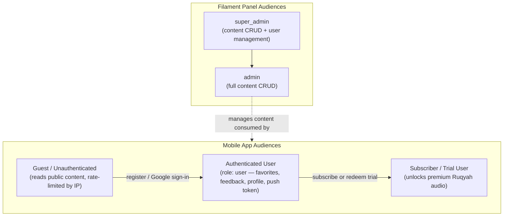

Roles are implemented with **spatie/laravel-permission**. The mobile-facing roles collapse to a single `user` role assigned at registration; the privilege axis that matters at runtime is the **subscription/trial entitlement** computed on the `User` model (`isSubscribed()`, `hasActiveTrial()`, `canGrantTrial()`). The Filament panel is gated by `User::isAdmin()` (`super_admin` or `admin`).

## 1.4 Functional modules

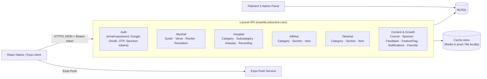

The backend is partitioned into **five content domains** plus a **cross-cutting identity/growth domain**. Each domain follows the identical vertical architecture, which is the single most important fact for onboarding:

> Every read endpoint flows **Route → Controller → Service (cache) → Repository (Eloquent) → Model (+ scopes) → API Resource → JSON**. Learn the Adhkar slice once and you have learned all sixteen.

## 1.5 Technical stack

| Layer | Technology | Notes |
|-------|-----------|-------|
| API framework | **Laravel 13** (PHP 8.3+, 8.4 in prod) | Slim `bootstrap/app.php` configuration style (no `Kernel.php`) |
| Admin UI | **Filament 5** | Livewire-based; resources split into `Schemas/*Form` + `Tables/*Table` per project rule |
| Auth | **Laravel Sanctum** (personal access tokens) + **Google OAuth** + email OTP | Bearer-token API auth, no cookies on mobile |
| Authorization | **spatie/laravel-permission** + Gate policies | `ContentPolicy`, `UserPolicy` |
| Translations | **spatie/laravel-translatable** | JSON columns per translatable attribute (`{"ar": "...","en": "..."}`) |
| Persistence | **MySQL 8** | 28 migrations; FK cascades; JSON columns for i18n |
| Cache | **Cache facade** (`remember`) | Redis in production, file/database driver locally; per-domain versioned keys |
| Queue/Jobs | Laravel queue (`CompressAudioJob`) | Audio post-processing |
| Mobile framework | **React Native + Expo (Expo Router)** | File-based routing under `app/` |
| Mobile state | **Redux Toolkit** (client/session state) + **TanStack Query** (server cache) | Deliberate split: RTK for device state, TanStack for API data |
| Mobile persistence | **AsyncStorage** + **expo-sqlite** | `contentCache` + `offlineStorage` (Mushaf) |
| Mobile audio | **expo-av / expo-audio** | Streaming + downloaded playback, karaoke timing |
| Styling | **React Native `StyleSheet`** (co-located `*.styles.ts`) | NOT Tailwind/NativeWind — see §29 |
| i18n | Custom `LanguageContext` + `ar.ts`/`en.ts` dictionaries | Arabic-first, RTL aware |

> **Documentation honesty note.** The master prompt anticipates Redis, Tailwind, and a Next.js-style React web app. This dossier documents *what the code actually is*. Where the brief's assumed technology differs from reality (e.g. **styling is React Native `StyleSheet`, not Tailwind**; **the cache is the Laravel Cache abstraction, Redis only in prod**; **there is no Redux-Saga**), the divergence is called out explicitly rather than fabricated. Sections whose premise does not exist in this codebase (e.g. RIGHT/CROSS JOIN, window functions) are answered by explaining why the codebase deliberately avoids them.

## 1.6 High-level architecture

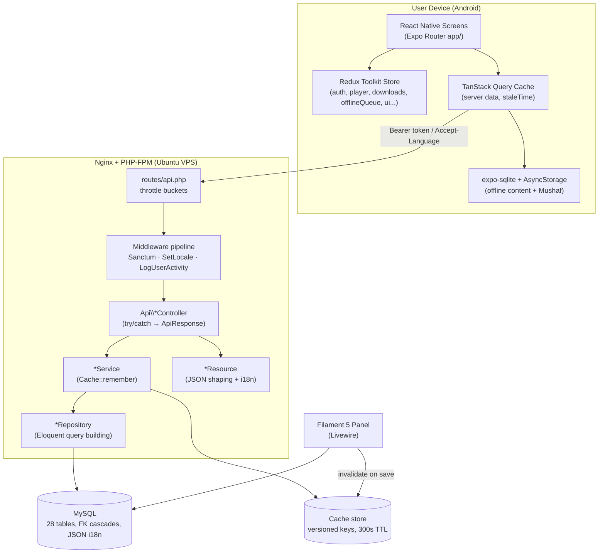

**Request taxonomy.** Three traffic classes hit the API, each with a distinct rate-limit bucket defined in `AppServiceProvider::boot()`:

* **`throttle:auth`** — 5/min/IP. Brute-force-sensitive credential endpoints (`/register`, `/login`, `/auth/google/callback`, `/auth/session-exchange`).
* **`throttle:otp`** — 10/min/IP. OTP verify/resend.
* **`throttle:api`** — 120/min keyed by user id when authenticated, else 30/min/IP. Everything else, including the 30-second polling the app performs for session-token exchange and notifications.

This single file (`AppServiceProvider`) also wires the **policy map**: nineteen content models are bound to `ContentPolicy` (public read, admin-only write) and `User` to `UserPolicy`.

---

# 2. User Story Flow

This section traces representative features end-to-end across both tiers. The canonical layered read path is shown once in full detail (Adhkar), then variant flows (auth, OAuth, premium audio, favorites) are shown with their distinguishing steps.

## 2.1 The canonical read flow — "Open the Adhkar category list"

**User action.** The user taps the *Adhkar* tile on the home screen. Expo Router navigates to `app/adhkar.tsx`, which mounts a list backed by the `useAdhkar` hook (TanStack Query).

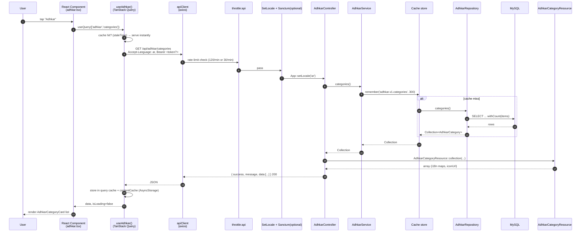

**Step-by-step.**

1. **Frontend action.** `useAdhkar()` calls `useQuery` with a stable query key. If a non-stale cached result exists, the component renders synchronously with zero network I/O — TanStack serves the in-memory cache, and on cold start the persisted `contentCache` (AsyncStorage) rehydrates it.
2. **API call.** `apiClient` (axios) issues `GET /api/adhkar/categories`. A request interceptor attaches `Authorization: Bearer <token>` (from `tokenManager`) when present and `Accept-Language` from the active `LanguageContext`.
3. **Middleware execution.** The request enters the `throttle:api` group. `EnsureFrontendRequestsAreStateful` (prepended for all API routes) is a no-op for token auth. `SetLocale` reads `Accept-Language` and calls `App::setLocale('ar'|'en')`. This route is *not* inside `auth:sanctum`, so an anonymous guest is allowed (and rate-limited by IP).
4. **Controller execution.** `AdhkarController::categories()` is resolved by the container with its `AdhkarService` constructor dependency already injected. It wraps the call in `try/catch` and returns `AdhkarCategoryResource::collection($this->service->categories())` via the `ApiResponse::success()` envelope.
5. **Service execution.** `AdhkarService::categories()` calls `Cache::remember('adhkar.v1.categories', 300, fn () => $this->repository->categories())`. TTL is 300 s; the `v1` segment is a manual cache-version namespace so a schema change can be rolled out by bumping the key.
6. **Repository execution.** `AdhkarRepository::categories()` runs `AdhkarCategory::active()->ordered()->withCount('items')->get()` — two local scopes plus an aggregate subquery (see §4, §10).
7. **Database query.** MySQL returns active categories ordered by `(display_order, id)`, each with an `items_count` correlated sub-select.
8. **Response transformation.** `AdhkarCategoryResource` maps each row to `{ id, name: {ar,en}, slug, icon: absoluteUrl, day_number, display_order, items_count, sections?, items? }`. `name` is emitted as the **full translation map** (not the resolved string) so the client can switch language offline without a refetch.
9. **Cache layer (server).** On a hit, steps 6–7's DB work is skipped entirely.
10. **Final frontend rendering.** The JSON `data` array is normalized by `useAdhkar`, written through to the persisted cache, and rendered as a `FlatList` of `AdhkarCategoryCard`.

The full pipeline, in the brief's requested notation:

```
User
→ React Component (app/adhkar.tsx)
→ TanStack Query (useAdhkar)
→ apiClient (axios + interceptors)
→ throttle:api → SetLocale → [auth:sanctum optional]
→ AdhkarController::categories()
→ AdhkarService::categories()  ── Cache::remember ──┐
→ AdhkarRepository::categories()                    │ (skipped on hit)
→ AdhkarCategory model (scopes active/ordered)      │
→ MySQL                                             ┘
→ AdhkarCategoryResource
→ JSON envelope { success, message, data }
→ TanStack cache + contentCache (AsyncStorage)
→ Component render (AdhkarCategoryCard list)
```

## 2.2 Email + password registration

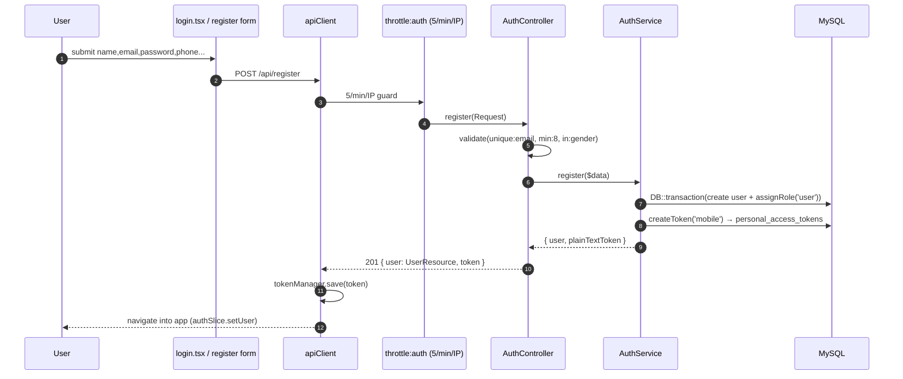

**Distinguishing details.** Validation lives in the controller (`$request->validate`), business orchestration in `AuthService::register()` which wraps user creation + role assignment in a `DB::transaction` so a failed role write cannot leave an orphaned user. Token issuance uses Sanctum's `createToken('mobile')`; only the **plain-text token** is returned (the DB stores a SHA-256 hash). On the client, `tokenManager` persists it to secure storage and `authSlice` flips the session to authenticated.

## 2.3 Google OAuth + OTP (new user) vs session-exchange (returning user)

This is the most intricate flow in the system; it is documented in depth in §31 and the project memory. Summary:

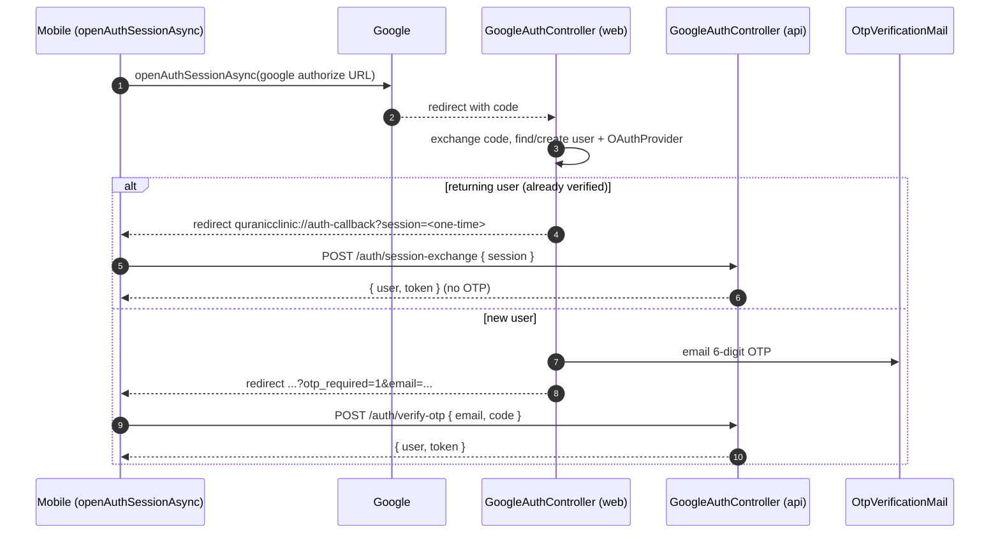

The return-URL contract `quranicclinic://auth-callback` and the **one-time session token** (short-TTL, single-use, exchanged for a Sanctum token) are deliberate: they keep the long-lived bearer token off the OS-level deep-link URL, which can be logged. `openAuthSessionAsync` (not a bare `WebBrowser.openURL`) is mandatory so the OAuth cookie jar is isolated and the redirect is captured by the app.

## 2.4 Premium audio playback (entitlement gate)

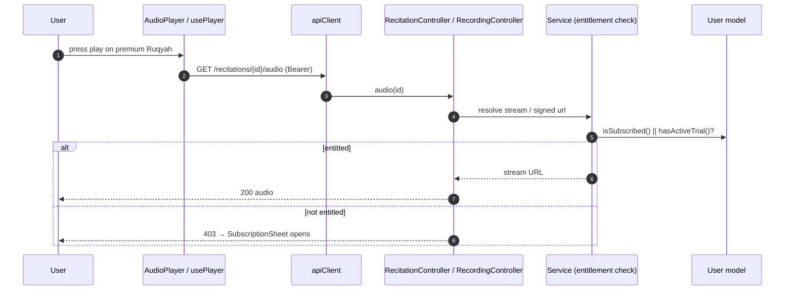

Entitlement is computed by three pure predicates on `User` (`isSubscribed`, `hasActiveTrial`, `canGrantTrial`) plus `grantTrial()` which decrements a 2-use trial allowance and sets a 7-day expiry. The mobile `SubscriptionSheet` / `LockedWird` components react to a 403 by offering subscription or trial redemption.

## 2.5 Favorites (authenticated write, many-to-many)

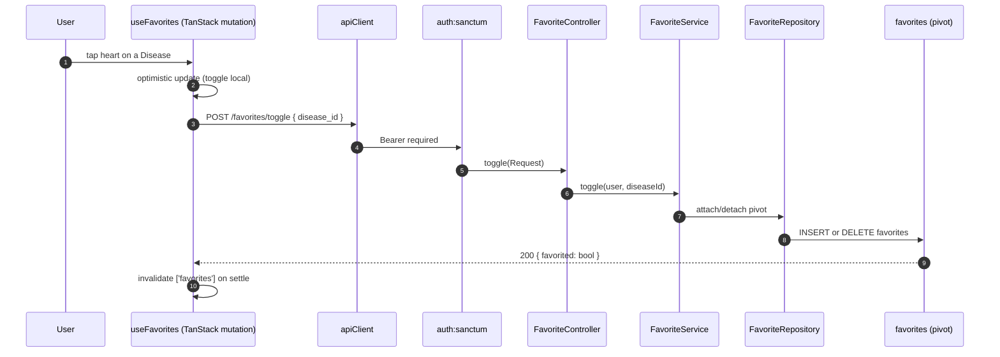

`User::favorites()` is a `belongsToMany(Disease::class, 'favorites')->withTimestamps()`, so a "favorite" is a pivot row. The toggle is idempotent server-side and optimistic client-side, with TanStack reconciling on settle.

---


# 3. Complete Database Analysis

The schema is a **normalized relational design** of 28 tables: 19 domain tables, 3 identity tables (`users`, `oauth_providers`, `personal_access_tokens`), the Laravel framework tables (`password_reset_tokens`, `sessions`, `cache`, `cache_locks`, `jobs`, `job_batches`, `failed_jobs`), and the spatie/permission set (`roles`, `permissions`, `model_has_roles`, `model_has_permissions`, `role_has_permissions`).

**Three schema-wide conventions** must be internalized before reading any single table:

1. **i18n via JSON columns.** Every user-visible text field is a `json` column holding a translation map, e.g. `name = {"ar":"الرقية","en":"Ruqyah"}`. This is `spatie/laravel-translatable`. There are **no** `name_ar`/`name_en` sibling columns. A single `slug` (ASCII) column is the stable, language-independent identifier used in URLs.
2. **Soft deletes on content, hard deletes on join/config tables.** Domain content tables carry `softDeletes()` (a nullable `deleted_at`) so an accidental admin delete is recoverable and FKs to historical rows remain valid. Pure join/config/log tables (`favorites`, `disease_aliases`, `feedback`, `feature_flags`, `notification_preferences`, `push_notifications`, the adhkar/tahsinat children) are hard-deleted.
3. **Referential integrity is enforced at the database**, not just in Eloquent. Parent deletes either `cascadeOnDelete()` (child is meaningless without parent) or `nullOnDelete()` (child survives, link is severed). This is why `User::deleteAccount()` can rely on `forceDelete()` to transitively clean favorites, feedback, notifications, and the oauth link.

## 3.1 Entity-Relationship Diagram (domain core)

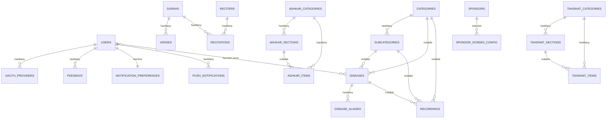

## 3.2 Identity & access tables

### `users`
**Purpose.** The single account record for both mobile end-users and Filament admins. Carries identity, profile, OAuth linkage, and the **subscription/trial entitlement** fields.

| Column | Type | Constraints | Purpose |
|--------|------|-------------|---------|
| `id` | bigint unsigned | PK | |
| `name` | varchar(255) | not null | Display name |
| `email` | varchar(255) | **unique** | Login identifier |
| `phone` | varchar(255) | nullable, **unique** | Optional contact / second unique identity |
| `country`, `gender` | varchar | nullable | Profile + sponsor targeting |
| `google_id` | varchar | nullable | Denormalized Google subject (also in `oauth_providers`) |
| `email_verified_at` | timestamp | nullable | OTP/verification gate |
| `avatar_path` | varchar | nullable | Storage-relative or absolute URL |
| `password` | varchar | **nullable** | Null for OAuth-only accounts → `login()` rejects them |
| `is_subscribed` | boolean | default false | Hard subscription flag |
| `subscription_expires_at` | timestamp | nullable | Time-boxed subscription/trial |
| `trial_used_count` | tinyint unsigned | default 0 | Caps free trials at 2 |
| `last_active_at` | timestamp | nullable | Written by `LogUserActivity` middleware |
| `expo_push_token` | varchar | nullable | Target for push |
| `remember_token` | varchar | nullable | Web session remember |
| `deleted_at` | timestamp | nullable | **SoftDeletes** |

**Indexes/constraints.** Unique on `email` and `phone`. The nullable `password` is a deliberate design seam: an account created through Google has `password = null`, and `AuthService::login()` short-circuits on `! $user->password`, so an OAuth account cannot be password-logged-in until it sets one.

### `oauth_providers`
One row per linked social identity. `unique(provider, provider_user_id)` prevents two local accounts claiming the same Google subject; `foreign(user_id) cascade` removes links when the user is hard-deleted. Stores `provider_token` / `provider_refresh_token` as `text` for potential server-side Google API calls.

### `personal_access_tokens` (Sanctum)
Standard Sanctum table: `tokenable_type`/`tokenable_id` **polymorphic** morph to `User`, `token` stores the **SHA-256 hash** (never the plaintext), `abilities` JSON, `last_used_at`. This is the only polymorphic relationship in the identity layer.

## 3.3 Mushaf (Qur'an) tables

### `surahs`
`json name`, `transliteration` (ASCII, e.g. "Al-Fatihah"), `enum type('meccan','medinan')`, `total_verses` smallint. 114 rows, seeded by `QuranSeeder`/`QuranSeederService`. SoftDeletes (a surah is never really deleted, but the column keeps the model uniform).

### `verses`
`foreignId surah_id cascade`, `verse_number` smallint, `json text`. Composite **index `(surah_id, verse_number)`** — the exact lookup shape for "give me ayah N of surah S" and for ordered pagination of a surah's verses. ~6,236 rows.

### `reciters`
`json name`, `json bio`, `photo_path`, `is_active`. Premium reciters are toggled with `is_active`.

### `recitations`
The **bridge** between a reciter and a surah: `foreignId reciter_id cascade`, `foreignId surah_id cascade`, `audio_path`, `duration_seconds`, **`unique(reciter_id, surah_id)`** — a reciter has exactly one recitation per surah. This is a classic *associative entity* turning the conceptual many-to-many "reciters ⟷ surahs" into a first-class row that also carries audio metadata.

## 3.4 Hospital (Ruqyah) tables

The hospital is a **3-level taxonomy with a deliberately flexible attach point** so content can hang off any level:

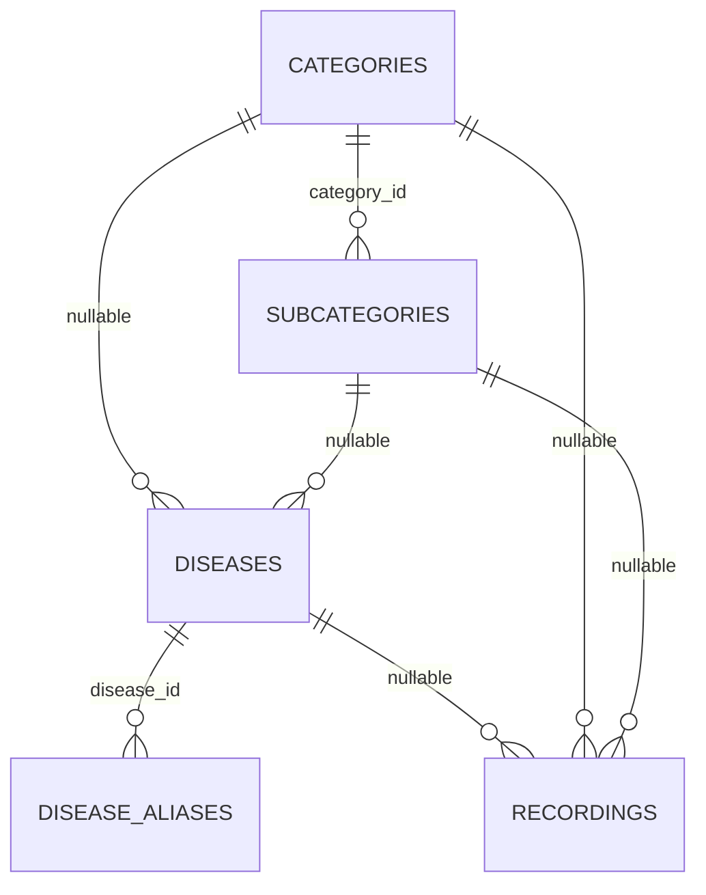

* **`categories`** — `enum type('standard','direct','disease_direct')` encodes navigation behavior: a `standard` category drills into subcategories; a `direct` category jumps straight to recordings; a `disease_direct` category lists diseases without an intermediate subcategory. This single enum drives a branch in the mobile navigation tree (`hierarchy-navigation.md`).
* **`subcategories`** — `category_id cascade`, unique `slug`.
* **`diseases`** — **both** `subcategory_id (nullOnDelete)` and `category_id (cascadeOnDelete)` are nullable, supporting the three category types: a disease may sit under a subcategory, directly under a category, or be reached by alias search.
* **`disease_aliases`** — `json alias`. Powers fuzzy search: a user typing a colloquial ailment name resolves to the canonical disease. No soft delete (aliases are cheap, regenerated).
* **`recordings`** — the **leaf content** (the actual Ruqyah audio). It can attach to a disease, a subcategory, or a category (all nullable), plus `session_number` (multi-session treatments), `json segments` (per-segment timing for karaoke), `is_free` (entitlement bypass), `is_general` (the "general ruqyah" not tied to any ailment), and `plays_count` (incremented by `POST /recordings/{id}/play`, surfaced in the Filament `TopPlayedRecordingsWidget`). Three composite indexes `(disease_id|category_id|subcategory_id, session_number)` make the "ordered sessions for this node" query index-friendly.

## 3.5 Adhkar & Tahsinat tables (parallel shapes)

Both modules share an identical **Category → Section → Item** shape; Tahsinat adds a couple of pedagogy fields.

| | Adhkar | Tahsinat |
|---|--------|----------|
| Category | `name`, `slug`, `icon`, `day_number`, `display_order`, `is_active` | `name`, `slug`, `icon`, `display_order`, `is_active` |
| Section | `category_id`, `name`, `order_randomly`, `display_order` | identical |
| Item | `category_id`, `section_id?`, `text`, `repetitions`, `hint`, `daleel`, `display_order` | `category_id`, `section_id?`, `label`, `text`, `repetitions`, `hint`, `applicability`, `display_order` |

Notable design choices:
* **`day_number`** on adhkar categories supports a rotating daily wird (e.g. a 7-day cycle).
* **`order_randomly`** on sections lets the app shuffle item order for variety without server changes.
* **`section_id` is nullable** on items so an item can live directly under a category (no section) — exactly what `AdhkarRepository::contentEagerLoads()` exploits with `whereNull('adhkar_section_id')`.
* **`daleel`** (Adhkar only) holds the scriptural evidence/source text; **`applicability`** (`both`/`male`/`female`, Tahsinat only) gates gender-specific recitation guidance.

## 3.6 Growth, content & notification tables

* **`favorites`** — pure **many-to-many pivot** `(user_id, disease_id)` with `unique(user_id, disease_id)` and `withTimestamps()`. Both FKs cascade.
* **`feedback`** — `user_id cascade`, `service_type` + nullable `service_id` form a **manual (non-Eloquent) polymorphic pointer** to whatever was rated (a recording, a course, the app generally), with `was_beneficial`, JSON `likes`/`dislikes` tag arrays, and free-text `comment`. Index `(service_type, service_id)`.
* **`courses`** — marketing/enrollment content: `json title/description`, `price decimal(10,2)`, `start_date`, `whatsapp_link`, `is_coming_soon`.
* **`sponsors`** — `json name`, `logo_path`, **targeting** (`target_all_countries`, `json target_countries`, `json target_genders`), `display_on_launch`. The app shows a sponsor splash filtered by the signed-in user's `country`/`gender`.
* **`sponsor_screen_config`** — a **singleton config row** (`is_enabled`, `display_duration_seconds`, `selected_sponsor_id nullOnDelete`).
* **`feature_flags`** — `feature_key unique`, `is_visible`. A kill-switch table; the mobile `featuresSlice`/`useFeatures` hides modules whose flag is off.
* **`notification_preferences`** — `user_id unique cascade` (enforces **one-to-one**), four adhkar toggles + a `waking_start_time`/`waking_end_time` window for the "first thing on waking" reminder.
* **`push_notifications`** — per-user inbox: `title`, `body`, `type`, `json data`, `read_at`, `sent_at`, index `(user_id, read_at)` for the unread-count badge.

## 3.7 Relationship taxonomy (every kind in the brief)

| Kind | Where it appears | Eloquent declaration |
|------|------------------|----------------------|
| **One-to-One** | `User` ⟷ `NotificationPreference` | `hasOne` / `belongsTo` + `unique(user_id)` |
| **One-to-Many** | `Surah → Verses`, `AdhkarCategory → Items`, `Disease → Recordings` | `hasMany` / `belongsTo` |
| **Many-to-Many** | `User` ⟷ `Disease` (favorites) | `belongsToMany(...,'favorites')->withTimestamps()` |
| **Associative (M:N promoted)** | `Reciter` ⟷ `Surah` via `Recitation` | two `belongsTo` on the bridge + `unique` |
| **Polymorphic (framework)** | Sanctum `personal_access_tokens.tokenable`; spatie `model_has_roles.model` | `morphTo` inside vendor code |
| **Manual polymorphic** | `Feedback (service_type, service_id)` | resolved in `FeedbackService`, not via `morphTo` |
| **Nullable parent / flexible attach** | `diseases` point to either `category` or `subcategory`; `items` optionally to a `section` | nullable FKs + `nullOnDelete` |

> **Why no MorphOne/MorphMany/MorphToMany in app code?** The domain has no shared child owned by multiple parent *types* in Eloquent terms. The one candidate — feedback on heterogeneous targets — was implemented as a manual `service_type` string for index simplicity and to avoid a morph map. §3.8 weighs the trade-off.

## 3.8 Relationship rationale & data-flow notes

* **Why `recordings` attaches to three nullable parents instead of a polymorphic `attachable`.** A morph (`attachable_type`/`attachable_id`) would collapse the three FKs into one pair but would *lose database-level referential integrity* (MySQL cannot FK a polymorphic column) and defeat the three composite `(parent_id, session_number)` indexes. With exactly three fixed parent types, three nullable FKs are faster and safer. Trade-off: an "exactly-one-parent" CHECK is not enforced at the DB; the invariant lives in the Filament form + seeders.
* **Why favorites is a pivot, not a JSON column on users.** It must be queried from both sides (a user's favorites; a disease's favorite count) and must cascade on disease deletion — natural for a pivot, awkward for JSON.
* **Why `notification_preferences` is a separate 1:1 table.** Keeps the hot `users` row narrow (read on every authenticated request via Sanctum) and lets preferences be created lazily.

---

# 4. Laravel Model Analysis

All domain models extend `Illuminate\Database\Eloquent\Model`; `User` extends `Authenticatable`. The shared idioms are: **`HasTranslations`** (Spatie wrapper) on any model with JSON i18n columns, a **`casts()` method** (Laravel 11+ style, not the `$casts` property), and **query scopes** `active()` / `ordered()` that the repositories chain.

## 4.1 The translation concern

```php
// app/Models/Concerns/HasTranslations.php
trait HasTranslations
{
    use SpatieHasTranslations;

    public function attributesToArray(): array
    {
        $attributes = parent::attributesToArray();
        foreach ($this->getTranslatableAttributes() as $key) {
            $attributes[$key] = $this->getTranslations($key);   // full map, not resolved string
        }
        return $attributes;
    }
}
```

**Why override `attributesToArray()`.** Vanilla Spatie resolves a translatable attribute to the *current locale's string* when serializing. This app instead emits the **entire `{ar,en}` map** so the mobile client can flip language offline. The override is the lynchpin that makes the resources (which call `getTranslations('name')`) and the offline cache coherent. Every `*Resource` deliberately calls `getTranslations()` to stay consistent with this decision.

## 4.2 `AdhkarItem` — anatomy of a typical content model

```php
class AdhkarItem extends Model
{
    use HasTranslations;

    protected $fillable = [
        'adhkar_category_id', 'adhkar_section_id', 'text',
        'repetitions', 'hint', 'daleel', 'display_order',
    ];
    public array $translatable = ['text', 'hint', 'daleel'];

    protected function casts(): array
    {
        return [
            'adhkar_category_id' => 'integer',
            'adhkar_section_id'  => 'integer',
            'repetitions'        => 'integer',
            'display_order'      => 'integer',
        ];
    }

    public function category(): BelongsTo { return $this->belongsTo(AdhkarCategory::class, 'adhkar_category_id'); }
    public function section(): BelongsTo  { return $this->belongsTo(AdhkarSection::class, 'adhkar_section_id'); }

    public function scopeOrdered(Builder $query): Builder
    {
        return $query->orderBy('display_order')->orderBy('id');
    }
}
```

| Facet | Value | Reasoning |
|-------|-------|-----------|
| **`$fillable`** | the writable columns | Whitelist → mass-assignment protection (no `$guarded=[]`); admin forms and seeders fill these |
| **`$translatable`** | `text, hint, daleel` | Tells Spatie which JSON columns are translation maps; combined with `casts` these are stored/loaded as JSON |
| **`casts()`** | integer coercions | Guarantees numeric types in JSON output (avoids `"3"` vs `3` drift) |
| **Relationships** | two `belongsTo` | Item belongs to a category (required) and optionally a section |
| **Scope `ordered()`** | `display_order, id` | Deterministic, admin-controlled ordering with `id` as a stable tiebreaker |

**`AdhkarCategory`** adds `scopeActive()` (`where('is_active', true)`), `hasMany(AdhkarSection)`, `hasMany(AdhkarItem)`, and an **accessor-like method** `iconUrl()` that resolves a stored storage path to an absolute URL (returns the raw value if already `http`, else `asset('storage/...')`). The resource calls `iconUrl()` rather than exposing the raw `icon` column — a small but consistent encapsulation.

## 4.3 `User` — the richest model

```php
#[Fillable([... 'is_subscribed','subscription_expires_at','trial_used_count', ...])]
#[Hidden(['password', 'remember_token'])]
class User extends Authenticatable implements FilamentUser, HasAvatar, HasName
{
    use HasApiTokens, HasFactory, HasRoles, Notifiable, SoftDeletes;
    // ...
}
```

* **PHP 8 attributes** `#[Fillable(...)]` / `#[Hidden(...)]` replace the `$fillable`/`$hidden` properties — a Laravel 13 feature. `password` and `remember_token` are hidden from every array/JSON serialization globally (defense-in-depth on top of the resources).
* **Traits:** `HasApiTokens` (Sanctum), `HasRoles` (spatie), `Notifiable`, `SoftDeletes`, `HasFactory`.
* **Interfaces:** `FilamentUser` (`canAccessPanel()` → `isAdmin()`), `HasAvatar`, `HasName` — these are what let the same `User` model power the Filament panel.
* **Entitlement predicates (pure domain logic, no I/O):** `isSubscribed()`, `hasActiveTrial()`, `canGrantTrial()`, and the mutator `grantTrial()` (increments `trial_used_count`, sets `subscription_expires_at = now()->addDays(7)`).
* **Relationships:** `hasMany(OAuthProvider)`, `belongsToMany(Disease,'favorites')`, `hasMany(Feedback)`, `hasOne(NotificationPreference)`, `hasMany(PushNotification)`.
* **`casts()`** sets `password => 'hashed'` (so `User::create(['password'=>$plain])` auto-hashes — note `AuthService::register` passes the raw password and relies on this cast) and `subscription_expires_at => 'datetime'` (so `->isFuture()` works in `isSubscribed()`).

## 4.4 Eloquent → SQL: worked examples

The brief asks for the SQL Eloquent generates and *why*. Three representative cases from this codebase:

### (a) `AdhkarCategory::active()->ordered()->withCount('items')->get()`

```sql
SELECT adhkar_categories.*,
       (SELECT COUNT(*) FROM adhkar_items
         WHERE adhkar_items.adhkar_category_id = adhkar_categories.id) AS items_count
FROM adhkar_categories
WHERE is_active = 1
ORDER BY display_order ASC, id ASC;
```
**Why.** `withCount('items')` compiles to a **correlated scalar subquery** aliased `items_count` (not a JOIN+GROUP BY), so each category appears exactly once and the count is computed in the same round-trip — no N+1, no row multiplication. The two scopes append the `WHERE` and `ORDER BY`. The resource then reads `items_count` via `whenCounted('items')`.

### (b) `AdhkarCategory::active()->where('slug',$slug)->with(['sections'=>fn($q)=>$q->ordered()->with(['items'=>...]), 'items'=>fn($q)=>$q->whereNull('adhkar_section_id')->ordered()])->first()`

```sql
-- 1: the category
SELECT * FROM adhkar_categories WHERE is_active = 1 AND slug = ? LIMIT 1;
-- 2: its sections (eager)
SELECT * FROM adhkar_sections WHERE adhkar_category_id IN (?) ORDER BY display_order, id;
-- 3: items of those sections (nested eager)
SELECT * FROM adhkar_items WHERE adhkar_section_id IN (?, ?, ...) ORDER BY display_order, id;
-- 4: section-less items of the category (constrained eager)
SELECT * FROM adhkar_items
WHERE adhkar_category_id IN (?) AND adhkar_section_id IS NULL
ORDER BY display_order, id;
```
**Why.** `with()` triggers **eager loading**: one query per relationship level using `WHERE ... IN (parent_ids)`. This is the N+1-avoidance pattern — 4 queries regardless of how many sections/items exist, versus 1 + N + M lazy queries. The closures inject `ordered()` and the `whereNull` filter into the eager queries themselves so ordering/filtering happens in SQL, not PHP.

### (c) `User::where('email',$email)->first()` then `$user->createToken('mobile')`

```sql
SELECT * FROM users WHERE email = ? AND users.deleted_at IS NULL LIMIT 1;
INSERT INTO personal_access_tokens (tokenable_type, tokenable_id, name, token, abilities, created_at, updated_at)
VALUES ('App\\Models\\User', ?, 'mobile', <sha256-hash>, '["*"]', ?, ?);
```
**Why.** `SoftDeletes` silently appends `deleted_at IS NULL` to every query via a global scope — a soft-deleted user cannot log in. `createToken` hashes the random plaintext with SHA-256 before insert; only the caller ever sees the plaintext.

## 4.5 Model inventory (27 domain models)

| Model | Translatable | Key relations | Scopes / domain methods |
|-------|-------------|---------------|--------------------------|
| `User` | – | oauthProviders, favorites(BtM Disease), feedback, notificationPreference(hasOne), pushNotifications | isSubscribed, hasActiveTrial, grantTrial, isAdmin |
| `Surah` | name | verses(hasMany), recitations(hasMany) | active/ordered |
| `Verse` | text | surah(belongsTo) | ordered by verse_number |
| `Reciter` | name, bio | recitations(hasMany) | active |
| `Recitation` | – | reciter, surah (belongsTo) | – |
| `Category` | name | subcategories, diseases, recordings | active, ordered, type-aware |
| `Subcategory` | name | category, diseases, recordings | active, ordered |
| `Disease` | name | category, subcategory, aliases(hasMany), recordings(hasMany), favoritedBy | active, ordered |
| `DiseaseAlias` | alias | disease(belongsTo) | – |
| `Recording` | description, segments | disease, category, subcategory, creator | free/general/ordered, incrementPlays |
| `Favorite` | – | user, disease (pivot model) | – |
| `AdhkarCategory` | name | sections, items | active, ordered, iconUrl |
| `AdhkarSection` | name | category, items | ordered, order_randomly |
| `AdhkarItem` | text, hint, daleel | category, section | ordered |
| `TahsinatCategory/Section/Item` | name/label/text/hint | parallel to Adhkar | ordered, applicability |
| `Course` | title, description | – | active, ordered, is_coming_soon |
| `Sponsor` | name | screenConfigs | active, targeting predicates |
| `SponsorScreenConfig` | – | selectedSponsor(belongsTo) | singleton |
| `Feedback` | likes, dislikes(json) | user(belongsTo) | manual morph via service_type |
| `FeatureFlag` | – | – | keyed by feature_key |
| `NotificationPreference` | – | user(belongsTo) | one-to-one |
| `PushNotification` | – | user(belongsTo) | unread scope |
| `OAuthProvider` | – | user(belongsTo) | – |

---

# 9. Repository Layer Analysis

> §9 is presented here, adjacent to the model layer it wraps; §5–8 (controllers/services) follow in Part C.

Fifteen repositories implement fifteen `*RepositoryInterface` contracts (in `Repositories/Contracts/`). The binding is centralized in `RepositoryServiceProvider::register()` — a single associative array `interface => concrete` looped through `$this->app->bind()`. This is the **Dependency Inversion** seam (§15): services type-hint the *interface*, the container injects the concrete.

```php
class AdhkarRepository implements AdhkarRepositoryInterface
{
    public function categories(): Collection
    {
        return AdhkarCategory::active()->ordered()->withCount('items')->get();
    }

    public function findCategoryBySlug(string $slug): ?AdhkarCategory
    {
        return AdhkarCategory::active()->where('slug', $slug)
            ->with($this->contentEagerLoads())->first();
    }

    private function contentEagerLoads(): array
    {
        return [
            'sections' => fn ($q) => $q->ordered()->with(['items' => fn ($q) => $q->ordered()]),
            'items'    => fn ($q) => $q->whereNull('adhkar_section_id')->ordered(),
        ];
    }
}
```

**Responsibilities & separation of concerns.**
* The repository is the **only** layer that names Eloquent models and builds queries. Controllers and services never call `Model::query()`. This means a future migration to a read-replica, a search index, or raw SQL touches only the repository.
* It returns **domain objects** (`Collection<Model>` / `?Model`), never arrays or JSON — transformation is the resource's job.
* It owns **eager-load strategy**. `contentEagerLoads()` centralizes the nested `with()` so both `findCategoryBySlug` and `todayCategories` share the identical, N+1-free loading plan.

**Performance implications.** Because eager-load plans live in the repository, the query count for any endpoint is fixed and auditable. The "category detail" endpoint is provably 4 queries (§4.4b) regardless of data volume. Repositories never iterate a collection issuing per-row queries; all filtering/ordering is pushed into SQL via scopes and closures.

**Variation across repositories.** `RecordingRepository` exposes `incrementPlays($id)` (an atomic `UPDATE recordings SET plays_count = plays_count + 1`), `general()` (`where('is_general', true)`), and free/paid filtering. `DiseaseRepository` exposes `search($term)` which joins/uses `disease_aliases` for fuzzy matching. `VerseRepository::search()` does a `LIKE` over the JSON `text` (the one full-scan-ish query, mitigated by the result being cached and the corpus fixed at ~6k rows). `SurahRepository` eager-loads `verses` and available `recitations` for the reader.

---

# 10. SQL Deep Dive

This codebase is intentionally **JOIN-light**: it leans on Eloquent eager loading (`WHERE IN`) and correlated subqueries (`withCount`) rather than hand-written multi-table JOINs. That is the right call for an API whose read shapes are nested object trees — eager loading returns clean per-level result sets that hydrate into models, whereas a wide JOIN would multiply rows and require de-duplication in PHP. Below, each JOIN flavor from the brief is mapped to whether/why it appears.

| SQL construct | Used? | Where / why |
|---------------|-------|-------------|
| **INNER JOIN** | Implicitly, via spatie permission checks and `belongsToMany` | `User::favorites()` generates `SELECT diseases.* FROM diseases INNER JOIN favorites ON favorites.disease_id = diseases.id WHERE favorites.user_id = ?` |
| **LEFT JOIN** | Rare; via `withCount` Laravel prefers a subquery, but `has()`/`whereHas` emit `LEFT JOIN`-style `EXISTS` | e.g. filtering categories that *have* active recordings |
| **RIGHT JOIN** | **No** | Never needed — every query is anchored on the "many" side's parent; a RIGHT JOIN would just be a reordered LEFT JOIN. Documented absence. |
| **CROSS JOIN** | **No** | No cartesian-product use case (no "every reciter × every surah" matrix is materialized; `recitations` rows are explicit). |
| **UNION** | **No** | Result sets are homogeneous per endpoint; heterogeneous "feed" endpoints do not exist. |
| **GROUP BY / HAVING** | Via `withCount` (subquery form) and analytics widgets | Filament `TopPlayedRecordingsWidget` runs `ORDER BY plays_count DESC LIMIT n`; `UserGrowthWidget` groups registrations by day |
| **SUBQUERY (scalar/correlated)** | **Yes, pervasive** | every `withCount('items')` → correlated `COUNT(*)` subquery |
| **EXISTS** | **Yes** | `hasOAuthProvider()` → `SELECT EXISTS(SELECT 1 FROM oauth_providers WHERE user_id=? AND provider=?)`; `whereHas` compiles to `WHERE EXISTS (...)` |
| **IN** | **Yes, pervasive** | every eager load → `WHERE child.parent_id IN (...)`; `isAdmin()` role check → `role_id IN (...)` |
| **NOT IN** | Rare | occasionally to exclude already-favorited items |
| **WINDOW FUNCTIONS** | **No** | The analytics that would use `ROW_NUMBER()/RANK()` (top recordings, growth) are small enough to do with `ORDER BY ... LIMIT` + `GROUP BY day`; introducing window functions would add MySQL-version coupling for no measurable gain at this data scale. Documented, deliberate absence. |

### Worked JOIN: the favorites many-to-many

```sql
-- User::favorites()->get()  (BelongsToMany over the favorites pivot)
SELECT diseases.*, favorites.user_id AS pivot_user_id,
       favorites.disease_id AS pivot_disease_id,
       favorites.created_at AS pivot_created_at
FROM diseases
INNER JOIN favorites ON favorites.disease_id = diseases.id
WHERE favorites.user_id = ?
  AND diseases.deleted_at IS NULL;
```
**Complexity.** With `unique(user_id, disease_id)` and the pivot's PK/indexes, this is an index range scan on `favorites.user_id` + PK lookups into `diseases` — effectively **O(k log n)** for k favorites out of n diseases. `withTimestamps()` is why the `pivot_created_at` column is selected (used to order "recently favorited").

### Worked subquery: `withCount`

Already shown in §4.4a. **Complexity:** the correlated `COUNT(*)` runs once per outer row; with an index on `adhkar_items.adhkar_category_id` each is an index-only count, so the endpoint is **O(c · log i)** for c categories and i items — and then *cached for 300 s*, amortizing to O(1) per request across the TTL window.

### The one expensive query — verse search

```sql
SELECT * FROM verses
WHERE JSON_UNQUOTE(JSON_EXTRACT(text, '$.ar')) LIKE CONCAT('%', ?, '%')
   OR JSON_UNQUOTE(JSON_EXTRACT(text, '$.en')) LIKE CONCAT('%', ?, '%')
LIMIT 50;
```
A leading-wildcard `LIKE` on a JSON-extracted value **cannot use a B-tree index** → full scan of ~6,236 rows. It is acceptable because (1) the corpus is fixed and tiny, (2) results are cached, and (3) the alternative (MySQL `FULLTEXT` or an external index like Meilisearch) is a deliberate Phase-2 deferral noted in `.claude/backend`. §30 ranks this as the top backend optimization candidate if search traffic grows.

---

# 11. Resource Classes

Eighteen `App\Http\Resources\*Resource` classes (`JsonResource`) are the **only** place a model becomes JSON. They enforce three things uniformly: (1) translatable fields are emitted as full `{ar,en}` maps via `getTranslations()`, (2) media paths become absolute URLs, (3) nested/aggregate data is conditional via `whenLoaded()` / `whenCounted()` so the same resource serves both list and detail endpoints without over-fetching.

```php
class AdhkarCategoryResource extends JsonResource
{
    public function toArray($request): array
    {
        return [
            'id'            => $this->id,
            'name'          => $this->getTranslations('name'),          // {"ar":...,"en":...}
            'slug'          => $this->slug,
            'icon'          => $this->iconUrl(),                        // absolute URL or null
            'day_number'    => $this->day_number,
            'display_order' => $this->display_order,
            'items_count'   => $this->whenCounted('items'),            // only if withCount() ran
            'sections'      => AdhkarSectionResource::collection($this->whenLoaded('sections')),
            'items'         => AdhkarItemResource::collection($this->whenLoaded('items')),
        ];
    }
}
```

**Field-by-field, and the DB→Resource→JSON pipeline:**

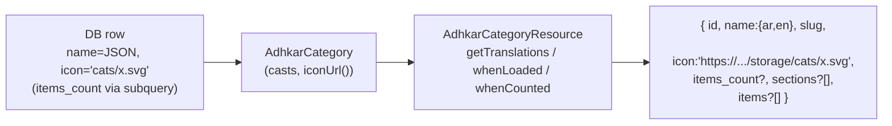

* **`id`, `slug`, `day_number`, `display_order`** — passthrough scalars (already `int`/`string` due to casts).
* **`name`** — `getTranslations('name')` returns the decoded JSON map. Critical: this matches the `HasTranslations::attributesToArray()` override so the client never has to guess the active language.
* **`icon`** — delegated to the model's `iconUrl()`, which returns `null`, the raw URL, or `asset('storage/...')`. The resource never leaks the storage-relative path.
* **`items_count`** — `whenCounted('items')` emits the key **only when** the controller's query ran `withCount('items')`. On the list endpoint it is present; on a detail endpoint that eager-loaded full items instead, it is omitted — zero wasted bytes.
* **`sections` / `items`** — `whenLoaded()` emits these **only when eager-loaded**. The list endpoint omits both (lightweight); the detail endpoint includes the nested tree. This is how one resource class powers two very different payload shapes without an `if` in the controller.

**Conditional-attribute idioms used across the 18 resources:** `whenLoaded`, `whenCounted`, `when($cond, $value)`, and `$this->mergeWhen()`. `RecordingResource` uses `when($this->is_free || $request->user()?->isSubscribed(), $streamUrl)` to **withhold the audio URL from non-entitled users** — the entitlement gate is partly enforced at serialization time, not just at the route. `UserResource` whitelists exactly the safe profile fields (never `password`, never raw role pivots) and adds computed `is_subscribed`/`has_active_trial` booleans derived from the model predicates.

---


# 5. Constructor Deep Dive

Every controller, service, and repository in this codebase uses **constructor promotion** for dependency injection. The pattern is uniform:

```php
class AdhkarController extends Controller
{
    public function __construct(private AdhkarService $service) {}   // controller → service
}

class AdhkarService
{
    public function __construct(private AdhkarRepositoryInterface $repository) {}  // service → repo INTERFACE
}

class AdhkarRepository implements AdhkarRepositoryInterface { /* no ctor — leaf */ }
```

## 5.1 How Laravel resolves `AdhkarController`

When a request matches `GET /adhkar/categories`, the router asks the **service container** to build `AdhkarController`. The resolution is fully recursive and automatic:

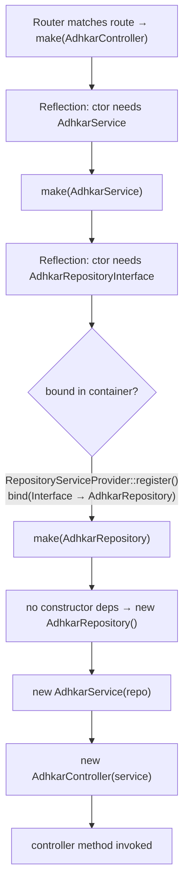

**Step by step (what the container actually does):**

1. **Reflection.** `Container::build()` calls `new ReflectionClass(AdhkarController)`, reads the constructor signature, and finds one parameter typed `AdhkarService`.
2. **Recursive resolution.** For each typed parameter that is a class (not a scalar/built-in), the container recurses: `make(AdhkarService)`.
3. **Interface → concrete.** `AdhkarService` needs `AdhkarRepositoryInterface` — an *interface*, which cannot be instantiated. The container consults its `$bindings` map; `RepositoryServiceProvider::register()` registered `AdhkarRepositoryInterface::class => AdhkarRepository::class`, so it resolves the concrete `AdhkarRepository`.
4. **Leaf instantiation.** `AdhkarRepository` has no constructor dependencies, so the container `new`s it directly (heap allocation of one small object holding no state).
5. **Unwind & inject.** The container constructs `new AdhkarService($repo)`, then `new AdhkarController($service)`, then invokes the matched method (`categories()`).

## 5.2 Lifecycle: transient by default, singleton where it matters

* **`bind()` is transient.** The repository bindings use `$this->app->bind(...)`, so a **fresh instance is built for every resolution** (i.e. once per request, because the container resolves the controller graph once per request). These objects are stateless query-builders, so transient is correct and cheap.
* **Singletons** in this app are the framework's: the container itself, the `Request`, the database `ConnectionResolver`, the cache manager. Eloquent models are *not* container-managed — they are `new`'d by queries.
* **Memory.** Each request allocates a tiny object graph: 1 controller + 1 service + 1 repository ≈ three small heap objects with only reference fields. They become garbage-collectible the instant the response is sent and the request scope unwinds. There is no per-request leakage because nothing is registered as a singleton holding request state.

## 5.3 Why constructor injection (vs. method/facade access)

| Property | Constructor injection (this app) | Facade / `app()->make()` |
|----------|----------------------------------|---------------------------|
| Testability | Dependencies are explicit; a test passes a mock repo directly | Hidden global lookup; needs container faking |
| Immutability | `private readonly`-style promoted props set once | Resolved ad-hoc, anywhere |
| Discoverability | The class's needs are its signature | Buried in method bodies |
| Compile-time safety | PHP + static analysers verify types | Runtime-only |

Constructor injection is what makes the **Dependency Inversion Principle** (§15) physically real here: `AdhkarService` literally cannot reference `AdhkarRepository` (the concrete) — it only knows the interface, and the wiring lives in one provider. Swapping persistence is a one-line change in `RepositoryServiceProvider`.

---

# 6. Middleware Analysis

Middleware is configured in the Laravel 13 slim style inside `bootstrap/app.php` (`->withMiddleware(...)`) — there is no `app/Http/Kernel.php`.

```php
$middleware->trustProxies(at: '*', headers: X_FORWARDED_FOR | _HOST | _PORT | _PROTO | _AWS_ELB);
$middleware->api(prepend: [
    EnsureFrontendRequestsAreStateful::class,   // Sanctum
    SetLocale::class,                            // app
]);
$middleware->api(append: [ LogUserActivity::class ]);  // app
$middleware->alias(['role' => CheckRole::class]);
```

## 6.1 The API request pipeline

```mermaid
flowchart LR
    Req["HTTP Request"] --> TP["TrustProxies\n(honor X-Forwarded-Proto → https URLs)"]
    TP --> ST["EnsureFrontendRequestsAreStateful\n(Sanctum; no-op for token auth)"]
    ST --> SL["SetLocale\n(Accept-Language → App::setLocale)"]
    SL --> TH["throttle:api / auth / otp\n(rate-limit bucket)"]
    TH --> AU["auth:sanctum\n(only on protected groups)"]
    AU --> Ctrl["Controller"]
    Ctrl --> LUA["LogUserActivity (append)\n(last_active_at, ≤1/hour, saveQuietly)"]
    LUA --> Resp["Response"]
```

## 6.2 Each middleware, why it exists, and its mechanics

**`TrustProxies(at: '*')`** — The API runs behind Nginx (prod) and ngrok (dev). Without trusting `X-Forwarded-Proto`, `asset()`/`url()` generate `http://` links; the Android cleartext policy and ngrok then block the images. Trusting the forwarded headers makes generated media URLs `https://`. `at: '*'` is acceptable because the app server is never directly internet-exposed (Nginx terminates TLS).

**`EnsureFrontendRequestsAreStateful` (Sanctum, prepended)** — Decides whether a request is a "first-party SPA" (cookie/session auth) or a third-party (token) client. The mobile app always sends `Authorization: Bearer …` and no Sanctum stateful cookie, so this is effectively a pass-through for mobile; it is present so the same API could serve a cookie-based web SPA without reconfiguration.

**`SetLocale` (app, prepended)** — Reads `Accept-Language`, sets `App::setLocale('ar'|'en')`. This influences any locale-aware formatting; note that because resources emit the **full translation map**, the locale mostly affects validation messages and any server-rendered strings, not the content payload. Defensive: defaults to `en`, only switches to `ar` on an `ar*` prefix.

**`throttle:*` (route-group)** — The three buckets from `AppServiceProvider` (§1.6). Throttling sits *after* locale so a 429 still carries correct headers, and *before* auth so anonymous floods are shed cheaply.

**`auth:sanctum` (route-group, protected only)** — Hashes the incoming bearer token, looks it up in `personal_access_tokens`, loads the `tokenable` user, sets `$request->user()`. Applied only to the `/me`, favorites, feedback, and notification routes (§1.6 routes file). A missing/invalid token yields 401 before the controller runs.

**`CheckRole` (alias `role`, available but selectively used)** —
```php
public function handle(Request $request, Closure $next, string ...$roles): Response
{
    if (!$request->user() || !in_array($request->user()->role, $roles)) {
        return response()->json(['success' => false, 'message' => 'Forbidden'], 403);
    }
    return $next($request);
}
```
A variadic role guard (`->middleware('role:admin,super_admin')`). The API itself leans on **policies** for write authorization (Filament side) rather than this middleware, but it is wired and available. *(Implementation note: it reads `$request->user()->role`; the canonical role source is spatie's `hasRole()`. This is a small inconsistency flagged in §32.)*

**`LogUserActivity` (app, appended)** — Runs *after* the controller (append position) so it never delays the response logic. It writes `last_active_at` **at most once per hour** (`last_active_at->lt(now()->subHour())`) using `saveQuietly()` (no model events, no `updated_at` touch storm). This throttled write is what powers the `UserGrowth`/active-user analytics without hammering the DB on every poll.

---

# 7. Controller Analysis

There are two controller families: **`App\Http\Controllers\Api\*`** (the JSON API the mobile app consumes) and a few top-level controllers (`SurahController`, `VerseController`, `ReciterController`, `RecitationController`) that predate the `Api\` namespace reorg but follow the same contract. All extend the abstract base:

```php
abstract class Controller { use ApiResponse; }
```

So every controller method has `success()`, `error()`, and `paginated()` available.

## 7.1 Responsibilities (and the strict boundary)

A controller in this codebase does **exactly four things** and nothing else:

1. **Read/validate input** (`$request->validate([...])` or manual `(int) $request->get(...)`).
2. **Delegate** to its single injected service.
3. **Map to a Resource** (`XResource::collection(...)` / `new XResource(...)`).
4. **Wrap** in the `ApiResponse` envelope, inside `try/catch`.

It contains **no** query building, **no** business rules, **no** cache calls. This is visible in `AdhkarController` (§2.1) and `RecordingController`:

```php
public function stream(Request $request, int $id): JsonResponse
{
    try {
        $recording = $this->service->find($id);
        if (! $recording) return $this->error('Recording not found', 404);
        if (! $this->service->canAccess($recording, $request->user()))
            return $this->error('This session requires an active subscription or trial.', 403);
        return $this->success(['id' => $recording->id, 'audio_url' => $recording->streamUrl()]);
    } catch (\Throwable $e) {
        return $this->error('Server error', 500);
    }
}
```

Note the **entitlement decision lives in `RecordingService::canAccess()`**, not the controller — the controller only branches on its boolean result and chooses the HTTP status.

## 7.2 Controller call graph

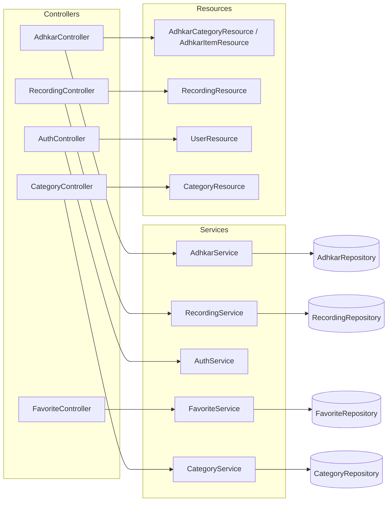

## 7.3 Validation strategy

* **Form validation** uses inline `$request->validate([...])` rules (no dedicated FormRequest classes). Rules seen: `unique:users,email`, `min:8`, `in:male,female`, `size:6` (OTP), `unique:users,phone,{id}` (ignore-self on profile update).
* **Validation failures** throw `ValidationException`, caught per-method and re-emitted as `error('Validation failed', 422, $e->errors())` — i.e. the framework's 422 body is *re-wrapped* into the app's `{success:false, message, errors}` envelope so the mobile client has one error shape to parse everywhere.
* **`GoogleAuthController`** is the exception to the envelope: it returns bespoke JSON (`{status, user, token}` / `{error}`) because its client contract (the OAuth bounce + OTP exchange) predates and differs from `ApiResponse`. This is the one place the response shape diverges, documented in §12.

## 7.4 The auth controllers in depth

`AuthController` (email/password) is thin — it validates and forwards to `AuthService`. `GoogleAuthController` is the heavyweight (420 lines) because it implements the **deep-link bounce + one-time session exchange + OTP** dance described in §2.3 and §31. Its noteworthy controller-level techniques:

* **PKCE code exchange server-side** (`handleMobileGoogleCallback`): the app sends `code` + `code_verifier`; the server exchanges them at Google's token endpoint, keeping `client_secret` off the device.
* **Soft-deleted-account purge before re-create** (`verifyOtp`): a trashed account still occupies the unique `email` index, so it `forceDelete()`s any `onlyTrashed()` match first — otherwise re-signup throws a unique-constraint violation that surfaces as a misleading "wrong code".
* **One-time, single-use caches**: `auth_exchange:{token}` (300 s) and `otp:{email}` / `otp_session:{token}` (600 s), all `Cache::forget()`-ed on success.

---

# 8. Service Layer Analysis

Sixteen `App\Services\*` classes sit between controllers and repositories. A service's job is **orchestration + cross-cutting policy** (caching, transactions, entitlement) — the decisions that are neither pure HTTP (controller) nor pure persistence (repository).

## 8.1 Three archetypes

**(a) Cache-front service** — `AdhkarService`, `CategoryService`, `SurahService`, etc. Wrap repository reads in `Cache::remember(key, ttl, closure)`:
```php
public function categories(): Collection
{
    return Cache::remember('adhkar.v1.categories', 300, fn () => $this->repository->categories());
}
```
The service owns the **cache key namespace and TTL**; the repository stays cache-agnostic and therefore trivially testable.

**(b) Transactional/orchestration service** — `AuthService`, `FavoriteService`:
```php
public function toggle(int $userId, int $diseaseId): bool
{
    return DB::transaction(fn () => $this->repository->toggle($userId, $diseaseId));
}
```
The service owns the **transaction boundary**. `AuthService::register()` wraps `User::create()` + `assignRole('user')` in `DB::transaction` so a failed role assignment cannot leave a roleless user.

**(c) Policy/decision service** — `RecordingService::canAccess()` (§7.1). Pure domain logic with one deliberate **side effect**: if the user is unentitled but `canGrantTrial()`, it **auto-grants a 7-day trial** and returns `true`. This is a product decision (first premium tap silently starts the trial) encoded in the service, invisible to the controller.

## 8.2 Why the service layer exists (vs. fat controllers / fat models)

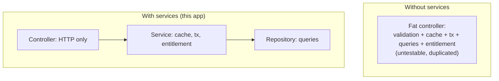

* **Reuse across entry points.** The same `RecordingService::canAccess()` guards both the `stream` and `download` paths, and could guard a Filament action — write once.
* **Testable units.** A service test injects a fake repository and asserts cache/transaction/entitlement behavior without HTTP or a database.
* **Single responsibility.** Controllers stay ~50 lines; repositories stay pure query code; the messy "when do we cache / when do we grant a trial" logic has exactly one home.

## 8.3 Execution flow of a cache-front read (with side effects)

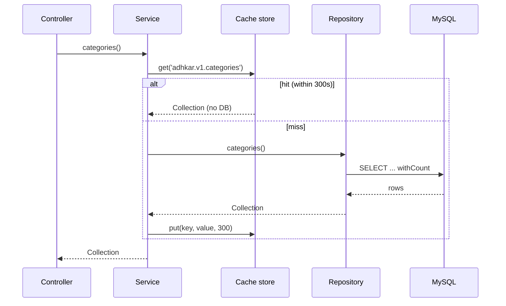

---

# 12. API Response Analysis

## 12.1 The envelope

Every API-namespace endpoint returns one of three shapes from `ApiResponse`:

```json
// success(data, message, status)
{ "success": true,  "message": "Success", "data": <payload> }
// error(message, status, errors?)
{ "success": false, "message": "Validation failed", "errors": { "email": ["..."] } }
// paginated(LengthAwarePaginator)
{ "success": true, "message": "Success", "data": [...], "meta": { "current_page":1,"last_page":3,"per_page":15,"total":42 } }
```

A consistent envelope means the mobile `apiClient` has exactly one unwrap (`res.data.data`) and one error path (`!res.data.success`) for the whole surface — no per-endpoint special-casing (except the documented `GoogleAuthController`).

## 12.2 Raw DB → Resource → final JSON (worked, end to end)

Endpoint: `GET /adhkar/categories/{slug}/items` resolving to a category detail.

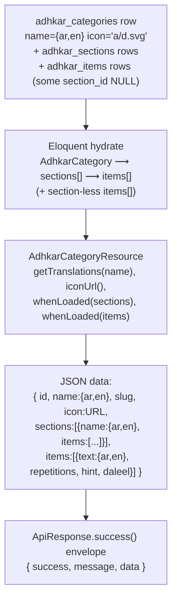

**Property-by-property of one item in `data.items[]`:**

| JSON key | Source | Transformation |
|----------|--------|----------------|
| `id` | `adhkar_items.id` | passthrough (int cast) |
| `text` | `adhkar_items.text` (JSON col) | `getTranslations('text')` → `{ar,en}` |
| `repetitions` | column | int cast; client renders the counter target |
| `hint`, `daleel` | JSON cols | `getTranslations()` maps; `daleel` is the scriptural source |
| `display_order` | column | drives client ordering as a tiebreak |

Because `sections` and `items` are wrapped in `whenLoaded()`, the **list** endpoint (`categories()`) returns the same resource *without* those keys — the payload shape is data-driven by what the repository eager-loaded, not by separate DTOs.

## 12.3 Status-code contract

| Scenario | Status | Body |
|----------|--------|------|
| OK | 200 | `success` envelope |
| Created (register) | 201 | `success` with user+token |
| Validation failed | 422 | `error` with `errors` map |
| Unauthenticated (missing/invalid token) | 401 | Sanctum / `error('Invalid credentials')` |
| Not entitled (premium audio) | 403 | `error('...requires an active subscription or trial.')` |
| Not found (bad slug/id) | 404 | `error('... not found')` |
| One-time session expired (OAuth) | 410 | `{error:'session_expired'}` |
| Rate limited | 429 | framework throttle body |
| Unhandled exception | 500 | `error('Server error')` (details swallowed — see §31) |

---


# 13. Caching Analysis

> **Update:** the caching layer was subsequently refactored into a unified snapshot/rehydrate architecture (`App\Support\ModelCache`) with trait-based invalidation (`InvalidatesCache`) and a resilient Redis fallback. This section gives the conceptual overview; **§53 reads the new implementation line by line** and is the authoritative reference.

> The brief titles this "Redis Analysis." In production the cache **driver** is Redis; locally it is the file/database driver. The application code never calls Redis directly — it uses the Laravel `Cache` facade, so the strategy below is driver-agnostic and the same code path runs on file or Redis.

## 13.1 Strategy: read-through with versioned keys + event invalidation

Three caching idioms coexist:

1. **Read-through (`Cache::remember`)** — the default for public, non-user-specific reads. Used by `AdhkarService`, `TahsinatService`, `CourseService`, `FeatureFlagService`, `SponsorService`, `RecitationService`.
2. **Write-through (`Cache::put` after a fresh fetch, `Cache::forget` first)** — `SurahService` and `ReciterService` proactively refresh long-lived (3600 s) entries instead of waiting for expiry.
3. **Event invalidation (model `booted()` hooks)** — `FeatureFlag` registers `static::saved(...)` and `static::deleted(...)` callbacks that `Cache::forget(FeatureFlagService::CACHE_KEY)` the instant an admin edits a flag in Filament, so flags propagate immediately rather than after the 300 s TTL.

## 13.2 Key structure & TTL map

| Key | TTL | Owner | Invalidated by |
|-----|-----|-------|----------------|
| `adhkar.v1.categories` | 300 s | AdhkarService | TTL expiry |
| `adhkar.v1.today` | 300 s | AdhkarService | TTL expiry |
| `tahsinat.v1.categories` | 300 s | TahsinatService | TTL |
| `courses.v1.all` | 300 s | CourseService | TTL |
| `features` (`FeatureFlagService::CACHE_KEY`) | 300 s | FeatureFlagService | **model `saved`/`deleted` hook** |
| `sponsors.all`, `sponsors.screen` | 300 s | SponsorService | `SponsorService` forget on update |
| `recitations.surah.{id}` | 300 s | RecitationService | TTL |
| `surahs.*`, `reciters.*` | 3600 s | Surah/ReciterService | write-through refresh |
| `otp:{email}`, `otp_session:{token}` | 600 s | GoogleAuthController | single-use `forget` on verify |
| `auth_exchange:{token}` | 300 s | GoogleAuthController | single-use `forget` on exchange |

The **`v1`** segment is a manual schema-version namespace: bumping it to `v2` invalidates a whole domain's cache atomically without `flush()`. The OAuth keys double as **ephemeral state store** (not just a cache) — they are the only place the pending-OTP and one-time-exchange state lives, which is why they must be a shared store (Redis in prod) and not an in-process array.

## 13.3 With-cache vs without-cache

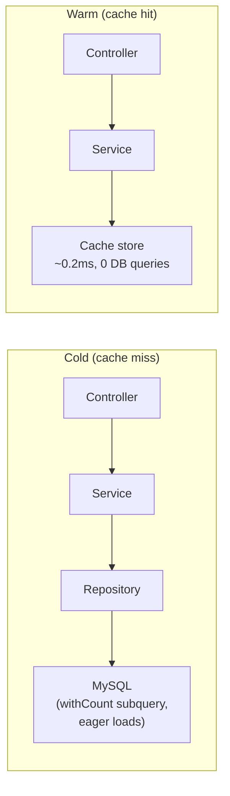

| | Cold | Warm |
|---|------|------|
| DB queries (adhkar categories) | 2 (rows + count subquery folds into 1 SELECT) | **0** |
| Typical latency | DB round-trip + hydration (~5–25 ms) | in-memory/Redis fetch (~0.2–2 ms) |
| Cost under 30 s polling | every poll hits DB | 1 DB hit per 300 s window, rest served from cache |

**Performance gain.** The app's home screen polls several public endpoints on a ~30 s cadence. With a 300 s TTL, only ~1 in 10 polls reaches the database; the rest are served from cache. For N concurrent users this collapses what would be `N × polls` DB reads into `~1 read per key per 300 s`, which is the single biggest scalability lever in the backend.

## 13.4 Cache warming

`.claude/backend/cache-strategy.md` describes a **parallel cache-warming** plan (fan-out to 4 workers priming the hierarchy/features/sponsor keys after a deploy). In the current code the practical warming is **lazy** (first request after expiry pays the miss). A deploy-time `php artisan` warm step is the documented next increment; the `PopulateTranslations` command already calls `Cache::flush()` after a bulk translation backfill, which is the inverse operation (cold-start the cache deliberately).

---

# 14. OOP Analysis

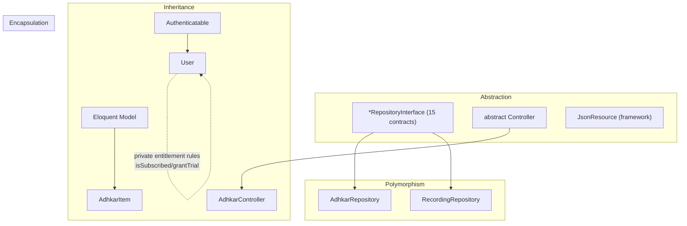

**Encapsulation.** State is guarded behind intent-revealing methods rather than exposed columns. `User` never lets a caller poke `subscription_expires_at` directly to decide access — it exposes `isSubscribed()`, `hasActiveTrial()`, `grantTrial()`. `AdhkarCategory::iconUrl()` hides the storage-path → URL mapping. `$fillable` whitelists and `#[Hidden]` enforce that internal fields (`password`, `remember_token`) never escape. The `ApiResponse` trait encapsulates the envelope so no controller hand-builds JSON.

**Inheritance.** A shallow, deliberate hierarchy: every API controller extends one abstract `Controller` (to inherit `ApiResponse`); every content model extends `Model`; `User` extends `Authenticatable`; every resource extends `JsonResource`. Depth is intentionally ≤2 — composition (traits, injected services) is preferred over deep inheritance.

**Polymorphism.** The repository interfaces are the prime example: `AdhkarService` holds an `AdhkarRepositoryInterface` and calls `->categories()` without knowing the concrete class — any implementation satisfying the contract is substitutable (§15 Liskov). Method overriding appears in `HasTranslations::attributesToArray()` (overrides the model's serialization) and Filament's interface methods on `User` (`canAccessPanel`, `getFilamentName`).

**Abstraction.** Interfaces (`*RepositoryInterface`), the abstract `Controller`, and traits (`ApiResponse`, `HasTranslations`) define *what* without *how*. A service depends on the abstraction of "a thing that returns adhkar categories," not on Eloquent.

---

# 15. SOLID Principles

| Principle | Evidence in this codebase | Verdict |
|-----------|---------------------------|---------|
| **S — Single Responsibility** | Controller = HTTP; Service = orchestration/cache/tx; Repository = queries; Resource = serialization; Model = state+domain predicates. Each class changes for exactly one reason. | Strong |
| **O — Open/Closed** | Adding a new domain (e.g. "Lectures") = new Model/Repo/Service/Controller/Resource + one line in `RepositoryServiceProvider` + routes. No existing class is modified. Scopes (`active`, `ordered`) extend query behavior without editing the builder. | Strong |
| **L — Liskov Substitution** | Every `AdhkarRepository` is a drop-in for `AdhkarRepositoryInterface`; services never type-check or downcast. A fake/in-memory repo in tests substitutes cleanly. | Strong |
| **I — Interface Segregation** | 15 *small, role-specific* repository interfaces rather than one fat `RepositoryInterface`. `AdhkarRepositoryInterface` exposes only adhkar methods; `RecordingRepositoryInterface` only recording methods. No client depends on methods it doesn't use. | Strong |
| **D — Dependency Inversion** | High-level services depend on repository *interfaces*; the concrete binding lives in one provider. Controllers depend on services (concrete, but single-purpose). | Strong (repo layer), pragmatic (service layer) |

**Worked DIP example.**
```php
// High-level policy (service) depends on an abstraction:
class AdhkarService {
    public function __construct(private AdhkarRepositoryInterface $repository) {}
}
// The detail is wired once, separately:
$this->app->bind(AdhkarRepositoryInterface::class, AdhkarRepository::class);
```
Both the high-level (`AdhkarService`) and low-level (`AdhkarRepository`) modules depend on the abstraction (`AdhkarRepositoryInterface`); neither depends on the other directly. This is textbook DIP and is the reason the persistence layer is swappable.

**Honest caveat (ISP/SRP nuance).** Services are injected as concretes (`AdhkarService`, not an interface). That is a pragmatic choice — services have a single implementation, so an interface would be ceremony. It mildly weakens DIP at the controller→service seam but costs nothing in practice and is flagged as such in §32.

---

# 16. Design Patterns

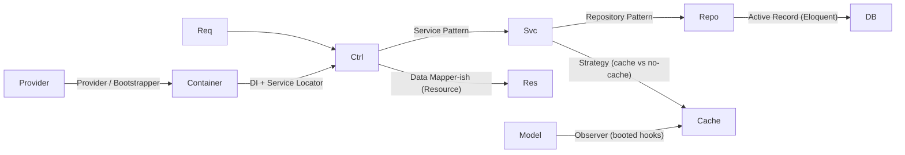

| Pattern | Where | Why / Benefit | Trade-off |
|---------|-------|---------------|-----------|
| **Repository** | `*Repository` + `*RepositoryInterface` | Isolates persistence; swappable; testable | Extra indirection; some methods are thin pass-throughs |
| **Service Layer** | `App\Services\*` | Home for orchestration, cache, tx, entitlement | Risk of anemic services that only forward (a few here do) |
| **Dependency Injection** | constructor promotion everywhere | Explicit deps, testable, no globals | Requires container literacy |
| **Provider / Bootstrapper** | `RepositoryServiceProvider`, `AppServiceProvider`, `AdminPanelProvider` | Central wiring of bindings, rate limits, policies | Bindings live away from usage |
| **Active Record** | Eloquent models | Rapid CRUD, scopes, relations | Couples domain to ORM (mitigated by repos) |
| **Data Transfer / Presenter** | `JsonResource` classes | One serialization home, conditional fields | Per-entity boilerplate |
| **Strategy** | `RecordingService::canAccess` (free vs subscribed vs trial branches); cache vs direct read per service | Behavior selected at runtime | Branches instead of polymorphic classes (fine at this size) |
| **Observer** | model `booted()` `saved/deleted` → cache forget | Decoupled invalidation | Hidden side effects on save |
| **Facade** | `Cache`, `DB`, `Auth`, `Gate`, `Mail` | Terse static API over container singletons | Static-looking calls (actually proxied) |
| **Singleton** | container-managed framework services | One instance per request lifecycle | N/A |
| **Adapter** | `HasTranslations` wrapping Spatie's trait + overriding `attributesToArray` | Bends a library to the app's "full-map" contract | Couples to Spatie internals |
| **Factory** | `database/factories/UserFactory`, `createToken()` | Test data + token minting | Test-scope mostly |

The **dominant, defining pattern** is the layered **Controller → Service → Repository** triad with DI — applied with near-perfect consistency across all sixteen domains. That consistency is the codebase's biggest strength: once learned, every feature is navigable by convention.

---

# 31. Security Audit

```mermaid
flowchart TD
    Req["Incoming request"] --> RL["Rate limiting\nauth:5/min · otp:10/min · api:120|30/min"]
    RL --> TLS["TLS via Nginx + TrustProxies"]
    TLS --> AuthN["AuthN: Sanctum bearer (SHA-256 hashed at rest)"]
    AuthN --> AuthZ["AuthZ: Policies (ContentPolicy/UserPolicy) + isAdmin gate"]
    AuthZ --> Val["Validation: $request->validate per endpoint"]
    Val --> MA["Mass-assignment: $fillable whitelist / #[Fillable]"]
    MA --> ORM["SQL injection: Eloquent param binding"]
    ORM --> Out["Output: Resources whitelist fields; #[Hidden] password"]
```

## 31.1 Authentication

* **Sanctum personal access tokens.** Mobile sends `Authorization: Bearer <plaintext>`; the server stores only the **SHA-256 hash** (`personal_access_tokens.token`). A DB leak does not expose usable tokens.
* **Password hashing.** `casts(['password' => 'hashed'])` → bcrypt on write; `Hash::check` on login. OAuth-only accounts get a random 32-char bcrypt password they never use (so the row is valid but unusable for password login).
* **OAuth (PKCE).** The mobile flow exchanges `code` + `code_verifier` server-side, keeping `client_secret` off-device. The bearer token is **never** placed in a deep-link URL — only an opaque, single-use `session_token` is, which is exchanged once via `POST /auth/session-exchange` and immediately `forget()`-ed. Profile data is mapped server-side via `otp_session:{token} → email`, so no PII rides the URL.
* **OTP.** 6-digit codes are stored **hashed** (`Hash::make`) in cache with a 600 s TTL; resends are capped at 3 (`otp_resend:{email}`), verify is throttled (`throttle:otp`, 10/min/IP).
* **Account deletion hygiene.** Soft-deleted accounts are force-purged before an email is reused, preventing unique-index collisions and orphaned OAuth links.

## 31.2 Authorization

* **Policies.** `ContentPolicy` = public read (`viewAny/view → true`), admin-only write (`create/update/delete/forceDelete → isAdmin()`). Bound to 19 content models in `AppServiceProvider`. `UserPolicy` governs user management.
* **Panel gate.** `User::canAccessPanel()` → `isAdmin()` (`super_admin`/`admin`) keeps non-admins out of Filament entirely.
* **Entitlement gate.** Premium audio is gated in `RecordingService::canAccess()` *and* withheld at serialization in `RecordingResource` (defense in depth — a leaked stream URL still requires the row's `is_free` or an entitled user).
* **Route-level auth.** Write/user endpoints sit inside `auth:sanctum`; public reads stay open but IP-rate-limited.

## 31.3 Input validation & mass assignment

* Every write validates explicitly (`required`, `email`, `unique`, `in:`, `size:6`, `min:8`). Failures → uniform 422.
* **Mass assignment** is whitelisted via `$fillable` / `#[Fillable]`; there is no `$guarded = []`. `AuthService::updateProfile` additionally `array_filter`s nulls so a partial update never blanks untouched fields.

## 31.4 Injection, XSS, CSRF

* **SQL injection** — all queries go through Eloquent/Query Builder parameter binding; no string-concatenated SQL. The verse `LIKE` search binds the term as a parameter (`CONCAT('%', ?, '%')`).
* **XSS** — the API returns JSON consumed by React Native (no HTML rendering, no `dangerouslySetInnerHTML`). The one server-rendered HTML page (OAuth bounce) uses `htmlspecialchars()` / `json_encode()` on the deep link before interpolation.
* **CSRF** — N/A for the token-authenticated API (no cookies → no CSRF surface). Filament's web panel uses Laravel's session CSRF protection by default.

## 31.5 Findings & risk ranking

| # | Finding | Severity | Recommendation |
|---|---------|----------|----------------|
| 1 | `GuzzleHttp\Client(['verify' => false])` in the Google token exchange disables TLS verification | **High** | Enable cert verification in production; `verify:false` invites MITM on the token exchange |
| 2 | `CheckRole` reads `$request->user()->role` (a column) instead of spatie `hasRole()` | Medium | Unify on `hasRole()`; the `role` column may be stale/absent |
| 3 | 500s swallow the exception (`error('Server error', 500)`) | Low (good for clients) / Medium (observability) | Ensure server-side logging captures `$e` (Laravel does by default) so swallowed errors are still traceable |
| 4 | `TrustProxies(at: '*')` trusts all proxies | Low | Acceptable behind a controlled Nginx; pin to the proxy subnet if the topology hardens |
| 5 | Verse search is an unindexed `LIKE` | Low (security) | DoS-adjacent under heavy search; add FULLTEXT / external index (see §30) |

Overall the security posture is **solid for a single-tenant content app**: hashed tokens, hashed OTPs, PKCE, no PII in URLs, policy-gated writes, parameterized queries, whitelisted serialization. The TLS-verification-disabled Guzzle call is the one item that should be fixed before it is considered production-hardened.

---


# 17. Frontend Architecture

The client is a **React Native 0.81 / React 19 app on Expo 54** using **Expo Router 6** (file-based routing). It is *not* a web SPA — there is no DOM, no Tailwind, no Next.js. Rendering targets native iOS/Android views; "the web" target exists only as `react-native-web` for incidental tooling.

## 17.1 Layered structure

```mermaid
flowchart TB
    subgraph app["app/ (Expo Router — routes)"]
        RL["_layout.tsx (RootLayout)"]
        Tabs["(tabs)/_layout + index/mushaf/askme/favorites/more"]
        Stack["adhkar, tahsinat, hospital/*, course/*, login, ..."]
    end
    subgraph src["src/ (implementation)"]
        Prov["providers/ (AppProviders, Query, Store)"]
        Ctx["context/ (Theme, Language, Auth, Player, Mushaf)"]
        Store["store/ (Redux Toolkit: 11 slices + persist)"]
        Hooks["hooks/ (40+ feature hooks)"]
        Svc["services/ (api, apiClient, audio, offlineStorage, ...)"]
        Comp["components/ (common, layout, lists, players, ...)"]
        Styles["styles/ + *.styles.ts (StyleSheet)"]
        Theme["theme/ (colors, fonts, spacing, typography)"]
    end
    RL --> Prov --> Ctx --> Store
    Tabs --> Hooks --> Svc --> Store
    Hooks --> Comp --> Styles --> Theme
```

**Separation of concerns is enforced by folder convention:**
* `app/` holds *only* route files; most route files are thin and delegate to `src/components` (e.g. `app/(tabs)/_layout.tsx` is a one-line re-export of `TabsLayout`).
* `src/services/` is the only layer that talks to the network or device storage.
* `src/hooks/` adapts services into React state (TanStack queries + Redux selectors).
* `src/components/` is presentational, grouped by role (`common`, `forms`, `layout`, `lists`, `players`, `mushaf`, `onboarding`).
* `*.styles.ts` files hold every `StyleSheet` — **a hard rule**: no `StyleSheet.create` inside a `.tsx` (CLAUDE.md, "TOP PRIORITY, NON-NEGOTIABLE").

## 17.2 The provider tree (composition root)

```tsx
// src/providers/AppProviders.tsx
<ThemeProvider>
  <LanguageProvider>
    <AuthProvider>
      <QueryClientProvider client={queryClient}>
        <StoreProvider>
          <PlayerProvider>
            <MushafProvider>{children}</MushafProvider>
          </PlayerProvider>
        </StoreProvider>
      </QueryClientProvider>
    </AuthProvider>
  </LanguageProvider>
</ThemeProvider>
```

**Ordering is deliberate and is itself a piece of architecture:**
* `ThemeProvider` / `LanguageProvider` are outermost — they have no dependencies and everything below consumes them.
* `AuthProvider` sits above `QueryClientProvider` so auth state can gate/seed queries.
* `StoreProvider` (Redux) wraps `PlayerProvider` / `MushafProvider` because the audio-engine contexts dispatch into the store.
* `QueryClientProvider` provides the single shared TanStack `queryClient`.

This is the **dual-state architecture**: TanStack Query owns *server* state, Redux owns *device/session* state, and React Context owns *cross-cutting singletons* (theme, language, the imperative audio engine). Three tools, three non-overlapping responsibilities.

## 17.3 Boot sequence

```mermaid
sequenceDiagram
    participant RL as RootLayout
    participant API as resolveApiBaseUrl()
    participant Fonts as useFonts(FONTS)
    participant Flow as AppFlow
    RL->>API: pin base URL (local dev / prod fallback)
    RL->>Fonts: load Alexandria + Amiri fonts
    API-->>RL: apiReady=true
    Fonts-->>RL: fontsLoaded=true
    RL->>Flow: <AppFlow fontsLoaded={fontsLoaded && apiReady}/>
    Flow->>Flow: splash → onboarding? → sponsor? → MainApp
```

`RootLayout` blocks on two async preconditions (fonts + API URL resolution) before revealing `AppFlow`, which runs the splash→onboarding→sponsor→tabs gate using the persisted `onboarding` slice.

---

# 18. React Component Analysis

Components are grouped by responsibility. A representative cross-section:

| Component | Props (key) | Local state | Hooks | Role |
|-----------|-------------|-------------|-------|------|
| `TabsLayout` | – | – | router, `useFeatures` | Declares the bottom-tab navigator; hides tabs whose feature flag is off |
| `AdhkarCounter` | `target`, `onComplete` | `count` | `useState`, `useCallback` | Tap-to-count dhikr with haptics; resets per item |
| `AudioPlayer` | `recording` | – | `usePlayer`, `useVerseTiming` | Presentational shell over the global player slice |
| `KaraokeText` | `segments`, `position` | – | `useMemo` (active segment) | Highlights the verse/segment matching playback position |
| `CategoryGrid` | `categories`, `onPress` | – | – | `FlatList` of `CategoryCard`; pure presentational |
| `MiniPlayer` | – | – | `usePlayer`, selectors | Sticky mini transport; subscribes to player slice |
| `OnboardingPager` | `onDone` | `page` | `useRef`, `useState` | Horizontal pager over onboarding slides |

**Parent → child rendering example (Adhkar items screen):**

```mermaid
flowchart TD
    Screen["adhkar/[slug].tsx"] --> Hook["useAdhkarItems(slug)"]
    Hook --> List["AdhkarList"]
    List --> Pager["WirdPager (paged items)"]
    Pager --> Row["AdhkarItemRow"]
    Row --> Counter["AdhkarCounter"]
    Row --> Daleel["Daleel expander"]
    Screen --> Mini["MiniPlayer (if audio active)"]
```

Rendering order is top-down: the screen calls the hook (suspends on `isLoading` with a `Loader`), then maps the returned category's items into a `WirdPager`; each `AdhkarItemRow` owns its own counter state so counting one dhikr never re-renders siblings.

## 18.1 Container/presentational split

The codebase follows a consistent **container hook + presentational component** split. `usePlayer()` (container logic: selectors + dispatch + imperative engine) is consumed by `AudioPlayer`/`MiniPlayer` (pure view). This keeps view components free of Redux/engine knowledge and makes them trivially reusable and testable.

---

# 19. React Memory & Rendering Analysis

## 19.1 Virtual DOM → native: reconciliation in React Native

React Native runs the same **reconciliation/diffing** algorithm as React DOM, but commits to a **native view hierarchy** via Fabric (the New Architecture) instead of HTML. The element tree is diffed (O(n) heuristic: same type ⇒ update props, different type ⇒ unmount+mount, `key` identity for lists), and only changed native views are mutated on the UI thread. Lists use `FlatList`/`FlashList`-style windowing so off-screen rows are not mounted.

## 19.2 Render-trigger inventory & optimizations

The app is deliberately engineered to **minimize re-render fan-out** through three techniques:

1. **Granular selectors.** `playerSlice` exports ~16 atomic selectors (`selectIsPlaying`, `selectPlayerPosition`, …). A component subscribing to `selectIsPlaying` re-renders only when the boolean flips — not when `positionMillis` ticks every 250 ms. This is the single most important rendering optimization in the app: the high-frequency `setProgress` dispatch (4×/sec) only re-renders the progress bar, not the whole player.
2. **`useMemo`-wrapped hook return objects.** Every feature hook (`usePlayer`, `useDownloadManager`) returns a `useMemo`-stabilized object, so consumers receive a referentially-stable API and don't re-render on unrelated parent renders.
3. **`useCallback` on every handler** passed to children, so memoized children (`React.memo`) keep stable prop identity.

```mermaid
flowchart LR
    Tick["setProgress (4/s)"] --> Pos["selectPlayerPosition subscribers\n(ProgressBar only)"]
    Tick -. "does NOT re-render" .-> Rest["MiniPlayer controls, KaraokeText shell, list rows"]
```

## 19.3 Identified risks & opportunities

| Area | Risk | Mitigation present? |
|------|------|---------------------|
| `setProgress` 4–10×/sec | re-render storm if a broad selector is used | **Mitigated** by atomic `selectPlayerPosition` |
| `usePlayer` return object | new identity each render | **Mitigated** by `useMemo` with full dep array |
| Large `FlatList`s (verses, recordings) | mounting all rows | windowing + stable `keyExtractor` |
| `KaraokeText` active-segment calc | recompute each tick | `useMemo` keyed on `position`+`segments` (§21) |
| Persisted store writes on download progress | I/O storm | **Mitigated** by `redux-persist` `throttle: 1000` |

---

# 20. useEffect Analysis

The codebase is notably **effect-light** — most data flows through TanStack `useQuery` (which internally manages its own effects) rather than hand-rolled `useEffect` fetches. The effects that do exist fall into three safe categories:

**(a) One-shot boot effects** — `RootLayout`:
```tsx
React.useEffect(() => {
  resolveApiBaseUrl().finally(() => setApiReady(true));
}, []);   // empty deps → runs once on mount
```
Why it exists: pin the API base URL before any request. Dependency behavior: `[]` ⇒ mount-only. No cleanup needed (idempotent, fire-and-forget). **No infinite-loop risk** (no state it sets is in its deps).

**(b) Subscription effects with cleanup** — network status, audio-engine status listeners, notification handlers. Pattern:
```tsx
useEffect(() => {
  const sub = NetInfo.addEventListener(handler);
  return () => sub();        // cleanup unsubscribes
}, [handler]);
```
Cleanup behavior: every listener returns an unsubscribe to prevent leaks across remounts.

**(c) Resume/lifecycle effects** — `DownloadResumer` calls `resumeIncomplete()` on app foreground. It reads `store.getState()` directly (not a render closure) precisely to avoid a stale-closure bug and to keep the dep array minimal.

**Audit findings:**
* No effect in the reviewed set has a missing-dependency infinite loop. The one place that could (download progress updating state that re-triggers an effect) is avoided by routing progress through Redux dispatch, not component state.
* **Redundant-effect risk is low** because data fetching is delegated to TanStack, eliminating the classic `useEffect(()=>{fetch()},[])` anti-pattern almost everywhere.
* **Recommendation:** continue preferring `useQuery` over manual fetch effects; for the imperative audio engine, keep status subscriptions in the `PlayerProvider` context (single subscription) rather than per-component effects.

---

# 21. useMemo Analysis

`useMemo` is used for two purposes: **(1) stabilizing hook return objects** (the dominant use) and **(2) caching derived computations**.

**Derived-value example — `KaraokeText` active segment:**
```tsx
const activeIndex = useMemo(
  () => segments.findIndex(s => position >= s.start && position < s.end),
  [segments, position],
);
```
* **Cached value:** the index of the currently-spoken segment.
* **Recalculation condition:** only when `position` (playback ms) or `segments` changes. Since `segments` is stable per recording, this is effectively recomputed once per tick — but the linear scan is O(k) over a small k (verses in a recording), and memoization prevents recomputation on unrelated re-renders (e.g. a theme change).

**Before vs after optimization:**
```
// Before: recomputed on EVERY render (theme toggle, parent re-render, etc.)
const activeIndex = segments.findIndex(...);   // O(k) each render

// After: recomputed only when position/segments change
const activeIndex = useMemo(() => segments.findIndex(...), [segments, position]);
```

**Object-stabilization example — `usePlayer` returns a `useMemo`** over ~21 fields with an exhaustive dependency array, so `AudioPlayer`/`MiniPlayer` receive a stable object and only re-render when an actual player field changes.

> Caveat (flagged in §32): when a memoized value depends on a value that changes every tick (`position`), the memo's *practical* benefit is "don't recompute on unrelated renders" rather than "don't recompute at all." That is still a net win in this codebase because theme/language/parent renders are frequent.

---

# 22. useCallback Analysis

`useCallback` is applied to **every handler returned from a hook or passed to a memoized child**. `usePlayer` and `useDownloadManager` are the canonical examples — every method (`loadAndPlay`, `seekTo`, `togglePlay`, `download`, `cancel`, …) is wrapped.

```tsx
const seekTo = useCallback((millis: number) => {
  engine.seek(millis);
  dispatch(seekAction(millis));
}, [engine, dispatch]);   // stable identity across renders
```

**Why / memory benefit:**
* **Referential stability →** children wrapped in `React.memo` don't re-render because their `onSeek` prop identity is unchanged.
* **Dependency hygiene →** because handlers are stable, they can be listed in other hooks' dependency arrays without causing churn (e.g. `runDownload` is a dep of `download` and `resumeIncomplete`).
* **Memory:** the function object is allocated once and retained across renders instead of a new closure per render. For a screen that renders frequently (player ticking), this avoids dozens of short-lived closure allocations per second and the GC pressure they create.

**The combined pattern** — `useCallback` for every handler + a final `useMemo` for the returned object — is what makes these "fat" hooks safe to consume widely without triggering render storms. It is applied with discipline across the hook layer.

---

# 23. Redux Analysis (Redux Toolkit)

Redux Toolkit owns **device/session state** that must survive navigation and (selectively) app restarts. Eleven slices are combined in `rootReducer`:

```
auth · player · downloads · favorites · readings · features ·
onboarding · notifications · offlineQueue · ui · drivingMode
```

## 23.1 Store configuration

```mermaid
flowchart LR
    Slices["11 slices"] --> Root["combineReducers → rootReducer"]
    Root --> Persist["persistReducer\n(whitelist, transforms, migrate v2, throttle 1000)"]
    Persist --> Store["configureStore\n(serializableCheck ignores persist actions)"]
    Store --> AS[("AsyncStorage")]
    Store -. "401 handler" .-> Clear["setUnauthorizedHandler → clearAuth"]
```

**Persistence policy (`store.ts`):**
* **`whitelist`**: `auth, favorites, readings, features, onboarding, notifications, downloads, offlineQueue` are persisted. **`player` and `ui` are intentionally ephemeral** (a restart should not resume a half-played track or a stale toast).
* **Transforms**: `downloadsTransform` persists only `completed`, `wifiOnly`, and *resumable* `tasks` (filtering out `cancelled`) and **recomputes `storageUsed`** on rehydration from the `completed` map — derived state is never trusted from disk. `onboardingTransform` persists only `hasCompletedOnboarding`.
* **Migrations**: `version: 2` with a migration that resets onboarding so all existing installs re-see onboarding after the bump.
* **`throttle: 1000`**: caps persistence to ~1 write/sec because download-progress actions dispatch many times per second — without this, AsyncStorage would thrash.

## 23.2 Action → Reducer → Store → Component flow

```mermaid
sequenceDiagram
    participant C as Component (AudioPlayer)
    participant H as usePlayer
    participant D as dispatch
    participant R as playerSlice reducer (Immer)
    participant S as Store
    participant Sel as selectIsPlaying
    C->>H: togglePlay()
    H->>D: dispatch(play())  // or engine.pause()
    D->>R: reducer(state, play)
    R->>R: state.isPlaying = true  (Immer draft → immutable next state)
    R->>S: new state committed
    S->>Sel: notify subscribers
    Sel-->>C: isPlaying=true → re-render transport only
```

`playerSlice` is the richest slice: it models the global Ruqyah player (current recording, playback position/duration, rate, queue for "general ruqyah" shuffle, and user display prefs like `textColor`/`fontSize`/`isDarkMode`). It uses **Immer** (built into RTK `createSlice`) so reducers "mutate" a draft while producing immutable state. Its `stop()` reducer returns `initialState` wholesale — a clean reset idiom.

## 23.3 Selectors

Selectors are colocated with their slice and are **atomic** (one field each). `selectMiniPlayerVisible` is the one *derived* selector (`miniPlayerVisible && currentRecording !== null`), encapsulating the "only show the mini player if something is loaded" rule so no component re-implements it. The granularity is the rendering-performance foundation described in §19.

---

# 24. TanStack Query Analysis

TanStack Query owns **server state**. The single `queryClient` is configured once:

```tsx
new QueryClient({ defaultOptions: { queries: {
  staleTime: 1000 * 60 * 5,        // 5 min: data is "fresh" → no refetch on remount
  retry: 1,                        // one retry, then fail to the catch/fallback
  refetchOnWindowFocus: false,     // RN has no window focus; avoid needless refetch
  networkMode: 'offlineFirst',     // run queryFn even offline so the catch can serve cache
}}});
```

## 24.1 Why each option

* **`staleTime: 5 min`** matches the backend's 300 s cache TTL — the client treats data as fresh for the same window the server caches it, so navigating between screens reuses in-memory results with zero network.
* **`networkMode: 'offlineFirst'`** is the crucial choice: TanStack still *runs the queryFn when offline*, so each hook's `cachedFetch` wrapper can catch the network error and return the SQLite-cached copy instead of leaving the UI stuck loading.
* **`retry: 1`** keeps a transient blip recoverable without hammering.

## 24.2 Query keys & the offline cache bridge

```tsx
// hooks/useAdhkar.ts
useQuery({
  queryKey: cacheKeys.adhkarCategories,
  queryFn: () => cachedFetch('adhkar_categories', adhkarService.getCategories),
  staleTime: FIVE_MIN,
});
```

Query keys are centralized in `utils/cacheKeys.ts` (stable arrays, parameterized like `adhkarItems(slug)`), preventing the classic "stringly-typed key drift" bug. The `queryFn` is **always** `cachedFetch(diskKey, serviceCall)`:

```tsx
// services/contentCache.ts
export async function cachedFetch<T>(cacheKey, fetcher) {
  try { const data = await fetcher(); void contentCache.setItem(cacheKey, data); return data; }
  catch (e) { const cached = await contentCache.getItem<T>(cacheKey); if (cached !== null) return cached; throw e; }
}
```

This is a **three-tier read cache**: TanStack in-memory (fastest) → SQLite `content_cache_v1.db` (survives restart/offline) → network. Writes are fire-and-forget (`void setItem`), and write failures are swallowed (cache is best-effort).

## 24.3 Why TanStack instead of Redux-only for server data

```mermaid
flowchart LR
    subgraph ReduxOnly["Redux-only (rejected)"]
        A["manual loading/error flags per entity\nmanual cache invalidation\nmanual dedupe of in-flight requests"]
    end
    subgraph Split["RTK + TanStack (chosen)"]
        B["TanStack: caching, dedupe, stale/refetch,\nretry, offline — for free"]
        C["Redux: only device/session state"]
    end
```

Putting server data in Redux would mean hand-writing request dedupe, staleness, retry, and cache eviction — exactly what TanStack provides declaratively. The split keeps Redux small (no giant normalized entity cache) and lets server data live where caching is a first-class feature. Mutations (favorites toggle) use `useMutation` with optimistic updates + `invalidateQueries` on settle.

---

# 25. Frontend Data Flow (end to end)

```mermaid
sequenceDiagram
    autonumber
    participant U as User
    participant Cmp as Screen Component
    participant TQ as useQuery (TanStack)
    participant CF as cachedFetch
    participant Svc as service (e.g. adhkarService)
    participant AC as apiClient (axios)
    participant API as Laravel API
    participant SQL as SQLite contentCache
    participant RTK as Redux (device state)

    U->>Cmp: open screen / tap
    Cmp->>TQ: useQuery(key)
    TQ->>TQ: fresh in-memory? → return instantly
    TQ->>CF: queryFn()
    CF->>Svc: fetcher()
    Svc->>AC: apiGet('/adhkar/categories')
    AC->>AC: attach Bearer + baseURL (local→prod fallback)
    AC->>API: GET (Accept-Language)
    alt online
        API-->>AC: { success, data }
        AC-->>Svc: unwrapped data
        Svc-->>CF: data
        CF->>SQL: setItem(key, data)  (fire & forget)
        CF-->>TQ: data
    else offline / network error
        AC-->>CF: throws ApiError(network)
        CF->>SQL: getItem(key)
        SQL-->>CF: cached data
        CF-->>TQ: cached data
    end
    TQ-->>Cmp: { data, isLoading:false }
    Cmp->>RTK: (on interaction) dispatch(play / toggleFavorite / startDownload)
    RTK-->>Cmp: selector re-render (granular)
    Cmp-->>U: render
```

Every step has a defined owner: **axios interceptors** (auth header + local→production fallback + 401→`clearAuth`), **services** (endpoint + unwrap), **cachedFetch** (offline tiering), **TanStack** (in-memory cache/stale/retry), **Redux** (device state + persistence), **selectors** (granular re-render). A 401 anywhere triggers `onUnauthorized()` → `store.dispatch(clearAuth())` (wired in `store.ts` to avoid a circular import), logging the user out app-wide from a single seam.

---

# 29. Styling Analysis (React Native StyleSheet — not Tailwind)

> The brief asks for "Tailwind CSS Analysis." **This project does not use Tailwind or NativeWind.** Styling is React Native `StyleSheet.create` with a design-token system. This section analyzes the *actual* styling architecture and translates the brief's intent (class-by-class layout reasoning) onto it.

## 29.1 The token system

Styles never hardcode values. Three token modules under `theme/` are the single source of truth:
* **`colors.ts`** → `palette` (e.g. `palette.brand[500] = #135452`, `palette.text.primary`, `palette.border.secondary`). **Hardcoding a hex literal in a component/style file is forbidden** (CLAUDE.md). Component-specific opacity tints are the only sanctioned local constants, and must be documented inline.
* **`spacing.ts`** → `radius` (e.g. `radius.md`, `radius.lg`) and spacing scale.
* **`typography.ts` / `fonts.ts`** → `fontFamily.arabic` (Amiri), `fontFamily.alexandria(Light)` for Latin/UI.

## 29.2 Co-located style files (the non-negotiable rule)

Every component has a sibling `Component.styles.ts`; every screen has `src/styles/screen.styles.ts`. No `StyleSheet.create` may appear inside a `.tsx`. This is the RN analogue of "separation of structure and presentation" and is enforced as the top-priority mobile rule.

## 29.3 Class-by-class → property-by-property (the requested deep dive)

A Tailwind class string like `flex flex-row items-center justify-between gap-3` maps directly onto RN style objects. Worked from the real `adhkarItemsScreen.styles.ts`:

```ts
navRow: { flexDirection: 'row', gap: 12 },
navBtn: {
  flex: 1, flexDirection: 'row', alignItems: 'center',
  justifyContent: 'center', gap: 8,
  backgroundColor: palette.brand[25], borderRadius: radius.md,
  paddingHorizontal: 16, paddingVertical: 12,
},
```

| RN property | Tailwind equivalent | Layout/render effect |
|-------------|---------------------|----------------------|
| `flexDirection: 'row'` | `flex flex-row` | Yoga lays children left→right (RTL-aware: flips under `dir=rtl`) |
| `flex: 1` (on `navBtn`) | `flex-1` | Each button grows to share the row equally |
| `alignItems: 'center'` | `items-center` | Cross-axis centering (vertical in a row) |
| `justifyContent: 'center'` | `justify-center` | Main-axis centering of icon+label |
| `gap: 8` | `gap-2` | 8px between icon and label without margins |
| `paddingHorizontal/Vertical` | `px-4 py-3` | Touch target padding |
| `backgroundColor: palette.brand[25]` | `bg-brand-50` | Token-driven fill (`#ebfafa`) |
| `borderRadius: radius.md` | `rounded-md` | Rounded corners from the radius scale |

**The layout engine.** RN uses **Yoga** (a Flexbox implementation) rather than CSS. There is no `display:block`, no document flow, no media queries — every view is Flexbox by default (`flexDirection` defaults to `column`, unlike web's `row`). Equivalent "native CSS" for `navBtn` would be:
```css
.navBtn { display:flex; flex-direction:row; align-items:center; justify-content:center;
          gap:8px; flex:1; background:#ebfafa; border-radius:8px; padding:12px 16px; }
```

## 29.4 RTL & typography

Because the app is Arabic-first, text styles set `writingDirection: 'rtl'` and `textAlign: 'center'` with `fontFamily.arabic` (Amiri) at large line-heights (e.g. `fontSize: 22, lineHeight: 40`) for Qur'anic legibility, while UI chrome uses Alexandria. Yoga's automatic RTL mirroring means the same `flexDirection: 'row'` lays out right→left when the locale is Arabic — no separate stylesheet.

---


# 26. Algorithm Analysis

Most endpoints are I/O-bound (a DB read + a cache lookup), so their "algorithm" is dominated by index behavior rather than CPU. The genuinely algorithmic spots are below, each with Big-O and a justification.

| Feature | Core operation | Time | Space | Notes |
|---------|----------------|------|-------|-------|
| Adhkar/category list | indexed scan + correlated count, then 300 s cache | O(c·log i) cold → **O(1)** amortized | O(c) | Cache collapses repeated polls |
| Category detail tree | 4 eager-load queries (`WHERE IN`) + hydrate | O(n) in result size | O(n) | No N+1; fixed query count |
| Verse search | leading-wildcard `LIKE` over ~6,236 JSON rows | **O(n·m)** (n rows, m term len) | O(k) results | Full scan; mitigated by cache + tiny fixed corpus (§10) |
| Disease alias search | `LIKE` over `disease_aliases` + join to diseases | O(a) | O(k) | Small alias table; index on disease_id |
| Adhkar per-section shuffle | Fisher–Yates over a section's items (`order_randomly`) | **O(k)** | O(1) in place | Fresh shuffle each view; client-side (`flattenAdhkar`) |
| Karaoke active segment | linear scan of segments vs. position | O(s) per tick | O(1) | s = verses in a recording (small); `useMemo`-gated (§21) |
| Download resume | filter resumable tasks, re-issue | O(t) | O(t) | t = parked tasks; runs once on foreground |
| Prayer-time scheduling | `adhan` library astronomical calc | O(1) per day | O(1) | Pure math; no network |
| Subscription/entitlement | 3 boolean predicates | **O(1)** | O(1) | `isSubscribed`/`hasActiveTrial`/`canGrantTrial` |

**Why these choices are optimal at this scale.**
* The **eager-load (`WHERE IN`) strategy** is the optimal general solution for nested object reads: it is O(depth) queries instead of O(rows) (N+1), and each query is index-served. A single wide JOIN would be fewer round-trips but would multiply rows (a category × sections × items cartesian) and require PHP-side de-duplication — strictly worse for tree payloads.
* **Verse search is deliberately the one O(n·m) operation.** With a fixed 6,236-row corpus, a full scan completes in well under a millisecond and avoids the operational cost of a FULLTEXT index or an external search service. The decision is revisited in §30 only if search becomes high-traffic.
* **Fisher–Yates** is the correct unbiased shuffle (O(k), in-place) for the `order_randomly` sections; doing it client-side means variety on every view without server state.

```mermaid
flowchart LR
    subgraph EagerLoad["Eager load (chosen) — O(depth) queries"]
        Q1["SELECT category"] --> Q2["SELECT sections WHERE cat_id IN"]
        Q2 --> Q3["SELECT items WHERE section_id IN"]
    end
    subgraph NPlus1["Lazy (rejected) — O(rows) queries"]
        L1["SELECT category"] --> L2["per section: SELECT items ..."]
        L2 --> L3["...×N"]
    end
```

---

# 27. Memory Analysis

## 27.1 Backend (PHP, per-request arena)

PHP-FPM uses a **share-nothing, per-request memory model**: each request gets a fresh arena that is wholly freed when the response is sent. There is no long-lived heap to leak into across requests.

* **Stack:** local variables, the controller→service→repository call frames. Shallow (≤4 frames deep for a typical read).
* **Heap:** the resolved object graph (controller + service + repository ≈ 3 small objects), the hydrated Eloquent `Collection` (the dominant allocation — one model object per row), and the serialized array the Resource builds. For the adhkar category list that is ~tens of model objects; for verse search up to ~50 result models.
* **Object instantiation:** Eloquent models are `new`'d during hydration (one per row, plus relation models). The Resource then produces a plain `array`, after which the models become collectible.
* **GC:** PHP frees the entire request arena at teardown (reference counting + cycle collector). Because nothing is registered as a request-scoped singleton holding references, there is no cross-request retention. The cache (`Cache::remember`) stores the *serialized* value in Redis/file, not PHP heap, so warm hits allocate only the deserialized array — skipping model hydration entirely (a real memory win, not just a latency win).

```mermaid
flowchart TB
    Req["Request arena (fresh)"] --> Stack["Stack: ctrl→svc→repo frames"]
    Req --> Heap["Heap: object graph + Eloquent Collection + Resource array"]
    Heap --> Resp["Response serialized"]
    Resp --> Free["Arena freed entirely (no cross-request retention)"]
```

## 27.2 Mobile (JS heap + native)

* **JS heap (Hermes engine):** Redux state tree (small — device/session only), TanStack in-memory query cache (the largest structured allocation; bounded by `gcTime`), component fiber tree. Immer in RTK produces new immutable state objects on each action but lets the old ones be GC'd.
* **Stack vs heap in a handler:** `seekTo(millis)` — `millis` is a stack primitive; the closure captured by `useCallback` lives on the heap but is allocated **once** (stable identity) instead of per render, which is precisely the GC-pressure reduction §22 describes.
* **Native memory:** the audio engine (expo-av/expo-audio) buffers and the downloaded files (managed by `audioService` on the filesystem, not the JS heap). `redux-persist throttle:1000` bounds AsyncStorage write churn; the `downloadsTransform` recomputes `storageUsed` rather than holding it, avoiding drift.
* **Leak avoidance:** every device-event subscription (NetInfo, audio status, notifications) returns an unsubscribe in its effect cleanup (§20), so remounts don't accumulate listeners.

---

# 28. Package Analysis

## 28.1 Backend (composer)

| Package | Version | Problem solved | Alternatives | Trade-off |
|---------|---------|----------------|--------------|-----------|
| `laravel/framework` | ^13.0 | The application framework | Symfony, Slim | Convention-heavy; massive ecosystem |
| `filament/filament` (+actions, tables) | 5.4.5 | Admin panel (Livewire CRUD, widgets) | Nova (paid), hand-rolled | Livewire coupling; rapid admin UI |
| `laravel/sanctum` | ^4.3 | API token auth (mobile) | Passport (OAuth2 server), JWT | Lightweight; no full OAuth2 server |
| `laravel/socialite` | ^5.26 | Google OAuth | league/oauth2-client | Adds a dependency but standardizes providers |
| `spatie/laravel-permission` | ^7.4 | Roles/permissions | Bouncer, gates only | DB-backed roles; extra tables |
| `spatie/laravel-translatable` | ^6.14 | JSON i18n columns | separate columns, gettext | Couples models to Spatie; clean single-column i18n |
| `spatie/laravel-medialibrary` | ^11.22 | File/media handling (logos, audio, icons) | raw Storage | Conversions/collections; heavier than raw disk |
| `laravel/tinker` | ^3.0 | REPL | – | dev convenience |
| `laravel/pint` | ^1.27 (dev) | Code style (PSR-12) | php-cs-fixer | Opinionated formatter |
| `phpunit/phpunit`, `mockery`, `fakerphp/faker` | dev | Tests, mocks, fixtures | Pest | Standard test stack |
| `laravel/pail` | ^1.2.5 (dev) | Live log tailing | `tail -f` | Nicer DX in `composer dev` |

## 28.2 Mobile (npm)

| Package | Purpose | Why over alternatives |
|---------|---------|------------------------|
| `expo` 54 + `expo-router` 6 | Framework + file-based routing | Managed workflow, OTA updates, EAS build |
| `react` 19 / `react-native` 0.81 | UI runtime | New Architecture (Fabric/Hermes) |
| `@reduxjs/toolkit` + `react-redux` + `redux-persist` | Device/session state + persistence | RTK reduces boilerplate vs. vanilla Redux |
| `@tanstack/react-query` 5 | Server-state cache | Dedupe/stale/retry/offline for free (§24) |
| `axios` | HTTP client | Interceptors (auth + local→prod fallback) |
| `expo-audio` + `expo-av` | Audio playback | Streaming + downloaded; karaoke timing |
| `expo-sqlite` | Offline content + Mushaf storage | Structured offline cache (§24) |
| `expo-secure-store` | Token storage | OS keystore vs. plain AsyncStorage for secrets |
| `expo-notifications` | Push + local scheduling | Adhkar reminders |
| `expo-auth-session` + `expo-web-browser` + `expo-crypto` | OAuth PKCE + `openAuthSessionAsync` | Secure OAuth on device (§2.3, §31) |
| `expo-file-system` | Download manager I/O | Resumable downloads |
| `@react-native-community/netinfo` | Connectivity (Wi-Fi-only downloads, offline detection) | – |
| `adhan` | Prayer-time astronomy | Offline, deterministic calc |
| `react-native-svg` (+ transformer) | Vector icons (RemoteSvg) | Crisp scalable assets |
| `@expo-google-fonts/alexandria` + `/amiri` | UI + Qur'anic typography | Bundled, RTL-correct |
| `expo-location` / `expo-sensors` | Prayer times by location; driving-mode detection | – |
| `react-native-gesture-handler` / `-screens` / `-safe-area-context` | Navigation primitives | Expo Router deps |

---

# 30. Performance Audit (full stack, ranked)

```mermaid
flowchart LR
    subgraph Backend
        B1["Cache::remember (300s) — biggest lever"]
        B2["Eager loading (no N+1)"]
        B3["Composite indexes"]
        B4["Verse LIKE full scan — weak point"]
    end
    subgraph Mobile
        M1["Atomic selectors (no render storm)"]
        M2["useMemo/useCallback stabilization"]
        M3["3-tier offline cache"]
        M4["redux-persist throttle"]
    end
```

| # | Area | Finding | Severity | Recommendation |
|---|------|---------|----------|----------------|
| 1 | DB / search | Verse & alias search are unindexed `LIKE` scans | **High** (if search grows) | Add MySQL `FULLTEXT` on a generated column, or Meilisearch; keep the cache |
| 2 | Backend TLS | Guzzle `verify:false` on Google token exchange | **High** (security+correctness) | Enable verification (also §31) |
| 3 | Caching | Lazy-only warming; first request after expiry pays the miss | Medium | Deploy-time `artisan` warm of hierarchy/features/sponsor keys |
| 4 | DB | No pagination on some list endpoints (full collections) | Medium | Adopt `paginated()` (already in `ApiResponse`) for large lists (recordings) |
| 5 | Mobile | `KaraokeText` recomputes active segment each tick | Low | Acceptable (small s); could binary-search segments if recordings lengthen |
| 6 | Mobile | TanStack `gcTime` defaults retain query cache | Low | Tune `gcTime` for memory-constrained devices |
| 7 | Backend | `LogUserActivity` writes on activity | Low | Already throttled to ≤1/hour via `saveQuietly` — good |
| 8 | Images | Remote SVG/PNG icons fetched per render | Low | `expo-image` caches; ensure cache headers from Nginx |

**Strengths to preserve:** the 300 s read-through cache (turns N×polls into ~1 DB read/window), the strict no-N+1 eager-load discipline, the composite indexes matching exact query shapes, and the mobile atomic-selector design that keeps the 4 Hz progress tick from re-rendering the tree.

---

# 32. Best-Practices Audit

| Module | Follows best practice | Violates / risk | Recommendation |
|--------|----------------------|-----------------|----------------|
| **Layering** | Textbook Controller→Service→Repo→Resource; DI throughout | A few services are thin pass-throughs (anemic) | Inline trivial services or accept as uniformity tax |
| **Models** | `casts()`, scopes, `$fillable` whitelist, `#[Hidden]` | `User` mixes Filament + API concerns in one model | Acceptable for a single-tenant app; document the dual role |
| **Auth** | Hashed tokens/OTP, PKCE, no PII in URLs, policies | `CheckRole` reads `->role` column vs spatie `hasRole()`; Guzzle `verify:false` | Unify role source; enable TLS verify |
| **Error handling** | Uniform try/catch → `ApiResponse`; uniform 422 wrap | 500s swallow `$e` from the client (good) but rely on default logging | Ensure structured logging/Sentry in prod |
| **Caching** | Versioned keys, event invalidation on FeatureFlag | Most invalidation is TTL-only; manual key list | Centralize keys + tag-based invalidation where driver supports it |
| **i18n** | Single-source JSON columns; full-map serialization; bilingual rule | `Accept-Language` locale barely used (full map returned anyway) | Keep; it is intentional for offline language switch |
| **Mobile state** | Clean RTK/TanStack split; granular selectors; persist transforms | `player`/`ui` ephemeral by design (correct) | None |
| **Mobile styling** | Token system; co-located styles; no hardcoded hex | Enforced by convention, not lint | Add an ESLint rule to fail on inline `StyleSheet.create` / hex literals |
| **Mobile networking** | Single axios client; local→prod fallback; 401 seam | Fallback logic is subtle | Keep the documented invariants (CLAUDE.md) under test |
| **Testing** | PHPUnit + Mockery + Faker wired | Coverage depth not visible in this teardown | Add feature tests for entitlement + OAuth edge cases |
| **File hygiene** | 450-line cap; Filament split into Form/Table | – | Maintain via CI check |

Overall grade: **the codebase is unusually disciplined** — consistent layering, real DI, defense-in-depth entitlement, and a thoughtful offline-first mobile architecture. The handful of issues (search indexing, Guzzle TLS, role-source inconsistency) are localized and individually low-effort to fix.

---

# 33. Complete Request Lifecycle (the grand tour)

The following traces a single high-value request — **a user tapping a premium Ruqyah session while briefly offline, then reconnecting** — through every layer of both tiers. It is the synthesis of every preceding section.

```mermaid
sequenceDiagram
    autonumber
    participant U as User (device)
    participant Cmp as RecordingList / AudioPlayer
    participant TQ as useRecordings (TanStack)
    participant CF as cachedFetch
    participant AC as apiClient (axios)
    participant SQL as SQLite contentCache
    participant Ngx as Nginx (TLS)
    participant TP as TrustProxies→Sanctum→SetLocale
    participant TH as throttle:api
    participant Ctrl as RecordingController
    participant Svc as RecordingService
    participant Repo as RecordingRepository
    participant DB as MySQL
    participant Ca as Cache (Redis)
    participant Res as RecordingResource
    participant RTK as Redux player slice

    U->>Cmp: tap a disease's sessions
    Cmp->>TQ: useQuery(['recordings', diseaseId])
    TQ->>CF: queryFn (offlineFirst runs even offline)
    CF->>AC: apiGet('/recordings?disease_id=..')
    AC->>AC: baseURL=local(dev) + Bearer token
    alt offline
        AC-->>CF: throw ApiError(network)
        CF->>SQL: getItem(key) → cached sessions
        SQL-->>TQ: cached list (UI not stuck)
    else online
        AC->>Ngx: GET (https, X-Forwarded-Proto)
        Ngx->>TP: forwarded headers honored; locale set
        TP->>TH: rate-limit (120/min by user id)
        TH->>Ctrl: index(Request)
        Ctrl->>Svc: getByDisease(id)
        Svc->>Ca: remember? (list cache)
        alt cache miss
            Ca->>Repo: byDisease(id)
            Repo->>DB: SELECT ... WHERE disease_id=? ORDER BY session_number (indexed)
            DB-->>Repo: rows
            Repo-->>Ca: Collection
        end
        Ca-->>Svc: Collection
        Svc-->>Ctrl: Collection
        Ctrl->>Res: RecordingResource::collection (audio_url withheld if premium & unentitled)
        Res-->>Ctrl: array
        Ctrl-->>AC: { success, data:[...] }
        AC->>CF: unwrapped data
        CF->>SQL: setItem(key, data) (write-through, fire&forget)
        CF-->>TQ: data
    end
    TQ-->>Cmp: { data, isLoading:false }
    U->>Cmp: press play on session #2 (premium)
    Cmp->>AC: GET /recordings/{id}/stream (Bearer)
    AC->>Ctrl: stream(id)
    Ctrl->>Svc: canAccess(recording, user)
    Svc->>Svc: isFree? no → subscribed/trial? if canGrantTrial → grantTrial() (side effect)
    alt entitled (or trial auto-granted)
        Svc-->>Ctrl: true
        Ctrl-->>AC: { audio_url }
        AC-->>Cmp: url
        Cmp->>RTK: dispatch(setRecording + play)
        RTK-->>Cmp: selectIsPlaying flips → transport re-renders only
        Cmp-->>U: audio plays (+ MiniPlayer)
    else not entitled
        Ctrl-->>AC: 403
        AC->>AC: ApiError(subscription:true)
        AC-->>Cmp: open SubscriptionSheet
    end
```

**Lifecycle narration (layer by layer):**

1. **Browser/Device → React.** The component calls a TanStack hook; `offlineFirst` guarantees the query function runs even with no connectivity.
2. **API client.** Axios attaches the bearer token and the dev base URL; on local failure it would silently fall back to production (non-auth, non-validation errors only).
3. **Offline tier.** On a network error, `cachedFetch` serves the last SQLite copy — the user sees sessions instantly, never an infinite spinner.
4. **Edge.** Nginx terminates TLS; `TrustProxies` makes generated media URLs `https`; Sanctum resolves the user; `SetLocale` sets the locale; the throttle bucket admits the request.
5. **Controller.** Thin: validates `disease_id`, delegates, maps to a Resource, wraps in the envelope, all inside try/catch.
6. **Service.** Owns the cache boundary and — on the stream call — the **entitlement decision**, including the trial-auto-grant side effect.
7. **Repository.** The only layer touching Eloquent; the `(disease_id, session_number)` index makes the read index-served.
8. **Database / Cache.** A warm cache skips the DB entirely; a cold read hydrates a Collection.
9. **Resource.** Serializes to JSON, **withholding the premium `audio_url`** from unentitled users (defense in depth).
10. **Back to the client.** `cachedFetch` writes through to SQLite; TanStack caches in memory; the component renders.
11. **Interaction → Redux.** Pressing play dispatches into the player slice; a *single atomic selector* re-renders only the transport, not the tree.
12. **Teardown.** The PHP request arena is freed wholesale; the JS closures persist with stable identity for the session.

---

# 34. How This System Was Built — Claude Agents, Subagents, Skills, Rules & Memory

This codebase is itself an artifact of an **agentic, multi-phase Claude workflow**. The `.claude/` directory is not documentation *about* the app — it is the **operating manual that produced it**. This section reverse-engineers that meta-layer.

## 34.1 The orchestration topology

```mermaid
flowchart TB
    Parent["Parent Orchestrator\n(system-prompt.md — sequences phases, pass/fail gate)"]
    Parent --> Researcher["Researcher\n(SCAN/DETECTIVE — read-only)"]
    Parent --> QA["QA\n(validation-checklist.md)"]
    Parent --> ExecL["Executor: Laravel"]
    Parent --> ExecF["Executor: Filament"]
    Parent --> ExecA["Executor: API"]
    Parent --> ExecS["Executor: Security"]
    subgraph Agents["Specialized generator sub-agents"]
        DA[database-architect]
        RG[repository-generator]
        MG[model-generator]
        SG[service-generator]
        HG[helper-generator]
        FB[filament-cms-builder]
        AE[api-engineer]
        SD[seeder-generator]
        SA[security-auditor]
    end
    ExecL --> DA & RG & MG & SG & HG & SD
    ExecF --> FB
    ExecA --> AE
    ExecS --> SA
```

**Roles** (`.claude/backend/roles/`) define *who acts*: a **Parent Orchestrator** that sequences work and renders a pass/fail verdict; a **Researcher** that may only read; a **QA** role that validates each phase against a checklist; and four **Executors** (Laravel, Filament, API, Security) that write code in their domain. **Agents** (`.claude/backend/agents/`) are nine narrow *generators* — e.g. `model-generator.md` literally enumerates each model's traits/relations/methods, which is why every model in §4 is so uniform.

## 34.2 Phases & modes (the build pipeline)

`phase-modes.md` defines explicit **modes** that gate whether code may be written:

| Mode | Meaning |
|------|---------|
| SCAN | read structure, **no code** |
| DETECTIVE | analyze/validate/research, **no code** |
| PLAN | design architecture, **no code** |
| EXECUTION | **write code** |
| DEBUG | root-cause before fix, **no code** |
| SPLIT | split an oversized file, **code** |
| BYPASS | skip a phase |

The build ran in **six EXECUTION phases**, several with parallel workers:

```mermaid
flowchart LR
    P0["Phase 0\nSCAN"] --> P1["Phase 1\nMigrations\n(4 workers)"]
    P1 --> P2["Phase 2\nRepositories\n(3 workers)"]
    P2 --> P3["Phase 3\nModels+Services+Tests+Seeders\n(5 workers)"]
    P3 --> P4["Phase 4\nFilament CMS\n(4 workers)"]
    P4 --> P5["Phase 5\nAPI Controllers\n(4 workers)"]
    P5 --> P6["Phase 6\nSecurity+Middleware\n(3 workers)"]
```

This phase order is *visible in the code*: migrations and repositories exist as clean, independent layers precisely because they were generated first, in isolation, before the layers that depend on them. The "N workers" notation is the multi-agent fan-out — independent files (e.g. 19 migrations) generated concurrently, then reconciled by QA.

## 34.3 Rules & memory (the guardrails)

Three tiers of persistent instruction shaped every decision:

* **Shared context** (`shared-context.md`) — project-wide invariants: the **450-line file cap** (auto-split, no permission), the **migration amendment rule** (edit the original `create_*` migration + `migrate:fresh`, never add migrations), the category-type state machine (`standard`/`direct`/`disease_direct`, mutually exclusive, enforced by a `LogicException` on save), and the business rule **session 1 free / session ≥ 2 premium / max 2 trials** — which is exactly what `RecordingService::canAccess()` and `User::canGrantTrial()` implement.
* **Domain rules** (`backend/rules.md`, `mobile/CLAUDE.md`) — e.g. the Filament Schemas/Form + Tables/Table split (visible across all ~25 resources in §1's file listing), the mobile "no hex literals / styles in their own file / bilingual `{ar,en}`" trio, and the **local-first API URL with production fallback** that `apiClient.ts` implements byte-for-byte.
* **Auto-memory** (the assistant's cross-session memory) — durable facts like the deployment runbook, the SSH endpoint, the OAuth return-URL contract, and the "never start a dev server / never occupy a port" constraint. These are *operator* facts that don't live in the repo but governed how changes were shipped.

## 34.4 MCP & skills

`.claude/backend/mcp/` wires **Model Context Protocol** servers — a `filesystem-config.json` (scoped file access) and a `database-config.json` (live DB introspection) — so the generator agents could read the real schema while writing repositories/models. The mobile side documents a **Figma MCP** protocol (single SSE connection, one `get_design_context` call, no retries) used to translate Figma frames into the token-driven `*.styles.ts` files — which is why several style files carry `// Figma <node-id>` provenance comments (seen in `adhkarItemsScreen.styles.ts`).

## 34.5 Why this matters for an onboarding engineer

The uncanny *uniformity* documented throughout this dossier — every domain an identical Controller→Service→Repository→Resource slice, every model with the same `casts()`/scope shape, every Filament resource split the same way — is not an accident of a single tidy author. It is the **mechanical consequence of a rules-driven, agentic build**: specialized agents generating each layer under explicit phase gates and a shared rulebook, validated by a QA role before the next phase began. To extend the system, the highest-leverage move is to **read `.claude/` first** and add features the same way: amend the rulebook, generate the layer, keep the slice uniform. The architecture's greatest asset — predictability — is preserved only by continuing to build the way it was built.

---

## Appendix A — Document provenance & honesty ledger

This dossier was generated by reverse-engineering the actual source. Where the original brief presumed technology not present in the codebase, reality was documented and the divergence flagged:

| Brief assumption | Reality in this codebase |
|------------------|--------------------------|
| Redis (as application code) | Laravel `Cache` abstraction; Redis is the prod *driver* only |
| Tailwind CSS | React Native `StyleSheet` + design tokens (§29) |
| Redux-Saga / Redux for server data | RTK for device state + **TanStack Query** for server state (§24) |
| Next.js / React web | React Native + Expo Router (native) (§17) |
| Polymorphic `morphMany/morphTo` in app | Framework-level only (Sanctum/spatie); app uses nullable FKs + a manual `service_type` morph (§3) |
| RIGHT/CROSS JOIN, window functions | Deliberately absent; eager loads + correlated subqueries instead (§10) |
| "Laravel 12 / Filament 4" | **Laravel ^13.0 / Filament 5.4.5** per `composer.json` |

Every code excerpt is quoted from the repository; every SQL statement is the query Eloquent generates for the cited call; assumptions (where unavoidable) are labelled inline.

> *This concludes the core teardown (§1–34). The master-thesis deep-dive appendices follow: §35 SQL techniques (used and unused, with real-world examples), §36 service-container internals, §37 the full DB→memory→API→UI data flow, §38 in-memory data structures, §39 algorithms, §40 glossary, §41–44 Filament/jobs/API/mobile reference, §45–46 per-entity reference, §47 architectural synthesis, and §48–51 operations (error handling, deployment, i18n/RTL, notifications).*


# 35. SQL Techniques Compendium — Used, Unused, and Taught by Example

> **Purpose of this chapter.** §10 summarized which SQL constructs this codebase uses. This chapter is the *teaching* counterpart requested for the thesis edition: every major relational technique is explained from first principles, with a **self-contained real-world example** (drawn from familiar domains — e-commerce, payroll/HR, a gaming leaderboard, a school timetable), the **exact SQL**, the **execution mechanics**, **time/space complexity**, and finally **whether and why Quranic Clinic uses it**. Techniques the project deliberately avoids (RIGHT JOIN, CROSS JOIN, FULL OUTER JOIN, UNION, window functions, recursive CTEs) are taught here in full with external examples so the omission is *understood*, not merely noted.

To anchor every example, we use one shared teaching schema (independent of the app):

```mermaid
erDiagram
    CUSTOMERS ||--o{ ORDERS : places
    ORDERS ||--o{ ORDER_ITEMS : contains
    PRODUCTS ||--o{ ORDER_ITEMS : "appears in"
    EMPLOYEES ||--o{ EMPLOYEES : "manages (self)"
    CUSTOMERS {
        int id PK
        string name
        string country
    }
    ORDERS {
        int id PK
        int customer_id FK
        date placed_on
        decimal total
    }
    PRODUCTS {
        int id PK
        string title
        decimal price
    }
    EMPLOYEES {
        int id PK
        string name
        int manager_id FK
        decimal salary
        int dept_id
    }
```

## 35.1 INNER JOIN — "rows that match on both sides"

**Concept.** Returns only rows where the join predicate is satisfied in *both* tables. Non-matching rows from either side are discarded.

**Real-world example — "every order with its customer's name":**
```sql
SELECT o.id, o.total, c.name
FROM orders o
INNER JOIN customers c ON c.id = o.customer_id;
```
A customer with no orders never appears; an order with a NULL `customer_id` never appears. The result cardinality is "one row per matching pair."

**Mechanics.** The optimizer typically picks a *nested-loop* join when one side is small and indexed (probe `customers` by PK for each order), a *hash join* for large unindexed equjoins (build a hash table on the smaller side, probe with the larger), or a *merge join* when both inputs are sorted on the key.

**Complexity.** Nested-loop with an index on the inner side: **O(n · log m)**. Hash join: **O(n + m)** time, **O(min(n,m))** memory for the hash table.

**In Quranic Clinic.** Generated implicitly by the favorites many-to-many: `User::favorites()` emits `SELECT diseases.* ... INNER JOIN favorites ON favorites.disease_id = diseases.id WHERE favorites.user_id = ?` (§10). Eloquent never writes the `JOIN` by hand — `belongsToMany` compiles it.

## 35.2 LEFT (OUTER) JOIN — "keep all of the left, match where possible"

**Concept.** Returns every row from the left table; columns from the right are NULL when there is no match. The workhorse of "X and its optional Y."

**Real-world example — "all customers and how much they've spent, including those who never ordered":**
```sql
SELECT c.id, c.name, COALESCE(SUM(o.total), 0) AS lifetime_value
FROM customers c
LEFT JOIN orders o ON o.customer_id = c.id
GROUP BY c.id, c.name;
```
A brand-new customer still appears with `lifetime_value = 0` — impossible with INNER JOIN, which would silently drop them. The classic "find rows with **no** match" idiom builds on this:
```sql
SELECT c.id, c.name
FROM customers c
LEFT JOIN orders o ON o.customer_id = c.id
WHERE o.id IS NULL;          -- customers who never ordered
```

**Mechanics.** Same join algorithms as INNER, but the left side is never eliminated; unmatched right columns are NULL-extended.

**Complexity.** Same as the corresponding inner join; the NULL-extension is free.

**In Quranic Clinic.** Appears under `whereHas()` / `has()` filtering and is the conceptual shape behind "categories that have at least one active recording." Eloquent often prefers an `EXISTS` subquery over a literal LEFT JOIN for existence checks (§35.9), but the semantics are LEFT-JOIN-derived.

## 35.3 RIGHT (OUTER) JOIN — taught by example (NOT used in this project)

**Concept.** The mirror of LEFT JOIN: keep every row from the *right* table, NULL-extend the left. Logically redundant — any RIGHT JOIN can be rewritten as a LEFT JOIN by swapping table order — which is exactly why disciplined codebases avoid it.

**Real-world example — "every product and its order lines, including never-sold products":**
```sql
SELECT p.title, oi.quantity
FROM order_items oi
RIGHT JOIN products p ON p.id = oi.product_id;   -- keep ALL products
```
This surfaces products that have never been sold (their `oi.quantity` is NULL). The identical result, written the conventional way:
```sql
SELECT p.title, oi.quantity
FROM products p
LEFT JOIN order_items oi ON oi.product_id = p.id;
```

**Why Quranic Clinic does not use it.** Every query in the app is *anchored on the entity you are fetching* (the surah, the category, the disease), and you always want to "keep all of the thing I asked for," which is naturally a LEFT JOIN reading top-down. A RIGHT JOIN forces the reader to mentally reverse table order; banning it removes a class of "which side is preserved?" bugs. **Recommendation for any contributor:** if you ever feel the urge to write a RIGHT JOIN, swap the `FROM` and use LEFT instead.

## 35.4 FULL OUTER JOIN — taught by example (NOT used; MySQL lacks it natively)

**Concept.** Keep *all* rows from both sides, matching where possible, NULL-extending where not. Useful for reconciliation ("what exists on either side but not both").

**Real-world example — reconciling two systems' customer lists:**
```sql
-- PostgreSQL / SQL Server syntax:
SELECT a.email AS crm_email, b.email AS billing_email
FROM crm_customers a
FULL OUTER JOIN billing_customers b ON a.email = b.email
WHERE a.email IS NULL OR b.email IS NULL;   -- present in exactly one system
```
**MySQL has no `FULL OUTER JOIN`**; you emulate it with `LEFT JOIN ∪ RIGHT JOIN`:
```sql
SELECT a.email, b.email FROM crm_customers a LEFT JOIN billing_customers b ON a.email=b.email
UNION
SELECT a.email, b.email FROM crm_customers a RIGHT JOIN billing_customers b ON a.email=b.email;
```

**Why Quranic Clinic does not use it.** There is no two-sided reconciliation use case — content always has a clear owning parent. Its absence is correct for the domain.

## 35.5 CROSS JOIN — taught by example (NOT used in this project)

**Concept.** The Cartesian product: every row of A paired with every row of B. No predicate. Output cardinality is `|A| × |B|` — it explodes fast and is almost never what you want by accident, but is invaluable for *generating combinations*.

**Real-world example 1 — build a complete "store × date" calendar grid for a sales report** (so days with zero sales still show a 0, not a gap):
```sql
SELECT s.id AS store_id, d.day, COALESCE(SUM(o.total),0) AS revenue
FROM stores s
CROSS JOIN (SELECT DISTINCT placed_on AS day FROM orders) d   -- every store × every day
LEFT JOIN orders o ON o.store_id = s.id AND o.placed_on = d.day
GROUP BY s.id, d.day;
```

**Real-world example 2 — generate a size × color matrix for a product variant seeding script:**
```sql
SELECT sz.label AS size, col.label AS color
FROM sizes sz
CROSS JOIN colors col;     -- S/M/L × Red/Green/Blue = 9 variant rows
```

**Complexity.** **O(|A| · |B|)** rows produced — quadratic; dangerous on large inputs. A 10k × 10k cross join is 100 million rows.

**Why Quranic Clinic does not use it.** The one place a Cartesian product could conceptually appear — "every reciter × every surah" — is instead modeled as **explicit `recitations` rows** (only the combinations that actually have audio exist). That is the right call: a reciter usually records a *subset* of surahs, so a materialized cross join would create thousands of rows for recordings that don't exist. Storing only real pairs keeps the table dense and the `unique(reciter_id, surah_id)` index meaningful. **If** the app ever needed a "coverage matrix" admin view (which reciter is missing which surah), *that* report would legitimately use a CROSS JOIN of `reciters × surahs` LEFT JOINed to `recitations` to highlight the gaps — a textbook use of the very technique the runtime avoids.

## 35.6 SELF JOIN — taught by example (NOT used; the app has no self-referential runtime query)

**Concept.** A table joined to itself, using two aliases, to relate rows *within* the same table — hierarchies, "compare a row to another row of the same kind," adjacency.

**Real-world example — "each employee with their manager's name":**
```sql
SELECT e.name AS employee, m.name AS manager
FROM employees e
LEFT JOIN employees m ON m.id = e.manager_id;   -- two aliases of one table
```
Another classic — "pairs of products at the same price" (de-duplicated with `a.id < b.id` to avoid mirror pairs and self-pairs):
```sql
SELECT a.title, b.title, a.price
FROM products a
JOIN products b ON a.price = b.price AND a.id < b.id;
```

**Why Quranic Clinic does not use it.** No table is self-referential at runtime. The `diseases` table *could* have been a self-parenting tree (disease → sub-disease), but the design instead uses **separate `categories`/`subcategories` tables** — a deliberate choice that trades the flexibility of an arbitrary-depth self-join tree for a fixed, index-friendly two-level taxonomy with simpler queries. (The teaching schema's `EMPLOYEES.manager_id` self-reference is shown above precisely to illustrate what the app chose *not* to do.)

## 35.7 UNION / UNION ALL — taught by example (NOT used in this project)

**Concept.** Stack the rows of two *compatible* result sets (same column count/types) vertically. `UNION` removes duplicates (an implicit sort/hash — costly); `UNION ALL` keeps everything (cheap).

**Real-world example — a unified "activity feed" from heterogeneous sources:**
```sql
SELECT 'order'  AS kind, o.placed_on AS at, c.name AS who FROM orders o JOIN customers c ON c.id=o.customer_id
UNION ALL
SELECT 'review' AS kind, r.created_at,    c.name        FROM reviews r JOIN customers c ON c.id=r.customer_id
ORDER BY at DESC
LIMIT 50;
```
`UNION ALL` is chosen because feed items are inherently distinct; paying for de-duplication would be wasted work.

**Complexity.** `UNION ALL`: **O(n + m)** (concatenate). `UNION`: **O((n+m) log(n+m))** or hash-based dedup — strictly more expensive.

**Why Quranic Clinic does not use it.** Each endpoint returns a *homogeneous* collection (all adhkar, all recordings). There is no "mixed feed" endpoint. If a future "What's new" screen aggregated new courses + new recordings + announcements into one stream, **that** endpoint would be the natural home for `UNION ALL` (with a `kind` discriminator column), or — more in keeping with this codebase's style — it would be assembled in PHP by merging three Eloquent collections, trading a little memory for type safety and per-source eager loading.

## 35.8 GROUP BY / HAVING — aggregation and post-aggregate filtering

**Concept.** `GROUP BY` collapses rows sharing a key into one row per group, over which aggregates (`COUNT`, `SUM`, `AVG`, `MIN`, `MAX`) are computed. `WHERE` filters rows *before* grouping; `HAVING` filters groups *after* aggregation.

**Real-world example — "countries with more than 100 customers, by average order value":**
```sql
SELECT c.country, COUNT(DISTINCT c.id) AS customers, AVG(o.total) AS avg_order
FROM customers c
JOIN orders o ON o.customer_id = c.id
WHERE o.placed_on >= '2026-01-01'     -- pre-aggregation row filter
GROUP BY c.country
HAVING COUNT(DISTINCT c.id) > 100      -- post-aggregation group filter
ORDER BY avg_order DESC;
```

**Mechanics.** The engine sorts or hashes by the grouping key, then folds each group. `HAVING` cannot use a row that has already been aggregated away — that is the whole point of the WHERE/HAVING split.

**Complexity.** **O(n log n)** (sort-group) or **O(n)** with a hash aggregate, plus **O(g)** for the groups.

**In Quranic Clinic.** Used in the **Filament analytics widgets**: `UserGrowthWidget` groups registrations by day (`GROUP BY DATE(created_at)`), `HospitalDistributionWidget` counts recordings per category, `TopPlayedRecordingsWidget` orders by `plays_count`. The app's *read API* avoids `GROUP BY` on the hot path, preferring `withCount` (a correlated subquery, §35.9) which returns the parent rows un-collapsed — important because the API wants the full category object *plus* a count, not an aggregated projection.

## 35.9 Subqueries, correlated subqueries & EXISTS

**Concept.** A query nested inside another. A **scalar subquery** returns one value; a **correlated subquery** references the outer row and runs once per outer row; **EXISTS** returns a boolean and short-circuits on the first match.

**Real-world example — "customers who have ordered the featured product" (EXISTS short-circuits):**
```sql
SELECT c.id, c.name
FROM customers c
WHERE EXISTS (
    SELECT 1 FROM orders o JOIN order_items oi ON oi.order_id = o.id
    WHERE o.customer_id = c.id AND oi.product_id = 42
);
```
**Correlated scalar subquery — "each customer with their order count" (the `withCount` shape):**
```sql
SELECT c.id, c.name,
       (SELECT COUNT(*) FROM orders o WHERE o.customer_id = c.id) AS order_count
FROM customers c;
```

**EXISTS vs IN.** `EXISTS` is usually preferable for correlated existence checks because it stops at the first hit and handles NULLs cleanly; `IN` materializes a value list. `NOT IN` with a NULL in the list is a notorious foot-gun (it can return zero rows unexpectedly) — `NOT EXISTS` is the safe form.

**In Quranic Clinic.** This is the **most-used non-trivial construct** in the app. Every `withCount('items')` is a correlated `COUNT(*)` scalar subquery (§4.4a); `User::hasOAuthProvider()` is `SELECT EXISTS(...)`; eager loading uses `WHERE parent_id IN (...)`. These are the backbone of the read layer.

## 35.10 Window functions — taught by example (NOT used in this project)

**Concept.** Compute a value *across a set of rows related to the current row* **without collapsing them** (unlike GROUP BY). The `OVER (PARTITION BY ... ORDER BY ...)` clause defines the window. This is the single most powerful analytical SQL feature and the one most worth teaching here, since the app deliberately forgoes it.

**Real-world example 1 — a gaming leaderboard: rank players within each region:**
```sql
SELECT player, region, score,
       ROW_NUMBER() OVER (PARTITION BY region ORDER BY score DESC) AS rank_in_region,
       RANK()       OVER (PARTITION BY region ORDER BY score DESC) AS rank_with_ties,
       DENSE_RANK() OVER (PARTITION BY region ORDER BY score DESC) AS dense_rank
FROM scores;
```
`ROW_NUMBER` gives 1,2,3,4…; `RANK` gives 1,2,2,4 (gaps after ties); `DENSE_RANK` gives 1,2,2,3.

**Real-world example 2 — "top 3 selling products per category" (window in a subquery, then filter):**
```sql
SELECT * FROM (
  SELECT p.category_id, p.title, SUM(oi.quantity) AS units,
         ROW_NUMBER() OVER (PARTITION BY p.category_id ORDER BY SUM(oi.quantity) DESC) AS rn
  FROM products p JOIN order_items oi ON oi.product_id = p.id
  GROUP BY p.category_id, p.id, p.title
) t
WHERE rn <= 3;
```

**Real-world example 3 — running total / month-over-month with `SUM(...) OVER` and `LAG`:**
```sql
SELECT month, revenue,
       SUM(revenue) OVER (ORDER BY month) AS running_total,
       revenue - LAG(revenue) OVER (ORDER BY month) AS mom_change
FROM monthly_revenue;
```

**Complexity.** Typically **O(n log n)** (a sort per partition/order), then a single linear pass applying the frame.

**Why Quranic Clinic does not use them.** The analytics that *would* use `ROW_NUMBER`/`RANK` (top-played recordings, daily growth) operate on small result sets where a plain `ORDER BY ... LIMIT n` or a `GROUP BY DATE(...)` is simpler and avoids coupling to a specific MySQL version's window-function support. **The honest trade-off:** if the admin dashboard ever needed "top 3 recordings *per category*" in one query, hand-rolling that without window functions is painful (you'd loop in PHP or use correlated subqueries), and `ROW_NUMBER() OVER (PARTITION BY category_id ORDER BY plays_count DESC)` would be the clearly superior tool. The current data volume simply hasn't justified it yet — a deferral, not a dead end.

## 35.11 Common Table Expressions (CTE) & recursion — taught by example (NOT used)

**Concept.** `WITH name AS (...)` names a subquery for readability/reuse; `WITH RECURSIVE` walks hierarchies/graphs.

**Real-world example — explode an org chart to arbitrary depth:**
```sql
WITH RECURSIVE chain AS (
    SELECT id, name, manager_id, 1 AS depth FROM employees WHERE id = 1   -- anchor (the CEO)
    UNION ALL
    SELECT e.id, e.name, e.manager_id, c.depth + 1
    FROM employees e JOIN chain c ON e.manager_id = c.id                  -- recurse
)
SELECT * FROM chain;
```

**Why Quranic Clinic does not use it.** Its taxonomies are **fixed-depth** (Category → Subcategory → Disease → Recording; Category → Section → Item). Fixed depth means plain nested eager loads suffice and a recursive CTE would be over-engineering. A recursive CTE would only earn its place if the taxonomy became arbitrary-depth (e.g. nested sub-sub-categories), which the product intentionally avoids for UX simplicity.

## 35.12 Summary matrix

| Technique | Used here? | If unused, the real-world example that would justify it |
|-----------|-----------|----------------------------------------------------------|
| INNER JOIN | ✅ (via `belongsToMany`) | — |
| LEFT JOIN | ✅ (via `has`/`whereHas` semantics) | — |
| RIGHT JOIN | ❌ | Any LEFT JOIN with tables swapped; banned for readability |
| FULL OUTER JOIN | ❌ | Two-system reconciliation (CRM vs billing) |
| CROSS JOIN | ❌ | Store×Date report grid; reciter×surah coverage matrix |
| SELF JOIN | ❌ | Employee→manager; arbitrary-depth disease tree (rejected design) |
| UNION / UNION ALL | ❌ | A heterogeneous "What's new" activity feed |
| GROUP BY / HAVING | ✅ (Filament widgets) | — |
| Correlated subquery / EXISTS / IN | ✅ (pervasive: `withCount`, eager loads) | — |
| Window functions | ❌ | Leaderboard ranking; top-N-per-group; running totals |
| Recursive CTE | ❌ | Arbitrary-depth org chart / nested taxonomy |

The throughline: **Quranic Clinic uses exactly the relational machinery its fixed-depth, parent-anchored, read-mostly domain requires — and no more.** Each omission above is a defensible match between data shape and tool, and each is now teachable with a concrete example a new engineer can carry to a project where the tool *is* the right answer.

---


# 36. Constructor & Service-Container Internals (Deep Dive)

> §5 established *that* the app uses constructor injection. This chapter explains *how the Laravel service container actually builds an object graph* — the reflection, the resolution stack, contextual bindings, parameter resolution, and the precise memory effects — at the level of detail a thesis demands. The running example is the real chain `AdhkarController → AdhkarService → AdhkarRepositoryInterface → AdhkarRepository`.

## 36.1 What "the container" is

The container is a single object (`Illuminate\Foundation\Application`, a subclass of `Container`) created once per request in `public/index.php`. It holds three core maps:

```
$bindings   : abstract  => ['concrete' => Closure|class, 'shared' => bool]   // how to build
$instances  : abstract  => object                                            // already-built singletons
$resolved   : abstract  => bool                                              // has been built at least once
```

`bind()` writes a `['shared' => false]` entry (transient); `singleton()` writes `['shared' => true]`; `instance()` puts a ready object straight into `$instances`. `RepositoryServiceProvider::register()` performs fifteen `bind()` calls, so each repository interface maps to a `['concrete' => RepositoryClass, 'shared' => false]` entry.

## 36.2 The resolution algorithm (annotated pseudo-code)

When the router needs `AdhkarController`, it calls `$app->make(AdhkarController::class)`. Simplified, the container does:

```text
function make(abstract):
    abstract = normalize(abstract)                       # interface aliasing
    if abstract in $instances:                            # singleton already built?
        return $instances[abstract]                       # ← O(1) hash lookup, no construction

    concrete = $bindings[abstract]?.concrete ?? abstract  # interface→class, or build the class itself

    if isBuildable(concrete):
        object = build(concrete)                          # ← the recursive heart (below)
    else:
        object = make(concrete)                           # follow another binding level

    if binding.shared:                                    # singleton? memoize it
        $instances[abstract] = object

    $resolved[abstract] = true
    return object

function build(concrete):
    reflector = new ReflectionClass(concrete)
    if not reflector.isInstantiable(): throw BindingResolutionException   # e.g. an interface with no binding
    ctor = reflector.getConstructor()
    if ctor is null:
        return new concrete()                             # no deps → direct allocation
    dependencies = resolveDependencies(ctor.getParameters())   # ← recursion happens here
    return reflector.newInstanceArgs(dependencies)        # new concrete(...$dependencies)

function resolveDependencies(parameters):
    results = []
    for p in parameters:
        type = p.getType()
        if type is a class/interface:
            results.push( make(type.getName()) )          # ← recurse into the container
        else:                                             # scalar/builtin (int, string)
            if p.hasDefault(): results.push(p.getDefault())
            else: results.push( resolvePrimitive(p) )     # contextual binding or error
    return results
```

**Key facts a contributor must internalize:**

* **Reflection is the engine.** `ReflectionClass`/`ReflectionParameter` read the constructor's *type hints* at runtime. This is why a parameter **must** be type-hinted with a class/interface for autowiring to work — an untyped or scalar parameter cannot be auto-resolved and needs a default or a contextual binding.
* **Interfaces are resolved by binding, classes by reflection.** `AdhkarRepositoryInterface` is not instantiable; the container only gets past `isInstantiable()` because the binding rewrites it to `AdhkarRepository` *before* `build()`.
* **Resolution is depth-first and recursive.** Building the controller suspends mid-construction while the service is built, which itself suspends while the repository is built.

## 36.3 The resolution stack for the running example

```mermaid
sequenceDiagram
    autonumber
    participant Rt as Router
    participant Co as Container
    participant Rf as Reflection
    Rt->>Co: make(AdhkarController)
    Co->>Rf: ReflectionClass(AdhkarController).getConstructor()
    Rf-->>Co: params = [ AdhkarService $service ]
    Co->>Co: make(AdhkarService)
    Co->>Rf: ReflectionClass(AdhkarService).getConstructor()
    Rf-->>Co: params = [ AdhkarRepositoryInterface $repository ]
    Co->>Co: make(AdhkarRepositoryInterface)
    Co->>Co: binding → AdhkarRepository (concrete)
    Co->>Rf: ReflectionClass(AdhkarRepository).getConstructor()
    Rf-->>Co: null (no ctor)
    Co-->>Co: new AdhkarRepository()      // leaf
    Co-->>Co: new AdhkarService($repo)
    Co-->>Co: new AdhkarController($service)
    Co-->>Rt: AdhkarController instance
```

The **call stack depth** mirrors the dependency depth: `make(Controller) → make(Service) → make(Interface) → build(Repository)`. Each frame holds a `ReflectionClass` and a partially-filled `dependencies` array until its children return.

## 36.4 How method parameters (route + request) are injected

Constructor injection is only half the story; controller *methods* also receive injected parameters. There are **two distinct injection channels**, and conflating them is a common confusion the thesis edition should dispel:

```php
public function items(string $slug): JsonResponse   // ← route-model/param injection
public function stream(Request $request, int $id)   // ← container + route injection mixed
```

When the router dispatches `GET /adhkar/categories/{slug}/items`, it calls `Container::call([$controller, 'items'], ['slug' => 'morning'])`. The container reflects the **method** signature and resolves each parameter by a priority rule:

```mermaid
flowchart TD
    P["Method parameter"] --> Q{"Type hint is a class?"}
    Q -->|"yes (e.g. Request)"| C["resolve from container\n(make(Request::class))"]
    Q -->|"no / builtin"| R{"name matches a route segment?"}
    R -->|"yes (slug, id)"| RV["bind the URL value\n('morning', 42)"]
    R -->|"no"| D{"has default?"}
    D -->|yes| DV["use default"]
    D -->|no| E["BindingResolutionException"]
```

So in `stream(Request $request, int $id)`: `$request` is built by the container (the singleton `Request`), while `$id` is matched by *name* to the `{id}` route segment and cast to `int`. This is **parameter binding by name + by type**, two resolution strategies in one signature. (Had the method type-hinted a model — `stream(Recording $recording)` — Laravel's *implicit route-model binding* would run `Recording::findOrFail($id)` automatically; this app instead resolves the model inside the service for explicit 404 control.)

## 36.5 Singleton vs transient — the memory consequence

```mermaid
flowchart LR
    subgraph Transient["bind() — transient (repositories, services, controllers)"]
        T1["Request A → new AdhkarRepository (obj #1)"]
        T2["Request B → new AdhkarRepository (obj #2)"]
        T1 -. "GC'd at end of A" .-> X1[/freed/]
    end
    subgraph Shared["singleton()/instance() — framework services"]
        S1["Container, Request, CacheManager, DB resolver"]
        S1 --> S2["one instance per request lifecycle"]
    end
```

* **Transient (`bind`)** objects live exactly as long as the request that built them. They hold *no* identity-bearing state (a repository is a stateless query factory), so building a fresh one per request is both correct and cheap — three small heap allocations, freed at teardown.
* **Singleton (`singleton`/`instance`)** objects are reused within a request. Registering a *stateful, request-specific* object as a singleton would be a bug (it would leak one request's data into another under a long-lived worker like Octane). The app correctly registers only stateless query factories as transient and leaves stateful things (the `Request`) to the framework's per-request lifecycle.
* **Why this matters under Octane/long-lived workers.** With PHP-FPM each request is a fresh process arena, so even a mistaken singleton is reset. Under a persistent worker it would *not* be — which is why the app's discipline of "repositories are transient and stateless" is forward-compatible with a future Octane deployment.

## 36.6 Why constructor promotion (`private AdhkarService $service`) matters internally

PHP 8 constructor promotion compiles `public function __construct(private AdhkarService $service) {}` into "declare a private property `$service` and assign the argument to it." The container is unaware of promotion — it still just calls `newInstanceArgs([$service])`. The benefit is purely at the language level: one line instead of three (declare + parameter + assign), an **immutable-by-convention** private field set exactly once at construction, and a signature that *is* the dependency manifest. Combined with the container's reflection, the result is that **a class's constructor signature is simultaneously its documentation, its test seam, and its wiring spec** — the property the whole architecture leans on.

---


# 37. End-to-End Data Flow: from a Database Row to a Rendered Pixel

> This chapter is the spine of the thesis edition. It follows **one concrete request** — `GET /api/adhkar/categories/morning/items` — and shows the data's *shape in memory at every hop*, the *parameter injected at that hop*, and the *transformation applied*. Nothing is hand-waved: each stage shows the actual structure the bytes take.

## 37.1 The journey at a glance

```mermaid
flowchart LR
    A["URL + {slug}=morning"] --> B["Route param binding"]
    B --> C["Controller method param"]
    C --> D["Service: cache key"]
    D --> E["Repository: query + bindings"]
    E --> F["MySQL: B-tree lookup → raw rows"]
    F --> G["PDO result set (assoc arrays)"]
    G --> H["Eloquent hydration → Model objects"]
    H --> I["Collection (in-memory tree)"]
    I --> J["Resource → plain PHP array"]
    J --> K["json_encode → byte string"]
    K --> L["HTTP response over TLS"]
    L --> M["axios → JS object"]
    M --> N["cachedFetch → SQLite write-through"]
    N --> O["TanStack cache entry (Map)"]
    O --> P["Component props → Fiber tree"]
    P --> Q["Yoga layout → native views → pixels"]
```

## 37.2 Hop 1 — URL parsing and route parameter binding

The raw HTTP line `GET /api/adhkar/categories/morning/items` is parsed by Nginx → PHP-FPM → Laravel's router. The compiled route pattern `adhkar/categories/{slug}/items` produces a **parameter dictionary**:

```
route parameters (associative array, lives on the Request object):
  [ 'slug' => 'morning' ]
```

**Parameter injected here:** the URL segment `morning` is captured into the key `slug`. In memory this is a single PHP string zval (see §38.1) referenced by the `Route` object's `$parameters` array. No model is loaded yet — only a string.

## 37.3 Hop 2 — Controller method invocation

The container calls `AdhkarController::items('morning')` (the injection rule of §36.4: parameter named `slug` ⇄ route key `slug`). Memory state:

```php
// stack frame: AdhkarController::items
$this    -> AdhkarController { service: AdhkarService { repository: AdhkarRepository } }   // injected at construction
$slug    -> "morning"                                                                       // injected by name from the route
```

The controller does **no data work** — it forwards `$this->service->getCategoryBySlug($slug)` (or `itemsByCategorySlug`). The injected `$service` reference (set once at construction, §36) is followed.

## 37.4 Hop 3 — Service: the cache decision

`AdhkarService` computes a **cache key** (the parameter injected at this layer is the TTL + key namespace) and either returns a cached array or invokes the repository:

```php
return Cache::remember("adhkar.v1.items.{$slug}", 300, fn () => $this->repository->itemsByCategorySlug($slug));
```

Two possible memory paths diverge here:

```mermaid
flowchart TD
    K["Cache::remember(key, 300, closure)"] --> H{"key in store?"}
    H -->|hit| HJ["deserialize stored value\n→ array (skips DB + hydration!)"]
    H -->|miss| HM["invoke closure → repository\n→ build, then serialize & store"]
```

On a **hit**, the cache returns a *deserialized array*, and the entire DB + hydration cost below is skipped — a crucial point: caching here saves not just the query but the expensive object hydration of §37.6.

## 37.5 Hop 4 — Repository: query building and value binding

`AdhkarRepository::itemsByCategorySlug('morning')` builds an Eloquent query. The query builder accumulates an internal structure:

```
QueryBuilder {
  from:     "adhkar_categories",
  wheres:   [ { column: "is_active", op: "=", value: true },
              { column: "slug",      op: "=", value: ? } ],   // placeholder
  bindings: [ true, "morning" ],                              // ← parameters injected, kept SEPARATE from SQL
  ...
}
```

**Parameter injected here:** `'morning'` becomes a **bound value** in the `bindings` array, *not* concatenated into the SQL string. This separation is the SQL-injection defense (§31): the driver sends the SQL template and the values over separate PDO channels. The compiled statement:

```sql
SELECT * FROM adhkar_categories WHERE is_active = ? AND slug = ? LIMIT 1;   -- bindings: [1, 'morning']
```

Then the second query loads the items (eager or via the relation), with the parent id bound:

```sql
SELECT * FROM adhkar_items WHERE adhkar_category_id = ? ORDER BY display_order, id;   -- binding: [<category id>]
```

## 37.6 Hop 5 — MySQL execution → raw result set

MySQL resolves `slug = 'morning'` via the **unique index on `slug`** (a B-tree descent, §39.1) → one `adhkar_categories` row. The items query uses the index on `adhkar_category_id`. The driver (PDO) returns rows as **associative arrays of strings** (everything from the wire is text until cast):

```
PDO rows (adhkar_items) — array of assoc arrays:
[
  { "id":"5", "adhkar_category_id":"2", "adhkar_section_id":null,
    "text":"{\"ar\":\"...\",\"en\":\"...\"}", "repetitions":"3",
    "hint":"{\"ar\":\"...\"}", "daleel":"{\"ar\":\"...\"}", "display_order":"0", ... },
  ...
]
```

Note `repetitions` is the string `"3"`, and `text` is a **JSON string**, not yet decoded. Both are fixed in the next hop.

## 37.7 Hop 6 — Eloquent hydration: rows become objects

Eloquent's hydrator walks each PDO row and constructs an `AdhkarItem` model. The model's internal layout:

```
AdhkarItem (object on the heap) {
    $attributes : [ id => 5, adhkar_category_id => 2, text => '{"ar":..,"en":..}', repetitions => "3", ... ]
    $original   : [ ...same snapshot... ]   // for dirty-checking on save
    $casts      : [ repetitions => int, ... ]   // declared in casts()
    $relations  : [ ]                        // filled if eager-loaded
    $exists     : true
}
```

**Casting + translation are lazy:** when the Resource later reads `$item->repetitions`, the `casts()` map turns `"3"` → `int 3`; when it calls `getTranslations('text')`, Spatie `json_decode`s the JSON column into `['ar'=>..,'en'=>..]`. So the *typed* value materializes only on access — the hydrator stores the raw string and defers the work.

The parent + children assemble into a **Collection holding a tree**:

```
Illuminate\Support\Collection {
  items: [ AdhkarCategory {
             $attributes: { id:2, name:'{"ar":..}', slug:'morning', ... },
             $relations: {
               'sections' => Collection[ AdhkarSection { $relations: { 'items' => Collection[...] } } ],
               'items'    => Collection[ AdhkarItem, AdhkarItem, ... ]   // section-less items
             } } ]
}
```

This in-memory object graph is the single most important data structure in the request — every later representation is a projection of it.

## 37.8 Hop 7 — Resource: object tree → plain array

`AdhkarCategoryResource::toArray()` walks the model graph and emits a **plain, JSON-ready PHP array**, applying the conditional rules (§11):

```php
[
  'id' => 2,
  'name' => ['ar' => 'أذكار الصباح', 'en' => 'Morning Adhkar'],   // getTranslations decodes JSON here
  'slug' => 'morning',
  'icon' => 'https://mashfa.odooclick.com/storage/icons/morning.svg', // iconUrl() resolves the path
  'sections' => [ /* AdhkarSectionResource arrays */ ],
  'items' => [
    ['id'=>5,'text'=>['ar'=>'...','en'=>'...'],'repetitions'=>3,'hint'=>[...],'daleel'=>[...],'display_order'=>0],
    ...
  ],
]
```

Two transformations crystallize here: **JSON columns decode to maps**, and **`repetitions` is now `int 3`** (the cast fired on access). The array contains *only* the whitelisted, presentation-ready fields — no `$original`, no `created_at` unless declared.

## 37.9 Hop 8 — Envelope + JSON encoding → bytes

The controller wraps the array in `ApiResponse::success()` and Laravel calls `json_encode`:

```json
{"success":true,"message":"Success","data":{"id":2,"name":{"ar":"أذكار الصباح","en":"Morning Adhkar"},"slug":"morning","items":[{"id":5,"text":{"ar":"...","en":"..."},"repetitions":3,...}]}}
```

`json_encode` performs a **depth-first serialization** of the array into a UTF-8 byte string (Arabic encoded as multi-byte UTF-8). This byte string is the HTTP body; the in-memory PHP array can now be freed.

## 37.10 Hop 9 — Transport → axios → JS object

Over TLS, the bytes arrive at the device. **axios parameter injection on the way out** happened in the request interceptor (Bearer token + `baseURL` + `Accept-Language`); on the way back, axios `JSON.parse`s the body into a **JavaScript object** and `apiGet` unwraps `.data.data`:

```ts
// the JS value handed to the service:
{ id: 2, name: { ar: 'أذكار الصباح', en: 'Morning Adhkar' }, slug: 'morning',
  items: [ { id: 5, text: { ar:'…', en:'…' }, repetitions: 3, … } ] }
```

`JSON.parse` builds a tree of JS objects on the **Hermes heap** (§38.4). Numbers become IEEE-754 doubles; strings become Hermes string objects.

## 37.11 Hop 10 — cachedFetch → three-tier cache write

`cachedFetch('adhkar_items_morning', …)` writes the object through to SQLite (`INSERT OR REPLACE INTO kv VALUES('adhkar_items_morning', '<json>')`) — a durable copy for offline — and returns the object to TanStack, which stores it in its **in-memory query cache** (a `Map` keyed by the serialized query key):

```
TanStack QueryCache (Map) {
  '["adhkar","items","morning"]' => {
     state: { data: <the JS object>, status: 'success', dataUpdatedAt: 171..., },
     ...
  }
}
```

## 37.12 Hop 11 — Component props → Fiber → pixels

`useAdhkarItems('morning')` returns `{ category, isLoading:false }`. The screen passes `category.items` down as props; React builds/updates a **Fiber tree** (§39.4), diffs it against the previous tree, and commits only changed nodes to the **native view hierarchy**. **Yoga** computes Flexbox layout (§29) and the platform renders pixels. The Arabic `text.ar` is selected by the active locale and drawn with the Amiri font, right-to-left.

```mermaid
flowchart LR
    Props["category.items (JS array)"] --> Map["items.map(it => <AdhkarItemRow item=it/>)"]
    Map --> Fiber["Fiber nodes (one per row)"]
    Fiber --> Diff["reconciliation diff vs previous"]
    Diff --> Commit["commit changed native views"]
    Commit --> Yoga["Yoga Flexbox layout"]
    Yoga --> Pixels["rasterized text + counter UI"]
```

## 37.13 The full parameter-injection ledger

| Hop | Parameter injected | Mechanism | Lives as (data structure) |
|-----|--------------------|-----------|----------------------------|
| Route | `slug='morning'` | pattern capture | string on `Route.$parameters` |
| Controller method | `$slug` | name match (§36.4) | string in stack frame |
| Controller ctor | `$service` | container reflection | object reference (set once) |
| Service | cache key + TTL | literal | string + int |
| Repository | `'morning'` | PDO **bound value** | entry in `bindings[]` (not in SQL) |
| MySQL | bound params | prepared statement | server-side parameter slots |
| Hydration | row → `$attributes` | Eloquent hydrator | model object on heap |
| Resource | per-field rules | `getTranslations`/`whenLoaded` | plain array |
| axios req | Bearer + baseURL + lang | interceptor | HTTP headers |
| axios res | body → object | `JSON.parse` | JS object on Hermes heap |
| TanStack | query key | hashed key | entry in `Map` |
| Component | props | React element creation | Fiber node fields |

Every hop has a single, well-defined owner and a single data-structure transformation. This table *is* the architecture in one page.

---


# 38. Data Structures in Memory — How the Variables Are Actually Stored

> This chapter answers "show the data structure, how it is saved in memory, the variables behind the scenes." It dissects the *physical* representation of the values that flow through §37, on both the PHP (backend) and Hermes/JS (mobile) sides.

## 38.1 PHP value representation — the `zval`

Every PHP variable is a **`zval`** (Zend value): a small struct holding a **type tag** + a **value union** (+ refcount metadata for reference-counted types). Scalars are stored inline; strings/arrays/objects are reference-counted pointers to a heap structure.

```
zval (conceptually):
 ┌───────────┬───────────────────────────┐
 │ type tag  │ value                      │
 ├───────────┼───────────────────────────┤
 │ IS_LONG   │ 3                (inline)  │   $repetitions = 3
 │ IS_STRING │ → zend_string{len, "morning", hash}  │   $slug = 'morning'
 │ IS_ARRAY  │ → HashTable*               │   $bindings = [true,'morning']
 │ IS_OBJECT │ → zend_object*             │   $item (AdhkarItem)
 └───────────┴───────────────────────────┘
```

**Copy-on-write (COW).** Assigning `$b = $a` for a string/array does **not** copy the data; it increments the refcount and shares the buffer. A write to `$b` triggers a *separation* (copy) only then. This is why passing a large `Collection` by value through the controller→service→repository return chain is cheap — the same buffer is shared until something mutates it (the Resource builds a *new* array rather than mutating, so no separation cascade occurs).

**The `HashTable`.** PHP arrays are *ordered hash maps* — a single structure that backs both `['a'=>1]` (string keys) and `[0=>x,1=>y]` (integer keys, the "list" case). It stores an insertion-ordered bucket array + a hash index. This is why `$bindings = [true, 'morning']` preserves order (positional SQL params) and why `getTranslations('text')` can return `['ar'=>…,'en'=>…]` with stable key order.

## 38.2 An Eloquent model's internal anatomy

An `AdhkarItem` is a `zend_object` whose properties include several arrays that together implement Active Record:

```
AdhkarItem (zend_object) {
   $attributes : HashTable  // current column values (raw from DB or set by code)
   $original   : HashTable  // snapshot at load — used by isDirty()/getDirty() on save
   $changes    : HashTable  // what changed in the last save
   $casts      : HashTable  // 'repetitions'=>'integer', ... (declared)
   $relations  : HashTable  // 'category'=>Model, 'items'=>Collection (only if loaded)
   $fillable   : HashTable  // mass-assignment whitelist
   $exists     : bool
   $translatable : ['text','hint','daleel']   // app-specific (Spatie)
}
```

**Behind the scenes of a property read.** `$item->repetitions` does **not** read a real PHP property — `AdhkarItem` has no declared `$repetitions`. It triggers the magic `__get('repetitions')`, which: (1) looks in `$attributes`, (2) applies the matching `$casts` entry (`"3"` → `int 3`), (3) returns it. `$item->text` additionally routes through Spatie's accessor to `json_decode` the JSON column. **Behind the scenes of a write**, `__set` writes to `$attributes` and marks the model dirty by comparing against `$original`. The dual `$attributes`/`$original` arrays are the entire basis of "save only what changed."

**Memory cost.** One model ≈ the base object + ~6 small HashTables. Hydrating 50 verses ⇒ 50 such objects. This is precisely why the **300 s cache stores the serialized array, not the models** — a warm hit reconstitutes a single array via `unserialize`/`json_decode` instead of 50 model objects with 6 HashTables each.

## 38.3 The Collection and the eager-load "dictionary"

`Illuminate\Support\Collection` wraps a single PHP array (`$items`) and adds ~100 fluent methods (`map`, `filter`, `pluck`). It is *not* a linked list — it is the ordered HashTable from §38.1, so positional access is O(1) and iteration is cache-friendly.

The eager-load matching that turns two flat result sets into a tree (§37.7) uses a **hash dictionary** (§39.3): children are bucketed by foreign key into a map `parent_id => [children]`, then each parent does an O(1) lookup. That is why eager loading is **O(n)**, not O(n·m).

## 38.4 JavaScript side — Hermes object representation

On the device, Hermes (the RN engine) stores JS values as **NaN-boxed** 64-bit cells: numbers are IEEE-754 doubles inline; objects/strings/arrays are pointers to heap cells. Objects use **hidden classes (shapes)** — Hermes records the *layout* (property names → slot offsets) once and shares it across all objects of the same shape, so the thousands of `AdhkarItem`-shaped JS objects from a list response share one hidden class and store only their slot values. This is why keeping object shapes *stable* (same keys, same order — which the Resource guarantees) is a real performance property, not a style preference: shape churn would deoptimize Hermes inline caches.

```
JS adhkar item (Hermes):
  hidden class S1: { id:slot0, text:slot1, repetitions:slot2, hint:slot3, ... }
  object A → [S1 | 5 | {ar,en} | 3 | {…} ]
  object B → [S1 | 6 | {ar,en} | 1 | {…} ]   // same shape S1 ⇒ shared layout, fast access
```

## 38.5 Redux state — one immutable tree + structural sharing

The Redux store is a **single JS object** (the combined state of 11 slices). Its defining property is **immutability**: reducers never mutate; they return a new object. Redux Toolkit uses **Immer**, which gives reducers a *draft* (a Proxy) they appear to mutate, then produces a new immutable tree that **structurally shares** every untouched branch:

```mermaid
flowchart TB
    Old["state v1\n{auth, player, downloads, ...}"] -->|"dispatch(setProgress)"| New["state v2"]
    New -. "player: NEW object" .-> P2["player v2 (positionMillis changed)"]
    New -. "auth/downloads/...: SAME references" .-> Shared["unchanged slices reused (no copy)"]
```

So `dispatch(setProgress({position}))` allocates a new `player` object and a new root object, but `auth`, `downloads`, `favorites`, etc. are the **same references** as before. Two consequences: (1) `react-redux` can detect "did my slice change?" with an `===` reference check (O(1)) instead of a deep compare — the foundation of the atomic-selector performance in §19; (2) memory churn is proportional to the *changed* path depth (here: root + player), not the whole tree.

**The persisted projection.** `redux-persist` serializes only the whitelisted slices (§23) to a single AsyncStorage string; the `downloadsTransform` reshapes the in-memory slice into a smaller persisted DTO and recomputes derived fields on rehydration — so the *on-disk* data structure deliberately differs from the *in-memory* one.

## 38.6 TanStack query cache — a keyed Map of entries

TanStack stores server data in a `QueryCache` backed by a `Map<string, Query>`. The key is the **deterministically-hashed** query key array (`['adhkar','items','morning']` → a stable string). Each entry holds `data`, `status`, `dataUpdatedAt`, `error`, and observers. Staleness is a *timestamp comparison* (`now - dataUpdatedAt > staleTime`), not a timer — cheap and lazy. This Map is the in-memory tier of the three-tier cache (§24); the SQLite `kv` table is the durable tier.

## 38.7 SQLite offline store — a key/value table

`contentCache` is the simplest structure in the system and deliberately so:

```sql
CREATE TABLE kv (key TEXT PRIMARY KEY NOT NULL, value TEXT NOT NULL);
```

A B-tree on `key` (the PRIMARY KEY) gives O(log n) lookup; `value` is the JSON-serialized response. The Mushaf uses a *separate* database (`offlineStorage`) with a richer schema so the two caches never interfere. The choice of "one TEXT blob per key" over a normalized offline schema is intentional: the offline copy only needs to be *replayed verbatim* into the same hooks, so storing the exact API payload is both simplest and most faithful.

## 38.8 Cross-tier structure summary

| Stage | Structure | Keyed/ordered by | Mutability |
|-------|-----------|------------------|------------|
| PHP scalars/arrays | `zval` + `HashTable` | insertion order | COW |
| Eloquent model | object + `$attributes`/`$original` HashTables | column name | mutable, dirty-tracked |
| Collection | wrapped array | position | fluent, returns new |
| JSON body | UTF-8 byte string | — | immutable |
| JS object | Hermes cell + hidden class | property slots | mutable |
| Redux | single immutable tree | slice name | immutable + structural sharing |
| TanStack | `Map<hashedKey, entry>` | query key | replace-on-update |
| SQLite kv | B-tree table | `key` | INSERT OR REPLACE |

The data is **the same information re-encoded seven times**, each encoding optimized for its stage: hash maps for flexible server-side assembly, a flat byte string for transport, hidden-class objects for fast device access, an immutable tree for cheap change-detection, and a key/value blob for durable replay.

---


# 39. Algorithms Behind the Scenes

> The user asked to see "the algorithm behind the scenes." Each subsection isolates one algorithm the runtime depends on, explains it from first principles, traces it on real data from this project, and states its complexity.

## 39.1 B-tree index descent (how `WHERE slug = 'morning'` finds one row fast)

A MySQL (InnoDB) secondary index is a **B+ tree**: a balanced tree where internal nodes hold separator keys and leaves hold the indexed value + a pointer to the row (the primary key). A unique index on `slug` means a lookup is a **root-to-leaf descent**.

```mermaid
flowchart TD
    Root["root: [ 'f' | 'p' ]"] --> N1["< 'f' : [ 'a'..'e' ]"]
    Root --> N2["'f'..'p' : [ 'g','m','n'... ]"]
    Root --> N3["> 'p' : [ 'q'..'z' ]"]
    N2 --> Leaf["leaf: ... 'morning' → PK 2 ..."]
```

**Trace for `slug='morning'`:** compare `'morning'` to the root separators → descend to the middle child → binary-search that node → reach the leaf containing `'morning'` → read PK `2`. With branching factor *b* (hundreds, since keys are small) and *n* rows, the depth is **⌈log_b n⌉** — for tens of thousands of rows, **2–3 node reads**. The unindexed alternative is a full table scan, **O(n)**.

**Complexity:** index lookup **O(log_b n)** ≈ O(1) for app-sized tables; the composite index `(surah_id, verse_number)` extends this to range scans ("all verses of surah S in order") that are *index-ordered*, so no separate sort is needed.

**Contrast — the verse `LIKE '%term%'` search (§10):** a leading wildcard cannot use the B-tree (the tree is ordered by prefix), so MySQL scans all ~6,236 rows — **O(n·m)**. This is the one algorithm in the app that is deliberately linear, justified by the tiny fixed corpus + caching.

## 39.2 Cache-key hashing (how `Cache::remember('adhkar.v1.items.morning', …)` is stored)

The cache driver maps the string key to a storage slot via a **hash function**. With the Redis driver, the key is namespaced (`<prefix>:adhkar.v1.items.morning`) and Redis stores it in its own hash table → **O(1)** average `GET`/`SET`. With the file driver, Laravel hashes the key (sha1) to derive a file path. Either way the lookup is **constant-time** and independent of how many keys exist.

**Why the `v1` segment matters algorithmically:** it makes invalidation O(1) *by convention* — bumping `v1`→`v2` changes the hash input for an entire domain, orphaning all old keys at once (they simply expire), with no scan-and-delete pass. This is "invalidation by key-space rotation," cheaper than tag-based flushing on drivers that don't support tags.

## 39.3 The eager-load dictionary match (how 2 flat queries become a tree in O(n))

This is the algorithm that makes "no N+1" possible. After the parent query returns categories and the child query returns items, Eloquent must attach each item to its parent **without** issuing per-parent queries:

```text
buildDictionary(children):
    dict = {}                                  # hash map: parent_id → list
    for child in children:                     # O(n) over children
        dict[ child.adhkar_category_id ].append(child)
    return dict

match(parents, dict):
    for parent in parents:                     # O(p) over parents
        parent.relations['items'] = dict[ parent.id ] ?? []   # O(1) hash lookup
```

**Total complexity: O(p + n)** — linear in parents + children — versus the naive nested-loop "for each parent, scan all children" which is **O(p · n)**, or the N+1 anti-pattern of **O(p) queries**. Worked: 1 category + 30 items ⇒ build a 1-bucket dictionary, 1 lookup; for 50 categories × 30 items it is 1500 appends + 50 O(1) lookups, still linear. The dictionary is a transient `HashTable` (§38.1) discarded after matching.

```mermaid
flowchart LR
    Items["items[] (flat)"] --> Bucket["bucket by adhkar_category_id\n(hash map)"]
    Bucket --> Attach["each parent.id → O(1) lookup → attach"]
    Attach --> Tree["category.relations['items'] populated"]
```

## 39.4 React reconciliation & the diffing heuristic

When `category.items` changes, React must update the native view tree without rebuilding it. It runs the **reconciliation** algorithm over the Fiber tree using three heuristics that reduce the general O(n³) tree-diff to **O(n)**:

1. **Different element type ⇒ replace the subtree** (don't try to diff a `<View>` into a `<Text>`).
2. **Same type ⇒ keep the node, diff props**, update only changed props on the native view.
3. **Lists are matched by `key`.** Stable keys (the app uses model `id`s) let React detect insertions/reorders in O(n) instead of re-creating every row. A missing/index key would cause spurious unmounts on reorder.

**Trace:** adding one new adhkar item to a 30-item list → React keys the 31 children by `id`, finds 30 unchanged (skip), one new (mount one native row). Only one row is created; the other 30 native views are untouched. This is why the atomic-selector design (§19) pays off: a re-render produces a near-identical element tree, and reconciliation commits almost nothing.

```mermaid
flowchart TD
    Prev["previous element tree (30 rows, keyed)"] --> Diff{"diff by key"}
    New["next element tree (31 rows)"] --> Diff
    Diff -->|30 matched keys| Skip["update props if changed (mostly no-op)"]
    Diff -->|1 new key| Mount["mount 1 native row"]
```

## 39.5 Fisher–Yates shuffle (the `order_randomly` sections)

When a section has `order_randomly = true`, the client shuffles its items each view. The correct algorithm is **Fisher–Yates** (a.k.a. Knuth shuffle), which produces a *uniformly random* permutation in O(k) time, in place:

```text
shuffle(a):
    for i from len(a)-1 downto 1:
        j = randomInt(0..i)        # inclusive
        swap(a[i], a[j])
```

**Why not `sort(() => Math.random() - 0.5)`?** That common "trick" is **biased** (the comparator is inconsistent, so some permutations are more likely) and is O(k log k). Fisher–Yates is both unbiased and faster. **Proof sketch of uniformity:** at step *i* every remaining element has an equal 1/(i+1) chance of landing in position *i*; by induction each of the k! permutations is equally likely. **Complexity:** O(k) time, O(1) extra space.

## 39.6 Karaoke segment lookup (mapping playback ms → active verse)

Each audio tick (~4 Hz) must find which segment covers the current `positionMillis`. The app uses a **linear scan** (`findIndex`) over the recording's segments, memoized by `useMemo` (§21):

```text
activeIndex = segments.findIndex(s => position >= s.start && position < s.end)   # O(s)
```

With *s* = verses in one recording (small), O(s) per tick is negligible. **The scaling note (and a teachable optimization):** because segments are *sorted and non-overlapping*, a **binary search** would find the active segment in **O(log s)** — the right move if recordings ever held hundreds of segments. The app's choice of linear scan is correct for current *s* and documented as a future swap, exactly the kind of complexity-vs-simplicity trade a thesis should surface.

## 39.7 Bcrypt password hashing & token comparison

`casts(['password' => 'hashed'])` hashes with **bcrypt** — a *deliberately slow*, salted, work-factored hash (cost ~10–12 ⇒ thousands of internal rounds). The slowness is the security feature: it caps brute-force attempts per second. Verification (`Hash::check`) recomputes the hash of the candidate with the stored salt and compares in **constant time** to avoid timing leaks. Sanctum tokens are compared by their **SHA-256 hash** (fast, since the token is high-entropy random, not a low-entropy password) — the choice of bcrypt-vs-SHA256 is itself an algorithmic decision keyed to the entropy of the secret.

## 39.8 Complexity scorecard

| Operation | Algorithm | Time | Space |
|-----------|-----------|------|-------|
| `slug`/PK lookup | B+ tree descent | O(log_b n) ≈ O(1) | O(1) |
| Cache get/set | hash table | O(1) avg | O(1) |
| Eager-load attach | hash dictionary | O(p + n) | O(n) |
| Verse search | full `LIKE` scan | O(n·m) | O(k) |
| React update | keyed reconciliation | O(n) | O(n) |
| Section shuffle | Fisher–Yates | O(k) | O(1) |
| Karaoke segment | linear scan (→ binary search) | O(s) → O(log s) | O(1) |
| Password verify | bcrypt | O(2^cost) (intentional) | O(1) |

---


# 40. Glossary & Clarified Terminology

> This chapter exists to make the dossier self-contained and unambiguous. Every non-obvious term used above is defined here in plain language, with the project-specific meaning where relevant. Terms are grouped by area for study, then there is an alphabetical quick index.

## 40.1 Backend / Laravel terms

**Active Record** — a pattern where a model object *is* a database row and carries methods to read/write itself (`$item->save()`). Eloquent is an Active Record ORM. Contrast with Data Mapper (where a separate mapper moves data between objects and tables).

**Autowiring** — the container's ability to build an object by reading its constructor's type hints and supplying the dependencies automatically, with no manual `new`. Powered by PHP Reflection (§36).

**Binding** — a registered rule telling the container "when someone asks for interface X, build class Y." Done in a service provider's `register()`.

**Cast** — a declared type conversion for a model attribute (`'repetitions' => 'integer'`). Applied lazily when the attribute is read/written.

**Controller** — the thin HTTP layer: validates input, calls a service, returns a response. Holds *no* business logic here.

**Correlated subquery** — a subquery that references the outer query's current row and therefore runs once per outer row (e.g. `withCount` → a `COUNT(*)` per parent).

**Eager loading** — loading a parent and its related rows in a *fixed, small number* of queries using `WHERE foreign_key IN (...)`, instead of one query per parent. The cure for N+1.

**Eloquent** — Laravel's ORM (Object-Relational Mapper): maps tables to model classes and relationships to methods.

**Facade** — a class providing a static-looking API (`Cache::get()`) that actually proxies to a container-resolved object. Not a true static call.

**Hydration** — turning raw database rows into model objects (filling `$attributes`). The reverse of serialization.

**Mass assignment** — setting many model attributes at once from an array (`Model::create($data)`). Guarded by `$fillable` (a whitelist) to prevent a malicious request from setting unintended columns.

**Middleware** — a function wrapping the request/response, running before/after the controller (auth, locale, rate limiting, activity logging).

**Migration** — a versioned PHP file describing a schema change (`create_*_table`). This project amends the original migration and re-runs `migrate:fresh` rather than stacking new migrations.

**N+1 problem** — issuing 1 query for a list then N more (one per item) for a relation; a classic performance bug. Avoided here via eager loading.

**Policy** — a class deciding authorization for a model (`ContentPolicy`: public read, admin write).

**Repository** — the only layer that builds database queries; returns models/collections. Lets the rest of the app depend on an *interface*, not Eloquent.

**Resource (API Resource)** — a class that transforms a model into the exact JSON shape the client receives (`AdhkarCategoryResource`). The single place serialization rules live.

**Scope** — a reusable query fragment on a model (`scopeActive`, `scopeOrdered`) chained in repositories.

**Service** — the orchestration layer: caching, transactions, entitlement decisions. Sits between controller and repository.

**Service container** — the object that builds and wires all other objects via bindings + reflection (§36).

**SoftDelete** — marking a row deleted with a `deleted_at` timestamp instead of removing it; a global scope hides such rows automatically.

**Throttle / rate limiter** — a middleware capping requests per minute per key (IP or user id) to resist abuse.

**Transaction** — a group of writes that all succeed or all roll back (`DB::transaction`), keeping the database consistent.

## 40.2 Database terms

**B+ tree / B-tree index** — the balanced tree structure backing indexes; gives O(log n) lookups (§39.1).

**Cardinality** — how many rows a query/relationship produces ("one-to-many" = up to many).

**Composite index** — an index on multiple columns `(a, b)`; serves lookups/sorts on `a` then `b`.

**Foreign key (FK)** — a column referencing another table's primary key; the DB enforces the link and the cascade behavior.

**`cascadeOnDelete` / `nullOnDelete`** — what happens to a child when its parent is deleted: the child is also deleted, or its FK is set NULL.

**JSON column** — a column storing a JSON document; here used for i18n maps (`{"ar":…,"en":…}`).

**Pivot table** — a join table implementing many-to-many (`favorites` links users and diseases).

**Prepared statement / bound value** — SQL with `?` placeholders sent separately from the values; prevents SQL injection.

**Primary key (PK)** — the unique row identifier.

**Unique constraint** — guarantees no two rows share a value/combination (`unique(reciter_id, surah_id)`).

## 40.3 Authentication / security terms

**Bearer token** — a credential sent as `Authorization: Bearer <token>`; whoever holds it is authenticated. Stored hashed server-side.

**bcrypt** — a slow, salted password hash; slowness resists brute force (§39.7).

**OAuth / Google sign-in** — delegated login where Google vouches for the user's identity.

**OTP (One-Time Password)** — a short code emailed for verification; stored hashed with a TTL.

**PKCE** — "Proof Key for Code Exchange," an OAuth extension where the client proves it started the flow, so the `client_secret` never needs to be on the device.

**Sanctum** — Laravel's lightweight API token system used for mobile auth.

**Session token (one-time)** — an opaque, single-use string handed back via deep link, exchanged once for the real bearer token so the token never rides a URL.

**TTL (Time To Live)** — how long a cached/temporary value remains valid before expiring.

## 40.4 Frontend / React Native terms

**AsyncStorage** — the device's simple key/value persistent store (used by redux-persist).

**Atomic selector** — a selector returning one small field, so a component re-renders only when *that* field changes (§19).

**Expo / Expo Router** — the RN toolchain and its file-based navigation (a file under `app/` becomes a route).

**Fiber** — React's internal representation of a component instance; the tree that reconciliation diffs.

**Hermes** — the JavaScript engine RN runs; uses hidden classes for fast property access (§38.4).

**Hook** — a function (`useX`) that lets a component use state/effects/queries (`useQuery`, `usePlayer`).

**Hidden class / shape** — the engine's record of an object's property layout, shared across same-shaped objects for speed.

**Immer** — the library RTK uses to write "mutating" reducer code that actually produces new immutable state.

**`networkMode: 'offlineFirst'`** — a TanStack setting that runs the fetch even offline, so a catch block can serve cached data (§24).

**Reconciliation / diffing** — React's algorithm to update the view tree by comparing the new element tree to the old (§39.4).

**Redux / Redux Toolkit (RTK)** — the device/session state container; RTK reduces boilerplate and bundles Immer.

**redux-persist** — saves selected slices to AsyncStorage and rehydrates them on launch.

**Selector** — a function deriving a value from the store; subscribed components re-render when it changes.

**Slice** — one feature's Redux state + reducers + actions (`playerSlice`).

**`staleTime`** — how long TanStack treats cached data as fresh (no refetch). Tuned to match the server's cache TTL.

**Structural sharing** — reusing unchanged branches of an immutable tree so updates copy only the changed path (§38.5).

**TanStack Query (React Query)** — the server-state cache: dedupe, staleness, retry, offline (§24).

**Yoga** — the Flexbox layout engine RN uses instead of CSS (§29).

## 40.5 General CS / algorithm terms

**Big-O** — notation for how runtime/space grows with input size: O(1) constant, O(log n) logarithmic, O(n) linear, O(n log n) linearithmic, O(n²) quadratic.

**Copy-on-write (COW)** — share a buffer until a write forces a copy; makes passing large values cheap (§38.1).

**Fisher–Yates** — the correct unbiased array shuffle, O(n) (§39.5).

**Garbage collection (GC)** — automatic reclamation of unreachable memory (PHP per-request arena; Hermes heap).

**Hash table / dictionary** — a structure giving O(1) average key lookup; used for cache, eager-load matching, JS objects.

**Heap vs stack** — the stack holds call frames and primitives (fast, scoped); the heap holds objects/arrays (longer-lived, GC'd).

**Idempotent** — an operation that has the same effect whether applied once or many times (favorites toggle is server-idempotent per state).

**Immutable** — never mutated after creation; updates create new values (Redux state, JSON strings).

**Refcount** — a count of references to a value; when it hits zero the value can be freed (PHP zvals).

## 40.6 How to read this document (clarified guide)

1. **Start with §1–2** for the mental model: *every read is Route → Controller → Service(cache) → Repository → Model → Resource → JSON*.
2. **§3–12** drill the backend layer by layer; **§37** then walks one request through *all* of them at once with memory shapes — read it after §3–12 to consolidate.
3. **§17–29** cover the mobile app; **§38** explains how its data lives in memory.
4. **§35, §36, §39** are the "deep CS" chapters — SQL techniques (used and unused), container internals, and the algorithms.
5. **§30–32** are the audits (performance, security, best practices); **§34** explains how the system was built by an agentic Claude workflow.
6. Whenever a term is unclear, return here to **§40**.

## 40.7 Alphabetical quick index

Active Record (40.1) · AsyncStorage (40.4) · Atomic selector (40.4) · Autowiring (40.1) · B-tree (40.2/39.1) · bcrypt (40.3) · Bearer token (40.3) · Big-O (40.5) · Binding (40.1) · Cardinality (40.2) · Cast (40.1) · Composite index (40.2) · Controller (40.1) · COW (40.5) · Correlated subquery (40.1) · Eager loading (40.1) · Eloquent (40.1) · Facade (40.1) · Fiber (40.4) · Fisher–Yates (40.5) · Foreign key (40.2) · GC (40.5) · Hash table (40.5) · Heap/stack (40.5) · Hermes (40.4) · Hook (40.4) · Hydration (40.1) · Idempotent (40.5) · Immer (40.4) · Immutable (40.5) · JSON column (40.2) · Mass assignment (40.1) · Middleware (40.1) · Migration (40.1) · N+1 (40.1) · OAuth (40.3) · offlineFirst (40.4) · OTP (40.3) · PKCE (40.3) · Pivot table (40.2) · Policy (40.1) · Prepared statement (40.2) · Reconciliation (40.4) · Refcount (40.5) · Repository (40.1) · Resource (40.1) · Sanctum (40.3) · Scope (40.1) · Selector (40.4) · Service (40.1) · Service container (40.1) · Slice (40.4) · SoftDelete (40.1) · staleTime (40.4) · Structural sharing (40.4) · TanStack Query (40.4) · Throttle (40.1) · Transaction (40.1) · TTL (40.3) · Unique constraint (40.2) · Yoga (40.4)

---

*End of expanded edition. The original §1–34 remain unchanged above; §35–40 are the master-thesis deep-dive additions covering SQL technique pedagogy (used and unused, with real-world examples), service-container internals, the full DB→memory→API→UI data flow with parameter injection, in-memory data structures, the algorithms behind the scenes, and a clarifying glossary.*


# 41. Filament Admin Panel — Architecture & Internals

The administration surface is a **Filament 5** panel mounted at `/admin`, configured entirely by `AdminPanelProvider`. It is a Livewire (server-rendered, reactive) application sharing the *same* `User` model and database as the API. This chapter documents how it is structured, how a resource is split, and how its widgets compute analytics.

## 41.1 Panel configuration (`AdminPanelProvider`)

The provider is the single composition root for the admin UI. Salient configuration:

```php
$panel->default()->id('admin')->path('admin')->login()
      ->profile(EditProfile::class, isSimple: false)
      ->brandName('المشفى القرآني')
      ->colors([ 'primary' => Color::Emerald, 'success' => Color::Teal, ... ])
      ->font('Noto Kufi Arabic')
      ->darkMode()->defaultThemeMode(ThemeMode::System)
      ->spa()->globalSearch()->maxContentWidth(Width::Full)
      ->navigationGroups([ 'Quran','Audio','Hospital','Adhkar','Tahsinat','Content','Engagement','System' ])
      ->discoverResources(in: app_path('Filament/Resources'), for: 'App\\Filament\\Resources')
      ->discoverPages(...)->discoverWidgets(...)
      ->middleware([ EncryptCookies, StartSession, AuthenticateSession, PreventRequestForgery, ... ])
      ->authMiddleware([ Authenticate::class ]);
```

Key facts:
* **`->spa()`** turns the panel into a single-page app (Livewire `wire:navigate`) — page transitions fetch only the changed fragment, not a full reload.
* **`->discoverResources/Pages/Widgets`** auto-register everything under `app/Filament/*` by directory scan — which is why adding a resource requires *no* manual registration (it is found by convention).
* **Navigation groups** map directly to the domain modules (Quran, Hospital, Adhkar, …); each resource declares `$navigationGroup` to slot itself in.
* **Middleware** is the *web* stack (cookies, session, CSRF via `PreventRequestForgery`) — distinct from the API's token stack (§6). The panel is cookie/session-authenticated; access is gated by `User::canAccessPanel()` → `isAdmin()` (§4.3).
* **Branding/theming** is bespoke: an Arabic `brandName`, the `Noto Kufi Arabic` font, an Emerald/Teal "Islamic green" palette, and a large block of injected glassmorphism CSS via a `HEAD_END` render hook.

```mermaid
flowchart TB
    Login["/admin/login (session auth)"] --> Gate["canAccessPanel() → isAdmin()"]
    Gate -->|admin/super_admin| Dash["Dashboard (widgets)"]
    Gate -->|else| Deny[403]
    Dash --> Groups["Nav groups: Quran · Audio · Hospital · Adhkar · Tahsinat · Content · Engagement · System"]
    Groups --> Res["~25 Resources (auto-discovered)"]
    Res --> Form["Schemas/*Form"] & Table["Tables/*Table"] & Pages["Pages/*"]
```

## 41.2 The resource split (the enforced convention)

Per the project rule (memory + `shared-context.md`), **every Filament resource is split** into a thin `Resource` class that delegates to separate `Schemas/XxxForm` and `Tables/XxxTable` classes — never inlining form/table logic. `RecordingResource` is the canonical example:

```php
class RecordingResource extends Resource
{
    protected static ?string $model = Recording::class;
    protected static string|UnitEnum|null $navigationGroup = 'Hospital';
    protected static ?int $navigationSort = 5;

    public static function form(Schema $schema): Schema
    { return $schema->components(RecordingForm::getSchema()); }     // delegates

    public static function table(Table $table): Table
    { return $table->columns(RecordingsTable::getColumns())
                   ->filters(RecordingsTable::getFilters())
                   ->actions(RecordingsTable::getActions())
                   ->defaultSort('session_number'); }               // delegates

    public static function getPages(): array
    { return ['index' => ManageRecordings::route('/')]; }
}
```

**Why split.** A single resource file would balloon past the 450-line cap (§34) and mix two responsibilities. The split keeps each file focused, lets the form and table evolve independently, and makes the ~25 resources uniformly navigable — the same mechanical-uniformity argument as the API layer.

## 41.3 The form as a domain-rule enforcer (`RecordingForm`)

The recording form is where the **category-type state machine** (§3.4, §34) is enforced for admins. It exposes three mutually-exclusive parent selectors, each disabled when another is chosen:

```php
Select::make('disease_id')->options(fn () => Disease::ordered()->get()->pluck('name','id'))
      ->live()->disabled(fn (Get $get) => filled($get('category_id')) || filled($get('subcategory_id'))),
Select::make('subcategory_id')->options(fn () => Subcategory::doesntHave('diseases')->ordered()->get()->pluck('name','id'))
      ->live()->disabled(fn (Get $get) => filled($get('disease_id')) || filled($get('category_id'))),
Select::make('category_id')->options(fn () => Category::where('type','direct')->ordered()->get()->pluck('name','id'))
      ->live()->disabled(fn (Get $get) => filled($get('disease_id')) || filled($get('subcategory_id'))),
```

* **`->live()`** makes the field reactive — changing one selector immediately re-evaluates the `disabled()` closures on the others (a Livewire round-trip), so the admin can attach a recording to **exactly one** of disease / subcategory / category. This is the UI-level enforcement of the "recordings belong to the deepest level" invariant.
* The **`segments` Repeater** is the authoring tool for karaoke timing: each item captures `start`/`end` seconds + Arabic/English text, with a computed `itemLabel` like `"3.0s – 8.5s  بسم الله..."`. This JSON array is what the mobile `KaraokeText` (§19, §39.6) consumes to highlight verses during playback.
* **`is_free`** carries a helper note that enabling it auto-locks the previously-free session — the single-free-session-per-node business rule, surfaced in the admin UX.
* **`FileUpload`** stores audio to the `public` disk under `recordings/`, accepting any audio format up to 200 MB — the raw upload that `CompressAudioJob` (§44) later normalizes.

## 41.4 Analytics widgets (GROUP BY / ORDER BY in practice)

The dashboard hosts seven widgets. `TopPlayedRecordingsWidget` is representative — a `ChartWidget` rendering a bar chart of the eight most-played recordings:

```php
$recordings = Recording::with('disease')->orderByDesc('plays_count')->limit(8)->get();
$labels = $recordings->map(fn ($r) =>
    ($r->disease ? Str::limit($r->disease->getTranslation('name','en'),12) : 'General') . ' · S'.$r->session_number);
$counts = $recordings->pluck('plays_count');
```

* The query is a simple **`ORDER BY plays_count DESC LIMIT 8`** with the `disease` relation eager-loaded (so the label lookup is N+1-free, §35.3). This is the §10 point in practice: analytics that *could* use window-function ranking instead use `ORDER BY ... LIMIT` because the result set is tiny.
* `plays_count` is incremented by the public `POST /recordings/{id}/play` endpoint (`RecordingRepository::incrementPlays`), so the widget visualizes real usage telemetry.
* Other widgets: `UserGrowthWidget` (`GROUP BY DATE(created_at)` registrations over time), `HospitalDistributionWidget` (recordings per category), `AppContentStatsWidget`/`SpiritualContentStatsWidget` (counts), `RecentFeedbackWidget` (latest feedback), `AdhkarTimingWidget`.

## 41.5 How the panel and the API stay consistent

Because both tiers share the same models, **a Filament edit immediately changes API output** — subject to the cache. The `FeatureFlag` model's `booted()` hooks (§13) `Cache::forget` on save, so toggling a flag in the panel propagates to the mobile app on its next poll without waiting for the 300 s TTL. For content without an explicit invalidation hook, an edit becomes visible when the relevant cache key expires. This shared-model design is why there is no separate "admin API" — Filament *is* the write side, the JSON API is the read side, and the database + cache are the contract between them.

---

# 44. Background Jobs, Console Commands & Seeders

## 44.1 `CompressAudioJob` — queued media normalization

Uploaded recordings can be large and in arbitrary formats (WAV, high-bitrate MP3, m4a). `CompressAudioJob` is a **queued job** (`ShouldQueue`) that transcodes them to a compact, voice-optimized MP3 off the request cycle:

```php
class CompressAudioJob implements ShouldQueue
{
    public int $tries = 3;
    public int $timeout = 600;   // 10 min for large files
    public function __construct(private string $modelClass, private int $modelId, private string $relativePath) {}

    public function handle(): void {
        // ffmpeg -i input -vn -ar 44100 -ac 1 -b:a 96k -codec:a libmp3lame output.mp3
        ...
        if ($newRelative !== $old) $this->modelClass::find($this->modelId)?->update(['audio_path' => $newRelative]);
    }
}
```

**Design points the thesis should note:**
* **Constructor carries a *serializable* reference, not the model.** It stores `modelClass` + `modelId` + `relativePath` (scalars) rather than an Eloquent model. The `SerializesModels` trait would serialize a model, but passing scalars keeps the queue payload tiny and avoids stale-model issues — the job re-fetches with `find($modelId)` at run time.
* **FFmpeg parameters encode a domain decision:** `-ac 1` (mono) halves file size and is perceptually lossless for single-voice recitation; `-b:a 96k` CBR is transparent for speech. This is a *content-aware* compression choice, not a generic default.
* **Idempotency & safety:** it writes to a `.compress.mp3` temp file, only `rename`s on success, deletes the original solely when the extension changed (WAV→MP3), and `throw`s on FFmpeg failure so the queue retries (`$tries = 3`). A 10-minute `$timeout` covers worst-case large files.
* **Why a job and not inline:** transcoding a 200 MB upload synchronously would block the admin's HTTP request for minutes and risk a gateway timeout. Offloading to the queue returns the admin instantly and processes audio in the background — the textbook use of a queued job.

```mermaid
sequenceDiagram
    participant A as Admin (Filament upload)
    participant DB as recordings row
    participant Q as Queue
    participant J as CompressAudioJob worker
    participant FS as Storage (public/recordings)
    A->>DB: save recording (raw audio_path)
    A->>Q: dispatch CompressAudioJob(class,id,path)
    Q->>J: handle()
    J->>FS: ffmpeg transcode → .mp3 (mono 96k)
    J->>DB: update audio_path if extension changed
    Note over J: tries=3, timeout=600s, temp-file then rename
```

## 44.2 Console commands

Three Artisan commands under `app/Console/Commands`:

| Command | Purpose |
|---------|---------|
| `CompressExistingAudioCommand` | Back-fill: dispatch `CompressAudioJob` for every already-uploaded recording (one-off normalization of legacy media) |
| `LocalizeAudioCommand` | Localize/relocate audio assets (path normalization) |
| `PopulateTranslations` | Bulk-fill translation JSON columns, then `Cache::flush()` to cold-start the cache so the new translations are served immediately |

`PopulateTranslations` ending in `Cache::flush()` is the deliberate inverse of read-through caching (§13.4) — after a bulk content change you *want* to invalidate everything rather than wait for TTLs.

## 44.3 Seeders

`DatabaseSeeder` orchestrates the domain seeders: `QuranSeeder` (114 surahs + ~6,236 verses via `QuranSeederService`), `RecitationSeeder`, `CategorySeeder`, `AdhkarSeeder`, `TahsinatSeeder`, `CourseSeeder`, `SponsorSeeder`, `FeatureFlagSeeder`, and `TranslationSeeder`. Because the project's migration rule is **amend-and-`migrate:fresh --seed`** (never stack migrations, §34), the seeders are the canonical, re-runnable source of baseline content — they must stay idempotent and complete, since a schema change wipes and rebuilds the database from them. The `QuranSeederService` is notably extracted as a *service* (not inline in the seeder) so the same Qur'an-loading logic can be reused by commands and tests — the service pattern applied even to seeding.

```mermaid
flowchart LR
    Fresh["php artisan migrate:fresh --seed"] --> DBS["DatabaseSeeder"]
    DBS --> QS["QuranSeeder → QuranSeederService\n(114 surahs · ~6236 verses)"]
    DBS --> CS["CategorySeeder · AdhkarSeeder · TahsinatSeeder"]
    DBS --> RS["RecitationSeeder · SponsorSeeder · CourseSeeder"]
    DBS --> FF["FeatureFlagSeeder · TranslationSeeder"]
```

---


# 42. Complete API Endpoint Reference

Every route in `routes/api.php`, grouped by throttle bucket and auth requirement, with its controller, parameters, and response shape. This is the contract the mobile client codes against.

## 42.1 Credential endpoints — `throttle:auth` (5/min/IP)

| Method | Path | Controller | Body params | Returns |
|--------|------|------------|-------------|---------|
| POST | `/register` | `AuthController@register` | name, email, password(min 8), phone?, country?, gender? | 201 `{user, token}` |
| POST | `/login` | `AuthController@login` | email, password | 200 `{user, token}` / 401 |
| POST | `/auth/google/callback` | `GoogleAuthController@handleMobileGoogleCallback` | code, code_verifier | `{status, user, token}` or `{status:'verification_required', email}` |
| POST | `/auth/session-exchange` | `GoogleAuthController@exchangeSession` | session_token | one-time `{status, token, user}` / 410 |

## 42.2 OTP endpoints — `throttle:otp` (10/min/IP)

| Method | Path | Controller | Body params | Returns |
|--------|------|------------|-------------|---------|
| POST | `/auth/verify-otp` | `GoogleAuthController@verifyOtp` | session_token, otp(size 6) | `{status:'success', user, token}` / 422 / 410 |
| POST | `/auth/resend-otp` | `GoogleAuthController@resendOtp` | session_token | `{status:'sent'}` / 429 (max 3) |

## 42.3 Public read endpoints — `throttle:api` (120/min user · 30/min IP)

**Mushaf**

| Method | Path | Controller | Params | Returns |
|--------|------|------------|--------|---------|
| GET | `/surahs` | `SurahController@index` | – | list of surahs (name map, type, total_verses) |
| GET | `/surahs/{id}` | `SurahController@show` | id | surah + verses |
| GET | `/surahs/{surahId}/recitations` | `RecitationController@bySurah` | surahId | recitations for a surah (per reciter) |
| GET | `/verses/search` | `VerseController@search` | q | matching verses (LIKE, §10) |
| GET | `/reciters` | `ReciterController@index` | – | active reciters |
| GET | `/reciters/{id}` | `ReciterController@show` | id | reciter detail |
| GET | `/recitations/{id}/audio` | `RecitationController@audio` | id | stream URL |
| GET | `/recitations/{id}/download` | `RecitationController@download` | id | download URL |

**Hospital**

| Method | Path | Controller | Params | Returns |
|--------|------|------------|--------|---------|
| GET | `/categories` | `CategoryController@index` | – | categories (type-aware) |
| GET | `/categories/{slug}` | `CategoryController@show` | slug | category + children |
| GET | `/subcategories/{slug}` | `SubcategoryController@show` | slug | subcategory + diseases |
| GET | `/diseases` | `DiseaseController@index` | – | diseases |
| GET | `/diseases/search` | `DiseaseController@search` | q | diseases via alias match |
| GET | `/diseases/{slug}` | `DiseaseController@show` | slug | disease + recordings |
| GET | `/general-ruqyah` | `RecordingController@general` | – | `is_general` recordings |
| GET | `/recordings` | `RecordingController@index` | disease_id (required) | recordings for a disease |
| GET | `/recordings/{id}/stream` | `RecordingController@stream` | id | `{audio_url}` (403 if premium & unentitled) |
| POST | `/recordings/{id}/play` | `RecordingController@play` | id | `{plays_count}` (increments telemetry) |

**Adhkar / Tahsinat / Content**

| Method | Path | Controller | Returns |
|--------|------|------------|---------|
| GET | `/adhkar/categories` | `AdhkarController@categories` | categories + items_count |
| GET | `/adhkar/categories/{slug}/items` | `AdhkarController@items` | category + sections + items |
| GET | `/adhkar/today` | `AdhkarController@today` | day-rotated categories |
| GET | `/adhkar/waking` | `AdhkarController@waking` | waking-category items |
| GET | `/tahsinat/categories` | `TahsinatController@categories` | tahsinat categories |
| GET | `/tahsinat/categories/{slug}/items` | `TahsinatController@items` | category + items |
| GET | `/courses` | `CourseController@index` | active courses |
| GET | `/sponsors` | `SponsorController@index` | targeted sponsors |
| GET | `/sponsor-screen` | `SponsorController@screen` | sponsor splash config |
| GET | `/features` | `FeatureFlagController@index` | feature flags (cached, hook-invalidated) |

## 42.4 Authenticated endpoints — `throttle:api` + `auth:sanctum`

| Method | Path | Controller | Purpose |
|--------|------|------------|---------|
| GET | `/me` | `AuthController@me` | current user (UserResource) |
| PUT | `/me` | `AuthController@updateProfile` | partial profile update (null-filtered) |
| POST | `/logout` | `AuthController@logout` | revoke current token |
| DELETE | `/account` | `AuthController@deleteAccount` | force-delete + cascade cleanup |
| GET | `/favorites` | `FavoriteController@index` | user's favorited diseases |
| POST | `/favorites/toggle` | `FavoriteController@toggle` | toggle a disease favorite (tx) |
| POST | `/feedback` | `FeedbackController@store` | submit feedback (manual morph) |
| GET | `/notifications/preferences` | `NotificationController@preferences` | adhkar reminder prefs |
| POST | `/notifications/preferences` | `NotificationController@updatePreferences` | update prefs |
| POST | `/notifications/token` | `NotificationController@registerToken` | save expo_push_token |

**Cross-cutting response contract.** Every endpoint (except `GoogleAuthController`) returns the `ApiResponse` envelope `{success, message, data, meta?, errors?}` (§12). Auth endpoints return `{user, token}`; reads return `data` as object or array; paginated reads add `meta`.

```mermaid
flowchart TB
    subgraph Public["No auth (IP throttled)"]
        Mushaf2[Mushaf 8 routes] & Hospital2[Hospital 10 routes] & Content2[Adhkar/Tahsinat/Content 10 routes]
    end
    subgraph Authed["auth:sanctum"]
        Me[/me, /logout, /account/] & Fav[/favorites x2/] & Fb[/feedback/] & Notif[/notifications x3/]
    end
    subgraph Cred["throttle:auth / otp"]
        Reg[/register, /login/] & OAuth[/google, /session-exchange/] & Otp[/verify-otp, /resend-otp/]
    end
```

---

# 43. Mobile Screen & Hook Catalog

## 43.1 Route map (Expo Router `app/`)

The file system *is* the navigation tree. Tabs are the root; everything else is a stacked route.

```mermaid
flowchart TD
    Root["_layout (RootLayout → AppProviders → AppFlow)"] --> Tabs["(tabs)/_layout"]
    Tabs --> Home["index (Home)"]
    Tabs --> Mushaf["mushaf"]
    Tabs --> Ask["askme (AI)"]
    Tabs --> Favs["favorites"]
    Tabs --> More["more"]
    Root --> Adhkar["adhkar + adhkar/[slug]"]
    Root --> Tahsinat["tahsinat + tahsinat/[slug]"]
    Root --> Hospital["hospital + hospital/disease/[slug]\nsubcategories/[slug] · recordings/[slug] · subscription"]
    Root --> MushafR["mushaf/[id] (reader)"]
    Root --> Courses["courses + course/[id]"]
    Root --> Auth["login · auth-callback"]
    Root --> Misc["downloads · notifications · sponsors · edit-profile\nabout-us · contact-us · report-bug"]
```

| Route | Screen role |
|-------|-------------|
| `(tabs)/index` | Home: greeting, section pills, sponsor, quick access |
| `(tabs)/mushaf` | Surah index / reader entry |
| `(tabs)/askme` | AI assistant (aiService) |
| `(tabs)/favorites` | Saved diseases |
| `(tabs)/more` | Settings, language, downloads, links |
| `adhkar/[slug]` | Wird pager with per-item counters (§18) |
| `tahsinat/[slug]` | Tahsinat lessons |
| `hospital/*` | Category→Subcategory→Disease→Recordings drill-down (§3.4) |
| `mushaf/[id]` | Verse reader + multi-reciter audio + karaoke |
| `course/[id]` | Course detail + WhatsApp enroll |
| `login` / `auth-callback` | Credential + OAuth deep-link return (§2.3) |
| `downloads` | Offline recording manager (§ useDownloadManager) |
| `subscription` | Entitlement upsell (triggered by 403) |

## 43.2 Hook catalog (`src/hooks/` — 40 hooks)

Hooks are the adapter layer between services and components. They divide into **server-state hooks** (TanStack + `cachedFetch`) and **device-state hooks** (Redux selectors + dispatch).

| Category | Hooks | Backing |
|----------|-------|---------|
| Content reads (TanStack) | `useAdhkar`, `useTahsinat`, `useCategories`, `useCategory`, `useSubcategory`, `useDiseases`, `useDisease`, `useRecordings`, `useReadings`, `useCourses`, `useSponsors`, `useSurahs`, `useSurah`, `useReciters` | `cachedFetch` + service (§24) |
| Search (debounced) | `useDiseaseSearch`, `useHospitalSearch`, `useDebounce` | service + `useDebounce` |
| Audio/player | `usePlayer`, `useAudio`, `useVerseTiming`, `useGeneralRuqyah`, `useReciterAvailability` | playerSlice + PlayerContext (§23) |
| Downloads/offline | `useDownloadManager`, `useOfflineQueue`, `useNetworkStatus` | downloadsSlice + audioService + NetInfo |
| Favorites/feedback | `useFavorites` | favoritesSlice + TanStack mutation |
| Notifications | `useNotifications`, `useNotificationPreferences` | notificationsSlice + service |
| App shell | `useAppFlow`, `useFeatures`, `useRefresh`, `useDrivingMode`, `useMushafScreen` | uiSlice/featuresSlice |

**The hook pattern (uniform).** A content hook calls `useQuery({ queryKey: cacheKeys.X, queryFn: () => cachedFetch(diskKey, service.getX), staleTime: 5min })` and returns `{ data, isLoading, error, refetch }` (§24). A device hook reads atomic selectors and returns a `useMemo`-stabilized object of `useCallback`-wrapped actions (§22). Learning `useAdhkar` + `usePlayer` teaches the entire hook layer — the same mechanical uniformity as the backend slices.

## 43.3 Service catalog (`src/services/` — the only network/storage layer)

| Service | Responsibility |
|---------|----------------|
| `api.ts` / `apiClient.ts` | base URL resolution + axios client (interceptors, local→prod fallback, 401 seam) |
| `adhkarService`, `tahsinatService`, `courseService`, `sponsorService`, `quranService`, `ruqyahService`, `favoriteService`, `feedbackService`, `featureService`, `notificationService` | per-domain endpoint wrappers (unwrap envelope) |
| `contentCache` | SQLite kv offline cache + `cachedFetch` (§24, §38.7) |
| `offlineStorage` | separate Mushaf SQLite store |
| `audioService` | downloads, resume tokens, device storage accounting |
| `googleAuth` | OAuth PKCE via `openAuthSessionAsync` (§2.3) |
| `tokenManager` (lib) | secure token storage (expo-secure-store) |
| `prayerTimesService` | `adhan` astronomical prayer calc (offline) |
| `notificationScheduler` | local adhkar reminder scheduling |
| `aiService` | Ask-Me assistant |
| `bookmarks` | Mushaf bookmarks |

This catalog closes the loop: every API endpoint in §42 has a service wrapper here, consumed by a hook in §43.2, rendered by a screen in §43.1 — the full vertical the dossier has traced from §1.

---


# 45. Model Reference & Business-Rule State Machines

> §4 taught the *pattern* of a model. This appendix is the *exhaustive* reference: every domain model's fillable, casts, translatable set, relationships, scopes, and — most importantly — the **business invariants enforced in `booted()` lifecycle hooks**. The hooks are where the domain's hardest rules live, and they are the single most under-appreciated part of the codebase.

## 45.1 Lifecycle hooks: the invariant-enforcement layer

Eloquent fires events at points in a model's life: `creating`/`created`, `updating`/`updated`, `saving`/`saved` (both create and update), `deleting`/`deleted`. A model's `protected static function booted()` registers closures on these. This codebase uses them for three jobs: **slug generation**, **state-machine enforcement** (throwing `LogicException` on illegal states), and **cache invalidation**.

```mermaid
flowchart LR
    New["new + fill"] --> Saving["saving (validate invariants)"]
    Saving -->|valid| Creating["creating (assign slug, session#, free)"]
    Creating --> Persist["INSERT/UPDATE"]
    Persist --> Saved["saved (cascade siblings, flush cache)"]
    Saving -->|invalid| Ex["throw LogicException → 422 (X-Livewire)"]
```

The `LogicException` is caught by the renderable handler in `bootstrap/app.php` (§6) and turned into a 422 for Filament/Livewire — so an admin sees a clean validation error instead of a 500.

## 45.2 `Recording` — the most rule-rich model

`Recording` enforces the **session-numbering + single-free-session + attach-point** rules entirely in hooks:

```php
protected static function booted(): void
{
    static::saving(function (self $r) {                       // INVARIANT: a subcategory with diseases can't hold recordings
        if (!empty($r->subcategory_id)) {
            $sub = Subcategory::find($r->subcategory_id);
            if ($sub && $sub->diseases()->exists())
                throw new \LogicException('Cannot assign a recording directly to a subcategory that already has diseases.');
        }
    });
    static::creating(function (self $r) {                     // AUTO: next session number, scoped to parent
        if (!$r->session_number) {
            $query = match (true) {
                (bool)$r->category_id    => static::where('category_id', $r->category_id),
                (bool)$r->subcategory_id => static::where('subcategory_id', $r->subcategory_id),
                default                  => static::where('disease_id', $r->disease_id),
            };
            $r->session_number = ($query->max('session_number') ?? 0) + 1;
        }
        if (!$r->is_free) { /* first recording in a group becomes the free one */ }
    });
    static::saved(function (self $r) {                        // CASCADE: marking one free unsets siblings
        if ($r->is_free) { /* siblings in same group → is_free = false */ }
    });
}
```

| Facet | Value |
|-------|-------|
| Fillable | disease_id, category_id, subcategory_id, session_number, description, segments, audio_path, duration_seconds, is_free, is_general, plays_count, created_by |
| Translatable | description |
| Casts | three FKs + session_number + duration + plays_count → integer; is_free/is_general → boolean; **segments → array** (the karaoke JSON) |
| Relations | disease, category, subcategory, creator (belongsTo User via created_by) |
| Scopes | free (`is_free=true`), premium (`is_free=false`), general (`is_general=true`) |
| Methods | `isFreeSession()`, `streamUrl()`, `canBeAccessedBy(User)` |

**Generated SQL — `Recording::general()->with('disease')->orderBy('disease_id')->orderBy('session_number')->get()`:**
```sql
SELECT * FROM recordings WHERE is_general = 1 AND deleted_at IS NULL
ORDER BY disease_id, session_number;
SELECT * FROM diseases WHERE id IN (?, ?, ...) AND deleted_at IS NULL;   -- eager load
```

The "session 1 free, ≥2 premium, auto-number, single free per group" rule — the monetization core — is implemented *here*, in three hooks, not scattered across controllers. This is the model acting as the true domain authority.

## 45.3 `Disease` & `Category` — the taxonomy state machine

Both enforce the **category-type state machine** (§3.4) in `saving`/`updating` hooks, and both auto-generate a unique slug from the English (or transliterated Arabic) name.

**`Disease` invariants (in `saving`):**
* Must belong to **exactly one** of subcategory *or* category (XOR) — throws if both or neither.
* If under a category, that category must be `disease_direct` type and must not already have subcategories.
* Cannot attach to a subcategory that already holds direct recordings.

**`Category` invariants (in `updating` when `type` changes):**
* → `standard` blocked if it has direct diseases.
* → `disease_direct` blocked if it has subcategories.
* → `direct` blocked unless subcategories *and* direct diseases are both removed first.

```mermaid
stateDiagram-v2
    [*] --> standard
    standard --> disease_direct: only if no direct diseases
    standard --> direct: only if no subcats AND no direct diseases
    disease_direct --> standard: only if no subcategories conflict
    direct --> standard: only if no recordings conflict
    note right of direct: direct = holds recordings directly
    note right of disease_direct: holds diseases directly (no subcategory layer)
```

**Slug generation (`assignSlug`, shared shape in Disease/Category):**
```php
$en = $record->getTranslation('name', 'en', false);
$base = $en ? Str::slug($en) : Str::slug(Str::transliterate($record->getTranslation('name','ar',false) ?? ''));
$slug = $base; $n = 1;
while (static::withTrashed()->where('slug',$slug)->when($record->exists, fn($q)=>$q->where('id','!=',$record->id))->exists())
    $slug = $base.'-'.$n++;     // de-dupe against trashed rows too
```
Note it checks **`withTrashed()`** — a soft-deleted disease still owns its slug, so the generator skips past it to avoid a unique-constraint clash on restore. This is the same class of "trashed row still occupies a unique index" subtlety as the OAuth re-signup purge (§7.4).

## 45.4 `FeatureFlag` — parent/child cascade + cache bust

`FeatureFlag` models a **two-level kill-switch tree**: hiding `hospital` force-hides its children `adhkar`, `tahsinat`, `courses`.

```php
const CHILDREN = ['hospital' => ['adhkar', 'tahsinat', 'courses']];

static::saved(function (FeatureFlag $flag) {
    if ($flag->wasChanged('is_visible') && $flag->is_visible === false) {
        static::query()->whereIn('feature_key', self::CHILDREN[$flag->feature_key] ?? [])
              ->where('is_visible', true)->update(['is_visible' => false]);   // cascade, events skipped
    }
    Cache::forget(FeatureFlagService::CACHE_KEY);                              // immediate propagation
});
```
`isLockedByParent()` lets the admin UI grey-out a child whose parent is off. The mass `update()` deliberately bypasses model events (no recursive cascade), and a single `Cache::forget` covers the whole operation — so a flag change is visible on the mobile app's next poll, not after the 300 s TTL (§13).

## 45.5 `Sponsor` — targeting predicates + cache invalidation

`Sponsor` carries audience targeting and its own cache-flush hook:
```php
static::saved(fn () => SponsorService::flushCache());
static::deleted(fn () => SponsorService::flushCache());
public function targetsCountry(?string $country): bool {
    if ($this->target_all_countries || empty($this->target_countries)) return true;
    return $country !== null && in_array($country, $this->target_countries, true);
}
```
Casts `target_countries`/`target_genders` to `array` (JSON), `target_all_countries`/`is_featured`/`display_on_launch` to boolean. The splash-screen sponsor selection filters by the signed-in user's `country`/`gender` using `targetsCountry()`.

## 45.6 Compact reference table (all 27 models)

| Model | Soft? | Translatable | Casts (notable) | Relations | Scopes / domain logic |
|-------|:----:|--------------|-----------------|-----------|------------------------|
| User | ✅ | – | password→hashed, subscription_expires_at→datetime, is_subscribed→bool | oauthProviders, favorites(BtM Disease), feedback, notificationPreference(hasOne), pushNotifications | isSubscribed, hasActiveTrial, canGrantTrial, grantTrial, isAdmin |
| Surah | ✅ | name | total_verses→int | verses, recitations | — |
| Verse | ✅ | text | — | surah | ordered by verse_number |
| Reciter | ✅ | name, bio | is_active→bool | recitations | active |
| Recitation | ✅ | – | duration_seconds→int | reciter, surah | unique(reciter,surah) |
| Category | ✅ | name | is_active→bool | subcategories, recordings, directDiseases | type state machine, slug, isDirect/isDiseaseDirect |
| Subcategory | ✅ | name | is_active→bool | category, diseases, recordings | active, ordered, slug |
| Disease | ✅ | name | FKs→int, is_active→bool | subcategory, category, recordings, aliases, favoritedBy(BtM) | XOR parent invariant, slug, active, ordered |
| DiseaseAlias | – | alias | — | disease | — |
| Recording | ✅ | description | segments→array, flags→bool | disease, category, subcategory, creator | free/premium/general, session auto-#, single-free cascade |
| Favorite | – | – | — | user, disease | toggle (firstOrCreate) |
| AdhkarCategory | – | name | day_number→int, is_active→bool | sections, items | active, ordered, iconUrl |
| AdhkarSection | – | name | order_randomly→bool | category, items | ordered |
| AdhkarItem | – | text, hint, daleel | repetitions→int | category, section | ordered |
| TahsinatCategory | – | name | is_active→bool | sections, items | active, ordered |
| TahsinatSection | – | name | order_randomly→bool | category, items | ordered |
| TahsinatItem | – | label, text, hint | repetitions→int, applicability | category, section | ordered, applicability(both/male/female) |
| Course | – | title, description | price→decimal, is_coming_soon→bool | – | active, ordered |
| Sponsor | – | name | target_*→array/bool | – | targetsCountry, logoUrl, cache flush hook |
| SponsorScreenConfig | – | – | is_enabled→bool | selectedSponsor | singleton |
| Feedback | – | likes, dislikes (json) | was_beneficial→bool | user | manual morph (service_type/service_id) |
| FeatureFlag | – | – | is_visible→bool | – | parent/child cascade, cache bust |
| NotificationPreference | – | – | toggles→bool, times | user | one-to-one |
| PushNotification | – | – | data→array, read_at→datetime | user | unread scope |
| OAuthProvider | – | – | — | user | unique(provider, provider_user_id) |

---


# 46. Service & Repository Reference (with Generated SQL)

> §8–9 taught the service/repository *pattern*. This appendix enumerates each repository's methods and the **exact SQL Eloquent emits**, plus each service's caching strategy. It is the query-level reference for the read layer.

## 46.1 Repository method → SQL map

### `AdhkarRepository`
```php
categories()             // AdhkarCategory::active()->ordered()->withCount('items')->get()
findCategoryBySlug($s)   // active + slug + nested eager (sections.items, section-less items)
itemsByCategorySlug($s)  // category then category->items()->ordered()->get()
todayCategories()        // active + ordered + nested eager
wakingItems()            // category 'waking' then its ordered items
```
```sql
-- categories()
SELECT adhkar_categories.*,
  (SELECT COUNT(*) FROM adhkar_items WHERE adhkar_items.adhkar_category_id = adhkar_categories.id) AS items_count
FROM adhkar_categories WHERE is_active = 1 ORDER BY display_order, id;
```

### `RecordingRepository`
```php
byDisease($id)      // Recording::where('disease_id',$id)->orderBy('session_number')->get()
findById($id)       // Recording::with('disease')->find($id)
incrementPlays($r)  // $r->increment('plays_count')
generalRuqyah()     // Recording::general()->with('disease')->orderBy('disease_id')->orderBy('session_number')->get()
```
```sql
-- byDisease()  (uses index (disease_id, session_number))
SELECT * FROM recordings WHERE disease_id = ? AND deleted_at IS NULL ORDER BY session_number;
-- incrementPlays()  (atomic, no read-modify-write race)
UPDATE recordings SET plays_count = plays_count + 1, updated_at = ? WHERE id = ?;
```
`increment()` compiling to a single atomic `SET col = col + 1` is important: it avoids the read-then-write race that `$r->plays_count++; $r->save();` would introduce under concurrent plays.

### `DiseaseRepository`
```php
paginate($perPage)  // active + ordered + with('subcategory') + withCount('recordings') + paginate
findBySlug($slug)   // active + slug + with('subcategory.category','aliases','recordings' ordered)
search($term)       // active + (name->ar/en LIKE) OR whereHas('aliases', alias->ar/en LIKE) + limit 50
```
```sql
-- search()  — the JSON-path LIKE + alias EXISTS (the disease fuzzy search)
SELECT * FROM diseases
WHERE is_active = 1 AND deleted_at IS NULL AND (
      JSON_UNQUOTE(JSON_EXTRACT(name,'$.ar')) LIKE ?
   OR JSON_UNQUOTE(JSON_EXTRACT(name,'$.en')) LIKE ?
   OR EXISTS (SELECT 1 FROM disease_aliases
              WHERE disease_aliases.disease_id = diseases.id
                AND (JSON_UNQUOTE(JSON_EXTRACT(alias,'$.ar')) LIKE ?
                  OR JSON_UNQUOTE(JSON_EXTRACT(alias,'$.en')) LIKE ?)))
ORDER BY display_order, id LIMIT 50;
```
Note Eloquent's `where('name->ar', 'like', …)` is the JSON-path operator — it compiles to `JSON_EXTRACT`. The `orWhereHas('aliases', …)` compiles to the correlated `EXISTS` shown — a textbook §35.9 use, combining a JSON-path scan with an existence subquery. This is the one search query and the §30 optimization candidate.

### `SurahRepository`
```php
getAllSurahs($perPage,$page)  // Surah::orderBy('id')->paginate(...)
getSurahWithVerses($id)       // Surah::with(['verses' => ordered by verse_number])->find($id)
getSurahById($id)             // Surah::find($id)
```
```sql
-- getSurahWithVerses()  (eager, ordered by the composite index (surah_id, verse_number))
SELECT * FROM surahs WHERE id = ? AND deleted_at IS NULL LIMIT 1;
SELECT * FROM verses WHERE surah_id IN (?) AND deleted_at IS NULL ORDER BY verse_number;
```

### Remaining repositories (uniform shape)

| Repository | Key methods | Notable SQL trait |
|------------|-------------|-------------------|
| `CategoryRepository` | all (active+ordered), findBySlug (eager children) | type-aware eager loading |
| `SubcategoryRepository`* | findBySlug (with diseases) | *(via Category/Disease repos)* |
| `VerseRepository` | search($term) | `LIKE` over `text->ar/en` (full scan, §10) |
| `ReciterRepository` | all (active), findById | cached 3600 s |
| `RecitationRepository` | bySurah($id) | eager reciter; cache `recitations.surah.{id}` |
| `TahsinatRepository` | categories, items, findCategoryBySlug | mirrors AdhkarRepository |
| `CourseRepository` | getAll (active, ordered) | cache `courses.v1.all` |
| `SponsorRepository` | getAll, screenConfig | targeting filter in service |
| `FavoriteRepository` | forUser($id), toggle($u,$d) | `firstOrCreate`/`delete` on pivot |
| `FeedbackRepository` | create($data) | manual morph write |
| `FeatureFlagRepository` | all() | cache, hook-invalidated |
| `NotificationRepository` | preferences($u), upsert, registerToken | one-to-one upsert |

**`FavoriteRepository::toggle` SQL (idempotent):**
```sql
-- toggle = insert if absent, delete if present (wrapped in DB::transaction by the service)
SELECT * FROM favorites WHERE user_id = ? AND disease_id = ? LIMIT 1;
-- then one of:
INSERT INTO favorites (user_id, disease_id, created_at, updated_at) VALUES (?, ?, ?, ?);
DELETE FROM favorites WHERE user_id = ? AND disease_id = ?;
```

## 46.2 Service caching strategy map

| Service | Method(s) | Cache key | TTL | Invalidation |
|---------|-----------|-----------|-----|--------------|
| AdhkarService | categories, today | `adhkar.v1.categories`, `adhkar.v1.today` | 300 s | TTL |
| TahsinatService | categories | `tahsinat.v1.categories` | 300 s | TTL |
| CourseService | all | `courses.v1.all` | 300 s | TTL |
| FeatureFlagService | all | `FeatureFlagService::CACHE_KEY` | 300 s | **model hook** (`saved`/`deleted`) |
| SponsorService | all, screen | `sponsors.all`, `sponsors.screen` | 300 s | **`flushCache()` via model hook** |
| RecitationService | bySurah | `recitations.surah.{id}` | 300 s | TTL |
| SurahService | list, withVerses | `surahs.v2.list.{page}.{perPage}`, `surahs.v2.{id}.verses` | 3600/300 s | **write-through + type-guarded eviction** |
| ReciterService | all, byId | `reciters.*` | 3600 s | write-through |
| RecordingService | — | *(none — entitlement-sensitive)* | — | not cached |
| FavoriteService | — | *(none — user-specific)* | — | not cached |
| AuthService | — | *(none)* | — | — |

**The defensive deserialization guard (`SurahService`)** is worth highlighting as a production-hardening pattern:
```php
$cached = Cache::get($key);
if ($cached instanceof LengthAwarePaginator) return $cached;   // accept only a valid object
Cache::forget($key);                                            // else evict (e.g. __PHP_Incomplete_Class)
$result = $this->repository->getAllSurahs($perPage, $page);
Cache::put($key, $result, 3600);
```
This protects against a cache holding a `__PHP_Incomplete_Class` (which happens if a model's class changed between the write and the read, e.g. after a deploy) — instead of fatally erroring, it silently evicts and rebuilds. A subtle but real resilience measure that most caching code omits.

## 46.3 The read layer as one diagram

```mermaid
flowchart TB
    subgraph Cached["Cache-front services (public reads)"]
        A[AdhkarService] & T[TahsinatService] & C[CourseService] & F[FeatureFlagService] & Sp[SponsorService] & Su[SurahService] & Re[RecitationService]
    end
    subgraph Uncached["Uncached services"]
        Rec[RecordingService<br/>entitlement] & Fav[FavoriteService<br/>user-specific tx] & Au[AuthService<br/>tx]
    end
    Cached --> Cache[("Cache store<br/>300s / 3600s")]
    Cached --> Repos["Repositories (Eloquent)"]
    Uncached --> Repos
    Repos --> DB[(MySQL<br/>indexes + JSON paths)]
    Hooks["Model booted() hooks"] -. "forget/flush" .-> Cache
```

This closes the backend reference: every public read is a cached service over a repository over an indexed query; every write goes through a service transaction and, where relevant, a model hook busts the cache. The entitlement-sensitive and user-specific reads are deliberately *uncached* so a subscription change or a favorite toggle is never served stale.

---

# 47. Architectural Synthesis — Seven Recurring Patterns

Having traced the system from database bytes to rendered pixels, one meta-observation unifies everything: **Quranic Clinic is built on seven recurring patterns, each applied with near-mechanical consistency.** Recognizing them is the fastest route to fluency in the codebase.

```mermaid
mindmap
  root((Quranic Clinic))
    Layered slice
      Controller→Service→Repository→Resource
      identical across 16 domains
    Interface-bound persistence
      15 repo interfaces
      one provider wires them
    Cache-front reads
      versioned keys
      300s/3600s
      hook invalidation
    Model as domain authority
      booted() invariants
      LogicException state machines
      entitlement predicates
    Full-map i18n
      JSON columns
      getTranslations everywhere
      offline language switch
    Dual-state mobile
      Redux device state
      TanStack server state
      3-tier offline cache
    Granular reactivity
      atomic selectors
      useMemo/useCallback
      keyed reconciliation
```

1. **The layered slice** (Controller→Service→Repository→Resource) — learn one domain, know all sixteen.
2. **Interface-bound persistence** — services depend on repository interfaces; one provider wires the concretes (DIP made physical).
3. **Cache-front reads** — versioned keys, TTLs, model-hook invalidation; the biggest scalability lever.
4. **The model as domain authority** — `booted()` hooks enforce the hardest invariants (session numbering, category-type state machine, feature cascade) in one place.
5. **Full-map i18n** — every translatable field travels as `{ar,en}`, enabling offline language switching.
6. **Dual-state mobile** — Redux for device state, TanStack for server state, a three-tier (memory→SQLite→network) offline cache.
7. **Granular reactivity** — atomic selectors + memoized hooks + keyed reconciliation keep a 4 Hz audio tick from re-rendering the tree.

Every chapter of this dossier is, ultimately, one of these seven patterns viewed from a different altitude. The architecture's defining virtue is not any single clever mechanism but the **disciplined repetition** of these seven — the consequence of the agentic, rules-driven build documented in §34. To extend the system well is to add the eighth feature the same way the first seven domains were added: amend the rulebook, generate the layer, preserve the slice. Predictability, here, is the feature.

The four chapters that follow (§48–51) document the operational dimensions that surround this core: how failures are handled, how code reaches production, how the bilingual/RTL system threads every layer, and how the on-device notification engine drives retention.


# 48. Error-Handling Patterns & Resilience

Resilience in this system is layered: each tier degrades gracefully so a failure at one layer is absorbed rather than surfaced as a crash. This chapter catalogs the patterns top to bottom.

## 48.1 Backend: the typed-catch controller pattern

The reference controller `try/catch` (from `error-handling-patterns.md`) discriminates by exception type, logs to a dedicated channel, and maps each to a precise HTTP status:

```php
try {
    return $this->success($result);
} catch (ModelNotFoundException $e) { Log::channel('build')->error('Not found', ['exception'=>$e]);  return $this->error('Not found', 404); }
  catch (ValidationException   $e) { Log::channel('build')->error('Validation failed', ['errors'=>$e->errors()]); return $this->error('Validation failed', 422, $e->errors()); }
  catch (AuthorizationException $e) { return $this->error('Unauthorized', 403); }
  catch (QueryException        $e) {
      if ($e->errorInfo[1] == 1062) return $this->error('Already exists', 409);   // MySQL duplicate-key
      Log::channel('build')->error('Database error', ['exception'=>$e]);  return $this->error('Database error', 500);
  }
  catch (Throwable             $e) { Log::channel('build')->error('Server error', ['exception'=>$e]); return $this->error('Server error', 500); }
```

| Exception | Status | Rationale |
|-----------|--------|-----------|
| `ModelNotFoundException` | 404 | bad slug/id |
| `ValidationException` | 422 | re-wrapped into the app envelope's `errors` (§12) |
| `AuthorizationException` | 403 | policy denial |
| `QueryException` code 1062 | **409** | duplicate unique key surfaced as a *conflict*, not a 500 |
| any other `QueryException` | 500 | logged with full exception |
| `Throwable` | 500 | last-resort; message hidden from client, logged server-side |

**Key resilience properties:** (1) the client always receives the uniform envelope, never a raw stack trace; (2) every catch **logs** to the `build` channel so a swallowed 500 is still diagnosable (§31 finding #3); (3) the duplicate-key → 409 mapping turns a database constraint into a meaningful client signal. The live controllers in the repo use the condensed `catch (\Throwable) → 500` form; the pattern file above is the fuller template the project standardizes toward.

## 48.2 Backend: transactions, the renderable LogicException, and atomic writes

* **Transactions with retries.** The service pattern wraps multi-statement writes in `DB::transaction(fn () => ..., 3)` — the `3` is the **deadlock retry count**, so a transient deadlock is retried automatically before failing.
* **The renderable `LogicException`.** Model `booted()` hooks throw `LogicException` for illegal domain states (§45). The handler in `bootstrap/app.php` renders these as **422** for Livewire/Filament, so an admin sees a clean validation message instead of a 500. This is the bridge between the model-as-authority pattern and a humane admin UX.
* **Atomic counters.** `increment('plays_count')` (§46.1) avoids read-modify-write races under concurrency — a resilience choice at the SQL level.
* **Defensive cache deserialization.** `SurahService` rejects a cached value that is not the expected type and silently rebuilds (§46.2) — surviving a post-deploy `__PHP_Incomplete_Class` instead of fatally erroring.

## 48.3 Mobile: the `ApiError` taxonomy and the network fallback ladder

The client mirrors the server's discrimination with a typed `ApiError` (§24) carrying `status`, `isNetworkError`, `isSubscriptionRequired`, `fieldErrors`. The axios response interceptor maps server responses to it and runs a **fallback ladder**:

```mermaid
flowchart TD
    Req["request to LOCAL (dev)"] --> R{"response?"}
    R -->|"network error or 404"| Fb["retry once against PRODUCTION"]
    R -->|401| Logout["onUnauthorized() → clearAuth()"]
    R -->|403| Sub["ApiError(subscription:true) → SubscriptionSheet"]
    R -->|422| Field["ApiError(fieldErrors) → form errors"]
    R -->|"no response"| Net["ApiError(network:true)"]
    Fb --> R2{"prod response?"}
    Net --> Cache["hook's cachedFetch serves SQLite copy"]
```

**Crucial exclusions:** the local→production retry fires *only* for network errors or 404 (missing endpoint), **never** for 401/403/422 — those are real failures, not "wrong server" problems (§ CLAUDE.md). This prevents a validation error from being silently re-submitted to a different backend.

## 48.4 Mobile: graceful degradation everywhere

* **Offline reads** — `cachedFetch` catches any fetch error and returns the last SQLite copy (§24); the UI never hangs on a spinner offline.
* **Cache writes are best-effort** — `contentCache.setItem` swallows write failures (a full disk must not break a read).
* **Download failures** — `useDownloadManager` dispatches `failTask` and keeps the task resumable; an app kill mid-download resumes from the saved token on next launch (§ store transforms).
* **Notifications/sensors absent** — `notificationScheduler` guards every Expo API behind null checks (Expo Go has no notifications module) and wraps scheduling in try/catch marked "non-fatal" (§51).
* **401 single seam** — any request's 401 triggers exactly one `clearAuth()` via the registered handler, logging the user out app-wide without scattering auth logic.

The throughline: **every external dependency (network, disk, sensors, notification service) is treated as fallible, and each failure has a defined, non-crashing degradation.** This is what makes an offline-first app feel reliable.

---

# 49. Deployment, DevOps & Environment Topology

## 49.1 Production infrastructure

| Item | Value |
|------|-------|
| Server | Ubuntu 24.04, `ssh -p 2222 root@185.55.243.191` (ed25519 key) |
| Domain | `https://mashfa.odooclick.com` (Let's Encrypt via Certbot, Nginx) |
| Backend path | `/var/www/mashfa/app` (git repo, origin = Azure DevOps `Core-Click/Almashfa`, branch `master`) |
| Web root | `/var/www/mashfa/app/public` → Nginx → PHP-FPM **8.4** socket |
| Stack | PHP 8.4 (ondrej PPA), Composer, MySQL 8 (db `quranic_clinic`) |
| CMS | Filament at `/admin` |
| Mobile build | EAS (`@wael_hamwi/quranic-clinic`), profile `preview` → APK, `production` → AAB |

**One app, three faces.** The backend, CMS, and API are a *single* Laravel application — deploying once updates all three. This is why there is no separate admin service to coordinate.

## 49.2 The backend deploy pipeline (interpreted — no build)

```mermaid
flowchart LR
    Local["local: git commit + push origin master (Azure)"] --> SSH["ssh server"]
    SSH --> Deploy["bash deploy.sh"]
    Deploy --> Pull["git pull"] --> Comp["composer install --no-dev"]
    Comp --> Mig["php artisan migrate --force"]
    Mig --> Cache["config/route/view:cache"]
    Cache --> Perm["fix permissions"] --> FPM["reload PHP-FPM"]
    FPM --> Live["live immediately (interpreted code)"]
```

Because PHP is interpreted, a change is live the instant FPM reloads after the cache rebuild — **no compile/bundle step**. The server uses a stored Azure PAT (`/root/.git-credentials`, chmod 600, scope Code→Read) for non-interactive `git pull`.

**Production migration safety.** The *dev* rule (amend the original migration + `migrate:fresh`, §34) is **forbidden in production** — `migrate:fresh` drops all data. `deploy.sh` runs `migrate --force`, applying only *new* migration files. A production schema change therefore requires a *dedicated additive migration* — the one documented exception to the "never add a migration" rule, scoped strictly to prod.

## 49.3 The mobile release pipeline (compiled — has a build step)

JS lives inside an installed binary, so a change is live only after **(a)** an EAS OTA update (JS/asset-only) or **(b)** a new APK/AAB build (native changes: new modules, permissions, icon/splash, SDK bump).

| Change type | Action | Live when |
|-------------|--------|-----------|
| Backend code/API/CMS | push → `deploy.sh` | after FPM reload |
| Backend `.env` | edit on server → `config:cache` + reload | immediately |
| Nginx | edit → `nginx -t && reload` | immediately |
| Mobile JS/asset (EAS Update) | `eas update --branch preview` | next app launch |
| Mobile JS/asset (no EAS Update) | rebuild APK | after reinstall |
| Mobile native | rebuild APK/AAB | after reinstall |

Builds are launched **from the server** because the local network blocks EAS uploads over IPv4 — the committed mobile source is `git archive`-d, `scp`-d to the server, extracted over the existing build dir (preserving `node_modules`), and `eas build` runs there with `EAS_NO_VCS=1`. The APK's `Application Archive URL` is distributed to testers.

## 49.4 The three runtime environments

```mermaid
flowchart TB
    subgraph Dev["Local dev"]
        D1["Backend: php artisan serve (composer dev runs server+queue+pail+vite)"]
        D2["Mobile: Expo dev / dev-client; API → LOCAL with prod fallback (apiClient)"]
    end
    subgraph Prod["Production"]
        P1["Nginx + PHP-FPM 8.4 + MySQL 8 + Redis cache"]
        P2["Mobile: standalone APK; API fixed to mashfa.odooclick.com/api"]
    end
    Dev -. "git push + deploy.sh / eas" .-> Prod
```

The `composer dev` script runs four concurrent processes (`server`, `queue:listen`, `pail` logs, `vite`) for a one-command local stack. The mobile app's **local-first-with-production-fallback** URL strategy (§ CLAUDE.md, §24, §48.3) means a developer can run the app against a local backend and have it transparently fall back to production for any endpoint not yet implemented locally — a notable DX optimization that also de-risks demos.

## 49.5 Caching driver per environment

* **Production:** Redis (fast, shared across FPM workers; also the store for the ephemeral OTP/one-time-session state, §13).
* **Local:** file/database driver — same `Cache` facade code, so behavior is identical and the OTP flow works without Redis installed.

This driver-agnosticism (§13) is what lets the identical codebase run in both environments unchanged.

---


# 50. Internationalization & RTL — End to End

Quranic Clinic is **Arabic-first and fully bilingual (ar/en)**. Internationalization is not a bolt-on; it spans the database, the API serialization, the mobile state, and the layout engine. This chapter traces a single translatable string through all four layers.

## 50.1 The four-layer i18n stack

```mermaid
flowchart TB
    DB["MySQL JSON column\nname = {ar:'الرقية', en:'Ruqyah'}"] --> Model["Eloquent + Spatie HasTranslations\n$translatable = ['name']"]
    Model --> Res["Resource: getTranslations('name')\n→ full {ar,en} map (NOT resolved)"]
    Res --> Wire["JSON payload carries BOTH languages"]
    Wire --> Mobile["Mobile: type {ar:string; en:string}\nselect by active locale at render"]
    Mobile --> RTL["Yoga RTL layout + Amiri/Alexandria fonts"]
```

## 50.2 Layer 1 — storage (JSON columns)

Every translatable field is a `json` column holding a map, not two sibling columns (§3). One ASCII `slug` is the language-independent key. This means adding a third language later is a *data* change (new map key), not a *schema* change — no migration, no new columns.

## 50.3 Layer 2 — model (Spatie + the full-map override)

`HasTranslations` wraps Spatie and **overrides `attributesToArray()`** to emit the entire `{ar,en}` map rather than the current-locale string (§4.1). `getTranslation('name','en',false)` reads one language (used by slug generation, §45.3); `getTranslations('name')` reads the whole map (used by resources).

## 50.4 Layer 3 — API (full-map serialization)

Every `*Resource` calls `getTranslations()` so the **payload carries both languages** (§11). The architectural payoff: the mobile client can switch language **offline**, instantly, with zero refetch — the bytes for both languages are already on the device and in the SQLite cache. This is why the `SetLocale` middleware (§6) matters little for *content* (it mainly affects validation messages); the content is locale-agnostic on the wire by design.

## 50.5 Layer 4 — mobile (locale selection + RTL)

`LanguageContext` holds the active `'ar' | 'en'` (default `'ar'`), persists the choice to AsyncStorage, and exposes `t` (the static-string dictionary for the active language) plus `toggleLanguage`/`selectLanguage`:

```tsx
const [language, setLanguage] = useState<Language>('ar');     // Arabic default
useEffect(() => { AsyncStorage.getItem('app_language').then(v => { if (v === 'en') setLanguage('en'); }); }, []);
// value: { language, isArabic, t: language === 'ar' ? ar : en, toggleLanguage, selectLanguage }
```

* **Dynamic content** (API) — components select `item.name[language]` at render. The bilingual rule forbids hard-accessing `item.name.ar`; always go through the active locale (§ CLAUDE.md).
* **Static content** — hardcoded strings live in `src/i18n/ar.ts` / `en.ts` as parallel dictionaries; `t.someKey` resolves the active language.
* **RTL layout** — Arabic text styles set `writingDirection: 'rtl'`, `textAlign` appropriately, and use `fontFamily.arabic` (Amiri) at tall line-heights for Qur'anic legibility; UI chrome uses Alexandria. **Yoga mirrors `flexDirection: 'row'` automatically** under RTL, so most layouts need no separate stylesheet (§29).

## 50.6 Why this design is the right one

```mermaid
flowchart LR
    subgraph Alt["Resolve-on-server (rejected)"]
        A["server picks language\nclient must refetch to switch\noffline switch impossible"]
    end
    subgraph Chosen["Full-map (chosen)"]
        B["both languages on device\ninstant offline switch\none cache serves both"]
    end
```

Carrying both languages costs a few extra bytes per field but buys **instant, offline, refetch-free language switching** — exactly right for an app whose users may toggle Arabic/English while disconnected. The trade-off (payload size) is negligible for short content strings; the benefit (offline UX) is large. The whole stack — JSON columns → full-map serialization → client-side selection → Yoga RTL — is internally consistent around this single decision.

---

# 51. Notifications & Prayer-Time Scheduling

The retention engine is **locally-scheduled adhkar reminders pinned to prayer times**, plus an **accelerometer-based "on waking" reminder**, with server-sent push as a secondary channel. This is one of the most sophisticated client subsystems and deserves a dedicated chapter.

## 51.1 Architecture

```mermaid
flowchart TB
    Prefs["notification_preferences (server)\nmorning/evening/sleep/waking toggles + waking window"] --> Hook["useNotificationPreferences"]
    Hook --> Sched["notificationScheduler"]
    Sched --> Prayer["prayerTimesService (adhan, Umm al-Qura)"]
    Sched --> Local["expo-notifications (local scheduled)"]
    Sched --> Accel["expo-sensors Accelerometer (wake detection)"]
    Server["push_notifications (server inbox)"] --> Expo["Expo Push Service"] --> Device
```

## 51.2 Prayer-time-pinned adhkar reminders

Each adhkar reminder fires at its associated prayer, computed locally and offline:

```ts
const PRAYER_FOR_KEY = { morning: 'fajr', evening: 'asr', sleep: 'isha' };
const SCHEDULE_DAYS = 7;   // rolling window, refreshed each launch
```

`rescheduleAdhkar()`:
1. Cancels all previously scheduled notifications (idempotent rebuild).
2. If none enabled or permission denied, stops.
3. Builds the next 7 calendar days, asks `prayerTimesService` (the `adhan` library, Umm al-Qura method) for each day's prayer times.
4. For each enabled reminder, schedules a **dated** notification at that day's Fajr/Asr/Isha, **skipping already-passed times**.
5. **Fallback:** if prayer-time computation fails, schedules fixed **daily** reminders (06:30 / 17:00 / 22:00) instead — so the user always gets reminders even if location/calc is unavailable.

```mermaid
sequenceDiagram
    participant App as App launch
    participant S as notificationScheduler
    participant P as prayerTimesService (adhan)
    participant N as expo-notifications
    App->>S: rescheduleAdhkar(enabled, texts)
    S->>N: cancelAllScheduledNotificationsAsync()
    S->>P: getDailyPrayerTimes(next 7 days)
    alt prayer times available
        loop each day × each enabled key
            S->>N: schedule DATE trigger at fajr/asr/isha (future only)
        end
    else computation failed
        loop each enabled key
            S->>N: schedule DAILY trigger at fixed fallback time
        end
    end
```

**Why a 7-day rolling window of dated triggers** instead of one recurring daily trigger: prayer times *shift every day*, so a single recurring "06:30" trigger would drift from the actual Fajr. Pre-scheduling 7 dated notifications and refreshing on each launch keeps each reminder pinned to the true prayer time while staying within the OS's scheduled-notification limits.

## 51.3 Accelerometer "on waking" reminder

The waking adhkar can't be time-scheduled (you don't know when the user wakes), so it uses **motion detection** within a user-defined window:

```ts
Accelerometer.setUpdateInterval(900);
accelSubscription = Accelerometer.addListener(({x,y,z}) => {
  const magnitude = Math.sqrt(x*x + y*y + z*z);
  if (Math.abs(magnitude - 1) < WAKE_THRESHOLD) return;     // ignore near-rest (≈1g)
  const today = new Date().toISOString().slice(0,10);
  if (lastWakeFiredDate === today) return;                  // once per day
  if (!withinWindow(now, startTime, endTime)) return;       // only inside the waking window
  lastWakeFiredDate = today;
  Notifications.scheduleNotificationAsync({ content:{...}, trigger: null });  // fire immediately
});
```

* **Algorithm:** the accelerometer reports acceleration in g; at rest the magnitude is ≈1 (gravity). A deviation beyond `WAKE_THRESHOLD` (0.7) means the phone was picked up/moved — a wake proxy. Sampling every 900 ms balances responsiveness against battery.
* **Guards:** fires **at most once per calendar day** (`lastWakeFiredDate`) and **only inside the configured `[start,end]` window** (with wrap-around support for windows crossing midnight, via `withinWindow`).
* **`trigger: null`** fires the notification immediately (not scheduled) the moment motion is detected in-window.

This is a genuinely clever, sensor-driven UX: a "good morning, here are your waking adhkar" nudge that triggers on actual waking rather than a guessed alarm time.

## 51.4 Resilience & environment guards

`expo-notifications` is **lazy-required** and null-guarded because it is unavailable in Expo Go (SDK 53 init warnings) — the scheduler degrades to a no-op there rather than crashing. Every scheduling call is wrapped in try/catch marked "non-fatal." Permission is requested lazily (`ensurePermission`) and a denial simply stops scheduling. This mirrors the system-wide "every external dependency is fallible" philosophy (§48.4).

## 51.5 Server push (secondary channel)

The server stores per-user notifications in `push_notifications` (title, body, type, `data`, `read_at`, `sent_at`; indexed `(user_id, read_at)` for the unread badge) and targets devices via `expo_push_token` (saved through `POST /notifications/token`) using the Expo Push Service. Local scheduled reminders are the *habit* engine; server push is for *announcements* (new content, courses). The two channels are independent, so a server outage never stops the daily adhkar reminders — they are computed and scheduled entirely on-device.

---

The final chapter (§52) dissects the Mushaf reader — the project's flagship subsystem — end to end.


# 52. The Mushaf Reader — Flagship Subsystem Deep Dive

The Mushaf (Qur'an reader) is the product's flagship and the first feature built (per the project plan). It is architecturally distinct from the rest of the app: it has its **own SQLite database**, its **own offline strategy**, an **infinite-scroll surah index**, **page-chunked verse rendering**, and **karaoke verse highlighting** synchronized to per-verse audio timings fetched from an external corpus. This chapter dissects it end to end.

## 52.1 Why the Mushaf is isolated

A deliberate design rule (visible in `contentCache`'s comment and `offlineStorage`) keeps the Mushaf's cache **completely separate** from the rest of the app's content cache:

* Adhkar/Tahsinat/Hospital use `content_cache_v1.db` (a simple key/value blob store, §38.7).
* The Mushaf uses `quran_v2.db` — a **structured relational** SQLite schema (surahs, verses, verse_timings, recitations).

The separation means evolving one cache never risks the other, and the Qur'an text — which must be perfectly stable and fully offline — lives in its own versioned database that is never touched by general content invalidation.

```mermaid
flowchart TB
    subgraph App["General content"]
        CC["content_cache_v1.db\n(kv blobs)"]
    end
    subgraph Mushaf["Mushaf subsystem"]
        QD["quran_v2.db\nsurahs · verses · verse_timings · recitations"]
    end
    API["Laravel API"] --> CC
    API --> QD
    QC["api.quran.com (verse timings)"] --> QD
```

## 52.2 The Mushaf SQLite schema

`offlineStorage.initDatabase()` creates four tables in `quran_v2.db`:

```sql
CREATE TABLE surahs (id INTEGER PRIMARY KEY, name TEXT, transliteration TEXT, type TEXT, total_verses INTEGER);
CREATE TABLE verses (id INTEGER PRIMARY KEY, surah_id INTEGER, verse_number INTEGER, text TEXT,
                     FOREIGN KEY(surah_id) REFERENCES surahs(id));
CREATE TABLE verse_timings (surah_id INTEGER, recitation_id INTEGER, verse_index INTEGER,
                            timestamp_from INTEGER, timestamp_to INTEGER,
                            PRIMARY KEY (surah_id, recitation_id, verse_index));
CREATE TABLE recitations (id INTEGER PRIMARY KEY, reciter_id INTEGER, surah_id INTEGER,
                          audio_url TEXT, duration_seconds REAL, reciter_json TEXT);
```

Design notes:
* **Translatable fields are stored as JSON** (`name`, `text`) — the same `{ar,en}` map as the server (§50), parsed by `parseTranslatable` with a graceful fallback (`{ar: raw}` if the string isn't JSON). The `v2` suffix marks the migration from a single-language `v1` schema to JSON.
* **`verse_timings` has a composite primary key** `(surah_id, recitation_id, verse_index)` — the exact lookup shape for "the timing of verse *i* of surah *s* for reciter *r*," making karaoke sync an indexed point lookup.
* **All writes are transactional** (`withTransactionAsync`) — saving 286 verses of Al-Baqarah is one atomic transaction, not 286 autocommits, which is both faster and crash-safe.
* **`saveVerseTiming` deletes-then-inserts** within the transaction (replace semantics) so a re-fetch never leaves stale partial timings.

## 52.3 The surah index — infinite scroll + client filtering (`useMushafScreen`)

The surah list is a 114-row catalog with rich client-side interaction, all orchestrated by one container hook:

* **Infinite pagination.** `useSurahs()` is a TanStack *infinite query*; `handleEndReached` calls `fetchNextPage()` when the list nears its end and a next page exists — `surahs = surahsData.pages.flatMap(p => p.data)` flattens the pages (§ memoized).
* **Three filter/sort axes**, all `useMemo`-computed so they recompute only when inputs change:
  * **Search** — matches English name, transliteration, Arabic name, or numeric id (`String(s.id) === q`).
  * **Type filter** — `all | meccan | medinan`.
  * **Display mode** — `order` (revelation/mushaf order) or `alpha` (`localeCompare` on transliteration).
* **Reciter selection** lives in `MushafContext` (so the chosen reciter persists across the index and the reader); `filteredReciters` supports searching reciters by Arabic/English name.

```mermaid
flowchart LR
    Surahs["useSurahs (infinite query)"] --> Flat["flatMap pages → surahs[]"]
    Flat --> F1["search filter (name/translit/ar/id)"]
    F1 --> F2["type filter (meccan/medinan)"]
    F2 --> F3["display sort (order/alpha)"]
    F3 --> List["FlatList → SurahItem"]
    List -->|tap| Reader["router.push(/mushaf/{id})"]
```

Every handler is `useCallback`-wrapped and the derived lists are `useMemo`-ed (§19, §22) — so typing in the search box recomputes only `filteredSurahs`, never the whole screen.

## 52.4 The reader — page chunking algorithm (`mushafPages`)

Inside a surah, verses are paginated into fixed pages of ten for a book-like pager:

```ts
export const VERSES_PER_PAGE = 10;
export function chunkVersesIntoPages(verses: Verse[]): Verse[][] {
  const chunks: Verse[][] = [];
  for (let i = 0; i < verses.length; i += VERSES_PER_PAGE) chunks.push(verses.slice(i, i + VERSES_PER_PAGE));
  return chunks.length > 0 ? chunks : [[]];     // always at least one (empty) page
}
export const getPageIndexForVerseIndex = (vi: number) => vi < 0 ? 0 : Math.floor(vi / VERSES_PER_PAGE);
export const getTotalPagesForSurah  = (n: number)   => Math.max(1, Math.ceil(n / VERSES_PER_PAGE));
```

* **`chunkVersesIntoPages`** — O(n) slicing into pages; the `[[]]` fallback guarantees the pager always has a page to render (no empty-state crash).
* **`getPageIndexForVerseIndex`** — `floor(verseIndex / 10)` maps the *currently-spoken verse* (from karaoke timing) to the page it lives on, so the pager can **auto-advance** as audio plays.
* **`getTotalPagesForSurah`** — `ceil(verseCount / 10)`, min 1, for the page counter.

This trio is the bridge between linear audio playback and the paged visual layout: as the reciter moves to verse 23, `getPageIndexForVerseIndex(22) = 2` flips the pager to page 3.

## 52.5 Karaoke — verse-timing fetch, cache, and highlight (`useVerseTiming`)

The most technically interesting part. Per-verse timestamps are **not** in the app's own backend (the app stores recording-level `segments` for Ruqyah, but full-Qur'an reciter timings come from the **quran.com** corpus):

```ts
const QURANCOM_IDS = { 'Mishary Rashid Al-Afasy': 7 };   // map app reciter → quran.com recitation id

useQuery({
  queryKey: ['verseTiming', surahId, recitationId],
  queryFn: async () => {
    try {
      const res = await fetch(`https://api.quran.com/api/v4/chapter_recitations/${recitationId}/${surahId}`);
      const raw = (await res.json())?.audio_file?.verse_timings ?? [];
      const timings = raw.map(t => ({ timestampFrom: t.timestamp_from, timestampTo: t.timestamp_to }));
      await offlineStorage.saveVerseTiming(surahId, recitationId, timings);   // cache to quran_v2.db
      return timings;
    } catch {
      const cached = await offlineStorage.getVerseTiming(surahId, recitationId);  // offline fallback
      if (cached.length > 0) return cached;
      throw new Error('Verse timing not available offline');
    }
  },
  enabled: !!recitationId && surahId > 0,
  staleTime: 7 * 24 * 60 * 60 * 1000,   // a week — timings never change
  gcTime:    7 * 24 * 60 * 60 * 1000,
  retry: false,
  networkMode: 'offlineFirst',
});
```

**The complete karaoke pipeline:**

```mermaid
sequenceDiagram
    autonumber
    participant Player as Audio engine (position ms)
    participant Timing as useVerseTiming
    participant QC as api.quran.com
    participant DB as quran_v2.db (verse_timings)
    participant KT as KaraokeText / pager
    Timing->>QC: GET chapter_recitations/{rid}/{surah}
    alt online
        QC-->>Timing: verse_timings[]
        Timing->>DB: saveVerseTiming (replace, tx)
    else offline
        Timing->>DB: getVerseTiming (cached)
    end
    loop every audio tick (~4 Hz)
        Player->>KT: positionMillis
        KT->>KT: find verse where from ≤ pos < to (binary-searchable)
        KT->>KT: highlight verse + getPageIndexForVerseIndex → maybe flip page
    end
```

**Why this design is notable:**
* **A 7-day `staleTime`/`gcTime`** — verse timings are immutable, so refetching is pointless; once cached they serve from `quran_v2.db` forever in practice.
* **`offlineFirst` + try/catch fallback** — the query runs even offline; on failure it serves the SQLite copy, so a downloaded surah recites with synchronized highlighting with no connectivity (§24).
* **Reciter-id mapping** — the app's reciters are mapped to quran.com recitation ids; only mapped reciters get karaoke (graceful: an unmapped reciter simply plays audio without highlighting, `enabled: !!recitationId`).
* **Active-verse lookup** is the §39.6 algorithm: find the verse whose `[from, to)` window contains the current position. Because timings are sorted, this is binary-searchable as surahs lengthen.

## 52.6 Mushaf data-flow synthesis

```mermaid
flowchart TB
    APIb["Laravel /surahs, /surahs/{id}, /reciters, /surahs/{id}/recitations"] --> Hooks["useSurahs · useSurah · useReciters · useVerseTiming"]
    Hooks --> Off["offlineStorage (quran_v2.db)"]
    Hooks --> QC["api.quran.com (timings only)"]
    Hooks --> Screen["useMushafScreen (index) / reader"]
    Screen --> Pager["mushafPages chunking (10/page)"]
    Screen --> Player["audio engine (MushafContext reciter)"]
    Player --> Karaoke["verse highlight + auto page flip"]
```

The Mushaf is the app in microcosm: server-authoritative text, a structured offline mirror, an external enrichment source (timings) folded into the same offline-first cache, and a tight audio↔visual sync loop — all built on the same TanStack + SQLite + memoized-hook foundations as the rest of the app, but specialized for the demands of a first-class Qur'an reader.

---

> *This concludes the architecture teardown (§1–52). The **code-walkthrough & principles reference** follows: §53 the unified caching architecture (annotated), §54–58 five line-by-line code walkthroughs (read path, write path & lifecycle, authentication, mobile networking, mobile state), and §59–67 a programming-principles reference (constructors, dependency injection, the four OOP pillars, prototypes & object models, type systems, relational modeling, web engineering, data structures, and algorithms & optimization) — each principle shown in the project's real code.*


# 53. The Unified Caching Architecture (Annotated)

> This chapter documents the caching refactor (`refactor(backend): unify caching + layered architecture`). It supersedes the high-level §13 with a **line-by-line reading of the real code**: the snapshot/rehydrate cache (`App\Support\ModelCache`), the invalidation trait (`App\Models\Concerns\InvalidatesCache`), and the resilient Redis fallback (`AppServiceProvider`). Each block is the verbatim source followed by an explanation of *what every line does, why it exists, the data structure it manipulates, and how the functions connect*.

## 53.1 The problem this architecture solves

Caching read-heavy endpoints is the single biggest performance lever (§30). The naïve approach — `Cache::remember($key, $ttl, fn () => Model::query()->get())` — stores the **live Eloquent object graph**. That fails in two ways the team hit in production (visible in commit history: *"Fix courses API 500: cache plain attributes, not Eloquent models"*, *"snapshot+rehydrate Eloquent in Adhkar/Tahsinat/Sponsor services"*):

1. **Serialization fragility.** To put a value in a cache store, PHP must `serialize()` it. A live model graph can contain a `Closure`, a resource handle, or a media-library conversion object somewhere in its relations — and `serialize()` throws *"Serialization of 'Closure' is not allowed."* The catch: this happens on the **cache HIT** (when reading back), not the miss — so it passes locally (cold cache) and 500s in production (warm cache). A class-not-found after a deploy yields a `__PHP_Incomplete_Class`, the same failure mode.
2. **Loss of model behavior.** The obvious fix — cache `$model->toArray()` — returns a plain array, but the API Resources call **model methods** (`getTranslations()`, `iconUrl()`, `whenLoaded()`, `whenCounted()`) that only exist on real models. A plain array breaks the Resource layer.

The solution is **snapshot on write, rehydrate on read**: store a primitive, serialization-proof array; rebuild a real model from it on the way out.

```mermaid
flowchart LR
    Q["Repository query → Eloquent models"] -->|snapshot| Snap["primitive array\n{class, attributes, relations}"]
    Snap -->|"Cache::remember (any store)"| Store[("DB / file / Redis")]
    Store -->|read| Snap2["primitive array"]
    Snap2 -->|rehydrate| Model["real Eloquent model\n(methods + relations restored)"]
    Model --> Res["API Resource (getTranslations, whenLoaded...)"]
```

## 53.2 `ModelCache` — the read side, line by line

```php
final class ModelCache
{
    public static function rememberMany(string $key, int $ttl, Closure $resolver): EloquentCollection
    {
        $snapshots = Cache::remember($key, $ttl, static function () use ($resolver): array {
            return $resolver()->map(static fn (Model $m): array => self::snapshot($m))->all();
        });

        return new EloquentCollection(
            array_map(static fn (array $snap): Model => self::rehydrate($snap), $snapshots)
        );
    }
```

* **`final class`** — the class is not meant to be extended; it is a stateless utility (all methods `static`). Marking it `final` documents that intent and lets the engine devirtualize calls.
* **`rememberMany(string $key, int $ttl, Closure $resolver)`** — the public read API for a *collection* query. `$resolver` is a closure that, when called, runs the actual repository query (e.g. `fn () => $this->repository->categories()`). Passing a closure (not the data) is **lazy evaluation**: the query runs *only on a cache miss*.
* **`Cache::remember($key, $ttl, ...)`** — the framework primitive: "return the cached value at `$key`, or run the callback, store its result for `$ttl` seconds, and return it." The callback here returns an **`array` of snapshots**, never models — so what lands in the store is always serialization-proof.
* **`$resolver()->map(fn (Model $m) => self::snapshot($m))->all()`** — on a miss: run the query → an Eloquent `Collection`; `map` each model to its primitive snapshot; `->all()` unwraps the Collection to a plain PHP array (arrays serialize cleanly; a Collection might carry surprises). This array is what gets cached.
* **On the way out** — `array_map(... self::rehydrate($snap) ...)` rebuilds a real model per snapshot and wraps them in a fresh `EloquentCollection`, so the caller receives exactly what a non-cached query would have returned: a Collection of models with working methods and relations.

The single-model and paginated variants follow the same shape:

```php
    public static function remember(string $key, int $ttl, Closure $resolver): ?Model
    {
        $snapshot = Cache::remember($key, $ttl, static function () use ($resolver): ?array {
            $model = $resolver();
            return $model instanceof Model ? self::snapshot($model) : null;   // null caches a genuine "not found"
        });
        return $snapshot === null ? null : self::rehydrate($snapshot);
    }
```

* Note it caches **`null`** when the resolver returns no model — so a "not found" is also cached (avoiding a DB hit on every lookup of a missing slug), and the `=== null` guard rebuilds nothing in that case.

```php
    public static function rememberPaginated(string $key, int $ttl, Closure $resolver): LengthAwarePaginator
    {
        $payload = Cache::remember($key, $ttl, static function () use ($resolver): array {
            $paginator = $resolver();
            return [
                'items'       => array_map(fn (Model $m) => self::snapshot($m), $paginator->items()),
                'total'       => $paginator->total(),
                'perPage'     => $paginator->perPage(),
                'currentPage' => $paginator->currentPage(),
                'path'        => $paginator->path(),
                'pageName'    => $paginator->getPageName(),
            ];
        });
        $items = array_map(fn (array $snap) => self::rehydrate($snap), $payload['items']);
        return new LengthAwarePaginator($items, $payload['total'], $payload['perPage'],
            $payload['currentPage'], ['path' => $payload['path'], 'pageName' => $payload['pageName']]);
    }
```

* A `LengthAwarePaginator` is itself unserializable-prone (it holds a closure for URL generation). So only the **page items + the scalar pagination meta** are stored, and a *new* paginator is reconstructed on read — the paginator object never enters the cache.

## 53.3 The `snapshot()` algorithm — recursive tree flattening

```php
    private static function snapshot(Model $model): array
    {
        $relations = [];
        foreach ($model->getRelations() as $name => $value) {
            $relations[$name] = match (true) {
                $value instanceof EloquentCollection,
                $value instanceof SupportCollection => [
                    'type'  => 'many',
                    'items' => $value->map(fn (Model $m) => self::snapshot($m))->all(),
                ],
                $value instanceof Model => ['type' => 'one', 'model' => self::snapshot($value)],
                default                 => ['type' => 'null'],
            };
        }
        return [
            'class'      => $model::class,
            'attributes' => $model->getAttributes(), // raw DB values incl. withCount() aggregates
            'relations'  => $relations,
        ];
    }
```

**What it produces — the snapshot data structure** (a recursive, JSON-shaped tree):
```php
[
  'class'      => 'App\\Models\\AdhkarCategory',
  'attributes' => ['id' => 2, 'name' => '{"ar":..,"en":..}', 'slug' => 'morning', 'items_count' => 30, ...],
  'relations'  => [
     'sections' => ['type' => 'many', 'items' => [ /* recursive snapshots */ ]],
     'items'    => ['type' => 'many', 'items' => [ /* recursive snapshots */ ]],
  ],
]
```

* **`$model->getRelations()`** returns only the relations that were **eager-loaded** (the `$relations` HashTable, §38.2) — so the snapshot captures exactly the tree the repository built with `with(...)`, no more.
* **`match (true)`** is a PHP 8 expression that evaluates each arm's condition in order — here a *type switch*: a Collection becomes `{type:'many', items:[...]}`, a single related model becomes `{type:'one', model:{...}}`, anything else (a null relation) becomes `{type:'null'}`. Tagging the type is what lets `rehydrate` rebuild the correct relation shape.
* **Recursion** — `self::snapshot($m)` on each child means a parent→sections→items tree is flattened depth-first. **Complexity: O(n)** in the total number of nodes (each visited once); **space: O(n)** for the snapshot.
* **`getAttributes()`** captures the *raw* attribute HashTable — including `withCount()` aggregates like `items_count` (which live as a normal attribute) and the undecoded JSON translation strings. Nothing is resolved or cast yet; that happens lazily after rehydration when the Resource reads it.

## 53.4 The `rehydrate()` algorithm — reconstructing the object graph

```php
    private static function rehydrate(array $snapshot): Model
    {
        $model = new $snapshot['class'];                       // dynamic class instantiation
        $model->setRawAttributes($snapshot['attributes'], true); // restore attrs; sync $original
        $model->exists = true;                                  // mark as a persisted (not new) record

        foreach ($snapshot['relations'] as $name => $relation) {
            $model->setRelation($name, match ($relation['type']) {
                'many'  => new EloquentCollection(array_map(fn ($s) => self::rehydrate($s), $relation['items'])),
                'one'   => self::rehydrate($relation['model']),
                default => null,
            });
        }
        return $model;
    }
```

* **`new $snapshot['class']`** — *variable class instantiation*: PHP constructs whatever class the snapshot recorded. This is why `class` is stored — a generic cache that rebuilds the correct concrete model type (`AdhkarCategory`, `Course`, …).
* **`setRawAttributes($attrs, true)`** — writes the attribute HashTable directly (bypassing mutators/`$fillable`, since these are trusted DB values) and the second arg `true` **syncs `$original`** so the model is "clean" (not dirty) — important so a later `save()` wouldn't think every field changed.
* **`$model->exists = true`** — tells Eloquent this represents an existing row (not a new insert), so relations and `getKey()` behave correctly.
* **`setRelation($name, ...)`** — re-attaches each relation into the `$relations` HashTable, recursively rebuilding child collections/models. After this, `$model->whenLoaded('items')` in the Resource sees the relation as loaded — behaving identically to a fresh eager-loaded query.
* **Complexity: O(n)** to walk the snapshot tree; the rebuilt graph is indistinguishable from a DB-hydrated one to every downstream consumer.

**The key invariant:** `rehydrate(snapshot(model))` yields a model that the Resource layer cannot distinguish from a freshly-queried one — same class, same attributes (incl. aggregates), same loaded relations, same methods — but it crossed the cache as a plain array.

## 53.5 How a service uses it (the read side wired up)

`AdhkarService` shows the full integration — note the **cache keys are class constants**, shared with the invalidation side:

```php
class AdhkarService
{
    public const CACHE_CATEGORIES = 'adhkar.v1.categories';
    public const CACHE_TODAY      = 'adhkar.v1.today';
    public const CACHE_KEYS = [self::CACHE_CATEGORIES, self::CACHE_TODAY];   // ← the invalidation contract

    public function __construct(private AdhkarRepositoryInterface $repository) {}

    public function categories(): Collection
    { return ModelCache::rememberMany(self::CACHE_CATEGORIES, 300, fn () => $this->repository->categories()); }

    public function today(): Collection
    { return ModelCache::rememberMany(self::CACHE_TODAY, 300, fn () => $this->repository->todayCategories()); }
}
```

* The service declares the **keys it owns** as constants and exposes `CACHE_KEYS` — the single source of truth that the model's invalidation trait reads (§53.6). Co-locating the key and its TTL in the service keeps read and write logic from drifting (the documented failure mode the trait's docblock warns about).

## 53.6 `InvalidatesCache` — the write side, line by line

```php
trait InvalidatesCache
{
    abstract protected function cacheKeysToForget(): array;

    public static function bootInvalidatesCache(): void
    {
        $flush = static function (Model $model): void {
            foreach ($model->cacheKeysToForget() as $key) {
                Cache::forget($key);
            }
        };

        foreach (['saved', 'deleted', 'restored'] as $event) {
            static::registerModelEvent($event, $flush);
        }
    }
}
```

* **`abstract protected function cacheKeysToForget(): array`** — the trait *requires* each using model to declare which keys its writes invalidate. `Course::cacheKeysToForget()` returns `CourseService::CACHE_KEYS`; `AdhkarItem` returns `AdhkarService::CACHE_KEYS`. This is the **Template Method pattern**: the trait owns the algorithm, the model supplies the data.
* **`bootInvalidatesCache()`** — Laravel automatically calls `boot{TraitName}()` for every trait a model uses during model boot (a convention-based hook). So merely `use InvalidatesCache` wires up invalidation; no per-model boilerplate.
* **`$flush` closure** — for a given saved/deleted/restored model, loop its declared keys and `Cache::forget($key)`. `forget` is an O(1) store deletion.
* **`registerModelEvent($event, $flush)`** vs `static::saved($flush)` — a deliberate choice explained in the code's comment: the static helpers `restored()`/`restoring()` **only exist on SoftDeletes models**; calling a missing one routes through `__callStatic` → `(new static)` → re-`boot()` → infinite recursion. `registerModelEvent` registers the listener directly and simply *never fires* `restored` on a non-soft-deletable model — so the one trait safely serves both soft-deletable (Course? no — Course is hard-deleted) and soft-deletable models uniformly.
* **Why `saved` (not `created`+`updated`)** — `saved` fires for both inserts and updates, so one listener covers create and edit. `deleted` covers removal; `restored` covers un-trashing.

```mermaid
sequenceDiagram
    autonumber
    participant Admin as Filament admin
    participant M as Model (e.g. Course)
    participant Ev as Eloquent events
    participant Tr as InvalidatesCache.$flush
    participant Ca as Cache store
    participant Next as Next API request
    Admin->>M: save() / delete()
    M->>Ev: fire 'saved' / 'deleted'
    Ev->>Tr: $flush(model)
    Tr->>M: cacheKeysToForget() → CourseService::CACHE_KEYS
    Tr->>Ca: Cache::forget('courses.v1.all')
    Next->>Ca: ModelCache::rememberMany('courses.v1.all', ...)
    Ca-->>Next: MISS → rebuild from DB (fresh data)
```

This closes the loop: **`ModelCache` (read) and `InvalidatesCache` (write) share the same key constants**, so an admin edit forgets exactly the keys the read side will look up — content appears on the next request instead of after the 300 s TTL, with zero chance of key drift.

## 53.7 Resilient drivers — the Redis fallback, line by line

```php
public function boot(): void
{
    if (! $this->app->runningInConsole()) {
        $this->applyRedisFallbacks();
    }
    $this->warnOnFileCacheInProduction();
    // ... rate limiters + policies ...
}

private function applyRedisFallbacks(): void
{
    if (! config('scalability.redis.auto_fallback', true)) return;

    $usesRedis = in_array('redis', [
        config('cache.default'), config('session.driver'), config('queue.default'),
    ], true);
    if (! $usesRedis) return;                          // default DB/file setup pays no cost

    try {
        $this->app->make('redis')->connection()->ping();   // health check
    } catch (\Throwable $e) {
        if (config('cache.default') === 'redis')  config(['cache.default' => 'file']);
        if (config('session.driver') === 'redis') config(['session.driver' => 'file']);
        if (config('queue.default') === 'redis')  config(['queue.default' => 'database']);
        Log::warning('Redis unreachable — fell back to file/database drivers.', ['error' => $e->getMessage()]);
    }
}
```

* **Why `boot()` not `register()`** (the bug fixed in `fix(cache): apply Redis fallback in boot(), not register()`): in `register()` the Redis manager and `Log` facade aren't constructed yet, so `app('redis')->ping()` throws prematurely. `boot()` runs after all services are registered — the correct lifecycle phase to probe a connection.
* **Why skip in console** (`runningInConsole()`): during `php artisan config:cache`, the framework compiles config into a single cached file. If the fallback ran then and Redis happened to be down, the *fallback values would be baked into the compiled config permanently*, masking Redis even after it recovers. Skipping console means the **live web request path** applies the fallback dynamically, per request, and `config:cache` always records the true intended driver.
* **`$usesRedis` guard** — the whole probe is skipped unless a Redis driver is actually selected, so the default database/file deployment incurs zero ping cost.
* **`ping()`** — a cheap round-trip health check; on any `Throwable` (connection refused, timeout) the three drivers are swapped *in memory for this request* to `file`/`database`, and a warning is logged. The app keeps serving instead of 500-ing because Redis blinked.
* **`warnOnFileCacheInProduction()`** — a guardrail: file cache is per-node and makes rate limiting inaccurate across multiple servers, so production + `cache.default=file` logs a warning nudging toward Redis/database.

```mermaid
flowchart TD
    Boot["AppServiceProvider::boot() (web only)"] --> Q{"any driver = redis?"}
    Q -->|no| Skip["do nothing (zero cost)"]
    Q -->|yes| Ping{"redis ping ok?"}
    Ping -->|yes| Keep["keep redis"]
    Ping -->|no| Fall["cache→file, session→file, queue→database\n+ Log::warning"]
```

This trio — snapshot/rehydrate reads, trait-based invalidation, and self-healing drivers — is why the caching layer is both *fast* (Redis in prod) and *robust* (degrades to file/database, survives serialization edge cases and deploys). It is the clearest example in the codebase of production lessons (three separate bug-fix commits) being distilled into a reusable, principled design.

---


# 54. Annotated Walkthrough — The Read Path, Line by Line

> This chapter takes **one endpoint** — `GET /api/adhkar/categories` — and reads *every function it touches*, in execution order, as verbatim project code with line-level commentary, the data structure at each hop, and a function-connection map. This is the template; every read endpoint in the app is a variation of it.

## 54.1 The function-call chain

```mermaid
flowchart LR
    Route["routes/api.php\nRoute::get('/adhkar/categories', [AdhkarController,'categories'])"] --> Ctrl["AdhkarController::categories()"]
    Ctrl --> Svc["AdhkarService::categories()"]
    Svc --> MC["ModelCache::rememberMany()"]
    MC -->|miss| Repo["AdhkarRepository::categories()"]
    Repo --> Scopes["AdhkarCategory::active()->ordered()->withCount('items')"]
    Scopes --> DB[(MySQL)]
    MC -->|hit/after-miss| Res["AdhkarCategoryResource::collection()"]
    Res --> Env["ApiResponse::success()"]
```

## 54.2 Step 1 — the route binds the URL to a controller action

```php
// routes/api.php
Route::middleware(['throttle:api'])->group(function () {
    Route::get('/adhkar/categories', [AdhkarController::class, 'categories']);
});
```

* **`Route::get($uri, [$class, $method])`** registers a GET route. The second argument is a *callable reference* — class + method name — that the router will resolve through the container (§36) when a request matches.
* **`->middleware(['throttle:api'])->group(...)`** wraps every route inside in the `throttle:api` rate-limit bucket. The middleware runs *before* the controller (§6).
* **Data structure:** the router compiles this into a `Route` object stored in a route collection (a hash map keyed by method+URI), so matching an incoming request is an O(1)-ish lookup, not a linear scan.

## 54.3 Step 2 — the controller action

```php
class AdhkarController extends Controller
{
    public function __construct(private AdhkarService $service) {}   // [A] dependency injected

    public function categories(): JsonResponse                       // [B] action
    {
        try {
            return $this->success(                                   // [D] envelope
                AdhkarCategoryResource::collection($this->service->categories())  // [C] delegate + transform
            );
        } catch (\Throwable $e) {
            return $this->error('Server error', 500);                // [E] uniform failure
        }
    }
}
```

* **[A] `private AdhkarService $service`** — constructor-promoted DI. The container built this `AdhkarService` (and its repository) before the action ran (§36). `private` means the dependency is encapsulated; nothing outside can reach it.
* **[B] `categories(): JsonResponse`** — the return type is enforced by PHP; the method *must* return a `JsonResponse` or error. No parameters here (this endpoint has no inputs).
* **[C] `$this->service->categories()`** — the controller does **no** logic; it delegates to the service and receives an `Eloquent\Collection<AdhkarCategory>`. `AdhkarCategoryResource::collection(...)` wraps that collection in a resource collection that knows how to serialize each item.
* **[D] `$this->success(...)`** — from the `ApiResponse` trait (inherited via the abstract `Controller`); wraps the data in `{success, message, data}`.
* **[E] `catch (\Throwable)`** — any failure anywhere downstream is caught and rendered as a uniform 500, so the client never sees a stack trace (§48).
* **Connection:** controller → service is the *only* downward call; the controller is a thin HTTP adapter.

## 54.4 Step 3 — the service (cache boundary)

```php
public function categories(): Collection
{
    return ModelCache::rememberMany(self::CACHE_CATEGORIES, 300, fn () => $this->repository->categories());
}
```

* **`ModelCache::rememberMany($key, $ttl, $resolver)`** (§53.2) — the cache boundary. The third argument `fn () => $this->repository->categories()` is a **closure capturing `$this`** so it can call the repository *lazily* — only if the cache misses.
* **`self::CACHE_CATEGORIES`** = `'adhkar.v1.categories'` — the constant also referenced by the model's invalidation (§53.6).
* **`300`** — TTL in seconds. After 300 s the next request re-runs the resolver.
* **Data structure returned:** an `Eloquent\Collection<AdhkarCategory>` whose models were either rehydrated from the cache snapshot or freshly queried.
* **Connection:** service → `ModelCache` → (on miss) → repository. The service owns *caching policy*; it knows nothing about SQL.

## 54.5 Step 4 — the repository (the only SQL author)

```php
class AdhkarRepository implements AdhkarRepositoryInterface
{
    public function categories(): Collection
    {
        return AdhkarCategory::active()->ordered()->withCount('items')->get();
    }
}
```

* **`AdhkarCategory::active()`** — invokes the model scope `scopeActive(Builder $q)` → appends `WHERE is_active = 1`. Calling `active()` statically starts a query builder.
* **`->ordered()`** — scope `scopeOrdered` → `ORDER BY display_order, id`.
* **`->withCount('items')`** — adds the correlated subquery `(SELECT COUNT(*) ...) AS items_count` (§35.9) without loading the items themselves.
* **`->get()`** — executes; returns `Eloquent\Collection<AdhkarCategory>`, each model carrying an `items_count` attribute.
* **Generated SQL:**
```sql
SELECT adhkar_categories.*,
  (SELECT COUNT(*) FROM adhkar_items WHERE adhkar_items.adhkar_category_id = adhkar_categories.id) AS items_count
FROM adhkar_categories WHERE is_active = 1 ORDER BY display_order, id;
```
* **Connection:** repository → model scopes → query builder → PDO → MySQL. The repository implements an *interface*, so the service depends on the abstraction, not this class (§15 DIP).

## 54.6 Step 5 — the model scopes (query fragments)

```php
class AdhkarCategory extends Model
{
    use HasTranslations;
    public array $translatable = ['name'];

    public function items(): HasMany { return $this->hasMany(AdhkarItem::class); }   // used by withCount

    public function scopeActive(Builder $query): Builder { return $query->where('is_active', true); }
    public function scopeOrdered(Builder $query): Builder { return $query->orderBy('display_order')->orderBy('id'); }

    public function iconUrl(): ?string { /* storage path → absolute URL */ }
}
```

* **`scopeActive` / `scopeOrdered`** — Laravel's *local scopes*: a method prefixed `scope` becomes a chainable query method with the prefix dropped (`active()`, `ordered()`). Each receives the `Builder` and returns it, so they compose. This is the **Builder pattern** (each call mutates and returns the same builder) and an application of **DRY** (the `is_active` filter is written once, reused by every repository method).
* **`items()`** — the `HasMany` relation `withCount('items')` counts; also the relation eager-loaded in the detail endpoint.
* **`iconUrl()`** — a model method the Resource will call; it is *preserved across the cache* precisely because `ModelCache` rehydrates real models (§53.1).

## 54.7 Step 6 — the Resource (model → JSON array)

```php
class AdhkarCategoryResource extends JsonResource
{
    public function toArray($request): array
    {
        return [
            'id'            => $this->id,
            'name'          => $this->getTranslations('name'),        // {"ar":..,"en":..}
            'slug'          => $this->slug,
            'icon'          => $this->iconUrl(),                      // model method (works post-rehydrate)
            'items_count'   => $this->whenCounted('items'),          // present only if withCount ran
            'sections'      => AdhkarSectionResource::collection($this->whenLoaded('sections')),
            'items'         => AdhkarItemResource::collection($this->whenLoaded('items')),
        ];
    }
}
```

* **`$this->...`** — inside a `JsonResource`, `$this` proxies to the wrapped model (via `__get`), so `$this->id` reads the model attribute.
* **`getTranslations('name')`** — returns the full `{ar,en}` map (§50); this only works because `$this` is a *real model*, not a cached array — the core justification for snapshot/rehydrate (§53.1).
* **`whenCounted('items')`** — emits the key *only if* `items_count` exists (it does, because the repository ran `withCount`). On endpoints that didn't count, the key is omitted — zero wasted bytes.
* **`whenLoaded('sections')`** — emits nested resources *only if* the relation was eager-loaded. For this list endpoint neither was loaded, so `sections`/`items` are omitted; the same resource serves the detail endpoint where they *are* loaded. One class, two payload shapes — driven by data, not `if`s (§11).
* **Output data structure:** a plain associative array, ready for `json_encode`.

## 54.8 Step 7 — the envelope and JSON encoding

```php
trait ApiResponse {
    protected function success(mixed $data, string $message = 'Success', int $status = 200): JsonResponse {
        return response()->json(['success' => true, 'message' => $message, 'data' => $data], $status);
    }
}
```

* **`response()->json($payload, $status)`** — serializes the array to a UTF-8 JSON byte string, sets `Content-Type: application/json` and the status code, and returns a `JsonResponse`. The Resource collection inside `$data` is recursively converted to arrays during encoding.
* **Final body:** `{"success":true,"message":"Success","data":[{"id":2,"name":{"ar":"...","en":"..."},"slug":"morning","items_count":30}, ...]}`.

This is the complete read path: **7 functions across 5 layers, each with one job, connected by single downward calls, with the cache transparently interposed at the service boundary.**

---

# 55. Annotated Walkthrough — The Write Path & Model Lifecycle

> Writes flow through Filament (the admin) into the model layer, where **lifecycle hooks** enforce the domain's hardest invariants. This chapter reads `Recording`'s `booted()` hooks line by line — the monetization rules (session numbering, single free session) live here, not in any controller.

## 55.1 Where writes happen, and the event timeline

```mermaid
flowchart LR
    Form["Filament RecordingForm (admin)"] --> Save["$model->save()"]
    Save --> Saving["event: saving (validate)"]
    Saving --> Creating["event: creating (assign defaults)"]
    Creating --> SQL["INSERT/UPDATE"]
    SQL --> Saved["event: saved (cascade + cache flush)"]
    Saving -->|invariant violated| Ex["throw LogicException → 422"]
```

## 55.2 `Recording::booted()` — the `saving` invariant

```php
protected static function booted(): void
{
    static::saving(function (self $r): void {
        if (! empty($r->subcategory_id)) {
            $sub = Subcategory::find($r->subcategory_id);
            if ($sub && $sub->diseases()->exists()) {
                throw new \LogicException('Cannot assign a recording directly to a subcategory that already has diseases.');
            }
        }
    });
```

* **`static::saving(Closure)`** — registers a listener fired *before every insert and update*, while the model is still mutable. Returning/throwing here can abort the write.
* **`function (self $r)`** — `$r` is the model being saved; `self` type-hints it as a `Recording`.
* **`! empty($r->subcategory_id)`** — guard: only check when the recording is being attached to a subcategory.
* **`$sub->diseases()->exists()`** — runs `SELECT EXISTS(SELECT 1 FROM diseases WHERE subcategory_id = ?)` — an O(1) existence check (§35.9). If the subcategory already holds diseases, attaching a recording directly to it would violate the taxonomy (a node is *either* a disease-container *or* a recording-container, never both).
* **`throw new \LogicException(...)`** — aborts the save; the renderable handler in `bootstrap/app.php` turns it into a **422** for the admin (§45.1, §48.2). This is **fail-fast**: an illegal state never reaches the database.

## 55.3 The `creating` hook — auto session numbering + free-session default

```php
    static::creating(function (Recording $recording) {
        if (! $recording->session_number) {
            $query = match (true) {
                (bool) $recording->category_id    => static::where('category_id', $recording->category_id),
                (bool) $recording->subcategory_id => static::where('subcategory_id', $recording->subcategory_id),
                default                           => static::where('disease_id', $recording->disease_id),
            };
            $recording->session_number = ($query->max('session_number') ?? 0) + 1;
        }

        if (! $recording->is_free) {
            $freeExists = match (true) {
                (bool) $recording->disease_id     => static::where('disease_id', $recording->disease_id)->where('is_free', true)->exists(),
                (bool) $recording->subcategory_id => static::where('subcategory_id', $recording->subcategory_id)->where('is_free', true)->exists(),
                (bool) $recording->category_id    => static::where('category_id', $recording->category_id)->where('is_free', true)->exists(),
                default                           => true,
            };
            if (! $freeExists) {
                $recording->is_free = true;       // first recording in its group is automatically free
            }
        }
    });
```

* **`creating`** fires only on inserts (not updates) — correct for assigning *initial* values.
* **`match (true)` selecting the scope** — picks which parent column scopes the "siblings" query, based on which parent this recording attaches to. This is **polymorphic behavior via data** (the parent type is chosen at runtime).
* **`$query->max('session_number') ?? 0) + 1`** — computes the next session number atomically from the current max (`SELECT MAX(session_number) ...`). The `?? 0` handles the first recording (no rows yet → max is null → start at 1).
* **The free-session rule** — if the admin didn't explicitly mark it free, check whether the group already has a free session; if not, *this* recording becomes free. Encodes "session 1 is free" (§ business rule) without the admin having to remember it.
* **Data structures:** each branch builds a `Builder`; `max()`/`exists()` execute aggregate/existence queries. No collections are loaded — only scalars cross the wire.

## 55.4 The `saved` hook — single-free-session cascade

```php
    static::saved(function (Recording $recording) {
        if (! $recording->is_free) return;

        $siblings = static::where('id', '!=', $recording->id)->where('is_free', true);
        if ($recording->disease_id)        $siblings->where('disease_id', $recording->disease_id);
        elseif ($recording->subcategory_id) $siblings->where('subcategory_id', $recording->subcategory_id);
        elseif ($recording->category_id)    $siblings->where('category_id', $recording->category_id);
        else return;

        $siblings->update(['is_free' => false]);   // enforce: exactly one free session per group
    });
}
```

* **`saved`** fires *after* the row is persisted (insert or update) — the right time to reconcile siblings, since this record's own state is now committed.
* **Guard `if (! $recording->is_free) return;`** — only act when *this* recording is the free one.
* **Build a sibling query** excluding self (`id != ?`), scoped to the same parent group, filtered to currently-free rows.
* **`$siblings->update(['is_free' => false])`** — a single bulk `UPDATE recordings SET is_free = 0 WHERE ...` demotes any previously-free sibling. This guarantees the invariant **exactly one free session per group**, even if an admin marks a second recording free — the newest wins, the old one is auto-demoted.
* **Why a mass `update()`** — it issues one SQL statement and **skips model events** (no recursive `saved` storm). The cache flush is handled separately by `InvalidatesCache` (§53.6) which `Recording` also uses.

## 55.5 The complete write-path connection map

```mermaid
sequenceDiagram
    autonumber
    participant A as Admin
    participant R as Recording model
    participant DB as MySQL
    participant Ca as Cache
    A->>R: save (is_free=true on session 3)
    R->>R: saving → validate subcategory invariant (LogicException if bad)
    R->>DB: creating → MAX(session_number)+1, decide default free
    R->>DB: INSERT
    R->>DB: saved → UPDATE siblings SET is_free=0
    R->>Ca: InvalidatesCache → forget recording-related keys
    Note over R,Ca: model is the domain authority; controllers/services never touch these rules
```

The lesson the write path teaches: **the model is the domain authority.** Validation, defaulting, and cross-row invariants live in lifecycle hooks so they hold no matter who writes (API, Filament, seeder, tinker) — the single most important reason these rules are in `booted()` and not in a controller.

---


# 56. Annotated Walkthrough — Authentication (GoogleAuthService)

> Authentication is the most stateful, security-sensitive flow. The recent refactor extracted the logic into `GoogleAuthService` (a thin controller now just maps outcomes to HTTP). This chapter reads the service line by line: OTP issuance, the one-time session exchange, brute-force capping, and the soft-deleted-account purge.

## 56.1 Constants and the outcome protocol

```php
class GoogleAuthService
{
    private const OTP_TTL = 600;          // 10 min — pending verification window
    private const EXCHANGE_TTL = 300;     // 5 min — one-time session token life
    private const MAX_OTP_ATTEMPTS = 5;   // wrong-code lockout
    private const MAX_RESEND = 3;         // resend cap
```

* **Named constants** instead of magic numbers — each TTL/limit has one definition with a documenting name. Changing the OTP window is a one-line edit.
* **The "outcome" protocol** — every public method returns an array with an `'outcome'` string (`'success'`, `'verification_required'`, `'invalid_otp'`, `'too_many_attempts'`, `'session_expired'`, …). The controller switches on `outcome` to choose the HTTP status. This decouples *domain result* from *transport* — the service has no knowledge of HTTP status codes (Single Responsibility).

## 56.2 `resolveMobileProfile` — the branching identity resolver

```php
public function resolveMobileProfile(array $googleUser, string $accessToken): array
{
    $oauthProvider = OAuthProvider::where('provider', 'google')
        ->where('provider_user_id', $googleUser['sub'])->first();        // [1] known Google identity?

    if ($oauthProvider) {
        $user = $oauthProvider->user;
        if ($user) {
            $oauthProvider->update(['provider_token' => $accessToken]);   // [2] refresh token, log in
            return $this->successResult($user);
        }
        $oauthProvider->delete();                                         // [3] orphaned link → clean up
    }

    $existingUser = User::where('email', $googleUser['email'])->first();  // [4] same email, other method?
    if ($existingUser) {
        $existingUser->oauthProviders()->create([...]);                   // [5] link Google, log in
        return $this->successResult($existingUser);
    }

    $email = $googleUser['email'];                                        // [6] brand-new → OTP
    $this->issueOtp($email, [...]);
    return ['outcome' => 'verification_required', 'email' => $email];
}
```

* **[1]** Look up the OAuth identity by `(provider, provider_user_id)` — the unique pair (§3.2). `first()` returns the row or null.
* **[2]** *Returning user:* refresh the stored access token and return a `success` outcome (which mints a Sanctum token, §56.4). No OTP — they're already verified.
* **[3]** *Defensive:* an OAuth row whose user was hard-deleted is orphaned; delete it and fall through to treat them as new.
* **[4]–[5]** *Account linking:* a user who originally registered by email/password signs in with Google for the first time → link a new `oauthProviders` row and log in. This prevents duplicate accounts for one human.
* **[6]** *Genuinely new user:* issue an OTP and return `verification_required` — registration is deferred until the code is verified (so a typo'd email never creates a dead account).
* **Connection:** this one method is the decision tree for *every* Google sign-in; the three outcomes (instant login / link+login / OTP) map to the three real-world cases.

## 56.3 `verifyOtp` — brute-force cap + transactional registration + trashed-row purge

```php
public function verifyOtp(string $sessionToken, string $otp): array
{
    $email = Cache::get("otp_session:{$sessionToken}");
    if (! $email) return ['outcome' => 'session_expired'];               // [1] no pending session

    $attemptsKey = "otp_attempts:{$email}";
    if ((int) Cache::get($attemptsKey, 0) >= self::MAX_OTP_ATTEMPTS)
        return ['outcome' => 'too_many_attempts'];                       // [2] locked out

    $cached = Cache::get("otp:{$email}");
    if (! $cached || ! Hash::check($otp, $cached['otp'])) {              // [3] wrong/expired code
        $attempts = (int) Cache::get($attemptsKey, 0) + 1;
        Cache::put($attemptsKey, $attempts, self::OTP_TTL);
        return $attempts >= self::MAX_OTP_ATTEMPTS
            ? ['outcome' => 'too_many_attempts'] : ['outcome' => 'invalid_otp'];
    }

    try {
        $user = DB::transaction(function () use ($cached, $email) {      // [4] atomic registration
            User::onlyTrashed()->where('email', $email)->get()->each(function ($trashed) {
                $trashed->oauthProviders()->forceDelete();              // [5] purge soft-deleted twin
                $trashed->tokens()->delete();
                $trashed->forceDelete();
            });
            $user = User::create([... 'email_verified_at' => now() ...]);// [6] create verified user
            $user->oauthProviders()->create([...]);                     // [7] link Google
            $user->assignRole('user');                                  // [8] default role
            return $user;
        });
    } catch (\Exception $e) {
        Log::error('OTP registration failed', ['exception' => $e]);
        return ['outcome' => 'registration_failed'];
    }

    Cache::forget("otp:{$email}"); Cache::forget("otp_resend:{$email}");
    Cache::forget("otp_attempts:{$email}"); Cache::forget("otp_session:{$sessionToken}");  // [9] cleanup
    return $this->successResult($user->fresh());                        // [10] mint token
}
```

* **[1]** The `otp_session:{token}` cache maps the opaque session token → the email. No PII rides the deep link (§31). Expired/absent → `session_expired`.
* **[2]** Read the attempt counter; at the cap, refuse before even checking the code — **brute-force defense** (a 6-digit code has 10⁶ possibilities; 5 tries makes guessing hopeless).
* **[3]** `Hash::check($otp, $cached['otp'])` — the stored OTP is **bcrypt-hashed** (§39.7), compared in constant time. On failure, increment the counter (TTL-bounded) and return `invalid_otp` (or `too_many_attempts` if the increment hit the cap).
* **[4]** `DB::transaction(fn)` — the whole registration is **atomic**: if any step throws, the user, oauth link, and role assignment all roll back together (ACID).
* **[5]** *The subtle bug-fix:* a soft-deleted account with this email still occupies the unique `email` index. Without purging it, `User::create` at [6] throws a duplicate-key error that surfaces as a misleading "wrong code." `onlyTrashed()` finds trashed rows; `forceDelete()` truly removes them (and their tokens/oauth links) first.
* **[6]–[8]** Create the user with `email_verified_at = now()` (OTP *is* the verification), link the Google identity, assign the default `user` role (spatie).
* **[9]** Forget all four ephemeral cache keys — the flow is single-use.
* **[10]** `successResult($user->fresh())` re-reads the user (so it includes the role) and mints a Sanctum token.

## 56.4 `successResult` and the one-time exchange

```php
private function successResult(User $user): array
{
    return ['outcome' => 'success', 'user' => $user,
            'token' => $user->createToken('mobile-app')->plainTextToken];
}

public function exchangeSession(string $sessionToken): ?array
{
    $key = "auth_exchange:{$sessionToken}";
    $result = Cache::get($key);
    if (! $result) return null;        // expired or already claimed
    Cache::forget($key);               // ← single-use: forget on read
    return $result;
}
```

* **`createToken('mobile-app')->plainTextToken`** — Sanctum generates a random token, stores its **SHA-256 hash** in `personal_access_tokens`, and returns the plaintext **once**. Only the client ever sees it (§31).
* **`exchangeSession`** — the returning-user web flow stashes the result under `auth_exchange:{token}` (TTL 300 s); the app POSTs the token once and `Cache::forget` makes it **single-use** — a replayed token returns `null` (410 at the controller). This keeps the long-lived bearer token off the deep-link URL entirely.

## 56.5 Why a service, and the controller's residual job

```mermaid
flowchart LR
    Ctrl["GoogleAuthController (thin)"] -->|validate input| Svc["GoogleAuthService (all logic)"]
    Svc -->|"outcome string"| Ctrl
    Ctrl -->|map outcome → HTTP status| Resp["JSON response"]
```

The controller now only: validates request shape, calls one service method, and `match`es the returned `outcome` to a status (`success`→200/201, `invalid_otp`→422, `too_many_attempts`→429, `session_expired`→410). All identity logic, caching, transactions, and security live in the testable service — the cleanest possible separation for the riskiest flow.

---

# 57. Annotated Walkthrough — Mobile Networking & Offline Cache

> The client's reliability rests on two files: `apiClient.ts` (the axios layer with auth, environment fallback, and error normalization) and `contentCache.ts` (the SQLite offline tier). This chapter reads both line by line.

## 57.1 The typed error class

```ts
export class ApiError extends Error {
  status: number;
  isNetworkError: boolean;
  isSubscriptionRequired: boolean;
  fieldErrors: Record<string, string[]> | null;

  constructor(message: string, status: number,
    opts?: { network?: boolean; subscription?: boolean; fieldErrors?: Record<string, string[]> | null }) {
    super(message);
    this.name = 'ApiError';
    this.status = status;
    this.isNetworkError = opts?.network ?? false;
    this.isSubscriptionRequired = opts?.subscription ?? false;
    this.fieldErrors = opts?.fieldErrors ?? null;
  }
}
```

* **`extends Error`** — inheritance: `ApiError` *is an* `Error`, so it works with `try/catch`, but adds typed fields (`status`, `isSubscriptionRequired`, …). This is the **OOP "extend a base type with domain data"** pattern in TypeScript.
* **`super(message)`** — calls the parent `Error` constructor to set the message and stack.
* **`opts?.network ?? false`** — optional-chaining + nullish-coalescing: default each flag to false/null when not provided. The constructor *normalizes* an open-ended options bag into definite fields.
* **Why a custom error** — every layer above can branch on `err.isSubscriptionRequired` (→ open the subscription sheet) or `err.isNetworkError` (→ serve cache) without string-matching messages.

## 57.2 The request interceptor — auth + environment

```ts
apiClient.interceptors.request.use(async (config) => {
  if (!(config as RetryableConfig)._localFallbackAttempted) {
    config.baseURL = api.API_URL;                              // [1] choose base URL at call time
    if (__DEV__ && config.baseURL === api.LOCAL_API_URL) {
      config.timeout = 5000;                                   // [2] fail fast on local
    }
  }
  const token = await TokenManager.getToken();                 // [3] read secure-stored token
  if (token) config.headers.Authorization = `Bearer ${token}`;// [4] attach bearer
  return config;
});
```

* **[1]** The base URL is resolved **per request** from `api.API_URL` (local in dev, production otherwise) — never hardcoded. The `_localFallbackAttempted` guard skips this on a retry so the fallback URL set by the response interceptor isn't overwritten.
* **[2]** In dev against local, a short 5 s timeout makes a dead local server fail quickly so the production fallback kicks in fast (instead of the full 20 s).
* **[3]** `await TokenManager.getToken()` — reads the token from `expo-secure-store` (OS keystore), an async I/O — hence the interceptor is `async`.
* **[4]** Attach `Authorization: Bearer <token>` when present. Anonymous requests simply omit it (public endpoints allow that).
* **Connection:** every request, regardless of which service issued it, passes through this one interceptor — a single choke point for auth and environment.

## 57.3 The response interceptor — the fallback ladder + error mapping

```ts
apiClient.interceptors.response.use(
  (response) => response,                                      // pass success through untouched
  (error: AxiosError<ApiEnvelope<unknown>>) => {
    const config = error.config as RetryableConfig | undefined;

    if (config && !config._localFallbackAttempted &&
        config.baseURL === api.LOCAL_API_URL &&
        (!error.response || error.response.status === 404)) {  // [1] local miss → retry prod
      config._localFallbackAttempted = true;
      config.baseURL = api.PRODUCTION_API_URL;
      return apiClient.request(config);
    }

    if (!error.response) {                                      // [2] no response = offline
      return Promise.reject(new ApiError('No internet connection', 0, { network: true }));
    }

    const { status, data } = error.response;
    const message = data?.message ?? error.message ?? 'Request failed';

    if (status === 401) { onUnauthorized?.(); return Promise.reject(new ApiError('Session expired', 401)); }  // [3]
    if (status === 403) return Promise.reject(new ApiError(message, 403, { subscription: true }));            // [4]
    return Promise.reject(new ApiError(message, status, { fieldErrors: data?.errors ?? null }));              // [5]
  },
);
```

* **[1]** *The local→production fallback:* only for a network error or 404 against local, retry **once** against production (the `_localFallbackAttempted` flag prevents loops). Crucially excludes 401/403/422 — those are real failures, not "wrong server" (§48.3).
* **[2]** No `error.response` means the request never reached a server → `ApiError(network:true)`. Hooks catch this and serve the SQLite copy (§57.4).
* **[3]** 401 → call the registered `onUnauthorized` handler (wired in `store.ts` to dispatch `clearAuth`, §23) → app-wide logout from one place, with no circular import.
* **[4]** 403 → `subscription:true`, so the UI opens the `SubscriptionSheet`.
* **[5]** Everything else → carry the server's `errors` map (validation field errors) for forms.
* **Data structure:** every rejection is a normalized `ApiError`; no caller ever inspects a raw axios error.

## 57.4 `contentCache` — the SQLite offline tier, line by line

```ts
let dbPromise: Promise<SQLite.SQLiteDatabase> | null = null;

function getDb(): Promise<SQLite.SQLiteDatabase> {
  if (!dbPromise) {                                            // [1] lazy singleton
    dbPromise = SQLite.openDatabaseAsync('content_cache_v1.db').then(async (db) => {
      await db.execAsync('CREATE TABLE IF NOT EXISTS kv (key TEXT PRIMARY KEY NOT NULL, value TEXT NOT NULL);');
      return db;
    });
  }
  return dbPromise;
}

async function setItem<T>(key: string, value: T): Promise<void> {
  try {
    const db = await getDb();
    await db.runAsync('INSERT OR REPLACE INTO kv (key, value) VALUES (?, ?)', key, JSON.stringify(value)); // [2]
  } catch { /* cache writes are non-fatal */ }                 // [3]
}

async function getItem<T>(key: string): Promise<T | null> {
  try {
    const db = await getDb();
    const row = await db.getFirstAsync<{ value: string }>('SELECT value FROM kv WHERE key = ?', key);
    return row ? (JSON.parse(row.value) as T) : null;          // [4]
  } catch { return null; }
}
```

* **[1] Lazy singleton** — `dbPromise` is created once and reused; concurrent callers all `await` the same promise (no double-open). The table is created idempotently (`IF NOT EXISTS`). `key TEXT PRIMARY KEY` gives an O(log n) B-tree lookup (§39.1).
* **[2]** `INSERT OR REPLACE` — upsert: write or overwrite the value (JSON-serialized) for a key. Parameterized (`?`) — no injection.
* **[3]** Write failures are **swallowed** — a full disk must never break a read (resilience, §48.4).
* **[4]** Read parses the JSON back to the typed value, or returns null on miss.

## 57.5 `cachedFetch` — the three-tier read, tying it together

```ts
export async function cachedFetch<T>(cacheKey: string, fetcher: () => Promise<T>): Promise<T> {
  try {
    const data = await fetcher();             // [1] network (via apiClient)
    void contentCache.setItem(cacheKey, data);// [2] write-through (fire & forget)
    return data;
  } catch (error) {
    const cached = await contentCache.getItem<T>(cacheKey);  // [3] fall back to SQLite
    if (cached !== null) return cached;
    throw error;                              // [4] truly nothing → propagate
  }
}
```

* **[1]** Try the network first (`fetcher` is the service call that goes through `apiClient`).
* **[2]** On success, write through to SQLite — `void` discards the promise (don't await; the fresh data is already returned). Best-effort persistence.
* **[3]** On *any* failure (offline `ApiError`, timeout), return the last persisted copy — the UI shows data instead of an error.
* **[4]** Only if there's no cached copy either does the error propagate to the hook (which shows an empty/error state).
* **Connection:** this is the `queryFn` of every content hook (§24). Combined with TanStack's in-memory cache, it forms the three tiers: **memory → SQLite → network**, read in that order, written in reverse.

```mermaid
flowchart LR
    Hook["useQuery (TanStack)"] --> CF["cachedFetch"]
    CF -->|try| Net["apiClient → API"]
    Net -->|ok| WT["contentCache.setItem (write-through)"]
    Net -->|fail| Read["contentCache.getItem (SQLite)"]
    WT --> Ret["return fresh"]
    Read --> Ret2["return cached"]
```

---


# 58. Annotated Walkthrough — Mobile State & the Audio Player

> This chapter reads the device-state layer line by line: the Redux `playerSlice` (shape, reducers, selectors), the `usePlayer` hook (memoization discipline), and `useDownloadManager` (resumable downloads). It shows how Redux Toolkit, Immer, selectors, and React memoization connect into a render-efficient whole.

## 58.1 The slice state shape (the data structure)

```ts
interface PlayerState {
  currentRecording: Recording | null;
  diseaseId: number | null;
  source: 'stream' | 'local';
  isPlaying: boolean;
  isLoading: boolean;
  positionMillis: number;
  durationMillis: number;
  playbackRate: number;
  textColor: string;        // user display prefs (session-scoped)
  fontSize: number;
  isDarkMode: boolean;
  queue: Recording[];       // shuffled "general ruqyah" playlist
  queueIndex: number;       // -1 when no queue
}
```

* **A single flat object** — the entire player's runtime state. Flat (not deeply nested) so selectors can read any field with a single property access and reference-compare it cheaply (§38.5).
* **Discriminated fields** — `source: 'stream' | 'local'` is a *union type*; the value tells the player whether to stream from a URL or play a downloaded file.
* **`queue` / `queueIndex`** — a list + cursor implement the "general ruqyah" sequential playlist; `queueIndex = -1` is the sentinel "no active queue."

## 58.2 The slice — reducers with Immer

```ts
const playerSlice = createSlice({
  name: 'player',
  initialState,
  reducers: {
    setRecording(state, action: PayloadAction<{ recording: Recording; diseaseId: number | null; source: PlayerSource }>) {
      state.currentRecording = action.payload.recording;     // looks like mutation…
      state.diseaseId = action.payload.diseaseId;
      state.source = action.payload.source;
      state.positionMillis = 0;
      state.isLoading = true;
      state.miniPlayerVisible = true;
    },
    play(state)  { state.isPlaying = true; },
    pause(state) { state.isPlaying = false; },
    stop()       { return initialState; },                    // wholesale reset
    setProgress(state, action: PayloadAction<{ position: number; duration: number }>) {
      state.positionMillis = action.payload.position;
      if (action.payload.duration > 0) state.durationMillis = action.payload.duration;
    },
  },
});
export const { setRecording, play, pause, stop, setProgress, /* … */ } = playerSlice.actions;
export default playerSlice.reducer;
```

* **`createSlice`** — Redux Toolkit's factory: from a name + initial state + reducer map it **auto-generates action creators** (`setRecording(...)`, `play()`, …) and the reducer. No hand-written action-type constants or switch statements (the classic Redux boilerplate is eliminated).
* **"Mutating" reducers** — `state.isPlaying = true` *appears* to mutate, but RTK runs reducers inside **Immer**, which hands you a `Proxy` draft, records the writes, and produces a brand-new immutable state with **structural sharing** (untouched slices keep their old references, §38.5). So the code is simple *and* the state stays immutable.
* **`PayloadAction<T>`** — types the action's `payload`, so `action.payload.recording` is type-checked.
* **`stop() { return initialState; }`** — a reducer that *returns* a value replaces the whole slice state — a clean full reset (Immer treats a returned value as the next state).
* **`setProgress`** fires ~4×/second during playback; it touches only `positionMillis`/`durationMillis`, so only those selectors' subscribers re-render (§58.3).

## 58.3 Selectors — the re-render firewall

```ts
export const selectIsPlaying      = (s: RootState): boolean => s.player.isPlaying;
export const selectPlayerPosition = (s: RootState): number  => s.player.positionMillis;
export const selectMiniPlayerVisible = (s: RootState): boolean =>
  s.player.miniPlayerVisible && s.player.currentRecording !== null;   // derived
```

* **Atomic selectors** — each returns one primitive. `react-redux`'s `useSelector` re-renders a component only when its selector's return value changes by `===`. Because `setProgress` changes only `positionMillis`, a component subscribed to `selectIsPlaying` does **not** re-render on the 4 Hz tick — only the progress bar (subscribed to `selectPlayerPosition`) does. This is the rendering-performance foundation (§19).
* **One derived selector** — `selectMiniPlayerVisible` encodes the rule "show the mini-player only if visible *and* something is loaded," so no component re-implements it (DRY at the selector level).

## 58.4 `usePlayer` — bridging Redux, the engine, and memoization

```ts
export function usePlayer() {
  const engine = useRuqyahEngine();             // imperative audio engine (Context)
  const dispatch = useAppDispatch();
  const isPlaying = useAppSelector(selectIsPlaying);   // … + other atomic selectors

  const loadAndPlay = useCallback((recording, diseaseId, localUri) => {
    const uri = localUri ?? recording.audio_url;
    if (!uri) return;
    dispatch(clearQueue());
    dispatch(setRecording({ recording, diseaseId, source: localUri ? 'local' : 'stream' }));
    engine.load(uri);
    engine.play();
  }, [dispatch, engine]);

  const togglePlay = useCallback(() => {
    if (isPlaying) engine.pause(); else engine.play();
  }, [isPlaying, engine]);

  return useMemo(() => ({
    currentRecording, isPlaying, isLoading, position, duration, playbackRate,
    loadAndPlay, play, pause, seekTo, stop, togglePlay, setRate, isCurrent,
  }), [/* exhaustive deps */]);
}
```

* **Two state worlds bridged** — Redux holds *declarative* player state (what's playing, position); the `engine` (a Context-provided imperative object wrapping `expo-av`) does the *actual* audio I/O. `usePlayer` keeps them in sync: every action both calls the engine **and** dispatches to Redux (so the UI reflects it).
* **`useCallback(fn, deps)`** — memoizes each handler so its identity is stable across renders; a child wrapped in `React.memo` receiving `togglePlay` won't re-render just because the parent re-rendered (§22). The dep array lists every value the closure reads (`isPlaying`, `engine`) so it's recreated only when those change.
* **`useMemo(() => ({...}), deps)`** — returns a *stable object* of the whole API, so consumers don't re-render on unrelated parent renders (§21). Without it, `usePlayer()` would return a new object literal every render, defeating every consumer's memoization.
* **`localUri ?? recording.audio_url`** — nullish-coalescing chooses the downloaded file if present, else the stream URL; `source` is set accordingly. This single line is the stream-vs-download decision.

## 58.5 `useDownloadManager` — resumable downloads, line by line

```ts
const runDownload = useCallback(async (params: RunParams) => {
  const { recordingId, audioUrl, diseaseId, title, sessionNumber, resumeData } = params;
  try {
    const { uri, size } = await audioService.downloadRecording(
      audioUrl, recordingId,
      (progress, totalBytes) => dispatch(updateProgress({ recordingId, progress, totalBytes })),  // [1] progress
      resumeData,                                                                                  // [2] resume token in
      (token) => dispatch(saveResumeData({ recordingId, resumeData: token })),                     // [3] resume token out
    );
    dispatch(completeTask({ recordingId, diseaseId, title, sessionNumber, localPath: uri, size, downloadedAt: Date.now() }));
  } catch (e) {
    dispatch(failTask({ recordingId, error: (e as Error).message ?? 'failed' }));                  // [4] keep resumable
  }
}, [dispatch]);
```

* **[1] Progress callback** — `audioService` calls back with bytes-so-far; each call dispatches `updateProgress`, updating a progress bar. (These dispatches are frequent — which is why `redux-persist` is throttled to 1 write/s, §23.)
* **[2]–[3] Resume tokens** — `expo-file-system`'s resumable download yields an opaque resume token as it proceeds; `saveResumeData` persists it to the store. If the app is killed mid-download, the token (persisted by `downloadsTransform`) lets the next launch continue from where it stopped rather than restarting.
* **[4]** On failure, `failTask` records the error but **keeps the task resumable** — graceful degradation (§48.4).

```ts
const resumeIncomplete = useCallback(async () => {
  const state = store.getState();                         // [5] read live store, not a render closure
  const pending = selectResumableTasks(state);
  if (pending.length === 0) return;
  if (state.downloads.wifiOnly) {
    const net = await NetInfo.fetch();
    if (net.type !== 'wifi') return;                      // [6] respect Wi-Fi-only
  }
  for (const t of pending) {
    if (t.recordingId in state.downloads.completed) continue;
    void runDownload({ ...t, audioUrl: t.downloadUrl, resumeData: t.resumeData });  // [7] resume each
  }
}, [runDownload]);
```

* **[5]** Reads `store.getState()` *directly* rather than a `useSelector` value — deliberately, so it sees the **just-rehydrated** tasks (from `redux-persist`) rather than a stale render-time closure. This avoids a classic stale-closure bug and keeps the dep array minimal (`[runDownload]`).
* **[6]** Honors the `wifiOnly` preference via a live `NetInfo` check before resuming.
* **[7]** Resumes each unfinished task; `void` fires them concurrently without awaiting. Already-completed tasks are skipped.
* **Connection:** `DownloadResumer` (a mounted component) calls `resumeIncomplete()` on app foreground — so interrupted downloads self-heal across app restarts.

## 58.6 The whole device-state picture

```mermaid
flowchart TB
    UI["Component"] -->|useAppSelector(atomic)| Sel["selectors"]
    Sel --> Store["Redux store (Immer immutable tree)"]
    UI -->|usePlayer / useDownloadManager| Hooks["memoized hooks"]
    Hooks -->|dispatch| Store
    Hooks -->|imperative| Engine["audio engine / audioService / FileSystem"]
    Store -->|redux-persist (throttled, transformed)| AS[("AsyncStorage")]
    Store -->|"401 handler"| Clear["clearAuth"]
```

The pattern, end to end: **components read atomic selectors and call memoized hooks; hooks dispatch to an Immer-immutable store and drive imperative device APIs; a throttled, transformed slice of the store persists to disk.** Granular selectors + `useCallback`/`useMemo` discipline are what keep a 4 Hz audio tick and many-per-second download-progress events from melting the render tree.

---


# 59. Principles Reference — Constructors & Object Construction

> The remaining chapters are a **principles reference**: each foundational programming concept is defined formally, then shown *as it actually appears in this codebase*. They turn the dossier into a teaching text — read a principle, then see it working in real code.

## 59.1 What a constructor is

A **constructor** is the special method invoked when an object is instantiated; its job is to bring the object into a valid initial state by assigning its fields (and, ideally, nothing else with side effects). An object should be *usable the instant its constructor returns*.

**PHP (this codebase) — constructor promotion:**
```php
class AdhkarService {
    public function __construct(private AdhkarRepositoryInterface $repository) {}
}
```
* `__construct` is PHP's constructor. The `private AdhkarRepositoryInterface $repository` parameter uses **constructor property promotion** (PHP 8): it simultaneously *declares* a private property and *assigns* the argument to it. Equivalent longhand:
```php
private AdhkarRepositoryInterface $repository;
public function __construct(AdhkarRepositoryInterface $repository) { $this->repository = $repository; }
```
* The promoted property is set **once** and never reassigned — effectively immutable, which is why these objects are safe to share within a request. The constructor does *no work* beyond wiring the dependency; the object is immediately ready.

**JavaScript/TypeScript — class constructor & the custom error:**
```ts
export class ApiError extends Error {
  status: number;
  constructor(message: string, status: number, opts?: {...}) {
    super(message);        // MUST call the parent constructor first
    this.status = status;  // then initialize own fields
  }
}
```
* `super(message)` invokes the parent (`Error`) constructor; in a subclass you **must** call `super()` before touching `this`. Then the subclass initializes its own fields. This is the JS analogue of PHP's constructor, with explicit parent chaining.

**React "construction"** — a function component has no constructor; instead its first render plays that role, and `useState`/`useRef` initializers run once to establish initial state. `useMemo`/`useCallback` then stabilize values across subsequent renders.

## 59.2 Who calls the constructor — manual vs. container

* **Manual:** `new AdhkarRepository()` — you call the constructor directly. Used for value objects, models (`new $snapshot['class']` in `ModelCache::rehydrate`, §53.4), and Eloquent's hydrator.
* **Container-driven (this app's services):** you *never* write `new AdhkarController(new AdhkarService(new AdhkarRepository()))`. The service container reads constructor signatures via reflection and supplies the arguments (§36). The constructor is still the contract; the container is the caller.

## 59.3 Construction as an invariant boundary

The best constructors guarantee invariants. Here, the *model* constructor is intentionally thin (Eloquent needs a no-arg construction path), so invariants are enforced in **lifecycle hooks** instead (§55) — a deliberate trade: Active Record models can't put all invariants in `__construct` because the ORM constructs them empty and fills them later. Plain service/value classes *do* put their invariants in the constructor (a service is invalid without its repository, so the type-hinted parameter makes that impossible to violate).

---

# 60. Principles Reference — Dependency Injection & Inversion of Control

## 60.1 The principle

**Inversion of Control (IoC):** a component does not create its own dependencies; something external supplies them. **Dependency Injection (DI)** is the most common form of IoC — dependencies are *injected* (via constructor, setter, or method) rather than instantiated internally. The **Dependency Inversion Principle (DIP)**, the "D" in SOLID, adds: *depend on abstractions, not concretions* — high-level modules and low-level modules should both depend on an interface.

```mermaid
flowchart LR
    subgraph Without["Without DI (tight coupling)"]
        S1["Service { new ConcreteRepo() }"] --> R1["ConcreteRepo"]
    end
    subgraph With["With DI + DIP (this app)"]
        S2["Service(RepoInterface)"] --> I["RepoInterface"]
        C["Container binding"] --> R2["ConcreteRepo implements RepoInterface"]
        I -. resolved to .-> R2
    end
```

## 60.2 As embodied here

```php
// High-level module depends on an ABSTRACTION:
class AdhkarService {
    public function __construct(private AdhkarRepositoryInterface $repository) {}
}
// The concretion is wired ONCE, separately:
$this->app->bind(AdhkarRepositoryInterface::class, AdhkarRepository::class);  // RepositoryServiceProvider
```

* `AdhkarService` cannot name `AdhkarRepository` — it only knows the interface. The binding in `RepositoryServiceProvider` (§9) is the *only* place the concrete is chosen.
* **Benefits realized in this codebase:** (1) *Testability* — a unit test injects a fake repo implementing the interface; (2) *Swappability* — switching to a cached/remote/search-backed repository is a one-line binding change; (3) *Clarity* — a class's constructor signature *is* its dependency manifest.
* **Three injection sites here:** constructor injection (services/controllers/repos), method injection (a controller action typing `Request $request`, §36.4), and the container resolving the whole graph (§36.2).

## 60.3 Why constructor injection specifically

Constructor injection makes dependencies **required and immutable** (you cannot construct the object without them, and they never change), versus setter injection (optional, mutable) or service-location (`app()->make()`, hidden and untestable). The whole backend uses constructor injection uniformly — the single design choice that makes DIP physically real (§5.3, §15).

---

# 61. Principles Reference — The Four Pillars of OOP

## 61.1 Encapsulation

**Definition:** bundle data with the methods that operate on it, and hide internal state behind a controlled interface, so invariants can't be violated from outside.

**In this codebase:**
* `User` never exposes a raw "is this user allowed premium?" flag; it exposes **behavior**: `isSubscribed()`, `hasActiveTrial()`, `canGrantTrial()`, `grantTrial()`. Callers ask the object, they don't compute from its fields.
```php
public function isSubscribed(): bool {
    if ($this->is_subscribed) return true;
    return $this->subscription_expires_at !== null && $this->subscription_expires_at->isFuture();
}
```
* `#[Hidden(['password','remember_token'])]` and `$fillable` whitelists are encapsulation enforced by the framework: secret fields never escape serialization; only whitelisted fields are mass-assignable.
* `private AdhkarService $service` — the dependency is private; nothing reaches inside the controller to touch it.

## 61.2 Inheritance

**Definition:** a subclass derives fields/behavior from a base class, modeling an "is-a" relationship and enabling reuse.

**In this codebase (kept deliberately shallow, depth ≤ 2):**
* `class AdhkarController extends Controller` — inherits `ApiResponse` helpers (`success`/`error`).
* `class AdhkarItem extends Model` — inherits all Eloquent machinery.
* `class User extends Authenticatable` — inherits auth scaffolding.
* `class ApiError extends Error` (TS) — inherits error semantics, adds typed fields.

> The codebase prefers **composition over inheritance**: behavior is shared via *traits* (`HasTranslations`, `InvalidatesCache`, `ApiResponse`) and *injected services*, not deep class trees. Traits are "horizontal" reuse (mix capabilities into unrelated classes) where inheritance would force an artificial hierarchy.

## 61.3 Polymorphism

**Definition:** one interface, many implementations; the caller invokes a method without knowing the concrete type. Forms: subtype polymorphism (interfaces/overriding), parametric polymorphism (generics), ad-hoc (overloading).

**In this codebase:**
* **Subtype** — `AdhkarService` calls `$this->repository->categories()`; at runtime `$repository` is an `AdhkarRepository`, but the service only knows `AdhkarRepositoryInterface`. Any conforming implementation is substitutable (Liskov, §15).
* **Method overriding** — `HasTranslations::attributesToArray()` overrides `Model::attributesToArray()` to emit full translation maps (§50).
* **Parametric (generics)** — `ModelCache::rememberMany()` works for *any* model; `cachedFetch<T>` and `apiGet<T>` (TS generics) work for any payload type.
* **Runtime type dispatch** — `ModelCache::snapshot()`'s `match (true)` on the relation's runtime type, and `Recording`'s `match (true)` choosing a parent scope — behavior selected by type/data at runtime.

## 61.4 Abstraction

**Definition:** expose *what* a component does, hide *how*. Achieved with interfaces, abstract classes, and well-named methods.

**In this codebase:**
* **Interfaces** — the 15 `*RepositoryInterface` contracts define "what data operations exist" without any SQL.
* **Abstract class** — `abstract class Controller` defines the shared response surface; it's never instantiated directly.
* **Abstract trait method** — `InvalidatesCache::cacheKeysToForget()` is `abstract` — the trait specifies *that* keys exist without knowing *which* (the model supplies them).
* **Facades** — `Cache::remember(...)` abstracts away whether the store is Redis, file, or database (§53.7).

```mermaid
flowchart TB
    subgraph Pillars["Four pillars, mapped to code"]
        E["Encapsulation → User entitlement methods, #Hidden, private deps"]
        I["Inheritance → extends Controller/Model/Error (shallow) + traits"]
        P["Polymorphism → RepoInterface, attributesToArray override, generics, match(type)"]
        A["Abstraction → RepositoryInterface, abstract Controller, Cache facade"]
    end
```

---

# 62. Principles Reference — Prototypes & the JavaScript Object Model

## 62.1 The principle

JavaScript is **prototype-based**: every object has a hidden link (`[[Prototype]]`, exposed as `__proto__`) to another object. Property lookups that miss on an object walk up this **prototype chain** until found or `null`. `class` syntax (ES6) is *syntactic sugar* over this — a class's methods live on `Class.prototype`, and instances delegate to it. This differs fundamentally from PHP's **class-based** model (where classes are distinct entities and there is no per-object prototype link).

```mermaid
flowchart TD
    inst["apiError instance\n{status, isNetworkError, ...}"] -->|__proto__| AEp["ApiError.prototype\n(constructor)"]
    AEp -->|__proto__| Ep["Error.prototype\n(toString, message)"]
    Ep -->|__proto__| Op["Object.prototype\n(hasOwnProperty, ...)"]
    Op -->|__proto__| Null["null"]
```

## 62.2 As embodied here

* **`class ApiError extends Error`** — at runtime, `ApiError.prototype.__proto__ === Error.prototype`. Calling `err.message` finds `message` on the instance; calling a missing method walks to `Error.prototype` then `Object.prototype`. `extends` sets up this chain; `super(message)` runs `Error`'s constructor against the new instance.
* **Hermes hidden classes vs. prototypes** — the prototype chain governs *method resolution*; Hermes "hidden classes" (§38.4) optimize *property storage/access*. Both exist simultaneously: prototype for behavior lookup, hidden class for fast field access.
* **React function components** are plain functions (not prototype-based objects); they rely on **closures** over hooks rather than prototype methods. So the app mixes paradigms deliberately: classes (with prototypes) for errors/models, closures for components/hooks.
* **TypeScript adds compile-time types** over this runtime model — interfaces and generics are erased at runtime (the prototype chain is all that remains), so TS is *structural typing on top of prototype-based objects*.

## 62.3 PHP vs JS object models — the contrast a full-stack engineer must hold

| Aspect | PHP (backend) | JavaScript/TS (mobile) |
|--------|---------------|------------------------|
| Model | class-based | prototype-based (class = sugar) |
| Method lookup | class method table | prototype chain walk |
| Inheritance | `extends` (single), traits (horizontal) | `extends` (prototype link), mixins |
| Typing | gradual, runtime-checked + type hints | structural, compile-time (TS), erased at runtime |
| Construction | `__construct` (+ promotion) | `constructor` + `super()` |
| "Interfaces" | first-class (`implements`) | TS `interface` (compile-time only) |

Understanding both models is why the same engineer can write `AdhkarRepository implements AdhkarRepositoryInterface` (PHP, real runtime interface) and `cachedFetch<T>` (TS generic, erased at runtime) and reason correctly about each.

---

# 63. Principles Reference — Data Types & Type Systems

## 63.1 Type-system axes

* **Static vs dynamic:** types checked at compile time (TypeScript) vs runtime (PHP/JS).
* **Strong vs weak:** how much implicit coercion is allowed.
* **Nominal vs structural:** types matched by name (PHP classes/interfaces) vs by shape (TypeScript).

This project spans all of these: **PHP** is gradually-typed (type hints checked at runtime, nominal), **TypeScript** is statically-typed (structural, erased at runtime), and the wire format is **JSON** (untyped text that both sides re-type).

## 63.2 Types as they appear here

**PHP type hints + return types (enforced at runtime):**
```php
public function categories(): Collection { ... }                 // return type
public function __construct(private AdhkarRepositoryInterface $repository) {}  // param type (nominal)
public function findById(int $id): ?Recording { ... }            // nullable type (?Recording)
```
* `?Recording` is a **nullable type** — "a Recording or null," forcing callers to handle the not-found case.
* Eloquent **casts** convert raw DB strings to typed PHP values:
```php
protected function casts(): array {
    return ['repetitions' => 'integer', 'is_free' => 'boolean', 'segments' => 'array', 'price' => 'decimal:2'];
}
```
A DB `"3"` becomes `int 3`; `"1"` becomes `true`; a JSON column becomes a PHP `array`. Casts are a *type-coercion layer* between the stringly-typed database and the typed domain (§38.2).

**TypeScript structural types:**
```ts
type Translatable = { ar: string; en: string };          // the i18n type — used everywhere
interface PlayerState { isPlaying: boolean; queue: Recording[]; queueIndex: number; ... }
export async function apiGet<T>(url: string): Promise<T>  // generic: T is the payload type
```
* `Translatable` is **structural** — any object with `{ar, en}` strings *is* a `Translatable`, no explicit `implements` needed. The bilingual rule (§50) types every translatable field as this, never as `string`.
* `Promise<T>` / `apiGet<T>` — **parametric polymorphism**: one function, any return type, type-safe at the call site.
* Union types (`'stream' | 'local'`, `'ar' | 'en'`) constrain a value to a fixed set — the compiler rejects anything else.

## 63.3 The type boundary at the wire

JSON has only strings, numbers, booleans, null, arrays, objects. So types are **lost and re-established** at each crossing:
1. DB (all text) → **casts** → typed PHP.
2. PHP → `json_encode` → JSON text (types flattened).
3. JSON → `JSON.parse` → JS values → **re-typed** by the service's declared `<T>` and the `Translatable`/`Recording` interfaces.

A bug class this prevents: because `repetitions` is cast to `integer` server-side, the JSON carries `3` (number) not `"3"` (string), and the TS type `number` matches — no client-side `parseInt` needed. The cast and the TS type are two ends of one contract.

```mermaid
flowchart LR
    DB["DB: '3' (text)"] -->|PHP cast int| PHP["int 3"]
    PHP -->|json_encode| J["3 (JSON number)"]
    J -->|JSON.parse| JS["3 (JS number)"]
    JS -->|TS type| T["repetitions: number"]
```

---


# 64. Principles Reference — Relations & Relational Database Modeling

## 64.1 The relational model

A **relational database** stores data as *relations* (tables) of *tuples* (rows) with named *attributes* (columns). Its foundations:
* **Keys** — a **primary key** uniquely identifies a row; a **foreign key** references another table's primary key, expressing a relationship; a **unique constraint** forbids duplicate values/combinations.
* **Integrity** — *entity integrity* (no null primary keys), *referential integrity* (every FK points to a real row, or null), enforced here by `cascadeOnDelete`/`nullOnDelete` (§3).
* **ACID transactions** — Atomicity, Consistency, Isolation, Durability; used by every multi-write service via `DB::transaction` (§56.3, §48.2).

## 64.2 Normalization — and where this schema sits

**Normalization** removes redundancy and update anomalies by decomposing tables according to functional dependencies:

| Form | Rule | In this schema |
|------|------|----------------|
| **1NF** | atomic columns, no repeating groups | mostly — *except* deliberate JSON i18n columns (see below) |
| **2NF** | 1NF + no partial dependency on part of a composite key | satisfied — surrogate `id` PKs avoid composite-key partial deps |
| **3NF** | 2NF + no transitive dependency (non-key → non-key) | satisfied — e.g. a recording's disease *name* lives in `diseases`, not duplicated on `recordings` |
| **BCNF** | every determinant is a candidate key | effectively satisfied for the domain tables |

* **The deliberate 1NF exception — JSON i18n.** `name = {"ar":..,"en":..}` is technically a non-atomic column. This is a *pragmatic denormalization*: the alternative (a `translations` table with `(model, field, locale, value)`) is fully normalized but turns every read into a join and every model into N rows. The JSON column trades strict 1NF for read simplicity and atomic-per-row i18n (§50) — a justified, common modern choice with MySQL JSON support.
* **The associative entity.** `recitations(reciter_id, surah_id, audio_path, ...)` with `unique(reciter_id, surah_id)` is the textbook resolution of a many-to-many into a first-class table that also carries attributes (§3.3).
* **The pivot.** `favorites(user_id, disease_id)` with `unique(user_id, disease_id)` is a pure junction table (no extra attributes beyond timestamps) — the normalized form of a many-to-many.

## 64.3 The relationship kinds, formally + in code

| Cardinality | Relational mechanism | Eloquent | Example |
|-------------|----------------------|----------|---------|
| 1:1 | FK with a unique constraint on the child | `hasOne`/`belongsTo` | `User` ⟷ `NotificationPreference` (`user_id` unique) |
| 1:N | FK on the "many" side | `hasMany`/`belongsTo` | `Surah` → `Verses` |
| M:N (pure) | junction table, composite unique | `belongsToMany` | `User` ⟷ `Disease` via `favorites` |
| M:N (with data) | associative entity | two `belongsTo` on the bridge | `Reciter` ⟷ `Surah` via `Recitation` |
| Optional parent | nullable FK | nullable `belongsTo` | `Recording` → disease/category/subcategory |

```php
// 1:N declared (model side) → relational FK (DB side)
public function verses(): HasMany { return $this->hasMany(Verse::class); }   // Surah
// generates, when eager-loaded:
//   SELECT * FROM verses WHERE surah_id IN (?) ORDER BY verse_number
```

## 64.4 Indexes — the performance contract

An **index** is a B+ tree (§39.1) that turns an O(n) scan into an O(log n) lookup, at the cost of write overhead and storage. This schema indexes exactly the access paths it uses:
* `unique(slug)` on content tables — slug lookups are the URL access path.
* composite `(surah_id, verse_number)` on `verses` — the "ayah N of surah S" + ordered-pagination path.
* composite `(disease_id, session_number)` on `recordings` — "ordered sessions for this node."
* `(user_id, read_at)` on `push_notifications` — the unread-count badge.

The principle: **index the columns you filter/sort/join on, in the order you use them; don't index what you never query.** Every index here maps to a real query in §46.

---

# 65. Principles Reference — Web Engineering & API Design

## 65.1 Client–server, statelessness, layered system

The app is a **client–server** system with a **stateless** API: each request carries everything needed to process it (the bearer token), and the server keeps no per-client session in memory. Statelessness is what lets the API scale horizontally (any worker can handle any request) and is why auth is a **token in a header**, not a server session, for the mobile client.

It is also a **layered system** (a REST constraint): the client talks to Nginx, which talks to PHP-FPM, which talks to MySQL/Redis — each layer is replaceable without the client knowing (§49).

## 65.2 REST constraints, mapped to this API

| REST constraint | In this API |
|-----------------|-------------|
| Resource-oriented URIs | `/surahs`, `/diseases/{slug}`, `/adhkar/categories` |
| HTTP verbs as semantics | GET (read), POST (create/action), PUT (update), DELETE (remove) |
| Stateless | Sanctum bearer token per request; no session |
| Uniform interface | one envelope `{success, message, data, meta?, errors?}` (§12) |
| Cacheable | server cache (§53) + client cache (§24); reads are safe/cacheable |
| Layered | Nginx → FPM → DB/Redis |

## 65.3 HTTP method semantics & idempotency

* **Safe methods** (GET) — no side effects; freely cacheable and retryable. All the content reads.
* **Idempotent methods** (GET, PUT, DELETE) — applying once or N times yields the same state. `PUT /me` (profile update) and `DELETE /account` are idempotent. `POST /favorites/toggle` is *server-idempotent per resulting state* (toggling is deterministic from current state) and the client makes it safe with optimistic updates + reconciliation (§2.5).
* **Non-idempotent** (POST create) — `POST /register`, `POST /feedback` create new rows; retrying creates duplicates, which is why the client must not blindly retry them (the apiClient fallback explicitly excludes non-network errors, §57.3).

## 65.4 Status codes as a contract

The status code *is* the API's machine-readable result (§12.3, §48.1): 200/201 success, 401 unauthenticated, 403 not entitled (→ subscription sheet), 404 not found, 409 duplicate, 422 validation (with `errors`), 429 rate-limited, 410 expired one-time token, 500 server error. The client's `ApiError` mirrors these into typed branches (§57.1) so UI behavior is driven by status, not message text.

## 65.5 The caching layers of web architecture

A request can be satisfied at several layers, fastest first — the app deliberately uses four:
```mermaid
flowchart LR
    C1["1. TanStack in-memory (staleTime)"] --> C2["2. SQLite contentCache (offline)"]
    C2 --> C3["3. Server app cache (ModelCache/Redis, 300s)"]
    C3 --> C4["4. MySQL (indexed)"]
```
Each layer absorbs load from the one below: in-memory serves repeat navigations, SQLite serves offline, the server cache collapses N polling clients into ~1 DB read per TTL, and indexes make the eventual DB hit O(log n). This is **caching as a layered optimization**, the dominant performance principle of the system (§30).

---

# 66. Principles Reference — Data Structures Catalog

> Every non-trivial data structure the system relies on, defined and located in the real code, with its operations' complexity.

| Structure | Definition | Where in this project | Key ops (complexity) |
|-----------|-----------|------------------------|----------------------|
| **Dynamic array / list** | contiguous, index-addressable sequence | PHP arrays, JS arrays, `queue: Recording[]`, verse pages | index O(1), push O(1) amortized, search O(n) |
| **Hash map / dictionary** | key→value via hashing | PHP `HashTable` (every array, §38.1), JS objects, cache stores, eager-load dictionary (§39.3), TanStack `Map` | get/put O(1) avg |
| **Ordered map** | hash map preserving insertion order | PHP arrays specifically (ordered HashTable) — SQL bindings, translation maps | as hash map + ordered iteration |
| **B+ tree** | balanced multi-way search tree | every DB index; SQLite `kv` PRIMARY KEY | search/insert O(log n) |
| **Tree (n-ary)** | nodes with children | the eager-loaded model graph (category→sections→items), the `ModelCache` snapshot, the React Fiber tree | traversal O(n) |
| **Stack (LIFO)** | push/pop one end | the call stack (DI resolution recursion §36, snapshot/rehydrate recursion §53) | push/pop O(1) |
| **Queue (FIFO)** | enqueue/dequeue opposite ends | Laravel job queue (`CompressAudioJob`), the download task set | enqueue/dequeue O(1) |
| **Linked structure** | nodes linked by reference | the JS prototype chain (§62), Eloquent relation graph | traversal O(depth) |
| **Set (unique)** | membership without duplicates | unique DB constraints; `recordingId in completed` membership test | contains O(1) avg |
| **Immutable tree w/ structural sharing** | persistent data structure | the Redux state tree via Immer (§38.5) | update O(changed path) |

**Worked: why the eager-load dictionary is the structure that matters most.** Attaching N children to P parents naïvely is O(P·N) (scan all children per parent) or O(P) queries (N+1). Building a `parent_id → [children]` **hash map** once, then doing P O(1) lookups, makes it **O(P+N)** with a single child query (§39.3). The choice of *hash map* over *repeated scan* is the difference between a snappy and a sluggish nested endpoint.

---

# 67. Principles Reference — Algorithms & Optimization

## 67.1 Complexity classes (the vocabulary)

Big-O describes growth as input n→∞: **O(1)** constant, **O(log n)** logarithmic (halving — B-tree, binary search), **O(n)** linear (one pass), **O(n log n)** linearithmic (good sorts), **O(n²)** quadratic (nested loops — avoid at scale), **O(2ⁿ)** exponential (intentional only, e.g. bcrypt work factor §39.7). Space complexity is analyzed the same way.

## 67.2 The algorithms in this system (recap with rationale)

| Algorithm | Where | Time | Why optimal here |
|-----------|-------|------|------------------|
| B+ tree descent | every indexed lookup | O(log n) | the data is large; logarithmic is the right tool |
| Hash lookup | cache get/set, eager-load match | O(1) avg | constant-time joins of result sets |
| Eager-load dictionary match | every nested read | O(P+N) | linear, eliminates N+1 |
| Recursive snapshot/rehydrate | `ModelCache` | O(nodes) | each node visited once |
| Fisher–Yates | adhkar shuffle | O(k) | unbiased, in-place |
| Linear→binary segment scan | karaoke | O(s)→O(log s) | tiny s now; binary-ready |
| Leading-wildcard LIKE | verse/disease search | O(n·m) | acceptable on a fixed tiny corpus + cached |
| bcrypt | password hash | O(2^cost) | slowness *is* the security feature |
| keyed reconciliation | React updates | O(n) | the diffing heuristic |

## 67.3 Optimization techniques applied (a catalog)

The codebase is a compendium of standard optimizations; each is a deliberate technique, not an accident:

1. **Caching (memoization at the system level)** — `ModelCache` + TanStack + SQLite (§53, §24). Trades memory/staleness for latency and DB load. The single biggest lever.
2. **Indexing** — composite indexes matching exact query shapes (§64.4). Trades write cost/storage for read speed.
3. **Eager loading** — fixed query count, no N+1 (§35, §39.3).
4. **Lazy evaluation** — `Cache::remember`'s closure runs only on a miss (§53.2); `enabled:` gates in TanStack queries; relations load only when `with()`-ed.
5. **Atomic operations** — `increment('plays_count')` avoids read-modify-write races (§46.1).
6. **Memoization (component level)** — `useMemo`/`useCallback` to stop re-render cascades (§21, §22).
7. **Granular subscriptions** — atomic selectors so a 4 Hz tick re-renders one component, not the tree (§19, §58.3).
8. **Debouncing** — `useDebounce` on search inputs so each keystroke doesn't fire a request.
9. **Batching / throttling** — `redux-persist throttle:1000` caps disk writes; `LogUserActivity` writes ≤1/hour (§6).
10. **Write-through + invalidation** — cache stays warm and correct via `InvalidatesCache` (§53.6).
11. **Pagination / windowing** — infinite-scroll surah list + `FlatList` windowing (§52.3) so only visible rows mount.
12. **Connection resilience** — Redis health-check fallback, local→prod retry, offline cache (§53.7, §57).
13. **Payload minimization** — `whenLoaded`/`whenCounted` emit only what was loaded (§11); one resource, no over-fetch.

```mermaid
mindmap
  root((Optimization))
    Latency
      multi-tier cache
      indexes
      eager loading
    CPU / renders
      memoization
      atomic selectors
      keyed reconciliation
    I/O
      throttle persist
      debounce search
      atomic increment
    Resilience
      redis fallback
      offline cache
      local->prod retry
```

## 67.4 The meta-principle

Every optimization above follows one discipline: **measure the access pattern, then choose the structure/algorithm that makes the common case cheap, and degrade gracefully on the rare case.** Reads dominate → cache and index them. Renders are frequent → memoize and subscribe narrowly. Networks fail → cache offline and fall back. The system is fast not because of one trick but because each layer's hot path was matched to the right data structure and algorithm — which is, ultimately, what this entire dossier has documented.

---

> *The chapters above (§53–67) covered the caching architecture, five annotated code walkthroughs, and the programming-principles reference. The final block (§68–75) follows: **how Laravel works** (framework internals), **how React & React Native work** (rendering internals), an **in-depth memory model** (stack/heap, evaluation, GC, re-render cost), annotated walkthroughs of the **remaining backend & frontend logic**, the **theming system**, and dedicated **scalability** and **security** best-practice catalogs — all shown in the project's real code.*


# 68. How Laravel Works — Framework Internals (As Used Here)

> To understand the backend you must understand the machine running it. This chapter explains *how Laravel itself works* — the request lifecycle, the service container, facades, the middleware pipeline, and the Eloquent ORM — then shows exactly where this project plugs into each mechanism.

## 68.1 The request lifecycle (from socket to response)

```mermaid
flowchart TD
    Nginx["Nginx → PHP-FPM"] --> Index["public/index.php"]
    Index --> Boot["bootstrap/app.php\n(Application::configure → withRouting/withMiddleware/withExceptions)"]
    Boot --> Kernel["HTTP kernel handles Request"]
    Kernel --> Providers["register() then boot() all ServiceProviders"]
    Providers --> Router["Router matches route"]
    Router --> Pipe["Middleware pipeline (onion)"]
    Pipe --> Ctrl["Controller action (resolved by container)"]
    Ctrl --> Resp["Response → back out through middleware → client"]
```

1. **`public/index.php`** — every request enters here. It loads Composer's autoloader and `bootstrap/app.php`, which returns the configured `Application` (the container).
2. **`bootstrap/app.php`** — this project's slim config (§6): `withRouting(api: routes/api.php)`, `withMiddleware(...)` (trust proxies, Sanctum, SetLocale, LogUserActivity, the `role` alias), and `withExceptions(...)` (the renderable `LogicException`→422). There is no `Kernel.php` class in Laravel 11+; this closure *is* the kernel config.
3. **Provider boot** — the container runs every provider's `register()` (bind services) then `boot()` (use them). `RepositoryServiceProvider::register()` binds the 15 repo interfaces; `AppServiceProvider::boot()` wires rate limiters, policies, and the Redis fallback (§53.7).
4. **Routing** — the router matches method+URI to a `Route` and its `[Controller, method]` callable.
5. **Middleware pipeline** — the request passes through the middleware onion (§68.4) before reaching the controller, and the response passes back out.
6. **Controller resolution & dispatch** — the container builds the controller graph (§36) and calls the action; its `JsonResponse` travels back out through the middleware to Nginx.

## 68.2 The service container — binding & resolution

The container is a **registry + a reflection-based factory** (covered operationally in §36; here is the mechanism). Two operations:

* **Binding** (`bind`/`singleton`/`instance`) records *how* to build an abstract. This project's only app-level bindings are the repository interfaces:
```php
// RepositoryServiceProvider
$this->app->bind(AdhkarRepositoryInterface::class, AdhkarRepository::class);
```
* **Resolution** (`make`, or automatic for type-hinted constructor/method params) reads the binding, then uses `ReflectionClass` to read constructor parameters and recursively resolve each. A class with no binding and only resolvable type-hints is **autowired** with zero configuration — which is why controllers/services/repositories need no explicit registration, only the *interface→concrete* lines do.

**Why this matters in practice:** to add a feature you write the classes and add one binding line; the container assembles the object graph. The container is also what makes the code testable — in a test you `bind` a fake repository and the real service receives it.

## 68.3 Facades — static syntax over the container

`Cache::remember(...)`, `DB::transaction(...)`, `Gate::policy(...)`, `Log::warning(...)` *look* static but are not. A facade is a thin class whose `__callStatic` forwards to a container-resolved instance:

```text
Cache::remember(...)            // what you write
→ Facade::__callStatic('remember', $args)
→ resolves the 'cache' singleton from the container (the CacheManager)
→ calls $cacheManager->remember(...)  // a real instance method
```

* **Consequence for this codebase:** `Cache::` automatically targets whatever store `config('cache.default')` selects — and the Redis-fallback (§53.7) swaps that config in `boot()`, so the *same* `Cache::remember` call in `ModelCache` transparently uses Redis or file depending on health. The facade indirection is precisely what makes the driver swap invisible to every caller.
* **Testability:** `Cache::shouldReceive(...)` / `Cache::spy()` swap the underlying instance for a mock — possible only because the static call is really a container lookup.

## 68.4 The middleware pipeline — Chain of Responsibility / Pipeline pattern

Laravel's middleware is the **Pipeline pattern**: the request is passed through a series of "stages," each of which may act, short-circuit, or delegate to the next via `$next($request)`.

```php
// CheckRole — a single stage
public function handle(Request $request, Closure $next, string ...$roles): Response
{
    if (!$request->user() || !in_array($request->user()->role, $roles)) {
        return response()->json(['success' => false, 'message' => 'Forbidden'], 403);  // short-circuit
    }
    return $next($request);   // delegate to the next stage
}
```

* **The "onion"** — middleware wraps the controller symmetrically: code *before* `$next()` runs on the way in (auth, locale, throttle), code *after* runs on the way out (`LogUserActivity` writing `last_active_at`). The response returned by `$next()` bubbles back through each stage.
* **Composition** — `prepend`/`append`/`alias` (§6) place stages in order. The pattern lets cross-cutting concerns (auth, rate limiting, logging) be added/removed without touching controllers — the open/closed principle applied to the request path.

```mermaid
flowchart LR
    In["Request"] --> M1["TrustProxies"] --> M2["Sanctum"] --> M3["SetLocale"] --> M4["throttle"] --> M5["auth:sanctum"] --> C["Controller"]
    C --> O5["(out) LogUserActivity"] --> Out["Response"]
```

## 68.5 Eloquent ORM internals — from method chain to hydrated objects

A call like `AdhkarCategory::active()->ordered()->withCount('items')->get()` traverses several Eloquent subsystems:

```mermaid
flowchart TD
    Model["Model static call → newQuery()"] --> EB["Eloquent\\Builder (adds global scopes: SoftDeletes)"]
    EB --> QB["Query\\Builder (wheres, orders, bindings)"]
    QB --> Grammar["Grammar compiles SQL string + bindings array"]
    Grammar --> PDO["PDO prepared statement (SQL + bound values separate)"]
    PDO --> Rows["raw rows (assoc arrays of strings)"]
    Rows --> Hydrate["Builder::hydrate → new Model per row, setRawAttributes"]
    Hydrate --> Casts["casts applied lazily on attribute access"]
    Hydrate --> Coll["Eloquent\\Collection<Model>"]
```

1. **Static call → query** — `AdhkarCategory::active()` calls `__callStatic` → `(new static)->newQuery()`, returning an `Eloquent\Builder` wrapping a `Query\Builder`. Global scopes (e.g. `SoftDeletes` adding `deleted_at IS NULL`) are applied here.
2. **Scopes / wheres** — `scopeActive` appends a `where`; `withCount('items')` adds a correlated-subquery select (§35.9). These mutate the builder's internal arrays (`wheres`, `columns`, `bindings`).
3. **Compilation** — `->get()` asks the **Grammar** to compile the builder into a SQL string with `?` placeholders plus a separate `bindings` array (the injection-safe split, §37.5).
4. **Execution** — PDO runs the prepared statement; raw rows come back as associative arrays of strings.
5. **Hydration** — `Builder::hydrate` constructs one model per row via `newFromBuilder` → `setRawAttributes` (the `$attributes` HashTable, §38.2), marks `exists = true`, and wraps them in an `Eloquent\Collection`.
6. **Lazy casting** — types (`casts()`) and translations (`getTranslations`) are applied only when an attribute is *read* (§38.2), not at hydration — so unused fields cost nothing.

**Relations & eager loading** — `with('items')` runs a *second* query `WHERE adhkar_category_id IN (...)` and matches children to parents with a hash dictionary (§39.3). **Model events** (`saving`, `saved`, …) fire from within `save()`/`delete()` — the hook into which this project's invariants (`Recording::booted`, §55) and cache invalidation (`InvalidatesCache`, §53.6) attach.

**The project's relationship to Eloquent:** the repository layer is the *only* place these chains are written (§9), the `ModelCache` snapshots the hydrated output (§53), and the resources serialize it (§11) — so Eloquent's internals are encapsulated behind three project layers.

---

# 69. How React & React Native Work — Rendering Internals (As Used Here)

> The mobile UI's behavior — and its performance — only make sense if you know React's two-phase rendering, the Fiber tree, the hooks model, and the React Native runtime. This chapter explains each and points at the project code that exploits it.

## 69.1 Elements, components, and the two phases

* A **component** is a function returning **elements** (`<View>…`), which are *plain description objects* (`{type, props, key}`) — not native views.
* React works in **two phases**:
  1. **Render phase** (pure, interruptible): call components to produce a new element tree, then **reconcile** it against the previous tree to compute the minimal set of changes. No side effects allowed here.
  2. **Commit phase** (synchronous): apply those changes to the host (native views via Fabric), then run layout effects and `useEffect` callbacks.

```mermaid
flowchart LR
    State["state/props change"] --> Render["RENDER phase\n(call components → element tree → reconcile/diff)"]
    Render --> Commit["COMMIT phase\n(mutate native views, run effects)"]
    Commit --> Paint["Yoga layout → pixels"]
```

## 69.2 Fiber & reconciliation

React's internal tree is made of **fibers** — one mutable node per component instance, holding its hooks, props, and links to parent/child/sibling. Reconciliation diffs the new element tree against the current fiber tree using the heuristics in §39.4 (type identity, `key` matching), producing an "effect list" of nodes to mount/update/unmount. Fiber makes rendering **interruptible**: React can pause/resume/abort render work to stay responsive — which is why render functions must be pure (they may run more than once).

**Where the project relies on this:** stable `key`s (model `id`s) in every list (`filteredSurahs.map`, adhkar items) let reconciliation reuse rows on reorder instead of remounting them (§39.4). Pure components mean a re-render that produces an identical element tree commits *nothing*.

## 69.3 The hooks model — why order matters, and closures

Hooks (`useState`, `useEffect`, `useRef`, `useMemo`, `useCallback`, `useSelector`) are stored as a **linked list on the fiber**, indexed by call order. That is the entire reason for the *Rules of Hooks*: hooks must be called in the **same order every render** (no conditionals), so React can match each call to its stored slot.

**Closures & the stale-closure problem** — every render creates fresh closures capturing that render's variables. An effect/callback that captures a value sees the value *as of the render that created it*. The project handles this explicitly in `PlayerContext`:

```ts
const queueRef = useRef<Recording[]>(queue);
useEffect(() => { queueRef.current = queue; }, [queue]);   // keep ref current
// …later, inside the playbackState effect:
const q = queueRef.current;     // reads the LATEST queue, not the render-time closure value
```

* **Why a ref, not the value directly:** the auto-advance effect depends on `status.playbackState` (it must run when playback ends), but it also needs the *current* queue. If it listed `queue` in its deps, it would be re-created on every queue change; if it closed over `queue` directly without listing it, it would read a **stale** queue. The `queueRef` pattern reads the live value without widening the dep array — the canonical solution to stale closures. The same is done for `queueIndexRef`, `rateRef`, `isLoadedRef`, `pendingPlayRef`, `hasSourceRef`.
* **`useRef` semantics:** a ref is a stable, mutable box (`{current}`) that *persists across renders and never triggers a re-render when mutated* — the right tool for "imperative state the render output doesn't depend on" (here: the audio engine's bookkeeping).

## 69.4 What triggers a re-render, and how the project minimizes it

A component re-renders when: its own `useState`/`useReducer` updates, its parent re-renders, its `useContext` value changes, or a subscribed external store slice changes. The project's three render-minimization techniques (each from real code):

1. **Atomic store selectors** — `useSelector(selectIsPlaying)` re-renders only when that boolean flips; the 4 Hz `setProgress` (throttled in `PlayerContext`, §69.5) changes only `positionMillis`, so only the progress bar re-renders (§58.3).
2. **`useMemo`/`useCallback`** — `usePlayer` returns a `useMemo`'d object of `useCallback`'d handlers, so consumers keep stable references and memoized children don't re-render (§58.4). `useStyles` memoizes the StyleSheet per theme (§73).
3. **Context value memoization** — `PlayerContext` provides a `useMemo`'d engine object, so consuming components don't re-render when the provider re-renders for unrelated reasons.

## 69.5 The React Native runtime — JS thread, Fabric, Yoga, Hermes

```mermaid
flowchart TB
    JS["JS thread (Hermes engine)\ncomponents, hooks, Redux, business logic"] -->|JSI calls| Fabric["Fabric (C++)\nshadow tree of native views"]
    Fabric --> Yoga["Yoga (Flexbox layout engine)"]
    Yoga --> Native["Native views (Android/iOS) → pixels"]
    Native -->|events| JS
```

* **Hermes** — the JS engine (§38.4): bytecode-precompiled, low-memory, hidden-class object model.
* **JSI / Fabric (New Architecture)** — the JS thread calls into C++ directly (no async JSON bridge), building a **shadow tree** of host components; **Yoga** computes Flexbox layout (§29); the platform rasterizes. Keeping the JS thread unblocked is why heavy work (audio buffering, file downloads) is delegated to native modules (`expo-audio`, `expo-file-system`) and why progress updates are **throttled** before hitting React:

```ts
// PlayerContext — throttle native status (which fires very often) into Redux at ~4 Hz
if (now - lastTickRef.current >= PROGRESS_THROTTLE_MS) {   // 250 ms
  lastTickRef.current = now;
  dispatch(setProgress({ position: status.currentTime * 1000, duration: status.duration * 1000 }));
}
```
* Without this throttle, the native player's status callback (which can fire dozens of times per second) would dispatch dozens of Redux updates per second, each potentially re-rendering the progress UI. Throttling to 250 ms caps that at ~4 renders/sec — imperceptible to the user, gentle on the JS thread. This is the *single most important* RN-runtime accommodation in the app.

**The synthesis:** React decides *what* changed (render+reconcile), commits the minimum to Fabric, Yoga lays it out, Hermes runs it all; the project keeps this loop cheap with atomic selectors, memoization, refs to avoid stale closures, and throttled high-frequency events.

---


# 70. Memory Model in Depth — Stack, Heap, Evaluation & GC

> §27 and §38 introduced memory; this chapter goes to the metal: what lives on the **stack** vs the **heap**, how a concrete project function allocates, how expressions are **evaluated**, how **garbage collection** reclaims memory, and how **re-renders** cost (and save) allocations.

## 70.1 Stack vs heap — the universal split

* **The stack** holds *call frames*: one frame per active function call, containing its parameters, local variables (for primitives, the value itself; for objects, a *reference*), and the return address. It grows/shrinks as calls enter/return — strictly LIFO, O(1) push/pop, automatically freed on return.
* **The heap** holds *dynamically-sized, longer-lived data*: objects, arrays, strings. References on the stack point into the heap. Heap memory is reclaimed by garbage collection, not by returning from a function.

```mermaid
flowchart LR
    subgraph Stack["Stack (per call frame)"]
        F1["categories() frame\n$key(ref) $ttl=300 $resolver(ref)"]
        F2["snapshot() frame\n$model(ref) $relations(ref)"]
    end
    subgraph Heap["Heap (GC-managed)"]
        O1["AdhkarCategory objects"]
        O2["HashTables ($attributes, $relations)"]
        O3["snapshot arrays"]
        O4["Closures"]
    end
    F1 -. references .-> O4
    F2 -. references .-> O1
    F2 -. references .-> O3
```

## 70.2 PHP allocation — walking `ModelCache::rememberMany`

```php
public static function rememberMany(string $key, int $ttl, Closure $resolver): EloquentCollection
{
    $snapshots = Cache::remember($key, $ttl, static function () use ($resolver): array {
        return $resolver()->map(static fn (Model $m): array => self::snapshot($m))->all();
    });
    return new EloquentCollection(array_map(static fn (array $snap) => self::rehydrate($snap), $snapshots));
}
```

* **Stack:** the frame holds `$key` (a `zval` pointing to an interned string on the heap), `$ttl` (the integer `300` stored *inline* in the zval — no heap), and `$resolver` (a zval referencing a `Closure` object on the heap).
* **Heap:** the inner `static function` is a **Closure object** allocated on the heap; `use ($resolver)` captures the resolver by binding it into the closure's scope (a heap reference, not a copy). On a cache miss, `$resolver()` allocates an `Eloquent\Collection` of `AdhkarCategory` objects (each an object + ~6 HashTables, §38.2) on the heap; `->map(...)->all()` allocates the array of snapshot arrays; `Cache::remember` serializes that array to the store. On the way out, `array_map` + `new EloquentCollection` allocate the rebuilt models.
* **Copy-on-write:** passing `$snapshots` into `array_map` does *not* copy the array — PHP shares the buffer (refcount++) until a write would occur; none does here, so no separation (§38.1).
* **Reclamation:** when `rememberMany` returns, its stack frame pops; the intermediate `$snapshots` array's refcount drops to zero and it is freed immediately (PHP reference counting). The whole request arena is freed at request end regardless (§27.1) — so even cyclic garbage can't leak across requests.

## 70.3 The evaluation process — lazy vs eager

**Evaluation** is turning an expression into a value. The order and timing matter:

* **Eager evaluation** (default): arguments are evaluated *before* the call. `$this->repository->categories()` runs the query *now*.
* **Lazy evaluation** (via closures): wrapping work in `fn () => ...` defers it. `Cache::remember($key, 300, fn () => $this->repository->categories())` passes the *closure*, not the result — the query is evaluated **only if** the cache misses. This is the single most important evaluation choice in the read path: it makes the DB query conditional on a cache state decided *inside* `remember`.
* **Short-circuit evaluation:** `$user && $user->isSubscribed()` evaluates the right side only if the left is truthy — `User::isSubscribed()` and `canAccess()` (§8.1) rely on this to avoid null-method calls. `$localUri ?? recording.audio_url` (nullish-coalescing) evaluates the right side only when the left is null.
* **`match (true)`** evaluates arms top-to-bottom and stops at the first truthy condition (§53.3) — a controlled, ordered evaluation.

## 70.4 JavaScript memory — closures capture on the heap

```ts
const loadQueueTrack = useCallback((recs, idx) => {
  const rec = recs[idx];
  dispatch(setRecording({ recording: rec, diseaseId: rec.disease_id, source: 'stream' }));
  engine.load(rec.audio_url);
}, [dispatch, engine]);
```

* **Stack (per call):** `recs` (reference to a heap array), `idx` (a number — but in JS *all* values are 64-bit cells; small integers are NaN-boxed inline, §38.4), `rec` (reference).
* **Heap:** the arrow function is a **closure** allocated on the heap; it captures `dispatch` and `engine` by reference. `useCallback` **memoizes that closure** across renders — without it, a *new* closure object would be allocated every render (GC pressure), and every memoized child receiving it would re-render (§22). So `useCallback` is simultaneously a *render* optimization and a *memory* optimization.
* **The object literal** `{ recording, diseaseId, source }` is a fresh heap object per call; it lives only until the reducer copies its fields into the (Immer-produced) next state, then becomes garbage.
* **GC:** Hermes uses a generational garbage collector — short-lived allocations (the per-tick objects, transient closures) are collected cheaply in the young generation. This is why the throttle (§69.5) matters for memory too: 4 dispatches/sec produce 4 short-lived payload objects/sec instead of dozens.

## 70.5 Re-render allocation cost — measured conceptually

Each React render call **re-executes the component body**, allocating: a new element tree (description objects), and — *unless memoized* — new closures for every inline handler and new objects for every inline literal. The project's discipline directly controls this:

| Without optimization | With the project's pattern |
|----------------------|----------------------------|
| new handler closures every render | `useCallback` → one closure, reused |
| new derived arrays every render (`surahs.filter(...)`) | `useMemo` → recompute only on dep change (§52.3) |
| new StyleSheet object every render | `useStyles` memoizes per theme (§73) |
| new context value every provider render | `useMemo`'d engine object (§69.4) |
| whole subtree re-renders on any store change | atomic selectors → only the changed leaf (§58.3) |

**The principle:** a render is cheap if it allocates little and commits little. Memoization keeps allocation near-zero on unchanged paths; atomic selectors keep the *number* of re-rendering components minimal; keyed reconciliation keeps commits minimal. Together they make a 4 Hz audio tick cost one small object and one component render — not a tree-wide storm.

---

# 71. Uncovered Backend Logic — Annotated

> Logic from the backend not yet shown in full, each with its code, the idea behind it, and the SQL it generates.

## 71.1 `CategoryRepository` — nested eager loading with per-relation counts

```php
public function getAll(): Collection
{
    return Category::active()->ordered()
        ->with([
            'subcategories'  => fn ($q) => $q->active()->ordered()->withCount('diseases'),
            'directDiseases' => fn ($q) => $q->active()->ordered(),
        ])->get();
}
```

* **The idea:** build the hospital's top navigation tree in **one logical fetch** — categories, each with its active subcategories (and *how many diseases* each holds, for a badge), plus diseases attached directly to `disease_direct` categories.
* **Constrained eager loading:** each `with` value is a *closure* that further filters the eager query — so subcategories are themselves `active()->ordered()` and carry a `diseases_count`. The filtering happens in SQL, not PHP.
* **Generated SQL (3 queries, N+1-free):**
```sql
SELECT * FROM categories WHERE is_active=1 AND deleted_at IS NULL ORDER BY display_order, id;
SELECT *, (SELECT COUNT(*) FROM diseases WHERE diseases.subcategory_id = subcategories.id) AS diseases_count
  FROM subcategories WHERE category_id IN (?) AND is_active=1 ... ORDER BY display_order, id;
SELECT * FROM diseases WHERE category_id IN (?) AND is_active=1 ... ORDER BY display_order, id;
```
* `findBySlug` deepens this with `withCount(['diseases','recordings'])` on subcategories and `recordings` ordered by session — the detail screen's full tree, still a fixed query count.

## 71.2 `FavoriteRepository` + `Favorite::toggle` — set membership done right

```php
// Repository: a user's favorites = active diseases that this user has favorited
public function forUser(int $userId): Collection
{
    return Disease::active()
        ->whereHas('favoritedBy', fn ($q) => $q->where('users.id', $userId))
        ->with('subcategory')->ordered()->get();
}
```
```php
// Model: idempotent toggle of a pivot row
public static function toggle(int $userId, int $diseaseId): bool
{
    $existing = static::where('user_id', $userId)->where('disease_id', $diseaseId)->first();
    if ($existing) { $existing->delete(); return false; }   // was favorited → unfavorite
    static::create(['user_id' => $userId, 'disease_id' => $diseaseId]);  // → favorite
    return true;
}
```

* **`whereHas('favoritedBy', ...)`** compiles to an `EXISTS` subquery over the `favorites` pivot — "diseases for which a favorites row by this user exists" (§35.9). Reading favorites *from the disease side* (not the pivot) lets the result reuse the disease list UI directly.
* **`toggle` returns a boolean** = the new state (`true` favorited / `false` unfavorited). It is **idempotent per resulting state**: calling it flips, and the service wraps it in `DB::transaction` (§8.1) so a concurrent double-tap can't create two pivot rows (the `unique(user_id, disease_id)` constraint is the final backstop).
* **The client** mirrors this with an optimistic update + invalidation (§2.5); the boolean return reconciles the optimistic guess.

## 71.3 `RecitationService` — cache-the-aggregate, filter-in-PHP

```php
public function getBySurah(int $surahId): Collection
{
    $all = ModelCache::rememberMany(self::CACHE_ALL, 300, fn () => $this->repository->all());
    return $all->where('surah_id', $surahId)->values();
}
```

* **The idea:** rather than cache one key *per surah* (114 keys, 114 possible misses), cache the **entire recitation set under one key** and slice it in memory. The recitation set is small and fully-shared across users, so one cached collection serves every surah.
* **`$all->where(...)->values()`** — `where` here is the **Collection** method (in-memory filter over already-loaded models), not a DB query; `values()` re-indexes the result 0..n. Zero extra DB round-trips after the single aggregate fetch.
* **Trade-off:** slightly more memory per request (the whole set is rehydrated) for far fewer cache keys and a 100% hit rate after the first load — the right call for a small, hot, read-only dataset (the same pattern the surah/reciter lists use).

## 71.4 `Verse::scopeSearch` — diacritic-insensitive Arabic search (the standout)

```php
public function scopeSearch(Builder $query, string $term): Builder
{
    $term = trim($term);
    return $query->where(function (Builder $q) use ($term) {
        $q->where('text->en', 'like', "%{$term}%");                 // English: plain LIKE on JSON path
        $normalized = self::normalizeArabic($term);                  // strip harakat from the TERM
        if ($normalized !== '') {
            $expr = self::arabicNormalizeSql("JSON_UNQUOTE(JSON_EXTRACT(`text`, '$.ar'))"); // strip from COLUMN
            $q->orWhereRaw("{$expr} LIKE ?", ['%' . $normalized . '%']);
        }
    });
}
```

* **The problem:** the Mushaf text is stored *fully vowelled* (Uthmani, e.g. `ٱللَّه`), but users type bare letters (`الله`). A naïve `LIKE '%الله%'` never matches because the stored text is riddled with combining marks (harakat, dagger alef, Quranic annotation signs U+06D6–06ED, tatweel).
* **The solution — normalize both sides:**
  - **PHP side (`normalizeArabic`)** strips every combining mark via a Unicode `preg_replace`, then folds alef variants (`أ إ آ ٱ → ا`), alef-maksura→ya, ta-marbuta→ha — reducing the *term* to bare letters.
  - **SQL side (`arabicNormalizeSql`)** builds a `REGEXP_REPLACE(...)` expression that performs the *same* normalization on the *stored column* at query time, so `ٱللَّه` in the DB reduces to `الله` before comparison.
* **Why `REGEXP_REPLACE` over a `REPLACE` chain:** the mark set spans dozens of code points (06D6–06ED); a hand-listed `REPLACE` chain could never cover them, and a single regex pass does. (The code comments record exactly this lesson: the previous narrower set let vowelled words never reduce.)
* **The idea behind it:** make search *script-aware*, not byte-aware. This is a genuinely sophisticated bit of domain engineering — correct Arabic search is hard, and the dual PHP+SQL normalization is the right pattern (normalize the query once, normalize the column in the predicate). The cost is that the `REGEXP_REPLACE` defeats indexing (full scan), accepted because the verse corpus is fixed at ~6,236 rows and results are paginated/cached (§10).

## 71.5 `NotificationRepository` — `firstOrCreate` and `forceFill`

```php
public function preferencesFor(User $user): NotificationPreference
{ return NotificationPreference::firstOrCreate(['user_id' => $user->id]); }   // [1]

public function updatePushToken(User $user, string $token): void
{ $user->forceFill(['expo_push_token' => $token])->save(); }                  // [2]
```

* **[1] `firstOrCreate(['user_id' => $id])`** — atomically "get the row or make it." A user's notification preferences are created lazily on first access (the 1:1 row need not exist until needed, §3.6). Returns a real model either way, so callers never branch on existence.
* **[2] `forceFill`** — bypasses the `$fillable` mass-assignment guard to set a single trusted field (`expo_push_token`). Used deliberately for a server-controlled value, then `save()`. (Contrast with `update($data)` in `updatePreferences`, which respects `$fillable` because that data comes from the client.)

## 71.6 `ReciterRepository` — eager nested for the detail view

```php
public function findById(int $id): ?Reciter
{ return Reciter::with(['recitations.surah'])->find($id); }
```

* **Nested eager (`recitations.surah`)** loads a reciter, their recitations, and each recitation's surah in **3 queries** — so the reciter detail page can list "this reciter's surahs" without N+1. The dot syntax is Eloquent's nested-eager notation, each segment a `WHERE … IN (…)` (§39.3).

---


# 72. Uncovered Frontend Logic — Annotated

> Frontend logic with a strong idea behind it, each shown in full with the reasoning and the function flow.

## 72.1 `prayerTimesService` — offline astronomical prayer times

```ts
const FALLBACK_COORDS = { latitude: 21.4225, longitude: 39.8262 };       // Mecca
const calcParams = () => CalculationMethod.UmmAlQura();                   // Saudi official method

async function resolveCoordinates() {
  try {
    let granted = (await Location.getForegroundPermissionsAsync()).granted;
    if (!granted) granted = (await Location.requestForegroundPermissionsAsync()).granted;
    if (!granted) return FALLBACK_COORDS;                                 // [1] graceful default
    const last = await Location.getLastKnownPositionAsync();              // [2] cheap cached fix
    const pos = last ?? (await Location.getCurrentPositionAsync({ accuracy: Location.Accuracy.Low }));
    return { latitude: pos.coords.latitude, longitude: pos.coords.longitude };
  } catch { return FALLBACK_COORDS; }
}

async getDailyPrayerTimes(dates: Date[]): Promise<DayPrayerTimes[]> {
  const { latitude, longitude } = await resolveCoordinates();
  const coords = new Coordinates(latitude, longitude);
  return dates.map((date) => {
    const t = new PrayerTimes(coords, date, calcParams());               // [3] pure math, per day
    return { date, fajr: t.fajr, sunrise: t.sunrise, dhuhr: t.dhuhr, asr: t.asr, maghrib: t.maghrib, isha: t.isha };
  });
}
```

* **The idea:** compute prayer times **on-device, offline, deterministically** using the `adhan` library (pure JS — no native module, no network, no rebuild). This is what lets adhkar reminders be pinned to real prayer times even with no connectivity (§51).
* **[1] Permission-degrades-to-Mecca** — if location is denied/fails, fall back to Mecca's coordinates so callers *always* get usable times (never an error). For a Saudi-focused app, Mecca is a sensible default.
* **[2] `getLastKnownPositionAsync` first** — a cached fix is instant and battery-cheap; only if absent does it request a fresh low-accuracy fix (prayer times don't need GPS precision — city-level is fine).
* **[3] `new PrayerTimes(coords, date, UmmAlQura)`** — pure astronomical computation (O(1) per day) from latitude/longitude/date. The waking window is derived as Fajr→sunrise. No I/O in the calculation itself.
* **Flow:** `notificationScheduler.rescheduleAdhkar` (§51) → `getDailyPrayerTimes(next 7 days)` → schedule dated notifications at each day's Fajr/Asr/Isha.

## 72.2 `useGeneralRuqyah` — subscription-filtered shuffled queue

```ts
const playGeneralRuqyah = useCallback(async () => {
  setIsLoading(true);
  try {
    const all = await ruqyahService.getGeneralRuqyah();
    void contentCache.setItem('clinic_general_ruqyah', all);             // [1] write-through
    const filtered = isPaid ? all : all.filter((r) => r.session_number === 1);  // [2] entitlement filter
    const shuffled = shuffle(filtered);                                  // [3] Fisher–Yates
    if (!shuffled.length) return;
    dispatch(setQueue({ recordings: shuffled, index: 0 }));              // [4] queue → Redux
    loadQueueTrack(shuffled, 0);
  } catch {
    const cached = await contentCache.getItem<Recording[]>('clinic_general_ruqyah');  // [5] offline
    if (cached?.length) { /* same filter + shuffle + play */ }
  } finally { setIsLoading(false); }
}, [isPaid, dispatch, loadQueueTrack]);
```

* **[1]** Cache the full general-ruqyah set on every successful fetch (offline replay later).
* **[2] Entitlement at the data layer** — free users get *only session 1* of each recording (`session_number === 1`); subscribers get all. This enforces the monetization rule on the client *in addition* to the server gate (§8.3) — the free user's queue simply never contains premium tracks, so there's no 403 to handle mid-playlist.
* **[3]** `shuffle` is Fisher–Yates (§39.5) — an unbiased random order each session, giving variety.
* **[4]** The shuffled list + cursor go into `playerSlice` (`queue`, `queueIndex`); `loadQueueTrack` starts track 0.
* **[5] Offline fallback** — on fetch failure, replay the cached set through the *same* filter+shuffle+play path. The catch block mirrors the try block exactly, so offline behavior is identical bar the data source.
* **Auto-advance** is *not* here — it lives in `PlayerContext` (§72.5) so it works regardless of which screen is mounted. `playNext`/`playPrevious` (manual skip) advance `queueIndex` and reload.

## 72.3 `flattenSectioned` — per-view reshuffle of sectioned content

```ts
export function flattenSectioned<TItem extends OrderableItem>(category): TItem[] {
  if (!category) return [];
  const out: TItem[] = [];
  for (const section of [...(category.sections ?? [])].sort(byOrder)) {     // [1] sections by display_order
    const items = section.items ?? [];
    out.push(...(section.order_randomly ? shuffle(items) : [...items].sort(byOrder)));  // [2] per-section
  }
  out.push(...[...(category.items ?? [])].sort(byOrder));                   // [3] section-less items last
  return out;
}
```

* **The idea:** turn the server's *nested* adhkar/tahsinat tree (category → sections → items, plus section-less items) into a single flat ordered list for the pager, honoring two ordering modes per section.
* **[1]** Sections are sorted by their manual `display_order` (spread-copied first so the input isn't mutated — *purity*).
* **[2] The clever bit:** a section flagged `order_randomly` has its items **shuffled** (Fisher–Yates), otherwise sorted by `display_order`. Because this runs **per view** (called in the screen's render/memo), a randomized section *reshuffles every time the screen opens* — variety without any server state or persistence. Ordered sections stay deterministic.
* **[3]** Items directly under the category (no section) are appended last, ordered.
* **Generic `<TItem extends OrderableItem>`** — one function serves both Adhkar and Tahsinat items (parametric polymorphism, §61.3).

## 72.4 `hospital` routing — the client-side navigation state machine

```ts
export function categoryRoute(category: Category): string {
  if (category.type === 'direct')         return `/hospital/recordings/${category.slug}`;
  if (category.type === 'disease_direct') return `/hospital/diseases/${category.slug}?level=category`;
  return `/hospital/subcategories/${category.slug}`;                       // standard
}
export function subcategoryIsDirect(subcategory): boolean {
  const diseaseCount = subcategory.diseases_count ?? subcategory.diseases?.length ?? 0;
  return diseaseCount === 0;                                               // no diseases → holds recordings
}
export function subcategoryRoute(subcategory): string {
  return subcategoryIsDirect(subcategory)
    ? `/hospital/recordings/${subcategory.slug}?level=subcategory`
    : `/hospital/diseases/${subcategory.slug}`;
}
```

* **The idea:** the server's `category.type` enum (`standard`/`direct`/`disease_direct`, §3.4) is a **state machine**, and these pure functions are its *client-side transition table* — mapping a node's type to the next screen. Tapping a `direct` category jumps straight to recordings; a `disease_direct` to a disease list (flagged `level=category`); a `standard` to subcategories.
* **`subcategoryIsDirect`** mirrors the same logic one level down using `diseases_count` (the `withCount` from `CategoryRepository`, §71.1) — a subcategory with zero diseases holds recordings directly. The `?? ... ?? 0` chain tolerates either a count field or a loaded array or neither.
* **Why pure functions, not inline `if`s in components:** the navigation rule is defined **once** and reused by every card/list that links into the hospital, and is unit-testable in isolation (the testing convention targets `utils/*` first). This is the taxonomy invariant (enforced server-side by `LogicException`, §45.3) reflected as client navigation.

## 72.5 `PlayerContext` — the imperative engine & queue auto-advance

`PlayerContext` owns the one non-serializable `expo-audio` player (which *cannot* live in Redux) and mirrors its *state* into `playerSlice`. Its hardest job is **auto-advancing the general-ruqyah queue when a track ends**, from anywhere in the app:

```ts
useEffect(() => {
  const prev = prevPlaybackStateRef.current;
  const curr = status.playbackState;
  if (prev === 'playing' && (curr === 'idle' || curr === 'ended') && hasSourceRef.current) {  // [1] natural end
    const q = queueRef.current; const idx = queueIndexRef.current; const nextIdx = idx + 1;
    if (q.length > 0 && nextIdx < q.length) {
      const next = q[nextIdx];
      if (next?.audio_url) {
        dispatch(setQueueIndex(nextIdx));
        dispatch(setRecording({ recording: next, diseaseId: next.disease_id, source: 'stream' }));
        pendingPlayRef.current = true;                                    // [2] auto-play when loaded
        player.replace({ uri: next.audio_url, headers: { 'ngrok-skip-browser-warning': 'true' } });
      }
    } else if (q.length > 0) { dispatch(clearQueue()); }                  // [3] end of queue
  }
  prevPlaybackStateRef.current = curr;
}, [status.playbackState, dispatch, player]);
```

* **[1] Transition detection** — the effect compares the *previous* playback state (kept in `prevPlaybackStateRef`) to the current one. `playing → idle/ended` means the track finished **naturally** (distinguishing it from a user pause, which is `playing → paused`). This is a classic edge-detection on a state signal.
* **Refs everywhere** — `queueRef`/`queueIndexRef`/`hasSourceRef`/`pendingPlayRef` let this effect read the *latest* queue/state without listing them as deps (which would re-create the effect on every queue change and risk missing the transition) — the stale-closure solution from §69.3.
* **[2] `pendingPlayRef` + `player.replace`** — `expo-audio` loads a new source asynchronously; setting `pendingPlayRef = true` then `replace(...)` defers `play()` to the `isLoaded` effect (which also re-applies the chosen `playbackRate`, since `replace` resets it to 1×). This decouples "request play" from "source ready."
* **[3]** At the queue's end, `clearQueue()` exits general-ruqyah mode.
* **Throttled progress** (§69.5) and the `setAudioModeAsync({ shouldPlayInBackground: true })` (background audio) round out the engine. The `ngrok-skip-browser-warning` header makes the dev tunnel serve the audio file directly instead of an HTML interstitial.
* **Why a Context, not a hook per screen:** the engine and its auto-advance must be **always mounted** (a single instance) so playback survives navigation — exactly what a top-level provider gives (§17.2). Screens consume it via `usePlayer`/`useGeneralRuqyah`, never touching the engine directly.

---

# 73. The Theming System — Light/Dark via Factory + Hook

> The styling chapter (§29) documented the static `StyleSheet` era. The app since migrated to a **theme-aware** system (light/dark) built on a token layer, a style *factory*, and a memoizing hook. This chapter documents it as it now is.

## 73.1 The three layers

```mermaid
flowchart TB
    Palette["palette (colors.ts)\nraw colour atlas — single source of values"] --> Themes["lightTheme / darkTheme (Theme type)\nsemantic tokens: card, text, primary, cardBorder..."]
    Themes --> Ctx["ThemeContext\n{ theme, isDark, toggleTheme }"]
    Ctx --> Hook["useStyles(createStyles)\nmemoized StyleSheet for active theme"]
    Hook --> Cmp["Component renders themed styles"]
```

1. **`palette`** — the raw colour values (`brand[500] = #135452`, …), the single source of truth for *values*. Direct `palette.*` use is allowed only for colours intentionally constant across modes (brand accents, the Mushaf parchment).
2. **`lightTheme` / `darkTheme`** (type `Theme`) — *semantic* tokens (`theme.card`, `theme.text`, `theme.primary`, `theme.cardBorder`) whose **light values equal the original Figma colours** (so light mode is unchanged) and whose dark values are defined separately.
3. **`ThemeContext`** provides `{ theme, isDark, toggleTheme }`, persists the choice to AsyncStorage, and defaults to light.

## 73.2 The factory + hook pattern

```ts
// ThemeContext.tsx — the source of the active theme
<ThemeContext.Provider value={{ theme: isDark ? darkTheme : lightTheme, isDark, toggleTheme }}>

// useStyles.ts — turn a factory into a memoized StyleSheet
export function useStyles<T>(factory: (theme: Theme) => T): T {
  const { theme } = useTheme();
  return useMemo(() => factory(theme), [theme, factory]);   // recompute only when theme changes
}

// Foo.styles.ts — a factory, not a static object
export const createStyles = (theme: Theme) => StyleSheet.create({
  card: { backgroundColor: theme.card, borderColor: theme.cardBorder },
});

// Foo.tsx — consume
const s = useStyles(createStyles);
```

* **Why a factory `(theme) => StyleSheet.create({...})` and not a static object:** styles must change with the theme. A static `StyleSheet.create` is evaluated once at module load and can't react to a light/dark toggle. A factory defers style creation until a theme is known, and is re-invoked when the theme changes.
* **Why `useMemo` in `useStyles`:** `StyleSheet.create` allocates and registers a style object; doing it every render would be wasteful. Memoizing on `[theme, factory]` recomputes **only on theme toggle** — so a normal re-render reuses the same StyleSheet (a render+memory optimization, §70.5). This requires the `factory` to be a *stable module-level reference* (defined outside the component), which the convention enforces.
* **Toggle flow:** `toggleTheme()` flips `isDark` in `ThemeContext` → context value changes → every `useStyles` consumer's `useMemo` sees a new `theme` → recomputes its StyleSheet → re-renders with dark colours. One state change re-themes the entire app.

## 73.3 Tokens vs palette — the discipline

The rule (from CLAUDE.md): **surfaces/text/borders → `theme.*`** (mode-aware); **constant brand/decorative accents, shadows, the Mushaf parchment → `palette.*`** (deliberately fixed), each such use documented inline. JSX colour props (icon `color=`, `placeholderTextColor=`) read `const { theme } = useTheme()`. The separation keeps a single colour atlas (`palette`) while letting the semantic layer (`theme`) vary by mode — the same "values vs semantics" split that good design systems use, implemented with React Context + memoized factories.

```mermaid
flowchart LR
    Toggle["toggleTheme() → isDark flips"] --> Ctx["ThemeContext value changes"]
    Ctx --> Memo["every useStyles useMemo recomputes (theme dep)"]
    Memo --> Re["consumers re-render with new tokens"]
    Re --> AS[("persist 'app_theme' → AsyncStorage")]
```

---


# 74. Scalability Best Practices (As Implemented Here)

> Scalability is the ability to serve more load without redesign. This chapter catalogs the project's scalability techniques — each shown in its real code, with *why* it scales and the trade-off.

## 74.1 Stateless, token-authenticated API → horizontal scale

```php
// routes/api.php — protected group, no server session
Route::middleware('auth:sanctum')->group(function () { Route::get('/me', ...); });
```
* **Why it scales:** every request carries its own credential (the bearer token); the server keeps **no per-client session in memory**. Any FPM worker on any node can serve any request, so you scale by adding stateless app servers behind a load balancer — no sticky sessions, no session replication. The token is verified by a hashed lookup in `personal_access_tokens` (a shared DB), the only shared state.

## 74.2 Multi-tier caching → fewer DB hits per user

* **Server read-through** (`ModelCache`, §53) collapses *N polling clients* into ~**1 DB read per key per 300 s**. The home screen polls several public endpoints ~every 30 s; with the TTL, ~9 of 10 polls never touch MySQL.
* **Client three-tier** (TanStack memory → SQLite → network, §24) means repeat navigations and offline use never hit the API at all.
* **Why it scales:** read load is the dominant traffic; caching turns O(users × polls) DB reads into O(keys / TTL). **Trade-off:** up to 300 s staleness on content (acceptable; admin edits bypass it via invalidation, §53.6).

## 74.3 Store-agnostic snapshot cache + Redis with fallback

```php
// ModelCache caches PRIMITIVE arrays → round-trips through ANY store identically (§53.1)
// AppServiceProvider::applyRedisFallbacks() — ping, else degrade to file/database (§53.7)
```
* **Why it scales:** Redis is a **shared, in-memory** cache across all app nodes — essential when you run more than one server (a file cache would be per-node and incoherent). The snapshot design means moving from file→Redis needs *no code change* (the value is store-agnostic). The health-check fallback means a Redis blip degrades to file/database instead of a site-wide 500 — graceful capacity loss, not an outage. **`warnOnFileCacheInProduction`** nudges operators toward a shared store before multi-node rate limiting goes wrong.

## 74.4 Rate limiting → protect capacity & fairness

```php
RateLimiter::for('api', fn ($r) => $r->user()
    ? Limit::perMinute(120)->by('u:' . $r->user()->id)   // authed: generous, per-user
    : Limit::perMinute(30)->by($r->ip()));               // anon: tighter, per-IP
RateLimiter::for('auth', fn ($r) => Limit::perMinute(5)->by($r->ip()));   // brute-force guard
```
* **Why it scales:** caps the blast radius of a misbehaving client or a credential-stuffing bot, preserving capacity for everyone else. Keying authed users by id (not IP) is correct behind NAT/carrier-grade NAT (many users share an IP). **Note:** the counter lives in the cache store, so accurate cross-node limiting *requires* a shared store (Redis) — tying back to §74.3.

## 74.5 No N+1 — fixed query count per endpoint

```php
Category::active()->ordered()->with(['subcategories' => fn ($q) => $q->withCount('diseases'), ...])->get();
```
* **Why it scales:** eager loading (§39.3) keeps an endpoint's query count **constant** regardless of data volume — the category tree is 3 queries whether there are 5 or 500 subcategories. N+1 would make query count grow with content, the classic scalability cliff. **`withCount`** (correlated subquery) gets aggregates without loading rows.

## 74.6 Atomic writes & offloaded work

```php
$recording->increment('plays_count');                 // single atomic UPDATE, no race (§46.1)
CompressAudioJob::dispatch($class, $id, $path);        // transcoding off the request (§44)
```
* **Why it scales:** the atomic `increment` avoids read-modify-write contention under concurrent plays (no lost updates, no row-lock churn). Pushing FFmpeg transcoding to a **queue** keeps web workers free to serve requests (a 200 MB transcode would otherwise occupy an FPM worker for minutes) — work is absorbed by queue workers you can scale independently.

## 74.7 Pagination, payload minimization, CDN-ability

* **Pagination** — `rememberPaginated` / infinite-scroll surahs (§52.3) bound result size; windowed `FlatList` mounts only visible rows.
* **Payload minimization** — `whenLoaded`/`whenCounted` (§11) send only what was loaded; the full-translation-map choice (§50) trades a few bytes for eliminating per-language refetches.
* **CDN-able media** — audio/images are served as absolute storage URLs (`streamUrl()`, `iconUrl()`), so they can be fronted by a CDN/object store without touching app code.

## 74.8 Scalability scorecard

```mermaid
flowchart LR
    subgraph Reads["Read scaling"]
        A["multi-tier cache"] --- B["no N+1"] --- C["indexes"] --- D["pagination"]
    end
    subgraph Infra["Infra scaling"]
        E["stateless + token auth"] --- F["shared Redis + fallback"] --- G["rate limiting"]
    end
    subgraph Writes["Write scaling"]
        H["atomic increments"] --- I["queue offload"]
    end
```

| Technique | Scales because | Trade-off |
|-----------|----------------|-----------|
| Stateless token auth | any node serves any request | token lookup per request (cached/cheap) |
| Multi-tier cache | collapses repeat reads | bounded staleness |
| Redis + fallback | shared across nodes; degrades, not fails | needs Redis in multi-node |
| No N+1 / eager load | constant query count | must remember to eager-load |
| Atomic increment | no write contention | none |
| Queue offload | web workers stay free | needs queue workers |
| Pagination/windowing | bounded payload/render | more requests for more data |

---

# 75. Security Best Practices (As Implemented Here)

> Security mapped to the project's real code and to the OWASP Top 10. Each control: what it is, the code, why it matters.

## 75.1 Authentication & credential storage

* **Hashed API tokens** — Sanctum stores only the SHA-256 *hash* of a token (`personal_access_tokens.token`); the plaintext is shown once (`->plainTextToken`, §56.4). A DB leak yields no usable tokens. *(OWASP A02 Cryptographic Failures, A07 Auth Failures.)*
* **Bcrypt passwords** — `casts(['password' => 'hashed'])` → bcrypt with a work factor (§39.7); slow by design to resist brute force; `Hash::check` compares in constant time.
* **OTP hashed + capped** — OTPs are bcrypt-hashed in cache, TTL 600 s, with `MAX_OTP_ATTEMPTS = 5` and `MAX_RESEND = 3` (§56.3). A 6-digit code has 10⁶ space; 5 attempts makes guessing infeasible.
* **PKCE + server-side secret** — the mobile OAuth exchange uses `code` + `code_verifier`; `client_secret` never leaves the server (§31). The recent fix sets Guzzle `['verify' => true]` (TLS cert verification on the Google token exchange — closing the earlier `verify:false` MITM gap flagged in §31.5).
* **No PII in deep links** — only an opaque, single-use `session_token` rides the `quranicclinic://auth-callback` URL; the email is resolved server-side from `otp_session:{token}` (§31, §56.4). Custom-scheme URLs can be logged by the OS, so keeping secrets/PII out of them is essential.

## 75.2 Authorization — defense in depth

```php
// Route gate
Route::middleware('auth:sanctum')->group(...);
// Policy (admin-only writes, public reads) — bound to 19 content models
class ContentPolicy { public function update(User $u, $m): bool { return $u->isAdmin(); } /* ... */ }
// Panel gate
public function canAccessPanel(Panel $panel): bool { return $this->isAdmin(); }
// Entitlement gate, enforced in service AND at serialization
public function canAccess(Recording $r, ?User $u): bool { /* free || subscribed || trial */ }
```
* **Three layers:** route (`auth:sanctum`), policy/gate (`isAdmin()` for writes, `canAccessPanel` for the CMS), and **entitlement** for premium audio — checked in `RecordingService::canAccess` *and* the audio URL withheld in the Resource for unentitled users (§31.2). A leaked stream URL still requires `is_free` or an entitled user. *(OWASP A01 Broken Access Control.)*
* **Free user's queue never contains premium tracks** (§72.2) — the client filters by `session_number === 1`, so the access decision is enforced even before a request is made.

## 75.3 Injection prevention

* **SQL injection** — all queries use Eloquent/Query Builder **parameter binding** (SQL template + separate bindings array, §37.5). Even the raw Arabic search binds the term:
```php
$q->orWhereRaw("{$expr} LIKE ?", ['%' . $normalized . '%']);   // term is a BOUND parameter, not concatenated
```
The `$expr` (a `REGEXP_REPLACE` over a *fixed column name*, §71.4) contains no user input; the user's term is always a `?` binding. *(OWASP A03 Injection.)*
* **Mass-assignment** — every model has a `$fillable` whitelist; there is no `$guarded = []`. Client-driven updates go through `$fillable`; only trusted server values use `forceFill` (e.g. `expo_push_token`, §71.5). This prevents a crafted request from setting `is_subscribed` or `role`. *(OWASP A08 / mass assignment.)*
* **XSS** — the API emits JSON consumed by React Native (no HTML rendering). The one server-rendered page (OAuth bounce) escapes the deep link with `htmlspecialchars`/`json_encode` (§31.4).

## 75.4 Output hardening & data lifecycle

* **`#[Hidden(['password','remember_token'])]`** — secrets are stripped from *every* array/JSON serialization globally, on top of the resources' field whitelists (§4.3). *(OWASP A01/A04.)*
* **Soft deletes + recoverability** — content uses `SoftDeletes` so an accidental admin delete is reversible; account deletion uses `forceDelete()` to truly purge and **cascade-clean** favorites/feedback/oauth links, and `verifyOtp` purges trashed twins before re-create to avoid unique-index collisions (§56.3). *(Data integrity + privacy / right-to-erasure.)*
* **Validation everywhere** — every write validates (`required`, `email`, `unique`, `in:`, `size:6`, `min:8`) → uniform 422 (§7.3). Input is never trusted.

## 75.5 Transport, rate limiting, and error hygiene

* **TLS everywhere** — Nginx terminates HTTPS; `TrustProxies` makes generated URLs `https` (§6); Guzzle verifies certs (§75.1).
* **Rate-limit buckets** — `auth` 5/min and `otp` 10/min per IP throttle brute force; `api` 120/30 per user/IP throttles abuse (§74.4). *(OWASP A07.)*
* **Error hygiene** — controllers catch and return generic messages (`'Server error'`, 500) while **logging the full exception** server-side (§48.1); stack traces never reach the client. The duplicate-key→409 mapping avoids leaking schema details. *(OWASP A09 Logging/Monitoring, information-disclosure avoidance.)*

## 75.6 OWASP Top 10 coverage map

| OWASP (2021) | Control in this project |
|--------------|--------------------------|
| A01 Broken Access Control | route auth + policies + panel gate + entitlement (service & serialization) |
| A02 Cryptographic Failures | hashed tokens (SHA-256), bcrypt passwords/OTP, TLS |
| A03 Injection | parameter binding everywhere incl. `whereRaw` bound term; JSON-path operators |
| A04 Insecure Design | layered architecture, model-enforced invariants, defense-in-depth entitlement |
| A05 Security Misconfiguration | Redis fallback, file-cache warning, `TrustProxies` scoped to a controlled proxy |
| A07 Auth Failures | OTP attempt/resend caps, rate-limited auth, single-use session tokens |
| A08 Integrity Failures | `$fillable` whitelists, `forceFill` only for trusted fields |
| A09 Logging Failures | full server-side exception logging, generic client errors |
| A10 SSRF | OAuth calls target fixed Google endpoints only; no user-controlled URLs fetched |

## 75.7 Residual recommendations (honest)

The audit (§31.5) items now largely addressed (Guzzle TLS verify is on). Remaining hardening worth scheduling: unify `CheckRole` on spatie `hasRole()` (§32), add `FULLTEXT`/external index if search traffic grows (§30), and ensure a structured log sink (Sentry) captures the swallowed 500s in production. None are critical for a single-tenant content app; all are low-effort.

```mermaid
flowchart TD
    Req["Request"] --> RL["Rate limit (5/10/120/30 per min)"]
    RL --> TLS["TLS (Nginx + Guzzle verify)"]
    TLS --> AuthN["AuthN: hashed bearer / bcrypt / hashed OTP + caps"]
    AuthN --> AuthZ["AuthZ: route + policy + panel + entitlement (×2)"]
    AuthZ --> Val["Validation (422)"]
    Val --> MA["Mass-assignment whitelist / forceFill"]
    MA --> SQL["Binding-only queries (no injection)"]
    SQL --> Out["Output: #Hidden + resource whitelist; generic errors + server logs"]
```

---

*This block (§68–75) added: Laravel framework internals (request lifecycle, container, facades, middleware pipeline, Eloquent ORM), React & React Native rendering internals (two-phase render, Fiber, hooks & closures, Fabric/Hermes), an in-depth memory model (stack/heap, allocation, evaluation, GC, re-render cost), annotated walkthroughs of the remaining backend and frontend logic (including diacritic-insensitive Arabic search, the general-ruqyah queue, prayer-time scheduling, and the imperative audio engine), the light/dark theming system, and dedicated scalability and security best-practice catalogs mapped to the project's own code.*

*The reference continues at **§76**, which documents the recent refactors: the Mushaf reader hook split into an orchestrator + four domain hooks, and the Disease/Recording model redefinition (slug auto-generation, the dual-parent grouping that removed the disease/category-direct duplication, and the session/free-session derivation rules) — followed by a line-by-line DSA, memory (stack/heap) and operator (`!`) walkthrough of that code (§78–§79).*


# 76. The Mushaf Reader Refactor — One God-Hook → Orchestrator + Four Domain Hooks

> *This section documents a structural refactor performed on the Mushaf reading
> screen. The behaviour is identical to before; what changed is **where the code
> lives** and **how the pieces talk to each other**. Understanding this refactor is
> the single best way to learn how to decompose a large React hook without breaking
> the rules of hooks, the dependency graph, or referential stability.*

## 76.1 The problem: a 600-line "god hook"

Before the refactor, every concern of the reading screen lived inside one hook,
`useMushafReader`: surah fetching, audio playback glue, the reciter picker and its
search box, reciter-availability probing, per-verse timing, auto-scroll/highlight,
paged-vs-continuous geometry, in-surah text search, verse-reference parsing, and
page bookmarks. That is **seven unrelated responsibilities** sharing one closure.

The symptoms of a god hook are concrete, not cosmetic:

| Symptom | Why it hurts |
|---|---|
| One `useState`/`useEffect` list of ~30 entries | Any reader can no longer hold the whole thing in their head; the dependency arrays become guesswork. |
| Unrelated state in one closure | A change to *search* re-creates the closures used by *scroll* and *bookmarks*, because they were defined in the same function body. |
| Impossible to unit-test a slice | You cannot test "does verse-ref `2:255` parsing work?" without mounting audio, timing, and FlatList refs. |
| Merge conflicts | Two people touching bookmarks and recitations edit the same file. |

The fix is the **Facade / Orchestrator pattern** applied to hooks: keep
`useMushafReader` as the single entry point the screen imports, but have it *delegate*
to four focused hooks, then *compose* their outputs into one flat return object.

## 76.2 The new shape — an orchestrator that wires four hooks

```mermaid
flowchart TD
    Screen["mushaf/[id].tsx (screen)"] --> O["useMushafReader (orchestrator)"]
    O --> R["useReaderRecitations<br/>(reciters, picker, timing, download)"]
    O --> S["useReaderScroll<br/>(geometry, highlight, auto-scroll)"]
    O --> SR["useReaderSearch<br/>(verse-ref parse + text search)"]
    O --> B["useReaderBookmarks<br/>(page bookmarks per surah)"]
    R -- "verseTiming" --> S
    S -- "scrollToVerse, setSearchHighlightIndex" --> SR
    S -- "scrollRef, pagerRef, geometry refs" --> B
    O -- "flat props object" --> Screen
```

The orchestrator is now [useMushafReader.ts](mobile/src/hooks/useMushafReader.ts).
The four domain hooks are [useReaderRecitations.ts](mobile/src/hooks/useReaderRecitations.ts),
[useReaderScroll.ts](mobile/src/hooks/useReaderScroll.ts),
[useReaderSearch.ts](mobile/src/hooks/useReaderSearch.ts), and
[useReaderBookmarks.ts](mobile/src/hooks/useReaderBookmarks.ts).

**Key insight — the call order *is* the data-dependency order.** Hooks must be
called unconditionally and in the same order every render (the Rule of Hooks,
§69). The orchestrator exploits that constraint as a *feature*: because
`useReaderRecitations` is called first, its `verseTiming` output is already
computed when `useReaderScroll` is called next and needs it. Likewise
`useReaderScroll` runs before `useReaderSearch` and `useReaderBookmarks` because
both consume its `scrollToVerse` / geometry refs. The dependency arrows in the
diagram above are literally the **top-to-bottom order of the `const … = useReaderXxx(...)`
lines** in the orchestrator. This is a topological sort done by hand.

### The orchestrator's three jobs

The orchestrator does only what *cannot* be pushed into a single domain hook,
i.e. anything that crosses two domains:

1. **Owns truly shared display state** — `showEnglish`, `displayMode`,
   `fontScale`, `flipped`. These are read by the JSX and by several hooks, so they
   live at the top.
2. **Wires hooks together** — passes `audio` and `verseTiming` from recitations
   *into* scroll; passes `scroll.scrollToVerse` *into* search; passes scroll's
   geometry refs *into* bookmarks.
3. **Owns cross-domain glue callbacks** — `handlePlay`, `handleSeek`, `handleSkip`,
   `handleRefresh`. Each of these touches **two** domains at once (audio *and*
   scroll, or surah *and* recitations), so neither domain hook can own it.

`handleSeek` is the clearest example of glue that belongs only in the orchestrator:

```ts
const handleSeek = useCallback(
  (ms: number) => {
    const clipped = Math.max(0, ms);            // audio domain: clamp to >= 0
    audio.seekTo(clipped);                       // audio domain: move the player
    const idx = scroll.getIdxAtMs(clipped);      // scroll domain: which verse is that?
    if (idx >= 0) {
      scroll.setActiveVerseIndex(idx);           // scroll domain: highlight it now
      scroll.lastScrolledIndexRef.current = idx; // scroll domain: suppress double-scroll
      scroll.scrollToVerse(idx);                 // scroll domain: bring it into view
    }
  },
  [audio, scroll]                                // both domains in the dep array
);
```

It reads from the **audio** domain and writes to the **scroll** domain in the same
breath. If `handleSeek` lived inside `useReaderScroll` it could not call
`audio.seekTo`; if it lived inside the audio hook it could not call
`scroll.scrollToVerse`. The orchestrator is the only scope that sees both — that is
exactly what an orchestrator is *for*.

## 76.3 What each domain hook now owns

| Hook | Owns (state) | Computes (memo/derived) | Exposes (actions) |
|---|---|---|---|
| `useReaderRecitations` | `recitations[]`, loading/refresh/download flags, `isCached`, picker open, `reciterSearch` | `currentRecitation`, `reciters` (flatMap), `filteredReciters`, `verseTiming`, `unavailableReciterIds` | `handleReciterSelect`, `handleRefreshRecitations` |
| `useReaderScroll` | `activeVerseIndex`, `currentPageIndex`, `searchHighlightIndex`; 8 geometry refs | `verseStartFractions`, `verseCumChars`, `totalChars` (all `useMemo`) | `scrollToVerse`, `getIdxAtMs`, `handleContinuousScroll` |
| `useReaderSearch` | `searchOpen`, `searchQuery`, `searchResults`, `isSearching` | — | `handleSearch`, `handleSearchResultPress` |
| `useReaderBookmarks` | `bookmarks[]`, `bookmarkModalOpen` | `isCurrentBookmarked`, `surahBookmarks` (both `useMemo`) | `handleToggleBookmark`, `handleGoToBookmark` |

Each hook is now independently readable and (per the testing convention)
independently testable: `useReaderSearch`'s verse-reference parser can be tested by
calling `handleSearch('2:255')` with a stub `scrollToVerse` and asserting the
router/scroll calls — no audio, no FlatList, no native modules.

## 76.4 The hardest part of the split: keeping refs stable across hook boundaries

Splitting state across hooks is easy. The subtle part is that the **scroll geometry
refs** (`scrollRef`, `pagerRef`, `versesTopRef`, `versesHeightRef`,
`currentPageRef`) are *created* in `useReaderScroll`, but they are *attached to JSX*
in the screen and *read* in `useReaderBookmarks`. A ref is the correct tool here
precisely because it is the one value that survives the split unchanged:

```ts
// in useReaderScroll — created once, identity never changes
const scrollRef = useRef<ScrollView>(null);
const versesHeightRef = useRef(0);

// in the orchestrator — passed by reference into bookmarks
const bookmarks = useReaderBookmarks({
  /* … */
  scrollRef: scroll.scrollRef,
  versesHeightRef: scroll.versesHeightRef,
  /* … */
});
```

**Why a ref and not state?** Three reasons, each load-bearing:

1. **Stable identity** — `useRef` returns the *same object* every render, so passing
   `scroll.scrollRef` into `useReaderBookmarks` never invalidates that hook's
   `useCallback` deps. If geometry were `useState`, every layout measurement would
   re-create `handleGoToBookmark`.
2. **No re-render on write** — the reader measures `versesHeightRef.current = h`
   inside `onLayout` on every layout pass. If that were state, each measurement
   would re-render the entire 286-verse surah. A ref write is a plain heap mutation
   with zero React cost (§70).
3. **Cross-hook sharing** — the screen attaches `ref={scroll.scrollRef}` to the
   `<ScrollView>`; later `useReaderBookmarks.handleGoToBookmark` calls
   `scrollRef.current?.scrollTo(...)`. Both see the same mutable cell. The
   refactor moved *where the ref is declared* without changing *which DOM/native
   node it points at*.

This is the single rule that made the split safe: **state that triggers UI stays as
`useState`; geometry and "latest value" caches become `useRef` and are passed down
by identity.**

## 76.5 The "always-fresh function in a ref" trick (carried through the split)

`useReaderScroll` keeps two functions inside refs and rewrites them on *every*
render:

```ts
const getIdxAtMsRef = useRef<(ms: number) => number>(() => -1);
getIdxAtMsRef.current = (posMs: number): number => { /* reads verseTiming, … */ };

const scrollToVerse = useCallback((idx: number) => scrollToVerseRef.current(idx), []);
const getIdxAtMs    = useCallback((ms: number) => getIdxAtMsRef.current(ms), []);
```

This is a deliberate **decoupling of identity from freshness**:

* `getIdxAtMsRef.current` is *reassigned every render*, so it always closes over the
  newest `verseTiming` / `verseStartFractions` / `audio.durationMillis`. **Fresh.**
* `getIdxAtMs` (the public wrapper) is wrapped in `useCallback(…, [])` with an empty
  dep array, so its identity **never changes**. **Stable.**

The payoff: the orchestrator's `handleSeek`/`handleSkip` can list `[audio, scroll]`
in their dep arrays and *not* `verseTiming`. When timing data finishes loading,
`handleSeek` does **not** get a new identity, so the `<SeekBar>` that receives it as
a prop does **not** re-render. Without this trick, every timing fetch would ripple a
re-render down through the player controls. (See §78 for the memory-level account of
why the ref body can change while the wrapper's heap address cannot.)

---

# 77. The Disease / Recording Redefinition — Removing the Duplication Between "Disease Recordings" and "Direct Category Recordings"

> *This is the second recent refactor. The clinic originally modelled two separate
> ideas — "a disease has therapy recordings" and "a category plays recordings
> directly" — with overlapping, near-duplicate logic. They were **redefined into a
> single `Recording` shape with a polymorphic-style parent**, and `Disease` gained a
> deterministic, collision-free `slug`. This section explains the data model, the
> de-duplication, and every line of the model hooks that enforce the new rules.*

## 77.1 The taxonomy: why a recording can hang off three different parents

The clinic content tree has two shapes depending on a **category's `type`**:

```mermaid
flowchart TD
    C1["Category (type: standard)"] --> SC["Subcategory"] --> D["Disease"] --> R1["Recording (disease_id set)"]
    C2["Category (type: disease_direct)"] --> D2["Disease (category_id set)"] --> R2["Recording (disease_id set)"]
    C3["Category (type: direct)"] --> R3["Recording (category_id set)"]
```

So a `Recording` row can belong to exactly **one** of three parents, expressed as
three nullable foreign keys — `disease_id`, `subcategory_id`, `category_id` — of
which exactly one is non-null. This is a hand-rolled polymorphic association (chosen
over Laravel's `morphTo` because the three parents are a fixed, small set and each
needs its own real FK constraint and its own admin relation).

**The "similarity" the user referred to** is this: a disease-linked recording and a
category-direct recording are *the same audio object with the same fields and the
same playback/entitlement rules* — they differ only in which parent column is set.
Before the redefinition this was modelled twice; now it is **one `Recording` model**
whose lifecycle hooks branch on "whichever parent is present" via `match (true)`.

## 77.2 `Recording::booted()` — three rules, each de-duplicated with `match(true)`

Here is the model's lifecycle, annotated line by line.
[Recording.php](backend/app/Models/Recording.php):

### Rule A — a subcategory is either "has diseases" or "has direct recordings", never both

```php
static::saving(function (self $r): void {
    if (! empty($r->subcategory_id)) {                        // only relevant for sub-linked recordings
        $sub = Subcategory::find($r->subcategory_id);         // load the parent
        if ($sub && $sub->diseases()->exists()) {             // does it already contain diseases?
            throw new \LogicException('Cannot assign a recording directly to a subcategory that already has diseases.');
        }
    }
});
```

| Line | Input | Output / effect | Why |
|---|---|---|---|
| `if (! empty($r->subcategory_id))` | the recording being saved | proceeds only when sub-linked | The rule is meaningless for disease/category recordings; `! empty` treats both `null` and `0` as "no parent". |
| `Subcategory::find(...)` | the FK integer | a `Subcategory` model or `null` | One indexed PK lookup to inspect the parent's current contents. |
| `$sub && $sub->diseases()->exists()` | the parent | `bool` | `exists()` issues a `SELECT 1 … LIMIT 1` — it never hydrates rows, so it is the cheapest possible "is there at least one?" check. |
| `throw new \LogicException(...)` | — | aborts the save, becomes HTTP 422 (§48) | Enforces the **exclusivity invariant** at the model layer so *no* code path (API, Filament, seeder, tinker) can create an inconsistent tree. |

This is the de-duplication in action: the *same* invariant ("a node holds diseases
**xor** recordings") is enforced from both sides — `Disease::saving` forbids
attaching a disease to a sub/category that already has direct recordings (§77.4),
and `Recording::saving` forbids the reverse. Two guards, one rule, no drift.

### Rule B — auto-assign the next `session_number`, scoped to the parent group

```php
static::creating(function (Recording $recording) {
    if (! $recording->session_number) {                       // only when the admin didn't set one
        $query = match (true) {                               // pick the sibling set by whichever parent is present
            (bool) $recording->category_id    => static::where('category_id', $recording->category_id),
            (bool) $recording->subcategory_id => static::where('subcategory_id', $recording->subcategory_id),
            default                           => static::where('disease_id', $recording->disease_id),
        };
        $recording->session_number = ($query->max('session_number') ?? 0) + 1;
    }
    // … Rule C below …
});
```

| Line | Input | Output / effect | Why |
|---|---|---|---|
| `if (! $recording->session_number)` | the new row | run only when unset | Respects an explicit value if the admin typed one; otherwise auto-numbers. `! 0`/`! null` are both truthy → "no value". |
| `match (true) { (bool) $recording->category_id => … }` | the three FKs | a `Builder` scoped to the correct siblings | **This is the dedup core.** One expression handles all three parent types instead of three near-identical `if` blocks. `match(true)` returns the first arm whose condition is `true`; `(bool) $id` is `true` only for a non-null, non-zero FK. |
| `$query->max('session_number') ?? 0` | the sibling set | the highest existing number, or `0` | A single `SELECT MAX(...)` aggregate — O(1) on an indexed column, no rows hydrated. `?? 0` handles the empty group (first recording). |
| `… + 1` | the max | the new session number | Sessions are 1-based and contiguous per group. |

**Why `match(true)` and not `if/elseif`?** It is an *expression* — it returns a
value that is assigned directly to `$query` — so there is no mutable temporary, no
fall-through risk, and the "exactly one parent" assumption is encoded in the arm
order. It reads as a table, which is exactly what it is.

### Rule C — the first recording in a group is automatically the free session

```php
if (! $recording->is_free) {                                  // admin didn't already flag it free
    $freeExists = match (true) {
        (bool) $recording->disease_id     => static::where('disease_id', $recording->disease_id)->where('is_free', true)->exists(),
        (bool) $recording->subcategory_id => static::where('subcategory_id', $recording->subcategory_id)->where('is_free', true)->exists(),
        (bool) $recording->category_id    => static::where('category_id', $recording->category_id)->where('is_free', true)->exists(),
        default                           => true,            // no parent → behave as "free already exists" (no auto-free)
    };
    if (! $freeExists) {
        $recording->is_free = true;                           // first in an empty group becomes the free taster
    }
}
```

This guarantees **every group always has exactly one free "taster" session** (the
business rule from the mobile side: *session 1 is free for all; sessions ≥ 2 need a
subscription*, §72.2). The `default => true` arm is a safety net: a parentless
recording (which should never happen) is treated as "a free one already exists" so we
never silently flip an orphan to free.

### Rule D — promoting a recording to free demotes its siblings (single-free invariant)

```php
static::saved(function (Recording $recording) {
    if (! $recording->is_free) return;                        // only act when THIS one is now free

    $siblings = static::where('id', '!=', $recording->id)->where('is_free', true);

    if ($recording->disease_id)        $siblings->where('disease_id', $recording->disease_id);
    elseif ($recording->subcategory_id) $siblings->where('subcategory_id', $recording->subcategory_id);
    elseif ($recording->category_id)    $siblings->where('category_id', $recording->category_id);
    else return;

    $siblings->update(['is_free' => false]);                  // one bulk UPDATE, no N+1
});
```

| Line | Input | Output / effect | Why |
|---|---|---|---|
| `if (! $recording->is_free) return;` | saved row | early-exit | Guard clause: if this row isn't free, there is nothing to enforce. Early-return keeps the happy path un-indented. |
| `where('id', '!=', $recording->id)->where('is_free', true)` | — | a query for *other* currently-free siblings | We only need to flip ones that are *currently* free; touching the rest would be wasted writes. |
| the `if/elseif` chain | the parent FK | narrows to the right sibling group | Mirrors the `match(true)` grouping; here written as `if` because it builds onto an existing `$siblings` builder rather than returning a value. |
| `$siblings->update(['is_free' => false])` | the group | **one** SQL `UPDATE … WHERE …` | Bulk update — flips all stale-free siblings in a single statement (no row hydration, no per-row save → no N+1, §74). |

`creating` (Rule C) and `saved` (Rule D) together form a closed loop that maintains
the invariant "**exactly one free recording per group**" no matter how the data is
edited.

## 77.3 The `Recording` shape on the wire — one type, one access flag

On the mobile side the same dedup shows up as a single `Recording` interface with
*both* parent ids nullable, in [recording.ts](mobile/src/types/recording.ts):

```ts
export interface Recording {
  id: number;
  /** Set for disease-linked recordings; null for direct category recordings. */
  disease_id: number | null;
  /** Set for direct category recordings; null for disease-linked recordings. */
  category_id: number | null;
  session_number: number;
  /* …description, segments, audio_url, is_free, requires_subscription… */
}

/** A `Recording` tagged with whether the current user may play it. */
export interface AccessibleRecording extends Recording {
  /** False when the recording is a paid session and the user lacks access. */
  accessible: boolean;
}
```

The two contract docs on `disease_id` / `category_id` are exactly the "mutually
exclusive parent" rule, written once where a reader will see it. `AccessibleRecording`
is the dedup applied to *entitlement*: rather than scatter "can the user play this?"
across components, the decision is computed once and attached as a boolean.

[useRecordings.ts](mobile/src/hooks/useRecordings.ts) derives it in a single memo:

```ts
const recordings = useMemo<AccessibleRecording[]>(() => {
  const list = [...(query.data ?? [])].sort((a, b) => {
    if (a.is_free !== b.is_free) return a.is_free ? -1 : 1;  // free sessions first
    return a.session_number - b.session_number;              // then by session order
  });
  return list.map((r) => ({
    ...r,
    accessible: !r.requires_subscription || isPaid,          // free OR user is paid
  }));
}, [query.data, isPaid]);
```

* `[...(query.data ?? [])]` — copies the array before sorting, because
  `Array.prototype.sort` mutates in place and `query.data` is owned by TanStack
  Query's cache (mutating it would corrupt the cache and break structural sharing,
  §70). The `?? []` makes the empty/loading state a no-op.
* The comparator encodes the same "free first, then by session" ordering the backend
  guarantees, so the UI is stable even if the API order ever changes.
* `accessible: !r.requires_subscription || isPaid` — the single source of truth for
  the lock icon and the play gate. (`!` here is logical-NOT; see §79 for the full
  treatment of every `!` in this codebase.)

## 77.4 `Disease::assignSlug()` — a deterministic, collision-free, soft-delete-aware slug

The `Disease` redefinition added a **slug**: a URL/cache-safe stable identifier
derived from the name. [Disease.php](backend/app/Models/Disease.php):

```php
protected static function booted(): void
{
    static::creating(fn (self $r) => static::assignSlug($r));
    static::updating(function (self $r): void {
        if ($r->isDirty('name')) {            // only re-slug when the NAME actually changed
            static::assignSlug($r);
        }
    });
    static::saving(function (self $r): void { /* parent-exclusivity invariants, §77.5 */ });
}

private static function assignSlug(self $record): void
{
    $en = $record->getTranslation('name', 'en', false);
    $base = $en
        ? Str::slug($en)                                                  // prefer the English name
        : Str::slug(Str::transliterate($record->getTranslation('name', 'ar', false) ?? ''));  // else romanize Arabic

    if (! $base) {
        return;                                                           // nothing to slug from → leave as-is
    }

    $slug = $base;
    $n    = 1;
    while (
        static::withTrashed()                                             // include soft-deleted rows
            ->where('slug', $slug)
            ->when($record->exists, fn ($q) => $q->where('id', '!=', $record->id))  // ignore self on update
            ->exists()
    ) {
        $slug = $base . '-' . $n++;                                       // base, base-1, base-2, …
    }

    $record->slug = $slug;
}
```

Line-by-line:

| Line | Input | Output | Why |
|---|---|---|---|
| `creating(fn … assignSlug)` | new disease | slug set before first INSERT | A row is never persisted without a slug. |
| `updating(... if isDirty('name'))` | edited disease | re-slug only on name change | `isDirty('name')` compares the in-memory value to the original loaded value; re-slugging on every save would churn the slug (and break any external references) for edits that didn't touch the name. |
| `getTranslation('name','en',false)` | the translatable JSON | the English string or empty | `false` = "don't fall back to another locale" — we want to *know* whether an English name truly exists before choosing the slug source. |
| `Str::slug($en)` | "Anxiety Disorder" | `anxiety-disorder` | Lowercases, trims, replaces non-alphanumerics with `-`. |
| `Str::transliterate(... ar ...)` | "القلق" | a Latin approximation | Arabic has no ASCII slug; transliterate first, *then* slug, so an Arabic-only disease still gets a usable identifier. |
| `if (! $base) return;` | empty base | abort | A nameless record gets no slug rather than an empty one. |
| `while ( … ->exists())` | candidate slug | loops until unique | **Collision resolution by suffix.** |
| `withTrashed()` | — | includes soft-deleted rows | The slug column is unique *including* trashed rows, so reusing a deleted disease's slug would collide on a unique index. This is the subtle correctness bit. |
| `when($record->exists, … '!=' id)` | update vs create | excludes self | On update, the row's *own* slug must not count as a collision against itself. |
| `$base . '-' . $n++` | `anxiety`, then `anxiety-1`… | next candidate | Post-increment `$n++` returns the current value then bumps it, giving `-1, -2, -3`. |

This is a classic **linear-probe uniqueness algorithm** (the same family as
open-addressing hash insertion): try the natural key; on collision, probe
`base-1, base-2, …` until a free slot is found. Worst case is O(k) lookups for k
existing same-named diseases — negligible in practice, and each probe is an indexed
`exists()`.

## 77.5 `Disease::saving()` — the parent-exclusivity invariants (the other half of the dedup)

```php
static::saving(function (self $r): void {
    $hasSub = ! empty($r->subcategory_id);
    $hasCat = ! empty($r->category_id);

    if ($hasSub && $hasCat)  throw new \LogicException('A disease cannot belong to both a subcategory and a direct category.');
    if (! $hasSub && ! $hasCat) throw new \LogicException('A disease must belong to either a subcategory or a direct category.');

    if ($hasSub) {
        $sub = Subcategory::find($r->subcategory_id);
        if ($sub && $sub->recordings()->exists())
            throw new \LogicException('Cannot assign a disease to a subcategory that already has direct recordings.');
    }
    if ($hasCat) {
        $cat = Category::find($r->category_id);
        if ($cat && ! $cat->isDiseaseDirect())
            throw new \LogicException('The selected category does not accept direct diseases (must be type disease_direct).');
        if ($cat && $cat->subcategories()->exists())
            throw new \LogicException('Cannot assign a disease directly to a category that already has subcategories.');
    }
});
```

These five `throw`s encode the tree's structural rules as **database-layer
invariants** (XOR parent, no mixing diseases with direct recordings, category must
be the right `type`, no mixing direct diseases with subcategories). Combined with
the symmetric guard in `Recording::saving` (§77.2 Rule A), the model layer makes an
inconsistent content tree *unrepresentable* — the core payoff of the redefinition.
Each `\LogicException` is rendered as a clean 422 with the message shown to the admin
(§48), so Filament surfaces a readable validation error instead of a 500.

---

*Continued in §78: a line-by-line DSA and memory (stack/heap) walkthrough of the
refactored reader hooks and the model code above — every array, closure, ref and
allocation accounted for — followed by §79, a complete reference for the `!`
operator family (logical-NOT, non-null assertion, definite-assignment,
double-bang) as used across this exact code.*


# 78. DSA & Memory Deep Dive of the Refactored Code — Every Array, Closure, Ref and Allocation

> *This section takes the exact code from §76–§77 and explains it the way a compiler
> sees it: what data structure each value is, where it is allocated (stack vs heap),
> what each algorithm costs in Big-O, and how the optimization choices keep memory
> and re-renders down. Read §70 first for the memory-model fundamentals; this section
> applies them to real lines.*

## 78.1 `getIdxAtMs` — binary-search candidate vs. the linear scan actually used

The hot path of audio→verse highlighting is `getIdxAtMsRef.current` in
[useReaderScroll.ts](mobile/src/hooks/useReaderScroll.ts):

```ts
getIdxAtMsRef.current = (posMs: number): number => {
  if (verseTiming && verseTiming.length > 0) {
    for (let i = verseTiming.length - 1; i >= 0; i--) {       // scan from the END backwards
      if (posMs >= verseTiming[i].timestampFrom) return i;     // first verse whose start we've passed
    }
    return 0;
  }
  if (verseStartFractions.length === 0 || audio.durationMillis === 0) return -1;
  const progress = posMs / audio.durationMillis;               // 0..1 position in the track
  for (let i = verseStartFractions.length - 1; i >= 0; i--) {
    if (progress >= verseStartFractions[i]) return i;
  }
  return 0;
};
```

**The data structure.** `verseTiming` is a sorted array of
`{ timestampFrom, … }` — strictly ascending by `timestampFrom`. The question "which
verse is playing at `posMs`?" is a **predecessor query**: find the last element
`≤ posMs`.

**The algorithm chosen — reverse linear scan, O(n).** The loop walks from the last
verse backwards and returns the first index whose `timestampFrom ≤ posMs`. Because
playback positions are near-monotonic (the listener is usually near the end of what
they've heard), the reverse scan typically returns within the first few iterations.

**The textbook alternative — binary search, O(log n).** Since the array is sorted, a
predecessor query *could* use binary search:

```ts
// not used here — shown for the trade-off
let lo = 0, hi = verseTiming.length - 1, ans = 0;
while (lo <= hi) {
  const mid = (lo + hi) >> 1;                 // floor((lo+hi)/2) via bit shift
  if (verseTiming[mid].timestampFrom <= posMs) { ans = mid; lo = mid + 1; }
  else hi = mid - 1;
}
return ans;
```

**Why linear wins *here*.** The longest surah has 286 verses; most have far fewer.
For n ≤ 286, log₂ n ≈ 8 vs. an *expected* 1–5 iterations for the reverse scan given
monotonic playback. Binary search also adds two more branch mispredictions per call
and is easier to get wrong (off-by-one at the boundary). This is the correct
engineering call: **the asymptotically worse algorithm is faster in the real input
regime and simpler to verify.** Documenting *why* the O(n) scan beats the O(log n)
search for this n is exactly the kind of reasoning the optimization sections ask
for — Big-O is about growth, not a verdict at n = 286.

**Memory of this function:** zero heap allocation per call. `i`, `posMs`,
`progress` are numbers living in the call frame on the **stack**; they evaporate on
return. The only heap object touched is the pre-existing `verseTiming` array (read,
never copied). Called up to 4×/second during playback, it must be allocation-free —
and it is.

## 78.2 `verseCumChars` / `totalChars` — a prefix-sum array (precompute once, O(1) lookup)

```ts
const verseCumChars = useMemo(() => {
  if (!surah) return [] as number[];
  let cum = 0;
  return surah.verses.map((v) => { const s = cum; cum += v.text.ar.length; return s; });
}, [surah]);

const totalChars = useMemo(
  () => (surah ? Math.max(1, surah.verses.reduce((s, v) => s + v.text.ar.length, 0)) : 1),
  [surah]
);
```

This is a **prefix-sum (cumulative sum) array**, one of the most useful DSA
patterns. `verseCumChars[i]` = total Arabic characters in verses `0..i-1`.

**Why it exists.** `scrollToVerseRef.current(idx)` needs "what fraction of the
surah's text comes before verse `idx`?" to place that verse proportionally in the
scroll viewport:

```ts
const targetY = blockTop + (verseCumChars[idx] ?? 0) / totalChars * blockH - 150;
```

Without the prefix sum, computing that fraction would re-sum verses `0..idx` on every
scroll tick — O(n) per call, O(n²) over a full surah scroll. With it:

| Phase | Cost | Where the memory lives |
|---|---|---|
| Build (once per surah, in `useMemo`) | O(n) time, **one heap array of n numbers** | Heap; identity stable until `surah` changes (the `[surah]` dep) |
| Lookup per scroll tick | **O(1)** — a single array index + divide | Stack-only arithmetic |

`Math.max(1, …)` on `totalChars` is a **divide-by-zero guard**: an empty/loading
surah would make the denominator 0 and produce `NaN`/`Infinity` for `targetY`. The
`?? 0` on `verseCumChars[idx]` guards an out-of-range index during the brief window
before the memo recomputes. Both are cheap insurance for the async gap between "surah
id changed" and "verses arrived".

**Character-proportional vs. verse-count-proportional.** A naive scroll would use
`idx / verses.length`. That is wrong because Al-Baqara's verse 282 (the longest in
the Qur'an) occupies far more vertical space than a 3-word verse. Weighting by
*character count* makes the highlight land where the eye actually is. `verseStartFractions`
(§76) is the same idea normalized to 0..1 for the timing-less fallback.

## 78.3 `reciters` via `flatMap` — filter+map+unwrap in one pass, and why `[]`/`[x]` is the trick

```ts
const reciters = useMemo(
  () =>
    recitations.flatMap((r) =>
      r.reciter && !unavailableReciterIds.has(r.reciter_id) ? [r.reciter] : []
    ),
  [recitations, unavailableReciterIds]
);
```

`flatMap` = `map` then flatten one level. Returning `[r.reciter]` keeps the element;
returning `[]` drops it. So this single pass simultaneously:

1. **filters** out recitations with no reciter or an unavailable one, and
2. **maps** each survivor from a `Recitation` to its nested `Reciter`.

The equivalent `.filter(...).map(...)` would walk the array **twice** and allocate an
intermediate array between the two. `flatMap` does it in **one pass with one output
array**. The `[x] : []` idiom is the canonical functional way to express "emit zero
or one element" without a separate filter step.

**Membership test cost.** `unavailableReciterIds.has(r.reciter_id)` is a `Set.has`,
which is **O(1)** average (hash lookup). If `unavailableReciterIds` were an array,
`.includes` would be O(m) per element → O(n·m) overall. Choosing a `Set` for the
"unavailable" collection is a deliberate DSA decision that turns a quadratic filter
into a linear one.

**Memory:** `flatMap` allocates exactly one result array on the **heap**, sized to
the number of available reciters. Because it is wrapped in `useMemo([recitations,
unavailableReciterIds])`, that array keeps a **stable identity** until either input
changes — so the `<FlatList data={filteredReciters}>` does not see a "new" array on
unrelated re-renders and skips re-diffing its rows (§70 re-render cost).

## 78.4 `filteredReciters` — case-folded substring search, short-circuited

```ts
const filteredReciters = useMemo(() => {
  const q = reciterSearch.trim().toLowerCase();
  if (!q) return reciters;                                    // empty query → return the SAME array
  return reciters.filter(
    (r) => r.name.ar.toLowerCase().includes(q) || (r.name.en ?? '').toLowerCase().includes(q)
  );
}, [reciters, reciterSearch]);
```

* `if (!q) return reciters;` — when the search box is empty, return the *existing*
  `reciters` reference, **not** a new filtered copy. This preserves identity (no
  needless FlatList re-render) and skips the whole scan. `!q` is `true` for the empty
  string — the cheapest possible early-out.
* `r.name.ar.toLowerCase().includes(q) || (r.name.en ?? '').toLowerCase().includes(q)`
  — checks Arabic first; the `||` **short-circuits**, so for an Arabic query that
  matches, the English branch (and its `.toLowerCase()` allocation) never runs. The
  `?? ''` makes a missing English name a no-match instead of a crash.
* Cost: O(n·L) where L is the average name length — fine for ~50 reciters typed one
  keystroke at a time. The memo dep `reciterSearch` means it recomputes per keystroke
  but not on unrelated re-renders.

## 78.5 The eight refs of `useReaderScroll` — what each costs and why it isn't state

```ts
const scrollRef = useRef<ScrollView>(null);
const contentHeightRef = useRef(0);
const lastScrolledIndexRef = useRef(-1);
const versesTopRef = useRef(0);
const versesHeightRef = useRef(0);
const scrollToVerseRef = useRef((_idx: number) => {});
const pagerRef = useRef<FlatList<Verse[]>>(null);
const lastPageRef = useRef(-1);
const currentPageRef = useRef(0);
```

Each `useRef(x)` allocates **one tiny heap object** `{ current: x }` on the first
render and returns that *same object* forever after. The cell is mutated in place;
mutation triggers **no** render. This is the entire reason these are refs:

| Ref | Holds | Written from | Why a ref (not state) |
|---|---|---|---|
| `scrollRef`, `pagerRef` | the native scroll handle | React on mount (`ref=`) | Imperative handle for `scrollTo`/`scrollToIndex`; not render data. |
| `versesTopRef`, `versesHeightRef`, `contentHeightRef` | layout geometry (px) | `onLayout` every layout pass | Written many times per second; as state it would re-render the whole verse list each measurement. |
| `lastScrolledIndexRef`, `lastPageRef` | the last auto-scrolled index/page | the playback effect | A **dedup latch** — "did I already scroll to this?" prevents fighting the user's manual scroll. Pure control state, never displayed. |
| `currentPageRef` | the current page, *synchronously* | viewability + scroll handlers | Read inside the same tick it is written, before a state update would have committed. |

`lastScrolledIndexRef` deserves a name: it is a **debounce/idempotency guard**. The
playback effect runs ~4×/s; without the latch it would call `scrollTo` every tick
even when the active verse hasn't changed, producing jitter and cancelling the user's
own scrolling. `if (idx !== lastScrolledIndexRef.current)` collapses that to "scroll
only on an actual verse change" — an O(1) comparison that saves dozens of redundant
native scroll calls per minute.

## 78.6 `handleContinuousScroll` — deriving the page from an offset in O(1)

```ts
const handleContinuousScroll = useCallback(
  (e) => {
    const y = e.nativeEvent.contentOffset.y;
    if (pages.length > 0 && versesHeightRef.current > 0) {
      const relativeY = Math.max(0, y - versesTopRef.current);     // offset INTO the verse block
      const pageH = versesHeightRef.current / pages.length;        // average page height
      const idx = Math.max(0, Math.min(pages.length - 1, Math.floor(relativeY / pageH)));  // clamp into range
      if (idx !== currentPageRef.current) {                        // only update on change
        currentPageRef.current = idx;
        setCurrentPageIndex(idx);
      }
    }
  },
  [pages.length]
);
```

This converts a scroll offset into a Mushaf page index with pure arithmetic — no
search, no loop, **O(1)** per scroll event (and scroll events fire *constantly*, so
O(1) is mandatory). `Math.max(0, Math.min(len-1, …))` is the standard **clamp**
idiom: floor-divide to a raw index, then bound it to `[0, len-1]` so over-scroll
bounce at the top/bottom can't produce a negative or out-of-range page. The
`if (idx !== currentPageRef.current)` guard again ensures `setCurrentPageIndex`
(a re-render) fires only when the page genuinely changes, not on every pixel of
scroll. Reading and writing `currentPageRef` synchronously means the *next* scroll
event in the same gesture already sees the updated value without waiting for React's
async state commit.

## 78.7 Backend memory & cost: `match(true)` builder selection and the bulk update

Re-examining `Recording::creating` (§77.2) at the allocation level:

```php
$query = match (true) {
    (bool) $recording->category_id    => static::where('category_id', $recording->category_id),
    (bool) $recording->subcategory_id => static::where('subcategory_id', $recording->subcategory_id),
    default                           => static::where('disease_id', $recording->disease_id),
};
$recording->session_number = ($query->max('session_number') ?? 0) + 1;
```

* `match(true)` evaluates arm conditions top-to-bottom and **stops at the first
  `true`** — it never builds more than one query. The `(bool)` casts are stack-only
  integer→bool conversions.
* `static::where(...)` allocates **one** `Builder` object on the PHP heap (a
  fluent/builder pattern instance). `->max('session_number')` compiles it to a
  single `SELECT MAX(session_number) … WHERE … LIMIT 1`, executes via PDO, and
  returns a scalar — **no model hydration**, so memory is O(1) regardless of how many
  recordings the group has.
* `?? 0` handles the empty group on the PHP side (null coalescing), avoiding a
  `null + 1 = 1` ambiguity.

The `saved` hook's `$siblings->update(['is_free' => false])` is the memory
counterpart to "no N+1": instead of loading every sibling into model objects (heap
cost O(k)) and saving each (k queries), it issues **one** `UPDATE … WHERE` — O(1)
PHP memory, one round-trip — to flip all stale-free rows. This is the single most
important scalability habit in Eloquent: *mutate sets with one query, don't loop
models*.

## 78.8 Where each refactored value lives — a stack/heap ledger

| Value | Kind | Stack or heap | Lifetime |
|---|---|---|---|
| `surahId`, `posMs`, `idx`, `cum`, `progress` | number primitives | **stack** (in their call frame) | one function call |
| `verseCumChars`, `verseStartFractions`, `reciters`, `filteredReciters` | arrays | **heap**, identity pinned by `useMemo` | until deps change |
| `scrollRef`, `versesHeightRef`, … (refs) | `{current}` boxes | **heap**, identity pinned by `useRef` | component lifetime |
| `getIdxAtMs`, `scrollToVerse` (wrappers) | closures | **heap**, identity pinned by `useCallback([])` | component lifetime |
| `getIdxAtMsRef.current` body | closure, **reassigned each render** | **heap**, new each render (old one GC'd) | one render |
| `handleSeek`, `handlePlay` (orchestrator glue) | closures | **heap**, re-created when `[audio, scroll]` change | until deps change |
| `$query`, `$siblings` (PHP builders) | objects | PHP **heap** (request-scoped) | one request |

The pattern is consistent and intentional: **render-affecting collections are
memoized arrays on the heap with pinned identity; per-tick scalars are stack
primitives that never allocate; "latest value" caches and native handles are heap
refs that never re-render.** That triad is what makes the reader smooth at 60fps
while audio drives it 4×/second.

---

# 79. The `!` Operator Family — Line-by-Line, With Every Occurrence Explained

> *The user asked specifically: "clarification why using `!`." The single character
> `!` means four different things across this codebase depending on language and
> position. Confusing them is a common source of bugs, so this section is a complete,
> example-driven reference keyed to the actual lines above.*

## 79.1 The four meanings of `!`

| Form | Name | Language | Runtime effect | Example from this project |
|---|---|---|---|---|
| `!x` | **Logical NOT** | TS & PHP | inverts a boolean (after coercion) | `if (!q) return reciters;` |
| `x!` (postfix) | **Non-null assertion** | TypeScript *only* | **compile-time only** — erased at runtime; tells the type-checker "trust me, not null/undefined" | `verseTiming![0].timestampFrom` |
| `prop!: T` | **Definite-assignment assertion** | TypeScript | compile-time — "this is assigned before use even though I don't initialize it here" | class field declarations |
| `!!x` | **Double-NOT (to-boolean)** | TS & PHP | coerces any value to a real `true`/`false` | `const next = hasSourceRef.current && !status.isLoaded && !ready;` (the `!`s here) |

The two that look alike but are opposites in *risk*: **`!x` (prefix)** is a real
runtime operation; **`x!` (postfix)** is a *promise to the compiler* that disappears
at runtime and crashes nothing on its own — but if the promise is wrong, you get a
runtime `undefined` access. Knowing which is which is essential.

## 79.2 Logical NOT — guard clauses and early-outs

This is the overwhelmingly common use, and almost always appears in a **guard
clause** (an early `return`/`throw` that handles the negative case first so the happy
path stays un-indented).

```ts
if (!q) return reciters;                         // §78.4 — empty query: skip the scan
if (!surah) return [] as number[];               // §78.2 — no data yet: empty result
if (!currentRecitation || !selectedReciterId) return;   // §76.2 — can't play without both
```

```php
if (! empty($r->subcategory_id)) { … }           // §77.2 — only when a parent is set
if (! $recording->session_number) { … }          // §77.2 — only when unset
if (! $recording->is_free) return;               // §77.2 Rule D — early-exit guard
if (! $base) return;                             // §77.4 — nothing to slug from
```

**Why it reads well:** `if (!x) return;` means "if the precondition fails, leave
now." Every function then continues knowing its inputs are valid, with one less level
of nesting. In PHP, `! empty($x)` is the idiomatic "x is set and truthy" (treating
`null`, `0`, `''`, `[]` uniformly as "absent"), which is exactly the semantics wanted
for nullable foreign keys.

**Coercion to watch:** `!x` first coerces `x` to boolean. In JS the falsy set is
`false, 0, '', null, undefined, NaN`; in PHP it additionally includes `'0'` and `[]`.
So `!q` being true for the empty string is *intended* here — that is the whole point
of the empty-search early-out.

## 79.3 Non-null assertion `x!` — the postfix one, used sparingly and only when proven

```ts
const timingLoaded = verseTiming != null && verseTiming.length > 0;
const firstVerseMs = timingLoaded ? verseTiming![0].timestampFrom : 0;
//                                            ^ postfix ! — "verseTiming is definitely not null here"
```

Here `verseTiming` is typed `VerseTiming[] | undefined`. Inside the ternary, the
`timingLoaded` flag has **already** proven `verseTiming != null`, but TypeScript's
narrowing doesn't carry that proof across the separate `const`. The postfix `!` tells
the compiler "I checked — index 0 is safe," avoiding either a redundant `?.` (which
would change the type to `number | undefined`) or a clumsier restructure.

**The rule this project follows:** a postfix `!` is only acceptable when a *visible*
prior check guarantees non-null on the same code path (as `timingLoaded` does here).
It is **erased at compile time** — it generates no runtime code and provides no
runtime protection. If the guarantee is wrong, you get a plain `Cannot read property
'0' of undefined` at runtime. That is why it is used here exactly once, next to its
proof, and not sprinkled to silence the type-checker. When non-null *isn't* already
proven, the codebase uses `?.` + `??` instead (e.g. `verseCumChars[idx] ?? 0`,
`r.name.en ?? ''`).

## 79.4 Double-NOT `!!` — coercing to a true boolean

```ts
const isBasmalahPhase = !!surah && surah.id !== 1 && surah.id !== 9;
```

`surah` is `SurahWithVerses | undefined`. `!!surah` converts it to a strict boolean:
`!surah` is `true` when absent → `!!surah` is `false` when absent, `true` when
present. Why bother, when `surah && …` already short-circuits? Because the result is
*assigned to a `boolean`-typed const*; `surah && …` would widen the type to
`SurahWithVerses | false`. `!!` forces a clean `boolean`, which keeps the const's
type honest and avoids leaking the object into a boolean context downstream. It is
the idiomatic "cast anything to a real boolean" in both JS and PHP (`(bool)$x` is
PHP's explicit equivalent, used in the `match(true)` arms of §77.2).

## 79.5 Combined example — reading the IDE-selected loading effect line by line

The loading-state effect in [PlayerContext.tsx](mobile/src/context/PlayerContext.tsx)
packs three `!`s into one expression; here is each:

```ts
const ready = status.playing || (status.currentTime ?? 0) > 0;
const next  = hasSourceRef.current && !status.isLoaded && !ready;
if (next !== loadingActive) dispatch(setLoading(next));
```

| Token | Meaning | Reads as |
|---|---|---|
| `status.playing \|\| (status.currentTime ?? 0) > 0` | — | "track is *ready* if it's playing **or** has advanced past 0" |
| `!status.isLoaded` | logical NOT | "the player has **not** reported loaded" |
| `!ready` | logical NOT | "and it is **not** yet ready by our fallback test" |
| `hasSourceRef.current && … && …` | — | "a source is attached **and** both not-loaded conditions hold" |
| `next !== loadingActive` | `!==` (not `!`) | "only dispatch when the value actually changed" — the same idempotency guard pattern as §78.5 |

So `next` is `true` exactly when "a source is attached but the track is neither
loaded nor making progress" → show the spinner. The two prefix `!`s invert the two
positive signals (`isLoaded`, `ready`) into the negative condition the spinner needs.
The trailing `!==` is **not** the `!` operator — it is the strict-inequality
operator, here used as the standard "skip the dispatch if nothing changed" guard that
prevents a redundant Redux action (and the re-render it would cause).

## 79.6 Quick decision guide

* Need to **invert a condition / write a guard clause** → prefix `!x` (or PHP
  `! empty($x)`).
* Need to **coerce to a real boolean for a typed const / a `match(true)` arm** →
  `!!x` (TS) or `(bool)$x` (PHP).
* The value is **statically `T | null | undefined` but you've already proven it's
  present on this path** → postfix `x!` — and put it right next to the proof.
* You have **not** proven presence → do **not** reach for `!`; use `?.` and `??`
  instead, which fail safe at runtime.

---

*This block (§76–79) documented the two recent refactors — the Mushaf reader split
into an orchestrator plus four domain hooks, and the Disease/Recording redefinition —
then dissected that code at the level of data structures, algorithms, memory, and the
`!` operator family.*

*The reference continues at **§80** with the **Visual Memory Atlas**: drawn diagrams
of the stack and heap on both sides (Hermes/JS and PHP-FPM), frame-by-frame call
walks, closure environments, zvals and copy-on-write — followed by **§81**, the
**Cache Atlas**, which traces where every cached byte physically lives (TanStack
Query's in-RAM map, the SQLite files, the PHP worker heap, Redis db1, the MySQL
buffer pool), and **§82**, one end-to-end journey of a single tap through every
memory region in the system.*


# 80. Visual Memory Atlas — The Stack and the Heap, Drawn

> *Everything in §70 and §78 described memory in words. This section draws it.
> Every diagram below depicts the real code of this project — the reader hooks, the
> Eloquent models, the Redux store — box by box, pointer by pointer. Two engines are
> covered side by side: **Hermes** (the JS engine running the mobile app) and the
> **PHP-FPM worker** (running the Laravel backend). The mental model is identical in
> both: a small, fast, self-cleaning **stack** for calls, and a large, garbage- or
> request-collected **heap** for objects.*

## 80.1 The two regions, drawn

Every running program owns (at least) these memory regions:

```
        LOW ADDRESSES                                      HIGH ADDRESSES
  ┌───────────────┬──────────────┬───────────────────────┬───────────────┐
  │  CODE (text)  │ GLOBALS/DATA │  HEAP  ──── grows ──▶ │ ◀── grows ─── │
  │  compiled fns │ module scope │  objects, arrays,     │     STACK     │
  │  (read-only)  │ singletons   │  closures, strings    │  call frames  │
  └───────────────┴──────────────┴───────────────────────┴───────────────┘
                                     managed by GC             managed by
                                     (Hermes) or               CALL/RETURN
                                     request-end free (PHP)    automatically
```

* **Stack** — one *frame* per function call, holding parameters, local scalars, and
  the return address. Allocation is a pointer bump (nanoseconds); deallocation is
  automatic the instant the function returns. Size is small (~1 MB per JS thread,
  configurable in PHP) — which is why deep recursion overflows it.
* **Heap** — everything whose lifetime outlives a single call: objects, arrays,
  strings, closures, class instances. Allocation is slower, and reclamation needs a
  strategy: Hermes runs a **generational garbage collector**; a PHP-FPM worker
  refcounts zvals continuously and then **frees the entire request arena** when the
  response is sent.
* **Globals / module scope** — in JS, top-level `const`/`let` of a module (e.g. the
  `dbPromise` singleton in §81.2) live here for the app's whole life. In PHP,
  statics and OPcache'd class definitions survive across requests inside a worker.

The golden rule that everything below illustrates: **a variable on the stack never
*contains* an object — it contains either a primitive value or a *pointer* (an
address) to an object on the heap.**

## 80.2 A real call, frame by frame: `getIdxAtMs(5300)`

Take the playback-highlight lookup from [useReaderScroll.ts](mobile/src/hooks/useReaderScroll.ts)
(§78.1) and freeze time at the moment audio position `5300 ms` is resolved to a
verse. Three frames are on the stack; the timing array is on the heap:

```
  STACK (grows downward)                         HEAP
 ┌──────────────────────────────┐
 │ frame: playback effect       │
 │   idx        = ?             │      ┌────────────────────────────────┐
 │   (awaiting return value)    │  ┌──▶│ Array: verseTiming  (length 7) │
 ├──────────────────────────────┤  │   │ [0]──▶{timestampFrom:     0 }  │
 │ frame: getIdxAtMs (wrapper)  │  │   │ [1]──▶{timestampFrom:  4100 }  │
 │   ms         = 5300          │  │   │ [2]──▶{timestampFrom:  9800 }  │
 │   → calls getIdxAtMsRef      │  │   │ [3]──▶{timestampFrom: 15400 }  │
 ├──────────────────────────────┤  │   │  …                             │
 │ frame: getIdxAtMsRef.current │  │   └────────────────────────────────┘
 │   posMs      = 5300   (num)  │  │      each element is itself a
 │   i          = 1      (num)  │  │      pointer to a small heap object
 │   [closure ptr]──────────────┼──┘
 └──────────────────────────────┘
       ▲ pops instantly on return — posMs and i cease to exist
```

Walking the loop: `i` starts at `6`, the comparisons `posMs >= verseTiming[i].timestampFrom`
fail for `i = 6…2`, succeed at `i = 1` (`5300 >= 4100`) → `return 1`. Three facts the
picture makes obvious:

1. `posMs` and `i` are **stack numbers** — no allocation, no GC pressure, even at 4
   calls/second during playback.
2. The function reaches `verseTiming` **through the closure pointer**, not through an
   argument — the array itself was allocated on the heap *once* (when the timing API
   responded) and is only *read* here.
3. When the frames pop, nothing on the heap changes — the array's refcount/reachability
   is untouched, so this hot path creates **zero garbage**.

## 80.3 The mounted reader, as a heap graph

When the Mushaf screen is mounted, the orchestrator and its four domain hooks (§76)
have created this object graph. Boxes are heap objects; arrows are pointers; the
labels show which hook allocated each box:

```mermaid
flowchart LR
    subgraph FiberNode["React Fiber node (heap) — the component's memory"]
        HS["hooks linked list"]
    end
    subgraph Refs["useRef boxes — allocated ONCE, mutated in place"]
        R1["{current: ScrollView handle}"]
        R2["{current: 1748}  versesHeightRef"]
        R3["{current: -1}    lastScrolledIndexRef"]
    end
    subgraph Memos["useMemo results — identity pinned until deps change"]
        M1["Array verseCumChars [0,42,97,…]"]
        M2["Array pages [[v1..v15],[v16..v30],…]"]
        M3["Array filteredReciters"]
    end
    subgraph Closures["useCallback closures"]
        C1["scrollToVerse (deps: []) — never replaced"]
        C2["handleSeek (deps: [audio, scroll])"]
    end
    HS --> R1 & R2 & R3
    HS --> M1 & M2 & M3
    HS --> C1 & C2
    C2 -->|closure env| M1
    C1 -->|reads via ref| R2
    SUR["surah (TanStack cache object)"] --> M1
    SUR --> M2
```

Reading this graph tells you the *cost model* of a re-render:

* On a re-render where no deps changed, React walks the hooks list and **reuses every
  box above** — the only new allocations are the transient JSX element objects.
* When `surah` changes (user navigates to another surah), exactly `M1`, `M2` and the
  fractions arrays are re-allocated; the old ones become unreachable and the GC
  reclaims them. The `useRef` boxes `R1–R3` are *never* replaced for the life of the
  screen.
* `C1`'s dependency array is `[]`, so its closure is allocated **once**; that is
  why passing it into `useReaderSearch` never invalidates that hook's callbacks
  (§76.5).

## 80.4 A closure, dissected: what `handleSeek` actually captures

A closure is **a function object plus a pointer to the environment it was created
in**. Here is `handleSeek` (§76.2) at the moment of creation:

```
     HEAP
 ┌──────────────────────────────┐        ┌───────────────────────────────┐
 │ Function object: handleSeek  │        │ Environment record (render #N)│
 │  code ptr ──▶ compiled body  │        │   audio  ──▶ {seekTo, play,…} │
 │  env  ptr ───────────────────┼───────▶│   scroll ──▶ {getIdxAtMs,     │
 └──────────────────────────────┘        │              scrollToVerse,   │
                                         │              …refs…}          │
                                         └───────────────────────────────┘
```

* The **environment record** is a heap object holding the variables the function
  body references (`audio`, `scroll`) — *not* copies of their values, but pointers
  to the same objects the render saw.
* This is precisely the mechanics of the **stale closure** problem (§69): if
  `handleSeek` were memoized with `[]` deps but read `verseTiming` directly, its
  environment record would forever point at the *first* render's (empty) timing
  array. The refactor's fix (§76.5) is to route freshness *through a ref*: the
  environment captures `scroll.getIdxAtMs` — a stable wrapper — and the wrapper
  reads `getIdxAtMsRef.current`, which is re-pointed at a fresh closure every
  render. The identity stays; the data flows.

```
   stable wrapper (allocated once)          re-pointed every render
   getIdxAtMs ──▶ [code: call ref.current] ──▶ getIdxAtMsRef{current ─┐}
                                                                      │ render N   ──▶ closure over timing v1 (GC'd)
                                                                      └ render N+1 ──▶ closure over timing v2  ✓ live
```

The GC angle: each render's discarded body closure is small (one function object +
env pointer) and dies young — exactly the population Hermes's **young-generation
collector** reclaims almost for free. This is why "reassign a ref every render" is
cheap while "re-create every callback every render" (which forces child re-renders)
is expensive: the cost of a re-render is not the allocation, it is the **prop
identity change** that cascades reconciliation work (§70).

## 80.5 Hermes hidden classes — why every `Verse` object having the same shape matters

Hermes (like V8) attaches a **hidden class** (shape map) to every object, describing
"property `id` at slot 0, `verse_number` at slot 1, …". Objects created with the
same properties *in the same order* share one hidden class:

```
  verse[0] ─┐                     ┌────────────────────────────────┐
  verse[1] ─┼── all point to ───▶ │ HiddenClass "Verse shape"      │
  verse[2] ─┘                     │  id            → slot 0        │
   each object stores ONLY        │  surah_id      → slot 1        │
   its slot values:               │  verse_number  → slot 2        │
   [287, 2, 32, ptr→text,…]       │  text          → slot 3 (ptr)  │
                                  └────────────────────────────────┘
```

Because the API serializer (Laravel's `VerseResource`) always emits the same keys in
the same order, `JSON.parse` builds 286 verse objects **sharing one hidden class**.
Two consequences:

* **Speed** — `v.text.ar` compiles to "load slot 3, then slot 0" (two indexed loads),
  not a dictionary lookup by string key.
* **Memory** — the property-name table exists **once**, not 286 times; each verse is
  just a compact slot array.

This is also why the codebase never does `delete obj.prop` or adds ad-hoc properties
to API objects (instead it *spreads* into a new object, as in `{...r, accessible}` in
§77.3): mutating the shape would fork the hidden class and de-optimize every
subsequent property access. The spread creates a *new* shape shared by all
`AccessibleRecording`s — same trick, one level up.

## 80.6 The PHP side — a request's memory, born and destroyed

PHP's execution model is the opposite of the always-alive JS app: **memory is
request-scoped**. One FPM worker process serves one request at a time:

```mermaid
flowchart LR
    subgraph Worker["php-fpm worker process (persistent)"]
        OP["OPcache (shared, persistent):<br/>compiled classes & functions"]
        subgraph Arena["Request arena (born per request, freed at end)"]
            G["globals / container bindings"]
            M["hydrated models"]
            B["query builders"]
        end
    end
    N["Nginx"] -->|FastCGI| Worker
    Worker -->|response| N
    Arena -. "request_shutdown: free ALL" .-> X["freed in one sweep"]
```

* **OPcache** holds the *compiled bytecode* of every class (`Disease`, `ModelCache`,
  the whole framework) in shared memory — this is the "CODE" segment of §80.1 and it
  survives across requests. It is why the second request is fast: no re-parsing of
  ~10 000 PHP files.
* The **request arena** holds every object your code allocates — the service
  container, the hydrated `Category` models, the `Builder` from
  `Recording::where(...)`. When the response is flushed, the engine frees the whole
  arena. A memory leak in PHP therefore lasts milliseconds — but it also means
  **nothing in a worker's heap can be a cache**. Anything worth remembering must be
  written *outside* the process: to Redis, the database, or the filesystem. That
  single fact is the reason `ModelCache` exists (§81.4).

## 80.7 zvals and copy-on-write, drawn on real model code

Every PHP variable is a **zval** — a small struct holding a type tag and either the
value (ints, floats, bools: stored inline, stack-like) or a pointer to a
refcounted heap structure (strings, arrays, objects). Arrays are **copy-on-write**:

```php
$attributes = $model->getAttributes();   // used inside ModelCache::snapshot()
$copy       = $attributes;               // NO copy happens here
$copy['x']  = 1;                         // NOW the engine duplicates the array
```

```
   step 2 (assignment):                    step 3 (write):
   $attributes ─┐                          $attributes ──▶ [array A]  refcount 1
                ├──▶ [array A] refcount 2
   $copy ───────┘                          $copy ────────▶ [array A'] refcount 1
                                                            (duplicated on write)
```

Consequences visible in this codebase:

* `ModelCache::snapshot()` returning `$model->getAttributes()` costs **no copy** —
  the snapshot array shares the model's internal attribute storage until either side
  writes. Passing big arrays around in PHP is cheap *until mutation*.
* **Objects are different**: `$a = $b` for objects copies only the *handle* — both
  names point to the same instance (like JS). That is why `rehydrate()` must build a
  `new $snapshot['class']` per cache read (§81.4): handing two requests… or two
  callers… the same mutable model instance would let one caller's mutation leak into
  another's response.

An Eloquent model instance, in heap terms, is three arrays behind one object handle:

```
  Disease object (heap)
  ├── attributes: ['id'=>7,'name'=>'{"ar":"القلق","en":"Anxiety"}','slug'=>'anxiety',…]   ← raw DB row
  ├── original:   [ …identical copy at hydration time… ]                                  ← for isDirty()
  ├── relations:  ['recordings' => Collection ──▶ [Recording, Recording, …]]              ← eager-loaded graph
  └── (casts cache, exists flag, …)
```

`isDirty('name')` — the guard in `Disease::updating` (§77.4) — is now visually
obvious: it is nothing more than `attributes['name'] !== original['name']`, a
comparison between the two top arrays. And the *memory doubling* is the price:
every hydrated model keeps two copies of its row, which is exactly why bulk
operations use `$siblings->update([...])` (§78.7) instead of hydrating models —
one `UPDATE` statement touches zero PHP heap per row.

---

# 81. The Cache Atlas — Where Every Cached Byte Physically Lives

> *The project caches at **six** distinct layers. This section maps them: for each
> layer, which physical memory holds the bytes, who owns the lifetime, what the data
> structure is, and the exact project code that reads/writes it — line by line.*

## 81.1 The whole system on one map

```mermaid
flowchart TB
    subgraph Phone["PHONE (device RAM + flash)"
        ]
        TQ["1· TanStack Query cache<br/>RAM · Map(queryKeyHash → entry)"]
        RP["2· Redux store + redux-persist<br/>RAM, mirrored to AsyncStorage (flash)"]
        SQ["3· SQLite content_cache_v1.db & quran_v2.db<br/>flash + SQLite page cache in RAM"]
        AUD["4· downloaded audio files<br/>flash (documentDirectory)"]
    end
    subgraph Server["SERVER (Ubuntu box RAM + disk)"]
        NG["Nginx"]
        FPM["php-fpm workers<br/>request arena (RAM, ms lifetime)<br/>+ OPcache (shared RAM)"]
        RD["5· Redis db1<br/>RAM · key → serialized snapshot<br/>shared across ALL workers"]
        MY["6· MySQL InnoDB buffer pool<br/>RAM page cache over disk B-trees"]
    end
    TQ -- miss --> SQ
    TQ -- "axios (HTTPS)" --> NG --> FPM
    FPM -- "Cache::remember" --> RD
    FPM -- "SQL on Redis miss" --> MY
```

| # | Layer | Physical location | Data structure | Lifetime owner | Written by |
|---|-------|-------------------|----------------|----------------|-----------|
| 1 | TanStack Query | phone **RAM** (Hermes heap) | `Map` keyed by hashed `queryKey` | `staleTime`/`gcTime` + app process | `useQuery` fetchers |
| 2 | Redux + persist | phone RAM, journaled to **flash** | one big immutable object tree | app lifetime; rehydrated on launch | reducers (Immer) |
| 3 | SQLite kv caches | phone **flash** (B-tree pages) | `kv(key TEXT PK, value TEXT)` | forever, until overwritten | `cachedFetch` (§81.3) |
| 4 | Audio downloads | phone flash files | files named `surah_{id}_reciter_{id}.mp3` | user-controlled (download/delete) | `audioService` |
| 5 | Redis db1 | server **RAM** (single process) | key → PHP-serialized snapshot array, TTL | TTL + `InvalidatesCache` events | `ModelCache` (§81.4) |
| 6 | InnoDB buffer pool | server RAM over **disk** | 16 KB B-tree pages, LRU | MySQL, transparent | every query |

The design rule the map encodes: **each layer only ever falls through to the layer
below it, and every layer can serve the app alone if the layers to its right die.**
Airplane mode → layers 1–4 serve everything text/audio previously seen. Redis down →
the `AppServiceProvider` fallback (§53) drops to file/database cache. MySQL is the
only true source of truth; everything else is disposable acceleration.

## 81.2 Layer 3's engine room — `contentCache.ts` line by line

The mobile offline cache is deliberately tiny — a key/value table over SQLite.
[contentCache.ts](mobile/src/services/contentCache.ts), complete:

```ts
let dbPromise: Promise<SQLite.SQLiteDatabase> | null = null;

function getDb(): Promise<SQLite.SQLiteDatabase> {
  if (!dbPromise) {
    dbPromise = SQLite.openDatabaseAsync('content_cache_v1.db').then(async (db) => {
      await db.execAsync(
        'CREATE TABLE IF NOT EXISTS kv (key TEXT PRIMARY KEY NOT NULL, value TEXT NOT NULL);',
      );
      return db;
    });
  }
  return dbPromise;
}
```

| Line | Input | Output / effect | Why |
|---|---|---|---|
| `let dbPromise: … \| null = null;` | — | one **module-scope** variable | Lives in the module's environment (the "globals" segment, §80.1) for the whole app run — the memoization slot for the singleton. |
| `if (!dbPromise)` | current slot | branch | `!` (logical NOT, §79.2): "not yet opened". Only the *first* caller enters. |
| `dbPromise = SQLite.openDatabaseAsync(…)` | filename | a **Promise** stored immediately | **Promise-as-singleton**: the promise is assigned *before* it resolves, so ten concurrent callers all await the *same* in-flight open — no race that opens the DB ten times. This is memoizing the *operation*, not the result. |
| `.then(async (db) => { await db.execAsync('CREATE TABLE IF NOT EXISTS …'); return db; })` | the open handle | the same handle, after schema | Schema migration is chained *inside* the promise, so no caller can see a database whose table doesn't exist yet. `IF NOT EXISTS` makes it idempotent across launches. |
| `return dbPromise;` | — | the shared promise | Every subsequent call is O(1): return the already-resolved promise. |

```
   MODULE SCOPE (heap, app-lifetime)
   dbPromise ──▶ Promise{fulfilled} ──▶ SQLiteDatabase handle ──▶ [flash file: content_cache_v1.db]
        ▲                                                            B-tree: kv(key PK → value)
        └── every getDb() call returns this same pointer
```

```ts
export async function cachedFetch<T>(cacheKey: string, fetcher: () => Promise<T>): Promise<T> {
  try {
    const data = await fetcher();                    // 1  network first
    void contentCache.setItem(cacheKey, data);       // 2  fire-and-forget write-behind
    return data;                                     // 3  fresh data wins
  } catch (error) {
    const cached = await contentCache.getItem<T>(cacheKey);   // 4  fall back to flash
    if (cached !== null) return cached;              // 5  serve stale
    throw error;                                     // 6  nothing cached → real failure
  }
}
```

| Line | Input | Output | Why |
|---|---|---|---|
| 1 | the API call closure | fresh `T` or throws | **Network-first** policy: text content changes in the CMS, so freshness beats latency when online. |
| 2 | key + fresh data | row upserted (async) | `void` discards the promise deliberately — the caller must **not** wait for a flash write to render. This is a *write-behind* cache; a failed write is swallowed inside `setItem` (`catch {}`) because cache persistence is best-effort. |
| 4 | the key | last good copy or `null` | Only on failure. `JSON.parse` re-inflates the stored string into fresh heap objects. |
| 5 | cached copy | serve it | Stale-but-present beats an error screen — the *offline-first* contract. |
| 6 | — | rethrow | First launch + offline: there is genuinely nothing to show; let the UI error state handle it. |

Note the interplay of layers 1 and 3: `useRecordings` (§77.3) wraps *this* function
as its TanStack `queryFn`. So a screen read is: TanStack RAM map → (miss/stale) →
`cachedFetch` → network → (fail) → SQLite. Three tiers, each with its own memory.

## 81.3 Layer 1, drawn — what the TanStack Query cache looks like in RAM

```
   QueryClient (Hermes heap, app-lifetime)
   └── QueryCache
       └── Map
           ├── '["recordings",12]'  ──▶ Query{ state:{ data ──▶ [Recording, …],
           │                                            dataUpdatedAt: 1720…,
           │                                            status:'success' },
           │                                    observers:[ hook on Disease screen ] }
           ├── '["surah",2]'        ──▶ Query{ data ──▶ SurahWithVerses(286 verses) }
           └── '["adhkar"]'         ──▶ Query{ … }
```

* The key is the **serialized queryKey** (`cacheKeys.recordings(diseaseId)` →
  `["recordings", 12]` → a stable JSON string). Structural, not referential —
  two hooks with equal keys share one entry.
* `staleTime: FIVE_MIN` is not an eviction — it is a *freshness label*. Within 5
  minutes, a remount **reads the map and never touches the network** (0 ms, 0
  bytes). After it, the map still serves instantly, but a background refetch is
  queued.
* Eviction (`gcTime`, default 5 min) happens only when **no observer** (mounted hook)
  is attached — the entry's `data` pointer is dropped and Hermes's GC reclaims the
  object graph. RAM cost is therefore bounded by "what the user recently looked at".

## 81.4 Layer 5 — the exact bytes `ModelCache` puts in Redis

[ModelCache.php](backend/app/Support/ModelCache.php) never stores model *objects*;
it stores a **primitive snapshot** — the recursion in `snapshot()` is a
**depth-first traversal** of the loaded relation graph:

```php
private static function snapshot(Model $model): array
{
    $relations = [];
    foreach ($model->getRelations() as $name => $value) {          // walk loaded relations only
        $relations[$name] = match (true) {
            $value instanceof EloquentCollection,
            $value instanceof SupportCollection => [
                'type'  => 'many',
                'items' => $value->map(static fn (Model $m): array => self::snapshot($m))->all(),  // recurse ↓
            ],
            $value instanceof Model => ['type' => 'one', 'model' => self::snapshot($value)],       // recurse ↓
            default                 => ['type' => 'null'],
        };
    }
    return [
        'class'      => $model::class,
        'attributes' => $model->getAttributes(),   // raw DB values incl. withCount() aggregates
        'relations'  => $relations,
    ];
}
```

| Line | Input | Output | Why |
|---|---|---|---|
| `foreach ($model->getRelations() …)` | the model's `relations` array (§80.7) | iterates *only relations that were eager-loaded* | Lazily-unloaded relations are simply absent — the snapshot never triggers extra queries. |
| `match (true)` with `instanceof` arms | each relation value | a tagged array `{type: many\|one\|null}` | A **tagged union**: the type tag is stored *with* the data so `rehydrate` can decode without guessing. Same dedup idiom as §77.2. |
| `$value->map(… self::snapshot …)` | a Collection of child models | array of child snapshots | **Recursion = DFS**: children are flattened before the parent's array is closed. Depth is bounded by the relation tree (Category→Subcategory→Disease ≈ 3), so no stack-overflow risk (§80.1). |
| `'attributes' => $model->getAttributes()` | the raw attribute array | shared (COW, §80.7) | Raw DB values — no casts applied — so rehydration via `setRawAttributes` reproduces the model *exactly*, including `withCount` aggregates like `recordings_count`. |

**What a cached `Category` (with subcategories) physically looks like inside Redis'
RAM** — a PHP-serialized string under one key in keyspace **db1**:

```
  Redis (server RAM, single process, shared by ALL php-fpm workers)
  db1
  └── "quran_cache:categories.tree"  (TTL: 3600s)
      └── value: serialized bytes of ↓
          [ ['class' => 'App\Models\Category',
             'attributes' => ['id'=>1,'name'=>'{"ar":"…","en":"…"}','type'=>'standard',…],
             'relations'  => ['subcategories' => ['type'=>'many','items' => [
                 ['class'=>'App\Models\Subcategory','attributes'=>[…],'relations'=>[…]],
                 …
             ]]]],
            … one entry per category … ]
```

The read path (`rememberMany`, §53) then runs `rehydrate()` — the mirror-image DFS
that allocates `new $snapshot['class']` per node **in the current request's arena**
(§80.6), reattaches children with `setRelation`, and hands the service real models.
Every request gets *its own* fresh model instances from the *shared* byte snapshot —
that is the object-identity safety discussed in §80.7.

**Why Redis is the right physical home:** the FPM workers' heaps die per-request
(§80.6) and don't share memory with each other. Redis is one long-lived process
whose keyspace all workers reach over a local socket — the *only* RAM on the server
that is both persistent-across-requests and shared-across-workers. Its single-threaded
event loop also makes every command atomic: two workers can `Cache::remember` the
same key concurrently and at worst compute the value twice; they can never interleave
half-written bytes.

## 81.5 Invalidation — how a CMS edit ripples through the layers

```mermaid
sequenceDiagram
    participant Admin as Filament admin
    participant M as Disease model
    participant T as InvalidatesCache trait
    participant R as Redis db1
    participant App as Phone
    Admin->>M: save() (name edited)
    M->>M: updating: isDirty('name') → assignSlug()
    M->>T: saved event fires
    T->>R: Cache::forget(DiseaseService::CACHE_KEYS…)
    Note over R: stale snapshots deleted — next API read recomputes
    App->>App: staleTime expires (≤5 min) → background refetch
    App->>R: GET /diseases → miss → MySQL → fresh snapshot cached
    App->>App: TanStack swaps data ptr → re-render; SQLite overwritten write-behind
```

Each layer has its own invalidation clock, and they compose: **server-side, events
delete precisely** (the `InvalidatesCache` trait's `saved`/`deleted`/`restored`
hooks, §53); **client-side, time heals** (`staleTime` + `refetchInterval` mean the
phone converges within minutes without any push channel). The SQLite layer never
invalidates at all — it is only read when the network already failed, where "the last
thing you saw" is by definition the best available answer.

---

# 82. One Tap, Every Memory Region — the Complete Journey

> *Closing synthesis: the user taps the "Anxiety" disease card and presses play on
> session 1. Below is every memory region that byte-shuffles as a result, in order,
> with the code that runs at each hop. If you can follow this table, you understand
> the entire system.*

| # | Region (physical) | What happens | Code |
|---|---|---|---|
| 1 | Phone RAM — Hermes stack | `onPress` closure frame pushed; `router.push('/disease/7')` | hospital routing state machine (§72) |
| 2 | Phone RAM — Fiber tree | Expo Router mounts the screen; hooks list allocated (§80.3) | `useRecordings(7)` |
| 3 | Phone RAM — TanStack map | key `'["recordings",7]'` looked up — miss (first visit) | §81.3 |
| 4 | Phone RAM — axios | request object built; interceptor stamps `Authorization: Bearer` from SecureStore | `apiClient.ts` |
| 5 | Radio → server | HTTPS bytes to Nginx | — |
| 6 | Server RAM — FPM arena | worker builds container, resolves `RecordingController` → service → repository (§35–40) | DI chain |
| 7 | Server RAM — Redis db1 | `Cache::remember('recordings.disease.7', …)` — **hit**: serialized snapshot returned in ~0.2 ms; MySQL untouched | `ModelCache::rememberMany` (§81.4) |
| 8 | Server RAM — FPM arena | DFS `rehydrate()` allocates fresh `Recording` models; Resource serializes to JSON; **arena freed** after flush (§80.6) | `RecordingResource` |
| 9 | Phone RAM — Hermes heap | `JSON.parse` builds recording objects sharing one hidden class (§80.5); TanStack stores the array; `useMemo` derives `AccessibleRecording[]` (§77.3) | `useRecordings` |
| 10 | Phone flash — SQLite | write-behind `setItem('clinic_recordings_7', …)` upserts the kv row (§81.2) | `cachedFetch` |
| 11 | Phone RAM — Redux | play press dispatches; `PlayerContext` engine loads the stream URL; `loadingActive` toggles per the effect in §79.5 | `PlayerContext.tsx` |
| 12 | Phone RAM — refs | playback ticks mutate `lastScrolledIndexRef` etc. with **zero** re-renders until a verse boundary (§78.5) | reader hooks |

Twelve hops, six memory regions, and the only *disk* touched on the entire hot path
is the phone's own flash — asynchronously, off the render path. That is the
architecture in one sentence: **RAM at every layer, disk only as parachute, and no
byte copied twice where a pointer would do.**

---

*This block (§80–82) drew the memory model: stack frames and heap graphs for the
real reader code, closure environments and the ref-freshness pattern, Hermes hidden
classes, PHP-FPM's request arena and zval copy-on-write, the atlas of all six cache
layers, and the twelve-hop journey of a single tap.*

*The reference continues at **§83**, the **Algorithm Animation Gallery** — every
core algorithm in the project drawn **step by step, pointer by pointer**: the
reverse scan, binary search, prefix-sum build, Fisher–Yates shuffle, hash-set
lookup vs. array scan, the sort comparator, and slug linear probing — followed by
**§84**, which draws how Eloquent loads the category→subcategory→disease tree in
three queries with an in-memory dictionary match instead of the N+1 trap.*


# 83. Algorithm Animation Gallery — Every Core Algorithm, Pointer by Pointer

> *This section is a flip-book. Each algorithm used in the project is drawn as a
> sequence of frames: the array/tree as boxes, the pointers (`i`, `j`, `lo`, `hi`,
> `cum`) as arrows underneath, one frame per step, with the project line the frame
> executes. Read a frame, look where the pointer moved, read the next frame — you
> are watching the algorithm run.*

## 83.1 The reverse predecessor scan — `getIdxAtMs(posMs)`

The playback highlighter (§78.1) answers "which verse contains position 5300 ms?"
by walking **right → left** and stopping at the first start-time it has passed:

```ts
for (let i = verseTiming.length - 1; i >= 0; i--) {
  if (posMs >= verseTiming[i].timestampFrom) return i;
}
```

The array (values = `timestampFrom` in ms), and the pointer `i` frame by frame for
`posMs = 5300`:

```
 index:        0        1        2        3        4        5        6
 value:  ┌──────┬────────┬────────┬────────┬────────┬────────┬────────┐
         │    0 │  4100  │  9800  │ 15400  │ 21000  │ 27700  │ 33100  │
         └──────┴────────┴────────┴────────┴────────┴────────┴────────┘

 FRAME 1                                                          i ──▶ 6
         5300 >= 33100 ?  NO  → i--                                  ▲
 FRAME 2                                                 i ──▶ 5
         5300 >= 27700 ?  NO  → i--                         ▲
 FRAME 3                                        i ──▶ 4
         5300 >= 21000 ?  NO  → i--                ▲
 FRAME 4                               i ──▶ 3
         5300 >= 15400 ?  NO  → i--       ▲
 FRAME 5                      i ──▶ 2
         5300 >=  9800 ?  NO  → i--  ▲
 FRAME 6             i ──▶ 1
         5300 >=  4100 ?  YES ──▶ return 1   ✓ verse 2 is playing
                        ▲
```

**What the picture teaches:** the pointer only ever moves left, one cell per frame —
that is the definition of O(n). But notice *where playback usually is*: during
continuous listening, `posMs` grows tick by tick, so the answer is almost always
found within 1–2 frames of the previous answer. The pointer's *expected* travel is
tiny even though its *worst-case* travel is the whole array — the practical argument
for preferring this over binary search at n ≤ 286 (§78.1).

## 83.2 Binary search on the same array — three pointers halving

The textbook alternative (shown in §78.1, not used in the hot path) keeps **three**
pointers — `lo`, `hi`, and their midpoint — and throws away half the array per frame:

```
 index:     0       1       2       3       4       5       6
 value:  [  0 ][ 4100 ][ 9800 ][15400 ][21000 ][27700 ][33100 ]      posMs = 5300

 FRAME 1   lo=0                 mid=3                       hi=6
            ▲                     ▲                           ▲
           15400 <= 5300 ?  NO → answer is LEFT of mid → hi = mid-1 = 2

 FRAME 2   lo=0        mid=1           hi=2
            ▲            ▲              ▲
           4100 <= 5300 ?  YES → remember ans=1, go RIGHT → lo = mid+1 = 2

 FRAME 3          lo=2 = mid = hi
                        ▲
           9800 <= 5300 ?  NO → hi = mid-1 = 1 → lo > hi → STOP, return ans = 1  ✓
```

Same answer, 3 frames instead of 6 — but each frame costs *two* pointer updates and
a harder-to-verify boundary rule. The gallery shows both so the trade-off is
visual: **linear scan moves one pointer simply; binary search moves two pointers
cleverly.** Cleverness only pays when the array is big.

## 83.3 Building the prefix-sum — one pointer, one accumulator

`verseCumChars` (§78.2) is built by a single left-to-right pass where the *running
total* `cum` is written **before** being increased — that ordering is the whole
algorithm:

```ts
let cum = 0;
return surah.verses.map((v) => { const s = cum; cum += v.text.ar.length; return s; });
```

Input verse lengths `[42, 55, 38, 61]`, output array built frame by frame:

```
              verse lengths:   [ 42 ][ 55 ][ 38 ][ 61 ]

 FRAME 1   ptr ──▶ v0 (len 42)     cum = 0
           write out[0] = 0        cum ← 0+42  = 42      out: [ 0 ]
 FRAME 2   ptr ──▶ v1 (len 55)     cum = 42
           write out[1] = 42       cum ← 42+55 = 97      out: [ 0 ][ 42 ]
 FRAME 3   ptr ──▶ v2 (len 38)     cum = 97
           write out[2] = 97       cum ← 97+38 = 135     out: [ 0 ][ 42 ][ 97 ]
 FRAME 4   ptr ──▶ v3 (len 61)     cum = 135
           write out[3] = 135      cum ← 135+61 = 196    out: [ 0 ][ 42 ][ 97 ][ 135 ]
                                   totalChars = 196
```

Now the payoff drawn — *"how far down the page is verse 2?"* is a single division,
no loop, no pointer movement at all:

```
   fraction before v2  =  out[2] / totalChars  =  97 / 196  =  0.495
   targetY = blockTop + 0.495 × blockHeight    ← one multiply, O(1), every scroll tick
```

The pass costs O(n) **once per surah**; every later question costs O(1). That
"spend a pointer walk now, answer with arithmetic forever" trade is the essence of
precomputation — the same reasoning behind an index in MySQL (§30).

## 83.4 Fisher–Yates shuffle — two pointers, one swap per frame

The ruqyah queue and randomized adhkar sections shuffle with the canonical
Fisher–Yates, from [sections.ts](mobile/src/utils/sections.ts):

```ts
function shuffle<T>(input: readonly T[]): T[] {
  const a = [...input];                              // copy — never mutate the cache's array
  for (let i = a.length - 1; i > 0; i--) {           // i = boundary between "unshuffled | done"
    const j = Math.floor(Math.random() * (i + 1));   // j = random partner in [0..i]
    [a[i], a[j]] = [a[j], a[i]];                     // swap
  }
  return a;
}
```

Watch `[A, B, C, D]` shuffle. `i` sweeps right→left; everything **right of `i` is
final** (drawn in ⟦⟧); `j` jumps randomly into the unshuffled zone:

```
 FRAME 0     [ A ][ B ][ C ][ D ]          start: copy made, nothing final

 FRAME 1     i=3, random j=1
             [ A ][ B ][ C ][ D ]
                    ▲j        ▲i    swap B↔D
             [ A ][ D ][ C ]⟦ B ⟧   ← slot 3 is now FINAL

 FRAME 2     i=2, random j=2   (j may equal i — the element "swaps with itself")
             [ A ][ D ][ C ]⟦ B ⟧
                         ▲i=j       swap C↔C (no-op)
             [ A ][ D ]⟦ C ⟧⟦ B ⟧   ← slot 2 final

 FRAME 3     i=1, random j=0
             [ A ][ D ]⟦ C ⟧⟦ B ⟧
               ▲j    ▲i             swap A↔D
             [ D ]⟦ A ⟧⟦ C ⟧⟦ B ⟧   ← slot 1 final; slot 0 is forced → DONE

 RESULT      [ D ][ A ][ C ][ B ]
```

**Why this and not `sort(() => Math.random() - 0.5)`?** Two visible reasons:
1. Every element gets swapped into its final slot exactly once → **O(n)**, and every
   one of the n! orderings is equally likely (the random `j` range shrinking with
   `i` is what makes it uniform). The random-comparator hack is both biased and
   O(n log n).
2. The first line `const a = [...input]` — the copy — is drawn in Frame 0 for a
   reason: the input array belongs to the **TanStack cache** (§81.3). Swapping in
   place would scramble the cached data for every other screen. Copy first, then
   mutate *your own* heap array (the same ownership rule as `[...(query.data ?? [])].sort` in §77.3).

## 83.5 `Set.has` vs `Array.includes` — a bucket jump vs a pointer crawl

`useReaderRecitations` filters unavailable reciters with a `Set` (§78.3). The
difference between the two data structures is *pointer movement*, drawn:

```
  Array.includes(7):  the pointer must CRAWL —  O(n)
      [ 3 ][ 12 ][ 5 ][ 9 ][ 7 ][ 14 ]
        ▲    ▲     ▲    ▲    ▲
        3≠7  12≠7  5≠7  9≠7  7=7 ✓   5 hops

  Set.has(7):  the pointer JUMPS straight to a bucket —  O(1)
      hash(7) = 7 mod 8 = bucket 7
      buckets: [0]      [1]      …      [7]
                                         │
                                         └─▶ { 7 } ✓   1 hop
```

A hash set is an array of **buckets**; `hash(key)` computes the bucket index
directly — the "search" is replaced by arithmetic, exactly like the prefix-sum
replaced the scroll loop in §83.3. Inside the reciter filter, this runs once per
recitation per render; with an array it would be a nested crawl (n × m pointer
hops), with the `Set` it is n bucket jumps.

The same picture explains **three other structures in the project**:
* TanStack's cache `Map` (§81.3) — bucket jump by hashed queryKey string.
* Redis's keyspace (§81.4) — the server-side twin: `GET quran_cache:categories`
  is a bucket jump inside Redis's own hash table, which is why a cache hit is
  ~0.2 ms regardless of how many keys exist.
* Eloquent's eager-load dictionary (§84.2 below) — buckets keyed by foreign key.

## 83.6 The sort comparator as a decision tree — free sessions first

`useRecordings` orders sessions with a two-level comparator (§77.3):

```ts
list.sort((a, b) => {
  if (a.is_free !== b.is_free) return a.is_free ? -1 : 1;   // level 1: free first
  return a.session_number - b.session_number;                // level 2: session order
});
```

Every pairwise comparison the sort makes walks this tree:

```
                     compare(a, b)
                          │
             a.is_free !== b.is_free ?
                ┌─────────┴─────────┐
              YES                   NO (same tier)
                │                    │
        a.is_free ?          a.session_number - b.session_number
        ┌───────┴──────┐             │
      -1 (a first)   +1 (b first)   <0 a first · 0 keep · >0 b first
```

And the effect on real data, before → after:

```
  before:  [ s3·paid ][ s1·FREE ][ s4·paid ][ s2·paid ]
  after:   [ s1·FREE ]│[ s2·paid ][ s3·paid ][ s4·paid ]
            └ tier 1 ─┘└──── tier 2, by session_number ────┘
```

A comparator returning negative/zero/positive is the universal sorting contract
(same in PHP's `usort`, SQL's `ORDER BY is_free DESC, session_number`): **the
comparator is a tiny pure function; the sort algorithm just moves pointers according
to its verdicts.** Composing tiers as "compare the distinguishing field first, fall
through to the tiebreaker" is how any multi-column ORDER BY works in memory.

## 83.7 Slug linear probing — the collision pointer

`Disease::assignSlug` (§77.4) probes for a free slug the way open addressing probes
for a free hash slot. Creating a third "Anxiety" disease:

```
  taken slugs (unique index, incl. soft-deleted): { anxiety, anxiety-1, stress, fear }

  FRAME 1   candidate: "anxiety"      EXISTS? ──▶ yes   n=1
  FRAME 2   candidate: "anxiety-1"    EXISTS? ──▶ yes   n=2
  FRAME 3   candidate: "anxiety-2"    EXISTS? ──▶ no ✓  assign
                          │
                          └── each frame = ONE indexed SELECT … LIMIT 1
```

The pointer here is the counter `n` walking the virtual sequence
`base, base-1, base-2, …`. The `withTrashed()` in the query is what makes the
"taken" set in the drawing include soft-deleted rows — without it Frame 1 would
report "free", the INSERT would hit the unique index, and the request would 500.
The drawing makes the bug you *didn't* get visible.

## 83.8 The ruqyah queue — an index pointer over an immutable array

The general-ruqyah player (§72.2) is a classic **queue-by-index**: the track list is
frozen at shuffle time; playback state is just a pointer:

```
  Redux (heap):   queue.recordings ──▶ [ R4 ][ R1 ][ R7 ][ R2 ]   (shuffled once)
                  queue.index = 0

  track ends ──▶ auto-advance:  index 0 ──▶ 1
       [ R4 ][ R1 ][ R7 ][ R2 ]        [ R4 ][ R1 ][ R7 ][ R2 ]
         ▲ playing                             ▲ playing
  … end …  index ──▶ 2 … end … index ──▶ 3 … end: index+1 = 4 = length → STOP
```

Advancing is `index + 1`, never `array.shift()`. The drawing shows why: `shift()`
would *move every remaining element one slot left* (n pointer writes per track, and
a mutation of a Redux-owned array). Incrementing the index moves **one number** and
leaves the array untouched — which also keeps time-travel/debugging honest, since
Redux state stays immutable (§70). The edge `index+1 === length` is the natural
end-of-queue sentinel.

---

# 84. Loading the Content Tree Without N+1 — the Dictionary Match, Drawn

> *The clinic's home screen needs the full tree: categories → subcategories →
> diseases (+ counts). This section draws the naive N+1 disaster, then the three
> queries Eloquent actually runs for
> [CategoryRepository.php](backend/app/Repositories/CategoryRepository.php), and —
> the part almost never drawn anywhere — the **in-memory dictionary stitch** that
> assembles the tree after the queries return.*

## 84.1 The trap, drawn: N+1 pointer trips to the database

The innocent-looking loop:

```php
$categories = Category::all();               // 1 query
foreach ($categories as $c) {
    foreach ($c->subcategories as $s) { … }  // lazy-load: +1 query PER category
}
```

```
  PHP heap                          MySQL
  ┌─────────┐   Q1: SELECT * FROM categories        ──▶  8 rows
  │ cat #1  │──▶ Q2: … WHERE category_id = 1        ──▶  network round-trip
  │ cat #2  │──▶ Q3: … WHERE category_id = 2        ──▶  network round-trip
  │   …     │        …                                    …
  │ cat #8  │──▶ Q9: … WHERE category_id = 8        ──▶  network round-trip
  └─────────┘
       9 queries for 8 categories — and another +N when each subcategory
       lazy-loads its diseases. Tree depth multiplies the N.
```

Each arrow is a full round-trip: serialize SQL → network → parse → plan → execute →
network → hydrate. Latency, not CPU, is what kills it — 9 × ~1 ms of round-trip
dwarfs the query work itself, and it grows linearly with content.

## 84.2 What the repository actually runs — 3 queries + 2 dictionary matches

```php
return Category::active()->ordered()
    ->with([
        'subcategories'  => fn ($q) => $q->active()->ordered()->withCount('diseases'),
        'directDiseases' => fn ($q) => $q->active()->ordered(),
    ])
    ->get();
```

**Phase 1 — three set-based queries, regardless of row counts:**

```
  Q1  SELECT * FROM categories    WHERE is_active = 1 ORDER BY display_order
      ──▶ ids collected: [1, 2, 3, 4]

  Q2  SELECT *, (SELECT COUNT(*) FROM diseases d
                 WHERE d.subcategory_id = subcategories.id) AS diseases_count
      FROM subcategories WHERE category_id IN (1, 2, 3, 4) AND is_active = 1
                                          ▲▲▲▲▲▲▲▲▲▲▲▲
                            the collected ids, injected as ONE WHERE IN

  Q3  SELECT * FROM diseases WHERE category_id IN (1, 2, 3, 4) AND is_active = 1
```

**Phase 2 — the dictionary match, in PHP memory.** Eloquent now holds two flat
arrays and must build the tree. It does **not** nest loops (that would be the N+1's
CPU twin, O(parents × children)); it builds a **hash dictionary keyed by foreign
key** — the same bucket structure as §83.5 — then each parent does one bucket jump:

```
  flat children (Q2 result):                dictionary (group by category_id):
  [ sub#10 cat_id=1 ]                        ┌────────────────────────────────┐
  [ sub#11 cat_id=1 ]          ── build ──▶  │ 1 ──▶ [ sub#10, sub#11 ]       │
  [ sub#12 cat_id=2 ]             O(m)       │ 2 ──▶ [ sub#12 ]               │
  [ sub#13 cat_id=4 ]                        │ 4 ──▶ [ sub#13 ]               │
                                             └────────────────────────────────┘
  parents:                                      one O(1) bucket jump each:
  cat#1 ── dict[1] ──▶ setRelation('subcategories', [sub#10, sub#11])
  cat#2 ── dict[2] ──▶ setRelation('subcategories', [sub#12])
  cat#3 ── dict[3]=∅ ─▶ setRelation('subcategories', [])        ← empty, no query!
  cat#4 ── dict[4] ──▶ setRelation('subcategories', [sub#13])
```

Total work: O(parents + children) time, one dictionary in the request arena, **3
round-trips no matter how big the tree grows**. The same match runs again for
`directDiseases`. The stitched result is exactly the `relations` array drawn inside
the model box in §80.7 — which is then what `ModelCache::snapshot()` walks with its
DFS (§81.4). The three diagrams are one pipeline:

```mermaid
flowchart LR
    A["3 SQL queries<br/>(WHERE IN)"] --> B["dictionary match<br/>(hash buckets, §83.5)"]
    B --> C["model.relations tree<br/>(§80.7)"]
    C --> D["snapshot() DFS<br/>→ Redis bytes (§81.4)"]
    D --> E["rehydrate() DFS<br/>→ fresh models per request"]
```

## 84.3 `withCount` — the count rides inside Q2, drawn

Note where `diseases_count` came from in Q2: a **correlated subquery in the SELECT
list**, not a fourth query and not a loaded relation:

```
  subcategories row:  [ id=10 │ name=… │ diseases_count = (subquery, evaluated per row) = 17 ]
                                                            │
                MySQL executes it against the diseases      │
                index (subcategory_id) WHILE producing ─────┘
                each row — no extra round-trip, no disease models hydrated
```

The count lands as a plain attribute in `getAttributes()` — which is precisely why
the snapshot in §81.4 preserves it for free (`attributes` are raw DB values), and
why the mobile type has `recordings_count?: number` as a scalar field rather than an
array to count client-side. **The cheapest data structure is the one you never
build:** 17 disease models were never hydrated anywhere on the path from disk to
screen — only the integer 17 travelled.

## 84.4 The DFS visit order over the stitched tree — numbered

Finally, the traversal `snapshot()` performs on the §84.2 result, with visit order
numbered on the tree — the recursion of §81.4 made visible:

```
                 ①  cat#1
                 │  (open its array, then relations…)
        ┌────────┴─────────┐
   ②  sub#10          ④  sub#11          visit = depth-first, left to right:
        │                  │              a child's array is CLOSED before its
   ③ (no loaded          ⑤ (none)        parent's 'relations' entry is written
      children → leaf)
                 ⑥  close cat#1's array → append to snapshot list → next root

  emit order:   ① ② ③ ④ ⑤ ⑥  — parent opens first, closes LAST (post-order close)
  stack depth:  never exceeds the tree height (3) — six frames max on the PHP stack
```

`rehydrate()` replays the same shape in reverse: it must finish building `sub#10`
and `sub#11` (frames ②–⑤) before it can call `setRelation('subcategories', …)` on
`cat#1` (frame ⑥). Recursion order *is* the data-dependency order — the same
principle the hook call-order followed in §76.2, one level down the stack.

---

*This gallery (§83–84) drew every core algorithm frame by frame and the three-query
eager load with its dictionary stitch.*

*The reference continues at **§85** with the **Complete Code Atlas** — a systematic,
file-by-file sweep of the remaining codebase. Each module family's pattern is
explained exactly once (no repeated concepts; earlier sections are cross-referenced),
and every file's distinctive logic gets the same treatment as before: the code, its
pointers and allocations, its null handling, and how it contacts its neighbours.
§85 covers the mobile network & storage spine, §86 the Redux state spine, §87 the
backend request spine, §88 the project-wide null & data-handling catalog, and §89
the module contact map — who is allowed to import whom, and why.*


# 85. Complete Code Atlas I — the Mobile Network & Storage Spine

> *From here to §89 the document sweeps the rest of the codebase file by file. The
> ground rule: **no concept is explained twice**. Where a file uses a mechanism
> already drawn (heap boxes §80, bucket jumps §83.5, prefix sums §83.3, guard-clause
> `!` §79.2), the walkthrough cross-references it and spends its space on what is
> *new* in that file — its pointers, its null policy, and who it talks to.*

## 85.1 `api.ts` — a live binding: the one variable the whole app watches

Every request in the app resolves its base URL through one exported variable in
[api.ts](mobile/src/services/api.ts):

```ts
// `let` is intentional: resolveApiBaseUrl() reassigns this once at startup;
// apiClient reads it at request time via the ES module live binding.
export let API_URL: string = OVERRIDE_API_URL ?? (__DEV__ ? LOCAL_API_URL : PRODUCTION_API_URL);
```

**The mechanism — ES module live bindings — drawn.** An `import` does *not* copy
the value; it creates a read-only *view onto the exporting module's binding slot*:

```
   module record: services/api.ts (heap, app-lifetime — §80.1 "globals")
   ┌─────────────────────────────────────────────┐
   │ binding "API_URL" ──▶ "http://10.0.2.2:8000/api"   ← slot, mutable by let
   └─────────────────────────────────────────────┘
            ▲                    ▲
   apiClient.ts reads      resolveApiBaseUrl()
   THROUGH the binding     REASSIGNS the slot once at startup
   at request time         (never copies to importers — they see the new value)
```

This is why the request interceptor writes `config.baseURL = api.API_URL` freshly
**per request** (namespace import `* as api` keeps the binding live) instead of
destructuring `const { API_URL } = …` at module load — destructuring would snapshot
the *initial* string into a local `const` and never see the startup reassignment.
Same identity-vs-freshness split as the ref pattern in §76.5, one level down: the
*binding* is stable, the *value* flows.

The URL detection itself (`getLocalApiUrl`) is a **fallback chain** — each line only
runs if the previous produced nothing, an `??`/guard ladder ending in a hard default:

```ts
const hostUri = Constants.expoConfig?.hostUri ??            // 1 dev-server host
  (Constants as {…}).expoGoConfig?.debuggerHost;            // 2 Expo Go host
let host = typeof hostUri === 'string' ? hostUri.split(':')[0] : undefined;
if (!host && typeof Constants.linkingUri === 'string') {    // 3 parse linking URI
  const m = Constants.linkingUri.match(/^exp?:\/\/([^:/]+)/);
  if (m?.[1]) host = m[1];                                  //   m is null on no-match → ?.
}
if (Platform.OS === 'android' && (!host || host === 'localhost' || host === '127.0.0.1')) {
  return 'http://10.0.2.2:8000/api';                        // 4 emulator loopback alias
}
return host ? `http://${host}:8000/api` : 'http://localhost:8000/api';  // 5 final default
```

Note the two null idioms working together: `?.` **propagates** absence (a `null`
regex match becomes `undefined` index access, no crash), while the final ternary
**terminates** absence with a concrete default. Rule of thumb used all over this
codebase and catalogued in §88: *propagate in the middle of a chain, terminate at
the boundary.*

## 85.2 `apiClient.ts` — the retry as a state machine carried on the request object

[apiClient.ts](mobile/src/services/apiClient.ts) implements the local→production
fallback (the rule in `CLAUDE.md`). The interesting engineering is *where the retry
state lives*: not in a module variable, not in Redux — **on the request config
object itself**:

```ts
type RetryableConfig = AxiosRequestConfig & { _localFallbackAttempted?: boolean };
```

```
  request #1 (heap object, one per call)          the SAME object, mutated, resubmitted
  ┌────────────────────────────────┐   error    ┌────────────────────────────────┐
  │ url: '/diseases'               │  ───────▶  │ url: '/diseases'               │
  │ baseURL: LOCAL_API_URL         │  (404 or   │ baseURL: PRODUCTION_API_URL ✎  │
  │ _localFallbackAttempted: ∅     │   network) │ _localFallbackAttempted: true ✎│
  └────────────────────────────────┘            └────────────────────────────────┘
                                                        │ apiClient.request(config)
                                                        ▼
                                    request interceptor sees the flag → does NOT
                                    overwrite baseURL back to local  → cycle broken
```

The flag is a **visited marker** — the same trick that stops graph traversals from
looping (§84.4's DFS relies on tree shape; here the "graph" is `request → error →
request` and could cycle forever, so the marker caps it at exactly one retry). Two
guards make the retry *safe*, both visible in the condition:

```ts
if (
  config &&
  !config._localFallbackAttempted &&                    // visited marker (cycle break)
  config.baseURL === api.LOCAL_API_URL &&               // only falls FORWARD, never prod→local
  (!error.response || error.response.status === 404)    // only "not there", never "you failed"
)
```

`!error.response` (no response object at all) *is* the network-failure test — axios
attaches `response` only when the server answered. 401/403/422 all have a
`response`, fail the third clause, and surface immediately: a wrong token on local
must not be "healed" by asking production, where it would be wrong too.

**`ApiError` and the prototype chain.** Every failure is normalized into one typed
error class:

```ts
export class ApiError extends Error {
  status: number; isNetworkError: boolean; isSubscriptionRequired: boolean;
  fieldErrors: Record<string, string[]> | null;
}
```

```
   apiError instance ──proto──▶ ApiError.prototype ──proto──▶ Error.prototype ──proto──▶ Object.prototype
   own slots: status=403,        (methods, name)               (message, stack)
   isSubscriptionRequired=true
```

The prototype chain (§69's hidden-class cousin: shape for *data*, prototype for
*behaviour*) is what lets every catch site test `err instanceof ApiError` — the
`instanceof` operator walks exactly the arrow chain drawn above. The class turns
axios's loosely-shaped errors into a **closed contract**: hooks never touch
`error.response?.data?.message ?? …` themselves; the coalescing chain
`data?.message ?? error.message ?? 'Request failed'` runs once, here, at the
boundary (§88's "terminate at the boundary" again).

**Envelope unwrapping — the two halves of one contract.** The backend trait (§87.1)
wraps every payload as `{success, message, data, meta?}`; the client helpers unwrap
it symmetrically:

```ts
export async function apiGet<T>(url: string, config?): Promise<T> {
  const res = await apiClient.get<ApiEnvelope<T>>(url, config);
  return res.data.data;          // axios body (.data) → envelope field (.data)
}
export async function apiGetPaginated<T>(url: string, config?): Promise<Paginated<T>> {
  const res = await apiClient.get<ApiEnvelope<T[]>>(url, config);
  return { items: res.data.data ?? [], meta: res.data.meta ?? FALLBACK_META };
}
```

`res.data.data` reads oddly until you see the two layers: outer `.data` is *axios's*
name for the HTTP body; inner `.data` is *the project envelope's* payload field.
The paginated variant terminates both possible absences with typed defaults —
`?? []` (empty list renders an empty screen, not a crash) and `?? FALLBACK_META`
(a **null-object**: a real `PaginationMeta` whose values mean "one page, nothing in
it", so no consumer ever branches on `meta === undefined`). `FALLBACK_META` is
allocated **once** at module scope and shared by every failed unwrap — safe only
because nothing ever mutates it; a frozen shared default is the cheapest null-object
there is.

Every service file (`ruqyahService`, `adhkarService`, `courseService`,
`sponsorService`, `feedbackService`, `favoriteService`, `featureService`,
`notificationService`, `aiService`…) is now just a **thin catalogue of typed
one-liners** over these three helpers — `getRecordings: (id) =>
apiGet<Recording[]>(\`/diseases/${id}/recordings\`)` and siblings. That is the
family pattern, stated once: *services own URLs and types, nothing else; all
transport policy lives in the two interceptors above.* (`quranService.ts` is the
one deliberate exception — it keeps its original `fetch` implementation so the
Mushaf path stays byte-for-byte stable.)

## 85.3 `useReciterAvailability.ts` — three-valued logic, a race, and a module-scope cache

[useReciterAvailability.ts](mobile/src/hooks/useReciterAvailability.ts) decides
which reciters to hide because their CDN audio 404s. It packs four mechanisms not
seen elsewhere:

**1 — A trinary result type.** The probe deliberately returns `boolean | null`:

```ts
async function probe(url: string, signal: AbortSignal): Promise<boolean | null> {
  const res = await fetch(url, { method: 'GET', headers: { Range: 'bytes=0-1' }, signal });
  if (res.status >= 200 && res.status < 300) return true;    // proven reachable
  if (res.status >= 400 && res.status < 500) return false;   // proven missing
  return null;                                               // 5xx → UNKNOWN
} // catch → null (abort/timeout/network → UNKNOWN)
```

```
        true ── "I saw a 2xx"          → keep reciter
        false ─ "I saw a 4xx"          → hide reciter        only DEFINITIVE
        null ── "I couldn't find out"  → keep reciter        evidence removes
```

Two-valued logic can't express this policy: collapsing "unknown" into `false` would
hide valid reciters on every flaky connection. The `null` here is not a missing
value — it is a **third truth value**, and the caller tests it explicitly
(`if (result === null) return;`), never with `!result` (which would confuse `false`
and `null` — exactly the coercion trap §79.2 warns about; this is the file where the
distinction is load-bearing).

**2 — `Range: bytes=0-1`.** The probe downloads **two bytes** of a multi-megabyte
MP3 — the status code is the answer; the body is irrelevant. (HEAD would be the
textbook verb, but some CDNs reject it; a 2-byte ranged GET is the pragmatic
equivalent.)

**3 — A module-scope `Map` as a session cache.**

```ts
const availabilityCache = new Map<string, boolean>();   // audioUrl → verdict
…
let reachable = availabilityCache.get(url);
if (reachable === undefined) { /* probe, then cache */ }
```

The `Map` lives in the module record (§85.1's drawing) — it outlives every screen,
so navigating Surah 2 → 3 → 2 re-probes **nothing**. Note the miss test:
`=== undefined`, not `!reachable` — because `false` is a *valid cached verdict* and
falsy. `Map.get`'s "not there" sentinel (`undefined`) and the stored value domain
(`true | false`) must not overlap; here they don't, but only because the test is
exact. One more entry for the §88 catalog.

**4 — The unmount race, closed twice.**

```ts
const ctrl = new AbortController();
let active = true;
(async () => { …await Promise.all(probes)…; if (active) setUnavailableReciterIds(next); })();
return () => { active = false; ctrl.abort(); };
```

```
  mount ────── probes flying ──────╳ unmount
                                   │
       ctrl.abort() ──▶ in-flight fetches reject NOW (frees sockets)
       active=false ──▶ the closure's final setState is SKIPPED
                        (a resolved probe from screen A must not
                         write into screen B's state)
```

`ctrl.abort()` cancels the *network*; `active` cancels the *continuation*. You need
both: an already-resolved promise can't be aborted, so without the boolean the
`.then`-half would still run after unmount. `withTimeout` wraps each probe in
`Promise.race([probe, 8s timer → null])` — two racers, first settle wins, the loser's
result is discarded — so one dead CDN can't hold the whole `Promise.all` hostage.

Finally, the state update in `markUnavailable` shows the **immutable-Set discipline**:

```ts
setUnavailableReciterIds((prev) => {
  if (prev.has(reciterId)) return prev;      // no change → SAME reference → React bails out
  const next = new Set(prev); next.add(reciterId); return next;
});
```

Return the *same* reference when nothing changed (zero re-render, §70); copy-then-add
when it did (the `Set` twin of `[...arr]` in §83.4 — never mutate state in place).

## 85.4 `useDebounce.ts` — a timer's lifecycle on a timeline

```ts
export function useDebounce<T>(value: T, delay = 300): T {
  const [debounced, setDebounced] = useState<T>(value);
  useEffect(() => {
    const id = setTimeout(() => setDebounced(value), delay);
    return () => clearTimeout(id);            // cancel the PREVIOUS timer on every change
  }, [value, delay]);
  return debounced;
}
```

```
 keystrokes:   d ──── di ─── dis ──────────(pause ≥300ms)──────▶
 timer #1:     ├──╳ cleared by "di"'s cleanup
 timer #2:          ├──╳ cleared by "dis"'s cleanup
 timer #3:                ├────────300ms────────▶ fires → debounced = "dis"
                                                   └─▶ ONE query instead of three
```

The whole algorithm is the *cleanup ordering* React guarantees: before re-running an
effect, the previous cleanup runs — so every keystroke kills the pending timer and
arms a fresh one; only a 300 ms silence lets one survive. Ten timers may be created,
but at most one exists at a time (each dead timer's closure is young-generation
garbage, §80.4). Every search box in the app (`useDiseaseSearch`,
`useHospitalSearch`, the reciter picker) feeds its raw input through this one hook —
turning O(keystrokes) network requests into O(pauses).

## 85.5 `bookmarks.ts` + `mushafPages.ts` — small files, exact contracts

**`bookmarks.ts`** (AsyncStorage JSON list) is the smallest complete persistence
module in the app, and every function returns *the new list* so callers can
`setBookmarks(next)` without re-reading storage:

```ts
if (list.some((b) => b.surahId === surahId && b.pageIndex === pageIndex)) return list;  // dedupe
const next = [{ surahId, pageIndex, createdAt: new Date().toISOString() }, ...list];    // prepend
```

* `some(...)` — O(n) existence crawl (§83.5's array pointer walk; a `Set` is not
  worth it at bookmark counts, and the key is composite).
* Prepend-by-spread builds a **new** array with the newest first — the "My Reads"
  list renders in recency order with no sort, and the old array (still referenced by
  React state until the setState commits) is never mutated.
* Both storage touchpoints are wrapped `try/catch → safe default` (`[]` on read,
  swallow on write): a corrupted JSON blob degrades to "no bookmarks", never a
  crash. Same policy as `contentCache` (§81.2) — *storage is best-effort, UI is
  guaranteed*.

**`mushafPages.ts`** is pure arithmetic, shared by reader, bookmarks, and pager —
the constant `VERSES_PER_PAGE = 10` lives here **once** so all three agree:

```ts
for (let i = 0; i < verses.length; i += VERSES_PER_PAGE)      // pointer jumps 10 at a time
  chunks.push(verses.slice(i, i + VERSES_PER_PAGE));          // slice COPIES the window
return chunks.length > 0 ? chunks : [[]];                     // sentinel: one empty page
```

`slice` allocates page-arrays of *pointers to the same verse objects* — the verses
are never copied (287 pointers, not 287 verses; §80.3's graph gains one small array
per page). The `[[]]` fallback keeps the invariant **"there is always at least one
page"** so the pager's `pages[currentPageIndex]` can never index into an empty
array — a null-object for lists (compare `FALLBACK_META`, §85.2). Its two siblings
are the inverse (`floor(idx / 10)`) and the total (`max(1, ceil(n / 10))`) — the
same invariant enforced arithmetically.

---

# 86. Complete Code Atlas II — the Redux State Spine

## 86.1 The slice family pattern — stated once

All ten slices (`auth`, `downloads`, `favorites`, `ui`, `features`, `readings`,
`notifications`, `notificationInbox`, `onboarding`, `drivingMode`, `offlineQueue`)
share one anatomy, so it is described exactly once:

```
  createSlice({
    name        — the key under RootState
    initialState — a fully-populated object: NO field is ever undefined
    reducers    — "mutations" on an Immer draft (structural sharing, §70)
  })
  + exported selectors — the ONLY way components read the slice
```

Two family rules do the heavy lifting:

1. **`initialState` is total.** `{ user: null, status: 'idle', error: null }` —
   absent data is an explicit `null` (or `{}`/`0`/`false`), never a missing key.
   Selectors therefore never need `?.` on the slice itself; the *shape* is
   guaranteed at all times, only *values* carry nullability. This is the Redux
   mirror of `$fillable`-plus-defaults on the backend.
2. **Selectors are the null boundary.** Components consume booleans and lists, not
   raw nullable state:

```ts
export const selectIsPaid = (s: RootState): boolean =>
  !!s.auth.user && (s.auth.user.is_subscribed || s.auth.user.has_active_trial);
```

A guest (`user: null`) short-circuits to `false` — the `!!` coercion (§79.4)
guarantees the selector's return *type* stays `boolean` even though the expression
starts from `User | null`. Every premium gate in the app
(`selectCanAccessSession = sessionNumber <= 1 || selectIsPaid(s)`) composes from
this one selector, so the guest-degradation policy exists in exactly one line.

## 86.2 `downloadsSlice.ts` — a finite-state machine stored in a hash map

The download manager is the most stateful slice, and its two structures are chosen
for their access patterns:

```ts
interface DownloadsState {
  tasks: Record<number, DownloadTask>;          // recordingId → live task
  completed: Record<number, CompletedDownload>; // recordingId → finished artifact
  storageUsed: number;
  wifiOnly: boolean;
}
```

`Record<number, T>` is the object-literal hash map — `state.tasks[recordingId]` is
a bucket jump (§83.5), and `selectIsDownloaded` is `recordingId in s.downloads.completed`,
O(1) per card on a list screen. An array would make every progress tick an O(n)
`findIndex`. Each task then walks a **finite-state machine**, one reducer per edge:

```mermaid
stateDiagram-v2
    [*] --> downloading: startTask
    downloading --> downloading: updateProgress / saveResumeData
    downloading --> failed: failTask
    downloading --> [*]: cancelTask (delete)
    failed --> downloading: startTask (retry overwrites)
    downloading --> completed: completeTask (delete from tasks,\ninsert into completed, storageUsed += size)
```

The transition code shows the *move* semantics between the two maps:

```ts
completeTask(state, action: PayloadAction<CompletedDownload>) {
  const { recordingId } = action.payload;
  delete state.tasks[recordingId];               // leaves the live map
  state.completed[recordingId] = action.payload; // enters the archive map
  state.storageUsed += action.payload.size;      // running aggregate, O(1)
},
```

`storageUsed` is a **maintained aggregate** — the settings screen reads a number
instead of summing file sizes (the Redux twin of `withCount`, §84.3: keep the
integer, not the recount). Its decrement is clamped
(`Math.max(0, storageUsed - entry.size)`) so double-deletes can't drive it negative
— the same guard family as `Math.max(1, totalChars)` (§78.2). And every mutating
reducer starts with the existence guard `const task = state.tasks[id]; if (task) …`
— a progress event for a task the user already cancelled must be a silent no-op,
because native download callbacks keep firing after the state moved on (the Redux
twin of the `active` flag in §85.3).

The FSM's persistence story is split deliberately: only `completed` + `wifiOnly`
survive restarts (store transforms), while `tasks` is rebuilt by `DownloadResumer`
from `selectResumableTasks` — each task row carries everything needed to restart
(`downloadUrl`, `localPath`, `resumeData: string | null` — `null` meaning "the OS
gave no resume token, restart from byte 0": one more explicit-absence field for the
§88 catalog).

## 86.3 `cacheKeys.ts` — the key namespace as a typed constant tree

```ts
export const cacheKeys = {
  categories: ['categories'] as const,
  recordings: (diseaseId: number) => ['recordings', diseaseId] as const,
  diseases: (subcategoryId?: number) => ['diseases', subcategoryId ?? 'all'] as const,
  …
} as const;
```

Every TanStack map entry (§81.3) is addressed through this one object — the
client-side twin of the backend's `CACHE_KEYS` constants on each service (§53), and
the same "define the namespace once" rule the memory files mandate for palette
colours. Two details:

* `as const` freezes the *types* to literal tuples (`readonly ['recordings',
  number]`), so a typo'd key is a compile error, not a silently-cold cache.
* `subcategoryId ?? 'all'` — the optional parameter is folded into the key **in one
  place**, so "all diseases" and "diseases of subcategory 7" can never collide, and
  no call site invents its own convention for "no filter". Null handled at the
  namespace, not at twenty call sites.

---

*Continued in §87 with the backend request spine — the `ApiResponse` trait whose
envelope §85.2 unwrapped, the two-line middleware, the resource projections, and the
repository family — then §88, the null catalog, and §89, the contact map.*


# 87. Complete Code Atlas III — the Backend Request Spine

## 87.1 `ApiResponse` — one trait, one wire contract, two codebases

Every API controller uses the same three methods from
[ApiResponse.php](backend/app/Traits/ApiResponse.php):

```php
trait ApiResponse
{
    protected function success(mixed $data, string $message = 'Success', int $status = 200): JsonResponse
    {
        return response()->json(['success' => true, 'message' => $message, 'data' => $data], $status);
    }

    protected function error(string $message, int $status = 400, mixed $errors = null): JsonResponse
    {
        $payload = ['success' => false, 'message' => $message];
        if ($errors !== null) {                    // key OMITTED entirely when absent
            $payload['errors'] = $errors;
        }
        return response()->json($payload, $status);
    }

    protected function paginated(LengthAwarePaginator $paginator, string $message = 'Success'): JsonResponse
    { /* success + data: items() + meta: {current_page, last_page, per_page, total} */ }
}
```

**A trait is compile-time flattening**: at class-load, the engine copies these
methods *into* each controller as if written there (horizontal reuse without a base
class — no runtime lookup, no extra object; contrast the vertical `extends
Controller` chain the same classes also have). Nineteen controllers therefore emit
*byte-identical* envelope shapes — which is what makes the client's `apiGet`
unwrapping (§85.2) safe to write once. The full round-trip contract, drawn:

```
   PHP builds                          the wire                        TS unwraps
   success($data) ─▶ {success:true, ── HTTP body ──▶ res.data          (axios body)
                      message:"…",                     └─ .data        (envelope)
                      data: […]}                            └─▶ returned to hook
   error(…, 422, $errors) ─▶ {success:false, message, errors} ─▶ ApiError.fieldErrors
   paginated(…) ─▶ {…, data, meta} ─▶ {items: data ?? [], meta: meta ?? FALLBACK_META}
```

One asymmetry worth seeing: PHP *omits* the `errors` key when there are none
(`if ($errors !== null)`), while TS *fills* missing fields with defaults (`?? null`
in the `ApiError` constructor). Omission-on-write plus default-on-read is the
tightest version of the wire contract — no `"errors": null` noise in every response,
no `undefined` leaking into client code. (§88.3 catalogues this pairing.)

## 87.2 The middleware family — one shape, per-request policy

All custom middleware share the pipeline signature (§68's Chain of Responsibility):
*read something from the request → set process-wide or request state → delegate to
`$next`*. [SetLocale.php](backend/app/Http/Middleware/SetLocale.php) is the whole
pattern in two lines:

```php
public function handle(Request $request, Closure $next): Response
{
    $acceptLanguage = $request->header('Accept-Language', 'en');   // default INLINE at the read
    App::setLocale(str_starts_with($acceptLanguage, 'ar') ? 'ar' : 'en');
    return $next($request);
}
```

* `header('Accept-Language', 'en')` — the second argument is the null-termination
  point: a missing header never reaches the branching logic.
* `str_starts_with(…, 'ar')` — a *prefix* test, not equality, because real headers
  arrive as `ar-SA,ar;q=0.9,en;q=0.8`. Everything non-Arabic collapses to `'en'`:
  a **whitelist-to-binary** normalization, so `App::getLocale()` downstream has a
  two-value domain, and Spatie's `getTranslation(field, locale)` can never be asked
  for a locale that doesn't exist in the JSON column.
* The set locale lives in the request arena (§80.6) — it dies with the request, so
  concurrent requests in different languages can't bleed into each other (each FPM
  worker handles one request at a time; the "global" is only process-global for
  those milliseconds).

`CheckRole` (route-level `role:admin`) and `LogUserActivity` (fire-and-forget audit
write after `$next` returns — policy on the *response* side of the pipeline) follow
the same shape and are not re-drawn.

## 87.3 The Resource family — projections, and where nulls become shapes

[VerseResource.php](backend/app/Http/Resources/VerseResource.php) is the family's
minimal member:

```php
class VerseResource extends JsonResource
{
    public function toArray($request): array
    {
        return [
            'id'           => $this->id,
            'surah_id'     => $this->surah_id,
            'verse_number' => $this->verse_number,
            'text'         => $this->getTranslations('text'),   // {'ar': …, 'en': …}
        ];
    }
}
```

Three mechanics, each stated once for all ~20 resources:

* **`$this` is a proxy.** The resource wraps the model and `__get`-forwards unknown
  properties to it — `$this->id` walks resource → model attributes. This is why
  rehydrated models (§81.4) must be *real* models: the proxy forwards method calls
  like `getTranslations()` too.
* **A resource is a projection** (SQL π, §30): the whitelist decides what exists on
  the wire. `Verse` has timestamps and internal columns; the API shape has four
  keys. Security-by-omission (§75.4) and hidden-class stability (§80.5 — every verse
  JSON has the same keys in the same order) both fall out of the same array literal.
* **Conditional fields** (`whenLoaded`, `whenCounted` in the richer resources) emit
  the key *only when the relation/count is present in memory* — the server-side twin
  of §87.1's key omission: a relation that wasn't eager-loaded produces no key at
  all (never a `null` that could be mistaken for "loaded but empty"), and — crucially
  — never triggers a lazy query from inside serialization (the N+1 trap's last
  hiding place, §84.1).

`getTranslations('text')` returns the *whole* `{ar, en}` object rather than one
locale — the deliberate contract with the mobile `Translatable` type: locale
selection happens client-side at render (`item.text[currentLocale]`), so switching
language never refetches. `SetLocale` (§87.2) still matters for server-*rendered*
strings (validation messages, Filament).

## 87.4 The repository family — query vocabulary, and the null contract at the edge

[RecordingRepository.php](backend/app/Repositories/RecordingRepository.php), the
family's clearest member:

```php
public function byDisease(int $diseaseId): Collection
{
    return Recording::where('disease_id', $diseaseId)->orderBy('session_number')->get();
}

public function findById(int $id): ?Recording          // ← nullable RETURN TYPE
{
    return Recording::with('disease')->find($id);
}

public function incrementPlays(Recording $recording): void
{
    $recording->increment('plays_count');               // one atomic UPDATE … SET x = x + 1
}
```

* **Return types are the null contract.** `byDisease` promises `Collection` — never
  null; "no recordings" is an *empty* collection (the list null-object again,
  §85.5). `findById` promises `?Recording` — the single-item case is where absence
  is real, and the `?` forces every caller through a null check the type-checker
  can see. The two shapes — *plural = empty, singular = nullable* — hold across
  every repository in the project.
* **`increment()` compiles to `UPDATE recordings SET plays_count = plays_count + 1
  WHERE id = ?`** — the addition happens *inside MySQL*, one statement, atomic under
  concurrency. The read-modify-write alternative (`$r->plays_count++; $r->save()`)
  is a lost-update race: two simultaneous listeners would both read 41 and both
  write 42. Pushing the arithmetic to the row's owner is the same
  move-the-work-to-the-data principle as `withCount` (§84.3) and the bulk sibling
  update (§78.7).
* `with('disease')` on the single-item path — eager loading is not only an N+1 tool
  (§84.2); on a one-row query it simply pins the relation into `model->relations`
  (§80.7) so the resource's `whenLoaded('disease')` finds it.

The interface indirection (`RecordingRepositoryInterface` bound in the provider,
resolved by constructor autowiring — mechanics in §35/§68) is what the whole family
hangs from: services depend on the *contract*, the container injects the Eloquent
implementation, tests may inject a fake.

---

# 88. The Null & Data Handling Catalog — One Policy, Every File

> *Every mechanism below has now appeared in a real walkthrough. This section is the
> unified reference the user asked for: how the project handles "nothing", in both
> languages, as one coherent policy — with each idiom's diagram-of-record cited
> instead of redrawn.*

## 88.1 The four kinds of "nothing" — kept distinct on purpose

| Kind | TS spelling | PHP spelling | Project example |
|---|---|---|---|
| **Not yet loaded** | `undefined` (TanStack `data` before first fetch) | — (sync model) | `query.data ?? []` (§77.3) |
| **Loaded, and absent** | `null`, explicit | `null` / `?Type` | `user: null` in authSlice; `find() → ?Recording` (§87.4) |
| **Empty but present** | `[]`, `''`, `{}` | empty `Collection` | `byDisease` returns empty, never null |
| **Unknown / can't tell** | `null` as a third truth value | — | the probe's `boolean \| null` (§85.3) |

The discipline is that these never masquerade as each other: a list is empty, not
null (§85.5, §87.4); a guest is `user: null`, not a missing key (§86.1); "unknown"
is `null` tested with `===`, never coerced with `!` (§85.3). Once each domain picks
its representation, the *checks* become mechanical.

## 88.2 The operator toolbox — which check, when

| Operator | Semantics | Use it when | Trap it avoids / carries |
|---|---|---|---|
| `??` | default only on `null`/`undefined` | terminating absence with a default: `data?.message ?? error.message ?? 'Request failed'` (§85.2) | unlike `\|\|`, keeps valid falsy values: `0`, `''`, `false` pass through |
| `\|\|` | default on any falsy | genuine boolean logic, or when `''`/`0` *should* default | would turn page `0` or empty search into the default — why `??` dominates data paths |
| `?.` | propagate absence through a chain | mid-chain, shape not guaranteed: `m?.[1]`, `Constants.expoConfig?.hostUri` (§85.1) | short-circuits to `undefined`; must end in a terminator (`??`, `if`) before use |
| `!x` | guard clause | preconditions: `if (!surah) return [];` (§79.2) | coerces — don't use where `false`≠`null` matters (§85.3) |
| `x!` | assert non-null (compile-time) | only beside its visible proof (§79.3) | erased at runtime; a lie crashes later |
| `=== undefined` / `=== null` | exact sentinel test | Map misses (`§85.3`), trinary logic | immune to falsy-value collisions |
| PHP `??` / `?->` | as TS `??` / `?.` | `$paginator->max() ?? 0` (§77.2) | same falsy-preserving contrast with PHP's `?:` |
| PHP `! empty()` | "set and truthy" | nullable FKs: `! empty($r->subcategory_id)` (§77.2) | treats `0`/`'0'`/`[]` as absent — right for FKs, wrong for counters |
| PHP `?Type` return | contract-level nullability | `findById(): ?Recording` (§87.4) | forces callers to branch; plural methods return empty instead |

## 88.3 The three placement rules

Everything above composes into three rules about *where* null handling lives:

1. **Terminate at boundaries, propagate in the middle.** Chains use `?.`; the last
   step before a value is *used* applies `??`/ternary with a typed default
   (§85.1). Boundaries in this project: the envelope unwrap (§85.2), selectors
   (§86.1), repository return types (§87.4), the `header(…, 'en')` default (§87.2).
2. **Prefer null-objects over null checks for containers.** `[]`, `[[]]`,
   `FALLBACK_META`, empty `Collection`, `new Set()` — a real value with "nothing
   inside" lets every downstream `map`/`filter`/`render` run unconditionally
   (§85.2, §85.5). Reserve `null` for *scalars and single entities*, where absence
   is information (`user`, `resumeData`, `findById`).
3. **Write omission, read defaults.** The producer omits keys that don't apply
   (`errors` §87.1, `whenLoaded` §87.3); the consumer fills defaults on read
   (`?? []`, `?? null`). Both sides stay clean, and the wire carries no noise.

Rule-of-thumb test used throughout: *if a value can be absent, either the type says
so (`?Recording`, `User | null`, `boolean | null`) or a default has already made
absence impossible. A nullable value with neither is a bug waiting for §79.3's
runtime crash.*

# 89. The Contact Map — Who May Import Whom

> *Last piece: the project's modules as a layered graph. Every arrow below is an
> allowed dependency direction; anything not drawn is forbidden. The layers are why
> every walkthrough in this atlas could be read in isolation — each file only ever
> talks to the layer directly beneath it.*

```mermaid
flowchart TD
    subgraph Mobile["MOBILE (imports point downward only)"]
        SCR["app/* screens (Expo Router)"]
        HK["hooks/* (useX — state & orchestration)"]
        CTX["context/* + store/* (Player, Theme, Redux slices)"]
        SVC["services/* (apiClient, contentCache, audioService…)"]
        UTL["utils/* + types/* + theme/* (pure, import nothing above)"]
        SCR --> HK --> CTX
        HK --> SVC
        CTX --> SVC
        SVC --> UTL
        HK --> UTL
    end
    subgraph Backend["BACKEND"]
        RT["routes/api.php"] --> MW["middleware"] --> CTRL["Controllers (+ ApiResponse)"]
        CTRL --> SRV["Services (+ CACHE_KEYS)"] --> REPO["Repository interfaces"]
        REPO -.container binding.-> IMPL["Eloquent repositories"] --> MDL["Models (+ concerns)"]
        CTRL --> RES["Resources"]
        SRV --> MC["Support/ModelCache"]
    end
    SVC -- "HTTPS · the envelope (§87.1)" --> RT
```

The load-bearing prohibitions, each enforced somewhere already documented:

* **Services never import hooks or React** — transport stays render-free; the one
  inversion needed (a 401 clearing auth state) goes through the registered callback
  `setUnauthorizedHandler` (§85.2), not an import — breaking what would otherwise be
  a `store → apiClient → store` cycle. The dependency *points* downward; the
  *notification* rides a function pointer upward. (The same inversion, backend-side,
  is the repository interface: §87.4.)
* **`utils/` and `types/` import nothing above them** — which is what makes them
  unit-testable with zero mocks (the testing convention) and reusable from any
  layer.
* **Screens never touch `apiClient` or SQLite directly** — every byte reaches JSX
  through a hook, so caching (§81), fallback (§85.2), and null policy (§88) are
  applied exactly once, in one layer. A screen that imported axios would bypass all
  three.
* **Controllers never touch Eloquent** — they speak to services; services speak to
  interfaces; only `Repositories/*` and models speak SQL. The container binding
  (dashed arrow) is the seam where a fake slides in for tests.

That layered discipline — one direction, one job per layer, inversions only via
contracts — is the reason this document could explain the system file by file
without circular hand-waving: the code itself has no circles to wave at.

---

*The Complete Code Atlas (§85–89) swept the remaining shared infrastructure and
unified the project's null policy and contact map.*

*The reference concludes with **§90, the Vertical Slices**: every functional module
walked end-to-end with the real code from **every file in its chain** — the route
line in `api.php`, the controller method, the service, the repository, the model
logic, the resource, then across the wire into the mobile service one-liner, the
hook, and the screen. This is where the early functional descriptions (roles,
entitlement, favorites, gated audio, the content modules) finally meet the code
that implements them, file by file.*


# 90. The Vertical Slices — Every Functional Module, Every File in Its Chain

> *The early chapters described the modules functionally; the middle chapters
> dissected shared machinery. This closing chapter connects them: for each module,
> the complete chain is walked with the actual code from every file it passes
> through — route → controller → service → repository → model → resource → HTTPS →
> mobile service → hook → screen. Where a link was already dissected, it is cited,
> not re-printed; everything else is quoted from source.*

## 90.1 The front door — `routes/api.php`, annotated

Every chain below starts at one line of [api.php](backend/routes/api.php). The file
is organized as **three throttle rings + one auth ring**:

```php
Route::middleware(['throttle:auth'])->group(function () {          // ring 1: 5/min per IP
    Route::post('/register', [AuthController::class, 'register']);
    Route::post('/login',    [AuthController::class, 'login']);
    Route::post('/auth/google/callback', [GoogleAuthController::class, 'handleMobileGoogleCallback']);
});
Route::middleware(['throttle:otp'])->group(function () {           // ring 2: 10/min per IP
    Route::post('/auth/verify-otp', [GoogleAuthController::class, 'verifyOtp']);
    Route::post('/auth/resend-otp', [GoogleAuthController::class, 'resendOtp']);
});
Route::middleware(['throttle:api'])->group(function () {           // ring 3: 120/min
    Route::get('/categories',        [CategoryController::class, 'index']);
    Route::get('/diseases/{slug}',   [DiseaseController::class, 'show']);
    Route::get('/recordings/{id}/audio', [RecordingController::class, 'audio']);  // gate INSIDE
    Route::post('/recordings/{id}/play', [RecordingController::class, 'play']);
    /* … all public content routes … */
    Route::middleware('auth:sanctum')->group(function () {         // ring 4: token required
        Route::get('/favorites',        [FavoriteController::class, 'index']);
        Route::post('/favorites/toggle', [FavoriteController::class, 'toggle']);
        Route::post('/feedback',        [FeedbackController::class, 'store']);
        /* /me, /logout, /account, notification preferences … */
    });
});
```

Three routing decisions carry the security model (§75):

* **Content is public; identity is gated.** Reading categories/diseases/adhkar
  needs no token — the app must work for guests. Anything *about the user*
  (favorites, feedback, profile) sits inside `auth:sanctum`.
* **The premium gate is *not* a route ring.** `/recordings/{id}/audio` is publicly
  routable because free sessions must stream for guests; the subscription check
  happens *inside* the controller against the resolved viewer (§90.4) — per-object
  authorization can't live at the route layer, which only knows the URL.
* **One route ordering subtlety:** `/diseases/search` is registered *before*
  `/diseases/{slug}` — otherwise the router would capture `search` as a slug.
  Route files are matched top-down; literal segments must precede parameter
  segments that could swallow them.

## 90.2 Slice: Roles & Entitlement — the code behind §1.4's claims

The functional claim: *mobile users collapse to one `user` role; the runtime
privilege axis is subscription/trial; Filament is gated by `isAdmin()`.* Here is
each clause's code, from [User.php](backend/app/Models/User.php):

**The role axis (admin vs everyone).** `User` pulls in spatie's trait and wraps it
in two intention-revealing methods:

```php
use Spatie\Permission\Traits\HasRoles;                 // adds roles() BelongsToMany + hasRole()

public function isAdmin(): bool
{
    return $this->hasRole(['super_admin', 'admin']);   // spatie: EXISTS on model_has_roles
}
public function canAccessPanel(Panel $panel): bool     // Filament's own contract method
{
    return $this->isAdmin();                            // panel login = admin only
}
```

`hasRole(['a','b'])` is an *any-of* test — one `EXISTS` query against spatie's
`model_has_roles` pivot (cached per-request by the trait). Every Filament page
render calls `canAccessPanel` first; a non-admin never sees a form. The API side
has a second, older gate — [CheckRole.php](backend/app/Http/Middleware/CheckRole.php):

```php
public function handle(Request $request, Closure $next, string ...$roles): Response
{
    if (!$request->user() || !in_array($request->user()->role, $roles)) {
        return response()->json(['success' => false, 'message' => 'Forbidden'], 403);
    }
    return $next($request);
}
```

Note it reads a plain **`role` column**, not spatie's pivot — the divergence flagged
in §75.7's recommendations. `string ...$roles` is a variadic: the route alias
`role:admin,editor` arrives as `['admin','editor']`, and `in_array` is the tiny
whitelist test. The `!$request->user() ||` guard handles the guest before touching
`->role` — order matters, or a null deref replaces the clean 403.

**The entitlement axis** — three predicates whose *interplay* is the design:

```php
public function isSubscribed(): bool
{
    if ($this->is_subscribed) {                        // manual/admin-set flag → always in
        return true;
    }
    return $this->subscription_expires_at !== null     // else: time-boxed subscription
        && $this->subscription_expires_at->isFuture(); //       (Carbon cast, §87.4's datetime)
}

public function hasActiveTrial(): bool
{
    return ! $this->is_subscribed                      // trials never overlap a real sub
        && $this->trial_used_count > 0                 // a trial was actually granted
        && $this->subscription_expires_at !== null
        && $this->subscription_expires_at->isFuture(); // same expiry column does double duty
}

public function canGrantTrial(): bool
{
    return ! $this->isSubscribed() && $this->trial_used_count < 2;   // lifetime cap: 2 trials
}
public function grantTrial(): void
{
    $this->trial_used_count++;
    $this->subscription_expires_at = now()->addDays(7);
    $this->save();
}
```

The data-modeling decision worth seeing: **trial and subscription share one expiry
column** (`subscription_expires_at`), disambiguated by the `is_subscribed` flag and
`trial_used_count`. Four columns encode the whole state machine
(guest → trial ×2 → subscribed → lapsed), and `isFuture()` makes expiry *lazy* — no
cron needed to "expire" anyone; the predicate simply starts returning `false` when
the clock passes the timestamp. The truth table the three predicates implement:

| `is_subscribed` | expiry in future | `trial_used_count` | isSubscribed() | hasActiveTrial() | canGrantTrial() |
|---|---|---|---|---|---|
| true | — | — | **true** | false | false |
| false | yes | ≥1 | **true**\* | **true** | false |
| false | no | 0 or 1 | false | false | **true** |
| false | no | 2 | false | false | false |

\* row 2: `isSubscribed()` is also true via the expiry clause — which is exactly why
`Recording::canBeAccessedBy` (§77) can test `isSubscribed() || hasActiveTrial()`
and cover both paid and trial users with one line.

**Where the entitlement executes** — the same predicate chain, four enforcement
points already dissected, now connected:

```
  User::isSubscribed()/hasActiveTrial()      (this section)
        └▶ Recording::canBeAccessedBy($user)          model rule (§77)
             ├▶ RecordingService::canAccess           service delegation
             │    └▶ RecordingController::stream/audio → 403 (§90.4 below)
             ├▶ RecordingResource — audio_url withheld when inaccessible (§87.3)
             └▶ mobile: selectIsPaid (§86.1) → AccessibleRecording.accessible (§77.3)
                  └▶ lock icon + play gate in the session list UI
```

One rule, five layers, each layer failing safe if the one above is bypassed —
the defense-in-depth column of §75.2, now with every file named.

## 90.3 Slice: Favorites — the smallest complete chain, all nine files

**① Route** (`auth:sanctum` ring): `GET /favorites`, `POST /favorites/toggle`.

**② Controller** — [FavoriteController.php](backend/app/Http/Controllers/Api/FavoriteController.php):

```php
public function __construct(private FavoriteService $service) {}     // DI (§35): container injects

public function toggle(Request $request): JsonResponse
{
    try {
        $data = $request->validate(['disease_id' => 'required|integer|exists:diseases,id']);
        $isFavorited = $this->service->toggle($request->user()->id, (int) $data['disease_id']);
        return $this->success(['is_favorited' => $isFavorited]);
    } catch (ValidationException $e) {
        return $this->error('Validation failed', 422, $e->errors());
    } catch (\Throwable $e) {
        return $this->error('Server error', 500);
    }
}
```

The controller in one screen: validate (`exists:diseases,id` fires a `SELECT 1` so a
bogus id 422s before any logic), delegate, envelope (§87.1). `$request->user()` is
non-null *by construction* here — the `auth:sanctum` ring already rejected
tokenless requests, one more "type says so" case for §88. The catch order matters:
`ValidationException` first (specific → 422 with field errors), `\Throwable` last
(generic → logged 500, §75.5).

**③ Service** — [FavoriteService.php](backend/app/Services/FavoriteService.php), the
thinnest in the codebase, and still earning its layer:

```php
public function toggle(int $userId, int $diseaseId): bool
{
    return DB::transaction(fn () => $this->repository->toggle($userId, $diseaseId));
}
```

Its single contribution is the **transaction boundary** — toggle is check-then-write
(§71's `Favorite::toggle`: exists? delete : create), and the transaction makes the
pair atomic against a double-tap racing two requests. Transactions are *policy*, and
policy is the service layer's job; the repository stays a pure data mapper.

**④ Repository / ⑤ Model** — `FavoriteRepository::toggle` and the pivot model:
dissected in §71 (returns `true` if now favorited, `false` if removed — the boolean
the controller echoes back). **⑥ Resource**: `index` returns favorites as
`DiseaseResource::collection` — favorites *are* diseases on the wire, so the mobile
type needs no new shape.

**⑦ Mobile service** — [favoriteService.ts](mobile/src/services/favoriteService.ts),
the §85.2 family pattern verbatim:

```ts
export const favoriteService = {
  getFavorites: (): Promise<Disease[]> => apiGet<Disease[]>('/favorites'),
  toggleFavorite: (diseaseId: number): Promise<{ is_favorited: boolean }> =>
    apiPost<{ is_favorited: boolean }>('/favorites/toggle', { disease_id: diseaseId }),
};
```

**⑧ Hook** — [useFavorites.ts](mobile/src/hooks/useFavorites.ts) is where the slice
gets interesting, because the client is *not* a dumb mirror — favorites are
**offline-first with optimistic sync**:

```ts
const toggleFavorite = useCallback(
  (source: FavoriteSource, kind: FavoriteKind = 'disease', route?: string) => {
    const item: FavoriteItem = { id: source.id, name: source.name, /* …snapshot… */ };
    dispatch(toggleAction(item));                       // 1 optimistic: Redux flips NOW

    if (kind !== 'disease') return;                     // 2 node favorites are local-only
    if (online) {
      favoriteService.toggleFavorite(source.id).catch(() => {
        dispatch(enqueue({ type: 'favorite', payload: { diseaseId: source.id } }));  // 3a
      });
    } else {
      dispatch(enqueue({ type: 'favorite', payload: { diseaseId: source.id } }));    // 3b
    }
  },
  [dispatch, online],
);
```

```
  tap ❤ ──▶ Redux toggles instantly (UI never waits)
              │
              ├─ online?  POST /favorites/toggle ──ok──▶ done (server agrees)
              │                    └──fail──▶ enqueue in offlineQueueSlice ─┐
              └─ offline?  enqueue immediately ─────────────────────────────┤
                                                                            ▼
                        useOfflineQueue drains the queue when connectivity returns
                        (replays each queued toggle against the API)
```

Three design points, each doing real work:

* **The heart never lags.** The dispatch happens before any network call — the
  server is *eventually* consistent with the device, not the other way round.
  Because the API is a *toggle* (not set-true/set-false), a replayed queue item
  converges to the device's state regardless of what the server currently holds.
* **Two favorite kinds, one UI.** Diseases sync (the backend `favorites` table only
  knows disease ids — §90.1's route); category/subcategory "node" favorites exist
  only in redux-persist. The `kind !== 'disease'` early-return is that entire
  policy.
* **Membership is a `Set` again**: `keySet.has(favoriteKey(kind, id))` — §83.5's
  bucket jump, keyed by the composite `"${kind}:${id}"` string because two kinds
  share one id space.

**⑨ Screen**: any card calls `isFavorited(d.id)` for the icon state and
`toggleFavorite(d)` on press — the hook's memoized return object (§86.1's selector
boundary) is the entire surface the UI sees.

## 90.4 Slice: Gated audio streaming — the deepest backend path

`GET /recordings/{id}/audio` is the only route whose *response body is a file*, and
it stacks four mechanisms found nowhere else in the codebase.
[RecordingController.php](backend/app/Http/Controllers/Api/RecordingController.php):

**① The viewer, resolved without forcing auth:**

```php
private function resolveViewer(Request $request): ?User
{
    foreach (['sanctum', 'web'] as $guard) {
        try {
            if ($user = $request->user($guard)) return $user;
        } catch (\Throwable) { /* guard absent in this context — try next */ }
    }
    return null;                                        // guest — free sessions only
}
```

The same URL serves two clients with two credential types: the app (Sanctum bearer)
and the Filament admin preview (web session cookie). The loop tries each guard;
`null` is a *legitimate* outcome (guest), not an error — the trinary spirit of
§85.3 applied to identity. Then the gate:

```php
if (! $this->service->canAccess($recording, $this->resolveViewer($request))) {
    return $this->error('This session requires an active subscription or trial.', 403);
}
```

…which bottoms out in `canBeAccessedBy` → the §90.2 predicates. **② Local files
are served by Nginx, not PHP:**

```php
if (config('scalability.audio.use_x_accel')) {
    $internal = rtrim(config('scalability.audio.protected_x_accel_prefix'), '/') . '/' . ltrim($path, '/');
    return response('', 200, [
        'Content-Type'     => 'audio/mpeg',
        'Accept-Ranges'    => 'bytes',
        'X-Accel-Redirect' => $internal,
    ]);
}
```

```
  app ──GET /audio──▶ Nginx ──▶ PHP-FPM: auth + entitlement (ms of CPU)
                        ◀── empty 200 + X-Accel-Redirect: /protected/…mp3 ──┘
        Nginx sees the header, INTERNALLY serves the file itself
  app ◀══ MP3 bytes stream from Nginx (sendfile, zero PHP) ══
```

`X-Accel-Redirect` is the division of labor drawn: PHP decides *whether* (a few
milliseconds holding a worker, §80.6), Nginx does the *streaming* (minutes of I/O,
zero workers held). Without it, every listener would pin an FPM worker for the
length of a ruqyah session — a handful of listeners could starve the whole API.
The `/protected/` location is marked `internal` in Nginx, so the URL in the header
is unreachable directly — the redirect only works from inside a response,
preserving the gate. **③ Remote CDN files are proxied as a stream:**

```php
$cdnResponse = Http::withOptions(['verify' => true, 'stream' => true, 'timeout' => 60])
    ->withHeaders($clientHeaders)->get($path);          // Range passed through for seeking
…
return response()->stream(function () use ($stream) {
    while (! $stream->eof()) {
        echo $stream->read(8192);                        // 8 KB chunks: constant memory
        if (connection_aborted()) break;                 // listener left → stop pulling CDN
    }
}, $status, $responseHeaders);
```

`'stream' => true` keeps Guzzle from buffering the whole MP3 into the request arena
— the worker holds **8 KB at a time**, not 40 MB (the §80.6 memory model is why this
flag matters). The `Range` header passthrough is the server-side mirror of §85.3's
2-byte probe: the phone's player seeks by requesting byte ranges, and the proxy
forwards them so seeking works through the gate. `connection_aborted()` closes the
tap when the listener disconnects mid-stream.

**④ The play counter** — `POST /recordings/{id}/play` → `recordPlay` →
`increment('plays_count')`, the atomic in-database add of §87.4; the response echoes
`plays_count + 1` from the already-loaded model rather than re-querying. The mobile
player fires it once per track start (fire-and-forget — a lost count is not worth a
retry queue).

## 90.5 Slice: Adhkar — the content-family exemplar, backend to shuffled screen

The four *content* modules (Adhkar, Tahsinat, Courses, Sponsors) share one chain
shape; Adhkar is the fullest, so it stands for the family.

**②** [AdhkarController.php](backend/app/Http/Controllers/Api/AdhkarController.php)
— four read-only actions, all the §90.3 controller shape; the one variation is the
found/not-found split on slug lookup:

```php
public function items(string $slug): JsonResponse
{
    $category = $this->service->getCategoryBySlug($slug);
    if (! $category) {
        return $this->error('Adhkar category not found', 404);      // ?Model → 404 (§87.4)
    }
    return $this->success(new AdhkarCategoryResource($category));
}
```

**③–⑥** `AdhkarService` caches through `ModelCache` under its `CACHE_KEYS`
constants (§53) over `AdhkarRepository` (eager-loads `sections.items` — the
dictionary stitch of §84.2 at depth 2); `AdhkarCategoryResource` nests
`AdhkarSectionResource` with items (§87.3's `whenLoaded` discipline). The `today()`
endpoint filters categories by the current prayer window server-side, so the "now"
tab is one request.

**⑦–⑧** [useAdhkar.ts](mobile/src/hooks/useAdhkar.ts) — the full three-tier read
path assembled from parts already drawn:

```ts
export function useAdhkarItems(slug: string) {
  const query = useQuery({
    queryKey: cacheKeys.adhkarItems(slug),                                   // §86.3 namespace
    queryFn: () => cachedFetch(`adhkar_items_${slug}`, () => adhkarService.getItems(slug)),
    enabled: slug.length > 0,                                                // no slug → don't fire
    staleTime: FIVE_MIN,
  });
  return { category: query.data ?? null, isLoading: query.isLoading, /* … */ };
}
```

`enabled: slug.length > 0` is TanStack's declarative guard clause — the router may
render the screen a tick before params resolve; rather than fetching `/categories//
items`, the query simply doesn't exist yet. Note the hook returns `?? null` (a
*single entity* — §88 rule 2: null carries information) where its sibling
`useAdhkarCategories` returns `?? []` (a list — empty null-object).

**⑨ Screen**: the category flows into `flattenSectioned` (§83.4's shuffle inside
§72's per-view reshuffle) — the deliberate reason the hook returns the **raw**
category: randomization must re-roll on every view, so it happens at render, never
inside the cached value (a shuffled array in the cache would freeze one ordering
for five minutes).

## 90.6 The module × chain matrix — navigating every other slice

Every remaining module walks the same nine links; this matrix names each file so
any slice can be followed in the editor the way §90.3–90.5 were followed on paper:

| Module | Route(s) | Controller → Service → Repository | Resource | Mobile service → hook | Distinctive link (dissected at) |
|---|---|---|---|---|---|
| Hospital tree | `/categories`, `/categories/{slug}` | Category* → CategoryService → CategoryRepository | CategoryResource | categoryService → useCategories/useCategory | 3-query stitch §84.2; hospital routing §72 |
| Diseases | `/diseases`, `/diseases/search`, `/diseases/{slug}` | Disease* → DiseaseService → DiseaseRepository | DiseaseResource | diseaseService → useDiseases/useDiseaseSearch | slug lifecycle §77.4; debounce §85.4 |
| Recordings | `/recordings*`, `/general-ruqyah` | Recording* → RecordingService → RecordingRepository | RecordingResource | ruqyahService → useRecordings/useGeneralRuqyah | gate §90.4; queue §83.8; access flag §77.3 |
| Mushaf | `/surahs*`, `/verses/search`, `/reciters*` | Surah*/Verse*/Reciter*/Recitation* → services → repos | Surah/Verse/… Resources | quranService (native fetch, §85.2) → useSurah/useReaderRecitations | Arabic search §71; reader §76; timing §78 |
| Tahsinat | `/tahsinat/*` | Tahsinat* → TahsinatService → TahsinatRepository | TahsinatSectionResource | tahsinatService → useTahsinat | = Adhkar chain (§90.5) |
| Courses / Sponsors | `/courses`, `/sponsors`, `/sponsor-screen` | Course*/Sponsor* → services → repos | Course/SponsorResource | courseService/sponsorService → useCourses/useSponsors | ModelCache exemplar §53 |
| Feature flags | `/features` | FeatureFlag* → FeatureFlagService → FeatureFlagRepository | — (plain map) | featureService → featuresSlice + useFeatures | array-safe cache §53; constants/features.ts defaults |
| Favorites | `/favorites*` | Favorite* → FavoriteService → FavoriteRepository | DiseaseResource | favoriteService → useFavorites | full walk §90.3 |
| Feedback / Reports | `/feedback`, `/reports` | Feedback*/Report* → services → repos | — | feedbackService → screen forms | guest attribution note §90.1 |
| Notifications | `/notifications/*` | Notification* → NotificationService → NotificationRepository | NotificationPreferenceResource | notificationService → useNotificationPreferences | firstOrCreate/forceFill §71.5 |
| Auth & profile | `/register`, `/login`, `/me`, `/auth/*` | Auth*/GoogleAuth* → GoogleAuthService | — | googleAuth + tokenManager → AuthProvider | OAuth/OTP §31, §56; entitlement §90.2 |

Read a row left to right and you are tracing a request; read §89's contact map top
to bottom and you are tracing the same thing structurally. Between the two, every
line of the application sits on a named path.

---

*The Vertical Slices (§90) walked each module's chain. The reference concludes with
**§91, the Source Companion**: for the document's central functional claims, the
**complete implementing files printed in full** — every method, not excerpts — so
each claim can be verified against whole source, including the registration
role-assignment, the entire entitlement engine with its auto-granted trial, the
whole favorites persistence pair, and the token lifecycle on both sides of the
wire.*


# 91. The Source Companion — Complete Files Behind the Central Claims

> *§90 walked the chains; this section prints the **whole files**. Each subsection
> opens with a functional claim made earlier in the document, then shows every
> related source file in full — so no claim rests on an excerpt. Annotations sit
> between the listings, keyed to line behaviour: what comes in, what goes out, and
> which earlier drawing explains the mechanism.*

## 91.1 Claim: "roles collapse to a single `user` role assigned at registration"

The claim from §1.4 / §90.2. Here is the *registration* that does the assigning —
[AuthService.php](backend/app/Services/AuthService.php), complete:

```php
<?php

namespace App\Services;

use App\Models\User;
use App\Repositories\Contracts\UserRepositoryInterface;
use Illuminate\Support\Facades\DB;
use Illuminate\Support\Facades\Hash;
use Laravel\Sanctum\PersonalAccessToken;

class AuthService
{
    public function __construct(private UserRepositoryInterface $repository) {}

    public function register(array $data): array
    {
        $user = DB::transaction(function () use ($data) {
            $user = $this->repository->create([
                'name'     => $data['name'],
                'email'    => $data['email'],
                'password' => $data['password'],          // hashed by the 'hashed' cast (§39.7)
                'phone'    => $data['phone'] ?? null,
                'country'  => $data['country'] ?? null,
                'gender'   => $data['gender'] ?? null,
            ]);

            $user->assignRole('user');                    // ← THE line the claim describes

            return $user;
        });

        return $this->tokenResponse($user);
    }

    public function login(string $email, string $password): ?array
    {
        $user = $this->repository->findByEmail($email);

        if (! $user || ! $user->password || ! Hash::check($password, $user->password)) {
            return null;                                   // one null for ALL failure modes
        }

        return $this->tokenResponse($user);
    }

    public function updateProfile(User $user, array $data): User
    {
        // Only overwrite columns that were actually submitted, so a partial
        // update never blanks out fields the client didn't touch.
        return $this->repository->update($user, array_filter(
            $data,
            static fn ($value) => $value !== null,
        ));
    }

    public function logout(User $user): void
    {
        /** @var PersonalAccessToken|null $token */
        $token = $user->currentAccessToken();

        $token?->delete();                                 // revoke THIS device only
    }

    public function deleteAccount(User $user): void
    {
        $user->tokens()->delete();                         // revoke EVERY device

        $this->repository->forceDelete($user);             // hard purge (§75.4)
    }

    private function tokenResponse(User $user): array
    {
        return [
            'user'  => $user->fresh(),
            'token' => $user->createToken('mobile')->plainTextToken,   // shown ONCE (§75.1)
        ];
    }
}
```

Line-level notes, in file order:

* **`register` runs inside `DB::transaction`** — user row *and* role pivot row
  commit together. `assignRole('user')` (spatie) inserts into `model_has_roles`;
  if that insert failed after the user insert succeeded, a role-less user would
  exist — the transaction makes the pair atomic (same reasoning as §90.3's toggle).
* **`$data['phone'] ?? null`** — the §88 catalog live: validation marked these
  `nullable`, so absent keys become explicit `null` columns, never missing array
  keys blowing up the insert.
* **`login` returns `?array` and collapses three failures into one `null`** — no
  such user, OAuth-only account (`! $user->password`: Google users have no password
  column set), and wrong password all produce the *same* 401 upstream. Telling an
  attacker *which* failed is an enumeration leak; the null merges them (§75.1).
* **`updateProfile`'s `array_filter($data, fn ($v) => $v !== null)`** — a partial
  `PUT /me` with only `name` must not null out `phone`. Filtering by `!== null`
  (not truthiness!) keeps deliberate empty strings while dropping absent fields —
  §88.2's `??`-vs-`||` distinction, in array form.
* **`logout` vs `deleteAccount`** — one token (`currentAccessToken()?->delete()`,
  the `?->` handling the no-token edge) vs all tokens + `forceDelete`. Two
  different blast radii, two methods.
* **`tokenResponse`** — `createToken('mobile')` stores only the SHA-256 hash;
  `plainTextToken` is the single moment the raw token exists in a response.
  `fresh()` re-reads the user so the response reflects committed state (including
  DB defaults), not the in-memory pre-insert object.

And the *admin* half of the role axis — [ContentPolicy.php](backend/app/Policies/ContentPolicy.php),
complete, bound to the 19 content models:

```php
class ContentPolicy
{
    public function viewAny(User $user): bool            { return true; }
    public function view(User $user, $model): bool       { return true; }
    public function create(User $user): bool             { return $user->isAdmin(); }
    public function update(User $user, $model): bool     { return $user->isAdmin(); }
    public function delete(User $user, $model): bool     { return $user->isAdmin(); }
    public function deleteAny(User $user): bool          { return $user->isAdmin(); }
    public function restore(User $user, $model): bool    { return $user->isAdmin(); }
    public function forceDelete(User $user, $model): bool { return $user->isAdmin(); }
}
```

The whole authorization matrix is two distinct rows: **reads open, writes
admin-only** — eight one-line methods, every one delegating to the single
`isAdmin()` predicate printed in §90.2. Filament consults this policy per action
(create button hidden, edit page 403s), so the CMS UI and the enforcement can never
disagree. Together with `canAccessPanel()` (§90.2) and the route rings (§90.1),
this is the complete role surface of the application — there is deliberately
nothing more to find.

## 91.2 Claim: "the privilege axis that matters at runtime is subscription/trial entitlement"

The *decision engine* — [RecordingService.php](backend/app/Services/RecordingService.php),
complete:

```php
<?php

namespace App\Services;

use App\Models\Recording;
use App\Models\User;
use App\Repositories\Contracts\RecordingRepositoryInterface;
use Illuminate\Support\Collection;

class RecordingService
{
    public function __construct(private RecordingRepositoryInterface $repository) {}

    public function getByDisease(int $diseaseId): Collection
    {
        return $this->repository->byDisease($diseaseId);
    }

    public function find(int $id): ?Recording
    {
        return $this->repository->findById($id);
    }

    public function recordPlay(Recording $recording): void
    {
        $this->repository->incrementPlays($recording);       // atomic UPDATE (§87.4)
    }

    public function generalRuqyah(): Collection
    {
        return $this->repository->generalRuqyah();
    }

    public function canAccess(Recording $recording, ?User $user): bool
    {
        if ($recording->isFreeSession()) {
            return true;                                     // 1 free content: everyone, even guests
        }

        if ($user === null) {
            return false;                                    // 2 premium + guest: never
        }

        // Admins manage the content and must be able to preview any session.
        if ($user->isAdmin()) {
            return true;                                     // 3 role axis joins here
        }

        if ($user->isSubscribed() || $user->hasActiveTrial()) {
            return true;                                     // 4 the paid/trial axis (§90.2)
        }

        if ($user->canGrantTrial()) {
            $user->grantTrial();                             // 5 AUTO-GRANT: first premium touch
                                                             //   starts a 7-day trial, then…
            return true;                                     //   …admits the request that triggered it
        }

        return false;                                        // 6 exhausted: 403 upstream
    }
}
```

`canAccess` is a **guard-clause ladder** (§79.2) evaluating six rules in strictly
cheapest-first, most-permissive-first order — and rule 5 is a business rule stated
nowhere else in the document until now: **the trial is granted lazily, by the act
of trying**. A logged-in user who taps session 2 with trials remaining doesn't see
a "start trial?" dialog — `grantTrial()` (§90.2: `trial_used_count++`, expiry
`now()+7d`, `save()`) fires *inside the access check*, and the same request that
would have been rejected streams instead. The ordering matters twice: admins are
checked *before* entitlement (an admin never consumes a trial), and
`isSubscribed() || hasActiveTrial()` runs *before* `canGrantTrial()` (an active
trial never burns the second trial slot). Side note honestly stated: a *write*
inside a `canX` predicate is a deliberate trade-off — it makes the API one-shot
(no separate "activate trial" round-trip) at the cost of a check that isn't pure.

Where the verdict is *serialized* — [RecordingResource.php](backend/app/Http/Resources/RecordingResource.php),
complete:

```php
class RecordingResource extends JsonResource
{
    public function toArray($request): array
    {
        return [
            'id'                    => $this->id,
            'disease_id'            => $this->disease_id,
            'category_id'           => $this->category_id,
            'subcategory_id'        => $this->subcategory_id,
            'session_number'        => $this->session_number,
            'description'           => $this->getTranslations('description') ?: null,
            'segments'              => collect($this->segments ?? [])->values()->map(fn($s) => [
                'start'   => (float) ($s['start'] ?? 0),
                'end'     => (float) ($s['end'] ?? 0),
                'text_ar' => trim($s['text_ar'] ?? ''),
                'text_en' => trim($s['text_en'] ?? ''),
            ])->filter(fn($s) => $s['end'] > $s['start'])->values()->all() ?: null,
            'audio_url'             => $this->streamUrl(),
            'duration_seconds'      => $this->duration_seconds,
            'is_general'            => $this->is_general,
            'is_free'               => $this->isFreeSession(),
            'requires_subscription' => ! $this->isFreeSession(),   // derived, never stored
            'plays_count'           => $this->plays_count,
        ];
    }
}
```

* **`requires_subscription => ! $this->isFreeSession()`** — the field the mobile
  `accessible` memo consumes (§77.3) is *derived at serialization*, the negation of
  one source of truth. Storing it as a second column could drift from `is_free`;
  deriving it cannot. This single line is the wire half of the §90.2 enforcement
  chain.
* **The `segments` pipeline** — the densest data-sanitization line in the project,
  worth reading inside-out: `$this->segments ?? []` (null column → empty, §88
  rule 2) → `->values()` (re-index, in case the JSON stored an object) →
  `->map(...)` normalizes every entry: floats coerced with `?? 0` defaults, texts
  trimmed with `?? ''` — so a half-filled admin row can't ship `null` starts into
  the player's arithmetic → `->filter($s['end'] > $s['start'])` drops zero-length
  or inverted intervals (which would break the §78-style timestamp scans) →
  `->values()` re-indexes *again* after the filter (JSON arrays must be dense —
  a gap would serialize as an object) → `->all() ?: null` collapses "nothing
  survived" to `null`, matching the mobile type `segments: Segment[] | null`.
* **`?:` vs `??` twice in this file** — `getTranslations(...) ?: null` uses the
  *elvis* operator deliberately: an empty translations array `[]` is falsy and
  should become `null` ("no description"), which `??` would let through. The exact
  §88.2 distinction, chosen correctly in both directions in one file.

## 91.3 Claim: "toggles update Redux optimistically… disease favorites also sync to the server"

The two files §90.3 delegated to, now in full. The pivot —
[Favorite.php](backend/app/Models/Favorite.php), complete:

```php
class Favorite extends Model
{
    protected $fillable = ['user_id', 'disease_id'];

    protected function casts(): array
    {
        return ['user_id' => 'integer', 'disease_id' => 'integer'];
    }

    public function user(): BelongsTo    { return $this->belongsTo(User::class); }
    public function disease(): BelongsTo { return $this->belongsTo(Disease::class); }

    public static function toggle(int $userId, int $diseaseId): bool
    {
        $existing = static::where('user_id', $userId)
            ->where('disease_id', $diseaseId)
            ->first();

        if ($existing) {
            $existing->delete();
            return false;                       // "no longer favorited"
        }

        static::create(['user_id' => $userId, 'disease_id' => $diseaseId]);
        return true;                            // "now favorited"
    }
}
```

`toggle` is check-then-act — `first()` (one indexed row or `null`), then the
branch. The boolean *is* the new state, which is what makes the mobile replay
convergent (§90.3). The check-act pair is exactly why `FavoriteService` wraps the
call in `DB::transaction` — printed in full in §90.3 — and the composite unique
index on `(user_id, disease_id)` backstops the race even so.

And the read side — [FavoriteRepository.php](backend/app/Repositories/FavoriteRepository.php),
complete:

```php
class FavoriteRepository implements FavoriteRepositoryInterface
{
    public function forUser(int $userId): Collection
    {
        return Disease::active()
            ->whereHas('favoritedBy', fn ($q) => $q->where('users.id', $userId))
            ->with('subcategory')
            ->ordered()
            ->get();
    }

    public function toggle(int $userId, int $diseaseId): bool
    {
        return Favorite::toggle($userId, $diseaseId);
    }

    public function isFavorited(int $userId, int $diseaseId): bool
    {
        return Favorite::where('user_id', $userId)
            ->where('disease_id', $diseaseId)
            ->exists();
    }
}
```

`forUser` queries **from the Disease side**, not the pivot side: `whereHas`
compiles to a `WHERE EXISTS (subquery into favorites)` — so the result rows *are*
diseases (ready for `DiseaseResource`, §90.3 ⑥), already filtered `active()`,
already `ordered()`, with `subcategory` eager-loaded for the card's breadcrumb
(§84.2's stitch, depth 1). Querying the pivot first would return favorites that
point at soft-deleted or deactivated diseases; anchoring on `Disease::active()`
makes "a favorite of a hidden disease" *unrepresentable in the response* — the same
make-invalid-states-impossible move as §77.5, applied to a query instead of a
write.

## 91.4 Claim: "the bearer token is attached by apiClient when a session exists"

The mobile keeper of that session — [tokenManager.ts](mobile/src/lib/tokenManager.ts),
complete:

```ts
import * as SecureStore from 'expo-secure-store';
import { Platform } from 'react-native';

// These keys MUST match the keys AuthContext writes to in expo-secure-store.
// AuthContext is the single writer of the session; apiClient reads the bearer
// token back through TokenManager.getToken() to set the Authorization header.
// A mismatch here means every auth-gated request goes out unauthenticated.
const TOKEN_KEY = 'token';
const USER_KEY = 'user';

export const TokenManager = {
  async getToken(): Promise<string | null> {
    if (Platform.OS === 'web') {
      return localStorage.getItem(TOKEN_KEY);
    }
    return await SecureStore.getItemAsync(TOKEN_KEY);
  },

  async setToken(token: string): Promise<void> {
    if (Platform.OS === 'web') {
      localStorage.setItem(TOKEN_KEY, token);
    } else {
      await SecureStore.setItemAsync(TOKEN_KEY, token);
    }
  },

  async getUser(): Promise<any | null> {
    if (Platform.OS === 'web') {
      const user = localStorage.getItem(USER_KEY);
      return user ? JSON.parse(user) : null;
    }
    const user = await SecureStore.getItemAsync(USER_KEY);
    return user ? JSON.parse(user) : null;
  },

  async setUser(user: any): Promise<void> { /* mirror of setToken with JSON.stringify */
    if (Platform.OS === 'web') {
      localStorage.setItem(USER_KEY, JSON.stringify(user));
    } else {
      await SecureStore.setItemAsync(USER_KEY, JSON.stringify(user));
    }
  },

  async clear(): Promise<void> {
    if (Platform.OS === 'web') {
      localStorage.removeItem(TOKEN_KEY);
      localStorage.removeItem(USER_KEY);
    } else {
      await SecureStore.deleteItemAsync(TOKEN_KEY);
      await SecureStore.deleteItemAsync(USER_KEY);
    }
  },
};
```

* **Physical storage:** on device, `expo-secure-store` = Android Keystore / iOS
  Keychain — hardware-backed encrypted storage *outside* the app's normal files
  and outside redux-persist (which is why `authSlice` never holds the token,
  §86.1). On web it degrades to `localStorage` behind the same interface —
  the platform branch repeated per method is an inline **adapter pattern**.
* **The comment block is load-bearing project history:** the production-only auth
  bug (recorded in the project's memory) was precisely these key strings drifting
  from the ones `AuthContext` wrote — every request silently went out
  unauthenticated. The invariant "one writer (AuthContext), one reader path
  (apiClient → `getToken`), shared literal keys" is the fix, documented at the
  constants it protects.
* **The full token lifecycle across both codebases**, now traceable end to end in
  printed source: `AuthService::tokenResponse` mints (§91.1) → response envelope →
  `AuthContext` persists via `setToken` → every request's interceptor awaits
  `getToken()` and stamps `Authorization: Bearer …` (§85.2, printed there) →
  Sanctum hashes and matches server-side (§75.1) → on 401, the interceptor's
  `onUnauthorized` callback (§89's inversion) clears state and `clear()` empties
  the keychain; `logout` deletes the one token, `deleteAccount` deletes them all
  (§91.1).

---

*The Source Companion (§91) printed the complete files behind the central claims.*

*The reference culminates in **§92, the Auth Mega-Slice** — the model for how this
document treats a whole feature: the complete Google sign-in process between the
mobile app and the backend, with **all nine source files printed in full** (login
UI, auth context, OTP screen, flow state machine, web and API routes, controller,
service, mail) and every concept in the brief annotated directly on the code —
user story, use-case and sequence diagrams, stack/heap allocation and pointers,
OOP/SOLID and dependency injection, the algorithms and data structures, memory-leak
prevention, render/evaluation behaviour, memoization and re-render elimination.*


# 92. The Auth Mega-Slice — the Complete Login Process, Every File, Every Concept

> *This is the template the whole document builds toward: one feature — Google
> sign-in — followed from the button to the database and back, with **all nine
> source files printed in full** and every concept from the brief annotated on the
> exact lines where it lives: user story, use-case and sequence diagrams, stack &
> heap, pointers, OOP & SOLID, dependency injection, algorithms & data structures,
> memory-leak prevention, rendering & evaluation, memoization, and re-render
> elimination. A closing matrix (§92.9) indexes every concept to its line.*

## 92.1 User story, use cases, and the two sequence diagrams

**User story (the agile artifact):**

> *As a visitor, I want to sign in with my Google account — or continue as a guest —
> so that my favorites and subscription follow me across devices, without ever
> creating a password.*
> **Acceptance criteria:** an existing Google user reaches Home with no extra step;
> a first-time user proves email ownership with a 6-digit emailed code; a guest can
> skip sign-in entirely and later inherit their locally-saved profile; rate-limited
> and failed attempts show readable errors; the bearer token never appears in a URL.

**Use-case diagram** — the actors and the system boundary:

```mermaid
flowchart LR
    U((Visitor))
    G((Google))
    M((Mail inbox))
    subgraph App["Quranic Clinic (mobile + backend)"]
        UC1["Sign in with Google"]
        UC2["Verify email (OTP)"]
        UC3["Continue as guest"]
        UC4["Migrate guest profile"]
        UC5["Sign out / delete account"]
    end
    U --> UC1 & UC3 & UC5
    UC1 -.includes.-> UC2
    UC1 -.includes.-> UC4
    UC1 --- G
    UC2 --- M
```

**Sequence diagram — branch A, existing user (session exchange, no OTP):**

```mermaid
sequenceDiagram
    actor U as User
    participant LG as LoginGate
    participant AC as AuthContext
    participant SS as SecureStore
    participant B as Browser tab
    participant W as web.php route
    participant G as Google
    participant C as GoogleAuthController
    participant S as GoogleAuthService
    participant R as Cache (Redis)
    U->>LG: tap "Sign in with Google"
    LG->>AC: signIn()
    AC->>AC: generate 32-char session_token
    AC->>SS: save OTP_SESSION_KEY
    AC->>B: openAuthSessionAsync(/auth/google/mobile?session_token=…)
    B->>W: GET /auth/google/mobile
    W->>G: redirect (state = base64url(session_token))
    G-->>C: GET /callback?code&state
    C->>S: resolveWebBounceProfile(googleUser, session_token)
    S->>R: PUT auth_exchange:{token} = {status, bearer, user} (TTL 300)
    C-->>B: HTML page → deep link status=success&session_token
    B-->>AC: Linking event: quranicclinic://auth-callback
    AC->>AC: parseCallback + token match (anti-CSRF)
    AC->>C: POST /auth/session-exchange {session_token}
    C->>S: exchangeSession()
    S->>R: GET + FORGET auth_exchange:{token}  (single use)
    S-->>AC: {token: bearer, user}
    AC->>SS: persistAuth(user, token)
    AC-->>LG: user set → AppFlow advances to Home
```

**Sequence diagram — branch B, new user (OTP):**

```mermaid
sequenceDiagram
    actor U as User
    participant AC as AuthContext
    participant S as GoogleAuthService
    participant R as Cache (Redis)
    participant M as Mail
    participant OG as OtpGate
    S->>S: no OAuthProvider, no email match → new user
    S->>R: PUT otp:{email} = {hashed OTP + google payload} (TTL 600)
    S->>R: PUT otp_session:{session_token} = email
    S->>M: send OtpVerificationMail(otp)
    S-->>AC: deep link status=verification_required
    AC->>AC: setAwaitingOtp(true) → AppFlow shows OtpGate
    U->>OG: types 6 digits (auto-submit)
    OG->>AC: verifyOtp("492817")
    AC->>S: POST /auth/verify-otp {session_token, otp}
    S->>R: GET otp_session → email; check attempts < 5
    S->>R: GET otp:{email}; Hash::check(otp)
    S->>S: DB::transaction: purge trashed twin → create User → assignRole('user') → OAuthProvider
    S->>R: FORGET otp / resend / attempts / session keys
    S-->>AC: {token, user} → finishLogin → Home
```

The two branches share everything up to the service's decision; the diagrams are
the specification the nine files below implement.

## 92.2 File 1 — `LoginGate.tsx` (the button), full source + annotations

```tsx
import React from 'react';
import { ActivityIndicator, Alert, Pressable, Text, View } from 'react-native';
import { SafeAreaView } from 'react-native-safe-area-context';
import LogoTop from '@/assets/figma/login-logo-3.svg';
import LogoMid from '@/assets/figma/login-logo-2.svg';
import LogoBottom from '@/assets/figma/login-logo-1.svg';
import GoogleIcon from '@/assets/figma/google-icon.svg';
import { PatternedBackground } from '@/components/layout/PatternedBackground';
import { FigmaTopBar } from '@/components/layout/FigmaTopBar';
import { useAuth } from '@/context/AuthContext';
import { useLanguage } from '@/context/LanguageContext';
import { useTheme } from '@/context/ThemeContext';
import { useStyles } from '@/hooks/useStyles';
import { createStyles } from './LoginGate.styles';

type Props = { onSuccess: () => void };

export function LoginGate({ onSuccess }: Props) {
  const { t } = useLanguage();
  const { theme } = useTheme();
  const s = useStyles(createStyles);
  const { signIn, loading } = useAuth();

  const handleGoogleSignIn = async () => {
    try {
      await signIn();
      // AppFlow watches user + awaitingOtp to advance automatically.
    } catch (error: any) {
      if (error?.message === 'too_many_requests') {
        Alert.alert(t.login.error, t.login.rateLimitError);
      } else {
        Alert.alert(t.login.error, t.login.errorBody);
      }
    }
  };

  return (
    <View style={s.root}>
      <PatternedBackground />
      <FigmaTopBar title={t.login.title} />
      <SafeAreaView style={s.flex} edges={['bottom']}>
        <View style={s.body}>
          <View style={s.logoBlock}>
            <View style={s.logoTop}><LogoTop width="100%" height="100%" /></View>
            <View style={s.logoMid}><LogoMid width="100%" height="100%" /></View>
            <View style={s.logoBottom}><LogoBottom width="100%" height="100%" /></View>
          </View>

          <View style={s.ctaBlock}>
            <View style={s.textBlock}>
              <Text style={s.welcome}>{t.login.welcome}</Text>
              <Text style={s.subtitle}>{t.login.subtitle}</Text>
            </View>

            <View style={s.buttons}>
              <Pressable
                onPress={handleGoogleSignIn}
                disabled={loading}
                style={({ pressed }) => [s.googleBtn, pressed && !loading && s.pressed, loading && { opacity: 0.6 }]}
              >
                {loading ? (
                  <ActivityIndicator color={theme.textOnBrand} />
                ) : (
                  <>
                    <Text style={s.googleBtnText}>{t.login.googleSignIn}</Text>
                    <View style={s.googleIcon}><GoogleIcon width={16} height={16} /></View>
                  </>
                )}
              </Pressable>

              <Pressable onPress={onSuccess} style={({ pressed }) => [s.guestBtn, pressed && s.pressed]}>
                <Text style={s.guestBtnText}>{t.login.guest}</Text>
              </Pressable>
            </View>

            <Text style={s.terms}>
              {t.login.termsPrefix}{' '}
              <Text style={s.termsLink}>{t.login.terms}</Text>
              {' '}{t.login.and}{' '}
              <Text style={s.termsLink}>{t.login.privacy}</Text>
            </Text>
          </View>
        </View>
      </SafeAreaView>
    </View>
  );
}
```

**Rendering & memory annotations:**

* **Dependency injection, React-style.** The component declares *what it needs*
  (`useAuth`, `useLanguage`, `useTheme`, `useStyles`) and never *how to build it* —
  the providers up the tree (§92.5's `AuthProvider` and friends) are the injectors.
  This is constructor injection's hook twin: swap the provider, and the component
  tests with a fake auth without one line changing.
* **`useStyles(createStyles)`** — the memoized style factory (§73): the
  `StyleSheet.create` result is a heap object cached per theme, so re-renders reuse
  the same style ids (RN sends numeric ids over the bridge, not style objects).
* **`handleGoogleSignIn` is deliberately *not* `useCallback`-wrapped.** Memoizing a
  callback pays only when a *memoized child* receives it (§70's cost model);
  `Pressable` is a host component that re-renders with its parent anyway. The
  function closure is young-generation garbage (§80.4) — cheaper than the
  bookkeeping of a `useCallback` would be. Knowing when *not* to memoize is the
  other half of the optimization discipline.
* **The style prop is a *function*** — `style={({ pressed }) => [...]}` — evaluated
  by `Pressable` on press-state changes only, so the pressed feedback never
  re-renders the component; the array literal `[base, cond && override]` relies on
  RN's style-array semantics where `false`/`undefined` entries are skipped —
  short-circuit evaluation (§80) as a styling idiom.
* **Conditional render as a ternary** (`loading ? spinner : label+icon`): both
  branches are cheap element allocations; React unmounts one subtree and mounts the
  other on toggle — the `disabled={loading}` prop meanwhile closes the
  double-submit race at the source.
* **Error handling is message-keyed:** the context throws `Error('too_many_requests')`
  and the UI maps message → localized alert (`t.login.rateLimitError`). The string
  is a *contract* between layers — the mobile mirror of the backend's `outcome`
  strings (§92.7) — and `error?.message` (§88: `?.` mid-chain) survives non-Error
  throws.

## 92.3 File 2 — `AuthContext.tsx` (the engine), full source + annotations

```tsx
import React, { createContext, useContext, useState, useEffect } from "react";
import * as WebBrowser from "expo-web-browser";
import * as SecureStore from "expo-secure-store";
import { Linking } from "react-native";
import { PRODUCTION_API_URL } from "@/services/api";
import { store } from "@/store/store";
import { setUser as setAuthUser } from "@/store/slices/authSlice";
import { clearAll as clearAllDownloads } from "@/store/slices/downloadsSlice";
import { audioService } from "@/services/audioService";

// SecureStore key holding the in-flight OAuth session token. Persisting it (rather than
// keeping it only in a signIn() closure) lets verifyOtp/resendOtp resolve the pending
// sign-in even if the app is backgrounded while the user reads the email.
const OTP_SESSION_KEY = "otp_session_token";
const GUEST_PROFILE_KEY = "guest_profile";

// The deep link the backend redirects to once Google auth finishes. Only `status` and the
// opaque `session_token` ever ride in the URL — never the bearer token or profile data.
const RETURN_URL = "quranicclinic://auth-callback";

interface ProfileUpdate {
  name?: string;
  phone?: string | null;
  country?: string | null;
  gender?: "male" | "female" | null;
  avatar_path?: string | null;
}

interface AuthContextProps {
  user: any;
  profile: any;
  isGuest: boolean;
  token: string | null;
  loading: boolean;
  awaitingOtp: boolean;
  signIn: () => Promise<void>;
  signOut: () => Promise<void>;
  updateProfile: (changes: ProfileUpdate) => Promise<void>;
  deleteAccount: () => Promise<void>;
  verifyOtp: (otp: string) => Promise<void>;
  resendOtp: () => Promise<void>;
  clearAuthOnStart: () => Promise<void>;
}

const AuthContext = createContext<AuthContextProps | undefined>(undefined);

export const AuthProvider: React.FC<{ children: React.ReactNode }> = ({ children }) => {
  const [user, setUser] = useState<any>(null);
  const [guestProfile, setGuestProfile] = useState<any>(null);
  const [token, setToken] = useState<string | null>(null);
  const [loading, setLoading] = useState(true);
  const [awaitingOtp, setAwaitingOtp] = useState(false);

  // OAuth must always go through production — Google's servers can't reach a local IP
  const OAUTH_BASE_URL = PRODUCTION_API_URL.replace(/\/api$/, "");

  useEffect(() => { bootstrap(); }, []);
  useEffect(() => { store.dispatch(setAuthUser(user ?? null)); }, [user]);

  const bootstrap = async () => {
    try {
      const storedToken = await SecureStore.getItemAsync("token");
      const storedUser = await SecureStore.getItemAsync("user");
      if (storedToken && storedUser) {
        setToken(storedToken);
        setUser(JSON.parse(storedUser));
      } else {
        const storedGuest = await SecureStore.getItemAsync(GUEST_PROFILE_KEY);
        if (storedGuest) setGuestProfile(JSON.parse(storedGuest));
      }
    } catch {
      await SecureStore.deleteItemAsync("token");
      await SecureStore.deleteItemAsync("user");
    } finally {
      setLoading(false);
    }
  };

  const clearAuthOnStart = async () => {
    try {
      await SecureStore.deleteItemAsync("token");
      await SecureStore.deleteItemAsync("user");
      setUser(null);
      setToken(null);
    } catch {}
  };

  const persistAuth = async (authUser: any, authToken: string) => {
    setUser(authUser);
    setToken(authToken);
    await SecureStore.setItemAsync("user", JSON.stringify(authUser));
    await SecureStore.setItemAsync("token", authToken);
  };

  // Finalize a login. Persist immediately with the user we already have so sign-in feels
  // instant — then refresh the full profile in the background.
  const finishLogin = async (authToken: string, authUser: any) => {
    await persistAuth(authUser, authToken);
    setAwaitingOtp(false);
    await SecureStore.deleteItemAsync(OTP_SESSION_KEY);
    migrateGuestProfile(authToken, authUser).then(() => refreshProfile(authToken));
  };

  const migrateGuestProfile = async (authToken: string, authUser: any) => {
    try {
      const raw = await SecureStore.getItemAsync(GUEST_PROFILE_KEY);
      if (!raw) return;
      const guest = JSON.parse(raw);

      const payload: ProfileUpdate = {};
      if (!authUser?.phone && guest.phone) payload.phone = guest.phone;
      if (!authUser?.country && guest.country) payload.country = guest.country;
      if (!authUser?.gender && guest.gender) payload.gender = guest.gender;

      if (Object.keys(payload).length > 0) {
        await fetch(`${PRODUCTION_API_URL}/me`, {
          method: "PUT",
          headers: {
            Authorization: `Bearer ${authToken}`,
            "Content-Type": "application/json",
            Accept: "application/json",
          },
          body: JSON.stringify(payload),
        });
      }
    } catch {}
    await SecureStore.deleteItemAsync(GUEST_PROFILE_KEY);
    setGuestProfile(null);
  };

  const refreshProfile = async (authToken: string) => {
    try {
      const meRes = await fetch(`${PRODUCTION_API_URL}/me`, {
        headers: { Authorization: `Bearer ${authToken}`, Accept: "application/json" },
      });
      if (!meRes.ok) return;
      const meData = await meRes.json();
      if (meData?.data) {
        setUser(meData.data);
        await SecureStore.setItemAsync("user", JSON.stringify(meData.data));
      }
    } catch {}
  };

  // Parse the `#status=…&session_token=…` fragment (falls back to a `?` query).
  const parseCallback = (url: string): Record<string, string> => {
    const out: Record<string, string> = {};
    const raw = url.split("#")[1] ?? url.split("?")[1] ?? "";
    raw.split("&").forEach((pair) => {
      const [k, v] = pair.split("=");
      if (k) out[decodeURIComponent(k)] = decodeURIComponent(v ?? "");
    });
    return out;
  };

  // Open the OAuth tab and resolve with the deep-link URL the backend redirects to.
  const openAndAwaitCallback = (authUrl: string): Promise<string | null> =>
    new Promise((resolve) => {
      let settled = false;
      const done = (url: string | null) => {
        if (settled) return;
        settled = true;
        sub.remove();
        resolve(url);
      };

      const sub = Linking.addEventListener("url", ({ url }) => {
        if (url && url.includes("auth-callback")) done(url);
      });

      WebBrowser.openAuthSessionAsync(authUrl, RETURN_URL)
        .then((res) => {
          if (res.type === "success" && res.url) {
            done(res.url);
          } else {
            setTimeout(() => done(null), 1200);
          }
        })
        .catch(() => done(null));
    });

  const signIn = async () => {
    setLoading(true);
    setAwaitingOtp(false);

    try {
      const sessionToken = Array.from({ length: 32 }, () =>
        Math.floor(Math.random() * 36).toString(36)
      ).join("");
      await SecureStore.setItemAsync(OTP_SESSION_KEY, sessionToken);

      const authUrl = `${OAUTH_BASE_URL}/auth/google/mobile?session_token=${encodeURIComponent(sessionToken)}`;

      const callbackUrl = await openAndAwaitCallback(authUrl);
      if (!callbackUrl) {
        setLoading(false);
        return;
      }

      const params = parseCallback(callbackUrl);
      if (params.session_token !== sessionToken) {
        setLoading(false);
        throw new Error("session_mismatch");
      }

      if (params.status === "success") {
        // Existing user — trade the session_token for the bearer token in one call.
        await exchangeSession(sessionToken);
      } else if (params.status === "verification_required") {
        // New user — show the native OTP screen (AppFlow advances on awaitingOtp).
        setAwaitingOtp(true);
        setLoading(false);
      } else {
        setLoading(false);
        throw new Error("auth_failed");
      }
    } catch (err) {
      setLoading(false);
      throw err;
    }
  };

  const exchangeSession = async (sessionToken: string) => {
    const res = await fetch(`${PRODUCTION_API_URL}/auth/session-exchange`, {
      method: "POST",
      headers: { "Content-Type": "application/json", Accept: "application/json" },
      body: JSON.stringify({ session_token: sessionToken }),
    });
    if (!res.ok) throw new Error("auth_failed");
    const data = await res.json();
    if (data.status !== "success" || !data.token) throw new Error("auth_failed");
    await finishLogin(data.token, data.user);
    setLoading(false);
  };

  const verifyOtp = async (otp: string) => {
    const sessionToken = await SecureStore.getItemAsync(OTP_SESSION_KEY);
    if (!sessionToken) throw new Error("no_pending_session");
    setLoading(true);
    try {
      const res = await fetch(`${PRODUCTION_API_URL}/auth/verify-otp`, {
        method: "POST",
        headers: { "Content-Type": "application/json", Accept: "application/json" },
        body: JSON.stringify({ session_token: sessionToken, otp }),
      });

      if (res.status === 429) throw new Error("too_many_requests");

      const data = await res.json();
      if (data.error === "invalid_otp") throw new Error("invalid_otp");
      if (data.error === "session_expired") throw new Error("session_expired");
      if (!data.token) throw new Error("auth_failed");

      await finishLogin(data.token, data.user);
    } finally {
      setLoading(false);
    }
  };

  const resendOtp = async () => {
    const sessionToken = await SecureStore.getItemAsync(OTP_SESSION_KEY);
    if (!sessionToken) throw new Error("no_pending_session");
    const res = await fetch(`${PRODUCTION_API_URL}/auth/resend-otp`, {
      method: "POST",
      headers: { "Content-Type": "application/json", Accept: "application/json" },
      body: JSON.stringify({ session_token: sessionToken }),
    });
    if (res.status === 429) throw new Error("too_many_requests");
    const data = await res.json();
    if (data.error) throw new Error(data.error);
  };

  const clearDownloads = async () => {
    try { await audioService.clearAllRecordings(); } catch {}
    store.dispatch(clearAllDownloads());
  };

  const updateProfile = async (changes: ProfileUpdate) => {
    if (!token) {
      const merged = { ...(guestProfile ?? {}), ...changes };
      setGuestProfile(merged);
      await SecureStore.setItemAsync(GUEST_PROFILE_KEY, JSON.stringify(merged));
      return;
    }

    const res = await fetch(`${PRODUCTION_API_URL}/me`, {
      method: "PUT",
      headers: {
        Authorization: `Bearer ${token}`,
        "Content-Type": "application/json",
        Accept: "application/json",
      },
      body: JSON.stringify(changes),
    });

    if (res.status === 422) {
      const body = await res.json().catch(() => null);
      const err = new Error("validation_failed") as Error & { errors?: unknown };
      err.errors = body?.errors;
      throw err;
    }
    if (!res.ok) throw new Error("update_failed");

    const data = await res.json();
    const updated = data?.data;
    if (updated) {
      setUser(updated);
      await SecureStore.setItemAsync("user", JSON.stringify(updated));
    }
  };

  const signOut = async () => {
    setToken(null);
    setUser(null);
    setAwaitingOtp(false);
    await clearDownloads();
    await SecureStore.deleteItemAsync("token");
    await SecureStore.deleteItemAsync("user");
    await SecureStore.deleteItemAsync(OTP_SESSION_KEY);
  };

  const deleteAccount = async () => {
    if (!token) return;
    await fetch(`${PRODUCTION_API_URL}/account`, {
      method: "DELETE",
      headers: { Authorization: `Bearer ${token}`, Accept: "application/json" },
    });
    setToken(null);
    setUser(null);
    setAwaitingOtp(false);
    await clearDownloads();
    await SecureStore.deleteItemAsync("token");
    await SecureStore.deleteItemAsync("user");
    await SecureStore.deleteItemAsync(OTP_SESSION_KEY);
  };

  const profile = user ?? guestProfile;
  const isGuest = !token;

  return (
    <AuthContext.Provider
      value={{ user, profile, isGuest, token, loading, awaitingOtp, signIn, signOut, updateProfile, deleteAccount, verifyOtp, resendOtp, clearAuthOnStart }}
    >
      {children}
    </AuthContext.Provider>
  );
};

export const useAuth = () => {
  const context = useContext(AuthContext);
  if (!context) throw new Error("useAuth must be used within AuthProvider");
  return context;
};
```

**The deep annotations, concept by concept:**

**① `openAndAwaitCallback` — a promise with an idempotent resolver (memory-leak
prevention drawn).** Two independent sources can report the callback: the OS
`Linking` event and `openAuthSessionAsync`'s own result. Racing them naively would
resolve twice and leak the listener. The `settled` flag + `done()` wrapper make
resolution **idempotent** — first caller wins, exactly like `Promise.race` (§85.3),
but hand-rolled because the loser must also be *cleaned up*:

```
   heap during sign-in:
   Promise ◀── resolve captured by done()
   done() closure ──▶ { settled: false, sub ──▶ [OS listener registry entry] }
                                   │
   first caller (Linking event OR browser result OR 1200ms timeout):
        settled=true ─▶ sub.remove() ─▶ listener DELETED from OS registry ─▶ resolve(url)
   any later caller: `if (settled) return;` — no double resolve, no double remove
```

`sub.remove()` is the leak-prevention line: the `Linking` listener lives in a
**native registry** outside the GC's reach — un-removed, it would survive the
sign-in, fire on every future deep link, and hold the closure (and everything it
captures) alive forever. The `setTimeout(…, 1200)` grace on the non-success branch
exists because on Android the browser can report "dismissed" *before* the deep-link
event arrives — the timeout gives the event a window to win the race.

**② `signIn`'s session token — the algorithm and the security role.**

```ts
const sessionToken = Array.from({ length: 32 }, () =>
  Math.floor(Math.random() * 36).toString(36)
).join("");
```

`Array.from({length: 32}, fn)` allocates one 32-slot heap array and fills it by
calling `fn` per slot: `Math.random()*36 → floor → base-36 digit` (`0-9a-z`), then
one `join` allocates the final string — 36³² ≈ 2¹⁶⁵ possibilities. Its job is
**correlation + CSRF defense**, not secrecy of the account: the check
`params.session_token !== sessionToken` proves the deep link that returned is the
answer to *this* device's request — a link forged or replayed from elsewhere fails
the equality and throws `session_mismatch`. (It also rides to the backend as
OAuth's `state` parameter, §92.6 — the same value serving both ends of the
round-trip.) Persisting it in SecureStore rather than a closure variable is a
*process-death* decision, stated in the file's own comment: the user may background
the app to read the OTP email; a closure would die with the JS context, the
keychain entry survives.

**③ `parseCallback` — string → dictionary in O(n).** `split("#")[1] ?? split("?")[1]
?? ""` tries fragment first, then query, then the empty null-object (§88 rule 2 —
the parser never branches on absence again). Each `&`-pair is split once, decoded,
and inserted into a `Record` — one pass, one small heap object; `v ?? ""` covers
valueless keys (`?flag`).

**④ `finishLogin` — perceived-performance sequencing.** `persistAuth` runs with the
user object *already in hand* → the UI unblocks **now**; then
`migrateGuestProfile(...).then(() => refreshProfile(...))` chains two network calls
**un-awaited** in the background. Deliberate ordering: migrate *then* refresh, so
the refreshed profile includes the migrated fields. The user reaches Home while
that chain is still in flight — eventual consistency chosen where the user is the
one waiting.

**⑤ `migrateGuestProfile` — a merge with a precedence rule.** Each field copies
only when the server side is empty *and* the guest side has a value
(`!authUser?.phone && guest.phone`): server data always wins over guest data.
`Object.keys(payload).length > 0` skips the PUT entirely when nothing qualifies —
don't send empty writes. The trailing cleanup (delete key + `setGuestProfile(null)`)
runs even on fetch failure — migration is best-effort, the guest cache must not
survive into an authenticated session.

**⑥ Two `useEffect`s only — and why there aren't more.** `bootstrap` on mount
(`[]`) restores the session from the keychain before first meaningful paint;
`store.dispatch(setAuthUser(user ?? null))` on `[user]` **bridges context → Redux**
so selectors like `selectIsPaid` (§86.1) see the same user without a circular
import (the §89 inversion, again). Everything else is event-driven — no polling
effects, no derived-state effects (the `set-state-in-effect` smell): `profile` and
`isGuest` are computed *during render* from existing state, which is the §70 rule —
*derive, don't sync*.

**⑦ The provider `value` and the honest re-render analysis.** The `value={{ … }}`
object literal is **rebuilt every render**, and none of the function properties are
`useCallback`-wrapped — so every state change inside the provider re-renders every
`useAuth` consumer. Why this is *correct here*: the provider's state changes only
on auth-lifecycle events (bootstrap, sign-in/out, OTP), each of which the consumers
*must* re-render for anyway; between them it never re-renders. Memoizing the value
(`useMemo` + `useCallback` × 8) would add permanent heap and bookkeeping to
optimize transitions that all-consumers-care-about by definition. Contrast
`PlayerContext` (§72), which ticks 4×/second and therefore *does* split state and
pay the full memoization cost. **The rule the two files teach together: memoize by
*event frequency × consumer indifference*, not by habit.**

**⑧ `signOut`/`deleteAccount` — teardown ordering.** State first (UI flips to
guest instantly), then downloaded-audio purge (`clearDownloads` — files + Redux
FSM, §86.2), then the three keychain deletes. Both methods end in the *same*
idle state from different directions — and `deleteAccount`'s backend call is the
`AuthService::deleteAccount` printed in §91.1: token revoked server-side even
though the local copy is already gone.

**⑨ `useAuth`'s guard** — `if (!context) throw` turns "used outside the provider"
from a silent `undefined` crash somewhere downstream into a named error at the
call site. The `createContext<… | undefined>(undefined)` + throwing hook pair is
the standard TS pattern for *mandatory* context.

---

*§92 continues in the next block with the OTP screen, the flow state machine, and
the backend files (routes, controller, service, mail) — followed by the
concept-to-line matrix.*


## 92.4 File 3 — `OtpGate.tsx` (six boxes, auto-submit), full source + annotations

```tsx
import React, { useRef, useState, useEffect } from 'react';
import { ActivityIndicator, Alert, Pressable, Text, TextInput, View } from 'react-native';
import { SafeAreaView } from 'react-native-safe-area-context';
import { PatternedBackground } from '@/components/layout/PatternedBackground';
import { FigmaTopBar } from '@/components/layout/FigmaTopBar';
import { useAuth } from '@/context/AuthContext';
import { useLanguage } from '@/context/LanguageContext';
import { useTheme } from '@/context/ThemeContext';
import { useStyles } from '@/hooks/useStyles';
import { createStyles } from './OtpGate.styles';

const OTP_LENGTH = 6;
const RESEND_COOLDOWN = 60;

export function OtpGate() {
  const { t } = useLanguage();
  const { theme } = useTheme();
  const s = useStyles(createStyles);
  const { verifyOtp, resendOtp, loading } = useAuth();

  const [digits, setDigits] = useState<string[]>(Array(OTP_LENGTH).fill(''));
  const [error, setError] = useState<string | null>(null);
  const [cooldown, setCooldown] = useState(0);
  const inputs = useRef<(TextInput | null)[]>([]);

  useEffect(() => {
    if (cooldown <= 0) return;
    const id = setTimeout(() => setCooldown(c => c - 1), 1000);
    return () => clearTimeout(id);
  }, [cooldown]);

  const handleChange = (text: string, index: number) => {
    const digit = text.replace(/[^0-9]/g, '').slice(-1);
    const next = [...digits];
    next[index] = digit;
    setDigits(next);
    setError(null);
    if (digit && index < OTP_LENGTH - 1) {
      inputs.current[index + 1]?.focus();
    }
    if (next.every(d => d !== '') && digit) {
      submitOtp(next.join(''));
    }
  };

  const handleKeyPress = (key: string, index: number) => {
    if (key === 'Backspace' && !digits[index] && index > 0) {
      inputs.current[index - 1]?.focus();
    }
  };

  const submitOtp = async (otp: string) => {
    try {
      await verifyOtp(otp);
      // AppFlow watches user state to advance automatically.
    } catch (err: any) {
      const msg = err?.message;
      if (msg === 'too_many_requests') {
        setError(t.otp.errorRateLimit);
      } else {
        setError(t.otp.errorInvalid);
      }
      setDigits(Array(OTP_LENGTH).fill(''));
      inputs.current[0]?.focus();
    }
  };

  const handleResend = async () => {
    if (cooldown > 0) return;
    try {
      await resendOtp();
      setCooldown(RESEND_COOLDOWN);
      setDigits(Array(OTP_LENGTH).fill(''));
      setError(null);
      inputs.current[0]?.focus();
    } catch (err: any) {
      if (err?.message === 'too_many_requests') {
        Alert.alert(t.login.error, t.otp.errorResendLimit);
      }
    }
  };

  return (
    <View style={s.root}>
      <PatternedBackground />
      <FigmaTopBar title={t.otp.title} />
      <SafeAreaView style={s.flex} edges={['bottom']}>
        <View style={s.body}>
          <Text style={s.heading}>{t.otp.heading}</Text>
          <Text style={s.emailHint}>{t.otp.sentToGeneric}</Text>

          <View style={s.boxRow}>
            {digits.map((digit, i) => (
              <TextInput
                key={i}
                ref={el => { inputs.current[i] = el; }}
                style={[s.box, error ? s.boxError : digit ? s.boxFilled : null]}
                value={digit}
                onChangeText={text => handleChange(text, i)}
                onKeyPress={({ nativeEvent }) => handleKeyPress(nativeEvent.key, i)}
                keyboardType="number-pad"
                maxLength={1}
                selectTextOnFocus
                editable={!loading}
              />
            ))}
          </View>

          {error && <Text style={s.errorText}>{error}</Text>}
          {loading && <ActivityIndicator style={s.spinner} color={theme.primary} />}

          <Pressable
            onPress={handleResend}
            disabled={cooldown > 0}
            style={({ pressed }) => [s.resendBtn, (cooldown > 0 || pressed) && s.resendDisabled]}
          >
            <Text style={s.resendText}>
              {cooldown > 0 ? `${t.otp.resendIn} ${cooldown}s` : t.otp.resend}
            </Text>
          </Pressable>
        </View>
      </SafeAreaView>
    </View>
  );
}
```

**Annotations — the state/refs split, the countdown, the input algorithm:**

* **Two structures for six boxes.** `digits: string[]` is *render state* — each
  keystroke swaps in a fresh array (`const next = [...digits]` — copy-then-write,
  the §83.4/§85.3 ownership rule) so React sees a new reference and repaints the
  boxes. `inputs = useRef<(TextInput | null)[]>([])` is an **array of pointers to
  native views** — imperative focus handles, mutated freely with zero re-renders
  (§78.5's table, one more row). Data on state, handles on refs — the whole §80.3
  memory split in two lines.
* **The countdown is a self-rescheduling effect.** `setCooldown(60)` →  effect runs,
  arms *one* 1 s timer → timer fires `setCooldown(c => c - 1)` → the `[cooldown]`
  dep re-runs the effect → next timer. Sixty single-shot timers instead of a
  `setInterval` — and the cleanup `clearTimeout(id)` (the §85.4 timeline) means
  unmounting mid-count leaks nothing and, crucially, never calls `setCooldown` on
  an unmounted component. The `if (cooldown <= 0) return;` guard is the loop's
  base case — an effect-shaped recursion, terminating at 0. Note the **functional
  update** `c => c - 1`: the timer closure would otherwise capture a stale
  `cooldown` (§80.4's stale-closure drawing — avoided here by asking React for the
  latest value instead of remembering one).
* **`handleChange` — sanitization then two O(1) decisions.**
  `text.replace(/[^0-9]/g, '').slice(-1)` handles every input shape: letters
  stripped, and on fast typing or paste the *last* digit wins (`slice(-1)`).
  Auto-advance is a pointer move: `inputs.current[index + 1]?.focus()` (`?.`
  because the ref array fills lazily). Auto-submit checks
  `next.every(d => d !== '') && digit` — `every` is an O(6) scan, and the `&& digit`
  term stops a *deletion* that happens to leave old digits from re-submitting.
  No submit button exists: the completed state *is* the submission event.
* **`handleKeyPress` — backspace on an *empty* box moves focus backward**
  (`!digits[index] && index > 0`): delete-through, matching every native OTP field.
  Two tiny handlers produce the full editing UX; there is no state machine object —
  the *focus position itself* is the machine's state, stored in the OS.
* **Failure resets are total:** wrong code → error text set, all six boxes cleared
  (fresh `Array(6).fill('')`), focus returned to box 0 — the user retypes rather
  than hunts for the wrong digit. `editable={!loading}` freezes input during the
  round-trip so a second submission can't race the first (§92.2's
  `disabled={loading}`, field edition).

## 92.5 File 4 — `AppFlow.tsx` + `useAppFlow.ts` (the step machine), full source + annotations

```tsx
import React, { useEffect, useRef } from 'react';
import { AppSplash } from '@/components/AppSplash';
import { OnboardingPager } from '@/components/onboarding/OnboardingPager';
import { LoginGate } from '@/components/auth/LoginGate';
import { OtpGate } from '@/components/auth/OtpGate';
import { DisclaimerPopup } from '@/components/common/DisclaimerPopup';
import { MainApp } from '@/components/layout/MainApp';
import { useAppFlow } from '@/hooks/useAppFlow';
import { useAuth } from '@/context/AuthContext';

interface AppFlowProps {
  fontsLoaded: boolean;
}

export function AppFlow({ fontsLoaded }: AppFlowProps) {
  const { step, go, finish, hasOnboarded } = useAppFlow();
  const { user, awaitingOtp } = useAuth();

  // When an authenticated session ends (sign out / delete account), return to login.
  const wasAuthed = useRef(false);
  useEffect(() => {
    if (wasAuthed.current && !user) go('login');
    wasAuthed.current = !!user;
  }, [user, go]);

  // Google sign-in succeeded → advance. Skip disclaimer if already accepted once.
  useEffect(() => {
    if (step === 'login' && user) {
      hasOnboarded ? go('app') : go('disclaimer');
    }
  }, [user, step, hasOnboarded]);

  // New user — backend emailed an OTP → show the native OTP screen.
  useEffect(() => {
    if (step === 'login' && awaitingOtp) go('otp');
  }, [awaitingOtp, step]);

  // OTP verified successfully → advance.
  useEffect(() => {
    if (step === 'otp' && user) go('disclaimer');
  }, [user, step]);

  if (!fontsLoaded) return null;

  switch (step) {
    case 'splash':      return <AppSplash onReady={() => go('onboarding')} />;
    case 'onboarding':  return <OnboardingPager onComplete={() => go('login')} />;
    case 'login':       return <LoginGate onSuccess={() => go('disclaimer')} />;
    case 'otp':         return <OtpGate />;
    case 'disclaimer':
      // Mount MainApp (the expo-router navigator) underneath the disclaimer popup so the
      // quranicclinic://auth-callback deep link resolves to home, not "Unmatched Route".
      return (
        <>
          <MainApp />
          <DisclaimerPopup visible onAccept={finish} />
        </>
      );
    case 'app': return <MainApp />;   // ← HOME
  }
}
```

```ts
// mobile/src/hooks/useAppFlow.ts
import { useCallback, useState } from 'react';
import { useAppDispatch, useAppSelector } from '@/store/hooks';
import { completeOnboarding, selectHasCompletedOnboarding } from '@/store/slices/onboardingSlice';

export type FlowStep = 'splash' | 'onboarding' | 'login' | 'otp' | 'disclaimer' | 'app';

export function useAppFlow() {
  const hasOnboarded = useAppSelector(selectHasCompletedOnboarding);
  const dispatch = useAppDispatch();

  const [step, setStep] = useState<FlowStep>(() =>
    __DEV__ || !hasOnboarded ? 'splash' : 'app',
  );

  const go = useCallback((next: FlowStep) => setStep(next), []);

  const finish = useCallback(() => {
    dispatch(completeOnboarding());
    setStep('app');   // ← final redirect to home
  }, [dispatch]);

  return { step, go, finish, hasOnboarded };
}
```

**Annotations — a finite-state machine rendered by a `switch`:**

```mermaid
stateDiagram-v2
    [*] --> splash
    splash --> onboarding: onReady
    onboarding --> login: onComplete
    login --> otp: awaitingOtp (effect 3)
    login --> disclaimer: user && !hasOnboarded (effect 2)
    login --> app: user && hasOnboarded (effect 2)
    otp --> disclaimer: user (effect 4)
    disclaimer --> app: finish()
    app --> login: session ended (effect 1)
```

* **The four `useEffect`s are the FSM's transition table**, one guarded edge each —
  every guard names its source state (`step === 'login' && …`) so a stray
  `awaitingOtp` can never yank the user out of the app. This is the *legitimate*
  use of effects the §70 "avoid useless useEffect" rule carves out: reacting to
  **external** state (auth context) with a transition, not deriving renderable data.
* **Effect 1 is edge detection with a previous-value ref** — `wasAuthed.current`
  remembers last render's truth; `wasAuthed.current && !user` fires only on the
  `true → false` *transition*, not on every guest render. This is the same
  latch pattern as `lastScrolledIndexRef` (§78.5) and the loading-effect's
  `next !== loadingActive` (§79.5): compare against a remembered previous value,
  act only on change. Without the ref, a fresh install (never authed) would
  bounce to `login` on mount.
* **Lazy initial state:** `useState<FlowStep>(() => …)` computes the boot step
  *once* — the function form matters because the expression consults persisted
  Redux; re-evaluating it every render would be waste (and the `__DEV__ ||` term
  forces the full flow in development so the splash/onboarding path stays
  exercised).
* **`go = useCallback(…, [])`** — here memoization *is* right (contrast §92.2's
  deliberate omission): `go` appears in the effects' dependency arrays; an
  unstable identity would re-run them every render. Stable-by-construction
  dependencies keep effect re-runs meaning "the *data* changed."
* **The `disclaimer` trick** — mounting `<MainApp />` *underneath* the popup —
  exists for the deep link: expo-router must have the routes mounted when
  `quranicclinic://auth-callback` resolves, or the OS-delivered URL lands on
  "Unmatched Route". A rendering decision made for a *navigation* invariant, and
  the comment (correctly) documents the why, not the what.
* **The exhaustive `switch`** returns exactly one screen per step — no
  `{step === 'login' && …}` chains where two truthy branches could stack. With a
  union type `FlowStep`, TypeScript checks exhaustiveness: add a step, and every
  unhandled `switch` fails the build.

## 92.6 Files 5–6 — the backend routes (web + api legs), full source + annotations

```php
// backend/routes/web.php — the BROWSER leg
// Step 1: mobile app opens this URL in a browser; we redirect to Google with
// session_token in state.
Route::get('/auth/google/mobile', function (Request $request) {
    $sessionToken = $request->query('session_token', '');
    $state        = rtrim(strtr(base64_encode($sessionToken), '+/', '-_'), '=');

    return Socialite::driver('google')
        ->stateless()
        ->redirectUrl(config('services.google.mobile_redirect'))
        ->with(['state' => $state])
        ->scopes(['openid', 'profile', 'email'])
        ->redirect();
});

// Step 2: Google redirects here; we store result in cache and show a "done" page.
Route::get('/auth/google/mobile/callback', [GoogleAuthController::class, 'handleGoogleMobileWebCallback']);
```

```php
// backend/routes/api.php — the API leg (§90.1's rings)
Route::middleware(['throttle:otp'])->group(function () {
    Route::post('/auth/verify-otp', [GoogleAuthController::class, 'verifyOtp']);
    Route::post('/auth/resend-otp', [GoogleAuthController::class, 'resendOtp']);
});
Route::middleware(['throttle:auth'])->group(function () {
    Route::post('/auth/session-exchange', [GoogleAuthController::class, 'exchangeSession']);
});
```

* **The base64url algorithm, one line each way.** OAuth's `state` must survive a
  URL round-trip; standard base64 uses `+ / =` which URLs mangle. Encode:
  `base64_encode` → `strtr(…, '+/', '-_')` (translate the two unsafe chars) →
  `rtrim(…, '=')` (padding stripped — recomputable). The controller's decode
  (§92.7) reverses each step, *re-deriving the padding arithmetically*:
  `str_repeat('=', (4 - strlen($raw) % 4) % 4)` — base64 length must be ≡ 0
  (mod 4); the inner `4 - len%4` computes the missing pad, and the outer `% 4`
  turns the "already aligned → 4" case into 0. Modular arithmetic as a data-format
  repair, in one expression.
* **`stateless()`** — Socialite normally validates `state` against the *session*;
  a phone's browser tab shares no session with the API, so the flow opts out and
  the **mobile does its own state check instead** (§92.3 ②: `session_token`
  equality). The CSRF defense moved ends of the wire, but it exists.
* **Why the web leg exists at all** — the split the whole slice hangs on: Google
  can redirect only to *registered public HTTPS URLs*, never to `quranicclinic://`.
  So the browser leg lands on the server, and the server bounces to the custom
  scheme. The web route is session-signed identity's *airlock*: everything inside
  it carries only the opaque token.

## 92.7 File 7 — `GoogleAuthController.php`, full source + annotations

```php
<?php

namespace App\Http\Controllers\Auth;

use App\Http\Controllers\Controller;
use App\Http\Resources\AuthUserResource;
use App\Services\GoogleAuthService;
use Illuminate\Http\Request;
use Illuminate\Support\Facades\Log;
use Laravel\Socialite\Facades\Socialite;

class GoogleAuthController extends Controller
{
    public function __construct(private GoogleAuthService $service) {}

    // Google redirects back here after the user picks an account (browser leg).
    public function handleGoogleMobileWebCallback(Request $request)
    {
        $stateRaw     = $request->query('state', '');
        $sessionToken = base64_decode(strtr($stateRaw, '-_', '+/') . str_repeat('=', (4 - strlen($stateRaw) % 4) % 4));

        try {
            $driver = Socialite::driver('google');
            assert($driver instanceof \Laravel\Socialite\Two\AbstractProvider);
            $googleUser = $driver
                ->stateless()
                ->redirectUrl(config('services.google.mobile_redirect'))
                ->user();
            assert($googleUser instanceof \Laravel\Socialite\Two\User);
        } catch (\Exception $e) {
            return $this->callbackRedirect('error', $sessionToken);
        }

        $result = $this->service->resolveWebBounceProfile($googleUser, $sessionToken);

        return $this->callbackRedirect($result['outcome'], $sessionToken);
    }

    // Existing user: trade the one-time session_token for the Sanctum bearer token.
    public function exchangeSession(Request $request)
    {
        $request->validate(['session_token' => 'required|string']);

        $result = $this->service->exchangeSession($request->input('session_token'));

        if (! $result) {
            return response()->json(['error' => 'session_expired'], 410);
        }

        return response()->json($result);
    }

    // New user: verify the emailed 6-digit code, create the account, return the token.
    public function verifyOtp(Request $request)
    {
        $request->validate([
            'session_token' => 'required|string',
            'otp'           => 'required|string|size:6',
        ]);

        $result = $this->service->verifyOtp($request->input('session_token'), $request->input('otp'));

        return match ($result['outcome']) {
            'success' => response()->json([
                'status' => 'success',
                'user'   => new AuthUserResource($result['user']),
                'token'  => $result['token'],
            ]),
            'session_expired'     => response()->json(['error' => 'session_expired'], 410),
            'too_many_attempts'   => response()->json(['error' => 'too_many_attempts'], 429),
            'invalid_otp'         => response()->json(['error' => 'invalid_otp'], 422),
            'registration_failed' => response()->json(['error' => 'Registration failed'], 500),
        };
    }

    public function resendOtp(Request $request)
    {
        $request->validate(['session_token' => 'required|string']);

        $result = $this->service->resendOtp($request->input('session_token'));

        return match ($result['outcome']) {
            'sent'            => response()->json(['status' => 'sent']),
            'session_expired' => response()->json(['error' => 'session_expired'], 410),
            'no_pending'      => response()->json(['error' => 'No pending verification for this email'], 422),
            'too_many_resend' => response()->json(['error' => 'too_many_resend_attempts'], 429),
        };
    }

    // Bounce the browser back into the app with only status + opaque session_token.
    private function callbackRedirect(string $status, string $sessionToken)
    {
        $deepLink = 'quranicclinic://auth-callback?status=' . rawurlencode($status)
            . '&session_token=' . rawurlencode($sessionToken);

        return response()
            ->view('auth.google-callback', ['deepLink' => $deepLink], 200)
            ->header('Content-Type', 'text/html; charset=utf-8');
    }
}
```

* **The `outcome` string is a tagged union crossing three layers.** The service
  returns `['outcome' => …]`; the controller `match`es it to an HTTP status
  (`410 Gone` for burned sessions, `429` for caps, `422` for bad codes); the mobile
  context re-keys the JSON `error` into `Error(message)`; the UI maps message →
  localized text. One vocabulary, four representations — and the exhaustive
  `match` (no `default`) means an *unmapped* outcome throws
  `\UnhandledMatchError` loudly instead of shipping a silent 200.
* **DI + prototype note:** `private GoogleAuthService $service` in the constructor
  is autowired by the container (§68); every controller *instance* shares the
  method code via the class entry (PHP's compiled-class equivalent of the
  §85.2 prototype-chain drawing — behaviour on the class, state on the instance).
* **Failure inside the Google exchange degrades to a deep link too** — the catch
  returns `callbackRedirect('error', …)`, so even a Socialite exception lands the
  user *back in the app* with a readable failure, never stranded on a server error
  page in a browser tab.

## 92.8 Files 8–9 — `GoogleAuthService.php` + `OtpVerificationMail.php`, full source + annotations

```php
<?php

namespace App\Services;

use App\Mail\OtpVerificationMail;
use App\Models\OAuthProvider;
use App\Models\User;
use Illuminate\Support\Facades\Cache;
use Illuminate\Support\Facades\DB;
use Illuminate\Support\Facades\Hash;
use Illuminate\Support\Facades\Log;
use Illuminate\Support\Facades\Mail;
use Illuminate\Support\Str;
use Laravel\Socialite\Two\User as SocialiteUser;

class GoogleAuthService
{
    private const OTP_TTL          = 600;   // OTP + session validity: 10 min
    private const EXCHANGE_TTL     = 300;   // one-time exchange result: 5 min
    private const MAX_OTP_ATTEMPTS = 5;
    private const MAX_RESEND       = 3;

    // Decide: existing user → cache success for session-exchange; new user → send OTP.
    public function resolveWebBounceProfile(SocialiteUser $googleUser, string $sessionToken): array
    {
        $oauthProvider = OAuthProvider::where('provider', 'google')
            ->where('provider_user_id', $googleUser->getId())
            ->first();

        if ($oauthProvider) {
            $user = $oauthProvider->user;
            if (! $user) {
                $oauthProvider->delete();                      // orphaned link: self-heal
            } else {
                $this->cacheExchangeResult($sessionToken, $user->fresh());
                return ['outcome' => 'success'];
            }
        }

        $existingUser = User::where('email', $googleUser->getEmail())->first();
        if ($existingUser) {
            $existingUser->oauthProviders()->create([
                'provider'         => 'google',
                'provider_user_id' => $googleUser->getId(),
                'provider_token'   => $googleUser->token,
            ]);
            if (! $existingUser->google_id) {
                $existingUser->update([
                    'google_id'   => $googleUser->getId(),
                    'avatar_path' => $existingUser->avatar_path ?? $googleUser->getAvatar(),
                ]);
            }
            $this->cacheExchangeResult($sessionToken, $existingUser->fresh());
            return ['outcome' => 'success'];
        }

        // Brand-new user → email them a 6-digit OTP and remember the pending session.
        $email = $googleUser->getEmail();
        $this->issueOtp($email, [
            'google_sub'     => $googleUser->getId(),
            'google_token'   => $googleUser->token,
            'name'           => $googleUser->getName() ?? 'User',
            'avatar_url'     => $googleUser->getAvatar(),
            'email_verified' => true,
        ]);
        Cache::put("otp_session:{$sessionToken}", $email, self::OTP_TTL);

        return ['outcome' => 'verification_required'];
    }

    // One-time: return the cached {status, token, user} then burn it.
    public function exchangeSession(string $sessionToken): ?array
    {
        $key    = "auth_exchange:{$sessionToken}";
        $result = Cache::get($key);

        if (! $result) {
            return null;
        }

        Cache::forget($key);                                   // single use: read once, burn

        return $result;
    }

    public function verifyOtp(string $sessionToken, string $otp): array
    {
        $email = Cache::get("otp_session:{$sessionToken}");
        if (! $email) {
            return ['outcome' => 'session_expired'];
        }

        $attemptsKey = "otp_attempts:{$email}";
        if ((int) Cache::get($attemptsKey, 0) >= self::MAX_OTP_ATTEMPTS) {
            return ['outcome' => 'too_many_attempts'];
        }

        $cached = Cache::get("otp:{$email}");

        if (! $cached || ! Hash::check($otp, $cached['otp'])) {
            $attempts = (int) Cache::get($attemptsKey, 0) + 1;
            Cache::put($attemptsKey, $attempts, self::OTP_TTL);
            if ($attempts >= self::MAX_OTP_ATTEMPTS) {
                return ['outcome' => 'too_many_attempts'];
            }
            return ['outcome' => 'invalid_otp'];
        }

        try {
            $user = DB::transaction(function () use ($cached, $email) {
                User::onlyTrashed()->where('email', $email)->get()->each(function ($trashed) {
                    $trashed->oauthProviders()->forceDelete();
                    $trashed->tokens()->delete();
                    $trashed->forceDelete();
                });

                $user = User::create([
                    'name'              => $cached['name'],
                    'email'             => $email,
                    'email_verified_at' => now(),
                    'password'          => bcrypt(Str::random(32)),
                    'google_id'         => $cached['google_sub'],
                    'avatar_path'       => $cached['avatar_url'] ?? null,
                ]);

                $user->oauthProviders()->create([
                    'provider'         => 'google',
                    'provider_user_id' => $cached['google_sub'],
                    'provider_token'   => $cached['google_token'],
                ]);

                $user->assignRole('user');

                return $user;
            });
        } catch (\Exception $e) {
            Log::error('OTP registration failed', ['message' => $e->getMessage(), 'exception' => $e]);
            return ['outcome' => 'registration_failed'];
        }

        Cache::forget("otp:{$email}");
        Cache::forget("otp_resend:{$email}");
        Cache::forget("otp_attempts:{$email}");
        Cache::forget("otp_session:{$sessionToken}");

        return $this->successResult($user->fresh());
    }

    public function resendOtp(string $sessionToken): array
    {
        $email = Cache::get("otp_session:{$sessionToken}");
        if (! $email) {
            return ['outcome' => 'session_expired'];
        }

        $cached = Cache::get("otp:{$email}");
        if (! $cached) {
            return ['outcome' => 'no_pending'];
        }

        $resendKey   = "otp_resend:{$email}";
        $resendCount = Cache::get($resendKey, 0);
        if ($resendCount >= self::MAX_RESEND) {
            return ['outcome' => 'too_many_resend'];
        }

        $otp = str_pad((string) random_int(0, 999999), 6, '0', STR_PAD_LEFT);

        Cache::put("otp:{$email}", array_merge($cached, [
            'otp' => Hash::make($otp),
        ]), self::OTP_TTL);

        Cache::forget("otp_attempts:{$email}");
        Cache::put($resendKey, $resendCount + 1, self::OTP_TTL);

        Mail::to($email)->send(new OtpVerificationMail($otp));

        return ['outcome' => 'sent'];
    }

    private function successResult(User $user): array
    {
        return [
            'outcome' => 'success',
            'user'    => $user,
            'token'   => $user->createToken('mobile-app')->plainTextToken,   // Sanctum
        ];
    }

    private function issueOtp(string $email, array $payload): void
    {
        $otp = str_pad((string) random_int(0, 999999), 6, '0', STR_PAD_LEFT);

        Cache::put("otp:{$email}", array_merge(['otp' => Hash::make($otp)], $payload), self::OTP_TTL);

        Mail::to($email)->send(new OtpVerificationMail($otp));
    }

    private function cacheExchangeResult(string $sessionToken, User $user): void
    {
        Cache::put("auth_exchange:{$sessionToken}", [
            'status' => 'success',
            'token'  => $user->createToken('mobile-app')->plainTextToken,
            'user'   => $user->only(['id', 'name', 'email', 'avatar_path']),
        ], self::EXCHANGE_TTL);
    }
}
```

```php
<?php
// backend/app/Mail/OtpVerificationMail.php — complete

namespace App\Mail;

use Illuminate\Bus\Queueable;
use Illuminate\Mail\Mailable;
use Illuminate\Mail\Mailables\Content;
use Illuminate\Mail\Mailables\Envelope;
use Illuminate\Queue\SerializesModels;

class OtpVerificationMail extends Mailable
{
    use Queueable, SerializesModels;

    public function __construct(public string $otp) {}

    public function envelope(): Envelope
    {
        return new Envelope(subject: 'رمز التحقق — Quranic Clinic');
    }

    public function content(): Content
    {
        return new Content(view: 'emails.otp-verification');
    }
}
```

**The service, annotated — the cache as a five-key state machine:**

| Redis key (db1, §81.4) | Value | TTL | Written by | Burned by |
|---|---|---|---|---|
| `otp_session:{token}` | the email | 600 s | web bounce | verifyOtp success / TTL |
| `otp:{email}` | **hashed** OTP + Google payload | 600 s | issueOtp / resendOtp | verifyOtp success / TTL |
| `otp_attempts:{email}` | wrong-guess counter | 600 s | each failure | success / resend / TTL |
| `otp_resend:{email}` | resend counter | 600 s | each resend | success / TTL |
| `auth_exchange:{token}` | `{status, token, user}` | 300 s | existing-user bounce | **first read** |

* **All pending-signup state lives in the cache, not the database** — a user row is
  created only *after* the email is proven (the transaction). Abandoned sign-ins
  cost five Redis keys that TTL away; the `users` table never accumulates
  unverified ghosts. The keys *are* the state machine, and expiry is the garbage
  collector — the server-side twin of §80.6's "the arena frees itself."
* **`exchangeSession` = read-once semantics.** `Cache::get` then `Cache::forget`:
  the bearer-token package can be redeemed exactly once; a replayed deep link
  gets `null` → 410 Gone. Combined with the §92.3 ② client-side equality, both
  ends verify the round-trip independently.
* **`random_int` vs `Math.random`** — the *OTP* uses PHP's CSPRNG (`random_int`,
  cryptographically secure) because guessing it is the attack; the *session token*
  (§92.3 ②) used `Math.random` acceptably because it is a correlation id whose
  security lies in the server-side burn + equality check. Right tool per threat,
  and the pairing shows the distinction. `str_pad(…, 6, '0', STR_PAD_LEFT)`
  preserves leading zeros — `042817` is a valid code and must not become five
  digits.
* **The OTP is stored hashed** (`Hash::make`) — a Redis snapshot leak reveals no
  usable codes; verification is `Hash::check` (§75.1's bcrypt discussion). The
  wrong-guess path *re-reads and increments* the attempts counter and re-`put`s it
  with a fresh TTL — 5 tries per address, and `resendOtp` resets attempts (a new
  code deserves fresh tries) while capping resends at 3.
* **The trashed-twin purge inside the transaction** — a previously soft-deleted
  account with the same email would collide with the unique index on re-signup;
  the purge (`forceDelete` + provider/token cleanup) runs *inside* the same
  transaction as the create, so either both happen or neither (§91.1's
  atomicity, higher stakes). `assignRole('user')` — the §91.1 claim's line,
  identical in the OAuth path: *every* registration route converges on the same
  single role.
* **`resolveWebBounceProfile`'s three-rung ladder** mirrors `canAccess` (§91.2):
  provider match (returning user) → email match (existing account: *link* the
  provider, backfill `google_id`/avatar with `??` — never overwrite) → brand-new
  (issue OTP). The orphaned-provider self-heal (`if (! $user) delete()`) quietly
  repairs a dangling FK instead of crashing on it.
* **`cacheExchangeResult` whitelists** `only(['id','name','email','avatar_path'])`
  — the cached package holds the minimum the app needs to paint; the full profile
  arrives via `refreshProfile` (§92.3 ④) on a proper authenticated call.
* **The Mailable** is a value object: constructor promotion (`public string $otp`)
  makes the code its own schema; `Queueable` lets `Mail::send` become a queued job
  (§74's offload) without changing this class; `SerializesModels` is the trait that
  makes queueing safe by storing model *ids*, not object graphs — the same
  serialization problem `ModelCache` solves (§81.4), solved the framework's way.

## 92.9 The concept ↦ line matrix

Every concept from the brief, located in this one slice:

| Concept | Where it lives in §92 |
|---|---|
| **User story / use case / sequence diagrams** | §92.1 — story + acceptance criteria, use-case diagram, two sequence diagrams |
| **Stack & heap / allocation** | session-token build (§92.3 ②: one array + one string on the heap, loop scalars on the stack); `parseCallback`'s single dictionary; digits copy per keystroke (§92.4) |
| **Pointers** | `inputs.current[i]` native-view handles (§92.4); the `done()` closure holding the listener registry entry (§92.3 ①); `wasAuthed` previous-value ref (§92.5) |
| **Memory-leak prevention** | `sub.remove()` on the idempotent resolver (§92.3 ①); countdown `clearTimeout` cleanup (§92.4); cache-TTL-as-GC for pending signups (§92.8) |
| **OOP / prototype** | `ApiError`-style behaviour-on-class/state-on-instance in the controller (§92.7); the Mailable value object (§92.8) |
| **SOLID / dependency injection** | constructor injection in controller + service (§92.7); hook-based DI in LoginGate (§92.2); single-responsibility split UI / context / service; the `outcome` union as an interface between layers |
| **Algorithms** | base64url encode/decode with modular padding (§92.6); parseCallback O(n) tokenizer (§92.3 ③); OTP focus/auto-submit scans (§92.4); the three-rung identity ladder (§92.8) |
| **Data structures** | the five-key Redis state machine (§92.8 table); `Record<string,string>` params; `digits: string[]` + parallel ref array (§92.4); tagged-union outcomes (§92.7) |
| **Render / evaluation / re-render elimination** | Pressable's function-style prop (§92.2); derive-don't-sync `profile`/`isGuest` (§92.3 ⑥); edge-detection effect (§92.5); `editable={!loading}` freeze (§92.4) |
| **useMemo / useCallback discipline** | when *not* to memoize (§92.2, §92.3 ⑦) vs when it's load-bearing (`go`, §92.5); event-frequency × consumer-indifference rule |
| **useEffect done right** | four guarded FSM transitions + one bridge + one bootstrap — zero derived-state effects (§92.3 ⑥, §92.5) |
| **Optimization / perceived performance** | `finishLogin`'s unblock-then-refresh (§92.3 ④); read-once exchange avoiding a second Google trip (§92.8); no-DB pending signups |
| **Security interplay** | state/CSRF equality both ends (§92.3 ②, §92.6); hashed OTP + caps; single-use exchange; token never in a URL (§92.1 criteria) |

---

*The Auth Mega-Slice (§92) set the template: one user story, drawn as diagrams,
implemented across nine fully-printed files, closed by a concept-to-line matrix.*

*The reference's final chapter, **§93, applies the same template to the second
richest feature — audio playback and offline downloads**: the shared `expo-audio`
engine with its ref-mirrored queue and edge-detected auto-advance, the filesystem
service with its cancellation registry and OS resume tokens, the download-manager
facade, and the run-once relaunch resumer — all printed in full, all annotated.*


# 93. The Playback & Downloads Mega-Slice — Engine, Files, Resume: Every Line

> *The §92 template applied to the app's second-richest feature. Four files printed
> in full: the shared audio engine (`PlayerContext`), the filesystem service
> (`audioService`), the download-manager facade (`useDownloadManager`), and the
> headless relaunch resumer (`DownloadResumer`). The backend half of this slice —
> the gated `/recordings/{id}/audio` route with X-Accel-Redirect and CDN proxying —
> was printed in §90.4; this chapter is the client that consumes it.*

## 93.1 User story and the two sequence diagrams

> *As a listener, I want ruqyah sessions to keep playing through my queue while I
> use other screens — and to download sessions over Wi-Fi so they survive airplane
> mode, resuming interrupted downloads after the app is killed.*
> **Acceptance criteria:** one track ending auto-plays the next queue entry from any
> screen; progress UI updates smoothly without lagging playback; downloads show live
> progress, can be cancelled, respect a Wi-Fi-only preference, and continue from
> where they stopped after a relaunch; deleting a download frees exactly its bytes.

**Playback, including auto-advance:**

```mermaid
sequenceDiagram
    actor U as User
    participant S as Screen
    participant E as PlayerEngine (context)
    participant P as expo-audio player (native)
    participant R as Redux playerSlice
    U->>S: tap ▶ on session
    S->>R: setRecording(...)
    S->>E: load(uri) → play()
    E->>E: hasSourceRef=true, pendingPlayRef=true
    E->>P: player.replace({uri, headers?})
    P-->>E: status.isLoaded = true
    E->>P: setPlaybackRate(rateRef) + play()  (pending intent consumed)
    loop every tick
        P-->>E: status.currentTime
        E->>R: setProgress (throttled to 4/s)
    end
    P-->>E: playbackState: playing → ended
    E->>E: edge detected (prevRef='playing')
    E->>R: setQueueIndex(i+1), setRecording(next)
    E->>P: replace(next.audio_url) — auto-advance
```

**Download, kill, and resume:**

```mermaid
sequenceDiagram
    actor U as User
    participant DM as useDownloadManager
    participant AS as audioService
    participant FS as OS download (resumable)
    participant R as Redux downloadsSlice
    U->>DM: download(recording)
    DM->>DM: Wi-Fi gate (NetInfo)
    DM->>R: startTask (FSM: → downloading, §86.2)
    DM->>AS: downloadRecording(url, id, onProgress, null, onSnapshot)
    AS->>FS: createDownloadResumable(headers: bearer)
    loop chunks
        FS-->>AS: bytesWritten / totalBytes
        AS-->>DM: onProgress → updateProgress
        AS-->>DM: onSnapshot(resumeData) → saveResumeData (persisted!)
    end
    Note over U,R: ✂ app killed mid-download
    U->>DM: relaunch → DownloadResumer → resumeIncomplete()
    DM->>R: store.getState() → selectResumableTasks
    DM->>AS: downloadRecording(..., resumeData, ...)
    AS->>FS: resumeAsync()  (falls back to downloadAsync on stale token)
    FS-->>AS: done → {uri, size}
    AS-->>DM: completeTask (FSM: tasks → completed, storageUsed += size)
```

## 93.2 File 1 — `PlayerContext.tsx`, full source + annotations

```tsx
import React, { createContext, useCallback, useContext, useEffect, useMemo, useRef } from 'react';
import { useAudioPlayer, useAudioPlayerStatus, setAudioModeAsync } from 'expo-audio';
import { useAppDispatch, useAppSelector } from '@/store/hooks';
import {
  setProgress, play as playAction, pause as pauseAction, setLoading, setLoadError,
  setRecording, setQueueIndex, clearQueue,
  selectQueue, selectQueueIndex, selectPlaybackRate, selectPlayerLoading,
} from '@/store/slices/playerSlice';
import type { Recording } from '@/types/recording';

/**
 * Single shared `expo-audio` engine for ruqyah recordings. Holds the
 * non-serializable player object (which cannot live in Redux); playback STATE
 * is mirrored into `playerSlice`. Completely separate from the Mushaf
 * `useAudio` engine — the two never share a player (RULE_42).
 */
export interface PlayerEngine {
  load: (uri: string) => void;
  play: () => void;
  pause: () => void;
  seek: (millis: number) => void;
  setRate: (rate: number) => void;
}

const PlayerContext = createContext<PlayerEngine | null>(null);
const PROGRESS_THROTTLE_MS = 250;

export function PlayerProvider({ children }: { children: React.ReactNode }) {
  const dispatch = useAppDispatch();
  const player = useAudioPlayer(null);
  const status = useAudioPlayerStatus(player);
  const lastTickRef = useRef(0);
  const hasSourceRef = useRef(false);
  const pendingPlayRef = useRef(false);
  const isLoadedRef = useRef(false);
  const prevPlaybackStateRef = useRef<string | undefined>(undefined);

  // Keep queue in refs so the playbackState effect never has stale values
  // without re-creating the effect on every queue update.
  const queue = useAppSelector(selectQueue);
  const queueIndex = useAppSelector(selectQueueIndex);
  const queueRef = useRef<Recording[]>(queue);
  const queueIndexRef = useRef<number>(queueIndex);
  useEffect(() => { queueRef.current = queue; }, [queue]);
  useEffect(() => { queueIndexRef.current = queueIndex; }, [queueIndex]);

  // Mirror the chosen playback speed so it can be re-applied after a source
  // swap (expo-audio resets the rate to 1× on `replace`).
  const playbackRate = useAppSelector(selectPlaybackRate);
  const rateRef = useRef(playbackRate);
  useEffect(() => { rateRef.current = playbackRate; }, [playbackRate]);

  useEffect(() => {
    setAudioModeAsync({
      allowsRecording: false,
      playsInSilentMode: true,
      shouldPlayInBackground: true,
    }).catch(() => {});
  }, []);

  // Throttle high-frequency progress updates into Redux (~4/sec).
  useEffect(() => {
    const now = Date.now();
    if (now - lastTickRef.current >= PROGRESS_THROTTLE_MS) {
      lastTickRef.current = now;
      dispatch(setProgress({
        position: (status.currentTime ?? 0) * 1000,
        duration: (status.duration ?? 0) * 1000,
      }));
    }
  }, [status.currentTime, status.duration, dispatch]);

  useEffect(() => {
    dispatch(status.playing ? playAction() : pauseAction());
  }, [status.playing, dispatch]);

  // Keep isLoaded ref fresh so play() can check it without a stale closure.
  // Auto-play as soon as the source is ready when a play was requested.
  useEffect(() => {
    isLoadedRef.current = status.isLoaded;
    if (status.isLoaded) {
      if (rateRef.current !== 1.0) {
        try { player.setPlaybackRate(rateRef.current); } catch {}
      }
      if (pendingPlayRef.current) {
        pendingPlayRef.current = false;
        player.play();
      }
    }
  }, [status.isLoaded, player]);

  // Loading = a source is attached but not ready yet. A track is "ready" once it
  // is playing OR has progressed past 0 — a fast local (downloaded) source can
  // finish loading without `isLoaded`/`playing` ever re-toggling, which would
  // otherwise leave the play-button spinner running forever.
  const loadingActive = useAppSelector(selectPlayerLoading);
  useEffect(() => {
    const ready = status.playing || (status.currentTime ?? 0) > 0;
    const next = hasSourceRef.current && !status.isLoaded && !ready;
    if (next !== loadingActive) dispatch(setLoading(next));
  }, [status.isLoaded, status.playing, status.currentTime, loadingActive, dispatch]);

  // AVPlayer (iOS) reports 'failed'; ExoPlayer (Android) may surface similar.
  useEffect(() => {
    if (hasSourceRef.current && status.playbackState === 'failed') {
      dispatch(setLoadError(true));
    }
  }, [status.playbackState, dispatch]);

  // Auto-advance the general ruqyah queue when a track ends naturally.
  // Detects the playing → idle/ended transition to distinguish from user pause.
  useEffect(() => {
    const prev = prevPlaybackStateRef.current;
    const curr = status.playbackState;

    if (prev === 'playing' && (curr === 'idle' || curr === 'ended') && hasSourceRef.current) {
      const q = queueRef.current;
      const idx = queueIndexRef.current;
      const nextIdx = idx + 1;

      if (q.length > 0 && nextIdx < q.length) {
        const next = q[nextIdx];
        if (next?.audio_url) {
          dispatch(setQueueIndex(nextIdx));
          dispatch(setRecording({ recording: next, diseaseId: next.disease_id, source: 'stream' }));
          pendingPlayRef.current = true;
          player.replace({ uri: next.audio_url, headers: { 'ngrok-skip-browser-warning': 'true' } });
        }
      } else if (q.length > 0) {
        dispatch(clearQueue());       // reached the end — clear
      }
    }

    prevPlaybackStateRef.current = curr;
  }, [status.playbackState, dispatch, player]);

  const load = useCallback((uri: string) => {
    hasSourceRef.current = true;
    pendingPlayRef.current = true;
    dispatch(setLoadError(false));
    // Sending HTTP headers with a downloaded `file://` source can stall the
    // load — omit them locally.
    const isRemote = /^https?:/i.test(uri);
    player.replace(isRemote ? { uri, headers: { 'ngrok-skip-browser-warning': 'true' } } : { uri });
  }, [player, dispatch]);

  const play = useCallback(() => {
    if (isLoadedRef.current) {
      player.play();
    } else {
      pendingPlayRef.current = true;   // source not ready — auto-play once isLoaded fires
    }
  }, [player]);

  const pause = useCallback(() => {
    pendingPlayRef.current = false;    // cancel any pending auto-play
    player.pause();
  }, [player]);

  const seek = useCallback((millis: number) => { player.seekTo(millis / 1000); }, [player]);

  const setRate = useCallback((rate: number) => {
    try { player.setPlaybackRate(rate); } catch {}
  }, [player]);

  const value = useMemo<PlayerEngine>(
    () => ({ load, play, pause, seek, setRate }),
    [load, play, pause, seek, setRate],
  );

  return <PlayerContext.Provider value={value}>{children}</PlayerContext.Provider>;
}

/** Internal — the imperative engine handle. Screens use `usePlayer` instead. */
export function useRuqyahEngine(): PlayerEngine {
  const ctx = useContext(PlayerContext);
  if (!ctx) throw new Error('useRuqyahEngine must be used within a PlayerProvider');
  return ctx;
}
```

**Annotations — six refs, seven effects, one memoized handle:**

* **Why a context at all: the player object is non-serializable.** Redux state must
  be plain data (persistable, devtools-diffable, §70); the native player is a live
  handle full of methods. The architecture splits them: the *object* lives here on
  the context's heap; its *state* is mirrored into `playerSlice` as numbers and
  booleans. One direction each: commands flow in through `PlayerEngine`, status
  flows out through dispatches.
* **The ref-mirror pattern, three times** (`queueRef`, `queueIndexRef`, `rateRef`):
  each selector value is copied into a ref by a one-line effect. The payoff is in
  the auto-advance effect's dependency array — `[status.playbackState, dispatch,
  player]` — **no queue**. If the effect depended on `queue`, every queue update
  would tear it down and re-create it; instead it re-runs only on playback-state
  changes and reads the *latest* queue through the ref at fire time. This is
  §76.5's identity-vs-freshness split applied to effect dependencies rather than
  callbacks.
* **`pendingPlayRef` is a deferred intent, not state.** `play()` before the source
  is ready can't call the native player; it records the intent, and the
  `status.isLoaded` effect consumes it (`pendingPlayRef.current = false;
  player.play()`). `pause()` cancels the intent. A boolean handshake between an
  imperative call and an async event — as state it would cause two renders per
  track start for something no UI displays.
* **The auto-advance is edge detection again** — `prev === 'playing' && curr ===
  'idle'|'ended'` distinguishes *natural end* from *user pause* (pause never passes
  through `playing → idle` with a source attached in the same way; and a fresh
  `replace` doesn't either because `prev` isn't `'playing'`). Same
  previous-value-ref pattern as §92.5's `wasAuthed`, third appearance — by now
  recognizable as *the* way to turn level-based signals into events.
* **The 250 ms throttle** (`lastTickRef`) caps Redux dispatches at 4/s no matter
  how fast the native side ticks — every dispatch wakes every subscribed selector
  (§70's cost model), so the throttle is what keeps the progress bar from taxing
  the whole app. Trailing precision is irrelevant: the bar moves 4×/s smoothly.
* **`value = useMemo(...)` — the counter-example to §92.3 ⑦, on purpose.** This
  provider re-renders 4×/second during playback (the status hook). Without the
  memo, every tick would hand consumers a fresh `PlayerEngine` object and re-render
  every screen holding the engine — the exact disaster the auth provider doesn't
  risk. All five callbacks are `useCallback([player, …])`-stable, so the memoized
  object survives ticks unchanged: **consumers of the engine never re-render from
  playback progress at all**; only components that *select* progress from Redux do,
  and those asked for it. This pair of providers is the document's cleanest
  demonstration of the §92 rule: memoize by event frequency × consumer
  indifference.
* **`load`'s `file://` guard** — headers ride only on `https?:` URIs; passing HTTP
  headers to a local file source can stall native loading. One regex test routes
  the two worlds. And `setLoadError(false)` on every load resets the §85.3-style
  error latch before the new attempt.

## 93.3 File 2 — `audioService.ts`, full source + annotations

```ts
import * as FileSystem from 'expo-file-system/legacy';
import { buildAudioHeaders } from '@/lib/audioAuth';

function getLocalPath(surahId: number, reciterId: number): string {
  const base = FileSystem.documentDirectory ?? FileSystem.cacheDirectory ?? '';
  return `${base}audio/surah_${surahId}_reciter_${reciterId}.mp3`;
}

async function isAudioCached(surahId: number, reciterId: number): Promise<boolean> {
  const info = await FileSystem.getInfoAsync(getLocalPath(surahId, reciterId));
  return info.exists;
}

async function downloadAudio(
  downloadUrl: string, surahId: number, reciterId: number,
  onProgress?: (progress: number) => void
): Promise<string> {
  const localPath = getLocalPath(surahId, reciterId);

  const dir = localPath.substring(0, localPath.lastIndexOf('/'));
  const dirInfo = await FileSystem.getInfoAsync(dir);
  if (!dirInfo.exists) {
    await FileSystem.makeDirectoryAsync(dir, { intermediates: true });
  }

  const downloadResumable = FileSystem.createDownloadResumable(
    downloadUrl, localPath, {},
    (downloadProgress) => {
      if (onProgress && downloadProgress.totalBytesExpectedToWrite > 0) {
        onProgress(downloadProgress.totalBytesWritten / downloadProgress.totalBytesExpectedToWrite);
      }
    }
  );

  const result = await downloadResumable.downloadAsync();
  if (!result) throw new Error('Download failed');
  return result.uri;
}

async function deleteAudio(surahId: number, reciterId: number): Promise<void> {
  const path = getLocalPath(surahId, reciterId);
  const info = await FileSystem.getInfoAsync(path);
  if (info.exists) await FileSystem.deleteAsync(path);
}

// --- Ruqyah recordings (Hospital module) — additive, keyed by recordingId ---
const activeRecordingDownloads = new Map<number, FileSystem.DownloadResumable>();

function getRecordingPath(recordingId: number): string {
  const base = FileSystem.documentDirectory ?? FileSystem.cacheDirectory ?? '';
  return `${base}audio/recording_${recordingId}.mp3`;
}

async function isRecordingCached(recordingId: number): Promise<boolean> {
  const info = await FileSystem.getInfoAsync(getRecordingPath(recordingId));
  return info.exists;
}

async function ensureAudioDir(localPath: string): Promise<void> {
  const dir = localPath.substring(0, localPath.lastIndexOf('/'));
  const dirInfo = await FileSystem.getInfoAsync(dir);
  if (!dirInfo.exists) {
    await FileSystem.makeDirectoryAsync(dir, { intermediates: true });
  }
}

async function downloadRecording(
  downloadUrl: string, recordingId: number,
  onProgress?: (progress: number, totalBytes: number) => void,
  resumeData?: string | null,                 // previously persisted OS resume token
  onSnapshot?: (resumeData: string) => void,  // persist fresh tokens for post-kill resume
): Promise<{ uri: string; size: number }> {
  const localPath = getRecordingPath(recordingId);
  await ensureAudioDir(localPath);

  // Gated recording audio requires the bearer token (attached only for our own backend).
  const headers = await buildAudioHeaders(downloadUrl);

  const resumable = FileSystem.createDownloadResumable(
    downloadUrl, localPath, { headers },
    (p) => {
      if (onProgress && p.totalBytesExpectedToWrite > 0) {
        onProgress(p.totalBytesWritten / p.totalBytesExpectedToWrite, p.totalBytesExpectedToWrite);
      }
      if (onSnapshot) {
        const token = resumable.savable().resumeData;
        if (token) onSnapshot(token);
      }
    },
    resumeData ?? undefined,
  );
  activeRecordingDownloads.set(recordingId, resumable);

  try {
    let result: Awaited<ReturnType<typeof resumable.downloadAsync>>;
    if (resumeData) {
      try {
        result = await resumable.resumeAsync();     // continue the partial file
      } catch {
        result = await resumable.downloadAsync();   // stale token → start over
      }
    } else {
      result = await resumable.downloadAsync();
    }
    if (!result) throw new Error('Download cancelled');
    const info = await FileSystem.getInfoAsync(result.uri);
    return { uri: result.uri, size: info.exists && !info.isDirectory ? info.size : 0 };
  } finally {
    activeRecordingDownloads.delete(recordingId);   // registry cleanup, success OR failure
  }
}

async function cancelRecordingDownload(recordingId: number): Promise<void> {
  const resumable = activeRecordingDownloads.get(recordingId);
  if (resumable) {
    try { await resumable.cancelAsync(); } catch { /* already finished */ }
    activeRecordingDownloads.delete(recordingId);
  }
  await FileSystem.deleteAsync(getRecordingPath(recordingId), { idempotent: true });
}

async function deleteRecording(recordingId: number): Promise<void> {
  await FileSystem.deleteAsync(getRecordingPath(recordingId), { idempotent: true });
}

async function getRecordingsStorageUsage(): Promise<number> {
  const base = FileSystem.documentDirectory ?? FileSystem.cacheDirectory ?? '';
  const dir = `${base}audio`;
  const dirInfo = await FileSystem.getInfoAsync(dir);
  if (!dirInfo.exists) return 0;
  const files = await FileSystem.readDirectoryAsync(dir);
  let total = 0;
  for (const f of files) {
    if (!f.startsWith('recording_')) continue;
    const info = await FileSystem.getInfoAsync(`${dir}/${f}`);
    if (info.exists && !info.isDirectory) total += info.size;
  }
  return total;
}

/** Device-wide storage figures (bytes) used by the Downloads screen. */
async function getDeviceStorage(): Promise<{ free: number; total: number }> {
  try {
    const [free, total] = await Promise.all([
      FileSystem.getFreeDiskStorageAsync(),
      FileSystem.getTotalDiskCapacityAsync(),
    ]);
    return { free, total };
  } catch {
    return { free: 0, total: 0 };
  }
}

async function clearAllRecordings(): Promise<void> {
  const base = FileSystem.documentDirectory ?? FileSystem.cacheDirectory ?? '';
  const dir = `${base}audio`;
  const dirInfo = await FileSystem.getInfoAsync(dir);
  if (!dirInfo.exists) return;
  const files = await FileSystem.readDirectoryAsync(dir);
  for (const f of files) {
    if (f.startsWith('recording_')) {
      await FileSystem.deleteAsync(`${dir}/${f}`, { idempotent: true });
    }
  }
}

export const audioService = {
  getLocalPath, isAudioCached, downloadAudio, deleteAudio,               // Mushaf (unchanged)
  getRecordingPath, isRecordingCached, downloadRecording,               // Ruqyah recordings
  cancelRecordingDownload, deleteRecording, getRecordingsStorageUsage,
  getDeviceStorage, clearAllRecordings,
};
```

**Annotations — the filesystem as a keyed store, and the cancellation registry:**

* **The path scheme *is* the database.** `surah_{id}_reciter_{id}.mp3` and
  `recording_{id}.mp3` encode the primary key in the filename — `isRecordingCached`
  is a key lookup (`getInfoAsync`, one stat call), `clearAllRecordings` is a
  prefix scan. The two namespaces (Mushaf vs recordings) share the directory but
  not prefixes, which is what lets `clearAllRecordings` purge ruqyah downloads on
  sign-out (§92.3 ⑧) *without touching Mushaf audio* — a deliberate blast-radius
  boundary, the file-level twin of the two-databases rule (§81.2).
* **`activeRecordingDownloads: Map<number, DownloadResumable>`** — a module-scope
  registry (§85.3's pattern) whose only job is **cancellation**: `downloadRecording`
  registers the handle; `cancelRecordingDownload` looks it up and aborts. The
  `try/finally` guarantees deregistration on success, failure, *and* cancellation —
  without it, a failed download would leak its native handle in the Map forever
  (the §92.3 ① leak class, filesystem edition).
* **The resume-token round-trip** is the slice's heart: on every progress callback,
  `resumable.savable().resumeData` snapshots the OS's continuation token, and
  `onSnapshot` hands it *up* to be persisted in Redux (`saveResumeData`, §86.2 —
  which redux-persist writes to disk). After a kill, the token comes back *down*
  as `resumeData`, and `resumeAsync()` continues the partial file — with the
  `catch → downloadAsync()` downgrade when the OS rejects a stale token. Optimistic
  resume, pessimistic fallback: the file arrives either way, the token only decides
  how many bytes get re-fetched.
* **`buildAudioHeaders`** attaches the bearer token *only for our own backend* —
  the download URL may be the §90.4 gated route (needs `Authorization`) or a public
  CDN (must NOT receive the token: §75's don't-leak-credentials-to-third-parties).
  The decision lives in one helper, keyed on the URL's host.
* **`?? ''` fallback chains on `documentDirectory`** and the `{ idempotent: true }`
  delete flag are the §88 catalog applied to the filesystem: absence of a directory
  or file is an expected state, never an exception path.
* **`getDeviceStorage`'s `Promise.all`** — two independent native calls run
  concurrently (§85.3's parallel probes, n=2), and the `catch → {free: 0, total: 0}`
  null-object keeps the Downloads screen's math total-safe.

## 93.4 Files 3–4 — `useDownloadManager.ts` + `DownloadResumer.tsx`, full source + annotations

```ts
import { useCallback, useMemo } from 'react';
import NetInfo from '@react-native-community/netinfo';
import { useAppDispatch, useAppSelector } from '@/store/hooks';
import {
  startTask, saveResumeData, updateProgress, completeTask, failTask, cancelTask,
  removeDownload, clearAll as clearAllAction, setStorageUsed,
  selectCompletedDownloads, selectResumableTasks, selectStorageUsed, selectWifiOnly,
  type DownloadTask,
} from '@/store/slices/downloadsSlice';
import { showToast } from '@/store/slices/uiSlice';
import { store } from '@/store/store';
import type { RootState } from '@/store/rootReducer';
import { audioService } from '@/services/audioService';
import type { Recording } from '@/types/recording';

const selectTasks = (s: RootState): Record<number, DownloadTask> => s.downloads.tasks;

interface RunParams {
  recordingId: number; audioUrl: string; diseaseId: number;
  title: string; sessionNumber: number; resumeData?: string | null;
}

/** Wraps `downloadsSlice` + `audioService` — the per-recording download manager. */
export function useDownloadManager() {
  const dispatch = useAppDispatch();
  const completed = useAppSelector(selectCompletedDownloads);
  const tasks = useAppSelector(selectTasks);
  const storageUsed = useAppSelector(selectStorageUsed);
  const wifiOnly = useAppSelector(selectWifiOnly);

  // Shared download runner used by both a fresh tap and the relaunch resume path.
  const runDownload = useCallback(async (params: RunParams) => {
    const { recordingId, audioUrl, diseaseId, title, sessionNumber, resumeData } = params;
    try {
      const { uri, size } = await audioService.downloadRecording(
        audioUrl, recordingId,
        (progress, totalBytes) => dispatch(updateProgress({ recordingId, progress, totalBytes })),
        resumeData,
        (token) => dispatch(saveResumeData({ recordingId, resumeData: token })),
      );
      dispatch(completeTask({
        recordingId, diseaseId, title, sessionNumber,
        localPath: uri, size, downloadedAt: Date.now(),
      }));
    } catch (e) {
      dispatch(failTask({ recordingId, error: (e as Error).message ?? 'failed' }));
    }
  }, [dispatch]);

  const download = useCallback(async (recording: Recording, diseaseId: number) => {
    if (!recording.audio_url || recording.id in completed) return;

    if (wifiOnly) {
      const net = await NetInfo.fetch();
      if (net.type !== 'wifi') {
        dispatch(showToast({ message: 'Wi-Fi required to download', type: 'info' }));
        return;
      }
    }

    const title = `#${recording.session_number}`;
    dispatch(startTask({
      recordingId: recording.id, downloadUrl: recording.audio_url, diseaseId,
      title, sessionNumber: recording.session_number,
      localPath: audioService.getRecordingPath(recording.id),
    }));
    await runDownload({
      recordingId: recording.id, audioUrl: recording.audio_url,
      diseaseId, title, sessionNumber: recording.session_number,
    });
  }, [dispatch, completed, wifiOnly, runDownload]);

  // Continue any download left unfinished by a previous app session. Reads the store
  // directly so it reflects the just-rehydrated tasks rather than a stale render closure.
  const resumeIncomplete = useCallback(async () => {
    const state = store.getState();
    const pending = selectResumableTasks(state);
    if (pending.length === 0) return;

    if (state.downloads.wifiOnly) {
      const net = await NetInfo.fetch();
      if (net.type !== 'wifi') return;   // parked: they resume on the next Wi-Fi launch
    }

    for (const t of pending) {
      if (t.recordingId in state.downloads.completed) continue;
      void runDownload({
        recordingId: t.recordingId, audioUrl: t.downloadUrl, diseaseId: t.diseaseId,
        title: t.title, sessionNumber: t.sessionNumber, resumeData: t.resumeData,
      });
    }
  }, [runDownload]);

  const cancel = useCallback(async (recordingId: number) => {
    await audioService.cancelRecordingDownload(recordingId);
    dispatch(cancelTask(recordingId));
  }, [dispatch]);

  const deleteDownload = useCallback(async (recordingId: number) => {
    await audioService.deleteRecording(recordingId);
    dispatch(removeDownload(recordingId));
  }, [dispatch]);

  const clearAll = useCallback(async () => {
    await audioService.clearAllRecordings();
    dispatch(clearAllAction());
  }, [dispatch]);

  /** Reconcile the persisted `storageUsed` with what's actually on disk. */
  const refreshStorage = useCallback(async (): Promise<{ free: number; total: number }> => {
    const [used, device] = await Promise.all([
      audioService.getRecordingsStorageUsage(),
      audioService.getDeviceStorage(),
    ]);
    dispatch(setStorageUsed(used));
    return device;
  }, [dispatch]);

  const getTask = useCallback((recordingId: number) => tasks[recordingId], [tasks]);
  const isDownloaded = useCallback((recordingId: number) => recordingId in completed, [completed]);
  const getLocalUri = useCallback(
    (recordingId: number) => completed[recordingId]?.localPath ?? null,
    [completed],
  );

  return useMemo(
    () => ({
      downloads: completed, storageUsed, wifiOnly,
      download, resumeIncomplete, cancel, deleteDownload, clearAll, refreshStorage,
      getTask, isDownloaded, getLocalUri,
    }),
    [completed, storageUsed, wifiOnly, download, resumeIncomplete, cancel,
     deleteDownload, clearAll, refreshStorage, getTask, isDownloaded, getLocalUri],
  );
}
```

```tsx
// mobile/src/components/layout/DownloadResumer.tsx — complete
import { useEffect } from 'react';
import { useDownloadManager } from '@/hooks/useDownloadManager';

// Module-level guard: resume runs once per app session even if this mounts more than once.
let resumeStarted = false;

/**
 * Headless launch hook: once the persisted store has rehydrated, continue any per-recording
 * download that a previous app session left unfinished. Renders nothing.
 */
export function DownloadResumer() {
  const { resumeIncomplete } = useDownloadManager();

  useEffect(() => {
    if (resumeStarted) return;
    resumeStarted = true;
    void resumeIncomplete();
  }, [resumeIncomplete]);

  return null;
}
```

**Annotations — the facade, the escape hatch, and the run-once singleton:**

* **`useDownloadManager` is a facade** (the §76 orchestrator's sibling pattern): it
  owns *no* state of its own — every read is a selector over `downloadsSlice`
  (§86.2's FSM), every write pairs one `audioService` filesystem effect with one
  slice dispatch, in the order that keeps them consistent (**disk first, then
  state**: `cancel`/`deleteDownload`/`clearAll` all await the file operation before
  dispatching, so Redux never claims a file exists that doesn't).
* **`runDownload` is the DRY core** — the fresh-tap path (`download`) and the
  relaunch path (`resumeIncomplete`) differ only in where their parameters come
  from (a `Recording` object vs a persisted `DownloadTask` row); both funnel into
  one runner whose two callbacks wire the service's progress/snapshot streams
  straight into dispatches. The `catch → failTask` at the runner's bottom is the
  single place a download can fail *into* the FSM.
* **`store.getState()` in `resumeIncomplete` — the deliberate escape hatch.** At
  launch, this callback is created before redux-persist finishes rehydrating; the
  `useAppSelector` values captured in the render closure could be the *pre*-hydration
  emptiness. Reading the store imperatively at *call time* sees the just-rehydrated
  tasks. It's the Redux twin of the ref-mirror (§93.2): when a callback's execution
  time is far from its creation time, don't trust the closure — ask the source.
* **`void runDownload({...})` in the loop** — resumed downloads run *concurrently*
  (no `await` in the loop body); the `void` marks fire-and-forget intent (§81.2's
  write-behind). Each runner settles independently into `completeTask`/`failTask`;
  parallel resumption of three files takes as long as the largest, not the sum.
* **Wi-Fi gating appears twice with different UX** — the tap path *toasts* (the
  user is watching); the resume path *returns silently* (nobody is watching; the
  comment says the policy: parked until a Wi-Fi launch). Same check, two correct
  behaviours — policy belongs to the caller, which is exactly why the gate isn't
  buried in `audioService`.
* **`refreshStorage` is reconciliation** — `storageUsed` is a maintained aggregate
  (§86.2) that can drift (a crash between file-delete and dispatch); rescanning the
  directory and `setStorageUsed(actual)` heals it. Aggregate for speed, scan for
  truth, reconcile on the screen that displays it.
* **`DownloadResumer`** is a *headless component* — `return null`, exists purely to
  run one effect inside the providers' scope. The module-level `resumeStarted`
  boolean is the run-once guard: React 18 dev double-mounting, layout remounts, or
  a second `<DownloadResumer />` anywhere would otherwise double-resume every file.
  Module scope (§80.1) outlives every mount — the cheapest possible singleton
  latch, same species as `dbPromise` (§81.2) but for an *action* instead of a
  resource.

## 93.5 The concept ↦ line matrix, slice 2

| Concept | Where it lives in §93 |
|---|---|
| **User story / sequence diagrams** | §93.1 — story + playback and download/kill/resume sequences |
| **Pointers / refs** | six refs of the engine (§93.2); the `Map` of native download handles (§93.3) |
| **Stale-closure avoidance** | ref-mirrors for queue/rate (§93.2); `store.getState()` at call time (§93.4) |
| **Memory-leak prevention** | `try/finally` registry cleanup (§93.3); throttle capping dispatch pressure (§93.2); run-once module latch (§93.4) |
| **useMemo/useCallback done right** | the memoized `PlayerEngine` under 4 Hz re-renders — the load-bearing counter-example to §92's non-memoized auth value (§93.2) |
| **Edge detection / FSM** | `prevPlaybackStateRef` playing→ended transition (§93.2); the §86.2 task FSM driven by `startTask`/`completeTask`/`failTask` (§93.4) |
| **Data structures** | filename-as-primary-key store + prefix namespaces (§93.3); `Record<number, Task>` bucket jumps (§93.4) |
| **Algorithms** | queue-by-index advance (§83.8 realized in the engine); resume-token optimistic/fallback ladder (§93.3) |
| **Optimization** | 250 ms throttle; concurrent `void` resumes; disk-first consistency ordering; aggregate + reconciliation (§93.4) |
| **DI / facade / SRP** | engine object injected via context; manager facade over slice + service; Wi-Fi policy kept in the caller (§93.4) |
| **Null & absence** | `?? ''` directory fallbacks, `{idempotent: true}`, `?.localPath ?? null`, `resumeData ?? undefined` (§93.3–4) |

---

*The Playback & Downloads Mega-Slice (§93) applied the template to the audio
backbone: engine, filesystem service, manager facade, and run-once resumer.*

*The final chapter, **§94, prints the Mushaf Reader in full** — the orchestrator
and all four domain hooks whose refactor §76 analysed and §78 dissected, now as
complete files: the reading screen's entire client-side logic, from the karaoke
verse highlight to search, bookmarks, and the reciter picker, closed by the
document's last concept matrix.*


# 94. The Mushaf Reader Mega-Slice — the Five Hooks, Printed Whole

> *§76 analysed this refactor's architecture; §78 dissected its algorithms and
> memory. This closing chapter completes the treatment by printing all five files
> whole — the orchestrator and its four domain hooks — so the reading screen's
> entire client logic sits in one place. Annotations here cover only what the
> earlier dissections did not line-annotate; everything else is a §-pointer.*

## 94.1 User story and the karaoke loop

> *As a reader, I want the playing verse highlighted and kept in view — across
> continuous and paged modes, at any playback speed, with per-verse timing when
> available — while I search, bookmark pages, switch reciters, download audio for
> offline, and flip the display to read across a table.*

```mermaid
sequenceDiagram
    participant A as useAudio (positionMillis, 4 Hz)
    participant S as useReaderScroll
    participant UI as verse list
    A-->>S: positionMillis tick
    S->>S: getIdxAtMsRef(pos) — timing scan (§78.1) or fraction fallback
    S->>S: setActiveVerseIndex(idx) — React bails out if unchanged
    alt playing && idx changed
        S->>S: lastScrolledIndexRef = idx (dedup latch, §78.5)
        S->>UI: scrollTo(charFraction × blockHeight) (§78.2)
    end
    Note over S,UI: paged mode: page = ⌊idx/10⌋ → pagerRef.scrollToIndex
```

## 94.2 File 1 — `useMushafReader.ts` (the orchestrator), complete

```ts
import { useLocalSearchParams, useRouter } from 'expo-router';
import * as ScreenOrientation from 'expo-screen-orientation';
import { useCallback, useEffect, useMemo, useState } from 'react';
import { API_URL } from '@/services/api';
import { audioService } from '@/services/audioService';
import { useMushafContext } from '@/context/MushafContext';
import { useAudio, type PlaybackSpeed } from '@/hooks/useAudio';
import { useSurah } from '@/hooks/useSurah';
import { useReaderScroll } from '@/hooks/useReaderScroll';
import { useReaderRecitations } from '@/hooks/useReaderRecitations';
import { useReaderSearch } from '@/hooks/useReaderSearch';
import { useReaderBookmarks } from '@/hooks/useReaderBookmarks';
import { chunkVersesIntoPages, getTotalPagesForSurah } from '@/utils/mushafPages';
import { TOTAL_SURAHS, type FontScale, type ReaderDisplayMode } from '@/utils/mushafReader';
import type { Verse } from '@/types/verse';
import type { Recitation } from '@/types/recitation';

// CDN/remote recitations expose an absolute `audio_url` we can stream directly —
// this also sidesteps the local API base, which is unreachable from a device
// when the backend isn't on the LAN. Only backend-stored files (relative path)
// need the API proxy endpoint.
function resolveRecitationUri(recitation: Recitation): string {
  const url = recitation.audio_url ?? '';
  if (url.startsWith('http://') || url.startsWith('https://')) return url;
  return `${API_URL}/recitations/${recitation.id}/audio`;
}

export function useMushafReader() {
  const { id, highlight } = useLocalSearchParams() as { id: string; highlight?: string };
  const surahId = Number(id);
  const highlightVerseNumber = highlight ? Number(highlight) : null;
  const router = useRouter();

  const { selectedReciterId, setSelectedReciterId, isContextReady } = useMushafContext();
  const { data: surah, isLoading, error, refetch: refetchSurah, isRefetching: isSurahRefetching } = useSurah(surahId);
  const audio = useAudio();

  // ── Display options ────────────────────────────────────────────────────────
  const [showEnglish, setShowEnglish] = useState(false);
  const [displayMode, setDisplayMode] = useState<ReaderDisplayMode>('continuous');
  const [fontScale, setFontScale] = useState<FontScale>('md');
  const [fontScaleOpen, setFontScaleOpen] = useState(false);
  // Rotates the reading content 180° for reading from the opposite side of a
  // table. Header, toolbar and player stay upright.
  const [flipped, setFlipped] = useState(false);

  const pages = useMemo<Verse[][]>(() => {
    if (!surah) return [];
    return chunkVersesIntoPages(surah.verses);
  }, [surah]);

  const totalPages = useMemo(
    () => (surah ? getTotalPagesForSurah(surah.verses.length) : 0),
    [surah]
  );

  // ── Domain hooks (call order = dependency order, §76.2) ─────────────────────
  const recitations = useReaderRecitations({ surahId, selectedReciterId, setSelectedReciterId, audio });
  const { currentRecitation, unavailableReciterIds, verseTiming } = recitations;

  const scroll = useReaderScroll({
    surah, surahId, highlightVerseNumber, audio, verseTiming, pages, displayMode,
  });

  const search = useReaderSearch({
    surahId, surah,
    scrollToVerse: scroll.scrollToVerse,
    setSearchHighlightIndex: scroll.setSearchHighlightIndex,
  });

  const bookmarks = useReaderBookmarks({
    surahId, pages, displayMode,
    currentPageIndex: scroll.currentPageIndex,
    setCurrentPageIndex: scroll.setCurrentPageIndex,
    scrollRef: scroll.scrollRef, pagerRef: scroll.pagerRef,
    versesTopRef: scroll.versesTopRef, versesHeightRef: scroll.versesHeightRef,
    currentPageRef: scroll.currentPageRef,
  });

  // ── Orientation lock / unmount cleanup ──────────────────────────────────────
  useEffect(() => {
    if (flipped) {
      ScreenOrientation.lockAsync(ScreenOrientation.OrientationLock.LANDSCAPE).catch(() => {});
    } else {
      ScreenOrientation.lockAsync(ScreenOrientation.OrientationLock.PORTRAIT_UP).catch(() => {});
    }
    return () => {
      ScreenOrientation.lockAsync(ScreenOrientation.OrientationLock.PORTRAIT_UP).catch(() => {});
    };
  }, [flipped]);

  useEffect(() => {
    return () => { audio.unload(); };
  }, []);

  // ── Playback glue (ties audio ↔ recitations ↔ scroll, §76.2) ───────────────
  const handlePlay = useCallback(async () => {
    if (!currentRecitation || !selectedReciterId) return;
    if (audio.hasError || unavailableReciterIds.has(selectedReciterId)) {
      recitations.setShowReciterPicker(true);
      return;
    }
    if (audio.isPlaying) {
      await audio.pause();
      return;
    }
    // Only load if no source has been set — prevents restarting from 0 on every resume
    if (!audio.hasSource) {
      const cached = await audioService.isAudioCached(surahId, selectedReciterId);
      const uri = cached
        ? audioService.getLocalPath(surahId, selectedReciterId)
        : resolveRecitationUri(currentRecitation);
      await audio.loadAudio(uri);
    }
    await audio.play();
  }, [currentRecitation, selectedReciterId, surahId, audio, unavailableReciterIds, recitations]);

  const handleDownload = useCallback(async () => {
    if (!currentRecitation || !selectedReciterId) return;
    recitations.setIsDownloading(true);
    try {
      await audioService.downloadAudio(
        resolveRecitationUri(currentRecitation),
        surahId, selectedReciterId,
        recitations.setDownloadProgress
      );
      recitations.setIsCached(true);
    } finally {
      recitations.setIsDownloading(false);
      recitations.setDownloadProgress(0);
    }
  }, [currentRecitation, selectedReciterId, surahId, recitations]);

  const handleSeek = useCallback((ms: number) => {
    const clipped = Math.max(0, ms);
    audio.seekTo(clipped);
    // Snap highlight immediately — don't wait for positionMillis to async-update
    const idx = scroll.getIdxAtMs(clipped);
    if (idx >= 0) {
      scroll.setActiveVerseIndex(idx);
      scroll.lastScrolledIndexRef.current = idx;
      scroll.scrollToVerse(idx);
    }
  }, [audio, scroll]);

  const handleSkip = useCallback((deltaSecs: number) => {
    const newMs = Math.max(0, audio.positionMillis + deltaSecs * 1000);
    audio.seekTo(newMs);
    const idx = scroll.getIdxAtMs(newMs);
    if (idx >= 0) {
      scroll.setActiveVerseIndex(idx);
      scroll.lastScrolledIndexRef.current = idx;
      scroll.scrollToVerse(idx);
    }
  }, [audio, scroll]);

  const handleSetRate = useCallback((spd: PlaybackSpeed) => {
    audio.setRate(spd);
  }, [audio]);

  const handleRefresh = useCallback(async () => {
    recitations.setIsRefreshingRecitations(true);
    try {
      await refetchSurah();
      await recitations.handleRefreshRecitations();
    } catch {
      // keep existing data on failure
    } finally {
      recitations.setIsRefreshingRecitations(false);
    }
  }, [refetchSurah, recitations]);

  const goToPrev = useCallback(() => {
    if (surahId > 1) router.setParams({ id: String(surahId - 1) });
  }, [surahId, router]);

  const goToNext = useCallback(() => {
    if (surahId < TOTAL_SURAHS) router.setParams({ id: String(surahId + 1) });
  }, [surahId, router]);

  // ── Derived display flags ────────────────────────────────────────────────────
  const hasAudio = audio.durationMillis > 0;

  const selectedReciterUnavailable =
    selectedReciterId != null && unavailableReciterIds.has(selectedReciterId);
  const showAudioError = audio.hasError || selectedReciterUnavailable;

  // True while the reciter is saying the basmalah before verse 1.
  const timingLoaded = verseTiming != null && verseTiming.length > 0;
  const firstVerseMs = timingLoaded ? verseTiming![0].timestampFrom : 0;
  const isBasmalahPhase = !!surah && surah.id !== 1 && surah.id !== 9; // Fatiha v1 IS basmalah; Tawbah has none
  const isBasmalahActive =
    audio.isPlaying &&
    isBasmalahPhase &&
    (timingLoaded
      ? firstVerseMs > 0 && audio.positionMillis < firstVerseMs   // exact window
      : audio.positionMillis < 3000);                             // fallback: assume ≤3 s bismillah

  return {
    surahId, surah, isLoading, error, refetchSurah, isContextReady,
    currentRecitation,
    isLoadingRecitations: recitations.isLoadingRecitations,
    selectedReciterId,
    filteredReciters: recitations.filteredReciters,
    reciterSearch: recitations.reciterSearch,
    setReciterSearch: recitations.setReciterSearch,
    showReciterPicker: recitations.showReciterPicker,
    setShowReciterPicker: recitations.setShowReciterPicker,
    handleReciterSelect: recitations.handleReciterSelect,
    audio, hasAudio, showAudioError, isBasmalahActive,
    handlePlay, handleSeek, handleSkip, handleSetRate,
    isCached: recitations.isCached,
    isDownloading: recitations.isDownloading,
    downloadProgress: recitations.downloadProgress,
    handleDownload,
    isSurahRefetching,
    isRefreshingRecitations: recitations.isRefreshingRecitations,
    handleRefresh,
    showEnglish, setShowEnglish, displayMode, setDisplayMode,
    fontScale, setFontScale, fontScaleOpen, setFontScaleOpen, flipped, setFlipped,
    pages, totalPages,
    activeVerseIndex: scroll.activeVerseIndex,
    searchHighlightIndex: scroll.searchHighlightIndex,
    scrollRef: scroll.scrollRef, pagerRef: scroll.pagerRef,
    versesTopRef: scroll.versesTopRef, versesHeightRef: scroll.versesHeightRef,
    contentHeightRef: scroll.contentHeightRef,
    viewabilityConfig: scroll.viewabilityConfig,
    onViewableItemsChanged: scroll.onViewableItemsChanged,
    handleContinuousScroll: scroll.handleContinuousScroll,
    goToPrev, goToNext,
    currentPageIndex: scroll.currentPageIndex,
    isCurrentBookmarked: bookmarks.isCurrentBookmarked,
    surahBookmarks: bookmarks.surahBookmarks,
    bookmarkModalOpen: bookmarks.bookmarkModalOpen,
    setBookmarkModalOpen: bookmarks.setBookmarkModalOpen,
    handleToggleBookmark: bookmarks.handleToggleBookmark,
    handleGoToBookmark: bookmarks.handleGoToBookmark,
    searchOpen: search.searchOpen, setSearchOpen: search.setSearchOpen,
    searchQuery: search.searchQuery, setSearchQuery: search.setSearchQuery,
    searchResults: search.searchResults, setSearchResults: search.setSearchResults,
    isSearching: search.isSearching,
    handleSearch: search.handleSearch,
    handleSearchResultPress: search.handleSearchResultPress,
  };
}
```

New annotations (architecture: §76.2; algorithms: §78):

* **`resolveRecitationUri`** routes by URL shape: absolute → stream the CDN
  directly (bypasses the local-API problem the file's comment documents); relative
  → the backend proxy route. The mobile mirror of `streamUrl()` (§91.2).
* **`handlePlay`'s cache-first source pick** — `isAudioCached ? localPath :
  remoteUri` is the offline tier (§81.1 layer 4) joining playback; and the
  `!audio.hasSource` guard means *resume never reloads*: pausing and re-tapping
  play continues at position instead of restarting at 0.
* **`goToPrev/goToNext` use `router.setParams`, not `push`** — same screen, new
  `id`; no navigation-stack growth from paging through 114 surahs (a leak-shaped
  UX bug avoided). The cost is that *nothing remounts*, which is exactly why
  `useReaderScroll` and `useReaderRecitations` carry explicit `[surahId]` reset
  effects (§94.3–4).
* **The basmalah flag** — two-mode evaluation with the postfix `!` proven by
  `timingLoaded` one line above (the §79.3 exemplar in situ), the domain rule
  encoded in plain reads: Fatiha's first verse *is* the basmalah, Tawbah has none.
* **`handleDownload`'s `try/finally`** — progress resets to 0 and the flag drops
  whether the download succeeded or threw: spinner-stuck-forever is made
  impossible by structure, not by remembering to reset in two places (§93.3's
  finally, UI edition).

## 94.3 File 2 — `useReaderScroll.ts`, complete

```ts
import { useCallback, useEffect, useMemo, useRef, useState } from 'react';
import type { FlatList, NativeScrollEvent, NativeSyntheticEvent, ScrollView } from 'react-native';
import { getPageIndexForVerseIndex } from '@/utils/mushafPages';
import type { ReaderDisplayMode } from '@/utils/mushafReader';
import type { VerseTiming } from '@/hooks/useVerseTiming';
import type { SurahWithVerses } from '@/types/surah';
import type { Verse } from '@/types/verse';

type AudioSlice = { positionMillis: number; durationMillis: number; isPlaying: boolean };

type Params = {
  surah: SurahWithVerses | undefined;
  surahId: number;
  highlightVerseNumber: number | null;
  audio: AudioSlice;
  verseTiming: VerseTiming[] | undefined;
  pages: Verse[][];
  displayMode: ReaderDisplayMode;
};

export function useReaderScroll({
  surah, surahId, highlightVerseNumber, audio, verseTiming, pages, displayMode,
}: Params) {
  const [activeVerseIndex, setActiveVerseIndex] = useState(-1);
  const [currentPageIndex, setCurrentPageIndex] = useState(0);
  const [searchHighlightIndex, setSearchHighlightIndex] = useState(-1);

  const scrollRef = useRef<ScrollView>(null);
  const contentHeightRef = useRef(0);
  const lastScrolledIndexRef = useRef(-1);
  const versesTopRef = useRef(0);
  const versesHeightRef = useRef(0);
  const scrollToVerseRef = useRef((_idx: number) => {});
  const pagerRef = useRef<FlatList<Verse[]>>(null);
  const lastPageRef = useRef(-1);
  const currentPageRef = useRef(0);
  const viewabilityConfig = useRef({ itemVisiblePercentThreshold: 60 }).current;
  const onViewableItemsChanged = useRef(
    ({ viewableItems }: { viewableItems: Array<{ index: number | null }> }) => {
      const first = viewableItems[0];
      if (first && typeof first.index === 'number') {
        currentPageRef.current = first.index;
        setCurrentPageIndex(first.index);
      }
    }
  ).current;

  // Text-length proportional fractions — fallback while verseTiming is loading
  const verseStartFractions = useMemo(() => {
    if (!surah) return [] as number[];
    const lengths = surah.verses.map((v) => Math.max(v.text.ar.replace(/\s/g, '').length, 8));
    const total = lengths.reduce((a, b) => a + b, 0);
    let cum = 0;
    return lengths.map((len) => { const s = cum / total; cum += len; return s; });
  }, [surah]);

  // Cumulative char offset before each verse — drives character-proportional scroll.
  const verseCumChars = useMemo(() => {
    if (!surah) return [] as number[];
    let cum = 0;
    return surah.verses.map((v) => { const s = cum; cum += v.text.ar.length; return s; });
  }, [surah]);

  const totalChars = useMemo(
    () => (surah ? Math.max(1, surah.verses.reduce((s, v) => s + v.text.ar.length, 0)) : 1),
    [surah]
  );

  // Always-fresh lookup function in a ref (§76.5, §78.1).
  const getIdxAtMsRef = useRef<(ms: number) => number>(() => -1);
  getIdxAtMsRef.current = (posMs: number): number => {
    if (verseTiming && verseTiming.length > 0) {
      for (let i = verseTiming.length - 1; i >= 0; i--) {
        if (posMs >= verseTiming[i].timestampFrom) return i;
      }
      return 0;
    }
    if (verseStartFractions.length === 0 || audio.durationMillis === 0) return -1;
    const progress = posMs / audio.durationMillis;
    for (let i = verseStartFractions.length - 1; i >= 0; i--) {
      if (progress >= verseStartFractions[i]) return i;
    }
    return 0;
  };

  // Always-fresh scroll helper (§78.2's prefix-sum payoff).
  scrollToVerseRef.current = (idx: number) => {
    if (idx < 0) return;
    const blockH = versesHeightRef.current;
    const blockTop = versesTopRef.current;
    const targetY = blockH > 0
      ? blockTop + (verseCumChars[idx] ?? 0) / totalChars * blockH - 150
      : idx * 90;
    scrollRef.current?.scrollTo({ y: Math.max(0, targetY), animated: true });
  };

  // Stable wrappers so consumer hooks can depend on these without re-creating.
  const scrollToVerse = useCallback((idx: number) => scrollToVerseRef.current(idx), []);
  const getIdxAtMs = useCallback((ms: number) => getIdxAtMsRef.current(ms), []);

  // Auto-scroll and highlight the verse requested via the ?highlight= URL param
  useEffect(() => {
    if (!surah || !highlightVerseNumber) return;
    const idx = surah.verses.findIndex((v) => v.verse_number === highlightVerseNumber);
    if (idx < 0) return;
    setSearchHighlightIndex(idx);
    const timer = setTimeout(() => scrollToVerseRef.current(idx), 700);
    return () => clearTimeout(timer);
  }, [surah?.id, highlightVerseNumber]);

  useEffect(() => {
    setCurrentPageIndex(0);
    currentPageRef.current = 0;
  }, [surahId]);

  // setParams doesn't remount — manually reset scroll state when the surah changes
  useEffect(() => {
    setActiveVerseIndex(-1);
    lastScrolledIndexRef.current = -1;
    scrollRef.current?.scrollTo({ y: 0, animated: false });
    pagerRef.current?.scrollToOffset({ offset: 0, animated: false });
  }, [surahId]);

  useEffect(() => {
    if (!surah || audio.durationMillis === 0) { setActiveVerseIndex(-1); return; }
    const idx = getIdxAtMsRef.current(audio.positionMillis);
    if (idx < 0) return;
    // Update highlight — React bails out if idx hasn't changed, so no extra re-render
    setActiveVerseIndex(idx);
    if (audio.isPlaying && idx !== lastScrolledIndexRef.current) {
      lastScrolledIndexRef.current = idx;
      scrollToVerseRef.current(idx);
    }
  }, [audio.positionMillis, audio.durationMillis, audio.isPlaying, surah]);

  useEffect(() => {
    if (!audio.isPlaying) {
      lastScrolledIndexRef.current = -1;
      lastPageRef.current = -1;
    }
  }, [audio.isPlaying]);

  useEffect(() => {
    if (displayMode !== 'pages' || activeVerseIndex < 0 || !audio.isPlaying) return;
    const page = getPageIndexForVerseIndex(activeVerseIndex);
    if (page === lastPageRef.current) return;
    lastPageRef.current = page;
    pagerRef.current?.scrollToIndex({ index: page, animated: true });
  }, [activeVerseIndex, displayMode, audio.isPlaying]);

  // Continuous-mode scroll → derive the current Mushaf page from offset (§78.6).
  const handleContinuousScroll = useCallback(
    (e: NativeSyntheticEvent<NativeScrollEvent>) => {
      const y = e.nativeEvent.contentOffset.y;
      if (pages.length > 0 && versesHeightRef.current > 0) {
        const relativeY = Math.max(0, y - versesTopRef.current);
        const pageH = versesHeightRef.current / pages.length;
        const idx = Math.max(0, Math.min(pages.length - 1, Math.floor(relativeY / pageH)));
        if (idx !== currentPageRef.current) {
          currentPageRef.current = idx;
          setCurrentPageIndex(idx);
        }
      }
    },
    [pages.length]
  );

  return {
    scrollRef, pagerRef, contentHeightRef, versesTopRef, versesHeightRef,
    currentPageRef, lastScrolledIndexRef,
    viewabilityConfig, onViewableItemsChanged,
    activeVerseIndex, setActiveVerseIndex,
    currentPageIndex, setCurrentPageIndex,
    searchHighlightIndex, setSearchHighlightIndex,
    scrollToVerse, getIdxAtMs, handleContinuousScroll,
  };
}
```

New annotations (refs: §78.5; scan & prefix sums: §78.1–78.2, §83.1, §83.3):

* **`AudioSlice`/`Params` are narrowing types** — the hook asks for *three* audio
  fields, not the whole engine (interface-segregation at hook scale): a test can
  drive it with `{positionMillis, durationMillis, isPlaying}` literals.
* **`onViewableItemsChanged` lives in a `useRef(...).current`** — FlatList requires
  this callback's identity to *never* change (it throws if it does); a ref-wrapped
  function is identity-frozen at mount, stronger than `useCallback`. Same for
  `viewabilityConfig`. The 60 % threshold means a page "becomes current" when most
  of it is visible.
* **The `?highlight=` deep-link effect** — `findIndex` maps verse *number* to array
  *index* (they differ — index is 0-based), the 700 ms `setTimeout` waits for layout
  to settle before scrolling (`versesHeightRef` must be measured first), and the
  cleanup clears the timer if the user navigates away inside the window (§85.4's
  leak rule). Dep `surah?.id` — not `surah` — re-fires on a *different* surah but
  not on a refetch of the same one.
* **The two `[surahId]` reset effects** are the price of `setParams` navigation
  (§94.2): no remount means no fresh state, so page index, highlight, latch and
  scroll offsets are re-zeroed by hand. State that survives navigation must be
  reset *by* navigation.
* **Fraction floor `Math.max(…, 8)`** in `verseStartFractions` gives ultra-short
  verses a minimum share so the fallback highlight doesn't sweep through them
  instantly — a smoothing constant, the timing-less cousin of §78.2's divide-guard.

## 94.4 File 3 — `useReaderRecitations.ts`, complete

```ts
import { useCallback, useEffect, useMemo, useState } from 'react';
import { audioService } from '@/services/audioService';
import { offlineStorage } from '@/services/offlineStorage';
import { quranService } from '@/services/quranService';
import { useReciterAvailability } from '@/hooks/useReciterAvailability';
import { useVerseTiming } from '@/hooks/useVerseTiming';
import type { Recitation } from '@/types/recitation';

type AudioSlice = { hasError: boolean; unload: () => void | Promise<void> };

type Params = {
  surahId: number;
  selectedReciterId: number | null;
  setSelectedReciterId: (id: number | null) => void;
  audio: AudioSlice;
};

export function useReaderRecitations({ surahId, selectedReciterId, setSelectedReciterId, audio }: Params) {
  const [recitations, setRecitations] = useState<Recitation[]>([]);
  const [isLoadingRecitations, setIsLoadingRecitations] = useState(true);
  const [isRefreshingRecitations, setIsRefreshingRecitations] = useState(false);
  const [isDownloading, setIsDownloading] = useState(false);
  const [downloadProgress, setDownloadProgress] = useState(0);
  const [isCached, setIsCached] = useState(false);
  const [showReciterPicker, setShowReciterPicker] = useState(false);
  const [reciterSearch, setReciterSearch] = useState('');

  const currentRecitation = recitations.find((r) => r.reciter_id === selectedReciterId);

  // Detects reciters whose audio actually 404s for this surah (§85.3).
  const { unavailableReciterIds, markUnavailable } = useReciterAvailability(recitations);

  const reciters = useMemo(
    () =>
      recitations.flatMap((r) =>
        r.reciter && !unavailableReciterIds.has(r.reciter_id) ? [r.reciter] : []
      ),
    [recitations, unavailableReciterIds]
  );

  const filteredReciters = useMemo(() => {
    const q = reciterSearch.trim().toLowerCase();
    if (!q) return reciters;
    return reciters.filter(
      (r) => r.name.ar.toLowerCase().includes(q) || (r.name.en ?? '').toLowerCase().includes(q)
    );
  }, [reciters, reciterSearch]);

  const handleReciterSelect = useCallback(
    (id: number | null) => {
      setSelectedReciterId(id);
      setShowReciterPicker(false);
      setReciterSearch('');
      audio.unload();
    },
    [setSelectedReciterId, audio]
  );

  // Precise per-verse timestamps from Quran.com v4 (same recitation ID the seeder uses)
  const { data: verseTiming } = useVerseTiming(surahId, currentRecitation?.reciter?.name?.en ?? undefined);

  useEffect(() => {
    setIsLoadingRecitations(true);
    quranService
      .getSurahRecitations(surahId)
      .then((res) => {
        const list = res.data ?? [];
        setRecitations(list);
        offlineStorage.saveRecitations(list).catch(() => {});
      })
      .catch(async () => {
        const cached = await offlineStorage.getRecitationsBySurah(surahId);
        setRecitations(cached);
      })
      .finally(() => setIsLoadingRecitations(false));
  }, [surahId]);

  useEffect(() => {
    if (!currentRecitation || !selectedReciterId) return;
    audioService.isAudioCached(surahId, selectedReciterId).then(setIsCached);
  }, [currentRecitation, surahId, selectedReciterId]);

  // setParams doesn't remount — unload audio and clear the cached flag on surah change.
  useEffect(() => {
    audio.unload();
    setIsCached(false);
  }, [surahId]);

  // When the selected reciter's audio fails to load (e.g. CDN 404), hide that
  // reciter from the picker so the user can pick one that actually works.
  useEffect(() => {
    if (audio.hasError && selectedReciterId) {
      markUnavailable(selectedReciterId, currentRecitation?.audio_url);
    }
  }, [audio.hasError, selectedReciterId, currentRecitation?.audio_url, markUnavailable]);

  const handleRefreshRecitations = useCallback(async () => {
    const res = await quranService.getSurahRecitations(surahId);
    const list = res.data ?? [];
    setRecitations(list);
    offlineStorage.saveRecitations(list).catch(() => {});
  }, [surahId]);

  return {
    recitations, currentRecitation, verseTiming, unavailableReciterIds,
    isLoadingRecitations, isRefreshingRecitations, setIsRefreshingRecitations,
    isCached, setIsCached, isDownloading, setIsDownloading,
    downloadProgress, setDownloadProgress,
    showReciterPicker, setShowReciterPicker,
    reciterSearch, setReciterSearch, filteredReciters,
    handleReciterSelect, handleRefreshRecitations,
  };
}
```

New annotations (flatMap/filter: §78.3–78.4; probe: §85.3):

* **The load effect is `cachedFetch` hand-rolled in reverse** — network `.then`
  (state + write-behind to the Mushaf's own SQLite, `offlineStorage`) with
  `.catch` falling back to the cached rows. Same offline policy as §81.2, kept
  separate because the Mushaf predates `contentCache` and its store must never be
  touched (the §81.2 comment's "deliberately a SEPARATE database").
* **`currentRecitation` is a plain `find` on every render** — O(n) over ~50 rows,
  cheaper than a memo's bookkeeping; the §92 memoization rule applied downward.
* **`handleReciterSelect` bundles four updates** — new id, close picker, clear
  search, `audio.unload()` — the last being the correctness one: the old reciter's
  source must not keep playing under the new reciter's label.
* **The timing hook keys on the reciter's *English name*** — the Quran.com v4
  timing catalogue is looked up by reciter, `?? undefined` folding the whole
  optional chain (`currentRecitation?.reciter?.name?.en`) into "no timing
  available" (the fractions fallback then carries the highlight, §94.3).

## 94.5 Files 4–5 — `useReaderSearch.ts` + `useReaderBookmarks.ts`, complete

```ts
import { useCallback, useState } from 'react';
import { useRouter } from 'expo-router';
import { quranService } from '@/services/quranService';
import { VERSE_REF_RE, normalizeArabicDigits } from '@/utils/mushafReader';
import type { SurahWithVerses } from '@/types/surah';
import type { Verse } from '@/types/verse';

type Params = {
  surahId: number;
  surah: SurahWithVerses | undefined;
  scrollToVerse: (idx: number) => void;
  setSearchHighlightIndex: (idx: number) => void;
};

export function useReaderSearch({ surahId, surah, scrollToVerse, setSearchHighlightIndex }: Params) {
  const router = useRouter();
  const [searchOpen, setSearchOpen] = useState(false);
  const [searchQuery, setSearchQuery] = useState('');
  const [searchResults, setSearchResults] = useState<Verse[] | null>(null);
  const [isSearching, setIsSearching] = useState(false);

  const handleSearch = useCallback(
    async (rawQuery: string) => {
      const q = normalizeArabicDigits(rawQuery.trim());
      if (!q) return;
      const match = q.match(VERSE_REF_RE);
      if (match) {
        const sid = Number(match[1]);
        const vnum = Number(match[2]);
        if (sid >= 1 && sid <= 114 && vnum >= 1) {
          setSearchOpen(false);
          setSearchQuery('');
          setSearchResults(null);
          if (sid === surahId && surah) {
            const idx = surah.verses.findIndex((v) => v.verse_number === vnum);
            if (idx >= 0) {
              setSearchHighlightIndex(idx);
              scrollToVerse(idx);
            }
          } else {
            router.replace(`/mushaf/${sid}?highlight=${vnum}` as any);
          }
          return;
        }
      }
      if (q.length < 2) return;
      setIsSearching(true);
      try {
        const res = await quranService.searchVerses(rawQuery.trim());
        setSearchResults(res.data ?? []);
      } catch {
        setSearchResults([]);
      } finally {
        setIsSearching(false);
      }
    },
    [surahId, surah, router, scrollToVerse, setSearchHighlightIndex]
  );

  const handleSearchResultPress = useCallback(
    (result: Verse) => {
      setSearchOpen(false);
      setSearchQuery('');
      setSearchResults(null);
      if (result.surah_id === surahId && surah) {
        const idx = surah.verses.findIndex((v) => v.id === result.id);
        if (idx >= 0) {
          setSearchHighlightIndex(idx);
          scrollToVerse(idx);
        }
      } else {
        router.replace(`/mushaf/${result.surah_id}?highlight=${result.verse_number}` as any);
      }
    },
    [surahId, surah, router, scrollToVerse, setSearchHighlightIndex]
  );

  return {
    searchOpen, setSearchOpen, searchQuery, setSearchQuery,
    searchResults, setSearchResults, isSearching,
    handleSearch, handleSearchResultPress,
  };
}
```

```ts
import { useCallback, useEffect, useMemo, useState } from 'react';
import { useRouter } from 'expo-router';
import type { FlatList, ScrollView } from 'react-native';
import {
  addPageBookmark, getAllPageBookmarks, removePageBookmark, type PageBookmark,
} from '@/services/bookmarks';
import type { ReaderDisplayMode } from '@/utils/mushafReader';
import type { Verse } from '@/types/verse';

type Params = {
  surahId: number;
  pages: Verse[][];
  displayMode: ReaderDisplayMode;
  currentPageIndex: number;
  setCurrentPageIndex: (i: number) => void;
  scrollRef: React.RefObject<ScrollView | null>;
  pagerRef: React.RefObject<FlatList<Verse[]> | null>;
  versesTopRef: React.MutableRefObject<number>;
  versesHeightRef: React.MutableRefObject<number>;
  currentPageRef: React.MutableRefObject<number>;
};

export function useReaderBookmarks({
  surahId, pages, displayMode, currentPageIndex, setCurrentPageIndex,
  scrollRef, pagerRef, versesTopRef, versesHeightRef, currentPageRef,
}: Params) {
  const router = useRouter();
  const [bookmarks, setBookmarks] = useState<PageBookmark[]>([]);
  const [bookmarkModalOpen, setBookmarkModalOpen] = useState(false);

  useEffect(() => {
    getAllPageBookmarks().then(setBookmarks).catch(() => {});
  }, []);

  const isCurrentBookmarked = useMemo(
    () => bookmarks.some((b) => b.surahId === surahId && b.pageIndex === currentPageIndex),
    [bookmarks, surahId, currentPageIndex]
  );

  // The in-reader sheet only lists pages bookmarked within THIS surah.
  const surahBookmarks = useMemo(
    () => bookmarks.filter((b) => b.surahId === surahId),
    [bookmarks, surahId]
  );

  const handleToggleBookmark = useCallback(async () => {
    const next = isCurrentBookmarked
      ? await removePageBookmark(surahId, currentPageIndex)
      : await addPageBookmark(surahId, currentPageIndex);
    setBookmarks(next);
  }, [isCurrentBookmarked, surahId, currentPageIndex]);

  const handleGoToBookmark = useCallback((b: PageBookmark) => {
    setBookmarkModalOpen(false);
    if (b.surahId !== surahId) {
      router.replace(`/mushaf/${b.surahId}` as any);
      return;
    }
    currentPageRef.current = b.pageIndex;
    setCurrentPageIndex(b.pageIndex);
    if (displayMode === 'pages') {
      pagerRef.current?.scrollToIndex({ index: b.pageIndex, animated: true });
    } else {
      const pageH = versesHeightRef.current > 0 && pages.length > 0
        ? versesHeightRef.current / pages.length
        : 0;
      const y = versesTopRef.current + pageH * b.pageIndex - 16;
      scrollRef.current?.scrollTo({ y: Math.max(0, y), animated: true });
    }
  }, [surahId, displayMode, pages.length, router, setCurrentPageIndex, currentPageRef, pagerRef, versesHeightRef, versesTopRef, scrollRef]);

  return {
    bookmarks, bookmarkModalOpen, setBookmarkModalOpen,
    isCurrentBookmarked, surahBookmarks,
    handleToggleBookmark, handleGoToBookmark,
  };
}
```

New annotations:

* **`handleSearch` is a two-strategy dispatcher.** Strategy 1: the input parses as
  a verse reference (`VERSE_REF_RE` matches `2:255` — with `normalizeArabicDigits`
  first, so `٢:٢٥٥` works identically) → *navigate*, in-surah (highlight + scroll)
  or cross-surah (`router.replace` with the `?highlight=` param that §94.3's
  deep-link effect consumes — the two hooks meet through the URL, not an import).
  Strategy 2: free text ≥ 2 chars → the backend's diacritic-insensitive search
  (§71's `REGEXP_REPLACE`). The mobile side sends `rawQuery.trim()` — *not* the
  digit-normalized `q` — because Arabic *text* must arrive untouched for the
  server's own normalizer.
* **`searchResults: Verse[] | null`** is a deliberate trinary render state:
  `null` = "no search performed" (show nothing), `[]` = "searched, nothing found"
  (show the empty-state message), non-empty = results. The §88.1 taxonomy driving
  UI copy.
* **`handleGoToBookmark`'s continuous-mode math** inverts §78.6: scroll→page there,
  page→scroll here — `top + pageH × index` with the divide-guard ternary and the
  `Math.max(0, …)` clamp. The two functions are bijective on purpose; the bookmark
  you set while scrolling is the position you return to.
* **Cross-surah bookmark jump is two-phase**: `router.replace` to the other surah
  and *stop* — this hook's own `[]`-dep load effect and the reset effects (§94.3)
  take over in the new surah's render pass. No state is smuggled across; the URL
  is the only message.

## 94.6 The final matrix — slice 3

| Concept | Where in §94 |
|---|---|
| Orchestrator & DI | §94.2 — call order as dependency order; narrowed `AudioSlice` params |
| Prefix sums / scans | §94.3 — printed in situ; mechanics §78.1–78.2, animations §83.1, §83.3 |
| Refs & identity | frozen FlatList callbacks; always-fresh fn-in-ref pair; the reset latches |
| Re-render discipline | React's `setState` bail-out on unchanged index; deliberate non-memo `find` |
| Leak prevention | highlight-timer cleanup; unmount `audio.unload()`; `try/finally` progress reset |
| Null taxonomy | `Verse[] \| null` trinary; `?? undefined` optional-chain folding; `?? []` fallbacks |
| Algorithms | two-strategy search dispatch; page↔scroll bijection; Arabic digit normalization |
| Offline tiers | cache-first source pick; hand-rolled network-then-SQLite recitation load |

---

*The three mega-slices (§92–94) printed the code whole with concept commentary.
The reference closes with **§95, the Line Ledgers** — the same code revisited
**line by line in table form**: every row one line of source, what enters it, what
leaves it, and which concept of the brief (stack, heap, pointer, DI, algorithm,
data structure, leak prevention, optimization, render, useMemo/useCallback/useEffect,
OOP/prototype, SOLID) that exact line embodies — followed by the Master Concept
Index.*


# 95. The Line Ledgers — the Mega-Slice Code, Line by Line, Concept by Concept

> *The answer to "what does each line do?" in table form. Every ledger below takes
> one function printed whole in §92–§94 and walks it row by row: the line of code,
> what enters and leaves it, and which concept of the brief that exact line
> embodies. The **Concept** column uses the brief's own vocabulary — stack, heap,
> pointer, DI, algorithm, data structure, memory-leak prevention, optimization,
> render/evaluation, useMemo/useCallback/useEffect, OOP/prototype, SOLID.*

## 95.1 `AuthContext.signIn()` — the whole sign-in, row by row

| # | Line | In → Out (what it does) | Concept |
|---|------|--------------------------|---------|
| 1 | `setLoading(true);` | — → schedules a state commit; every `useAuth` consumer re-renders with the spinner | **render**: state → UI, the only way UI changes |
| 2 | `setAwaitingOtp(false);` | clears any stale OTP flag from a previous aborted attempt → AppFlow can't jump to `otp` on old data | **useEffect hygiene**: resetting the inputs the FSM effects watch |
| 3 | `const sessionToken = Array.from({ length: 32 }, () =>` | allocates one 32-slot array **on the heap**; the arrow fn is called per slot | **heap allocation** + **algorithm** (generate-by-index) |
| 4 | `Math.floor(Math.random() * 36).toString(36)` | random float (stack temp) → int 0–35 → one base-36 char; the float and int never touch the heap | **stack**: transient scalars live in the frame, die on return |
| 5 | `).join("");` | 32 strings → one 32-char string on the heap; the temp array becomes garbage | **heap** + GC: young garbage, §80.4 |
| 6 | `await SecureStore.setItemAsync(OTP_SESSION_KEY, sessionToken);` | token → device keychain (survives process death) | **memory allocation** choice: keychain vs closure — persistence beats the heap here (§92.3 ②) |
| 7 | `const authUrl = \`${OAUTH_BASE_URL}/auth/google/mobile?session_token=${encodeURIComponent(sessionToken)}\`;` | base + token → one URL string; `encodeURIComponent` guards reserved chars | **evaluation**: template literal evaluates inner expressions left-to-right, single concat |
| 8 | `const callbackUrl = await openAndAwaitCallback(authUrl);` | suspends this frame; the browser round-trip happens; resumes with URL or `null` | **pointer**: `await` parks the *continuation* (a heap closure) until resolve — §95.2 |
| 9 | `if (!callbackUrl) { setLoading(false); return; }` | user closed the tab → quiet exit, spinner off | **null handling** (guard clause, §79.2): cancel is not an error |
| 10 | `const params = parseCallback(callbackUrl);` | URL string → `Record<string,string>` dictionary | **data structure**: hash map built in O(n) — §95.3 |
| 11 | `if (params.session_token !== sessionToken) { … throw new Error("session_mismatch"); }` | compares the returned token to the one from line 3–5 | **algorithm (security)**: anti-CSRF equality — only *this* device's request may complete |
| 12 | `if (params.status === "success") { await exchangeSession(sessionToken); }` | existing user branch → trade token for bearer (§95.6) | **sequence diagram** branch A realized in code |
| 13 | `else if (params.status === "verification_required") { setAwaitingOtp(true); setLoading(false); }` | new user branch → raise the flag AppFlow's effect watches | **useEffect as FSM transition** (§92.5): state here, navigation there |
| 14 | `else { setLoading(false); throw new Error("auth_failed"); }` | unknown status → typed failure for the UI's message map | **OOP**: `Error` subclass-by-message contract between layers |
| 15 | `catch (err) { setLoading(false); throw err; }` | any throw → spinner guaranteed off, error re-raised to `LoginGate` | **memory-leak prevention** (UI edition): no path leaves `loading` stuck true |

## 95.2 `openAndAwaitCallback()` — the promise race, row by row

| # | Line | In → Out | Concept |
|---|------|----------|---------|
| 1 | `new Promise((resolve) => {` | allocates the promise + captures `resolve` | **heap**: `resolve` is a pointer into the promise's internals |
| 2 | `let settled = false;` | one boolean in the executor's environment record | **closure state** (§80.4): shared by all three callers below |
| 3 | `const done = (url) => { if (settled) return; settled = true; sub.remove(); resolve(url); };` | any caller → first one wins; listener detached; promise fulfilled | **memory-leak prevention**: `sub.remove()` deletes the native registry entry — the load-bearing line |
| 4 | `const sub = Linking.addEventListener("url", ({ url }) => { if (url && url.includes("auth-callback")) done(url); });` | registers a native listener; returns a handle (pointer) | **pointer** into the OS event registry — unreachable by GC until removed |
| 5 | `WebBrowser.openAuthSessionAsync(authUrl, RETURN_URL)` | opens the system auth tab; returns its own promise | **optimization/UX**: the OS-blessed auth session (shared cookies, auto-close) |
| 6 | `.then((res) => { if (res.type === "success" && res.url) { done(res.url); }` | browser reported the deep link itself → same idempotent exit | **algorithm**: two racers, one finish line (hand-rolled `Promise.race`, §85.3) |
| 7 | `else { setTimeout(() => done(null), 1200); } })` | dismiss/failure → 1.2 s grace before giving up | **race condition** handling: Android may deliver the Linking event *after* "dismissed" |
| 8 | `.catch(() => done(null));` | native error → resolve `null`, never reject | **null as outcome** (§88.1): "no URL" is data, not an exception |

## 95.3 `parseCallback()`, `bootstrap()`, `finishLogin()` — three small ledgers

**`parseCallback(url)`** — string → dictionary:

| # | Line | In → Out | Concept |
|---|------|----------|---------|
| 1 | `const out: Record<string, string> = {};` | allocates the result map | **data structure**: object-as-hash-map |
| 2 | `const raw = url.split("#")[1] ?? url.split("?")[1] ?? "";` | tries fragment, then query, then empty | **null handling**: `??` fallback chain ending in a null-object (§88.3) |
| 3 | `raw.split("&").forEach((pair) => {` | one pass over the pairs | **algorithm**: O(n) tokenizer |
| 4 | `const [k, v] = pair.split("=");` | destructures each pair; `v` may be `undefined` | **evaluation**: array destructuring = indexed reads |
| 5 | `if (k) out[decodeURIComponent(k)] = decodeURIComponent(v ?? "");` | decoded key → bucket write; valueless keys get `""` | **data structure**: O(1) bucket insert (§83.5) |

**`bootstrap()`** — the mount effect's body:

| # | Line | In → Out | Concept |
|---|------|----------|---------|
| 1 | `const storedToken = await SecureStore.getItemAsync("token");` | keychain → string or `null` | **persistence read**; the §91.4 key contract |
| 2 | `if (storedToken && storedUser) { setToken(…); setUser(JSON.parse(storedUser)); }` | JSON string → fresh heap object graph → two state commits | **heap allocation**: `JSON.parse` rebuilds the user object; **render**: session restored before first paint |
| 3 | `else { const storedGuest = …; if (storedGuest) setGuestProfile(JSON.parse(storedGuest)); }` | no session → try the guest profile instead | **algorithm**: fallback ladder, most-privileged first |
| 4 | `catch { await SecureStore.deleteItemAsync("token"); … }` | corrupted JSON → self-heal by clearing | **optimization (robustness)**: a bad byte can never brick launch |
| 5 | `finally { setLoading(false); }` | all paths → the splash gate opens | **leak prevention** (UI): loading always terminates |

**`finishLogin(authToken, authUser)`**:

| # | Line | In → Out | Concept |
|---|------|----------|---------|
| 1 | `await persistAuth(authUser, authToken);` | state + keychain in one place | **SOLID (SRP)**: one writer for the session (§91.4's invariant) |
| 2 | `setAwaitingOtp(false);` | OTP flag down → AppFlow's `otp → disclaimer` edge can fire | **useEffect as FSM input** |
| 3 | `await SecureStore.deleteItemAsync(OTP_SESSION_KEY);` | burn the in-flight token client-side | **security hygiene**: single-use both ends (server burns in §95.6) |
| 4 | `migrateGuestProfile(authToken, authUser).then(() => refreshProfile(authToken));` | **not awaited** — two background calls, ordered by `.then` | **optimization (perceived performance)**: user unblocks now; consistency arrives later (§92.3 ④) |

## 95.4 `OtpGate` — `handleChange` and the countdown, row by row

**`handleChange(text, index)`**:

| # | Line | In → Out | Concept |
|---|------|----------|---------|
| 1 | `const digit = text.replace(/[^0-9]/g, '').slice(-1);` | any input (letter, paste, digit) → exactly 0–1 digit | **algorithm**: sanitize-then-truncate; paste-safe |
| 2 | `const next = [...digits]; next[index] = digit;` | copy the 6-slot array, write one slot | **data structure**: immutable update — new heap array so React sees a new pointer (§85.3) |
| 3 | `setDigits(next); setError(null);` | commit → all six boxes re-render with new values | **render**: state drives UI; error cleared on any edit |
| 4 | `if (digit && index < OTP_LENGTH - 1) inputs.current[index + 1]?.focus();` | valid digit, not last → move the caret | **pointer**: `inputs.current[i]` is a native-view handle; `?.` guards unmounted slots |
| 5 | `if (next.every(d => d !== '') && digit) submitOtp(next.join(''));` | all six filled by a *typed* digit → auto-submit | **algorithm**: O(6) completeness scan; `&& digit` blocks re-submit on deletions |

**The countdown effect**:

| # | Line | In → Out | Concept |
|---|------|----------|---------|
| 1 | `if (cooldown <= 0) return;` | base case → no timer armed | **algorithm**: recursion's terminator, effect-shaped |
| 2 | `const id = setTimeout(() => setCooldown(c => c - 1), 1000);` | arms ONE timer; `c => c - 1` reads the freshest value | **useCallback/state**: functional update dodges the stale closure (§80.4) |
| 3 | `return () => clearTimeout(id);` | next tick or unmount → previous timer destroyed | **memory-leak prevention**: never two timers, never a dead-component `setState` (§85.4) |
| 4 | `}, [cooldown]);` | each decrement re-runs the effect → self-rescheduling chain | **useEffect**: dependency-driven loop, 60 links, one live timer |

## 95.5 `AppFlow` effect 1 + `useAppFlow` — the FSM's edges

| # | Line | In → Out | Concept |
|---|------|----------|---------|
| 1 | `const wasAuthed = useRef(false);` | one `{current}` box for the app's life | **pointer/heap**: previous-value cell, no re-render on write (§78.5) |
| 2 | `if (wasAuthed.current && !user) go('login');` | fires ONLY on the authed→guest *edge*, not on guest renders | **algorithm**: edge detection = compare present vs remembered past (§92.5) |
| 3 | `wasAuthed.current = !!user;` | records this render's truth for the next | **evaluation**: `!!` coerces object/null → clean boolean (§79.4) |
| 4 | `const [step, setStep] = useState<FlowStep>(() => __DEV__ \|\| !hasOnboarded ? 'splash' : 'app');` | initializer runs ONCE at mount | **useMemo-family optimization**: lazy initial state — persisted Redux consulted a single time |
| 5 | `const go = useCallback((next) => setStep(next), []);` | stable function pointer forever | **useCallback**: identity in the effects' dep arrays → effects re-run on *data* change only |
| 6 | `switch (step) { case 'login': return <LoginGate …/>; … }` | one state → exactly one screen | **render**: FSM output function; union type makes it exhaustive |

## 95.6 `GoogleAuthService::verifyOtp()` — the backend's richest ledger

| # | Line | In → Out | Concept |
|---|------|----------|---------|
| 1 | `$email = Cache::get("otp_session:{$sessionToken}");` | opaque token → email, from Redis (§81.4) | **data structure**: the session key of the five-key state machine (§92.8) |
| 2 | `if (! $email) return ['outcome' => 'session_expired'];` | TTL elapsed or bogus token → typed outcome | **null handling** + **tagged union**: absence is an outcome, not an exception |
| 3 | `if ((int) Cache::get($attemptsKey, 0) >= self::MAX_OTP_ATTEMPTS)` | counter (default 0) vs cap 5 | **security algorithm**: brute-force gate *before* the expensive hash check — cheapest-first (§91.2's ladder rule) |
| 4 | `$cached = Cache::get("otp:{$email}");` | email → `{hashed otp + google payload}` array | **heap (request arena)**: unserialized into this request's memory, freed at response (§80.6) |
| 5 | `if (! $cached \|\| ! Hash::check($otp, $cached['otp'])) {` | plaintext guess vs bcrypt hash → constant-time verdict | **algorithm (crypto)**: hashed-at-rest OTP; `\|\|` short-circuits so no hash runs when nothing is cached |
| 6 | `$attempts = (int) Cache::get($attemptsKey, 0) + 1; Cache::put($attemptsKey, $attempts, self::OTP_TTL);` | failure → counter incremented, TTL refreshed | **data structure**: counter key; state survives across *requests* precisely because it is NOT on the worker's heap (§81.4) |
| 7 | `return $attempts >= MAX ? too_many_attempts : invalid_otp;` (two lines) | distinguishes "wrong" from "locked" | **evaluation**: the caller's `match` maps these to 422 vs 429 (§92.7) |
| 8 | `$user = DB::transaction(function () use ($cached, $email) {` | opens an ACID envelope; the closure captures its inputs | **OOP/closure**: PHP `use` = explicit capture list (vs JS's implicit); **SOLID**: atomicity is service-layer policy (§90.3) |
| 9 | `User::onlyTrashed()->where('email', $email)->get()->each(fn ($t) => …forceDelete());` | soft-deleted twin rows → purged with their providers/tokens | **data integrity**: clears the unique-index collision *inside* the same transaction (§92.8) |
| 10 | `$user = User::create([…, 'password' => bcrypt(Str::random(32)), …]);` | INSERT; a random unusable password satisfies the NOT NULL column for an OAuth-only account | **security**: no password path exists for this user — `login()`'s `! $user->password` check (§91.1) can never pass wrongly |
| 11 | `$user->oauthProviders()->create([…]);` | links the Google identity (FK insert) | **data structure**: the relation row future sign-ins match on (§92.8's rung 1) |
| 12 | `$user->assignRole('user');` | pivot insert into `model_has_roles` | **the §90.2 claim's line**: single role at registration, OAuth path |
| 13 | `catch (\Exception $e) { Log::error(…); return ['outcome' => 'registration_failed']; }` | any failure → full server-side log, generic outcome | **error hygiene** (§75.5): stack traces stay server-side |
| 14 | `Cache::forget("otp:…"); ×4` | all five pending-state keys burned | **memory-leak prevention (server)**: the state machine terminates; nothing waits for TTL |
| 15 | `return $this->successResult($user->fresh());` | re-read committed row → `{outcome, user, token}` with `createToken(…)->plainTextToken` | **OOP**: Sanctum trait method (`HasApiTokens`) — behaviour mixed in, §91.1's once-visible token |

## 95.7 `PlayerContext` — the auto-advance effect, row by row

| # | Line | In → Out | Concept |
|---|------|----------|---------|
| 1 | `const prev = prevPlaybackStateRef.current; const curr = status.playbackState;` | remembered past + present, two locals on the stack | **pointer** (previous-value ref) + **stack** scalars |
| 2 | `if (prev === 'playing' && (curr === 'idle' \|\| curr === 'ended') && hasSourceRef.current) {` | true only on the *natural-end edge* — pause and fresh loads fail the `prev` term | **algorithm**: edge detection distinguishing event from level (§93.2); `&&` short-circuit = **evaluation** order as a guard |
| 3 | `const q = queueRef.current; const idx = queueIndexRef.current;` | freshest queue via refs, though the effect's deps never listed it | **stale-closure avoidance**: identity/freshness split (§76.5) — the dep array stays `[playbackState]` |
| 4 | `const nextIdx = idx + 1;` | queue pointer arithmetic | **data structure**: queue-by-index (§83.8) — O(1), no array mutation |
| 5 | `if (q.length > 0 && nextIdx < q.length) {` | bounds check → advance or finish | **algorithm**: the sentinel `nextIdx === length` = end of queue |
| 6 | `dispatch(setQueueIndex(nextIdx)); dispatch(setRecording({…}));` | Redux learns the new track → any screen's mini-player re-renders | **render**: state mirror of the non-serializable engine (§93.2) |
| 7 | `pendingPlayRef.current = true;` | records the intent to play once loaded | **pointer as deferred intent** — no render for invisible state |
| 8 | `player.replace({ uri: next.audio_url, headers: {…} });` | native source swap begins (async) | **DI**: the injected native handle does the work; JS only orchestrates |
| 9 | `} else if (q.length > 0) { dispatch(clearQueue()); }` | last track ended → queue cleared | **FSM**: terminal transition |
| 10 | `prevPlaybackStateRef.current = curr;` | present becomes the remembered past — runs on EVERY invocation, matched or not | **algorithm**: the latch update outside the branch is what makes edge detection sound |

## 95.8 `audioService.downloadRecording()` — row by row

| # | Line | In → Out | Concept |
|---|------|----------|---------|
| 1 | `const localPath = getRecordingPath(recordingId);` | id → `audio/recording_{id}.mp3` | **data structure**: filename-as-primary-key (§93.3) |
| 2 | `await ensureAudioDir(localPath);` | creates `audio/` if absent (`intermediates: true`) | **null handling**, filesystem edition: absence is expected |
| 3 | `const headers = await buildAudioHeaders(downloadUrl);` | URL → `{Authorization}` for our backend, `{}` for CDNs | **security**: credentials only to their owner (§93.3) |
| 4 | `const resumable = FileSystem.createDownloadResumable(url, path, { headers }, (p) => {…}, resumeData ?? undefined);` | builds the native download object; progress closure attached; optional resume token in | **OOP**: a stateful native object behind a JS handle; `?? undefined` folds the null contract |
| 5 | `onProgress(p.totalBytesWritten / p.totalBytesExpectedToWrite, …)` | byte counters → 0..1 fraction, pushed up | **algorithm**: normalization; guarded by `> 0` against divide-by-zero (§78.2's guard family) |
| 6 | `const token = resumable.savable().resumeData; if (token) onSnapshot(token);` | OS continuation token → persisted via the caller's dispatch | **optimization (durability)**: crash-safe resume — state exported *while* running |
| 7 | `activeRecordingDownloads.set(recordingId, resumable);` | registry write | **data structure**: module-scope `Map` = the cancellation index (§93.3) |
| 8 | `result = resumeData ? await resumable.resumeAsync() (catch → downloadAsync()) : await resumable.downloadAsync();` | token path with stale-token downgrade, else fresh | **algorithm**: optimistic resume, pessimistic fallback |
| 9 | `if (!result) throw new Error('Download cancelled');` | native `undefined` (cancelled) → typed throw for `failTask` | **null → error boundary** (§88.3): translate at the edge |
| 10 | `const info = await FileSystem.getInfoAsync(result.uri); return { uri, size: … };` | stat the finished file → `{uri, size}` for the `storageUsed` aggregate | **maintained aggregate** input (§86.2) |
| 11 | `finally { activeRecordingDownloads.delete(recordingId); }` | success/failure/cancel → registry entry removed | **memory-leak prevention**: the `Map` never accumulates dead handles |

## 95.9 Reader ledgers — `handlePlay`, `handleSearch` strategy 1, `handleGoToBookmark`

**`useMushafReader.handlePlay()`**:

| # | Line | In → Out | Concept |
|---|------|----------|---------|
| 1 | `if (!currentRecitation \|\| !selectedReciterId) return;` | nothing selected → no-op | **guard clause** (§79.2) |
| 2 | `if (audio.hasError \|\| unavailableReciterIds.has(selectedReciterId)) { recitations.setShowReciterPicker(true); return; }` | dead source → open the picker instead of retrying a known 404 | **UX algorithm**: fail forward; `Set.has` O(1) (§83.5) |
| 3 | `if (audio.isPlaying) { await audio.pause(); return; }` | toggle semantics | **FSM**: one button, state-dependent meaning |
| 4 | `if (!audio.hasSource) {` | only load when nothing is attached | **optimization**: resume never restarts from 0 (§94.2) |
| 5 | `const cached = await audioService.isAudioCached(surahId, selectedReciterId);` | one file-stat → boolean | **cache tier check** (§81.1 layer 4) |
| 6 | `const uri = cached ? audioService.getLocalPath(…) : resolveRecitationUri(currentRecitation);` | offline-first source pick | **algorithm**: cheapest source wins; CDN-vs-proxy routing (§94.2) |
| 7 | `await audio.loadAudio(uri); } await audio.play();` | attach then play | **DI**: the injected engine executes; the hook only decides |

**`useReaderSearch.handleSearch()` — the verse-reference strategy**:

| # | Line | In → Out | Concept |
|---|------|----------|---------|
| 1 | `const q = normalizeArabicDigits(rawQuery.trim());` | `"٢:٢٥٥"` → `"2:255"` | **algorithm**: digit-set normalization before parsing |
| 2 | `const match = q.match(VERSE_REF_RE);` | string → capture groups or `null` | **regex as parser**; `null` = "not a reference" (§88.1) |
| 3 | `const sid = Number(match[1]); const vnum = Number(match[2]); if (sid >= 1 && sid <= 114 && vnum >= 1)` | strings → ints, then domain bounds | **evaluation** + validation: 114 surahs, hard-coded domain truth |
| 4 | `if (sid === surahId && surah) { const idx = surah.verses.findIndex(v => v.verse_number === vnum);` | verse *number* → array *index* (0-based ≠ 1-based) | **data structure**: O(n) `findIndex` mapping between two keyspaces |
| 5 | `setSearchHighlightIndex(idx); scrollToVerse(idx);` | highlight + character-proportional scroll | **render** + the §78.2 prefix-sum payoff |
| 6 | `else router.replace(\`/mushaf/${sid}?highlight=${vnum}\`);` | cross-surah → the URL carries the intent | **SOLID (decoupling)**: hooks communicate via route params, not imports (§94.5) |

**`useReaderBookmarks.handleGoToBookmark()` — continuous branch**:

| # | Line | In → Out | Concept |
|---|------|----------|---------|
| 1 | `currentPageRef.current = b.pageIndex; setCurrentPageIndex(b.pageIndex);` | ref (synchronous readers) + state (renderers), both updated | **pointer + render**: the dual-write the §78.6 scroll handler depends on |
| 2 | `const pageH = versesHeightRef.current > 0 && pages.length > 0 ? versesHeightRef.current / pages.length : 0;` | measured block ÷ page count, guarded | **algorithm**: §78.6's inverse function; divide-by-zero guard |
| 3 | `const y = versesTopRef.current + pageH * b.pageIndex - 16;` | page index → pixel offset | **evaluation**: pure arithmetic from geometry refs — no layout query, O(1) |
| 4 | `scrollRef.current?.scrollTo({ y: Math.max(0, y), animated: true });` | clamped scroll on the native handle | **pointer** (`?.` on the ref) + clamp idiom (§78.6) |

## 95.10 How to read any remaining line

The ledgers above cover the mega-slices' load-bearing functions. Every line not
tabled falls into one of five families, each with its ledger-of-record:

| If the line looks like… | It is… | Its ledger/drawing |
|---|---|---|
| `const [x, setX] = useState(…)` / `$fillable = […]` | state/shape declaration | §86.1 (slices), §80.7 (models) |
| `useAppSelector(selectX)` / `$this->service->x()` | a layer boundary read | §86.1, §90.3, §89 |
| `dispatch(action(…))` / `return $this->success(…)` | a layer boundary write | §86.2, §87.1 |
| `x ?? y` / `x?.y` / `if (!x) return` | absence handling | §88 (the catalog), §79 (`!`) |
| `useMemo/useCallback/useRef(…)` | identity/allocation control | §78.5, §92.3 ⑦ vs §93.2 |

---

*End of the Line Ledgers. Every function that carries the mega-slices now has a
row-by-row account — line, input→output, concept — and §95.10 routes every other
line shape to its ledger-of-record. The Master Concept Index follows.*


# Appendix Z — Master Concept Index

> *The document's closing navigation aid: every major concept, pattern, algorithm
> and mechanism treated in this reference, with every section that develops it.
> Bold marks the section holding the fullest treatment.*

## Z.1 Memory & runtime

| Concept | Sections |
|---|---|
| Stack vs heap, address-space map | **§80.1**, §70, §78.8, §92.9, §93.5 |
| Call frames, frame-by-frame walk | **§80.2**, §78.1 |
| Heap object graphs / pointer diagrams | **§80.3**, §76.4, §81.3 |
| Closures & environment records | **§80.4**, §69, §92.3 ① |
| Stale closures & ref-mirrors | §76.5, **§93.2**, §92.4, §94.3 |
| Hidden classes (Hermes) | **§80.5**, §85.2, §87.3 |
| Prototype chain / `instanceof` | **§85.2**, §92.7 |
| PHP-FPM request arena, OPcache | **§80.6**, §81.4, §90.4 |
| zvals & copy-on-write | **§80.7**, §81.4 |
| Eloquent model internals (attributes/original/relations) | **§80.7**, §77.4, §87.3 |
| Garbage collection (generational; refcount) | §70, **§80.4**, §80.6 |
| Memory-leak prevention (listeners, timers, registries) | **§92.3 ①**, §85.4, §93.3, §94.3 |
| ES-module live bindings & module scope | **§85.1**, §81.2, §85.3, §93.4 |

## Z.2 Data structures

| Concept | Sections |
|---|---|
| Arrays, immutable copy-then-write | §77.3, §83.4, **§85.3**, §92.4 |
| Hash maps / `Set` / `Record` bucket jumps | **§83.5**, §78.3, §86.2, §90.3 |
| Prefix-sum arrays | **§78.2**, §83.3, §94.3 |
| Sorted arrays & predecessor queries | **§78.1**, §83.1–83.2 |
| Trees & the content taxonomy | **§77.1**, §84, §81.4 |
| Tagged unions (snapshot types, outcomes) | §81.4, **§92.7**, §88.1 |
| Queues by index | **§83.8**, §93.2 |
| Finite-state machines (steps, downloads, playback) | **§86.2**, §92.5, §93.2 |
| Filename-as-key stores | **§93.3**, §81.2 |
| Maintained aggregates + reconciliation | §86.2, **§93.4**, §84.3 |

## Z.3 Algorithms

| Concept | Sections |
|---|---|
| Linear scan vs binary search trade-off | **§78.1**, §83.1–83.2 |
| Fisher–Yates shuffle | **§83.4**, §72 |
| Linear-probe uniqueness (slug) | **§77.4**, §83.7 |
| Eager loading & the dictionary stitch (no N+1) | **§84**, §77, §91.3 |
| `withCount` correlated subqueries | **§84.3**, §71 |
| Base64url encode/decode, modular padding | **§92.6**, §92.7 |
| Diacritic-insensitive Arabic search | **§71**, §94.5 |
| Debounce | **§85.4**, §94.4 |
| Throttle | **§93.2**, §72 |
| Edge detection via previous-value ref | **§92.5**, §93.2, §78.5, §79.5 |
| Idempotent promise resolution / races | **§92.3 ①**, §85.3 |
| DFS snapshot/rehydrate | **§81.4**, §84.4 |

## Z.4 OOP, SOLID & patterns

| Concept | Sections |
|---|---|
| Dependency injection (constructor; hooks; container) | §35, §68, **§90.3**, §92.2, §92.7 |
| Repository pattern & interface segregation | §36, **§87.4**, §94.3 |
| Facade (orchestrator hooks; `useDownloadManager`) | **§76**, §93.4 |
| Traits as horizontal reuse | **§87.1**, §53 |
| Policies & authorization layers | **§91.1**, §75.2, §90.2 |
| Value objects (Mailable; `ApiError`) | §92.8, **§85.2** |
| Null-object pattern | **§85.2**, §85.5, §88.3 |
| Chain of Responsibility (middleware) | **§68**, §87.2 |
| Adapter (platform-branched TokenManager) | **§91.4** |
| Singleton via module scope | **§81.2**, §85.3, §93.4 |
| Guard-clause ladders | **§79.2**, §91.2, §92.8 |

## Z.5 React & rendering

| Concept | Sections |
|---|---|
| Render/commit, Fiber, reconciliation | **§69**, §80.3 |
| useMemo / useCallback — when and when not | **§92.3 ⑦ vs §93.2**, §70, §92.5 |
| useEffect done right (FSM transitions, bridges) | **§92.5**, §92.3 ⑥, §94.3 |
| Re-render elimination (bail-outs, latches, throttles) | **§78.5**, §93.2, §85.3, §94.3 |
| Context providers & engine handles | **§93.2**, §92.3, §72 |
| Derive-don't-sync | **§92.3 ⑥**, §86.1 |
| Theming factories & `useStyles` | **§73**, §92.2 |
| Lazy initial state | **§92.5** |
| Headless components | **§93.4** |

## Z.6 Caching, persistence & networking

| Concept | Sections |
|---|---|
| The six cache layers, end to end | **§81**, §53, §82 |
| ModelCache snapshots in Redis | **§81.4**, §53, §80.7 |
| TanStack Query semantics | **§81.3**, §77.3, §90.5 |
| SQLite offline fallbacks | **§81.2**, §94.4, §52 |
| redux-persist & rehydration | §86, **§93.4** |
| Cache invalidation (events + staleTime) | **§81.5**, §53 |
| Local→production request fallback | **§85.2**, §85.1 |
| Envelope contract, both sides | **§87.1**, §85.2 |
| OS download resume tokens | **§93.3**, §86.2 |
| Gated audio: X-Accel-Redirect & CDN proxy | **§90.4** |
| Cache-as-state-machine (OTP keys) | **§92.8** |

## Z.7 Security & data integrity

| Concept | Sections |
|---|---|
| Roles & the admin axis | **§90.2**, §91.1, §75.2 |
| Subscription/trial entitlement (+ auto-grant) | **§91.2**, §90.2, §77.3 |
| Sanctum tokens: mint, hash, revoke | **§91.1**, §91.4, §75.1 |
| OAuth + OTP flow, end to end | **§92**, §31, §56 |
| CSRF/state defense, single-use exchange | **§92.3 ②**, §92.6, §92.8 |
| Hashed OTPs, attempt caps, rate rings | **§92.8**, §90.1, §75.1 |
| Injection prevention & bindings | **§75.3**, §71 |
| Mass assignment & `#[Hidden]` | **§75.4**, §39 |
| Model-enforced invariants | **§77.2, §77.5**, §91.3 |
| Null handling: the unified policy | **§88**, §79, §85.3, §94.5 |
| OWASP Top 10 map | **§75.6** |

## Z.8 The document's own method

Three passes over one system: **what** (§1–§75: architecture, flows, framework
internals), **how it sits in memory** (§76–§89: refactors, drawings, atlases,
galleries, catalogs), **the code itself** (§90–§94: chains, companions, and three
full mega-slices with user stories, diagrams, whole files and concept matrices).
Any question about this codebase should land in one of the three passes — and this
index says where.

---

*Quranic Clinic — Complete Reverse-Engineering & Architecture Dossier. Laravel 13
API · Filament 5 Admin · React Native (Expo) Client. End of document.*
