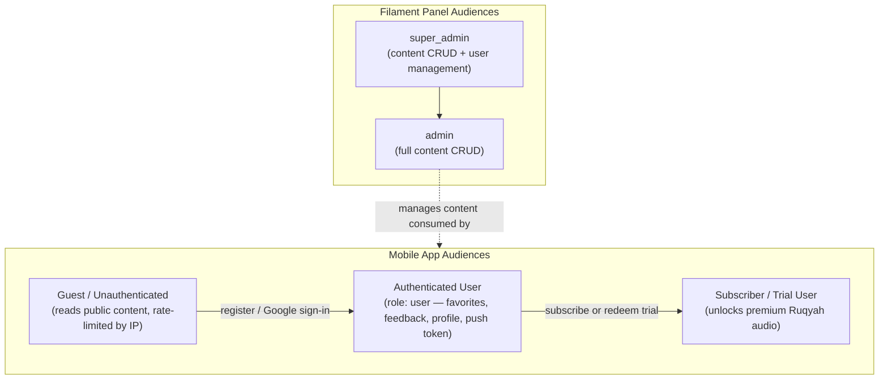
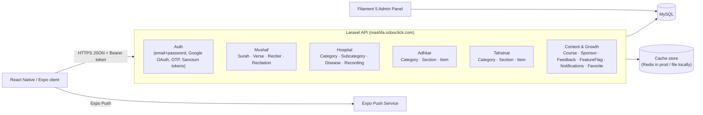
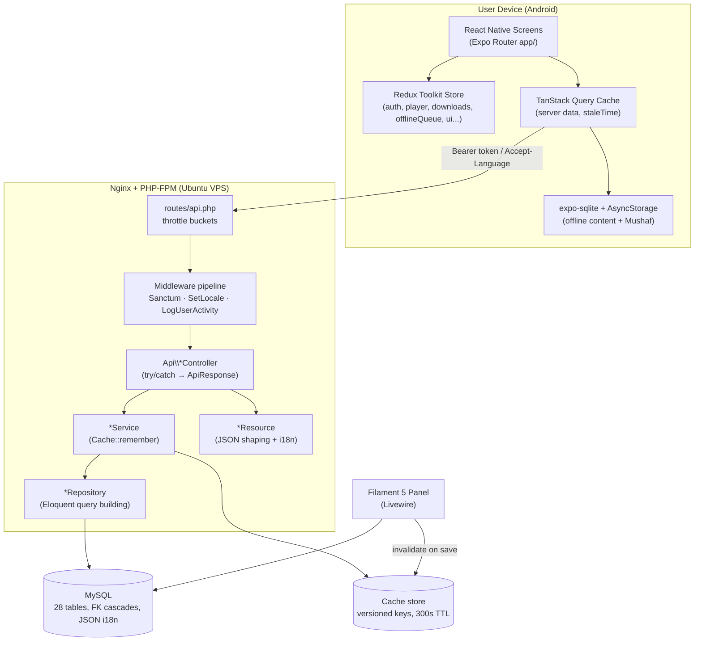
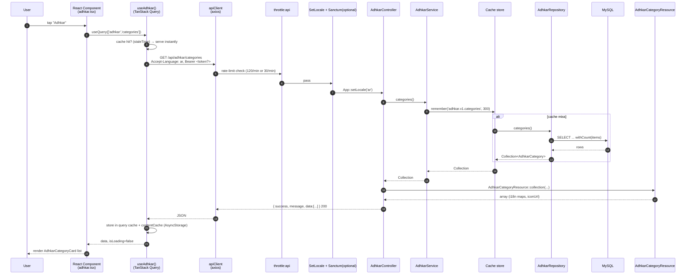
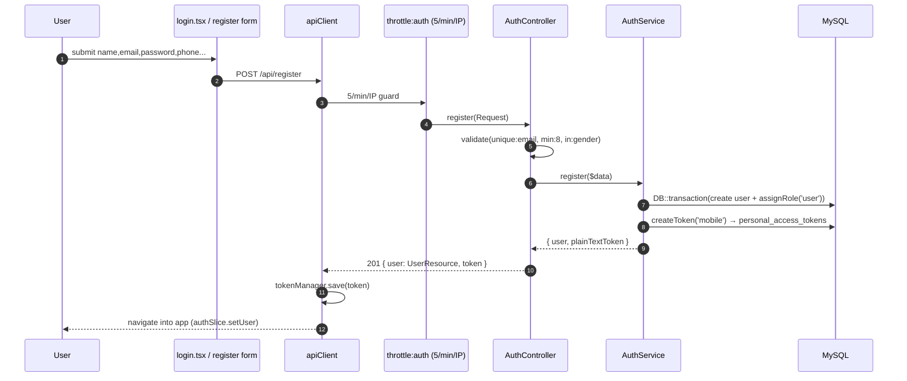
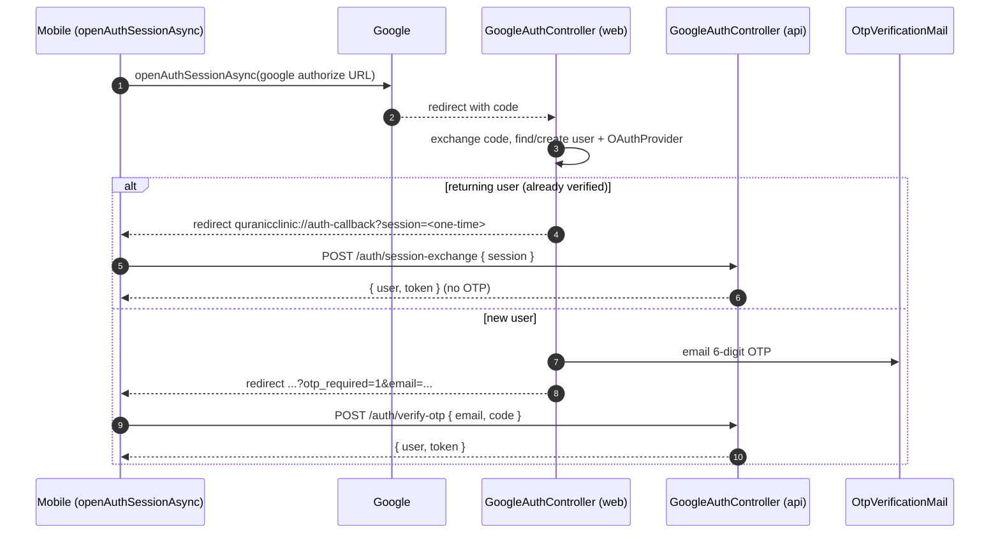
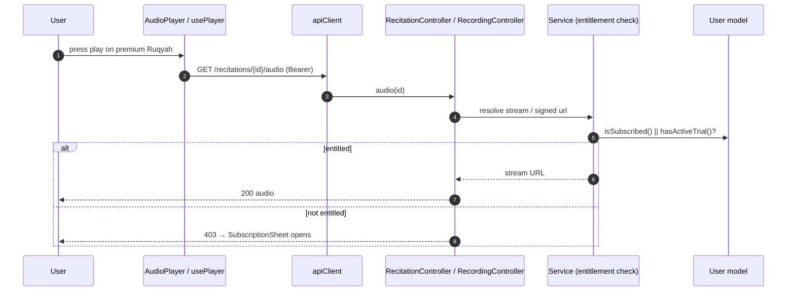
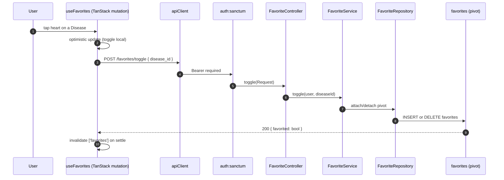

# 1. Executive Summary

## 1.1 What the project is

**Quranic Clinic** (internally *Mashfa Qurani* / "قرآني مشفى") is a two-tier, mobile-first Islamic spiritual-wellness platform. It pairs a **Laravel 13 REST API + Filament 5 administration panel** (the "backend") with a **React Native / Expo client** (the "mobile" app). The product's organizing metaphor is a *clinic*: the user arrives with a spiritual or physical complaint and is "treated" with curated Qur'anic recitation (Ruqyah), daily remembrances (Adhkar), recitation-improvement lessons (Tahsinat), and a full Mushaf (Qur'an reader with synchronized audio).

The system is delivered entirely as a self-contained stack the author operates himself: the API is deployed to a single Ubuntu VPS (`mashfa.odooclick.com`, PHP 8.4 + MySQL + Nginx), and the mobile app ships to Android as a standalone EAS build. There is no third-party BaaS; the Laravel backend is the single source of truth for content, identity, entitlements, and notifications.

## 1.2 Business goals

| Goal | How the system serves it |
|------|--------------------------|
| Deliver authentic Qur'anic healing content (Ruqyah) organized by ailment | "Hospital" module: Categories → Subcategories → Diseases → Recordings, each disease mapping to curated audio |
| Build a daily spiritual habit | Adhkar (morning/evening/after-prayer/sleep/waking remembrances) with repetition counters and local notification scheduling |
| Teach correct recitation | Tahsinat lessons grouped by category/section |
| Provide a first-class Qur'an reader | Mushaf module: 114 Surahs, verse-level text, multi-reciter audio with karaoke-style verse highlighting |
| Monetize premium audio | Subscription + a limited free-trial mechanism gating download/playback of premium Ruqyah audio |
| Operate offline-first | Aggressive client caching of all text/metadata; explicit download manager for audio |
| Retain users | Expo push notifications + locally scheduled Adhkar reminders |
| Be administrable by non-engineers | Filament 5 panel covering every content entity, with analytics widgets |

## 1.3 User types



Roles are implemented with **spatie/laravel-permission**. The mobile-facing roles collapse to a single `user` role assigned at registration; the privilege axis that matters at runtime is the **subscription/trial entitlement** computed on the `User` model (`isSubscribed()`, `hasActiveTrial()`, `canGrantTrial()`). The Filament panel is gated by `User::isAdmin()` (`super_admin` or `admin`).

## 1.4 Functional modules



The backend is partitioned into **five content domains** plus a **cross-cutting identity/growth domain**. Each domain follows the identical vertical architecture, which is the single most important fact for onboarding:

> Every read endpoint flows **Route → Controller → Service (cache) → Repository (Eloquent) → Model (+ scopes) → API Resource → JSON**. Learn the Adhkar slice once and you have learned all sixteen.

## 1.5 Technical stack

| Layer | Technology | Notes |
|-------|-----------|-------|
| API framework | **Laravel 13** (PHP 8.3+, 8.4 in prod) | Slim `bootstrap/app.php` configuration style (no `Kernel.php`) |
| Admin UI | **Filament 5** | Livewire-based; resources split into `Schemas/*Form` + `Tables/*Table` per project rule |
| Auth | **Laravel Sanctum** (personal access tokens) + **Google OAuth** + email OTP | Bearer-token API auth, no cookies on mobile |
| Authorization | **spatie/laravel-permission** + Gate policies | `ContentPolicy`, `UserPolicy` |
| Translations | **spatie/laravel-translatable** | JSON columns per translatable attribute (`{"ar": "...","en": "..."}`) |
| Persistence | **MySQL 8** | 28 migrations; FK cascades; JSON columns for i18n |
| Cache | **Cache facade** (`remember`) | Redis in production, file/database driver locally; per-domain versioned keys |
| Queue/Jobs | Laravel queue (`CompressAudioJob`) | Audio post-processing |
| Mobile framework | **React Native + Expo (Expo Router)** | File-based routing under `app/` |
| Mobile state | **Redux Toolkit** (client/session state) + **TanStack Query** (server cache) | Deliberate split: RTK for device state, TanStack for API data |
| Mobile persistence | **AsyncStorage** + **expo-sqlite** | `contentCache` + `offlineStorage` (Mushaf) |
| Mobile audio | **expo-av / expo-audio** | Streaming + downloaded playback, karaoke timing |
| Styling | **React Native `StyleSheet`** (co-located `*.styles.ts`) | NOT Tailwind/NativeWind — see §29 |
| i18n | Custom `LanguageContext` + `ar.ts`/`en.ts` dictionaries | Arabic-first, RTL aware |

> **Documentation honesty note.** The master prompt anticipates Redis, Tailwind, and a Next.js-style React web app. This dossier documents *what the code actually is*. Where the brief's assumed technology differs from reality (e.g. **styling is React Native `StyleSheet`, not Tailwind**; **the cache is the Laravel Cache abstraction, Redis only in prod**; **there is no Redux-Saga**), the divergence is called out explicitly rather than fabricated. Sections whose premise does not exist in this codebase (e.g. RIGHT/CROSS JOIN, window functions) are answered by explaining why the codebase deliberately avoids them.

## 1.6 High-level architecture



**Request taxonomy.** Three traffic classes hit the API, each with a distinct rate-limit bucket defined in `AppServiceProvider::boot()`:

* **`throttle:auth`** — 5/min/IP. Brute-force-sensitive credential endpoints (`/register`, `/login`, `/auth/google/callback`, `/auth/session-exchange`).
* **`throttle:otp`** — 10/min/IP. OTP verify/resend.
* **`throttle:api`** — 120/min keyed by user id when authenticated, else 30/min/IP. Everything else, including the 30-second polling the app performs for session-token exchange and notifications.

This single file (`AppServiceProvider`) also wires the **policy map**: nineteen content models are bound to `ContentPolicy` (public read, admin-only write) and `User` to `UserPolicy`.

---

# 2. User Story Flow

This section traces representative features end-to-end across both tiers. The canonical layered read path is shown once in full detail (Adhkar), then variant flows (auth, OAuth, premium audio, favorites) are shown with their distinguishing steps.

## 2.1 The canonical read flow — "Open the Adhkar category list"

**User action.** The user taps the *Adhkar* tile on the home screen. Expo Router navigates to `app/adhkar.tsx`, which mounts a list backed by the `useAdhkar` hook (TanStack Query).



**Step-by-step.**

1. **Frontend action.** `useAdhkar()` calls `useQuery` with a stable query key. If a non-stale cached result exists, the component renders synchronously with zero network I/O — TanStack serves the in-memory cache, and on cold start the persisted `contentCache` (AsyncStorage) rehydrates it.
2. **API call.** `apiClient` (axios) issues `GET /api/adhkar/categories`. A request interceptor attaches `Authorization: Bearer <token>` (from `tokenManager`) when present and `Accept-Language` from the active `LanguageContext`.
3. **Middleware execution.** The request enters the `throttle:api` group. `EnsureFrontendRequestsAreStateful` (prepended for all API routes) is a no-op for token auth. `SetLocale` reads `Accept-Language` and calls `App::setLocale('ar'|'en')`. This route is *not* inside `auth:sanctum`, so an anonymous guest is allowed (and rate-limited by IP).
4. **Controller execution.** `AdhkarController::categories()` is resolved by the container with its `AdhkarService` constructor dependency already injected. It wraps the call in `try/catch` and returns `AdhkarCategoryResource::collection($this->service->categories())` via the `ApiResponse::success()` envelope.
5. **Service execution.** `AdhkarService::categories()` calls `Cache::remember('adhkar.v1.categories', 300, fn () => $this->repository->categories())`. TTL is 300 s; the `v1` segment is a manual cache-version namespace so a schema change can be rolled out by bumping the key.
6. **Repository execution.** `AdhkarRepository::categories()` runs `AdhkarCategory::active()->ordered()->withCount('items')->get()` — two local scopes plus an aggregate subquery (see §4, §10).
7. **Database query.** MySQL returns active categories ordered by `(display_order, id)`, each with an `items_count` correlated sub-select.
8. **Response transformation.** `AdhkarCategoryResource` maps each row to `{ id, name: {ar,en}, slug, icon: absoluteUrl, day_number, display_order, items_count, sections?, items? }`. `name` is emitted as the **full translation map** (not the resolved string) so the client can switch language offline without a refetch.
9. **Cache layer (server).** On a hit, steps 6–7's DB work is skipped entirely.
10. **Final frontend rendering.** The JSON `data` array is normalized by `useAdhkar`, written through to the persisted cache, and rendered as a `FlatList` of `AdhkarCategoryCard`.

The full pipeline, in the brief's requested notation:

```
User
→ React Component (app/adhkar.tsx)
→ TanStack Query (useAdhkar)
→ apiClient (axios + interceptors)
→ throttle:api → SetLocale → [auth:sanctum optional]
→ AdhkarController::categories()
→ AdhkarService::categories()  ── Cache::remember ──┐
→ AdhkarRepository::categories()                    │ (skipped on hit)
→ AdhkarCategory model (scopes active/ordered)      │
→ MySQL                                             ┘
→ AdhkarCategoryResource
→ JSON envelope { success, message, data }
→ TanStack cache + contentCache (AsyncStorage)
→ Component render (AdhkarCategoryCard list)
```

## 2.2 Email + password registration



**Distinguishing details.** Validation lives in the controller (`$request->validate`), business orchestration in `AuthService::register()` which wraps user creation + role assignment in a `DB::transaction` so a failed role write cannot leave an orphaned user. Token issuance uses Sanctum's `createToken('mobile')`; only the **plain-text token** is returned (the DB stores a SHA-256 hash). On the client, `tokenManager` persists it to secure storage and `authSlice` flips the session to authenticated.

## 2.3 Google OAuth + OTP (new user) vs session-exchange (returning user)

This is the most intricate flow in the system; it is documented in depth in §31 and the project memory. Summary:



The return-URL contract `quranicclinic://auth-callback` and the **one-time session token** (short-TTL, single-use, exchanged for a Sanctum token) are deliberate: they keep the long-lived bearer token off the OS-level deep-link URL, which can be logged. `openAuthSessionAsync` (not a bare `WebBrowser.openURL`) is mandatory so the OAuth cookie jar is isolated and the redirect is captured by the app.

## 2.4 Premium audio playback (entitlement gate)



Entitlement is computed by three pure predicates on `User` (`isSubscribed`, `hasActiveTrial`, `canGrantTrial`) plus `grantTrial()` which decrements a 2-use trial allowance and sets a 7-day expiry. The mobile `SubscriptionSheet` / `LockedWird` components react to a 403 by offering subscription or trial redemption.

## 2.5 Favorites (authenticated write, many-to-many)



`User::favorites()` is a `belongsToMany(Disease::class, 'favorites')->withTimestamps()`, so a "favorite" is a pivot row. The toggle is idempotent server-side and optimistic client-side, with TanStack reconciling on settle.

---
