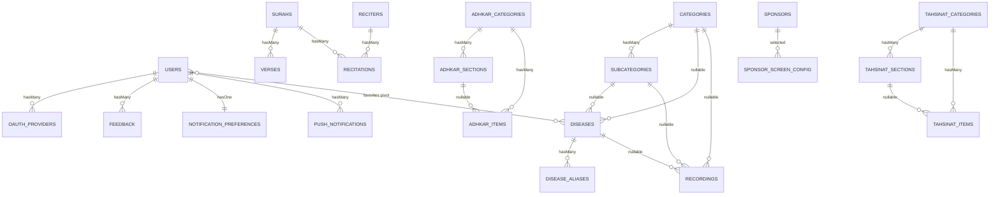
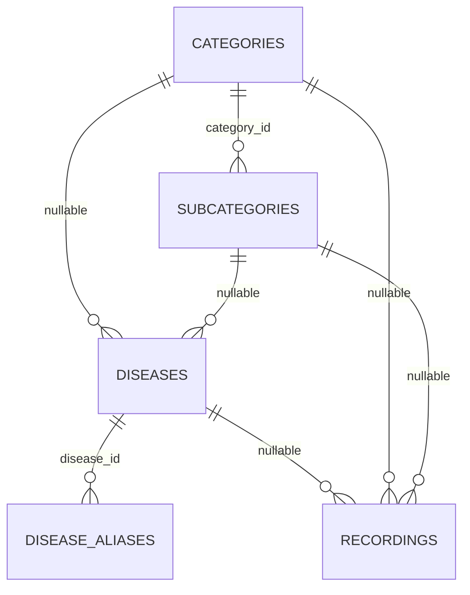
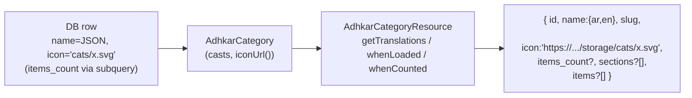

# 3. Complete Database Analysis

The schema is a **normalized relational design** of 28 tables: 19 domain tables, 3 identity tables (`users`, `oauth_providers`, `personal_access_tokens`), the Laravel framework tables (`password_reset_tokens`, `sessions`, `cache`, `cache_locks`, `jobs`, `job_batches`, `failed_jobs`), and the spatie/permission set (`roles`, `permissions`, `model_has_roles`, `model_has_permissions`, `role_has_permissions`).

**Three schema-wide conventions** must be internalized before reading any single table:

1. **i18n via JSON columns.** Every user-visible text field is a `json` column holding a translation map, e.g. `name = {"ar":"الرقية","en":"Ruqyah"}`. This is `spatie/laravel-translatable`. There are **no** `name_ar`/`name_en` sibling columns. A single `slug` (ASCII) column is the stable, language-independent identifier used in URLs.
2. **Soft deletes on content, hard deletes on join/config tables.** Domain content tables carry `softDeletes()` (a nullable `deleted_at`) so an accidental admin delete is recoverable and FKs to historical rows remain valid. Pure join/config/log tables (`favorites`, `disease_aliases`, `feedback`, `feature_flags`, `notification_preferences`, `push_notifications`, the adhkar/tahsinat children) are hard-deleted.
3. **Referential integrity is enforced at the database**, not just in Eloquent. Parent deletes either `cascadeOnDelete()` (child is meaningless without parent) or `nullOnDelete()` (child survives, link is severed). This is why `User::deleteAccount()` can rely on `forceDelete()` to transitively clean favorites, feedback, notifications, and the oauth link.

## 3.1 Entity-Relationship Diagram (domain core)



## 3.2 Identity & access tables

### `users`
**Purpose.** The single account record for both mobile end-users and Filament admins. Carries identity, profile, OAuth linkage, and the **subscription/trial entitlement** fields.

| Column | Type | Constraints | Purpose |
|--------|------|-------------|---------|
| `id` | bigint unsigned | PK | |
| `name` | varchar(255) | not null | Display name |
| `email` | varchar(255) | **unique** | Login identifier |
| `phone` | varchar(255) | nullable, **unique** | Optional contact / second unique identity |
| `country`, `gender` | varchar | nullable | Profile + sponsor targeting |
| `google_id` | varchar | nullable | Denormalized Google subject (also in `oauth_providers`) |
| `email_verified_at` | timestamp | nullable | OTP/verification gate |
| `avatar_path` | varchar | nullable | Storage-relative or absolute URL |
| `password` | varchar | **nullable** | Null for OAuth-only accounts → `login()` rejects them |
| `is_subscribed` | boolean | default false | Hard subscription flag |
| `subscription_expires_at` | timestamp | nullable | Time-boxed subscription/trial |
| `trial_used_count` | tinyint unsigned | default 0 | Caps free trials at 2 |
| `last_active_at` | timestamp | nullable | Written by `LogUserActivity` middleware |
| `expo_push_token` | varchar | nullable | Target for push |
| `remember_token` | varchar | nullable | Web session remember |
| `deleted_at` | timestamp | nullable | **SoftDeletes** |

**Indexes/constraints.** Unique on `email` and `phone`. The nullable `password` is a deliberate design seam: an account created through Google has `password = null`, and `AuthService::login()` short-circuits on `! $user->password`, so an OAuth account cannot be password-logged-in until it sets one.

### `oauth_providers`
One row per linked social identity. `unique(provider, provider_user_id)` prevents two local accounts claiming the same Google subject; `foreign(user_id) cascade` removes links when the user is hard-deleted. Stores `provider_token` / `provider_refresh_token` as `text` for potential server-side Google API calls.

### `personal_access_tokens` (Sanctum)
Standard Sanctum table: `tokenable_type`/`tokenable_id` **polymorphic** morph to `User`, `token` stores the **SHA-256 hash** (never the plaintext), `abilities` JSON, `last_used_at`. This is the only polymorphic relationship in the identity layer.

## 3.3 Mushaf (Qur'an) tables

### `surahs`
`json name`, `transliteration` (ASCII, e.g. "Al-Fatihah"), `enum type('meccan','medinan')`, `total_verses` smallint. 114 rows, seeded by `QuranSeeder`/`QuranSeederService`. SoftDeletes (a surah is never really deleted, but the column keeps the model uniform).

### `verses`
`foreignId surah_id cascade`, `verse_number` smallint, `json text`. Composite **index `(surah_id, verse_number)`** — the exact lookup shape for "give me ayah N of surah S" and for ordered pagination of a surah's verses. ~6,236 rows.

### `reciters`
`json name`, `json bio`, `photo_path`, `is_active`. Premium reciters are toggled with `is_active`.

### `recitations`
The **bridge** between a reciter and a surah: `foreignId reciter_id cascade`, `foreignId surah_id cascade`, `audio_path`, `duration_seconds`, **`unique(reciter_id, surah_id)`** — a reciter has exactly one recitation per surah. This is a classic *associative entity* turning the conceptual many-to-many "reciters ⟷ surahs" into a first-class row that also carries audio metadata.

## 3.4 Hospital (Ruqyah) tables

The hospital is a **3-level taxonomy with a deliberately flexible attach point** so content can hang off any level:



* **`categories`** — `enum type('standard','direct','disease_direct')` encodes navigation behavior: a `standard` category drills into subcategories; a `direct` category jumps straight to recordings; a `disease_direct` category lists diseases without an intermediate subcategory. This single enum drives a branch in the mobile navigation tree (`hierarchy-navigation.md`).
* **`subcategories`** — `category_id cascade`, unique `slug`.
* **`diseases`** — **both** `subcategory_id (nullOnDelete)` and `category_id (cascadeOnDelete)` are nullable, supporting the three category types: a disease may sit under a subcategory, directly under a category, or be reached by alias search.
* **`disease_aliases`** — `json alias`. Powers fuzzy search: a user typing a colloquial ailment name resolves to the canonical disease. No soft delete (aliases are cheap, regenerated).
* **`recordings`** — the **leaf content** (the actual Ruqyah audio). It can attach to a disease, a subcategory, or a category (all nullable), plus `session_number` (multi-session treatments), `json segments` (per-segment timing for karaoke), `is_free` (entitlement bypass), `is_general` (the "general ruqyah" not tied to any ailment), and `plays_count` (incremented by `POST /recordings/{id}/play`, surfaced in the Filament `TopPlayedRecordingsWidget`). Three composite indexes `(disease_id|category_id|subcategory_id, session_number)` make the "ordered sessions for this node" query index-friendly.

## 3.5 Adhkar & Tahsinat tables (parallel shapes)

Both modules share an identical **Category → Section → Item** shape; Tahsinat adds a couple of pedagogy fields.

| | Adhkar | Tahsinat |
|---|--------|----------|
| Category | `name`, `slug`, `icon`, `day_number`, `display_order`, `is_active` | `name`, `slug`, `icon`, `display_order`, `is_active` |
| Section | `category_id`, `name`, `order_randomly`, `display_order` | identical |
| Item | `category_id`, `section_id?`, `text`, `repetitions`, `hint`, `daleel`, `display_order` | `category_id`, `section_id?`, `label`, `text`, `repetitions`, `hint`, `applicability`, `display_order` |

Notable design choices:
* **`day_number`** on adhkar categories supports a rotating daily wird (e.g. a 7-day cycle).
* **`order_randomly`** on sections lets the app shuffle item order for variety without server changes.
* **`section_id` is nullable** on items so an item can live directly under a category (no section) — exactly what `AdhkarRepository::contentEagerLoads()` exploits with `whereNull('adhkar_section_id')`.
* **`daleel`** (Adhkar only) holds the scriptural evidence/source text; **`applicability`** (`both`/`male`/`female`, Tahsinat only) gates gender-specific recitation guidance.

## 3.6 Growth, content & notification tables

* **`favorites`** — pure **many-to-many pivot** `(user_id, disease_id)` with `unique(user_id, disease_id)` and `withTimestamps()`. Both FKs cascade.
* **`feedback`** — `user_id cascade`, `service_type` + nullable `service_id` form a **manual (non-Eloquent) polymorphic pointer** to whatever was rated (a recording, a course, the app generally), with `was_beneficial`, JSON `likes`/`dislikes` tag arrays, and free-text `comment`. Index `(service_type, service_id)`.
* **`courses`** — marketing/enrollment content: `json title/description`, `price decimal(10,2)`, `start_date`, `whatsapp_link`, `is_coming_soon`.
* **`sponsors`** — `json name`, `logo_path`, **targeting** (`target_all_countries`, `json target_countries`, `json target_genders`), `display_on_launch`. The app shows a sponsor splash filtered by the signed-in user's `country`/`gender`.
* **`sponsor_screen_config`** — a **singleton config row** (`is_enabled`, `display_duration_seconds`, `selected_sponsor_id nullOnDelete`).
* **`feature_flags`** — `feature_key unique`, `is_visible`. A kill-switch table; the mobile `featuresSlice`/`useFeatures` hides modules whose flag is off.
* **`notification_preferences`** — `user_id unique cascade` (enforces **one-to-one**), four adhkar toggles + a `waking_start_time`/`waking_end_time` window for the "first thing on waking" reminder.
* **`push_notifications`** — per-user inbox: `title`, `body`, `type`, `json data`, `read_at`, `sent_at`, index `(user_id, read_at)` for the unread-count badge.

## 3.7 Relationship taxonomy (every kind in the brief)

| Kind | Where it appears | Eloquent declaration |
|------|------------------|----------------------|
| **One-to-One** | `User` ⟷ `NotificationPreference` | `hasOne` / `belongsTo` + `unique(user_id)` |
| **One-to-Many** | `Surah → Verses`, `AdhkarCategory → Items`, `Disease → Recordings` | `hasMany` / `belongsTo` |
| **Many-to-Many** | `User` ⟷ `Disease` (favorites) | `belongsToMany(...,'favorites')->withTimestamps()` |
| **Associative (M:N promoted)** | `Reciter` ⟷ `Surah` via `Recitation` | two `belongsTo` on the bridge + `unique` |
| **Polymorphic (framework)** | Sanctum `personal_access_tokens.tokenable`; spatie `model_has_roles.model` | `morphTo` inside vendor code |
| **Manual polymorphic** | `Feedback (service_type, service_id)` | resolved in `FeedbackService`, not via `morphTo` |
| **Nullable parent / flexible attach** | `diseases` point to either `category` or `subcategory`; `items` optionally to a `section` | nullable FKs + `nullOnDelete` |

> **Why no MorphOne/MorphMany/MorphToMany in app code?** The domain has no shared child owned by multiple parent *types* in Eloquent terms. The one candidate — feedback on heterogeneous targets — was implemented as a manual `service_type` string for index simplicity and to avoid a morph map. §3.8 weighs the trade-off.

## 3.8 Relationship rationale & data-flow notes

* **Why `recordings` attaches to three nullable parents instead of a polymorphic `attachable`.** A morph (`attachable_type`/`attachable_id`) would collapse the three FKs into one pair but would *lose database-level referential integrity* (MySQL cannot FK a polymorphic column) and defeat the three composite `(parent_id, session_number)` indexes. With exactly three fixed parent types, three nullable FKs are faster and safer. Trade-off: an "exactly-one-parent" CHECK is not enforced at the DB; the invariant lives in the Filament form + seeders.
* **Why favorites is a pivot, not a JSON column on users.** It must be queried from both sides (a user's favorites; a disease's favorite count) and must cascade on disease deletion — natural for a pivot, awkward for JSON.
* **Why `notification_preferences` is a separate 1:1 table.** Keeps the hot `users` row narrow (read on every authenticated request via Sanctum) and lets preferences be created lazily.

---

# 4. Laravel Model Analysis

All domain models extend `Illuminate\Database\Eloquent\Model`; `User` extends `Authenticatable`. The shared idioms are: **`HasTranslations`** (Spatie wrapper) on any model with JSON i18n columns, a **`casts()` method** (Laravel 11+ style, not the `$casts` property), and **query scopes** `active()` / `ordered()` that the repositories chain.

## 4.1 The translation concern

```php
// app/Models/Concerns/HasTranslations.php
trait HasTranslations
{
    use SpatieHasTranslations;

    public function attributesToArray(): array
    {
        $attributes = parent::attributesToArray();
        foreach ($this->getTranslatableAttributes() as $key) {
            $attributes[$key] = $this->getTranslations($key);   // full map, not resolved string
        }
        return $attributes;
    }
}
```

**Why override `attributesToArray()`.** Vanilla Spatie resolves a translatable attribute to the *current locale's string* when serializing. This app instead emits the **entire `{ar,en}` map** so the mobile client can flip language offline. The override is the lynchpin that makes the resources (which call `getTranslations('name')`) and the offline cache coherent. Every `*Resource` deliberately calls `getTranslations()` to stay consistent with this decision.

## 4.2 `AdhkarItem` — anatomy of a typical content model

```php
class AdhkarItem extends Model
{
    use HasTranslations;

    protected $fillable = [
        'adhkar_category_id', 'adhkar_section_id', 'text',
        'repetitions', 'hint', 'daleel', 'display_order',
    ];
    public array $translatable = ['text', 'hint', 'daleel'];

    protected function casts(): array
    {
        return [
            'adhkar_category_id' => 'integer',
            'adhkar_section_id'  => 'integer',
            'repetitions'        => 'integer',
            'display_order'      => 'integer',
        ];
    }

    public function category(): BelongsTo { return $this->belongsTo(AdhkarCategory::class, 'adhkar_category_id'); }
    public function section(): BelongsTo  { return $this->belongsTo(AdhkarSection::class, 'adhkar_section_id'); }

    public function scopeOrdered(Builder $query): Builder
    {
        return $query->orderBy('display_order')->orderBy('id');
    }
}
```

| Facet | Value | Reasoning |
|-------|-------|-----------|
| **`$fillable`** | the writable columns | Whitelist → mass-assignment protection (no `$guarded=[]`); admin forms and seeders fill these |
| **`$translatable`** | `text, hint, daleel` | Tells Spatie which JSON columns are translation maps; combined with `casts` these are stored/loaded as JSON |
| **`casts()`** | integer coercions | Guarantees numeric types in JSON output (avoids `"3"` vs `3` drift) |
| **Relationships** | two `belongsTo` | Item belongs to a category (required) and optionally a section |
| **Scope `ordered()`** | `display_order, id` | Deterministic, admin-controlled ordering with `id` as a stable tiebreaker |

**`AdhkarCategory`** adds `scopeActive()` (`where('is_active', true)`), `hasMany(AdhkarSection)`, `hasMany(AdhkarItem)`, and an **accessor-like method** `iconUrl()` that resolves a stored storage path to an absolute URL (returns the raw value if already `http`, else `asset('storage/...')`). The resource calls `iconUrl()` rather than exposing the raw `icon` column — a small but consistent encapsulation.

## 4.3 `User` — the richest model

```php
#[Fillable([... 'is_subscribed','subscription_expires_at','trial_used_count', ...])]
#[Hidden(['password', 'remember_token'])]
class User extends Authenticatable implements FilamentUser, HasAvatar, HasName
{
    use HasApiTokens, HasFactory, HasRoles, Notifiable, SoftDeletes;
    // ...
}
```

* **PHP 8 attributes** `#[Fillable(...)]` / `#[Hidden(...)]` replace the `$fillable`/`$hidden` properties — a Laravel 13 feature. `password` and `remember_token` are hidden from every array/JSON serialization globally (defense-in-depth on top of the resources).
* **Traits:** `HasApiTokens` (Sanctum), `HasRoles` (spatie), `Notifiable`, `SoftDeletes`, `HasFactory`.
* **Interfaces:** `FilamentUser` (`canAccessPanel()` → `isAdmin()`), `HasAvatar`, `HasName` — these are what let the same `User` model power the Filament panel.
* **Entitlement predicates (pure domain logic, no I/O):** `isSubscribed()`, `hasActiveTrial()`, `canGrantTrial()`, and the mutator `grantTrial()` (increments `trial_used_count`, sets `subscription_expires_at = now()->addDays(7)`).
* **Relationships:** `hasMany(OAuthProvider)`, `belongsToMany(Disease,'favorites')`, `hasMany(Feedback)`, `hasOne(NotificationPreference)`, `hasMany(PushNotification)`.
* **`casts()`** sets `password => 'hashed'` (so `User::create(['password'=>$plain])` auto-hashes — note `AuthService::register` passes the raw password and relies on this cast) and `subscription_expires_at => 'datetime'` (so `->isFuture()` works in `isSubscribed()`).

## 4.4 Eloquent → SQL: worked examples

The brief asks for the SQL Eloquent generates and *why*. Three representative cases from this codebase:

### (a) `AdhkarCategory::active()->ordered()->withCount('items')->get()`

```sql
SELECT adhkar_categories.*,
       (SELECT COUNT(*) FROM adhkar_items
         WHERE adhkar_items.adhkar_category_id = adhkar_categories.id) AS items_count
FROM adhkar_categories
WHERE is_active = 1
ORDER BY display_order ASC, id ASC;
```
**Why.** `withCount('items')` compiles to a **correlated scalar subquery** aliased `items_count` (not a JOIN+GROUP BY), so each category appears exactly once and the count is computed in the same round-trip — no N+1, no row multiplication. The two scopes append the `WHERE` and `ORDER BY`. The resource then reads `items_count` via `whenCounted('items')`.

### (b) `AdhkarCategory::active()->where('slug',$slug)->with(['sections'=>fn($q)=>$q->ordered()->with(['items'=>...]), 'items'=>fn($q)=>$q->whereNull('adhkar_section_id')->ordered()])->first()`

```sql
-- 1: the category
SELECT * FROM adhkar_categories WHERE is_active = 1 AND slug = ? LIMIT 1;
-- 2: its sections (eager)
SELECT * FROM adhkar_sections WHERE adhkar_category_id IN (?) ORDER BY display_order, id;
-- 3: items of those sections (nested eager)
SELECT * FROM adhkar_items WHERE adhkar_section_id IN (?, ?, ...) ORDER BY display_order, id;
-- 4: section-less items of the category (constrained eager)
SELECT * FROM adhkar_items
WHERE adhkar_category_id IN (?) AND adhkar_section_id IS NULL
ORDER BY display_order, id;
```
**Why.** `with()` triggers **eager loading**: one query per relationship level using `WHERE ... IN (parent_ids)`. This is the N+1-avoidance pattern — 4 queries regardless of how many sections/items exist, versus 1 + N + M lazy queries. The closures inject `ordered()` and the `whereNull` filter into the eager queries themselves so ordering/filtering happens in SQL, not PHP.

### (c) `User::where('email',$email)->first()` then `$user->createToken('mobile')`

```sql
SELECT * FROM users WHERE email = ? AND users.deleted_at IS NULL LIMIT 1;
INSERT INTO personal_access_tokens (tokenable_type, tokenable_id, name, token, abilities, created_at, updated_at)
VALUES ('App\\Models\\User', ?, 'mobile', <sha256-hash>, '["*"]', ?, ?);
```
**Why.** `SoftDeletes` silently appends `deleted_at IS NULL` to every query via a global scope — a soft-deleted user cannot log in. `createToken` hashes the random plaintext with SHA-256 before insert; only the caller ever sees the plaintext.

## 4.5 Model inventory (27 domain models)

| Model | Translatable | Key relations | Scopes / domain methods |
|-------|-------------|---------------|--------------------------|
| `User` | – | oauthProviders, favorites(BtM Disease), feedback, notificationPreference(hasOne), pushNotifications | isSubscribed, hasActiveTrial, grantTrial, isAdmin |
| `Surah` | name | verses(hasMany), recitations(hasMany) | active/ordered |
| `Verse` | text | surah(belongsTo) | ordered by verse_number |
| `Reciter` | name, bio | recitations(hasMany) | active |
| `Recitation` | – | reciter, surah (belongsTo) | – |
| `Category` | name | subcategories, diseases, recordings | active, ordered, type-aware |
| `Subcategory` | name | category, diseases, recordings | active, ordered |
| `Disease` | name | category, subcategory, aliases(hasMany), recordings(hasMany), favoritedBy | active, ordered |
| `DiseaseAlias` | alias | disease(belongsTo) | – |
| `Recording` | description, segments | disease, category, subcategory, creator | free/general/ordered, incrementPlays |
| `Favorite` | – | user, disease (pivot model) | – |
| `AdhkarCategory` | name | sections, items | active, ordered, iconUrl |
| `AdhkarSection` | name | category, items | ordered, order_randomly |
| `AdhkarItem` | text, hint, daleel | category, section | ordered |
| `TahsinatCategory/Section/Item` | name/label/text/hint | parallel to Adhkar | ordered, applicability |
| `Course` | title, description | – | active, ordered, is_coming_soon |
| `Sponsor` | name | screenConfigs | active, targeting predicates |
| `SponsorScreenConfig` | – | selectedSponsor(belongsTo) | singleton |
| `Feedback` | likes, dislikes(json) | user(belongsTo) | manual morph via service_type |
| `FeatureFlag` | – | – | keyed by feature_key |
| `NotificationPreference` | – | user(belongsTo) | one-to-one |
| `PushNotification` | – | user(belongsTo) | unread scope |
| `OAuthProvider` | – | user(belongsTo) | – |

---

# 9. Repository Layer Analysis

> §9 is presented here, adjacent to the model layer it wraps; §5–8 (controllers/services) follow in Part C.

Fifteen repositories implement fifteen `*RepositoryInterface` contracts (in `Repositories/Contracts/`). The binding is centralized in `RepositoryServiceProvider::register()` — a single associative array `interface => concrete` looped through `$this->app->bind()`. This is the **Dependency Inversion** seam (§15): services type-hint the *interface*, the container injects the concrete.

```php
class AdhkarRepository implements AdhkarRepositoryInterface
{
    public function categories(): Collection
    {
        return AdhkarCategory::active()->ordered()->withCount('items')->get();
    }

    public function findCategoryBySlug(string $slug): ?AdhkarCategory
    {
        return AdhkarCategory::active()->where('slug', $slug)
            ->with($this->contentEagerLoads())->first();
    }

    private function contentEagerLoads(): array
    {
        return [
            'sections' => fn ($q) => $q->ordered()->with(['items' => fn ($q) => $q->ordered()]),
            'items'    => fn ($q) => $q->whereNull('adhkar_section_id')->ordered(),
        ];
    }
}
```

**Responsibilities & separation of concerns.**
* The repository is the **only** layer that names Eloquent models and builds queries. Controllers and services never call `Model::query()`. This means a future migration to a read-replica, a search index, or raw SQL touches only the repository.
* It returns **domain objects** (`Collection<Model>` / `?Model`), never arrays or JSON — transformation is the resource's job.
* It owns **eager-load strategy**. `contentEagerLoads()` centralizes the nested `with()` so both `findCategoryBySlug` and `todayCategories` share the identical, N+1-free loading plan.

**Performance implications.** Because eager-load plans live in the repository, the query count for any endpoint is fixed and auditable. The "category detail" endpoint is provably 4 queries (§4.4b) regardless of data volume. Repositories never iterate a collection issuing per-row queries; all filtering/ordering is pushed into SQL via scopes and closures.

**Variation across repositories.** `RecordingRepository` exposes `incrementPlays($id)` (an atomic `UPDATE recordings SET plays_count = plays_count + 1`), `general()` (`where('is_general', true)`), and free/paid filtering. `DiseaseRepository` exposes `search($term)` which joins/uses `disease_aliases` for fuzzy matching. `VerseRepository::search()` does a `LIKE` over the JSON `text` (the one full-scan-ish query, mitigated by the result being cached and the corpus fixed at ~6k rows). `SurahRepository` eager-loads `verses` and available `recitations` for the reader.

---

# 10. SQL Deep Dive

This codebase is intentionally **JOIN-light**: it leans on Eloquent eager loading (`WHERE IN`) and correlated subqueries (`withCount`) rather than hand-written multi-table JOINs. That is the right call for an API whose read shapes are nested object trees — eager loading returns clean per-level result sets that hydrate into models, whereas a wide JOIN would multiply rows and require de-duplication in PHP. Below, each JOIN flavor from the brief is mapped to whether/why it appears.

| SQL construct | Used? | Where / why |
|---------------|-------|-------------|
| **INNER JOIN** | Implicitly, via spatie permission checks and `belongsToMany` | `User::favorites()` generates `SELECT diseases.* FROM diseases INNER JOIN favorites ON favorites.disease_id = diseases.id WHERE favorites.user_id = ?` |
| **LEFT JOIN** | Rare; via `withCount` Laravel prefers a subquery, but `has()`/`whereHas` emit `LEFT JOIN`-style `EXISTS` | e.g. filtering categories that *have* active recordings |
| **RIGHT JOIN** | **No** | Never needed — every query is anchored on the "many" side's parent; a RIGHT JOIN would just be a reordered LEFT JOIN. Documented absence. |
| **CROSS JOIN** | **No** | No cartesian-product use case (no "every reciter × every surah" matrix is materialized; `recitations` rows are explicit). |
| **UNION** | **No** | Result sets are homogeneous per endpoint; heterogeneous "feed" endpoints do not exist. |
| **GROUP BY / HAVING** | Via `withCount` (subquery form) and analytics widgets | Filament `TopPlayedRecordingsWidget` runs `ORDER BY plays_count DESC LIMIT n`; `UserGrowthWidget` groups registrations by day |
| **SUBQUERY (scalar/correlated)** | **Yes, pervasive** | every `withCount('items')` → correlated `COUNT(*)` subquery |
| **EXISTS** | **Yes** | `hasOAuthProvider()` → `SELECT EXISTS(SELECT 1 FROM oauth_providers WHERE user_id=? AND provider=?)`; `whereHas` compiles to `WHERE EXISTS (...)` |
| **IN** | **Yes, pervasive** | every eager load → `WHERE child.parent_id IN (...)`; `isAdmin()` role check → `role_id IN (...)` |
| **NOT IN** | Rare | occasionally to exclude already-favorited items |
| **WINDOW FUNCTIONS** | **No** | The analytics that would use `ROW_NUMBER()/RANK()` (top recordings, growth) are small enough to do with `ORDER BY ... LIMIT` + `GROUP BY day`; introducing window functions would add MySQL-version coupling for no measurable gain at this data scale. Documented, deliberate absence. |

### Worked JOIN: the favorites many-to-many

```sql
-- User::favorites()->get()  (BelongsToMany over the favorites pivot)
SELECT diseases.*, favorites.user_id AS pivot_user_id,
       favorites.disease_id AS pivot_disease_id,
       favorites.created_at AS pivot_created_at
FROM diseases
INNER JOIN favorites ON favorites.disease_id = diseases.id
WHERE favorites.user_id = ?
  AND diseases.deleted_at IS NULL;
```
**Complexity.** With `unique(user_id, disease_id)` and the pivot's PK/indexes, this is an index range scan on `favorites.user_id` + PK lookups into `diseases` — effectively **O(k log n)** for k favorites out of n diseases. `withTimestamps()` is why the `pivot_created_at` column is selected (used to order "recently favorited").

### Worked subquery: `withCount`

Already shown in §4.4a. **Complexity:** the correlated `COUNT(*)` runs once per outer row; with an index on `adhkar_items.adhkar_category_id` each is an index-only count, so the endpoint is **O(c · log i)** for c categories and i items — and then *cached for 300 s*, amortizing to O(1) per request across the TTL window.

### The one expensive query — verse search

```sql
SELECT * FROM verses
WHERE JSON_UNQUOTE(JSON_EXTRACT(text, '$.ar')) LIKE CONCAT('%', ?, '%')
   OR JSON_UNQUOTE(JSON_EXTRACT(text, '$.en')) LIKE CONCAT('%', ?, '%')
LIMIT 50;
```
A leading-wildcard `LIKE` on a JSON-extracted value **cannot use a B-tree index** → full scan of ~6,236 rows. It is acceptable because (1) the corpus is fixed and tiny, (2) results are cached, and (3) the alternative (MySQL `FULLTEXT` or an external index like Meilisearch) is a deliberate Phase-2 deferral noted in `.claude/backend`. §30 ranks this as the top backend optimization candidate if search traffic grows.

---

# 11. Resource Classes

Eighteen `App\Http\Resources\*Resource` classes (`JsonResource`) are the **only** place a model becomes JSON. They enforce three things uniformly: (1) translatable fields are emitted as full `{ar,en}` maps via `getTranslations()`, (2) media paths become absolute URLs, (3) nested/aggregate data is conditional via `whenLoaded()` / `whenCounted()` so the same resource serves both list and detail endpoints without over-fetching.

```php
class AdhkarCategoryResource extends JsonResource
{
    public function toArray($request): array
    {
        return [
            'id'            => $this->id,
            'name'          => $this->getTranslations('name'),          // {"ar":...,"en":...}
            'slug'          => $this->slug,
            'icon'          => $this->iconUrl(),                        // absolute URL or null
            'day_number'    => $this->day_number,
            'display_order' => $this->display_order,
            'items_count'   => $this->whenCounted('items'),            // only if withCount() ran
            'sections'      => AdhkarSectionResource::collection($this->whenLoaded('sections')),
            'items'         => AdhkarItemResource::collection($this->whenLoaded('items')),
        ];
    }
}
```

**Field-by-field, and the DB→Resource→JSON pipeline:**



* **`id`, `slug`, `day_number`, `display_order`** — passthrough scalars (already `int`/`string` due to casts).
* **`name`** — `getTranslations('name')` returns the decoded JSON map. Critical: this matches the `HasTranslations::attributesToArray()` override so the client never has to guess the active language.
* **`icon`** — delegated to the model's `iconUrl()`, which returns `null`, the raw URL, or `asset('storage/...')`. The resource never leaks the storage-relative path.
* **`items_count`** — `whenCounted('items')` emits the key **only when** the controller's query ran `withCount('items')`. On the list endpoint it is present; on a detail endpoint that eager-loaded full items instead, it is omitted — zero wasted bytes.
* **`sections` / `items`** — `whenLoaded()` emits these **only when eager-loaded**. The list endpoint omits both (lightweight); the detail endpoint includes the nested tree. This is how one resource class powers two very different payload shapes without an `if` in the controller.

**Conditional-attribute idioms used across the 18 resources:** `whenLoaded`, `whenCounted`, `when($cond, $value)`, and `$this->mergeWhen()`. `RecordingResource` uses `when($this->is_free || $request->user()?->isSubscribed(), $streamUrl)` to **withhold the audio URL from non-entitled users** — the entitlement gate is partly enforced at serialization time, not just at the route. `UserResource` whitelists exactly the safe profile fields (never `password`, never raw role pivots) and adds computed `is_subscribed`/`has_active_trial` booleans derived from the model predicates.

---
