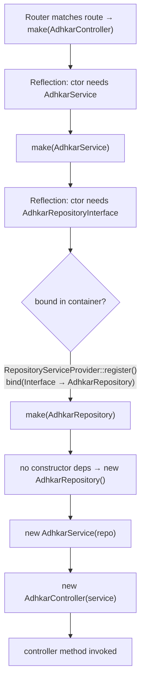
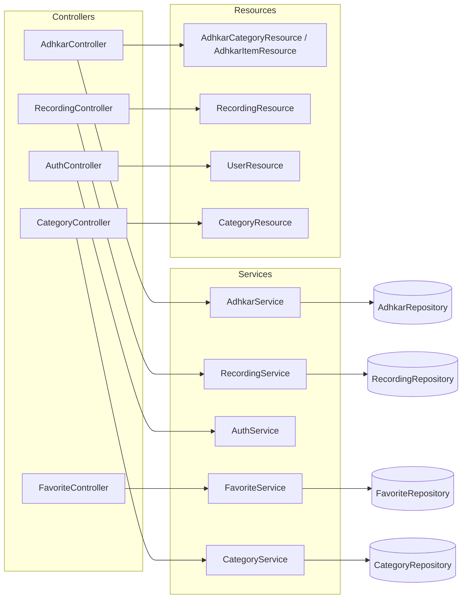
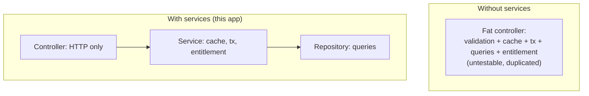
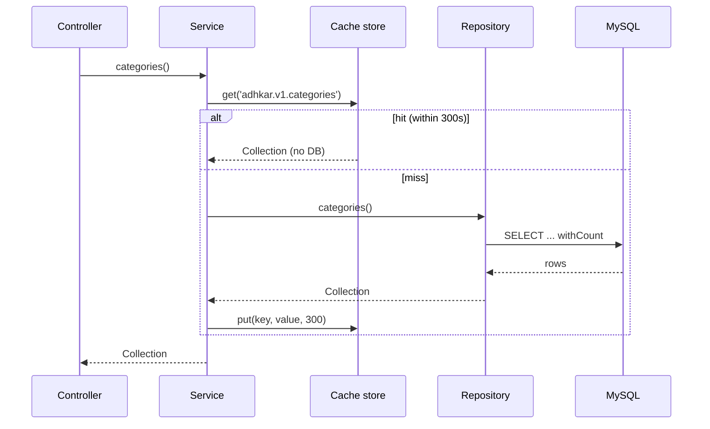
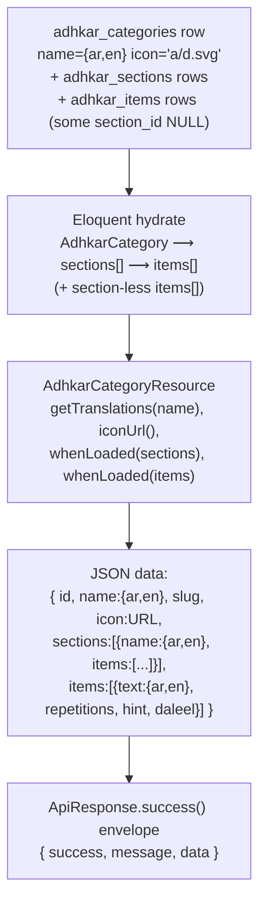

# 5. Constructor Deep Dive

Every controller, service, and repository in this codebase uses **constructor promotion** for dependency injection. The pattern is uniform:

```php
class AdhkarController extends Controller
{
    public function __construct(private AdhkarService $service) {}   // controller → service
}

class AdhkarService
{
    public function __construct(private AdhkarRepositoryInterface $repository) {}  // service → repo INTERFACE
}

class AdhkarRepository implements AdhkarRepositoryInterface { /* no ctor — leaf */ }
```

## 5.1 How Laravel resolves `AdhkarController`

When a request matches `GET /adhkar/categories`, the router asks the **service container** to build `AdhkarController`. The resolution is fully recursive and automatic:



**Step by step (what the container actually does):**

1. **Reflection.** `Container::build()` calls `new ReflectionClass(AdhkarController)`, reads the constructor signature, and finds one parameter typed `AdhkarService`.
2. **Recursive resolution.** For each typed parameter that is a class (not a scalar/built-in), the container recurses: `make(AdhkarService)`.
3. **Interface → concrete.** `AdhkarService` needs `AdhkarRepositoryInterface` — an *interface*, which cannot be instantiated. The container consults its `$bindings` map; `RepositoryServiceProvider::register()` registered `AdhkarRepositoryInterface::class => AdhkarRepository::class`, so it resolves the concrete `AdhkarRepository`.
4. **Leaf instantiation.** `AdhkarRepository` has no constructor dependencies, so the container `new`s it directly (heap allocation of one small object holding no state).
5. **Unwind & inject.** The container constructs `new AdhkarService($repo)`, then `new AdhkarController($service)`, then invokes the matched method (`categories()`).

## 5.2 Lifecycle: transient by default, singleton where it matters

* **`bind()` is transient.** The repository bindings use `$this->app->bind(...)`, so a **fresh instance is built for every resolution** (i.e. once per request, because the container resolves the controller graph once per request). These objects are stateless query-builders, so transient is correct and cheap.
* **Singletons** in this app are the framework's: the container itself, the `Request`, the database `ConnectionResolver`, the cache manager. Eloquent models are *not* container-managed — they are `new`'d by queries.
* **Memory.** Each request allocates a tiny object graph: 1 controller + 1 service + 1 repository ≈ three small heap objects with only reference fields. They become garbage-collectible the instant the response is sent and the request scope unwinds. There is no per-request leakage because nothing is registered as a singleton holding request state.

## 5.3 Why constructor injection (vs. method/facade access)

| Property | Constructor injection (this app) | Facade / `app()->make()` |
|----------|----------------------------------|---------------------------|
| Testability | Dependencies are explicit; a test passes a mock repo directly | Hidden global lookup; needs container faking |
| Immutability | `private readonly`-style promoted props set once | Resolved ad-hoc, anywhere |
| Discoverability | The class's needs are its signature | Buried in method bodies |
| Compile-time safety | PHP + static analysers verify types | Runtime-only |

Constructor injection is what makes the **Dependency Inversion Principle** (§15) physically real here: `AdhkarService` literally cannot reference `AdhkarRepository` (the concrete) — it only knows the interface, and the wiring lives in one provider. Swapping persistence is a one-line change in `RepositoryServiceProvider`.

---

# 6. Middleware Analysis

Middleware is configured in the Laravel 13 slim style inside `bootstrap/app.php` (`->withMiddleware(...)`) — there is no `app/Http/Kernel.php`.

```php
$middleware->trustProxies(at: '*', headers: X_FORWARDED_FOR | _HOST | _PORT | _PROTO | _AWS_ELB);
$middleware->api(prepend: [
    EnsureFrontendRequestsAreStateful::class,   // Sanctum
    SetLocale::class,                            // app
]);
$middleware->api(append: [ LogUserActivity::class ]);  // app
$middleware->alias(['role' => CheckRole::class]);
```

## 6.1 The API request pipeline

```mermaid
flowchart LR
    Req["HTTP Request"] --> TP["TrustProxies\n(honor X-Forwarded-Proto → https URLs)"]
    TP --> ST["EnsureFrontendRequestsAreStateful\n(Sanctum; no-op for token auth)"]
    ST --> SL["SetLocale\n(Accept-Language → App::setLocale)"]
    SL --> TH["throttle:api / auth / otp\n(rate-limit bucket)"]
    TH --> AU["auth:sanctum\n(only on protected groups)"]
    AU --> Ctrl["Controller"]
    Ctrl --> LUA["LogUserActivity (append)\n(last_active_at, ≤1/hour, saveQuietly)"]
    LUA --> Resp["Response"]
```



## 6.2 Each middleware, why it exists, and its mechanics

**`TrustProxies(at: '*')`** — The API runs behind Nginx (prod) and ngrok (dev). Without trusting `X-Forwarded-Proto`, `asset()`/`url()` generate `http://` links; the Android cleartext policy and ngrok then block the images. Trusting the forwarded headers makes generated media URLs `https://`. `at: '*'` is acceptable because the app server is never directly internet-exposed (Nginx terminates TLS).

**`EnsureFrontendRequestsAreStateful` (Sanctum, prepended)** — Decides whether a request is a "first-party SPA" (cookie/session auth) or a third-party (token) client. The mobile app always sends `Authorization: Bearer …` and no Sanctum stateful cookie, so this is effectively a pass-through for mobile; it is present so the same API could serve a cookie-based web SPA without reconfiguration.

**`SetLocale` (app, prepended)** — Reads `Accept-Language`, sets `App::setLocale('ar'|'en')`. This influences any locale-aware formatting; note that because resources emit the **full translation map**, the locale mostly affects validation messages and any server-rendered strings, not the content payload. Defensive: defaults to `en`, only switches to `ar` on an `ar*` prefix.

**`throttle:*` (route-group)** — The three buckets from `AppServiceProvider` (§1.6). Throttling sits *after* locale so a 429 still carries correct headers, and *before* auth so anonymous floods are shed cheaply.

**`auth:sanctum` (route-group, protected only)** — Hashes the incoming bearer token, looks it up in `personal_access_tokens`, loads the `tokenable` user, sets `$request->user()`. Applied only to the `/me`, favorites, feedback, and notification routes (§1.6 routes file). A missing/invalid token yields 401 before the controller runs.

**`CheckRole` (alias `role`, available but selectively used)** —
```php
public function handle(Request $request, Closure $next, string ...$roles): Response
{
    if (!$request->user() || !in_array($request->user()->role, $roles)) {
        return response()->json(['success' => false, 'message' => 'Forbidden'], 403);
    }
    return $next($request);
}
```
A variadic role guard (`->middleware('role:admin,super_admin')`). The API itself leans on **policies** for write authorization (Filament side) rather than this middleware, but it is wired and available. *(Implementation note: it reads `$request->user()->role`; the canonical role source is spatie's `hasRole()`. This is a small inconsistency flagged in §32.)*

**`LogUserActivity` (app, appended)** — Runs *after* the controller (append position) so it never delays the response logic. It writes `last_active_at` **at most once per hour** (`last_active_at->lt(now()->subHour())`) using `saveQuietly()` (no model events, no `updated_at` touch storm). This throttled write is what powers the `UserGrowth`/active-user analytics without hammering the DB on every poll.

---

# 7. Controller Analysis

There are two controller families: **`App\Http\Controllers\Api\*`** (the JSON API the mobile app consumes) and a few top-level controllers (`SurahController`, `VerseController`, `ReciterController`, `RecitationController`) that predate the `Api\` namespace reorg but follow the same contract. All extend the abstract base:

```php
abstract class Controller { use ApiResponse; }
```

So every controller method has `success()`, `error()`, and `paginated()` available.

## 7.1 Responsibilities (and the strict boundary)

A controller in this codebase does **exactly four things** and nothing else:

1. **Read/validate input** (`$request->validate([...])` or manual `(int) $request->get(...)`).
2. **Delegate** to its single injected service.
3. **Map to a Resource** (`XResource::collection(...)` / `new XResource(...)`).
4. **Wrap** in the `ApiResponse` envelope, inside `try/catch`.

It contains **no** query building, **no** business rules, **no** cache calls. This is visible in `AdhkarController` (§2.1) and `RecordingController`:

```php
public function stream(Request $request, int $id): JsonResponse
{
    try {
        $recording = $this->service->find($id);
        if (! $recording) return $this->error('Recording not found', 404);
        if (! $this->service->canAccess($recording, $request->user()))
            return $this->error('This session requires an active subscription or trial.', 403);
        return $this->success(['id' => $recording->id, 'audio_url' => $recording->streamUrl()]);
    } catch (\Throwable $e) {
        return $this->error('Server error', 500);
    }
}
```

Note the **entitlement decision lives in `RecordingService::canAccess()`**, not the controller — the controller only branches on its boolean result and chooses the HTTP status.

## 7.2 Controller call graph



## 7.3 Validation strategy

* **Form validation** uses inline `$request->validate([...])` rules (no dedicated FormRequest classes). Rules seen: `unique:users,email`, `min:8`, `in:male,female`, `size:6` (OTP), `unique:users,phone,{id}` (ignore-self on profile update).
* **Validation failures** throw `ValidationException`, caught per-method and re-emitted as `error('Validation failed', 422, $e->errors())` — i.e. the framework's 422 body is *re-wrapped* into the app's `{success:false, message, errors}` envelope so the mobile client has one error shape to parse everywhere.
* **`GoogleAuthController`** is the exception to the envelope: it returns bespoke JSON (`{status, user, token}` / `{error}`) because its client contract (the OAuth bounce + OTP exchange) predates and differs from `ApiResponse`. This is the one place the response shape diverges, documented in §12.

## 7.4 The auth controllers in depth

`AuthController` (email/password) is thin — it validates and forwards to `AuthService`. `GoogleAuthController` is the heavyweight (420 lines) because it implements the **deep-link bounce + one-time session exchange + OTP** dance described in §2.3 and §31. Its noteworthy controller-level techniques:

* **PKCE code exchange server-side** (`handleMobileGoogleCallback`): the app sends `code` + `code_verifier`; the server exchanges them at Google's token endpoint, keeping `client_secret` off the device.
* **Soft-deleted-account purge before re-create** (`verifyOtp`): a trashed account still occupies the unique `email` index, so it `forceDelete()`s any `onlyTrashed()` match first — otherwise re-signup throws a unique-constraint violation that surfaces as a misleading "wrong code".
* **One-time, single-use caches**: `auth_exchange:{token}` (300 s) and `otp:{email}` / `otp_session:{token}` (600 s), all `Cache::forget()`-ed on success.

---

# 8. Service Layer Analysis

Sixteen `App\Services\*` classes sit between controllers and repositories. A service's job is **orchestration + cross-cutting policy** (caching, transactions, entitlement) — the decisions that are neither pure HTTP (controller) nor pure persistence (repository).

## 8.1 Three archetypes

**(a) Cache-front service** — `AdhkarService`, `CategoryService`, `SurahService`, etc. Wrap repository reads in `Cache::remember(key, ttl, closure)`:
```php
public function categories(): Collection
{
    return Cache::remember('adhkar.v1.categories', 300, fn () => $this->repository->categories());
}
```
The service owns the **cache key namespace and TTL**; the repository stays cache-agnostic and therefore trivially testable.

**(b) Transactional/orchestration service** — `AuthService`, `FavoriteService`:
```php
public function toggle(int $userId, int $diseaseId): bool
{
    return DB::transaction(fn () => $this->repository->toggle($userId, $diseaseId));
}
```
The service owns the **transaction boundary**. `AuthService::register()` wraps `User::create()` + `assignRole('user')` in `DB::transaction` so a failed role assignment cannot leave a roleless user.

**(c) Policy/decision service** — `RecordingService::canAccess()` (§7.1). Pure domain logic with one deliberate **side effect**: if the user is unentitled but `canGrantTrial()`, it **auto-grants a 7-day trial** and returns `true`. This is a product decision (first premium tap silently starts the trial) encoded in the service, invisible to the controller.

## 8.2 Why the service layer exists (vs. fat controllers / fat models)



* **Reuse across entry points.** The same `RecordingService::canAccess()` guards both the `stream` and `download` paths, and could guard a Filament action — write once.
* **Testable units.** A service test injects a fake repository and asserts cache/transaction/entitlement behavior without HTTP or a database.
* **Single responsibility.** Controllers stay ~50 lines; repositories stay pure query code; the messy "when do we cache / when do we grant a trial" logic has exactly one home.

## 8.3 Execution flow of a cache-front read (with side effects)



---

# 12. API Response Analysis

## 12.1 The envelope

Every API-namespace endpoint returns one of three shapes from `ApiResponse`:

```json
// success(data, message, status)
{ "success": true,  "message": "Success", "data": <payload> }
// error(message, status, errors?)
{ "success": false, "message": "Validation failed", "errors": { "email": ["..."] } }
// paginated(LengthAwarePaginator)
{ "success": true, "message": "Success", "data": [...], "meta": { "current_page":1,"last_page":3,"per_page":15,"total":42 } }
```

A consistent envelope means the mobile `apiClient` has exactly one unwrap (`res.data.data`) and one error path (`!res.data.success`) for the whole surface — no per-endpoint special-casing (except the documented `GoogleAuthController`).

## 12.2 Raw DB → Resource → final JSON (worked, end to end)

Endpoint: `GET /adhkar/categories/{slug}/items` resolving to a category detail.



**Property-by-property of one item in `data.items[]`:**

| JSON key | Source | Transformation |
|----------|--------|----------------|
| `id` | `adhkar_items.id` | passthrough (int cast) |
| `text` | `adhkar_items.text` (JSON col) | `getTranslations('text')` → `{ar,en}` |
| `repetitions` | column | int cast; client renders the counter target |
| `hint`, `daleel` | JSON cols | `getTranslations()` maps; `daleel` is the scriptural source |
| `display_order` | column | drives client ordering as a tiebreak |

Because `sections` and `items` are wrapped in `whenLoaded()`, the **list** endpoint (`categories()`) returns the same resource *without* those keys — the payload shape is data-driven by what the repository eager-loaded, not by separate DTOs.

## 12.3 Status-code contract

| Scenario | Status | Body |
|----------|--------|------|
| OK | 200 | `success` envelope |
| Created (register) | 201 | `success` with user+token |
| Validation failed | 422 | `error` with `errors` map |
| Unauthenticated (missing/invalid token) | 401 | Sanctum / `error('Invalid credentials')` |
| Not entitled (premium audio) | 403 | `error('...requires an active subscription or trial.')` |
| Not found (bad slug/id) | 404 | `error('... not found')` |
| One-time session expired (OAuth) | 410 | `{error:'session_expired'}` |
| Rate limited | 429 | framework throttle body |
| Unhandled exception | 500 | `error('Server error')` (details swallowed — see §31) |

---
