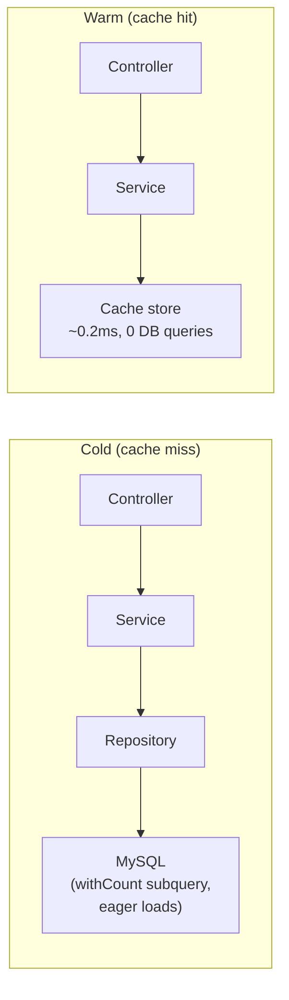
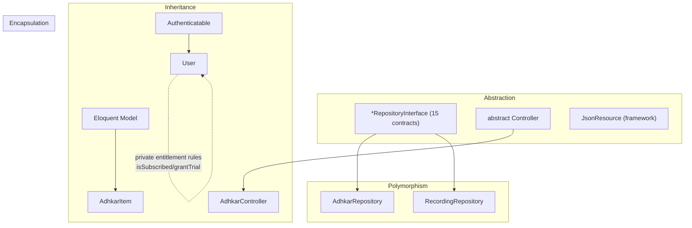
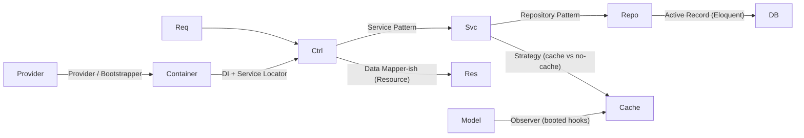
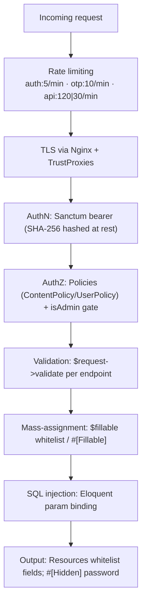

# 13. Caching Analysis

> The brief titles this "Redis Analysis." In production the cache **driver** is Redis; locally it is the file/database driver. The application code never calls Redis directly — it uses the Laravel `Cache` facade, so the strategy below is driver-agnostic and the same code path runs on file or Redis.

## 13.1 Strategy: read-through with versioned keys + event invalidation

Three caching idioms coexist:

1. **Read-through (`Cache::remember`)** — the default for public, non-user-specific reads. Used by `AdhkarService`, `TahsinatService`, `CourseService`, `FeatureFlagService`, `SponsorService`, `RecitationService`.
2. **Write-through (`Cache::put` after a fresh fetch, `Cache::forget` first)** — `SurahService` and `ReciterService` proactively refresh long-lived (3600 s) entries instead of waiting for expiry.
3. **Event invalidation (model `booted()` hooks)** — `FeatureFlag` registers `static::saved(...)` and `static::deleted(...)` callbacks that `Cache::forget(FeatureFlagService::CACHE_KEY)` the instant an admin edits a flag in Filament, so flags propagate immediately rather than after the 300 s TTL.

## 13.2 Key structure & TTL map

| Key | TTL | Owner | Invalidated by |
|-----|-----|-------|----------------|
| `adhkar.v1.categories` | 300 s | AdhkarService | TTL expiry |
| `adhkar.v1.today` | 300 s | AdhkarService | TTL expiry |
| `tahsinat.v1.categories` | 300 s | TahsinatService | TTL |
| `courses.v1.all` | 300 s | CourseService | TTL |
| `features` (`FeatureFlagService::CACHE_KEY`) | 300 s | FeatureFlagService | **model `saved`/`deleted` hook** |
| `sponsors.all`, `sponsors.screen` | 300 s | SponsorService | `SponsorService` forget on update |
| `recitations.surah.{id}` | 300 s | RecitationService | TTL |
| `surahs.*`, `reciters.*` | 3600 s | Surah/ReciterService | write-through refresh |
| `otp:{email}`, `otp_session:{token}` | 600 s | GoogleAuthController | single-use `forget` on verify |
| `auth_exchange:{token}` | 300 s | GoogleAuthController | single-use `forget` on exchange |

The **`v1`** segment is a manual schema-version namespace: bumping it to `v2` invalidates a whole domain's cache atomically without `flush()`. The OAuth keys double as **ephemeral state store** (not just a cache) — they are the only place the pending-OTP and one-time-exchange state lives, which is why they must be a shared store (Redis in prod) and not an in-process array.

## 13.3 With-cache vs without-cache



| | Cold | Warm |
|---|------|------|
| DB queries (adhkar categories) | 2 (rows + count subquery folds into 1 SELECT) | **0** |
| Typical latency | DB round-trip + hydration (~5–25 ms) | in-memory/Redis fetch (~0.2–2 ms) |
| Cost under 30 s polling | every poll hits DB | 1 DB hit per 300 s window, rest served from cache |

**Performance gain.** The app's home screen polls several public endpoints on a ~30 s cadence. With a 300 s TTL, only ~1 in 10 polls reaches the database; the rest are served from cache. For N concurrent users this collapses what would be `N × polls` DB reads into `~1 read per key per 300 s`, which is the single biggest scalability lever in the backend.

## 13.4 Cache warming

`.claude/backend/cache-strategy.md` describes a **parallel cache-warming** plan (fan-out to 4 workers priming the hierarchy/features/sponsor keys after a deploy). In the current code the practical warming is **lazy** (first request after expiry pays the miss). A deploy-time `php artisan` warm step is the documented next increment; the `PopulateTranslations` command already calls `Cache::flush()` after a bulk translation backfill, which is the inverse operation (cold-start the cache deliberately).

---

# 14. OOP Analysis



**Encapsulation.** State is guarded behind intent-revealing methods rather than exposed columns. `User` never lets a caller poke `subscription_expires_at` directly to decide access — it exposes `isSubscribed()`, `hasActiveTrial()`, `grantTrial()`. `AdhkarCategory::iconUrl()` hides the storage-path → URL mapping. `$fillable` whitelists and `#[Hidden]` enforce that internal fields (`password`, `remember_token`) never escape. The `ApiResponse` trait encapsulates the envelope so no controller hand-builds JSON.

**Inheritance.** A shallow, deliberate hierarchy: every API controller extends one abstract `Controller` (to inherit `ApiResponse`); every content model extends `Model`; `User` extends `Authenticatable`; every resource extends `JsonResource`. Depth is intentionally ≤2 — composition (traits, injected services) is preferred over deep inheritance.

**Polymorphism.** The repository interfaces are the prime example: `AdhkarService` holds an `AdhkarRepositoryInterface` and calls `->categories()` without knowing the concrete class — any implementation satisfying the contract is substitutable (§15 Liskov). Method overriding appears in `HasTranslations::attributesToArray()` (overrides the model's serialization) and Filament's interface methods on `User` (`canAccessPanel`, `getFilamentName`).

**Abstraction.** Interfaces (`*RepositoryInterface`), the abstract `Controller`, and traits (`ApiResponse`, `HasTranslations`) define *what* without *how*. A service depends on the abstraction of "a thing that returns adhkar categories," not on Eloquent.

---

# 15. SOLID Principles

| Principle | Evidence in this codebase | Verdict |
|-----------|---------------------------|---------|
| **S — Single Responsibility** | Controller = HTTP; Service = orchestration/cache/tx; Repository = queries; Resource = serialization; Model = state+domain predicates. Each class changes for exactly one reason. | Strong |
| **O — Open/Closed** | Adding a new domain (e.g. "Lectures") = new Model/Repo/Service/Controller/Resource + one line in `RepositoryServiceProvider` + routes. No existing class is modified. Scopes (`active`, `ordered`) extend query behavior without editing the builder. | Strong |
| **L — Liskov Substitution** | Every `AdhkarRepository` is a drop-in for `AdhkarRepositoryInterface`; services never type-check or downcast. A fake/in-memory repo in tests substitutes cleanly. | Strong |
| **I — Interface Segregation** | 15 *small, role-specific* repository interfaces rather than one fat `RepositoryInterface`. `AdhkarRepositoryInterface` exposes only adhkar methods; `RecordingRepositoryInterface` only recording methods. No client depends on methods it doesn't use. | Strong |
| **D — Dependency Inversion** | High-level services depend on repository *interfaces*; the concrete binding lives in one provider. Controllers depend on services (concrete, but single-purpose). | Strong (repo layer), pragmatic (service layer) |

**Worked DIP example.**
```php
// High-level policy (service) depends on an abstraction:
class AdhkarService {
    public function __construct(private AdhkarRepositoryInterface $repository) {}
}
// The detail is wired once, separately:
$this->app->bind(AdhkarRepositoryInterface::class, AdhkarRepository::class);
```
Both the high-level (`AdhkarService`) and low-level (`AdhkarRepository`) modules depend on the abstraction (`AdhkarRepositoryInterface`); neither depends on the other directly. This is textbook DIP and is the reason the persistence layer is swappable.

**Honest caveat (ISP/SRP nuance).** Services are injected as concretes (`AdhkarService`, not an interface). That is a pragmatic choice — services have a single implementation, so an interface would be ceremony. It mildly weakens DIP at the controller→service seam but costs nothing in practice and is flagged as such in §32.

---

# 16. Design Patterns



| Pattern | Where | Why / Benefit | Trade-off |
|---------|-------|---------------|-----------|
| **Repository** | `*Repository` + `*RepositoryInterface` | Isolates persistence; swappable; testable | Extra indirection; some methods are thin pass-throughs |
| **Service Layer** | `App\Services\*` | Home for orchestration, cache, tx, entitlement | Risk of anemic services that only forward (a few here do) |
| **Dependency Injection** | constructor promotion everywhere | Explicit deps, testable, no globals | Requires container literacy |
| **Provider / Bootstrapper** | `RepositoryServiceProvider`, `AppServiceProvider`, `AdminPanelProvider` | Central wiring of bindings, rate limits, policies | Bindings live away from usage |
| **Active Record** | Eloquent models | Rapid CRUD, scopes, relations | Couples domain to ORM (mitigated by repos) |
| **Data Transfer / Presenter** | `JsonResource` classes | One serialization home, conditional fields | Per-entity boilerplate |
| **Strategy** | `RecordingService::canAccess` (free vs subscribed vs trial branches); cache vs direct read per service | Behavior selected at runtime | Branches instead of polymorphic classes (fine at this size) |
| **Observer** | model `booted()` `saved/deleted` → cache forget | Decoupled invalidation | Hidden side effects on save |
| **Facade** | `Cache`, `DB`, `Auth`, `Gate`, `Mail` | Terse static API over container singletons | Static-looking calls (actually proxied) |
| **Singleton** | container-managed framework services | One instance per request lifecycle | N/A |
| **Adapter** | `HasTranslations` wrapping Spatie's trait + overriding `attributesToArray` | Bends a library to the app's "full-map" contract | Couples to Spatie internals |
| **Factory** | `database/factories/UserFactory`, `createToken()` | Test data + token minting | Test-scope mostly |

The **dominant, defining pattern** is the layered **Controller → Service → Repository** triad with DI — applied with near-perfect consistency across all sixteen domains. That consistency is the codebase's biggest strength: once learned, every feature is navigable by convention.

---

# 31. Security Audit



## 31.1 Authentication

* **Sanctum personal access tokens.** Mobile sends `Authorization: Bearer <plaintext>`; the server stores only the **SHA-256 hash** (`personal_access_tokens.token`). A DB leak does not expose usable tokens.
* **Password hashing.** `casts(['password' => 'hashed'])` → bcrypt on write; `Hash::check` on login. OAuth-only accounts get a random 32-char bcrypt password they never use (so the row is valid but unusable for password login).
* **OAuth (PKCE).** The mobile flow exchanges `code` + `code_verifier` server-side, keeping `client_secret` off-device. The bearer token is **never** placed in a deep-link URL — only an opaque, single-use `session_token` is, which is exchanged once via `POST /auth/session-exchange` and immediately `forget()`-ed. Profile data is mapped server-side via `otp_session:{token} → email`, so no PII rides the URL.
* **OTP.** 6-digit codes are stored **hashed** (`Hash::make`) in cache with a 600 s TTL; resends are capped at 3 (`otp_resend:{email}`), verify is throttled (`throttle:otp`, 10/min/IP).
* **Account deletion hygiene.** Soft-deleted accounts are force-purged before an email is reused, preventing unique-index collisions and orphaned OAuth links.

## 31.2 Authorization

* **Policies.** `ContentPolicy` = public read (`viewAny/view → true`), admin-only write (`create/update/delete/forceDelete → isAdmin()`). Bound to 19 content models in `AppServiceProvider`. `UserPolicy` governs user management.
* **Panel gate.** `User::canAccessPanel()` → `isAdmin()` (`super_admin`/`admin`) keeps non-admins out of Filament entirely.
* **Entitlement gate.** Premium audio is gated in `RecordingService::canAccess()` *and* withheld at serialization in `RecordingResource` (defense in depth — a leaked stream URL still requires the row's `is_free` or an entitled user).
* **Route-level auth.** Write/user endpoints sit inside `auth:sanctum`; public reads stay open but IP-rate-limited.

## 31.3 Input validation & mass assignment

* Every write validates explicitly (`required`, `email`, `unique`, `in:`, `size:6`, `min:8`). Failures → uniform 422.
* **Mass assignment** is whitelisted via `$fillable` / `#[Fillable]`; there is no `$guarded = []`. `AuthService::updateProfile` additionally `array_filter`s nulls so a partial update never blanks untouched fields.

## 31.4 Injection, XSS, CSRF

* **SQL injection** — all queries go through Eloquent/Query Builder parameter binding; no string-concatenated SQL. The verse `LIKE` search binds the term as a parameter (`CONCAT('%', ?, '%')`).
* **XSS** — the API returns JSON consumed by React Native (no HTML rendering, no `dangerouslySetInnerHTML`). The one server-rendered HTML page (OAuth bounce) uses `htmlspecialchars()` / `json_encode()` on the deep link before interpolation.
* **CSRF** — N/A for the token-authenticated API (no cookies → no CSRF surface). Filament's web panel uses Laravel's session CSRF protection by default.

## 31.5 Findings & risk ranking

| # | Finding | Severity | Recommendation |
|---|---------|----------|----------------|
| 1 | `GuzzleHttp\Client(['verify' => false])` in the Google token exchange disables TLS verification | **High** | Enable cert verification in production; `verify:false` invites MITM on the token exchange |
| 2 | `CheckRole` reads `$request->user()->role` (a column) instead of spatie `hasRole()` | Medium | Unify on `hasRole()`; the `role` column may be stale/absent |
| 3 | 500s swallow the exception (`error('Server error', 500)`) | Low (good for clients) / Medium (observability) | Ensure server-side logging captures `$e` (Laravel does by default) so swallowed errors are still traceable |
| 4 | `TrustProxies(at: '*')` trusts all proxies | Low | Acceptable behind a controlled Nginx; pin to the proxy subnet if the topology hardens |
| 5 | Verse search is an unindexed `LIKE` | Low (security) | DoS-adjacent under heavy search; add FULLTEXT / external index (see §30) |

Overall the security posture is **solid for a single-tenant content app**: hashed tokens, hashed OTPs, PKCE, no PII in URLs, policy-gated writes, parameterized queries, whitelisted serialization. The TLS-verification-disabled Guzzle call is the one item that should be fixed before it is considered production-hardened.

---
