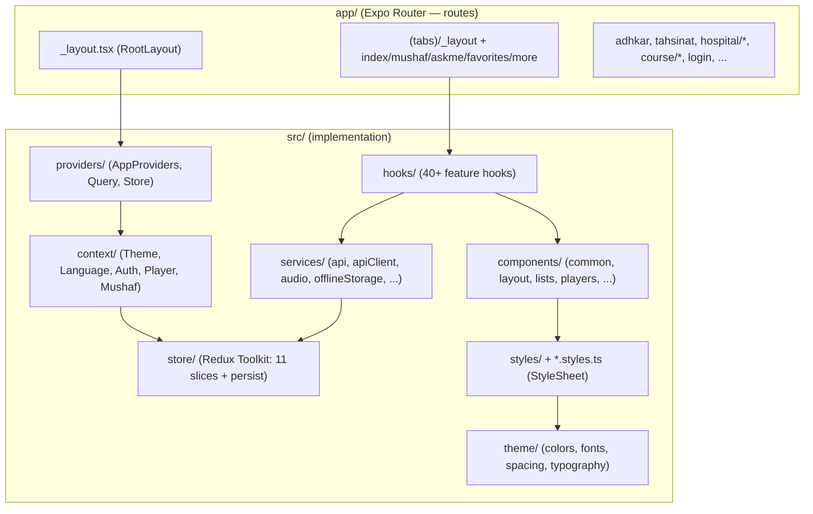
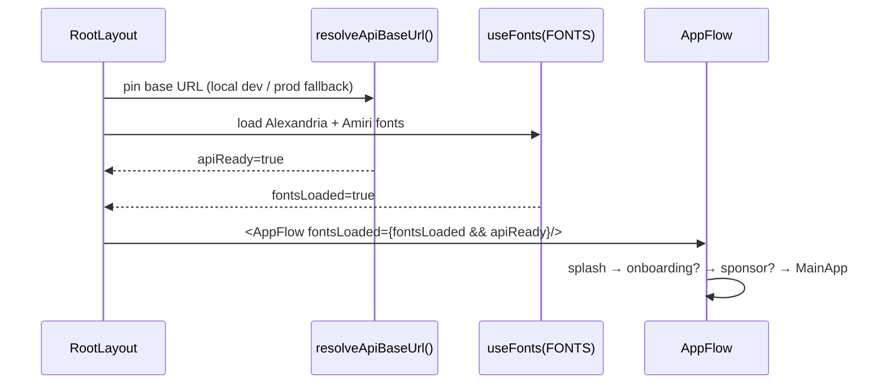
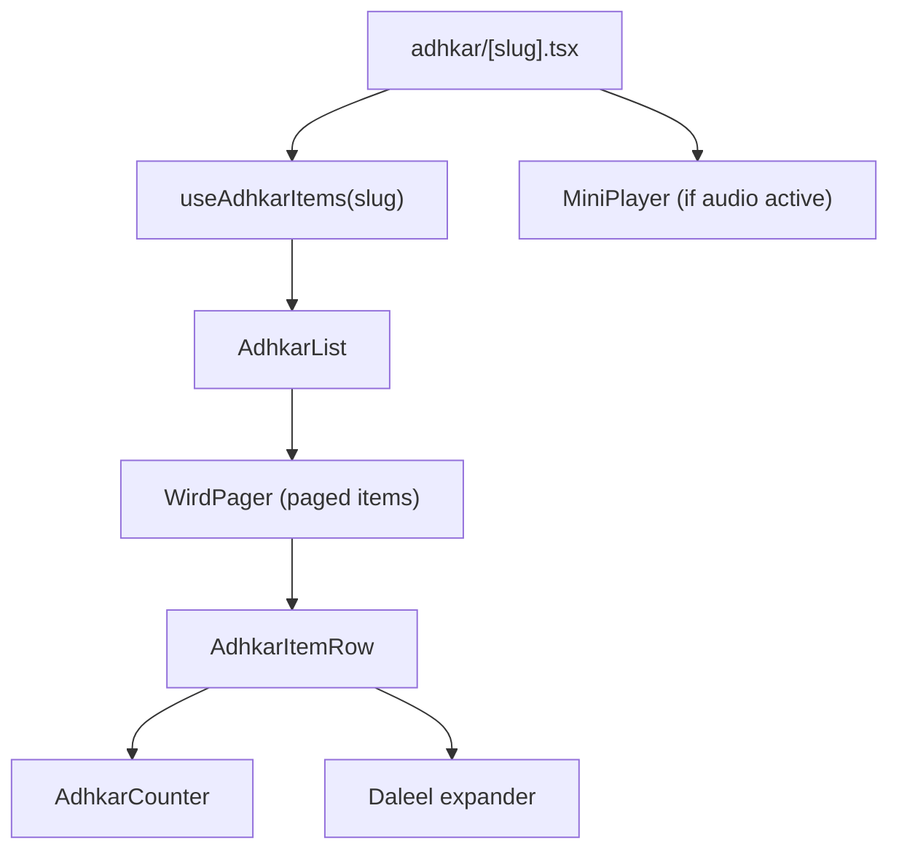
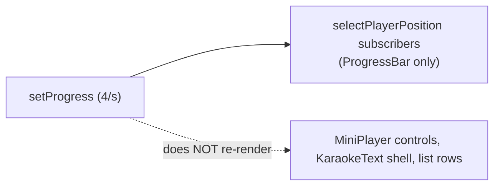
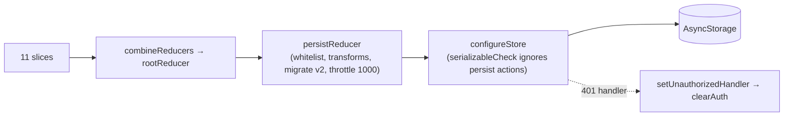
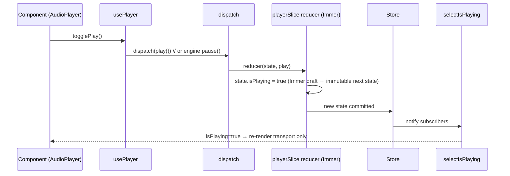
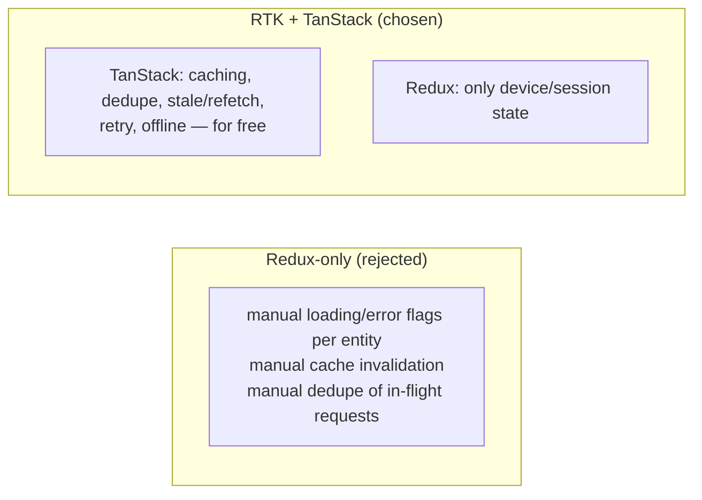
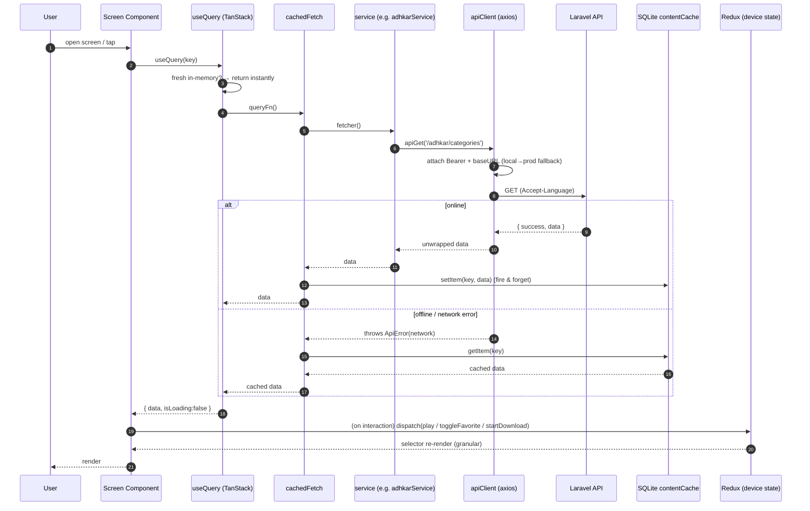

# 17. Frontend Architecture

The client is a **React Native 0.81 / React 19 app on Expo 54** using **Expo Router 6** (file-based routing). It is *not* a web SPA — there is no DOM, no Tailwind, no Next.js. Rendering targets native iOS/Android views; "the web" target exists only as `react-native-web` for incidental tooling.

## 17.1 Layered structure



**Separation of concerns is enforced by folder convention:**
* `app/` holds *only* route files; most route files are thin and delegate to `src/components` (e.g. `app/(tabs)/_layout.tsx` is a one-line re-export of `TabsLayout`).
* `src/services/` is the only layer that talks to the network or device storage.
* `src/hooks/` adapts services into React state (TanStack queries + Redux selectors).
* `src/components/` is presentational, grouped by role (`common`, `forms`, `layout`, `lists`, `players`, `mushaf`, `onboarding`).
* `*.styles.ts` files hold every `StyleSheet` — **a hard rule**: no `StyleSheet.create` inside a `.tsx` (CLAUDE.md, "TOP PRIORITY, NON-NEGOTIABLE").

## 17.2 The provider tree (composition root)

```tsx
// src/providers/AppProviders.tsx
<ThemeProvider>
  <LanguageProvider>
    <AuthProvider>
      <QueryClientProvider client={queryClient}>
        <StoreProvider>
          <PlayerProvider>
            <MushafProvider>{children}</MushafProvider>
          </PlayerProvider>
        </StoreProvider>
      </QueryClientProvider>
    </AuthProvider>
  </LanguageProvider>
</ThemeProvider>
```

**Ordering is deliberate and is itself a piece of architecture:**
* `ThemeProvider` / `LanguageProvider` are outermost — they have no dependencies and everything below consumes them.
* `AuthProvider` sits above `QueryClientProvider` so auth state can gate/seed queries.
* `StoreProvider` (Redux) wraps `PlayerProvider` / `MushafProvider` because the audio-engine contexts dispatch into the store.
* `QueryClientProvider` provides the single shared TanStack `queryClient`.

This is the **dual-state architecture**: TanStack Query owns *server* state, Redux owns *device/session* state, and React Context owns *cross-cutting singletons* (theme, language, the imperative audio engine). Three tools, three non-overlapping responsibilities.

## 17.3 Boot sequence



`RootLayout` blocks on two async preconditions (fonts + API URL resolution) before revealing `AppFlow`, which runs the splash→onboarding→sponsor→tabs gate using the persisted `onboarding` slice.

---

# 18. React Component Analysis

Components are grouped by responsibility. A representative cross-section:

| Component | Props (key) | Local state | Hooks | Role |
|-----------|-------------|-------------|-------|------|
| `TabsLayout` | – | – | router, `useFeatures` | Declares the bottom-tab navigator; hides tabs whose feature flag is off |
| `AdhkarCounter` | `target`, `onComplete` | `count` | `useState`, `useCallback` | Tap-to-count dhikr with haptics; resets per item |
| `AudioPlayer` | `recording` | – | `usePlayer`, `useVerseTiming` | Presentational shell over the global player slice |
| `KaraokeText` | `segments`, `position` | – | `useMemo` (active segment) | Highlights the verse/segment matching playback position |
| `CategoryGrid` | `categories`, `onPress` | – | – | `FlatList` of `CategoryCard`; pure presentational |
| `MiniPlayer` | – | – | `usePlayer`, selectors | Sticky mini transport; subscribes to player slice |
| `OnboardingPager` | `onDone` | `page` | `useRef`, `useState` | Horizontal pager over onboarding slides |

**Parent → child rendering example (Adhkar items screen):**



Rendering order is top-down: the screen calls the hook (suspends on `isLoading` with a `Loader`), then maps the returned category's items into a `WirdPager`; each `AdhkarItemRow` owns its own counter state so counting one dhikr never re-renders siblings.

## 18.1 Container/presentational split

The codebase follows a consistent **container hook + presentational component** split. `usePlayer()` (container logic: selectors + dispatch + imperative engine) is consumed by `AudioPlayer`/`MiniPlayer` (pure view). This keeps view components free of Redux/engine knowledge and makes them trivially reusable and testable.

---

# 19. React Memory & Rendering Analysis

## 19.1 Virtual DOM → native: reconciliation in React Native

React Native runs the same **reconciliation/diffing** algorithm as React DOM, but commits to a **native view hierarchy** via Fabric (the New Architecture) instead of HTML. The element tree is diffed (O(n) heuristic: same type ⇒ update props, different type ⇒ unmount+mount, `key` identity for lists), and only changed native views are mutated on the UI thread. Lists use `FlatList`/`FlashList`-style windowing so off-screen rows are not mounted.

## 19.2 Render-trigger inventory & optimizations

The app is deliberately engineered to **minimize re-render fan-out** through three techniques:

1. **Granular selectors.** `playerSlice` exports ~16 atomic selectors (`selectIsPlaying`, `selectPlayerPosition`, …). A component subscribing to `selectIsPlaying` re-renders only when the boolean flips — not when `positionMillis` ticks every 250 ms. This is the single most important rendering optimization in the app: the high-frequency `setProgress` dispatch (4×/sec) only re-renders the progress bar, not the whole player.
2. **`useMemo`-wrapped hook return objects.** Every feature hook (`usePlayer`, `useDownloadManager`) returns a `useMemo`-stabilized object, so consumers receive a referentially-stable API and don't re-render on unrelated parent renders.
3. **`useCallback` on every handler** passed to children, so memoized children (`React.memo`) keep stable prop identity.



## 19.3 Identified risks & opportunities

| Area | Risk | Mitigation present? |
|------|------|---------------------|
| `setProgress` 4–10×/sec | re-render storm if a broad selector is used | **Mitigated** by atomic `selectPlayerPosition` |
| `usePlayer` return object | new identity each render | **Mitigated** by `useMemo` with full dep array |
| Large `FlatList`s (verses, recordings) | mounting all rows | windowing + stable `keyExtractor` |
| `KaraokeText` active-segment calc | recompute each tick | `useMemo` keyed on `position`+`segments` (§21) |
| Persisted store writes on download progress | I/O storm | **Mitigated** by `redux-persist` `throttle: 1000` |

---

# 20. useEffect Analysis

The codebase is notably **effect-light** — most data flows through TanStack `useQuery` (which internally manages its own effects) rather than hand-rolled `useEffect` fetches. The effects that do exist fall into three safe categories:

**(a) One-shot boot effects** — `RootLayout`:
```tsx
React.useEffect(() => {
  resolveApiBaseUrl().finally(() => setApiReady(true));
}, []);   // empty deps → runs once on mount
```
Why it exists: pin the API base URL before any request. Dependency behavior: `[]` ⇒ mount-only. No cleanup needed (idempotent, fire-and-forget). **No infinite-loop risk** (no state it sets is in its deps).

**(b) Subscription effects with cleanup** — network status, audio-engine status listeners, notification handlers. Pattern:
```tsx
useEffect(() => {
  const sub = NetInfo.addEventListener(handler);
  return () => sub();        // cleanup unsubscribes
}, [handler]);
```
Cleanup behavior: every listener returns an unsubscribe to prevent leaks across remounts.

**(c) Resume/lifecycle effects** — `DownloadResumer` calls `resumeIncomplete()` on app foreground. It reads `store.getState()` directly (not a render closure) precisely to avoid a stale-closure bug and to keep the dep array minimal.

**Audit findings:**
* No effect in the reviewed set has a missing-dependency infinite loop. The one place that could (download progress updating state that re-triggers an effect) is avoided by routing progress through Redux dispatch, not component state.
* **Redundant-effect risk is low** because data fetching is delegated to TanStack, eliminating the classic `useEffect(()=>{fetch()},[])` anti-pattern almost everywhere.
* **Recommendation:** continue preferring `useQuery` over manual fetch effects; for the imperative audio engine, keep status subscriptions in the `PlayerProvider` context (single subscription) rather than per-component effects.

---

# 21. useMemo Analysis

`useMemo` is used for two purposes: **(1) stabilizing hook return objects** (the dominant use) and **(2) caching derived computations**.

**Derived-value example — `KaraokeText` active segment:**
```tsx
const activeIndex = useMemo(
  () => segments.findIndex(s => position >= s.start && position < s.end),
  [segments, position],
);
```
* **Cached value:** the index of the currently-spoken segment.
* **Recalculation condition:** only when `position` (playback ms) or `segments` changes. Since `segments` is stable per recording, this is effectively recomputed once per tick — but the linear scan is O(k) over a small k (verses in a recording), and memoization prevents recomputation on unrelated re-renders (e.g. a theme change).

**Before vs after optimization:**
```
// Before: recomputed on EVERY render (theme toggle, parent re-render, etc.)
const activeIndex = segments.findIndex(...);   // O(k) each render

// After: recomputed only when position/segments change
const activeIndex = useMemo(() => segments.findIndex(...), [segments, position]);
```

**Object-stabilization example — `usePlayer` returns a `useMemo`** over ~21 fields with an exhaustive dependency array, so `AudioPlayer`/`MiniPlayer` receive a stable object and only re-render when an actual player field changes.

> Caveat (flagged in §32): when a memoized value depends on a value that changes every tick (`position`), the memo's *practical* benefit is "don't recompute on unrelated renders" rather than "don't recompute at all." That is still a net win in this codebase because theme/language/parent renders are frequent.

---

# 22. useCallback Analysis

`useCallback` is applied to **every handler returned from a hook or passed to a memoized child**. `usePlayer` and `useDownloadManager` are the canonical examples — every method (`loadAndPlay`, `seekTo`, `togglePlay`, `download`, `cancel`, …) is wrapped.

```tsx
const seekTo = useCallback((millis: number) => {
  engine.seek(millis);
  dispatch(seekAction(millis));
}, [engine, dispatch]);   // stable identity across renders
```

**Why / memory benefit:**
* **Referential stability →** children wrapped in `React.memo` don't re-render because their `onSeek` prop identity is unchanged.
* **Dependency hygiene →** because handlers are stable, they can be listed in other hooks' dependency arrays without causing churn (e.g. `runDownload` is a dep of `download` and `resumeIncomplete`).
* **Memory:** the function object is allocated once and retained across renders instead of a new closure per render. For a screen that renders frequently (player ticking), this avoids dozens of short-lived closure allocations per second and the GC pressure they create.

**The combined pattern** — `useCallback` for every handler + a final `useMemo` for the returned object — is what makes these "fat" hooks safe to consume widely without triggering render storms. It is applied with discipline across the hook layer.

---

# 23. Redux Analysis (Redux Toolkit)

Redux Toolkit owns **device/session state** that must survive navigation and (selectively) app restarts. Eleven slices are combined in `rootReducer`:

```
auth · player · downloads · favorites · readings · features ·
onboarding · notifications · offlineQueue · ui · drivingMode
```

## 23.1 Store configuration



**Persistence policy (`store.ts`):**
* **`whitelist`**: `auth, favorites, readings, features, onboarding, notifications, downloads, offlineQueue` are persisted. **`player` and `ui` are intentionally ephemeral** (a restart should not resume a half-played track or a stale toast).
* **Transforms**: `downloadsTransform` persists only `completed`, `wifiOnly`, and *resumable* `tasks` (filtering out `cancelled`) and **recomputes `storageUsed`** on rehydration from the `completed` map — derived state is never trusted from disk. `onboardingTransform` persists only `hasCompletedOnboarding`.
* **Migrations**: `version: 2` with a migration that resets onboarding so all existing installs re-see onboarding after the bump.
* **`throttle: 1000`**: caps persistence to ~1 write/sec because download-progress actions dispatch many times per second — without this, AsyncStorage would thrash.

## 23.2 Action → Reducer → Store → Component flow



`playerSlice` is the richest slice: it models the global Ruqyah player (current recording, playback position/duration, rate, queue for "general ruqyah" shuffle, and user display prefs like `textColor`/`fontSize`/`isDarkMode`). It uses **Immer** (built into RTK `createSlice`) so reducers "mutate" a draft while producing immutable state. Its `stop()` reducer returns `initialState` wholesale — a clean reset idiom.

## 23.3 Selectors

Selectors are colocated with their slice and are **atomic** (one field each). `selectMiniPlayerVisible` is the one *derived* selector (`miniPlayerVisible && currentRecording !== null`), encapsulating the "only show the mini player if something is loaded" rule so no component re-implements it. The granularity is the rendering-performance foundation described in §19.

---

# 24. TanStack Query Analysis

TanStack Query owns **server state**. The single `queryClient` is configured once:

```tsx
new QueryClient({ defaultOptions: { queries: {
  staleTime: 1000 * 60 * 5,        // 5 min: data is "fresh" → no refetch on remount
  retry: 1,                        // one retry, then fail to the catch/fallback
  refetchOnWindowFocus: false,     // RN has no window focus; avoid needless refetch
  networkMode: 'offlineFirst',     // run queryFn even offline so the catch can serve cache
}}});
```

## 24.1 Why each option

* **`staleTime: 5 min`** matches the backend's 300 s cache TTL — the client treats data as fresh for the same window the server caches it, so navigating between screens reuses in-memory results with zero network.
* **`networkMode: 'offlineFirst'`** is the crucial choice: TanStack still *runs the queryFn when offline*, so each hook's `cachedFetch` wrapper can catch the network error and return the SQLite-cached copy instead of leaving the UI stuck loading.
* **`retry: 1`** keeps a transient blip recoverable without hammering.

## 24.2 Query keys & the offline cache bridge

```tsx
// hooks/useAdhkar.ts
useQuery({
  queryKey: cacheKeys.adhkarCategories,
  queryFn: () => cachedFetch('adhkar_categories', adhkarService.getCategories),
  staleTime: FIVE_MIN,
});
```

Query keys are centralized in `utils/cacheKeys.ts` (stable arrays, parameterized like `adhkarItems(slug)`), preventing the classic "stringly-typed key drift" bug. The `queryFn` is **always** `cachedFetch(diskKey, serviceCall)`:

```tsx
// services/contentCache.ts
export async function cachedFetch<T>(cacheKey, fetcher) {
  try { const data = await fetcher(); void contentCache.setItem(cacheKey, data); return data; }
  catch (e) { const cached = await contentCache.getItem<T>(cacheKey); if (cached !== null) return cached; throw e; }
}
```

This is a **three-tier read cache**: TanStack in-memory (fastest) → SQLite `content_cache_v1.db` (survives restart/offline) → network. Writes are fire-and-forget (`void setItem`), and write failures are swallowed (cache is best-effort).

## 24.3 Why TanStack instead of Redux-only for server data



Putting server data in Redux would mean hand-writing request dedupe, staleness, retry, and cache eviction — exactly what TanStack provides declaratively. The split keeps Redux small (no giant normalized entity cache) and lets server data live where caching is a first-class feature. Mutations (favorites toggle) use `useMutation` with optimistic updates + `invalidateQueries` on settle.

---

# 25. Frontend Data Flow (end to end)



Every step has a defined owner: **axios interceptors** (auth header + local→production fallback + 401→`clearAuth`), **services** (endpoint + unwrap), **cachedFetch** (offline tiering), **TanStack** (in-memory cache/stale/retry), **Redux** (device state + persistence), **selectors** (granular re-render). A 401 anywhere triggers `onUnauthorized()` → `store.dispatch(clearAuth())` (wired in `store.ts` to avoid a circular import), logging the user out app-wide from a single seam.

---

# 29. Styling Analysis (React Native StyleSheet — not Tailwind)

> The brief asks for "Tailwind CSS Analysis." **This project does not use Tailwind or NativeWind.** Styling is React Native `StyleSheet.create` with a design-token system. This section analyzes the *actual* styling architecture and translates the brief's intent (class-by-class layout reasoning) onto it.

## 29.1 The token system

Styles never hardcode values. Three token modules under `theme/` are the single source of truth:
* **`colors.ts`** → `palette` (e.g. `palette.brand[500] = #135452`, `palette.text.primary`, `palette.border.secondary`). **Hardcoding a hex literal in a component/style file is forbidden** (CLAUDE.md). Component-specific opacity tints are the only sanctioned local constants, and must be documented inline.
* **`spacing.ts`** → `radius` (e.g. `radius.md`, `radius.lg`) and spacing scale.
* **`typography.ts` / `fonts.ts`** → `fontFamily.arabic` (Amiri), `fontFamily.alexandria(Light)` for Latin/UI.

## 29.2 Co-located style files (the non-negotiable rule)

Every component has a sibling `Component.styles.ts`; every screen has `src/styles/screen.styles.ts`. No `StyleSheet.create` may appear inside a `.tsx`. This is the RN analogue of "separation of structure and presentation" and is enforced as the top-priority mobile rule.

## 29.3 Class-by-class → property-by-property (the requested deep dive)

A Tailwind class string like `flex flex-row items-center justify-between gap-3` maps directly onto RN style objects. Worked from the real `adhkarItemsScreen.styles.ts`:

```ts
navRow: { flexDirection: 'row', gap: 12 },
navBtn: {
  flex: 1, flexDirection: 'row', alignItems: 'center',
  justifyContent: 'center', gap: 8,
  backgroundColor: palette.brand[25], borderRadius: radius.md,
  paddingHorizontal: 16, paddingVertical: 12,
},
```

| RN property | Tailwind equivalent | Layout/render effect |
|-------------|---------------------|----------------------|
| `flexDirection: 'row'` | `flex flex-row` | Yoga lays children left→right (RTL-aware: flips under `dir=rtl`) |
| `flex: 1` (on `navBtn`) | `flex-1` | Each button grows to share the row equally |
| `alignItems: 'center'` | `items-center` | Cross-axis centering (vertical in a row) |
| `justifyContent: 'center'` | `justify-center` | Main-axis centering of icon+label |
| `gap: 8` | `gap-2` | 8px between icon and label without margins |
| `paddingHorizontal/Vertical` | `px-4 py-3` | Touch target padding |
| `backgroundColor: palette.brand[25]` | `bg-brand-50` | Token-driven fill (`#ebfafa`) |
| `borderRadius: radius.md` | `rounded-md` | Rounded corners from the radius scale |

**The layout engine.** RN uses **Yoga** (a Flexbox implementation) rather than CSS. There is no `display:block`, no document flow, no media queries — every view is Flexbox by default (`flexDirection` defaults to `column`, unlike web's `row`). Equivalent "native CSS" for `navBtn` would be:
```css
.navBtn { display:flex; flex-direction:row; align-items:center; justify-content:center;
          gap:8px; flex:1; background:#ebfafa; border-radius:8px; padding:12px 16px; }
```

## 29.4 RTL & typography

Because the app is Arabic-first, text styles set `writingDirection: 'rtl'` and `textAlign: 'center'` with `fontFamily.arabic` (Amiri) at large line-heights (e.g. `fontSize: 22, lineHeight: 40`) for Qur'anic legibility, while UI chrome uses Alexandria. Yoga's automatic RTL mirroring means the same `flexDirection: 'row'` lays out right→left when the locale is Arabic — no separate stylesheet.

---
