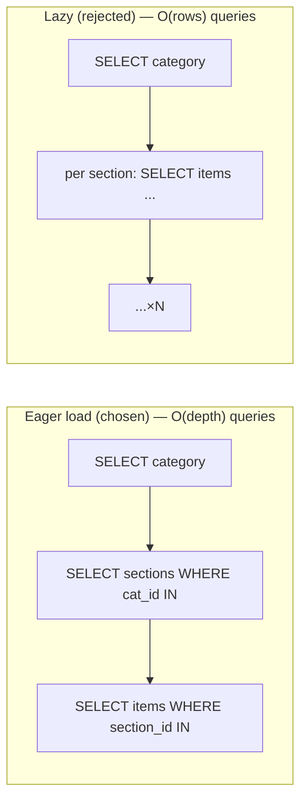
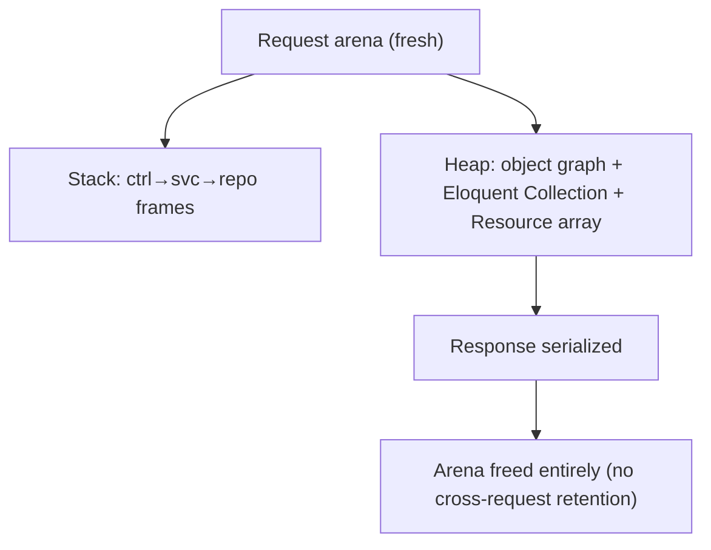
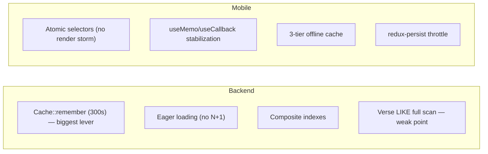
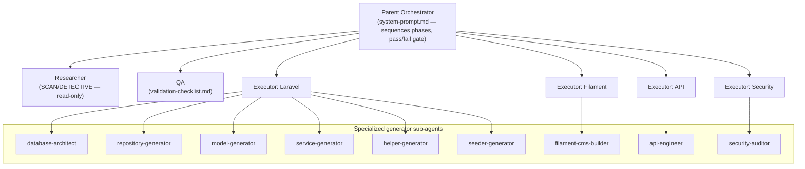
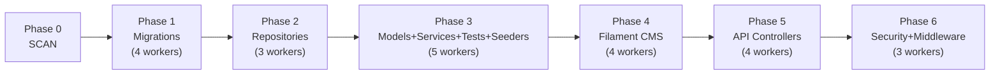

# 26. Algorithm Analysis

Most endpoints are I/O-bound (a DB read + a cache lookup), so their "algorithm" is dominated by index behavior rather than CPU. The genuinely algorithmic spots are below, each with Big-O and a justification.

| Feature | Core operation | Time | Space | Notes |
|---------|----------------|------|-------|-------|
| Adhkar/category list | indexed scan + correlated count, then 300 s cache | O(c·log i) cold → **O(1)** amortized | O(c) | Cache collapses repeated polls |
| Category detail tree | 4 eager-load queries (`WHERE IN`) + hydrate | O(n) in result size | O(n) | No N+1; fixed query count |
| Verse search | leading-wildcard `LIKE` over ~6,236 JSON rows | **O(n·m)** (n rows, m term len) | O(k) results | Full scan; mitigated by cache + tiny fixed corpus (§10) |
| Disease alias search | `LIKE` over `disease_aliases` + join to diseases | O(a) | O(k) | Small alias table; index on disease_id |
| Adhkar per-section shuffle | Fisher–Yates over a section's items (`order_randomly`) | **O(k)** | O(1) in place | Fresh shuffle each view; client-side (`flattenAdhkar`) |
| Karaoke active segment | linear scan of segments vs. position | O(s) per tick | O(1) | s = verses in a recording (small); `useMemo`-gated (§21) |
| Download resume | filter resumable tasks, re-issue | O(t) | O(t) | t = parked tasks; runs once on foreground |
| Prayer-time scheduling | `adhan` library astronomical calc | O(1) per day | O(1) | Pure math; no network |
| Subscription/entitlement | 3 boolean predicates | **O(1)** | O(1) | `isSubscribed`/`hasActiveTrial`/`canGrantTrial` |

**Why these choices are optimal at this scale.**
* The **eager-load (`WHERE IN`) strategy** is the optimal general solution for nested object reads: it is O(depth) queries instead of O(rows) (N+1), and each query is index-served. A single wide JOIN would be fewer round-trips but would multiply rows (a category × sections × items cartesian) and require PHP-side de-duplication — strictly worse for tree payloads.
* **Verse search is deliberately the one O(n·m) operation.** With a fixed 6,236-row corpus, a full scan completes in well under a millisecond and avoids the operational cost of a FULLTEXT index or an external search service. The decision is revisited in §30 only if search becomes high-traffic.
* **Fisher–Yates** is the correct unbiased shuffle (O(k), in-place) for the `order_randomly` sections; doing it client-side means variety on every view without server state.



---

# 27. Memory Analysis

## 27.1 Backend (PHP, per-request arena)

PHP-FPM uses a **share-nothing, per-request memory model**: each request gets a fresh arena that is wholly freed when the response is sent. There is no long-lived heap to leak into across requests.

* **Stack:** local variables, the controller→service→repository call frames. Shallow (≤4 frames deep for a typical read).
* **Heap:** the resolved object graph (controller + service + repository ≈ 3 small objects), the hydrated Eloquent `Collection` (the dominant allocation — one model object per row), and the serialized array the Resource builds. For the adhkar category list that is ~tens of model objects; for verse search up to ~50 result models.
* **Object instantiation:** Eloquent models are `new`'d during hydration (one per row, plus relation models). The Resource then produces a plain `array`, after which the models become collectible.
* **GC:** PHP frees the entire request arena at teardown (reference counting + cycle collector). Because nothing is registered as a request-scoped singleton holding references, there is no cross-request retention. The cache (`Cache::remember`) stores the *serialized* value in Redis/file, not PHP heap, so warm hits allocate only the deserialized array — skipping model hydration entirely (a real memory win, not just a latency win).



## 27.2 Mobile (JS heap + native)

* **JS heap (Hermes engine):** Redux state tree (small — device/session only), TanStack in-memory query cache (the largest structured allocation; bounded by `gcTime`), component fiber tree. Immer in RTK produces new immutable state objects on each action but lets the old ones be GC'd.
* **Stack vs heap in a handler:** `seekTo(millis)` — `millis` is a stack primitive; the closure captured by `useCallback` lives on the heap but is allocated **once** (stable identity) instead of per render, which is precisely the GC-pressure reduction §22 describes.
* **Native memory:** the audio engine (expo-av/expo-audio) buffers and the downloaded files (managed by `audioService` on the filesystem, not the JS heap). `redux-persist throttle:1000` bounds AsyncStorage write churn; the `downloadsTransform` recomputes `storageUsed` rather than holding it, avoiding drift.
* **Leak avoidance:** every device-event subscription (NetInfo, audio status, notifications) returns an unsubscribe in its effect cleanup (§20), so remounts don't accumulate listeners.

---

# 28. Package Analysis

## 28.1 Backend (composer)

| Package | Version | Problem solved | Alternatives | Trade-off |
|---------|---------|----------------|--------------|-----------|
| `laravel/framework` | ^13.0 | The application framework | Symfony, Slim | Convention-heavy; massive ecosystem |
| `filament/filament` (+actions, tables) | 5.4.5 | Admin panel (Livewire CRUD, widgets) | Nova (paid), hand-rolled | Livewire coupling; rapid admin UI |
| `laravel/sanctum` | ^4.3 | API token auth (mobile) | Passport (OAuth2 server), JWT | Lightweight; no full OAuth2 server |
| `laravel/socialite` | ^5.26 | Google OAuth | league/oauth2-client | Adds a dependency but standardizes providers |
| `spatie/laravel-permission` | ^7.4 | Roles/permissions | Bouncer, gates only | DB-backed roles; extra tables |
| `spatie/laravel-translatable` | ^6.14 | JSON i18n columns | separate columns, gettext | Couples models to Spatie; clean single-column i18n |
| `spatie/laravel-medialibrary` | ^11.22 | File/media handling (logos, audio, icons) | raw Storage | Conversions/collections; heavier than raw disk |
| `laravel/tinker` | ^3.0 | REPL | – | dev convenience |
| `laravel/pint` | ^1.27 (dev) | Code style (PSR-12) | php-cs-fixer | Opinionated formatter |
| `phpunit/phpunit`, `mockery`, `fakerphp/faker` | dev | Tests, mocks, fixtures | Pest | Standard test stack |
| `laravel/pail` | ^1.2.5 (dev) | Live log tailing | `tail -f` | Nicer DX in `composer dev` |

## 28.2 Mobile (npm)

| Package | Purpose | Why over alternatives |
|---------|---------|------------------------|
| `expo` 54 + `expo-router` 6 | Framework + file-based routing | Managed workflow, OTA updates, EAS build |
| `react` 19 / `react-native` 0.81 | UI runtime | New Architecture (Fabric/Hermes) |
| `@reduxjs/toolkit` + `react-redux` + `redux-persist` | Device/session state + persistence | RTK reduces boilerplate vs. vanilla Redux |
| `@tanstack/react-query` 5 | Server-state cache | Dedupe/stale/retry/offline for free (§24) |
| `axios` | HTTP client | Interceptors (auth + local→prod fallback) |
| `expo-audio` + `expo-av` | Audio playback | Streaming + downloaded; karaoke timing |
| `expo-sqlite` | Offline content + Mushaf storage | Structured offline cache (§24) |
| `expo-secure-store` | Token storage | OS keystore vs. plain AsyncStorage for secrets |
| `expo-notifications` | Push + local scheduling | Adhkar reminders |
| `expo-auth-session` + `expo-web-browser` + `expo-crypto` | OAuth PKCE + `openAuthSessionAsync` | Secure OAuth on device (§2.3, §31) |
| `expo-file-system` | Download manager I/O | Resumable downloads |
| `@react-native-community/netinfo` | Connectivity (Wi-Fi-only downloads, offline detection) | – |
| `adhan` | Prayer-time astronomy | Offline, deterministic calc |
| `react-native-svg` (+ transformer) | Vector icons (RemoteSvg) | Crisp scalable assets |
| `@expo-google-fonts/alexandria` + `/amiri` | UI + Qur'anic typography | Bundled, RTL-correct |
| `expo-location` / `expo-sensors` | Prayer times by location; driving-mode detection | – |
| `react-native-gesture-handler` / `-screens` / `-safe-area-context` | Navigation primitives | Expo Router deps |

---

# 30. Performance Audit (full stack, ranked)



| # | Area | Finding | Severity | Recommendation |
|---|------|---------|----------|----------------|
| 1 | DB / search | Verse & alias search are unindexed `LIKE` scans | **High** (if search grows) | Add MySQL `FULLTEXT` on a generated column, or Meilisearch; keep the cache |
| 2 | Backend TLS | Guzzle `verify:false` on Google token exchange | **High** (security+correctness) | Enable verification (also §31) |
| 3 | Caching | Lazy-only warming; first request after expiry pays the miss | Medium | Deploy-time `artisan` warm of hierarchy/features/sponsor keys |
| 4 | DB | No pagination on some list endpoints (full collections) | Medium | Adopt `paginated()` (already in `ApiResponse`) for large lists (recordings) |
| 5 | Mobile | `KaraokeText` recomputes active segment each tick | Low | Acceptable (small s); could binary-search segments if recordings lengthen |
| 6 | Mobile | TanStack `gcTime` defaults retain query cache | Low | Tune `gcTime` for memory-constrained devices |
| 7 | Backend | `LogUserActivity` writes on activity | Low | Already throttled to ≤1/hour via `saveQuietly` — good |
| 8 | Images | Remote SVG/PNG icons fetched per render | Low | `expo-image` caches; ensure cache headers from Nginx |

**Strengths to preserve:** the 300 s read-through cache (turns N×polls into ~1 DB read/window), the strict no-N+1 eager-load discipline, the composite indexes matching exact query shapes, and the mobile atomic-selector design that keeps the 4 Hz progress tick from re-rendering the tree.

---

# 32. Best-Practices Audit

| Module | Follows best practice | Violates / risk | Recommendation |
|--------|----------------------|-----------------|----------------|
| **Layering** | Textbook Controller→Service→Repo→Resource; DI throughout | A few services are thin pass-throughs (anemic) | Inline trivial services or accept as uniformity tax |
| **Models** | `casts()`, scopes, `$fillable` whitelist, `#[Hidden]` | `User` mixes Filament + API concerns in one model | Acceptable for a single-tenant app; document the dual role |
| **Auth** | Hashed tokens/OTP, PKCE, no PII in URLs, policies | `CheckRole` reads `->role` column vs spatie `hasRole()`; Guzzle `verify:false` | Unify role source; enable TLS verify |
| **Error handling** | Uniform try/catch → `ApiResponse`; uniform 422 wrap | 500s swallow `$e` from the client (good) but rely on default logging | Ensure structured logging/Sentry in prod |
| **Caching** | Versioned keys, event invalidation on FeatureFlag | Most invalidation is TTL-only; manual key list | Centralize keys + tag-based invalidation where driver supports it |
| **i18n** | Single-source JSON columns; full-map serialization; bilingual rule | `Accept-Language` locale barely used (full map returned anyway) | Keep; it is intentional for offline language switch |
| **Mobile state** | Clean RTK/TanStack split; granular selectors; persist transforms | `player`/`ui` ephemeral by design (correct) | None |
| **Mobile styling** | Token system; co-located styles; no hardcoded hex | Enforced by convention, not lint | Add an ESLint rule to fail on inline `StyleSheet.create` / hex literals |
| **Mobile networking** | Single axios client; local→prod fallback; 401 seam | Fallback logic is subtle | Keep the documented invariants (CLAUDE.md) under test |
| **Testing** | PHPUnit + Mockery + Faker wired | Coverage depth not visible in this teardown | Add feature tests for entitlement + OAuth edge cases |
| **File hygiene** | 450-line cap; Filament split into Form/Table | – | Maintain via CI check |

Overall grade: **the codebase is unusually disciplined** — consistent layering, real DI, defense-in-depth entitlement, and a thoughtful offline-first mobile architecture. The handful of issues (search indexing, Guzzle TLS, role-source inconsistency) are localized and individually low-effort to fix.

---

# 33. Complete Request Lifecycle (the grand tour)

The following traces a single high-value request — **a user tapping a premium Ruqyah session while briefly offline, then reconnecting** — through every layer of both tiers. It is the synthesis of every preceding section.

```mermaid
sequenceDiagram
    autonumber
    participant U as User (device)
    participant Cmp as RecordingList / AudioPlayer
    participant TQ as useRecordings (TanStack)
    participant CF as cachedFetch
    participant AC as apiClient (axios)
    participant SQL as SQLite contentCache
    participant Ngx as Nginx (TLS)
    participant TP as TrustProxies→Sanctum→SetLocale
    participant TH as throttle:api
    participant Ctrl as RecordingController
    participant Svc as RecordingService
    participant Repo as RecordingRepository
    participant DB as MySQL
    participant Ca as Cache (Redis)
    participant Res as RecordingResource
    participant RTK as Redux player slice

    U->>Cmp: tap a disease's sessions
    Cmp->>TQ: useQuery(['recordings', diseaseId])
    TQ->>CF: queryFn (offlineFirst runs even offline)
    CF->>AC: apiGet('/recordings?disease_id=..')
    AC->>AC: baseURL=local(dev) + Bearer token
    alt offline
        AC-->>CF: throw ApiError(network)
        CF->>SQL: getItem(key) → cached sessions
        SQL-->>TQ: cached list (UI not stuck)
    else online
        AC->>Ngx: GET (https, X-Forwarded-Proto)
        Ngx->>TP: forwarded headers honored; locale set
        TP->>TH: rate-limit (120/min by user id)
        TH->>Ctrl: index(Request)
        Ctrl->>Svc: getByDisease(id)
        Svc->>Ca: remember? (list cache)
        alt cache miss
            Ca->>Repo: byDisease(id)
            Repo->>DB: SELECT ... WHERE disease_id=? ORDER BY session_number (indexed)
            DB-->>Repo: rows
            Repo-->>Ca: Collection
        end
        Ca-->>Svc: Collection
        Svc-->>Ctrl: Collection
        Ctrl->>Res: RecordingResource::collection (audio_url withheld if premium & unentitled)
        Res-->>Ctrl: array
        Ctrl-->>AC: { success, data:[...] }
        AC->>CF: unwrapped data
        CF->>SQL: setItem(key, data) (write-through, fire&forget)
        CF-->>TQ: data
    end
    TQ-->>Cmp: { data, isLoading:false }
    U->>Cmp: press play on session #2 (premium)
    Cmp->>AC: GET /recordings/{id}/stream (Bearer)
    AC->>Ctrl: stream(id)
    Ctrl->>Svc: canAccess(recording, user)
    Svc->>Svc: isFree? no → subscribed/trial? if canGrantTrial → grantTrial() (side effect)
    alt entitled (or trial auto-granted)
        Svc-->>Ctrl: true
        Ctrl-->>AC: { audio_url }
        AC-->>Cmp: url
        Cmp->>RTK: dispatch(setRecording + play)
        RTK-->>Cmp: selectIsPlaying flips → transport re-renders only
        Cmp-->>U: audio plays (+ MiniPlayer)
    else not entitled
        Ctrl-->>AC: 403
        AC->>AC: ApiError(subscription:true)
        AC-->>Cmp: open SubscriptionSheet
    end
```

**Lifecycle narration (layer by layer):**

1. **Browser/Device → React.** The component calls a TanStack hook; `offlineFirst` guarantees the query function runs even with no connectivity.
2. **API client.** Axios attaches the bearer token and the dev base URL; on local failure it would silently fall back to production (non-auth, non-validation errors only).
3. **Offline tier.** On a network error, `cachedFetch` serves the last SQLite copy — the user sees sessions instantly, never an infinite spinner.
4. **Edge.** Nginx terminates TLS; `TrustProxies` makes generated media URLs `https`; Sanctum resolves the user; `SetLocale` sets the locale; the throttle bucket admits the request.
5. **Controller.** Thin: validates `disease_id`, delegates, maps to a Resource, wraps in the envelope, all inside try/catch.
6. **Service.** Owns the cache boundary and — on the stream call — the **entitlement decision**, including the trial-auto-grant side effect.
7. **Repository.** The only layer touching Eloquent; the `(disease_id, session_number)` index makes the read index-served.
8. **Database / Cache.** A warm cache skips the DB entirely; a cold read hydrates a Collection.
9. **Resource.** Serializes to JSON, **withholding the premium `audio_url`** from unentitled users (defense in depth).
10. **Back to the client.** `cachedFetch` writes through to SQLite; TanStack caches in memory; the component renders.
11. **Interaction → Redux.** Pressing play dispatches into the player slice; a *single atomic selector* re-renders only the transport, not the tree.
12. **Teardown.** The PHP request arena is freed wholesale; the JS closures persist with stable identity for the session.

---

# 34. How This System Was Built — Claude Agents, Subagents, Skills, Rules & Memory

This codebase is itself an artifact of an **agentic, multi-phase Claude workflow**. The `.claude/` directory is not documentation *about* the app — it is the **operating manual that produced it**. This section reverse-engineers that meta-layer.

## 34.1 The orchestration topology



**Roles** (`.claude/backend/roles/`) define *who acts*: a **Parent Orchestrator** that sequences work and renders a pass/fail verdict; a **Researcher** that may only read; a **QA** role that validates each phase against a checklist; and four **Executors** (Laravel, Filament, API, Security) that write code in their domain. **Agents** (`.claude/backend/agents/`) are nine narrow *generators* — e.g. `model-generator.md` literally enumerates each model's traits/relations/methods, which is why every model in §4 is so uniform.

## 34.2 Phases & modes (the build pipeline)

`phase-modes.md` defines explicit **modes** that gate whether code may be written:

| Mode | Meaning |
|------|---------|
| SCAN | read structure, **no code** |
| DETECTIVE | analyze/validate/research, **no code** |
| PLAN | design architecture, **no code** |
| EXECUTION | **write code** |
| DEBUG | root-cause before fix, **no code** |
| SPLIT | split an oversized file, **code** |
| BYPASS | skip a phase |

The build ran in **six EXECUTION phases**, several with parallel workers:



This phase order is *visible in the code*: migrations and repositories exist as clean, independent layers precisely because they were generated first, in isolation, before the layers that depend on them. The "N workers" notation is the multi-agent fan-out — independent files (e.g. 19 migrations) generated concurrently, then reconciled by QA.

## 34.3 Rules & memory (the guardrails)

Three tiers of persistent instruction shaped every decision:

* **Shared context** (`shared-context.md`) — project-wide invariants: the **450-line file cap** (auto-split, no permission), the **migration amendment rule** (edit the original `create_*` migration + `migrate:fresh`, never add migrations), the category-type state machine (`standard`/`direct`/`disease_direct`, mutually exclusive, enforced by a `LogicException` on save), and the business rule **session 1 free / session ≥ 2 premium / max 2 trials** — which is exactly what `RecordingService::canAccess()` and `User::canGrantTrial()` implement.
* **Domain rules** (`backend/rules.md`, `mobile/CLAUDE.md`) — e.g. the Filament Schemas/Form + Tables/Table split (visible across all ~25 resources in §1's file listing), the mobile "no hex literals / styles in their own file / bilingual `{ar,en}`" trio, and the **local-first API URL with production fallback** that `apiClient.ts` implements byte-for-byte.
* **Auto-memory** (the assistant's cross-session memory) — durable facts like the deployment runbook, the SSH endpoint, the OAuth return-URL contract, and the "never start a dev server / never occupy a port" constraint. These are *operator* facts that don't live in the repo but governed how changes were shipped.

## 34.4 MCP & skills

`.claude/backend/mcp/` wires **Model Context Protocol** servers — a `filesystem-config.json` (scoped file access) and a `database-config.json` (live DB introspection) — so the generator agents could read the real schema while writing repositories/models. The mobile side documents a **Figma MCP** protocol (single SSE connection, one `get_design_context` call, no retries) used to translate Figma frames into the token-driven `*.styles.ts` files — which is why several style files carry `// Figma <node-id>` provenance comments (seen in `adhkarItemsScreen.styles.ts`).

## 34.5 Why this matters for an onboarding engineer

The uncanny *uniformity* documented throughout this dossier — every domain an identical Controller→Service→Repository→Resource slice, every model with the same `casts()`/scope shape, every Filament resource split the same way — is not an accident of a single tidy author. It is the **mechanical consequence of a rules-driven, agentic build**: specialized agents generating each layer under explicit phase gates and a shared rulebook, validated by a QA role before the next phase began. To extend the system, the highest-leverage move is to **read `.claude/` first** and add features the same way: amend the rulebook, generate the layer, keep the slice uniform. The architecture's greatest asset — predictability — is preserved only by continuing to build the way it was built.

---

## Appendix A — Document provenance & honesty ledger

This dossier was generated by reverse-engineering the actual source. Where the original brief presumed technology not present in the codebase, reality was documented and the divergence flagged:

| Brief assumption | Reality in this codebase |
|------------------|--------------------------|
| Redis (as application code) | Laravel `Cache` abstraction; Redis is the prod *driver* only |
| Tailwind CSS | React Native `StyleSheet` + design tokens (§29) |
| Redux-Saga / Redux for server data | RTK for device state + **TanStack Query** for server state (§24) |
| Next.js / React web | React Native + Expo Router (native) (§17) |
| Polymorphic `morphMany/morphTo` in app | Framework-level only (Sanctum/spatie); app uses nullable FKs + a manual `service_type` morph (§3) |
| RIGHT/CROSS JOIN, window functions | Deliberately absent; eager loads + correlated subqueries instead (§10) |
| "Laravel 12 / Filament 4" | **Laravel ^13.0 / Filament 5.4.5** per `composer.json` |

Every code excerpt is quoted from the repository; every SQL statement is the query Eloquent generates for the cited call; assumptions (where unavoidable) are labelled inline.

> *This concludes the core teardown (§1–34). The master-thesis deep-dive appendices follow: §35 SQL techniques (used and unused, with real-world examples), §36 service-container internals, §37 the full DB→memory→API→UI data flow, §38 in-memory data structures, §39 algorithms, §40 glossary, §41–44 Filament/jobs/API/mobile reference, §45–46 per-entity reference, §47 architectural synthesis, and §48–51 operations (error handling, deployment, i18n/RTL, notifications).*
