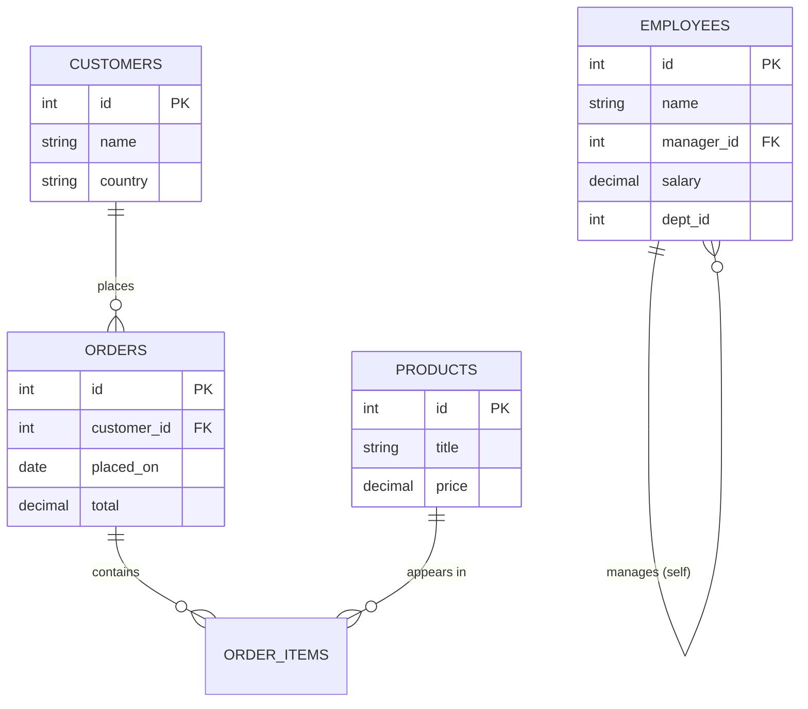

# 35. SQL Techniques Compendium — Used, Unused, and Taught by Example

> **Purpose of this chapter.** §10 summarized which SQL constructs this codebase uses. This chapter is the *teaching* counterpart requested for the thesis edition: every major relational technique is explained from first principles, with a **self-contained real-world example** (drawn from familiar domains — e-commerce, payroll/HR, a gaming leaderboard, a school timetable), the **exact SQL**, the **execution mechanics**, **time/space complexity**, and finally **whether and why Quranic Clinic uses it**. Techniques the project deliberately avoids (RIGHT JOIN, CROSS JOIN, FULL OUTER JOIN, UNION, window functions, recursive CTEs) are taught here in full with external examples so the omission is *understood*, not merely noted.

To anchor every example, we use one shared teaching schema (independent of the app):



## 35.1 INNER JOIN — "rows that match on both sides"

**Concept.** Returns only rows where the join predicate is satisfied in *both* tables. Non-matching rows from either side are discarded.

**Real-world example — "every order with its customer's name":**
```sql
SELECT o.id, o.total, c.name
FROM orders o
INNER JOIN customers c ON c.id = o.customer_id;
```
A customer with no orders never appears; an order with a NULL `customer_id` never appears. The result cardinality is "one row per matching pair."

**Mechanics.** The optimizer typically picks a *nested-loop* join when one side is small and indexed (probe `customers` by PK for each order), a *hash join* for large unindexed equjoins (build a hash table on the smaller side, probe with the larger), or a *merge join* when both inputs are sorted on the key.

**Complexity.** Nested-loop with an index on the inner side: **O(n · log m)**. Hash join: **O(n + m)** time, **O(min(n,m))** memory for the hash table.

**In Quranic Clinic.** Generated implicitly by the favorites many-to-many: `User::favorites()` emits `SELECT diseases.* ... INNER JOIN favorites ON favorites.disease_id = diseases.id WHERE favorites.user_id = ?` (§10). Eloquent never writes the `JOIN` by hand — `belongsToMany` compiles it.

## 35.2 LEFT (OUTER) JOIN — "keep all of the left, match where possible"

**Concept.** Returns every row from the left table; columns from the right are NULL when there is no match. The workhorse of "X and its optional Y."

**Real-world example — "all customers and how much they've spent, including those who never ordered":**
```sql
SELECT c.id, c.name, COALESCE(SUM(o.total), 0) AS lifetime_value
FROM customers c
LEFT JOIN orders o ON o.customer_id = c.id
GROUP BY c.id, c.name;
```
A brand-new customer still appears with `lifetime_value = 0` — impossible with INNER JOIN, which would silently drop them. The classic "find rows with **no** match" idiom builds on this:
```sql
SELECT c.id, c.name
FROM customers c
LEFT JOIN orders o ON o.customer_id = c.id
WHERE o.id IS NULL;          -- customers who never ordered
```

**Mechanics.** Same join algorithms as INNER, but the left side is never eliminated; unmatched right columns are NULL-extended.

**Complexity.** Same as the corresponding inner join; the NULL-extension is free.

**In Quranic Clinic.** Appears under `whereHas()` / `has()` filtering and is the conceptual shape behind "categories that have at least one active recording." Eloquent often prefers an `EXISTS` subquery over a literal LEFT JOIN for existence checks (§35.9), but the semantics are LEFT-JOIN-derived.

## 35.3 RIGHT (OUTER) JOIN — taught by example (NOT used in this project)

**Concept.** The mirror of LEFT JOIN: keep every row from the *right* table, NULL-extend the left. Logically redundant — any RIGHT JOIN can be rewritten as a LEFT JOIN by swapping table order — which is exactly why disciplined codebases avoid it.

**Real-world example — "every product and its order lines, including never-sold products":**
```sql
SELECT p.title, oi.quantity
FROM order_items oi
RIGHT JOIN products p ON p.id = oi.product_id;   -- keep ALL products
```
This surfaces products that have never been sold (their `oi.quantity` is NULL). The identical result, written the conventional way:
```sql
SELECT p.title, oi.quantity
FROM products p
LEFT JOIN order_items oi ON oi.product_id = p.id;
```

**Why Quranic Clinic does not use it.** Every query in the app is *anchored on the entity you are fetching* (the surah, the category, the disease), and you always want to "keep all of the thing I asked for," which is naturally a LEFT JOIN reading top-down. A RIGHT JOIN forces the reader to mentally reverse table order; banning it removes a class of "which side is preserved?" bugs. **Recommendation for any contributor:** if you ever feel the urge to write a RIGHT JOIN, swap the `FROM` and use LEFT instead.

## 35.4 FULL OUTER JOIN — taught by example (NOT used; MySQL lacks it natively)

**Concept.** Keep *all* rows from both sides, matching where possible, NULL-extending where not. Useful for reconciliation ("what exists on either side but not both").

**Real-world example — reconciling two systems' customer lists:**
```sql
-- PostgreSQL / SQL Server syntax:
SELECT a.email AS crm_email, b.email AS billing_email
FROM crm_customers a
FULL OUTER JOIN billing_customers b ON a.email = b.email
WHERE a.email IS NULL OR b.email IS NULL;   -- present in exactly one system
```
**MySQL has no `FULL OUTER JOIN`**; you emulate it with `LEFT JOIN ∪ RIGHT JOIN`:
```sql
SELECT a.email, b.email FROM crm_customers a LEFT JOIN billing_customers b ON a.email=b.email
UNION
SELECT a.email, b.email FROM crm_customers a RIGHT JOIN billing_customers b ON a.email=b.email;
```

**Why Quranic Clinic does not use it.** There is no two-sided reconciliation use case — content always has a clear owning parent. Its absence is correct for the domain.

## 35.5 CROSS JOIN — taught by example (NOT used in this project)

**Concept.** The Cartesian product: every row of A paired with every row of B. No predicate. Output cardinality is `|A| × |B|` — it explodes fast and is almost never what you want by accident, but is invaluable for *generating combinations*.

**Real-world example 1 — build a complete "store × date" calendar grid for a sales report** (so days with zero sales still show a 0, not a gap):
```sql
SELECT s.id AS store_id, d.day, COALESCE(SUM(o.total),0) AS revenue
FROM stores s
CROSS JOIN (SELECT DISTINCT placed_on AS day FROM orders) d   -- every store × every day
LEFT JOIN orders o ON o.store_id = s.id AND o.placed_on = d.day
GROUP BY s.id, d.day;
```

**Real-world example 2 — generate a size × color matrix for a product variant seeding script:**
```sql
SELECT sz.label AS size, col.label AS color
FROM sizes sz
CROSS JOIN colors col;     -- S/M/L × Red/Green/Blue = 9 variant rows
```

**Complexity.** **O(|A| · |B|)** rows produced — quadratic; dangerous on large inputs. A 10k × 10k cross join is 100 million rows.

**Why Quranic Clinic does not use it.** The one place a Cartesian product could conceptually appear — "every reciter × every surah" — is instead modeled as **explicit `recitations` rows** (only the combinations that actually have audio exist). That is the right call: a reciter usually records a *subset* of surahs, so a materialized cross join would create thousands of rows for recordings that don't exist. Storing only real pairs keeps the table dense and the `unique(reciter_id, surah_id)` index meaningful. **If** the app ever needed a "coverage matrix" admin view (which reciter is missing which surah), *that* report would legitimately use a CROSS JOIN of `reciters × surahs` LEFT JOINed to `recitations` to highlight the gaps — a textbook use of the very technique the runtime avoids.

## 35.6 SELF JOIN — taught by example (NOT used; the app has no self-referential runtime query)

**Concept.** A table joined to itself, using two aliases, to relate rows *within* the same table — hierarchies, "compare a row to another row of the same kind," adjacency.

**Real-world example — "each employee with their manager's name":**
```sql
SELECT e.name AS employee, m.name AS manager
FROM employees e
LEFT JOIN employees m ON m.id = e.manager_id;   -- two aliases of one table
```
Another classic — "pairs of products at the same price" (de-duplicated with `a.id < b.id` to avoid mirror pairs and self-pairs):
```sql
SELECT a.title, b.title, a.price
FROM products a
JOIN products b ON a.price = b.price AND a.id < b.id;
```

**Why Quranic Clinic does not use it.** No table is self-referential at runtime. The `diseases` table *could* have been a self-parenting tree (disease → sub-disease), but the design instead uses **separate `categories`/`subcategories` tables** — a deliberate choice that trades the flexibility of an arbitrary-depth self-join tree for a fixed, index-friendly two-level taxonomy with simpler queries. (The teaching schema's `EMPLOYEES.manager_id` self-reference is shown above precisely to illustrate what the app chose *not* to do.)

## 35.7 UNION / UNION ALL — taught by example (NOT used in this project)

**Concept.** Stack the rows of two *compatible* result sets (same column count/types) vertically. `UNION` removes duplicates (an implicit sort/hash — costly); `UNION ALL` keeps everything (cheap).

**Real-world example — a unified "activity feed" from heterogeneous sources:**
```sql
SELECT 'order'  AS kind, o.placed_on AS at, c.name AS who FROM orders o JOIN customers c ON c.id=o.customer_id
UNION ALL
SELECT 'review' AS kind, r.created_at,    c.name        FROM reviews r JOIN customers c ON c.id=r.customer_id
ORDER BY at DESC
LIMIT 50;
```
`UNION ALL` is chosen because feed items are inherently distinct; paying for de-duplication would be wasted work.

**Complexity.** `UNION ALL`: **O(n + m)** (concatenate). `UNION`: **O((n+m) log(n+m))** or hash-based dedup — strictly more expensive.

**Why Quranic Clinic does not use it.** Each endpoint returns a *homogeneous* collection (all adhkar, all recordings). There is no "mixed feed" endpoint. If a future "What's new" screen aggregated new courses + new recordings + announcements into one stream, **that** endpoint would be the natural home for `UNION ALL` (with a `kind` discriminator column), or — more in keeping with this codebase's style — it would be assembled in PHP by merging three Eloquent collections, trading a little memory for type safety and per-source eager loading.

## 35.8 GROUP BY / HAVING — aggregation and post-aggregate filtering

**Concept.** `GROUP BY` collapses rows sharing a key into one row per group, over which aggregates (`COUNT`, `SUM`, `AVG`, `MIN`, `MAX`) are computed. `WHERE` filters rows *before* grouping; `HAVING` filters groups *after* aggregation.

**Real-world example — "countries with more than 100 customers, by average order value":**
```sql
SELECT c.country, COUNT(DISTINCT c.id) AS customers, AVG(o.total) AS avg_order
FROM customers c
JOIN orders o ON o.customer_id = c.id
WHERE o.placed_on >= '2026-01-01'     -- pre-aggregation row filter
GROUP BY c.country
HAVING COUNT(DISTINCT c.id) > 100      -- post-aggregation group filter
ORDER BY avg_order DESC;
```

**Mechanics.** The engine sorts or hashes by the grouping key, then folds each group. `HAVING` cannot use a row that has already been aggregated away — that is the whole point of the WHERE/HAVING split.

**Complexity.** **O(n log n)** (sort-group) or **O(n)** with a hash aggregate, plus **O(g)** for the groups.

**In Quranic Clinic.** Used in the **Filament analytics widgets**: `UserGrowthWidget` groups registrations by day (`GROUP BY DATE(created_at)`), `HospitalDistributionWidget` counts recordings per category, `TopPlayedRecordingsWidget` orders by `plays_count`. The app's *read API* avoids `GROUP BY` on the hot path, preferring `withCount` (a correlated subquery, §35.9) which returns the parent rows un-collapsed — important because the API wants the full category object *plus* a count, not an aggregated projection.

## 35.9 Subqueries, correlated subqueries & EXISTS

**Concept.** A query nested inside another. A **scalar subquery** returns one value; a **correlated subquery** references the outer row and runs once per outer row; **EXISTS** returns a boolean and short-circuits on the first match.

**Real-world example — "customers who have ordered the featured product" (EXISTS short-circuits):**
```sql
SELECT c.id, c.name
FROM customers c
WHERE EXISTS (
    SELECT 1 FROM orders o JOIN order_items oi ON oi.order_id = o.id
    WHERE o.customer_id = c.id AND oi.product_id = 42
);
```
**Correlated scalar subquery — "each customer with their order count" (the `withCount` shape):**
```sql
SELECT c.id, c.name,
       (SELECT COUNT(*) FROM orders o WHERE o.customer_id = c.id) AS order_count
FROM customers c;
```

**EXISTS vs IN.** `EXISTS` is usually preferable for correlated existence checks because it stops at the first hit and handles NULLs cleanly; `IN` materializes a value list. `NOT IN` with a NULL in the list is a notorious foot-gun (it can return zero rows unexpectedly) — `NOT EXISTS` is the safe form.

**In Quranic Clinic.** This is the **most-used non-trivial construct** in the app. Every `withCount('items')` is a correlated `COUNT(*)` scalar subquery (§4.4a); `User::hasOAuthProvider()` is `SELECT EXISTS(...)`; eager loading uses `WHERE parent_id IN (...)`. These are the backbone of the read layer.

## 35.10 Window functions — taught by example (NOT used in this project)

**Concept.** Compute a value *across a set of rows related to the current row* **without collapsing them** (unlike GROUP BY). The `OVER (PARTITION BY ... ORDER BY ...)` clause defines the window. This is the single most powerful analytical SQL feature and the one most worth teaching here, since the app deliberately forgoes it.

**Real-world example 1 — a gaming leaderboard: rank players within each region:**
```sql
SELECT player, region, score,
       ROW_NUMBER() OVER (PARTITION BY region ORDER BY score DESC) AS rank_in_region,
       RANK()       OVER (PARTITION BY region ORDER BY score DESC) AS rank_with_ties,
       DENSE_RANK() OVER (PARTITION BY region ORDER BY score DESC) AS dense_rank
FROM scores;
```
`ROW_NUMBER` gives 1,2,3,4…; `RANK` gives 1,2,2,4 (gaps after ties); `DENSE_RANK` gives 1,2,2,3.

**Real-world example 2 — "top 3 selling products per category" (window in a subquery, then filter):**
```sql
SELECT * FROM (
  SELECT p.category_id, p.title, SUM(oi.quantity) AS units,
         ROW_NUMBER() OVER (PARTITION BY p.category_id ORDER BY SUM(oi.quantity) DESC) AS rn
  FROM products p JOIN order_items oi ON oi.product_id = p.id
  GROUP BY p.category_id, p.id, p.title
) t
WHERE rn <= 3;
```

**Real-world example 3 — running total / month-over-month with `SUM(...) OVER` and `LAG`:**
```sql
SELECT month, revenue,
       SUM(revenue) OVER (ORDER BY month) AS running_total,
       revenue - LAG(revenue) OVER (ORDER BY month) AS mom_change
FROM monthly_revenue;
```

**Complexity.** Typically **O(n log n)** (a sort per partition/order), then a single linear pass applying the frame.

**Why Quranic Clinic does not use them.** The analytics that *would* use `ROW_NUMBER`/`RANK` (top-played recordings, daily growth) operate on small result sets where a plain `ORDER BY ... LIMIT n` or a `GROUP BY DATE(...)` is simpler and avoids coupling to a specific MySQL version's window-function support. **The honest trade-off:** if the admin dashboard ever needed "top 3 recordings *per category*" in one query, hand-rolling that without window functions is painful (you'd loop in PHP or use correlated subqueries), and `ROW_NUMBER() OVER (PARTITION BY category_id ORDER BY plays_count DESC)` would be the clearly superior tool. The current data volume simply hasn't justified it yet — a deferral, not a dead end.

## 35.11 Common Table Expressions (CTE) & recursion — taught by example (NOT used)

**Concept.** `WITH name AS (...)` names a subquery for readability/reuse; `WITH RECURSIVE` walks hierarchies/graphs.

**Real-world example — explode an org chart to arbitrary depth:**
```sql
WITH RECURSIVE chain AS (
    SELECT id, name, manager_id, 1 AS depth FROM employees WHERE id = 1   -- anchor (the CEO)
    UNION ALL
    SELECT e.id, e.name, e.manager_id, c.depth + 1
    FROM employees e JOIN chain c ON e.manager_id = c.id                  -- recurse
)
SELECT * FROM chain;
```

**Why Quranic Clinic does not use it.** Its taxonomies are **fixed-depth** (Category → Subcategory → Disease → Recording; Category → Section → Item). Fixed depth means plain nested eager loads suffice and a recursive CTE would be over-engineering. A recursive CTE would only earn its place if the taxonomy became arbitrary-depth (e.g. nested sub-sub-categories), which the product intentionally avoids for UX simplicity.

## 35.12 Summary matrix

| Technique | Used here? | If unused, the real-world example that would justify it |
|-----------|-----------|----------------------------------------------------------|
| INNER JOIN | ✅ (via `belongsToMany`) | — |
| LEFT JOIN | ✅ (via `has`/`whereHas` semantics) | — |
| RIGHT JOIN | ❌ | Any LEFT JOIN with tables swapped; banned for readability |
| FULL OUTER JOIN | ❌ | Two-system reconciliation (CRM vs billing) |
| CROSS JOIN | ❌ | Store×Date report grid; reciter×surah coverage matrix |
| SELF JOIN | ❌ | Employee→manager; arbitrary-depth disease tree (rejected design) |
| UNION / UNION ALL | ❌ | A heterogeneous "What's new" activity feed |
| GROUP BY / HAVING | ✅ (Filament widgets) | — |
| Correlated subquery / EXISTS / IN | ✅ (pervasive: `withCount`, eager loads) | — |
| Window functions | ❌ | Leaderboard ranking; top-N-per-group; running totals |
| Recursive CTE | ❌ | Arbitrary-depth org chart / nested taxonomy |

The throughline: **Quranic Clinic uses exactly the relational machinery its fixed-depth, parent-anchored, read-mostly domain requires — and no more.** Each omission above is a defensible match between data shape and tool, and each is now teachable with a concrete example a new engineer can carry to a project where the tool *is* the right answer.

---
