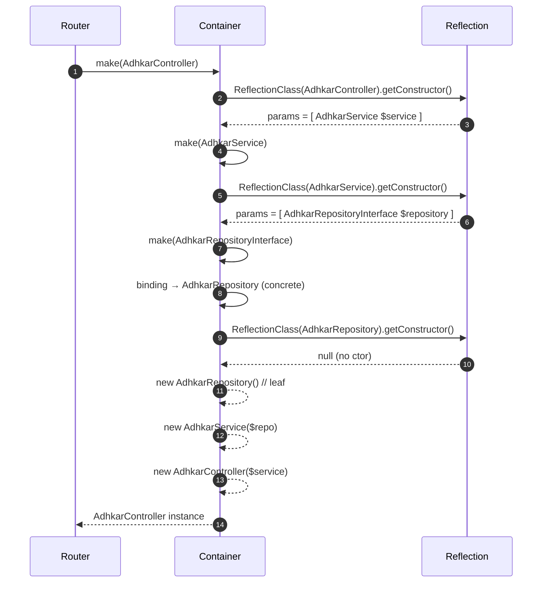
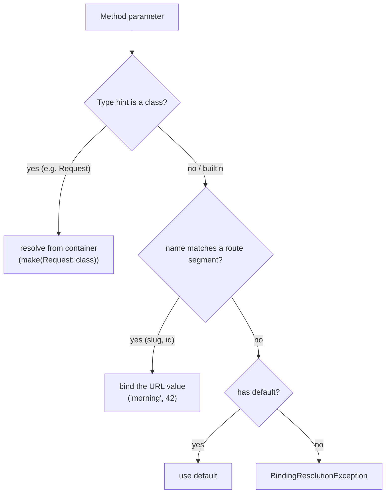
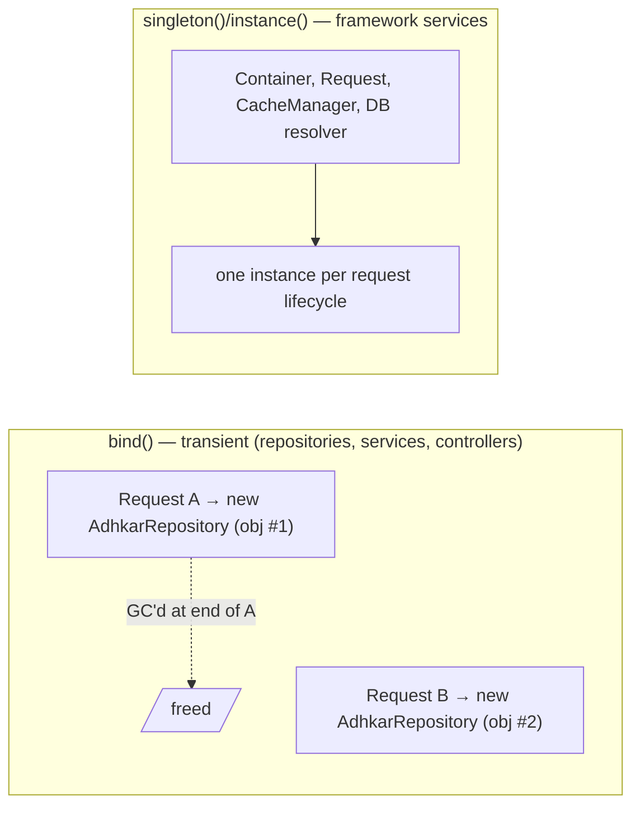

# 36. Constructor & Service-Container Internals (Deep Dive)

> §5 established *that* the app uses constructor injection. This chapter explains *how the Laravel service container actually builds an object graph* — the reflection, the resolution stack, contextual bindings, parameter resolution, and the precise memory effects — at the level of detail a thesis demands. The running example is the real chain `AdhkarController → AdhkarService → AdhkarRepositoryInterface → AdhkarRepository`.

## 36.1 What "the container" is

The container is a single object (`Illuminate\Foundation\Application`, a subclass of `Container`) created once per request in `public/index.php`. It holds three core maps:

```
$bindings   : abstract  => ['concrete' => Closure|class, 'shared' => bool]   // how to build
$instances  : abstract  => object                                            // already-built singletons
$resolved   : abstract  => bool                                              // has been built at least once
```

`bind()` writes a `['shared' => false]` entry (transient); `singleton()` writes `['shared' => true]`; `instance()` puts a ready object straight into `$instances`. `RepositoryServiceProvider::register()` performs fifteen `bind()` calls, so each repository interface maps to a `['concrete' => RepositoryClass, 'shared' => false]` entry.

## 36.2 The resolution algorithm (annotated pseudo-code)

When the router needs `AdhkarController`, it calls `$app->make(AdhkarController::class)`. Simplified, the container does:

```text
function make(abstract):
    abstract = normalize(abstract)                       # interface aliasing
    if abstract in $instances:                            # singleton already built?
        return $instances[abstract]                       # ← O(1) hash lookup, no construction

    concrete = $bindings[abstract]?.concrete ?? abstract  # interface→class, or build the class itself

    if isBuildable(concrete):
        object = build(concrete)                          # ← the recursive heart (below)
    else:
        object = make(concrete)                           # follow another binding level

    if binding.shared:                                    # singleton? memoize it
        $instances[abstract] = object

    $resolved[abstract] = true
    return object

function build(concrete):
    reflector = new ReflectionClass(concrete)
    if not reflector.isInstantiable(): throw BindingResolutionException   # e.g. an interface with no binding
    ctor = reflector.getConstructor()
    if ctor is null:
        return new concrete()                             # no deps → direct allocation
    dependencies = resolveDependencies(ctor.getParameters())   # ← recursion happens here
    return reflector.newInstanceArgs(dependencies)        # new concrete(...$dependencies)

function resolveDependencies(parameters):
    results = []
    for p in parameters:
        type = p.getType()
        if type is a class/interface:
            results.push( make(type.getName()) )          # ← recurse into the container
        else:                                             # scalar/builtin (int, string)
            if p.hasDefault(): results.push(p.getDefault())
            else: results.push( resolvePrimitive(p) )     # contextual binding or error
    return results
```

**Key facts a contributor must internalize:**

* **Reflection is the engine.** `ReflectionClass`/`ReflectionParameter` read the constructor's *type hints* at runtime. This is why a parameter **must** be type-hinted with a class/interface for autowiring to work — an untyped or scalar parameter cannot be auto-resolved and needs a default or a contextual binding.
* **Interfaces are resolved by binding, classes by reflection.** `AdhkarRepositoryInterface` is not instantiable; the container only gets past `isInstantiable()` because the binding rewrites it to `AdhkarRepository` *before* `build()`.
* **Resolution is depth-first and recursive.** Building the controller suspends mid-construction while the service is built, which itself suspends while the repository is built.

## 36.3 The resolution stack for the running example



The **call stack depth** mirrors the dependency depth: `make(Controller) → make(Service) → make(Interface) → build(Repository)`. Each frame holds a `ReflectionClass` and a partially-filled `dependencies` array until its children return.

## 36.4 How method parameters (route + request) are injected

Constructor injection is only half the story; controller *methods* also receive injected parameters. There are **two distinct injection channels**, and conflating them is a common confusion the thesis edition should dispel:

```php
public function items(string $slug): JsonResponse   // ← route-model/param injection
public function stream(Request $request, int $id)   // ← container + route injection mixed
```

When the router dispatches `GET /adhkar/categories/{slug}/items`, it calls `Container::call([$controller, 'items'], ['slug' => 'morning'])`. The container reflects the **method** signature and resolves each parameter by a priority rule:



So in `stream(Request $request, int $id)`: `$request` is built by the container (the singleton `Request`), while `$id` is matched by *name* to the `{id}` route segment and cast to `int`. This is **parameter binding by name + by type**, two resolution strategies in one signature. (Had the method type-hinted a model — `stream(Recording $recording)` — Laravel's *implicit route-model binding* would run `Recording::findOrFail($id)` automatically; this app instead resolves the model inside the service for explicit 404 control.)

## 36.5 Singleton vs transient — the memory consequence



* **Transient (`bind`)** objects live exactly as long as the request that built them. They hold *no* identity-bearing state (a repository is a stateless query factory), so building a fresh one per request is both correct and cheap — three small heap allocations, freed at teardown.
* **Singleton (`singleton`/`instance`)** objects are reused within a request. Registering a *stateful, request-specific* object as a singleton would be a bug (it would leak one request's data into another under a long-lived worker like Octane). The app correctly registers only stateless query factories as transient and leaves stateful things (the `Request`) to the framework's per-request lifecycle.
* **Why this matters under Octane/long-lived workers.** With PHP-FPM each request is a fresh process arena, so even a mistaken singleton is reset. Under a persistent worker it would *not* be — which is why the app's discipline of "repositories are transient and stateless" is forward-compatible with a future Octane deployment.

## 36.6 Why constructor promotion (`private AdhkarService $service`) matters internally

PHP 8 constructor promotion compiles `public function __construct(private AdhkarService $service) {}` into "declare a private property `$service` and assign the argument to it." The container is unaware of promotion — it still just calls `newInstanceArgs([$service])`. The benefit is purely at the language level: one line instead of three (declare + parameter + assign), an **immutable-by-convention** private field set exactly once at construction, and a signature that *is* the dependency manifest. Combined with the container's reflection, the result is that **a class's constructor signature is simultaneously its documentation, its test seam, and its wiring spec** — the property the whole architecture leans on.

---
