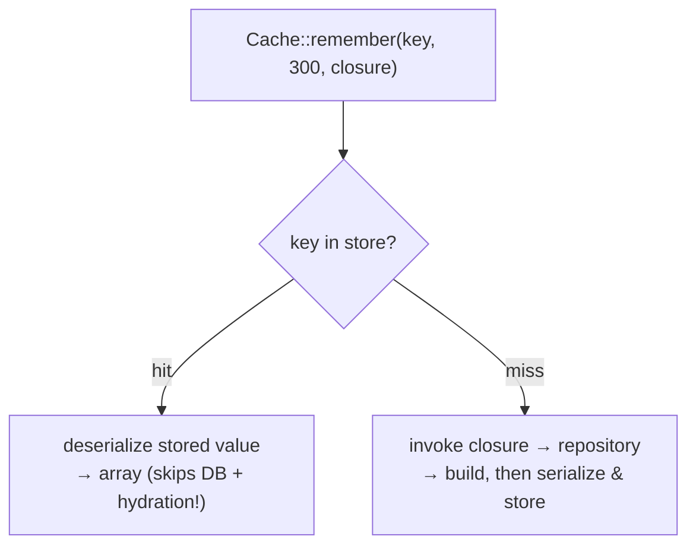
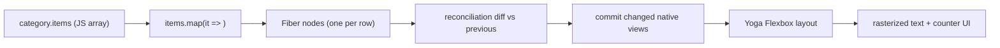

# 37. End-to-End Data Flow: from a Database Row to a Rendered Pixel

> This chapter is the spine of the thesis edition. It follows **one concrete request** — `GET /api/adhkar/categories/morning/items` — and shows the data's *shape in memory at every hop*, the *parameter injected at that hop*, and the *transformation applied*. Nothing is hand-waved: each stage shows the actual structure the bytes take.

## 37.1 The journey at a glance

```mermaid
flowchart LR
    A["URL + {slug}=morning"] --> B["Route param binding"]
    B --> C["Controller method param"]
    C --> D["Service: cache key"]
    D --> E["Repository: query + bindings"]
    E --> F["MySQL: B-tree lookup → raw rows"]
    F --> G["PDO result set (assoc arrays)"]
    G --> H["Eloquent hydration → Model objects"]
    H --> I["Collection (in-memory tree)"]
    I --> J["Resource → plain PHP array"]
    J --> K["json_encode → byte string"]
    K --> L["HTTP response over TLS"]
    L --> M["axios → JS object"]
    M --> N["cachedFetch → SQLite write-through"]
    N --> O["TanStack cache entry (Map)"]
    O --> P["Component props → Fiber tree"]
    P --> Q["Yoga layout → native views → pixels"]
```



## 37.2 Hop 1 — URL parsing and route parameter binding

The raw HTTP line `GET /api/adhkar/categories/morning/items` is parsed by Nginx → PHP-FPM → Laravel's router. The compiled route pattern `adhkar/categories/{slug}/items` produces a **parameter dictionary**:

```
route parameters (associative array, lives on the Request object):
  [ 'slug' => 'morning' ]
```

**Parameter injected here:** the URL segment `morning` is captured into the key `slug`. In memory this is a single PHP string zval (see §38.1) referenced by the `Route` object's `$parameters` array. No model is loaded yet — only a string.

## 37.3 Hop 2 — Controller method invocation

The container calls `AdhkarController::items('morning')` (the injection rule of §36.4: parameter named `slug` ⇄ route key `slug`). Memory state:

```php
// stack frame: AdhkarController::items
$this    -> AdhkarController { service: AdhkarService { repository: AdhkarRepository } }   // injected at construction
$slug    -> "morning"                                                                       // injected by name from the route
```

The controller does **no data work** — it forwards `$this->service->getCategoryBySlug($slug)` (or `itemsByCategorySlug`). The injected `$service` reference (set once at construction, §36) is followed.

## 37.4 Hop 3 — Service: the cache decision

`AdhkarService` computes a **cache key** (the parameter injected at this layer is the TTL + key namespace) and either returns a cached array or invokes the repository:

```php
return Cache::remember("adhkar.v1.items.{$slug}", 300, fn () => $this->repository->itemsByCategorySlug($slug));
```

Two possible memory paths diverge here:



On a **hit**, the cache returns a *deserialized array*, and the entire DB + hydration cost below is skipped — a crucial point: caching here saves not just the query but the expensive object hydration of §37.6.

## 37.5 Hop 4 — Repository: query building and value binding

`AdhkarRepository::itemsByCategorySlug('morning')` builds an Eloquent query. The query builder accumulates an internal structure:

```
QueryBuilder {
  from:     "adhkar_categories",
  wheres:   [ { column: "is_active", op: "=", value: true },
              { column: "slug",      op: "=", value: ? } ],   // placeholder
  bindings: [ true, "morning" ],                              // ← parameters injected, kept SEPARATE from SQL
  ...
}
```

**Parameter injected here:** `'morning'` becomes a **bound value** in the `bindings` array, *not* concatenated into the SQL string. This separation is the SQL-injection defense (§31): the driver sends the SQL template and the values over separate PDO channels. The compiled statement:

```sql
SELECT * FROM adhkar_categories WHERE is_active = ? AND slug = ? LIMIT 1;   -- bindings: [1, 'morning']
```

Then the second query loads the items (eager or via the relation), with the parent id bound:

```sql
SELECT * FROM adhkar_items WHERE adhkar_category_id = ? ORDER BY display_order, id;   -- binding: [<category id>]
```

## 37.6 Hop 5 — MySQL execution → raw result set

MySQL resolves `slug = 'morning'` via the **unique index on `slug`** (a B-tree descent, §39.1) → one `adhkar_categories` row. The items query uses the index on `adhkar_category_id`. The driver (PDO) returns rows as **associative arrays of strings** (everything from the wire is text until cast):

```
PDO rows (adhkar_items) — array of assoc arrays:
[
  { "id":"5", "adhkar_category_id":"2", "adhkar_section_id":null,
    "text":"{\"ar\":\"...\",\"en\":\"...\"}", "repetitions":"3",
    "hint":"{\"ar\":\"...\"}", "daleel":"{\"ar\":\"...\"}", "display_order":"0", ... },
  ...
]
```

Note `repetitions` is the string `"3"`, and `text` is a **JSON string**, not yet decoded. Both are fixed in the next hop.

## 37.7 Hop 6 — Eloquent hydration: rows become objects

Eloquent's hydrator walks each PDO row and constructs an `AdhkarItem` model. The model's internal layout:

```
AdhkarItem (object on the heap) {
    $attributes : [ id => 5, adhkar_category_id => 2, text => '{"ar":..,"en":..}', repetitions => "3", ... ]
    $original   : [ ...same snapshot... ]   // for dirty-checking on save
    $casts      : [ repetitions => int, ... ]   // declared in casts()
    $relations  : [ ]                        // filled if eager-loaded
    $exists     : true
}
```

**Casting + translation are lazy:** when the Resource later reads `$item->repetitions`, the `casts()` map turns `"3"` → `int 3`; when it calls `getTranslations('text')`, Spatie `json_decode`s the JSON column into `['ar'=>..,'en'=>..]`. So the *typed* value materializes only on access — the hydrator stores the raw string and defers the work.

The parent + children assemble into a **Collection holding a tree**:

```
Illuminate\Support\Collection {
  items: [ AdhkarCategory {
             $attributes: { id:2, name:'{"ar":..}', slug:'morning', ... },
             $relations: {
               'sections' => Collection[ AdhkarSection { $relations: { 'items' => Collection[...] } } ],
               'items'    => Collection[ AdhkarItem, AdhkarItem, ... ]   // section-less items
             } } ]
}
```

This in-memory object graph is the single most important data structure in the request — every later representation is a projection of it.

## 37.8 Hop 7 — Resource: object tree → plain array

`AdhkarCategoryResource::toArray()` walks the model graph and emits a **plain, JSON-ready PHP array**, applying the conditional rules (§11):

```php
[
  'id' => 2,
  'name' => ['ar' => 'أذكار الصباح', 'en' => 'Morning Adhkar'],   // getTranslations decodes JSON here
  'slug' => 'morning',
  'icon' => 'https://mashfa.odooclick.com/storage/icons/morning.svg', // iconUrl() resolves the path
  'sections' => [ /* AdhkarSectionResource arrays */ ],
  'items' => [
    ['id'=>5,'text'=>['ar'=>'...','en'=>'...'],'repetitions'=>3,'hint'=>[...],'daleel'=>[...],'display_order'=>0],
    ...
  ],
]
```

Two transformations crystallize here: **JSON columns decode to maps**, and **`repetitions` is now `int 3`** (the cast fired on access). The array contains *only* the whitelisted, presentation-ready fields — no `$original`, no `created_at` unless declared.

## 37.9 Hop 8 — Envelope + JSON encoding → bytes

The controller wraps the array in `ApiResponse::success()` and Laravel calls `json_encode`:

```json
{"success":true,"message":"Success","data":{"id":2,"name":{"ar":"أذكار الصباح","en":"Morning Adhkar"},"slug":"morning","items":[{"id":5,"text":{"ar":"...","en":"..."},"repetitions":3,...}]}}
```

`json_encode` performs a **depth-first serialization** of the array into a UTF-8 byte string (Arabic encoded as multi-byte UTF-8). This byte string is the HTTP body; the in-memory PHP array can now be freed.

## 37.10 Hop 9 — Transport → axios → JS object

Over TLS, the bytes arrive at the device. **axios parameter injection on the way out** happened in the request interceptor (Bearer token + `baseURL` + `Accept-Language`); on the way back, axios `JSON.parse`s the body into a **JavaScript object** and `apiGet` unwraps `.data.data`:

```ts
// the JS value handed to the service:
{ id: 2, name: { ar: 'أذكار الصباح', en: 'Morning Adhkar' }, slug: 'morning',
  items: [ { id: 5, text: { ar:'…', en:'…' }, repetitions: 3, … } ] }
```

`JSON.parse` builds a tree of JS objects on the **Hermes heap** (§38.4). Numbers become IEEE-754 doubles; strings become Hermes string objects.

## 37.11 Hop 10 — cachedFetch → three-tier cache write

`cachedFetch('adhkar_items_morning', …)` writes the object through to SQLite (`INSERT OR REPLACE INTO kv VALUES('adhkar_items_morning', '<json>')`) — a durable copy for offline — and returns the object to TanStack, which stores it in its **in-memory query cache** (a `Map` keyed by the serialized query key):

```
TanStack QueryCache (Map) {
  '["adhkar","items","morning"]' => {
     state: { data: <the JS object>, status: 'success', dataUpdatedAt: 171..., },
     ...
  }
}
```

## 37.12 Hop 11 — Component props → Fiber → pixels

`useAdhkarItems('morning')` returns `{ category, isLoading:false }`. The screen passes `category.items` down as props; React builds/updates a **Fiber tree** (§39.4), diffs it against the previous tree, and commits only changed nodes to the **native view hierarchy**. **Yoga** computes Flexbox layout (§29) and the platform renders pixels. The Arabic `text.ar` is selected by the active locale and drawn with the Amiri font, right-to-left.



## 37.13 The full parameter-injection ledger

| Hop | Parameter injected | Mechanism | Lives as (data structure) |
|-----|--------------------|-----------|----------------------------|
| Route | `slug='morning'` | pattern capture | string on `Route.$parameters` |
| Controller method | `$slug` | name match (§36.4) | string in stack frame |
| Controller ctor | `$service` | container reflection | object reference (set once) |
| Service | cache key + TTL | literal | string + int |
| Repository | `'morning'` | PDO **bound value** | entry in `bindings[]` (not in SQL) |
| MySQL | bound params | prepared statement | server-side parameter slots |
| Hydration | row → `$attributes` | Eloquent hydrator | model object on heap |
| Resource | per-field rules | `getTranslations`/`whenLoaded` | plain array |
| axios req | Bearer + baseURL + lang | interceptor | HTTP headers |
| axios res | body → object | `JSON.parse` | JS object on Hermes heap |
| TanStack | query key | hashed key | entry in `Map` |
| Component | props | React element creation | Fiber node fields |

Every hop has a single, well-defined owner and a single data-structure transformation. This table *is* the architecture in one page.

---
