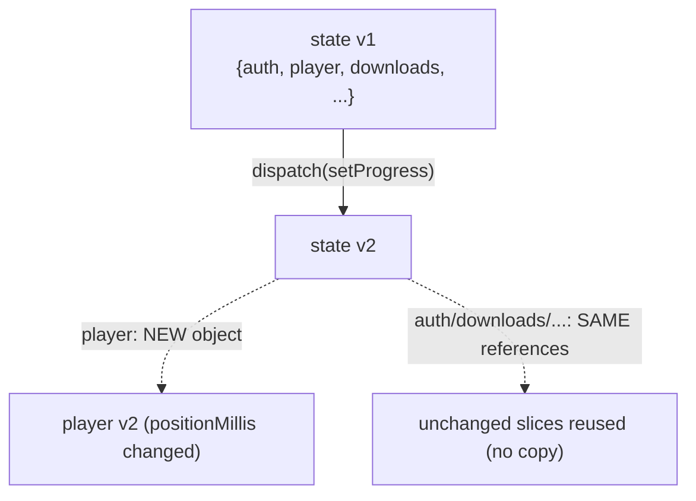

# 38. Data Structures in Memory — How the Variables Are Actually Stored

> This chapter answers "show the data structure, how it is saved in memory, the variables behind the scenes." It dissects the *physical* representation of the values that flow through §37, on both the PHP (backend) and Hermes/JS (mobile) sides.

## 38.1 PHP value representation — the `zval`

Every PHP variable is a **`zval`** (Zend value): a small struct holding a **type tag** + a **value union** (+ refcount metadata for reference-counted types). Scalars are stored inline; strings/arrays/objects are reference-counted pointers to a heap structure.

```
zval (conceptually):
 ┌───────────┬───────────────────────────┐
 │ type tag  │ value                      │
 ├───────────┼───────────────────────────┤
 │ IS_LONG   │ 3                (inline)  │   $repetitions = 3
 │ IS_STRING │ → zend_string{len, "morning", hash}  │   $slug = 'morning'
 │ IS_ARRAY  │ → HashTable*               │   $bindings = [true,'morning']
 │ IS_OBJECT │ → zend_object*             │   $item (AdhkarItem)
 └───────────┴───────────────────────────┘
```

**Copy-on-write (COW).** Assigning `$b = $a` for a string/array does **not** copy the data; it increments the refcount and shares the buffer. A write to `$b` triggers a *separation* (copy) only then. This is why passing a large `Collection` by value through the controller→service→repository return chain is cheap — the same buffer is shared until something mutates it (the Resource builds a *new* array rather than mutating, so no separation cascade occurs).

**The `HashTable`.** PHP arrays are *ordered hash maps* — a single structure that backs both `['a'=>1]` (string keys) and `[0=>x,1=>y]` (integer keys, the "list" case). It stores an insertion-ordered bucket array + a hash index. This is why `$bindings = [true, 'morning']` preserves order (positional SQL params) and why `getTranslations('text')` can return `['ar'=>…,'en'=>…]` with stable key order.

## 38.2 An Eloquent model's internal anatomy

An `AdhkarItem` is a `zend_object` whose properties include several arrays that together implement Active Record:

```
AdhkarItem (zend_object) {
   $attributes : HashTable  // current column values (raw from DB or set by code)
   $original   : HashTable  // snapshot at load — used by isDirty()/getDirty() on save
   $changes    : HashTable  // what changed in the last save
   $casts      : HashTable  // 'repetitions'=>'integer', ... (declared)
   $relations  : HashTable  // 'category'=>Model, 'items'=>Collection (only if loaded)
   $fillable   : HashTable  // mass-assignment whitelist
   $exists     : bool
   $translatable : ['text','hint','daleel']   // app-specific (Spatie)
}
```

**Behind the scenes of a property read.** `$item->repetitions` does **not** read a real PHP property — `AdhkarItem` has no declared `$repetitions`. It triggers the magic `__get('repetitions')`, which: (1) looks in `$attributes`, (2) applies the matching `$casts` entry (`"3"` → `int 3`), (3) returns it. `$item->text` additionally routes through Spatie's accessor to `json_decode` the JSON column. **Behind the scenes of a write**, `__set` writes to `$attributes` and marks the model dirty by comparing against `$original`. The dual `$attributes`/`$original` arrays are the entire basis of "save only what changed."

**Memory cost.** One model ≈ the base object + ~6 small HashTables. Hydrating 50 verses ⇒ 50 such objects. This is precisely why the **300 s cache stores the serialized array, not the models** — a warm hit reconstitutes a single array via `unserialize`/`json_decode` instead of 50 model objects with 6 HashTables each.

## 38.3 The Collection and the eager-load "dictionary"

`Illuminate\Support\Collection` wraps a single PHP array (`$items`) and adds ~100 fluent methods (`map`, `filter`, `pluck`). It is *not* a linked list — it is the ordered HashTable from §38.1, so positional access is O(1) and iteration is cache-friendly.

The eager-load matching that turns two flat result sets into a tree (§37.7) uses a **hash dictionary** (§39.3): children are bucketed by foreign key into a map `parent_id => [children]`, then each parent does an O(1) lookup. That is why eager loading is **O(n)**, not O(n·m).

## 38.4 JavaScript side — Hermes object representation

On the device, Hermes (the RN engine) stores JS values as **NaN-boxed** 64-bit cells: numbers are IEEE-754 doubles inline; objects/strings/arrays are pointers to heap cells. Objects use **hidden classes (shapes)** — Hermes records the *layout* (property names → slot offsets) once and shares it across all objects of the same shape, so the thousands of `AdhkarItem`-shaped JS objects from a list response share one hidden class and store only their slot values. This is why keeping object shapes *stable* (same keys, same order — which the Resource guarantees) is a real performance property, not a style preference: shape churn would deoptimize Hermes inline caches.

```
JS adhkar item (Hermes):
  hidden class S1: { id:slot0, text:slot1, repetitions:slot2, hint:slot3, ... }
  object A → [S1 | 5 | {ar,en} | 3 | {…} ]
  object B → [S1 | 6 | {ar,en} | 1 | {…} ]   // same shape S1 ⇒ shared layout, fast access
```

## 38.5 Redux state — one immutable tree + structural sharing

The Redux store is a **single JS object** (the combined state of 11 slices). Its defining property is **immutability**: reducers never mutate; they return a new object. Redux Toolkit uses **Immer**, which gives reducers a *draft* (a Proxy) they appear to mutate, then produces a new immutable tree that **structurally shares** every untouched branch:



So `dispatch(setProgress({position}))` allocates a new `player` object and a new root object, but `auth`, `downloads`, `favorites`, etc. are the **same references** as before. Two consequences: (1) `react-redux` can detect "did my slice change?" with an `===` reference check (O(1)) instead of a deep compare — the foundation of the atomic-selector performance in §19; (2) memory churn is proportional to the *changed* path depth (here: root + player), not the whole tree.

**The persisted projection.** `redux-persist` serializes only the whitelisted slices (§23) to a single AsyncStorage string; the `downloadsTransform` reshapes the in-memory slice into a smaller persisted DTO and recomputes derived fields on rehydration — so the *on-disk* data structure deliberately differs from the *in-memory* one.

## 38.6 TanStack query cache — a keyed Map of entries

TanStack stores server data in a `QueryCache` backed by a `Map<string, Query>`. The key is the **deterministically-hashed** query key array (`['adhkar','items','morning']` → a stable string). Each entry holds `data`, `status`, `dataUpdatedAt`, `error`, and observers. Staleness is a *timestamp comparison* (`now - dataUpdatedAt > staleTime`), not a timer — cheap and lazy. This Map is the in-memory tier of the three-tier cache (§24); the SQLite `kv` table is the durable tier.

## 38.7 SQLite offline store — a key/value table

`contentCache` is the simplest structure in the system and deliberately so:

```sql
CREATE TABLE kv (key TEXT PRIMARY KEY NOT NULL, value TEXT NOT NULL);
```

A B-tree on `key` (the PRIMARY KEY) gives O(log n) lookup; `value` is the JSON-serialized response. The Mushaf uses a *separate* database (`offlineStorage`) with a richer schema so the two caches never interfere. The choice of "one TEXT blob per key" over a normalized offline schema is intentional: the offline copy only needs to be *replayed verbatim* into the same hooks, so storing the exact API payload is both simplest and most faithful.

## 38.8 Cross-tier structure summary

| Stage | Structure | Keyed/ordered by | Mutability |
|-------|-----------|------------------|------------|
| PHP scalars/arrays | `zval` + `HashTable` | insertion order | COW |
| Eloquent model | object + `$attributes`/`$original` HashTables | column name | mutable, dirty-tracked |
| Collection | wrapped array | position | fluent, returns new |
| JSON body | UTF-8 byte string | — | immutable |
| JS object | Hermes cell + hidden class | property slots | mutable |
| Redux | single immutable tree | slice name | immutable + structural sharing |
| TanStack | `Map<hashedKey, entry>` | query key | replace-on-update |
| SQLite kv | B-tree table | `key` | INSERT OR REPLACE |

The data is **the same information re-encoded seven times**, each encoding optimized for its stage: hash maps for flexible server-side assembly, a flat byte string for transport, hidden-class objects for fast device access, an immutable tree for cheap change-detection, and a key/value blob for durable replay.

---
