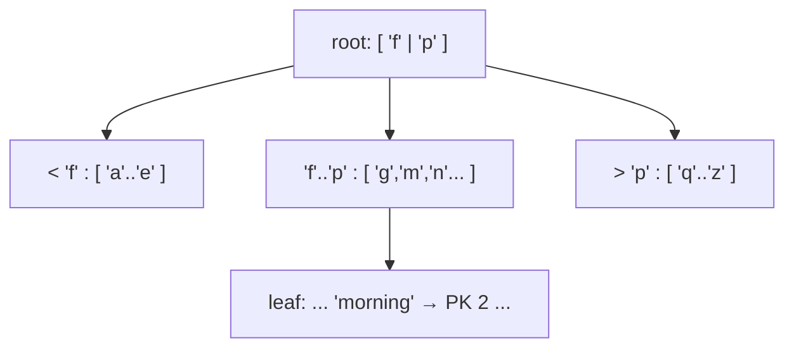
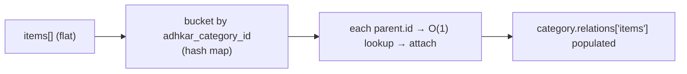
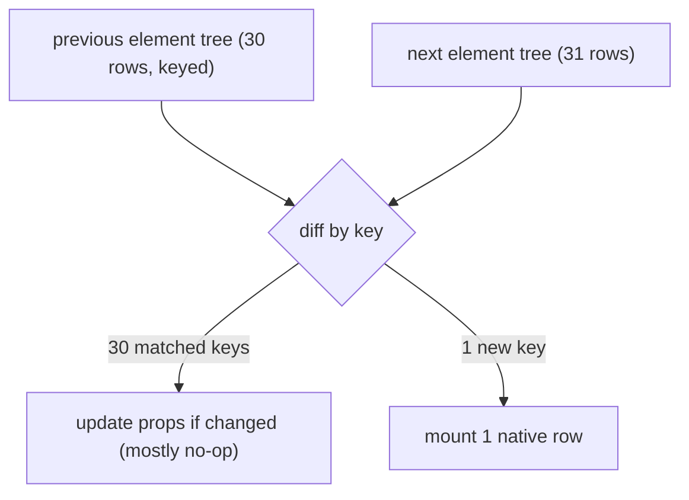

# 39. Algorithms Behind the Scenes

> The user asked to see "the algorithm behind the scenes." Each subsection isolates one algorithm the runtime depends on, explains it from first principles, traces it on real data from this project, and states its complexity.

## 39.1 B-tree index descent (how `WHERE slug = 'morning'` finds one row fast)

A MySQL (InnoDB) secondary index is a **B+ tree**: a balanced tree where internal nodes hold separator keys and leaves hold the indexed value + a pointer to the row (the primary key). A unique index on `slug` means a lookup is a **root-to-leaf descent**.



**Trace for `slug='morning'`:** compare `'morning'` to the root separators → descend to the middle child → binary-search that node → reach the leaf containing `'morning'` → read PK `2`. With branching factor *b* (hundreds, since keys are small) and *n* rows, the depth is **⌈log_b n⌉** — for tens of thousands of rows, **2–3 node reads**. The unindexed alternative is a full table scan, **O(n)**.

**Complexity:** index lookup **O(log_b n)** ≈ O(1) for app-sized tables; the composite index `(surah_id, verse_number)` extends this to range scans ("all verses of surah S in order") that are *index-ordered*, so no separate sort is needed.

**Contrast — the verse `LIKE '%term%'` search (§10):** a leading wildcard cannot use the B-tree (the tree is ordered by prefix), so MySQL scans all ~6,236 rows — **O(n·m)**. This is the one algorithm in the app that is deliberately linear, justified by the tiny fixed corpus + caching.

## 39.2 Cache-key hashing (how `Cache::remember('adhkar.v1.items.morning', …)` is stored)

The cache driver maps the string key to a storage slot via a **hash function**. With the Redis driver, the key is namespaced (`<prefix>:adhkar.v1.items.morning`) and Redis stores it in its own hash table → **O(1)** average `GET`/`SET`. With the file driver, Laravel hashes the key (sha1) to derive a file path. Either way the lookup is **constant-time** and independent of how many keys exist.

**Why the `v1` segment matters algorithmically:** it makes invalidation O(1) *by convention* — bumping `v1`→`v2` changes the hash input for an entire domain, orphaning all old keys at once (they simply expire), with no scan-and-delete pass. This is "invalidation by key-space rotation," cheaper than tag-based flushing on drivers that don't support tags.

## 39.3 The eager-load dictionary match (how 2 flat queries become a tree in O(n))

This is the algorithm that makes "no N+1" possible. After the parent query returns categories and the child query returns items, Eloquent must attach each item to its parent **without** issuing per-parent queries:

```text
buildDictionary(children):
    dict = {}                                  # hash map: parent_id → list
    for child in children:                     # O(n) over children
        dict[ child.adhkar_category_id ].append(child)
    return dict

match(parents, dict):
    for parent in parents:                     # O(p) over parents
        parent.relations['items'] = dict[ parent.id ] ?? []   # O(1) hash lookup
```

**Total complexity: O(p + n)** — linear in parents + children — versus the naive nested-loop "for each parent, scan all children" which is **O(p · n)**, or the N+1 anti-pattern of **O(p) queries**. Worked: 1 category + 30 items ⇒ build a 1-bucket dictionary, 1 lookup; for 50 categories × 30 items it is 1500 appends + 50 O(1) lookups, still linear. The dictionary is a transient `HashTable` (§38.1) discarded after matching.



## 39.4 React reconciliation & the diffing heuristic

When `category.items` changes, React must update the native view tree without rebuilding it. It runs the **reconciliation** algorithm over the Fiber tree using three heuristics that reduce the general O(n³) tree-diff to **O(n)**:

1. **Different element type ⇒ replace the subtree** (don't try to diff a `<View>` into a `<Text>`).
2. **Same type ⇒ keep the node, diff props**, update only changed props on the native view.
3. **Lists are matched by `key`.** Stable keys (the app uses model `id`s) let React detect insertions/reorders in O(n) instead of re-creating every row. A missing/index key would cause spurious unmounts on reorder.

**Trace:** adding one new adhkar item to a 30-item list → React keys the 31 children by `id`, finds 30 unchanged (skip), one new (mount one native row). Only one row is created; the other 30 native views are untouched. This is why the atomic-selector design (§19) pays off: a re-render produces a near-identical element tree, and reconciliation commits almost nothing.



## 39.5 Fisher–Yates shuffle (the `order_randomly` sections)

When a section has `order_randomly = true`, the client shuffles its items each view. The correct algorithm is **Fisher–Yates** (a.k.a. Knuth shuffle), which produces a *uniformly random* permutation in O(k) time, in place:

```text
shuffle(a):
    for i from len(a)-1 downto 1:
        j = randomInt(0..i)        # inclusive
        swap(a[i], a[j])
```

**Why not `sort(() => Math.random() - 0.5)`?** That common "trick" is **biased** (the comparator is inconsistent, so some permutations are more likely) and is O(k log k). Fisher–Yates is both unbiased and faster. **Proof sketch of uniformity:** at step *i* every remaining element has an equal 1/(i+1) chance of landing in position *i*; by induction each of the k! permutations is equally likely. **Complexity:** O(k) time, O(1) extra space.

## 39.6 Karaoke segment lookup (mapping playback ms → active verse)

Each audio tick (~4 Hz) must find which segment covers the current `positionMillis`. The app uses a **linear scan** (`findIndex`) over the recording's segments, memoized by `useMemo` (§21):

```text
activeIndex = segments.findIndex(s => position >= s.start && position < s.end)   # O(s)
```

With *s* = verses in one recording (small), O(s) per tick is negligible. **The scaling note (and a teachable optimization):** because segments are *sorted and non-overlapping*, a **binary search** would find the active segment in **O(log s)** — the right move if recordings ever held hundreds of segments. The app's choice of linear scan is correct for current *s* and documented as a future swap, exactly the kind of complexity-vs-simplicity trade a thesis should surface.

## 39.7 Bcrypt password hashing & token comparison

`casts(['password' => 'hashed'])` hashes with **bcrypt** — a *deliberately slow*, salted, work-factored hash (cost ~10–12 ⇒ thousands of internal rounds). The slowness is the security feature: it caps brute-force attempts per second. Verification (`Hash::check`) recomputes the hash of the candidate with the stored salt and compares in **constant time** to avoid timing leaks. Sanctum tokens are compared by their **SHA-256 hash** (fast, since the token is high-entropy random, not a low-entropy password) — the choice of bcrypt-vs-SHA256 is itself an algorithmic decision keyed to the entropy of the secret.

## 39.8 Complexity scorecard

| Operation | Algorithm | Time | Space |
|-----------|-----------|------|-------|
| `slug`/PK lookup | B+ tree descent | O(log_b n) ≈ O(1) | O(1) |
| Cache get/set | hash table | O(1) avg | O(1) |
| Eager-load attach | hash dictionary | O(p + n) | O(n) |
| Verse search | full `LIKE` scan | O(n·m) | O(k) |
| React update | keyed reconciliation | O(n) | O(n) |
| Section shuffle | Fisher–Yates | O(k) | O(1) |
| Karaoke segment | linear scan (→ binary search) | O(s) → O(log s) | O(1) |
| Password verify | bcrypt | O(2^cost) (intentional) | O(1) |

---
