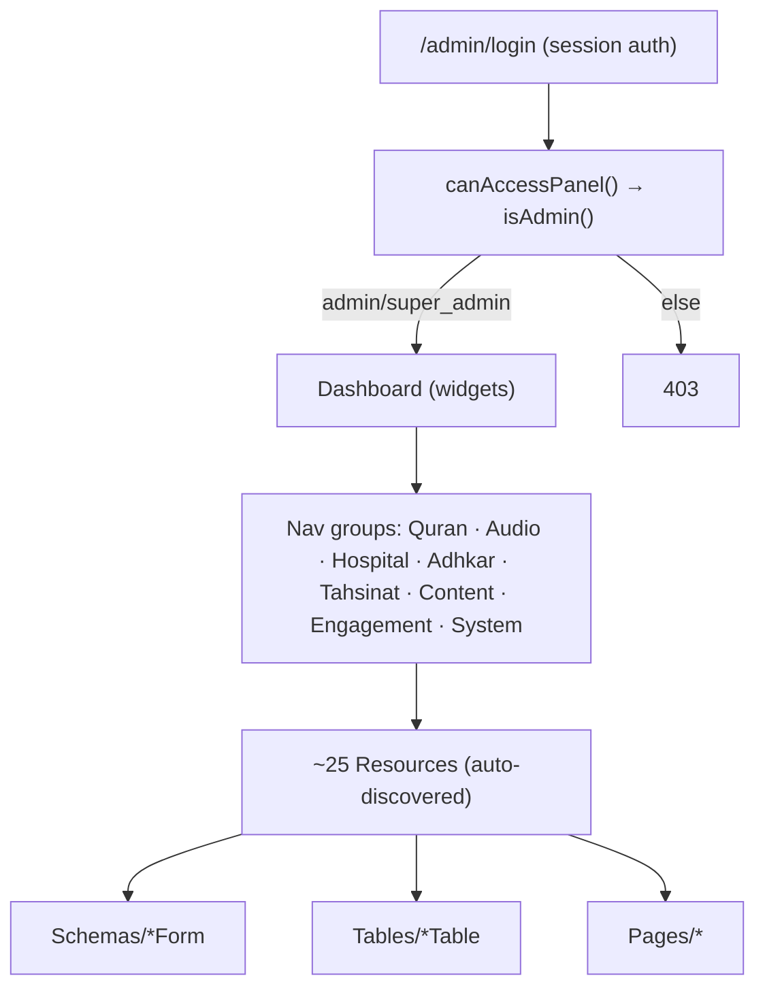
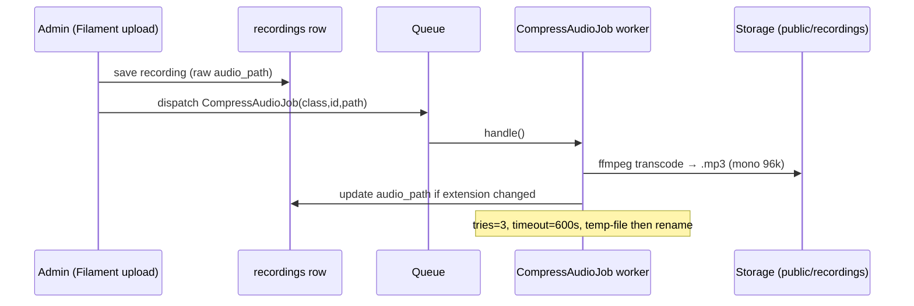
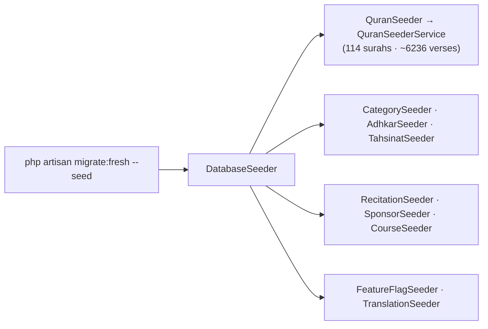

# 41. Filament Admin Panel — Architecture & Internals

The administration surface is a **Filament 5** panel mounted at `/admin`, configured entirely by `AdminPanelProvider`. It is a Livewire (server-rendered, reactive) application sharing the *same* `User` model and database as the API. This chapter documents how it is structured, how a resource is split, and how its widgets compute analytics.

## 41.1 Panel configuration (`AdminPanelProvider`)

The provider is the single composition root for the admin UI. Salient configuration:

```php
$panel->default()->id('admin')->path('admin')->login()
      ->profile(EditProfile::class, isSimple: false)
      ->brandName('المشفى القرآني')
      ->colors([ 'primary' => Color::Emerald, 'success' => Color::Teal, ... ])
      ->font('Noto Kufi Arabic')
      ->darkMode()->defaultThemeMode(ThemeMode::System)
      ->spa()->globalSearch()->maxContentWidth(Width::Full)
      ->navigationGroups([ 'Quran','Audio','Hospital','Adhkar','Tahsinat','Content','Engagement','System' ])
      ->discoverResources(in: app_path('Filament/Resources'), for: 'App\\Filament\\Resources')
      ->discoverPages(...)->discoverWidgets(...)
      ->middleware([ EncryptCookies, StartSession, AuthenticateSession, PreventRequestForgery, ... ])
      ->authMiddleware([ Authenticate::class ]);
```

Key facts:
* **`->spa()`** turns the panel into a single-page app (Livewire `wire:navigate`) — page transitions fetch only the changed fragment, not a full reload.
* **`->discoverResources/Pages/Widgets`** auto-register everything under `app/Filament/*` by directory scan — which is why adding a resource requires *no* manual registration (it is found by convention).
* **Navigation groups** map directly to the domain modules (Quran, Hospital, Adhkar, …); each resource declares `$navigationGroup` to slot itself in.
* **Middleware** is the *web* stack (cookies, session, CSRF via `PreventRequestForgery`) — distinct from the API's token stack (§6). The panel is cookie/session-authenticated; access is gated by `User::canAccessPanel()` → `isAdmin()` (§4.3).
* **Branding/theming** is bespoke: an Arabic `brandName`, the `Noto Kufi Arabic` font, an Emerald/Teal "Islamic green" palette, and a large block of injected glassmorphism CSS via a `HEAD_END` render hook.



## 41.2 The resource split (the enforced convention)

Per the project rule (memory + `shared-context.md`), **every Filament resource is split** into a thin `Resource` class that delegates to separate `Schemas/XxxForm` and `Tables/XxxTable` classes — never inlining form/table logic. `RecordingResource` is the canonical example:

```php
class RecordingResource extends Resource
{
    protected static ?string $model = Recording::class;
    protected static string|UnitEnum|null $navigationGroup = 'Hospital';
    protected static ?int $navigationSort = 5;

    public static function form(Schema $schema): Schema
    { return $schema->components(RecordingForm::getSchema()); }     // delegates

    public static function table(Table $table): Table
    { return $table->columns(RecordingsTable::getColumns())
                   ->filters(RecordingsTable::getFilters())
                   ->actions(RecordingsTable::getActions())
                   ->defaultSort('session_number'); }               // delegates

    public static function getPages(): array
    { return ['index' => ManageRecordings::route('/')]; }
}
```

**Why split.** A single resource file would balloon past the 450-line cap (§34) and mix two responsibilities. The split keeps each file focused, lets the form and table evolve independently, and makes the ~25 resources uniformly navigable — the same mechanical-uniformity argument as the API layer.

## 41.3 The form as a domain-rule enforcer (`RecordingForm`)

The recording form is where the **category-type state machine** (§3.4, §34) is enforced for admins. It exposes three mutually-exclusive parent selectors, each disabled when another is chosen:

```php
Select::make('disease_id')->options(fn () => Disease::ordered()->get()->pluck('name','id'))
      ->live()->disabled(fn (Get $get) => filled($get('category_id')) || filled($get('subcategory_id'))),
Select::make('subcategory_id')->options(fn () => Subcategory::doesntHave('diseases')->ordered()->get()->pluck('name','id'))
      ->live()->disabled(fn (Get $get) => filled($get('disease_id')) || filled($get('category_id'))),
Select::make('category_id')->options(fn () => Category::where('type','direct')->ordered()->get()->pluck('name','id'))
      ->live()->disabled(fn (Get $get) => filled($get('disease_id')) || filled($get('subcategory_id'))),
```

* **`->live()`** makes the field reactive — changing one selector immediately re-evaluates the `disabled()` closures on the others (a Livewire round-trip), so the admin can attach a recording to **exactly one** of disease / subcategory / category. This is the UI-level enforcement of the "recordings belong to the deepest level" invariant.
* The **`segments` Repeater** is the authoring tool for karaoke timing: each item captures `start`/`end` seconds + Arabic/English text, with a computed `itemLabel` like `"3.0s – 8.5s  بسم الله..."`. This JSON array is what the mobile `KaraokeText` (§19, §39.6) consumes to highlight verses during playback.
* **`is_free`** carries a helper note that enabling it auto-locks the previously-free session — the single-free-session-per-node business rule, surfaced in the admin UX.
* **`FileUpload`** stores audio to the `public` disk under `recordings/`, accepting any audio format up to 200 MB — the raw upload that `CompressAudioJob` (§44) later normalizes.

## 41.4 Analytics widgets (GROUP BY / ORDER BY in practice)

The dashboard hosts seven widgets. `TopPlayedRecordingsWidget` is representative — a `ChartWidget` rendering a bar chart of the eight most-played recordings:

```php
$recordings = Recording::with('disease')->orderByDesc('plays_count')->limit(8)->get();
$labels = $recordings->map(fn ($r) =>
    ($r->disease ? Str::limit($r->disease->getTranslation('name','en'),12) : 'General') . ' · S'.$r->session_number);
$counts = $recordings->pluck('plays_count');
```

* The query is a simple **`ORDER BY plays_count DESC LIMIT 8`** with the `disease` relation eager-loaded (so the label lookup is N+1-free, §35.3). This is the §10 point in practice: analytics that *could* use window-function ranking instead use `ORDER BY ... LIMIT` because the result set is tiny.
* `plays_count` is incremented by the public `POST /recordings/{id}/play` endpoint (`RecordingRepository::incrementPlays`), so the widget visualizes real usage telemetry.
* Other widgets: `UserGrowthWidget` (`GROUP BY DATE(created_at)` registrations over time), `HospitalDistributionWidget` (recordings per category), `AppContentStatsWidget`/`SpiritualContentStatsWidget` (counts), `RecentFeedbackWidget` (latest feedback), `AdhkarTimingWidget`.

## 41.5 How the panel and the API stay consistent

Because both tiers share the same models, **a Filament edit immediately changes API output** — subject to the cache. The `FeatureFlag` model's `booted()` hooks (§13) `Cache::forget` on save, so toggling a flag in the panel propagates to the mobile app on its next poll without waiting for the 300 s TTL. For content without an explicit invalidation hook, an edit becomes visible when the relevant cache key expires. This shared-model design is why there is no separate "admin API" — Filament *is* the write side, the JSON API is the read side, and the database + cache are the contract between them.

---

# 44. Background Jobs, Console Commands & Seeders

## 44.1 `CompressAudioJob` — queued media normalization

Uploaded recordings can be large and in arbitrary formats (WAV, high-bitrate MP3, m4a). `CompressAudioJob` is a **queued job** (`ShouldQueue`) that transcodes them to a compact, voice-optimized MP3 off the request cycle:

```php
class CompressAudioJob implements ShouldQueue
{
    public int $tries = 3;
    public int $timeout = 600;   // 10 min for large files
    public function __construct(private string $modelClass, private int $modelId, private string $relativePath) {}

    public function handle(): void {
        // ffmpeg -i input -vn -ar 44100 -ac 1 -b:a 96k -codec:a libmp3lame output.mp3
        ...
        if ($newRelative !== $old) $this->modelClass::find($this->modelId)?->update(['audio_path' => $newRelative]);
    }
}
```

**Design points the thesis should note:**
* **Constructor carries a *serializable* reference, not the model.** It stores `modelClass` + `modelId` + `relativePath` (scalars) rather than an Eloquent model. The `SerializesModels` trait would serialize a model, but passing scalars keeps the queue payload tiny and avoids stale-model issues — the job re-fetches with `find($modelId)` at run time.
* **FFmpeg parameters encode a domain decision:** `-ac 1` (mono) halves file size and is perceptually lossless for single-voice recitation; `-b:a 96k` CBR is transparent for speech. This is a *content-aware* compression choice, not a generic default.
* **Idempotency & safety:** it writes to a `.compress.mp3` temp file, only `rename`s on success, deletes the original solely when the extension changed (WAV→MP3), and `throw`s on FFmpeg failure so the queue retries (`$tries = 3`). A 10-minute `$timeout` covers worst-case large files.
* **Why a job and not inline:** transcoding a 200 MB upload synchronously would block the admin's HTTP request for minutes and risk a gateway timeout. Offloading to the queue returns the admin instantly and processes audio in the background — the textbook use of a queued job.



## 44.2 Console commands

Three Artisan commands under `app/Console/Commands`:

| Command | Purpose |
|---------|---------|
| `CompressExistingAudioCommand` | Back-fill: dispatch `CompressAudioJob` for every already-uploaded recording (one-off normalization of legacy media) |
| `LocalizeAudioCommand` | Localize/relocate audio assets (path normalization) |
| `PopulateTranslations` | Bulk-fill translation JSON columns, then `Cache::flush()` to cold-start the cache so the new translations are served immediately |

`PopulateTranslations` ending in `Cache::flush()` is the deliberate inverse of read-through caching (§13.4) — after a bulk content change you *want* to invalidate everything rather than wait for TTLs.

## 44.3 Seeders

`DatabaseSeeder` orchestrates the domain seeders: `QuranSeeder` (114 surahs + ~6,236 verses via `QuranSeederService`), `RecitationSeeder`, `CategorySeeder`, `AdhkarSeeder`, `TahsinatSeeder`, `CourseSeeder`, `SponsorSeeder`, `FeatureFlagSeeder`, and `TranslationSeeder`. Because the project's migration rule is **amend-and-`migrate:fresh --seed`** (never stack migrations, §34), the seeders are the canonical, re-runnable source of baseline content — they must stay idempotent and complete, since a schema change wipes and rebuilds the database from them. The `QuranSeederService` is notably extracted as a *service* (not inline in the seeder) so the same Qur'an-loading logic can be reused by commands and tests — the service pattern applied even to seeding.



---
