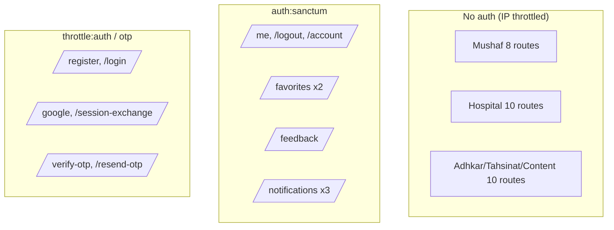
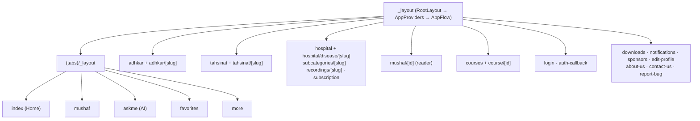

# 42. Complete API Endpoint Reference

Every route in `routes/api.php`, grouped by throttle bucket and auth requirement, with its controller, parameters, and response shape. This is the contract the mobile client codes against.

## 42.1 Credential endpoints — `throttle:auth` (5/min/IP)

| Method | Path | Controller | Body params | Returns |
|--------|------|------------|-------------|---------|
| POST | `/register` | `AuthController@register` | name, email, password(min 8), phone?, country?, gender? | 201 `{user, token}` |
| POST | `/login` | `AuthController@login` | email, password | 200 `{user, token}` / 401 |
| POST | `/auth/google/callback` | `GoogleAuthController@handleMobileGoogleCallback` | code, code_verifier | `{status, user, token}` or `{status:'verification_required', email}` |
| POST | `/auth/session-exchange` | `GoogleAuthController@exchangeSession` | session_token | one-time `{status, token, user}` / 410 |

## 42.2 OTP endpoints — `throttle:otp` (10/min/IP)

| Method | Path | Controller | Body params | Returns |
|--------|------|------------|-------------|---------|
| POST | `/auth/verify-otp` | `GoogleAuthController@verifyOtp` | session_token, otp(size 6) | `{status:'success', user, token}` / 422 / 410 |
| POST | `/auth/resend-otp` | `GoogleAuthController@resendOtp` | session_token | `{status:'sent'}` / 429 (max 3) |

## 42.3 Public read endpoints — `throttle:api` (120/min user · 30/min IP)

**Mushaf**

| Method | Path | Controller | Params | Returns |
|--------|------|------------|--------|---------|
| GET | `/surahs` | `SurahController@index` | – | list of surahs (name map, type, total_verses) |
| GET | `/surahs/{id}` | `SurahController@show` | id | surah + verses |
| GET | `/surahs/{surahId}/recitations` | `RecitationController@bySurah` | surahId | recitations for a surah (per reciter) |
| GET | `/verses/search` | `VerseController@search` | q | matching verses (LIKE, §10) |
| GET | `/reciters` | `ReciterController@index` | – | active reciters |
| GET | `/reciters/{id}` | `ReciterController@show` | id | reciter detail |
| GET | `/recitations/{id}/audio` | `RecitationController@audio` | id | stream URL |
| GET | `/recitations/{id}/download` | `RecitationController@download` | id | download URL |

**Hospital**

| Method | Path | Controller | Params | Returns |
|--------|------|------------|--------|---------|
| GET | `/categories` | `CategoryController@index` | – | categories (type-aware) |
| GET | `/categories/{slug}` | `CategoryController@show` | slug | category + children |
| GET | `/subcategories/{slug}` | `SubcategoryController@show` | slug | subcategory + diseases |
| GET | `/diseases` | `DiseaseController@index` | – | diseases |
| GET | `/diseases/search` | `DiseaseController@search` | q | diseases via alias match |
| GET | `/diseases/{slug}` | `DiseaseController@show` | slug | disease + recordings |
| GET | `/general-ruqyah` | `RecordingController@general` | – | `is_general` recordings |
| GET | `/recordings` | `RecordingController@index` | disease_id (required) | recordings for a disease |
| GET | `/recordings/{id}/stream` | `RecordingController@stream` | id | `{audio_url}` (403 if premium & unentitled) |
| POST | `/recordings/{id}/play` | `RecordingController@play` | id | `{plays_count}` (increments telemetry) |

**Adhkar / Tahsinat / Content**

| Method | Path | Controller | Returns |
|--------|------|------------|---------|
| GET | `/adhkar/categories` | `AdhkarController@categories` | categories + items_count |
| GET | `/adhkar/categories/{slug}/items` | `AdhkarController@items` | category + sections + items |
| GET | `/adhkar/today` | `AdhkarController@today` | day-rotated categories |
| GET | `/adhkar/waking` | `AdhkarController@waking` | waking-category items |
| GET | `/tahsinat/categories` | `TahsinatController@categories` | tahsinat categories |
| GET | `/tahsinat/categories/{slug}/items` | `TahsinatController@items` | category + items |
| GET | `/courses` | `CourseController@index` | active courses |
| GET | `/sponsors` | `SponsorController@index` | targeted sponsors |
| GET | `/sponsor-screen` | `SponsorController@screen` | sponsor splash config |
| GET | `/features` | `FeatureFlagController@index` | feature flags (cached, hook-invalidated) |

## 42.4 Authenticated endpoints — `throttle:api` + `auth:sanctum`

| Method | Path | Controller | Purpose |
|--------|------|------------|---------|
| GET | `/me` | `AuthController@me` | current user (UserResource) |
| PUT | `/me` | `AuthController@updateProfile` | partial profile update (null-filtered) |
| POST | `/logout` | `AuthController@logout` | revoke current token |
| DELETE | `/account` | `AuthController@deleteAccount` | force-delete + cascade cleanup |
| GET | `/favorites` | `FavoriteController@index` | user's favorited diseases |
| POST | `/favorites/toggle` | `FavoriteController@toggle` | toggle a disease favorite (tx) |
| POST | `/feedback` | `FeedbackController@store` | submit feedback (manual morph) |
| GET | `/notifications/preferences` | `NotificationController@preferences` | adhkar reminder prefs |
| POST | `/notifications/preferences` | `NotificationController@updatePreferences` | update prefs |
| POST | `/notifications/token` | `NotificationController@registerToken` | save expo_push_token |

**Cross-cutting response contract.** Every endpoint (except `GoogleAuthController`) returns the `ApiResponse` envelope `{success, message, data, meta?, errors?}` (§12). Auth endpoints return `{user, token}`; reads return `data` as object or array; paginated reads add `meta`.

---

# 43. Mobile Screen & Hook Catalog

## 43.1 Route map (Expo Router `app/`)

The file system *is* the navigation tree. Tabs are the root; everything else is a stacked route.

| Route | Screen role |
|-------|-------------|
| `(tabs)/index` | Home: greeting, section pills, sponsor, quick access |
| `(tabs)/mushaf` | Surah index / reader entry |
| `(tabs)/askme` | AI assistant (aiService) |
| `(tabs)/favorites` | Saved diseases |
| `(tabs)/more` | Settings, language, downloads, links |
| `adhkar/[slug]` | Wird pager with per-item counters (§18) |
| `tahsinat/[slug]` | Tahsinat lessons |
| `hospital/*` | Category→Subcategory→Disease→Recordings drill-down (§3.4) |
| `mushaf/[id]` | Verse reader + multi-reciter audio + karaoke |
| `course/[id]` | Course detail + WhatsApp enroll |
| `login` / `auth-callback` | Credential + OAuth deep-link return (§2.3) |
| `downloads` | Offline recording manager (§ useDownloadManager) |
| `subscription` | Entitlement upsell (triggered by 403) |

## 43.2 Hook catalog (`src/hooks/` — 40 hooks)

Hooks are the adapter layer between services and components. They divide into **server-state hooks** (TanStack + `cachedFetch`) and **device-state hooks** (Redux selectors + dispatch).

| Category | Hooks | Backing |
|----------|-------|---------|
| Content reads (TanStack) | `useAdhkar`, `useTahsinat`, `useCategories`, `useCategory`, `useSubcategory`, `useDiseases`, `useDisease`, `useRecordings`, `useReadings`, `useCourses`, `useSponsors`, `useSurahs`, `useSurah`, `useReciters` | `cachedFetch` + service (§24) |
| Search (debounced) | `useDiseaseSearch`, `useHospitalSearch`, `useDebounce` | service + `useDebounce` |
| Audio/player | `usePlayer`, `useAudio`, `useVerseTiming`, `useGeneralRuqyah`, `useReciterAvailability` | playerSlice + PlayerContext (§23) |
| Downloads/offline | `useDownloadManager`, `useOfflineQueue`, `useNetworkStatus` | downloadsSlice + audioService + NetInfo |
| Favorites/feedback | `useFavorites` | favoritesSlice + TanStack mutation |
| Notifications | `useNotifications`, `useNotificationPreferences` | notificationsSlice + service |
| App shell | `useAppFlow`, `useFeatures`, `useRefresh`, `useDrivingMode`, `useMushafScreen` | uiSlice/featuresSlice |

**The hook pattern (uniform).** A content hook calls `useQuery({ queryKey: cacheKeys.X, queryFn: () => cachedFetch(diskKey, service.getX), staleTime: 5min })` and returns `{ data, isLoading, error, refetch }` (§24). A device hook reads atomic selectors and returns a `useMemo`-stabilized object of `useCallback`-wrapped actions (§22). Learning `useAdhkar` + `usePlayer` teaches the entire hook layer — the same mechanical uniformity as the backend slices.

## 43.3 Service catalog (`src/services/` — the only network/storage layer)

| Service | Responsibility |
|---------|----------------|
| `api.ts` / `apiClient.ts` | base URL resolution + axios client (interceptors, local→prod fallback, 401 seam) |
| `adhkarService`, `tahsinatService`, `courseService`, `sponsorService`, `quranService`, `ruqyahService`, `favoriteService`, `feedbackService`, `featureService`, `notificationService` | per-domain endpoint wrappers (unwrap envelope) |
| `contentCache` | SQLite kv offline cache + `cachedFetch` (§24, §38.7) |
| `offlineStorage` | separate Mushaf SQLite store |
| `audioService` | downloads, resume tokens, device storage accounting |
| `googleAuth` | OAuth PKCE via `openAuthSessionAsync` (§2.3) |
| `tokenManager` (lib) | secure token storage (expo-secure-store) |
| `prayerTimesService` | `adhan` astronomical prayer calc (offline) |
| `notificationScheduler` | local adhkar reminder scheduling |
| `aiService` | Ask-Me assistant |
| `bookmarks` | Mushaf bookmarks |

This catalog closes the loop: every API endpoint in §42 has a service wrapper here, consumed by a hook in §43.2, rendered by a screen in §43.1 — the full vertical the dossier has traced from §1.

---
