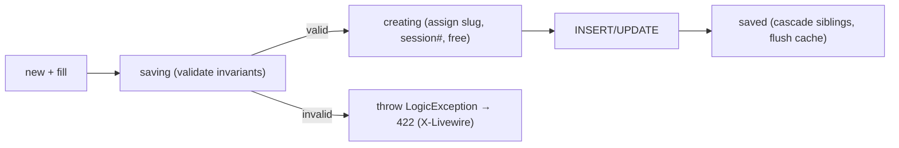
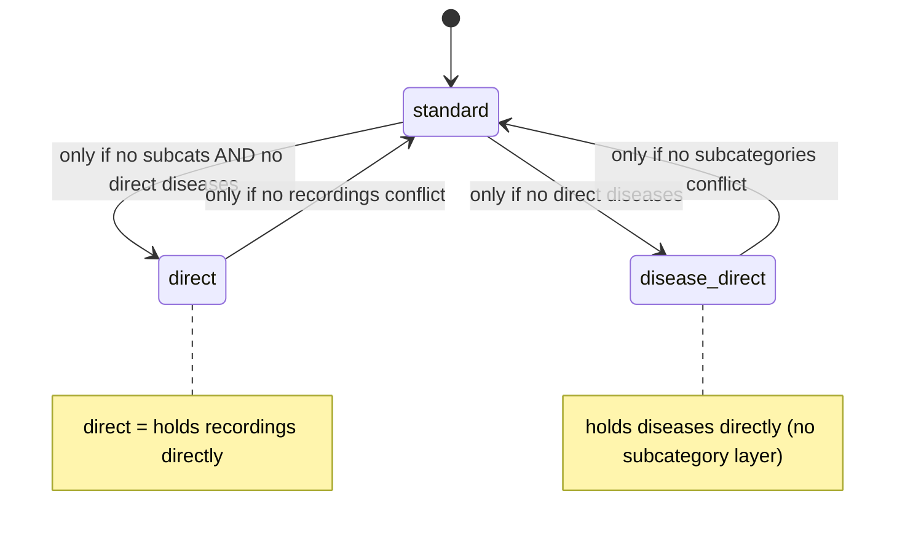

# 45. Model Reference & Business-Rule State Machines

> §4 taught the *pattern* of a model. This appendix is the *exhaustive* reference: every domain model's fillable, casts, translatable set, relationships, scopes, and — most importantly — the **business invariants enforced in `booted()` lifecycle hooks**. The hooks are where the domain's hardest rules live, and they are the single most under-appreciated part of the codebase.

## 45.1 Lifecycle hooks: the invariant-enforcement layer

Eloquent fires events at points in a model's life: `creating`/`created`, `updating`/`updated`, `saving`/`saved` (both create and update), `deleting`/`deleted`. A model's `protected static function booted()` registers closures on these. This codebase uses them for three jobs: **slug generation**, **state-machine enforcement** (throwing `LogicException` on illegal states), and **cache invalidation**.



The `LogicException` is caught by the renderable handler in `bootstrap/app.php` (§6) and turned into a 422 for Filament/Livewire — so an admin sees a clean validation error instead of a 500.

## 45.2 `Recording` — the most rule-rich model

`Recording` enforces the **session-numbering + single-free-session + attach-point** rules entirely in hooks:

```php
protected static function booted(): void
{
    static::saving(function (self $r) {                       // INVARIANT: a subcategory with diseases can't hold recordings
        if (!empty($r->subcategory_id)) {
            $sub = Subcategory::find($r->subcategory_id);
            if ($sub && $sub->diseases()->exists())
                throw new \LogicException('Cannot assign a recording directly to a subcategory that already has diseases.');
        }
    });
    static::creating(function (self $r) {                     // AUTO: next session number, scoped to parent
        if (!$r->session_number) {
            $query = match (true) {
                (bool)$r->category_id    => static::where('category_id', $r->category_id),
                (bool)$r->subcategory_id => static::where('subcategory_id', $r->subcategory_id),
                default                  => static::where('disease_id', $r->disease_id),
            };
            $r->session_number = ($query->max('session_number') ?? 0) + 1;
        }
        if (!$r->is_free) { /* first recording in a group becomes the free one */ }
    });
    static::saved(function (self $r) {                        // CASCADE: marking one free unsets siblings
        if ($r->is_free) { /* siblings in same group → is_free = false */ }
    });
}
```

| Facet | Value |
|-------|-------|
| Fillable | disease_id, category_id, subcategory_id, session_number, description, segments, audio_path, duration_seconds, is_free, is_general, plays_count, created_by |
| Translatable | description |
| Casts | three FKs + session_number + duration + plays_count → integer; is_free/is_general → boolean; **segments → array** (the karaoke JSON) |
| Relations | disease, category, subcategory, creator (belongsTo User via created_by) |
| Scopes | free (`is_free=true`), premium (`is_free=false`), general (`is_general=true`) |
| Methods | `isFreeSession()`, `streamUrl()`, `canBeAccessedBy(User)` |

**Generated SQL — `Recording::general()->with('disease')->orderBy('disease_id')->orderBy('session_number')->get()`:**
```sql
SELECT * FROM recordings WHERE is_general = 1 AND deleted_at IS NULL
ORDER BY disease_id, session_number;
SELECT * FROM diseases WHERE id IN (?, ?, ...) AND deleted_at IS NULL;   -- eager load
```

The "session 1 free, ≥2 premium, auto-number, single free per group" rule — the monetization core — is implemented *here*, in three hooks, not scattered across controllers. This is the model acting as the true domain authority.

## 45.3 `Disease` & `Category` — the taxonomy state machine

Both enforce the **category-type state machine** (§3.4) in `saving`/`updating` hooks, and both auto-generate a unique slug from the English (or transliterated Arabic) name.

**`Disease` invariants (in `saving`):**
* Must belong to **exactly one** of subcategory *or* category (XOR) — throws if both or neither.
* If under a category, that category must be `disease_direct` type and must not already have subcategories.
* Cannot attach to a subcategory that already holds direct recordings.

**`Category` invariants (in `updating` when `type` changes):**
* → `standard` blocked if it has direct diseases.
* → `disease_direct` blocked if it has subcategories.
* → `direct` blocked unless subcategories *and* direct diseases are both removed first.



**Slug generation (`assignSlug`, shared shape in Disease/Category):**
```php
$en = $record->getTranslation('name', 'en', false);
$base = $en ? Str::slug($en) : Str::slug(Str::transliterate($record->getTranslation('name','ar',false) ?? ''));
$slug = $base; $n = 1;
while (static::withTrashed()->where('slug',$slug)->when($record->exists, fn($q)=>$q->where('id','!=',$record->id))->exists())
    $slug = $base.'-'.$n++;     // de-dupe against trashed rows too
```
Note it checks **`withTrashed()`** — a soft-deleted disease still owns its slug, so the generator skips past it to avoid a unique-constraint clash on restore. This is the same class of "trashed row still occupies a unique index" subtlety as the OAuth re-signup purge (§7.4).

## 45.4 `FeatureFlag` — parent/child cascade + cache bust

`FeatureFlag` models a **two-level kill-switch tree**: hiding `hospital` force-hides its children `adhkar`, `tahsinat`, `courses`.

```php
const CHILDREN = ['hospital' => ['adhkar', 'tahsinat', 'courses']];

static::saved(function (FeatureFlag $flag) {
    if ($flag->wasChanged('is_visible') && $flag->is_visible === false) {
        static::query()->whereIn('feature_key', self::CHILDREN[$flag->feature_key] ?? [])
              ->where('is_visible', true)->update(['is_visible' => false]);   // cascade, events skipped
    }
    Cache::forget(FeatureFlagService::CACHE_KEY);                              // immediate propagation
});
```
`isLockedByParent()` lets the admin UI grey-out a child whose parent is off. The mass `update()` deliberately bypasses model events (no recursive cascade), and a single `Cache::forget` covers the whole operation — so a flag change is visible on the mobile app's next poll, not after the 300 s TTL (§13).

## 45.5 `Sponsor` — targeting predicates + cache invalidation

`Sponsor` carries audience targeting and its own cache-flush hook:
```php
static::saved(fn () => SponsorService::flushCache());
static::deleted(fn () => SponsorService::flushCache());
public function targetsCountry(?string $country): bool {
    if ($this->target_all_countries || empty($this->target_countries)) return true;
    return $country !== null && in_array($country, $this->target_countries, true);
}
```
Casts `target_countries`/`target_genders` to `array` (JSON), `target_all_countries`/`is_featured`/`display_on_launch` to boolean. The splash-screen sponsor selection filters by the signed-in user's `country`/`gender` using `targetsCountry()`.

## 45.6 Compact reference table (all 27 models)

| Model | Soft? | Translatable | Casts (notable) | Relations | Scopes / domain logic |
|-------|:----:|--------------|-----------------|-----------|------------------------|
| User | ✅ | – | password→hashed, subscription_expires_at→datetime, is_subscribed→bool | oauthProviders, favorites(BtM Disease), feedback, notificationPreference(hasOne), pushNotifications | isSubscribed, hasActiveTrial, canGrantTrial, grantTrial, isAdmin |
| Surah | ✅ | name | total_verses→int | verses, recitations | — |
| Verse | ✅ | text | — | surah | ordered by verse_number |
| Reciter | ✅ | name, bio | is_active→bool | recitations | active |
| Recitation | ✅ | – | duration_seconds→int | reciter, surah | unique(reciter,surah) |
| Category | ✅ | name | is_active→bool | subcategories, recordings, directDiseases | type state machine, slug, isDirect/isDiseaseDirect |
| Subcategory | ✅ | name | is_active→bool | category, diseases, recordings | active, ordered, slug |
| Disease | ✅ | name | FKs→int, is_active→bool | subcategory, category, recordings, aliases, favoritedBy(BtM) | XOR parent invariant, slug, active, ordered |
| DiseaseAlias | – | alias | — | disease | — |
| Recording | ✅ | description | segments→array, flags→bool | disease, category, subcategory, creator | free/premium/general, session auto-#, single-free cascade |
| Favorite | – | – | — | user, disease | toggle (firstOrCreate) |
| AdhkarCategory | – | name | day_number→int, is_active→bool | sections, items | active, ordered, iconUrl |
| AdhkarSection | – | name | order_randomly→bool | category, items | ordered |
| AdhkarItem | – | text, hint, daleel | repetitions→int | category, section | ordered |
| TahsinatCategory | – | name | is_active→bool | sections, items | active, ordered |
| TahsinatSection | – | name | order_randomly→bool | category, items | ordered |
| TahsinatItem | – | label, text, hint | repetitions→int, applicability | category, section | ordered, applicability(both/male/female) |
| Course | – | title, description | price→decimal, is_coming_soon→bool | – | active, ordered |
| Sponsor | – | name | target_*→array/bool | – | targetsCountry, logoUrl, cache flush hook |
| SponsorScreenConfig | – | – | is_enabled→bool | selectedSponsor | singleton |
| Feedback | – | likes, dislikes (json) | was_beneficial→bool | user | manual morph (service_type/service_id) |
| FeatureFlag | – | – | is_visible→bool | – | parent/child cascade, cache bust |
| NotificationPreference | – | – | toggles→bool, times | user | one-to-one |
| PushNotification | – | – | data→array, read_at→datetime | user | unread scope |
| OAuthProvider | – | – | — | user | unique(provider, provider_user_id) |

---
