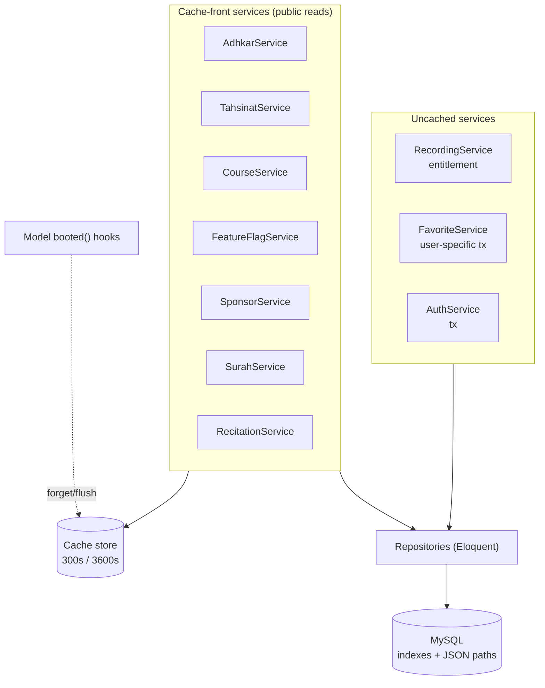

# 46. Service & Repository Reference (with Generated SQL)

> §8–9 taught the service/repository *pattern*. This appendix enumerates each repository's methods and the **exact SQL Eloquent emits**, plus each service's caching strategy. It is the query-level reference for the read layer.

## 46.1 Repository method → SQL map

### `AdhkarRepository`
```php
categories()             // AdhkarCategory::active()->ordered()->withCount('items')->get()
findCategoryBySlug($s)   // active + slug + nested eager (sections.items, section-less items)
itemsByCategorySlug($s)  // category then category->items()->ordered()->get()
todayCategories()        // active + ordered + nested eager
wakingItems()            // category 'waking' then its ordered items
```
```sql
-- categories()
SELECT adhkar_categories.*,
  (SELECT COUNT(*) FROM adhkar_items WHERE adhkar_items.adhkar_category_id = adhkar_categories.id) AS items_count
FROM adhkar_categories WHERE is_active = 1 ORDER BY display_order, id;
```

### `RecordingRepository`
```php
byDisease($id)      // Recording::where('disease_id',$id)->orderBy('session_number')->get()
findById($id)       // Recording::with('disease')->find($id)
incrementPlays($r)  // $r->increment('plays_count')
generalRuqyah()     // Recording::general()->with('disease')->orderBy('disease_id')->orderBy('session_number')->get()
```
```sql
-- byDisease()  (uses index (disease_id, session_number))
SELECT * FROM recordings WHERE disease_id = ? AND deleted_at IS NULL ORDER BY session_number;
-- incrementPlays()  (atomic, no read-modify-write race)
UPDATE recordings SET plays_count = plays_count + 1, updated_at = ? WHERE id = ?;
```
`increment()` compiling to a single atomic `SET col = col + 1` is important: it avoids the read-then-write race that `$r->plays_count++; $r->save();` would introduce under concurrent plays.

### `DiseaseRepository`
```php
paginate($perPage)  // active + ordered + with('subcategory') + withCount('recordings') + paginate
findBySlug($slug)   // active + slug + with('subcategory.category','aliases','recordings' ordered)
search($term)       // active + (name->ar/en LIKE) OR whereHas('aliases', alias->ar/en LIKE) + limit 50
```
```sql
-- search()  — the JSON-path LIKE + alias EXISTS (the disease fuzzy search)
SELECT * FROM diseases
WHERE is_active = 1 AND deleted_at IS NULL AND (
      JSON_UNQUOTE(JSON_EXTRACT(name,'$.ar')) LIKE ?
   OR JSON_UNQUOTE(JSON_EXTRACT(name,'$.en')) LIKE ?
   OR EXISTS (SELECT 1 FROM disease_aliases
              WHERE disease_aliases.disease_id = diseases.id
                AND (JSON_UNQUOTE(JSON_EXTRACT(alias,'$.ar')) LIKE ?
                  OR JSON_UNQUOTE(JSON_EXTRACT(alias,'$.en')) LIKE ?)))
ORDER BY display_order, id LIMIT 50;
```
Note Eloquent's `where('name->ar', 'like', …)` is the JSON-path operator — it compiles to `JSON_EXTRACT`. The `orWhereHas('aliases', …)` compiles to the correlated `EXISTS` shown — a textbook §35.9 use, combining a JSON-path scan with an existence subquery. This is the one search query and the §30 optimization candidate.

### `SurahRepository`
```php
getAllSurahs($perPage,$page)  // Surah::orderBy('id')->paginate(...)
getSurahWithVerses($id)       // Surah::with(['verses' => ordered by verse_number])->find($id)
getSurahById($id)             // Surah::find($id)
```
```sql
-- getSurahWithVerses()  (eager, ordered by the composite index (surah_id, verse_number))
SELECT * FROM surahs WHERE id = ? AND deleted_at IS NULL LIMIT 1;
SELECT * FROM verses WHERE surah_id IN (?) AND deleted_at IS NULL ORDER BY verse_number;
```

### Remaining repositories (uniform shape)

| Repository | Key methods | Notable SQL trait |
|------------|-------------|-------------------|
| `CategoryRepository` | all (active+ordered), findBySlug (eager children) | type-aware eager loading |
| `SubcategoryRepository`* | findBySlug (with diseases) | *(via Category/Disease repos)* |
| `VerseRepository` | search($term) | `LIKE` over `text->ar/en` (full scan, §10) |
| `ReciterRepository` | all (active), findById | cached 3600 s |
| `RecitationRepository` | bySurah($id) | eager reciter; cache `recitations.surah.{id}` |
| `TahsinatRepository` | categories, items, findCategoryBySlug | mirrors AdhkarRepository |
| `CourseRepository` | getAll (active, ordered) | cache `courses.v1.all` |
| `SponsorRepository` | getAll, screenConfig | targeting filter in service |
| `FavoriteRepository` | forUser($id), toggle($u,$d) | `firstOrCreate`/`delete` on pivot |
| `FeedbackRepository` | create($data) | manual morph write |
| `FeatureFlagRepository` | all() | cache, hook-invalidated |
| `NotificationRepository` | preferences($u), upsert, registerToken | one-to-one upsert |

**`FavoriteRepository::toggle` SQL (idempotent):**
```sql
-- toggle = insert if absent, delete if present (wrapped in DB::transaction by the service)
SELECT * FROM favorites WHERE user_id = ? AND disease_id = ? LIMIT 1;
-- then one of:
INSERT INTO favorites (user_id, disease_id, created_at, updated_at) VALUES (?, ?, ?, ?);
DELETE FROM favorites WHERE user_id = ? AND disease_id = ?;
```

## 46.2 Service caching strategy map

| Service | Method(s) | Cache key | TTL | Invalidation |
|---------|-----------|-----------|-----|--------------|
| AdhkarService | categories, today | `adhkar.v1.categories`, `adhkar.v1.today` | 300 s | TTL |
| TahsinatService | categories | `tahsinat.v1.categories` | 300 s | TTL |
| CourseService | all | `courses.v1.all` | 300 s | TTL |
| FeatureFlagService | all | `FeatureFlagService::CACHE_KEY` | 300 s | **model hook** (`saved`/`deleted`) |
| SponsorService | all, screen | `sponsors.all`, `sponsors.screen` | 300 s | **`flushCache()` via model hook** |
| RecitationService | bySurah | `recitations.surah.{id}` | 300 s | TTL |
| SurahService | list, withVerses | `surahs.v2.list.{page}.{perPage}`, `surahs.v2.{id}.verses` | 3600/300 s | **write-through + type-guarded eviction** |
| ReciterService | all, byId | `reciters.*` | 3600 s | write-through |
| RecordingService | — | *(none — entitlement-sensitive)* | — | not cached |
| FavoriteService | — | *(none — user-specific)* | — | not cached |
| AuthService | — | *(none)* | — | — |

**The defensive deserialization guard (`SurahService`)** is worth highlighting as a production-hardening pattern:
```php
$cached = Cache::get($key);
if ($cached instanceof LengthAwarePaginator) return $cached;   // accept only a valid object
Cache::forget($key);                                            // else evict (e.g. __PHP_Incomplete_Class)
$result = $this->repository->getAllSurahs($perPage, $page);
Cache::put($key, $result, 3600);
```
This protects against a cache holding a `__PHP_Incomplete_Class` (which happens if a model's class changed between the write and the read, e.g. after a deploy) — instead of fatally erroring, it silently evicts and rebuilds. A subtle but real resilience measure that most caching code omits.

## 46.3 The read layer as one diagram



This closes the backend reference: every public read is a cached service over a repository over an indexed query; every write goes through a service transaction and, where relevant, a model hook busts the cache. The entitlement-sensitive and user-specific reads are deliberately *uncached* so a subscription change or a favorite toggle is never served stale.

---

# 47. Architectural Synthesis — Seven Recurring Patterns

Having traced the system from database bytes to rendered pixels, one meta-observation unifies everything: **Quranic Clinic is built on seven recurring patterns, each applied with near-mechanical consistency.** Recognizing them is the fastest route to fluency in the codebase.

```mermaid
mindmap
  root((Quranic Clinic))
    Layered slice
      Controller→Service→Repository→Resource
      identical across 16 domains
    Interface-bound persistence
      15 repo interfaces
      one provider wires them
    Cache-front reads
      versioned keys
      300s/3600s
      hook invalidation
    Model as domain authority
      booted() invariants
      LogicException state machines
      entitlement predicates
    Full-map i18n
      JSON columns
      getTranslations everywhere
      offline language switch
    Dual-state mobile
      Redux device state
      TanStack server state
      3-tier offline cache
    Granular reactivity
      atomic selectors
      useMemo/useCallback
      keyed reconciliation
```

1. **The layered slice** (Controller→Service→Repository→Resource) — learn one domain, know all sixteen.
2. **Interface-bound persistence** — services depend on repository interfaces; one provider wires the concretes (DIP made physical).
3. **Cache-front reads** — versioned keys, TTLs, model-hook invalidation; the biggest scalability lever.
4. **The model as domain authority** — `booted()` hooks enforce the hardest invariants (session numbering, category-type state machine, feature cascade) in one place.
5. **Full-map i18n** — every translatable field travels as `{ar,en}`, enabling offline language switching.
6. **Dual-state mobile** — Redux for device state, TanStack for server state, a three-tier (memory→SQLite→network) offline cache.
7. **Granular reactivity** — atomic selectors + memoized hooks + keyed reconciliation keep a 4 Hz audio tick from re-rendering the tree.

Every chapter of this dossier is, ultimately, one of these seven patterns viewed from a different altitude. The architecture's defining virtue is not any single clever mechanism but the **disciplined repetition** of these seven — the consequence of the agentic, rules-driven build documented in §34. To extend the system well is to add the eighth feature the same way the first seven domains were added: amend the rulebook, generate the layer, preserve the slice. Predictability, here, is the feature.

The four chapters that follow (§48–51) document the operational dimensions that surround this core: how failures are handled, how code reaches production, how the bilingual/RTL system threads every layer, and how the on-device notification engine drives retention.
