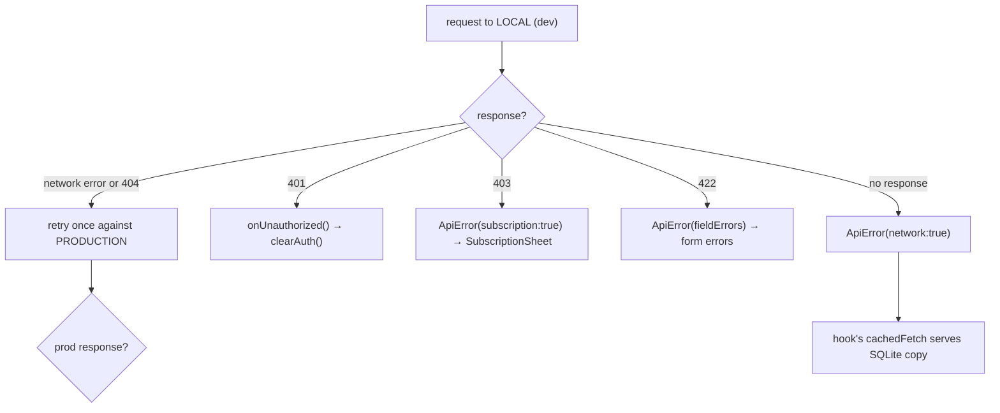
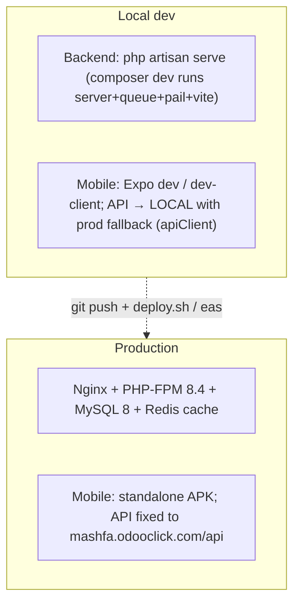

# 48. Error-Handling Patterns & Resilience

Resilience in this system is layered: each tier degrades gracefully so a failure at one layer is absorbed rather than surfaced as a crash. This chapter catalogs the patterns top to bottom.

## 48.1 Backend: the typed-catch controller pattern

The reference controller `try/catch` (from `error-handling-patterns.md`) discriminates by exception type, logs to a dedicated channel, and maps each to a precise HTTP status:

```php
try {
    return $this->success($result);
} catch (ModelNotFoundException $e) { Log::channel('build')->error('Not found', ['exception'=>$e]);  return $this->error('Not found', 404); }
  catch (ValidationException   $e) { Log::channel('build')->error('Validation failed', ['errors'=>$e->errors()]); return $this->error('Validation failed', 422, $e->errors()); }
  catch (AuthorizationException $e) { return $this->error('Unauthorized', 403); }
  catch (QueryException        $e) {
      if ($e->errorInfo[1] == 1062) return $this->error('Already exists', 409);   // MySQL duplicate-key
      Log::channel('build')->error('Database error', ['exception'=>$e]);  return $this->error('Database error', 500);
  }
  catch (Throwable             $e) { Log::channel('build')->error('Server error', ['exception'=>$e]); return $this->error('Server error', 500); }
```

| Exception | Status | Rationale |
|-----------|--------|-----------|
| `ModelNotFoundException` | 404 | bad slug/id |
| `ValidationException` | 422 | re-wrapped into the app envelope's `errors` (§12) |
| `AuthorizationException` | 403 | policy denial |
| `QueryException` code 1062 | **409** | duplicate unique key surfaced as a *conflict*, not a 500 |
| any other `QueryException` | 500 | logged with full exception |
| `Throwable` | 500 | last-resort; message hidden from client, logged server-side |

**Key resilience properties:** (1) the client always receives the uniform envelope, never a raw stack trace; (2) every catch **logs** to the `build` channel so a swallowed 500 is still diagnosable (§31 finding #3); (3) the duplicate-key → 409 mapping turns a database constraint into a meaningful client signal. The live controllers in the repo use the condensed `catch (\Throwable) → 500` form; the pattern file above is the fuller template the project standardizes toward.

## 48.2 Backend: transactions, the renderable LogicException, and atomic writes

* **Transactions with retries.** The service pattern wraps multi-statement writes in `DB::transaction(fn () => ..., 3)` — the `3` is the **deadlock retry count**, so a transient deadlock is retried automatically before failing.
* **The renderable `LogicException`.** Model `booted()` hooks throw `LogicException` for illegal domain states (§45). The handler in `bootstrap/app.php` renders these as **422** for Livewire/Filament, so an admin sees a clean validation message instead of a 500. This is the bridge between the model-as-authority pattern and a humane admin UX.
* **Atomic counters.** `increment('plays_count')` (§46.1) avoids read-modify-write races under concurrency — a resilience choice at the SQL level.
* **Defensive cache deserialization.** `SurahService` rejects a cached value that is not the expected type and silently rebuilds (§46.2) — surviving a post-deploy `__PHP_Incomplete_Class` instead of fatally erroring.

## 48.3 Mobile: the `ApiError` taxonomy and the network fallback ladder

The client mirrors the server's discrimination with a typed `ApiError` (§24) carrying `status`, `isNetworkError`, `isSubscriptionRequired`, `fieldErrors`. The axios response interceptor maps server responses to it and runs a **fallback ladder**:



**Crucial exclusions:** the local→production retry fires *only* for network errors or 404 (missing endpoint), **never** for 401/403/422 — those are real failures, not "wrong server" problems (§ CLAUDE.md). This prevents a validation error from being silently re-submitted to a different backend.

## 48.4 Mobile: graceful degradation everywhere

* **Offline reads** — `cachedFetch` catches any fetch error and returns the last SQLite copy (§24); the UI never hangs on a spinner offline.
* **Cache writes are best-effort** — `contentCache.setItem` swallows write failures (a full disk must not break a read).
* **Download failures** — `useDownloadManager` dispatches `failTask` and keeps the task resumable; an app kill mid-download resumes from the saved token on next launch (§ store transforms).
* **Notifications/sensors absent** — `notificationScheduler` guards every Expo API behind null checks (Expo Go has no notifications module) and wraps scheduling in try/catch marked "non-fatal" (§51).
* **401 single seam** — any request's 401 triggers exactly one `clearAuth()` via the registered handler, logging the user out app-wide without scattering auth logic.

The throughline: **every external dependency (network, disk, sensors, notification service) is treated as fallible, and each failure has a defined, non-crashing degradation.** This is what makes an offline-first app feel reliable.

---

# 49. Deployment, DevOps & Environment Topology

## 49.1 Production infrastructure

| Item | Value |
|------|-------|
| Server | Ubuntu 24.04, `ssh -p 2222 root@185.55.243.191` (ed25519 key) |
| Domain | `https://mashfa.odooclick.com` (Let's Encrypt via Certbot, Nginx) |
| Backend path | `/var/www/mashfa/app` (git repo, origin = Azure DevOps `Core-Click/Almashfa`, branch `master`) |
| Web root | `/var/www/mashfa/app/public` → Nginx → PHP-FPM **8.4** socket |
| Stack | PHP 8.4 (ondrej PPA), Composer, MySQL 8 (db `quranic_clinic`) |
| CMS | Filament at `/admin` |
| Mobile build | EAS (`@wael_hamwi/quranic-clinic`), profile `preview` → APK, `production` → AAB |

**One app, three faces.** The backend, CMS, and API are a *single* Laravel application — deploying once updates all three. This is why there is no separate admin service to coordinate.

## 49.2 The backend deploy pipeline (interpreted — no build)

```mermaid
flowchart LR
    Local["local: git commit + push origin master (Azure)"] --> SSH["ssh server"]
    SSH --> Deploy["bash deploy.sh"]
    Deploy --> Pull["git pull"] --> Comp["composer install --no-dev"]
    Comp --> Mig["php artisan migrate --force"]
    Mig --> Cache["config/route/view:cache"]
    Cache --> Perm["fix permissions"] --> FPM["reload PHP-FPM"]
    FPM --> Live["live immediately (interpreted code)"]
```



Because PHP is interpreted, a change is live the instant FPM reloads after the cache rebuild — **no compile/bundle step**. The server uses a stored Azure PAT (`/root/.git-credentials`, chmod 600, scope Code→Read) for non-interactive `git pull`.

**Production migration safety.** The *dev* rule (amend the original migration + `migrate:fresh`, §34) is **forbidden in production** — `migrate:fresh` drops all data. `deploy.sh` runs `migrate --force`, applying only *new* migration files. A production schema change therefore requires a *dedicated additive migration* — the one documented exception to the "never add a migration" rule, scoped strictly to prod.

## 49.3 The mobile release pipeline (compiled — has a build step)

JS lives inside an installed binary, so a change is live only after **(a)** an EAS OTA update (JS/asset-only) or **(b)** a new APK/AAB build (native changes: new modules, permissions, icon/splash, SDK bump).

| Change type | Action | Live when |
|-------------|--------|-----------|
| Backend code/API/CMS | push → `deploy.sh` | after FPM reload |
| Backend `.env` | edit on server → `config:cache` + reload | immediately |
| Nginx | edit → `nginx -t && reload` | immediately |
| Mobile JS/asset (EAS Update) | `eas update --branch preview` | next app launch |
| Mobile JS/asset (no EAS Update) | rebuild APK | after reinstall |
| Mobile native | rebuild APK/AAB | after reinstall |

Builds are launched **from the server** because the local network blocks EAS uploads over IPv4 — the committed mobile source is `git archive`-d, `scp`-d to the server, extracted over the existing build dir (preserving `node_modules`), and `eas build` runs there with `EAS_NO_VCS=1`. The APK's `Application Archive URL` is distributed to testers.

## 49.4 The three runtime environments



The `composer dev` script runs four concurrent processes (`server`, `queue:listen`, `pail` logs, `vite`) for a one-command local stack. The mobile app's **local-first-with-production-fallback** URL strategy (§ CLAUDE.md, §24, §48.3) means a developer can run the app against a local backend and have it transparently fall back to production for any endpoint not yet implemented locally — a notable DX optimization that also de-risks demos.

## 49.5 Caching driver per environment

* **Production:** Redis (fast, shared across FPM workers; also the store for the ephemeral OTP/one-time-session state, §13).
* **Local:** file/database driver — same `Cache` facade code, so behavior is identical and the OTP flow works without Redis installed.

This driver-agnosticism (§13) is what lets the identical codebase run in both environments unchanged.

---
