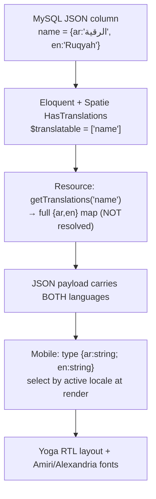
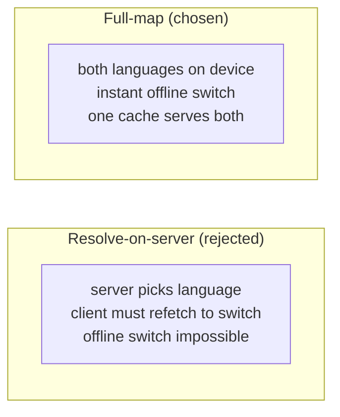
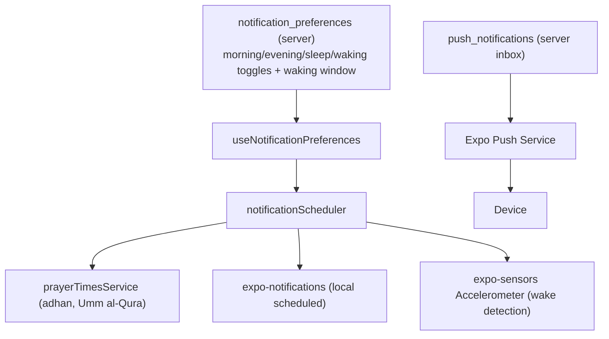
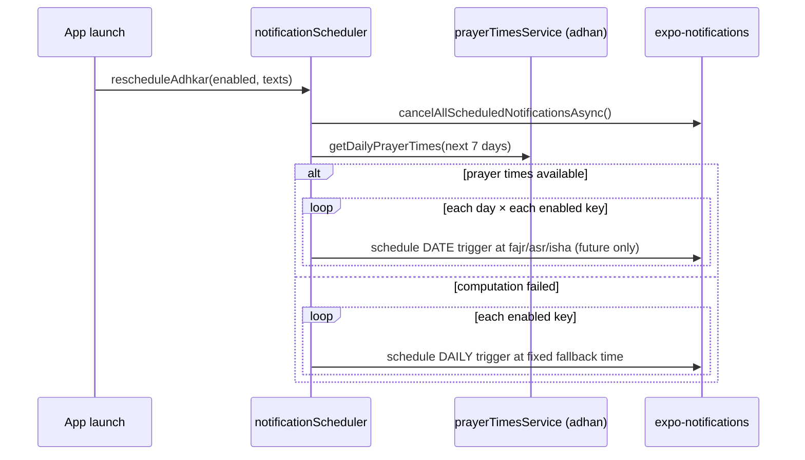

# 50. Internationalization & RTL — End to End

Quranic Clinic is **Arabic-first and fully bilingual (ar/en)**. Internationalization is not a bolt-on; it spans the database, the API serialization, the mobile state, and the layout engine. This chapter traces a single translatable string through all four layers.

## 50.1 The four-layer i18n stack



## 50.2 Layer 1 — storage (JSON columns)

Every translatable field is a `json` column holding a map, not two sibling columns (§3). One ASCII `slug` is the language-independent key. This means adding a third language later is a *data* change (new map key), not a *schema* change — no migration, no new columns.

## 50.3 Layer 2 — model (Spatie + the full-map override)

`HasTranslations` wraps Spatie and **overrides `attributesToArray()`** to emit the entire `{ar,en}` map rather than the current-locale string (§4.1). `getTranslation('name','en',false)` reads one language (used by slug generation, §45.3); `getTranslations('name')` reads the whole map (used by resources).

## 50.4 Layer 3 — API (full-map serialization)

Every `*Resource` calls `getTranslations()` so the **payload carries both languages** (§11). The architectural payoff: the mobile client can switch language **offline**, instantly, with zero refetch — the bytes for both languages are already on the device and in the SQLite cache. This is why the `SetLocale` middleware (§6) matters little for *content* (it mainly affects validation messages); the content is locale-agnostic on the wire by design.

## 50.5 Layer 4 — mobile (locale selection + RTL)

`LanguageContext` holds the active `'ar' | 'en'` (default `'ar'`), persists the choice to AsyncStorage, and exposes `t` (the static-string dictionary for the active language) plus `toggleLanguage`/`selectLanguage`:

```tsx
const [language, setLanguage] = useState<Language>('ar');     // Arabic default
useEffect(() => { AsyncStorage.getItem('app_language').then(v => { if (v === 'en') setLanguage('en'); }); }, []);
// value: { language, isArabic, t: language === 'ar' ? ar : en, toggleLanguage, selectLanguage }
```

* **Dynamic content** (API) — components select `item.name[language]` at render. The bilingual rule forbids hard-accessing `item.name.ar`; always go through the active locale (§ CLAUDE.md).
* **Static content** — hardcoded strings live in `src/i18n/ar.ts` / `en.ts` as parallel dictionaries; `t.someKey` resolves the active language.
* **RTL layout** — Arabic text styles set `writingDirection: 'rtl'`, `textAlign` appropriately, and use `fontFamily.arabic` (Amiri) at tall line-heights for Qur'anic legibility; UI chrome uses Alexandria. **Yoga mirrors `flexDirection: 'row'` automatically** under RTL, so most layouts need no separate stylesheet (§29).

## 50.6 Why this design is the right one



Carrying both languages costs a few extra bytes per field but buys **instant, offline, refetch-free language switching** — exactly right for an app whose users may toggle Arabic/English while disconnected. The trade-off (payload size) is negligible for short content strings; the benefit (offline UX) is large. The whole stack — JSON columns → full-map serialization → client-side selection → Yoga RTL — is internally consistent around this single decision.

---

# 51. Notifications & Prayer-Time Scheduling

The retention engine is **locally-scheduled adhkar reminders pinned to prayer times**, plus an **accelerometer-based "on waking" reminder**, with server-sent push as a secondary channel. This is one of the most sophisticated client subsystems and deserves a dedicated chapter.

## 51.1 Architecture



## 51.2 Prayer-time-pinned adhkar reminders

Each adhkar reminder fires at its associated prayer, computed locally and offline:

```ts
const PRAYER_FOR_KEY = { morning: 'fajr', evening: 'asr', sleep: 'isha' };
const SCHEDULE_DAYS = 7;   // rolling window, refreshed each launch
```

`rescheduleAdhkar()`:
1. Cancels all previously scheduled notifications (idempotent rebuild).
2. If none enabled or permission denied, stops.
3. Builds the next 7 calendar days, asks `prayerTimesService` (the `adhan` library, Umm al-Qura method) for each day's prayer times.
4. For each enabled reminder, schedules a **dated** notification at that day's Fajr/Asr/Isha, **skipping already-passed times**.
5. **Fallback:** if prayer-time computation fails, schedules fixed **daily** reminders (06:30 / 17:00 / 22:00) instead — so the user always gets reminders even if location/calc is unavailable.



**Why a 7-day rolling window of dated triggers** instead of one recurring daily trigger: prayer times *shift every day*, so a single recurring "06:30" trigger would drift from the actual Fajr. Pre-scheduling 7 dated notifications and refreshing on each launch keeps each reminder pinned to the true prayer time while staying within the OS's scheduled-notification limits.

## 51.3 Accelerometer "on waking" reminder

The waking adhkar can't be time-scheduled (you don't know when the user wakes), so it uses **motion detection** within a user-defined window:

```ts
Accelerometer.setUpdateInterval(900);
accelSubscription = Accelerometer.addListener(({x,y,z}) => {
  const magnitude = Math.sqrt(x*x + y*y + z*z);
  if (Math.abs(magnitude - 1) < WAKE_THRESHOLD) return;     // ignore near-rest (≈1g)
  const today = new Date().toISOString().slice(0,10);
  if (lastWakeFiredDate === today) return;                  // once per day
  if (!withinWindow(now, startTime, endTime)) return;       // only inside the waking window
  lastWakeFiredDate = today;
  Notifications.scheduleNotificationAsync({ content:{...}, trigger: null });  // fire immediately
});
```

* **Algorithm:** the accelerometer reports acceleration in g; at rest the magnitude is ≈1 (gravity). A deviation beyond `WAKE_THRESHOLD` (0.7) means the phone was picked up/moved — a wake proxy. Sampling every 900 ms balances responsiveness against battery.
* **Guards:** fires **at most once per calendar day** (`lastWakeFiredDate`) and **only inside the configured `[start,end]` window** (with wrap-around support for windows crossing midnight, via `withinWindow`).
* **`trigger: null`** fires the notification immediately (not scheduled) the moment motion is detected in-window.

This is a genuinely clever, sensor-driven UX: a "good morning, here are your waking adhkar" nudge that triggers on actual waking rather than a guessed alarm time.

## 51.4 Resilience & environment guards

`expo-notifications` is **lazy-required** and null-guarded because it is unavailable in Expo Go (SDK 53 init warnings) — the scheduler degrades to a no-op there rather than crashing. Every scheduling call is wrapped in try/catch marked "non-fatal." Permission is requested lazily (`ensurePermission`) and a denial simply stops scheduling. This mirrors the system-wide "every external dependency is fallible" philosophy (§48.4).

## 51.5 Server push (secondary channel)

The server stores per-user notifications in `push_notifications` (title, body, type, `data`, `read_at`, `sent_at`; indexed `(user_id, read_at)` for the unread badge) and targets devices via `expo_push_token` (saved through `POST /notifications/token`) using the Expo Push Service. Local scheduled reminders are the *habit* engine; server push is for *announcements* (new content, courses). The two channels are independent, so a server outage never stops the daily adhkar reminders — they are computed and scheduled entirely on-device.

---

The final chapter (§52) dissects the Mushaf reader — the project's flagship subsystem — end to end.
