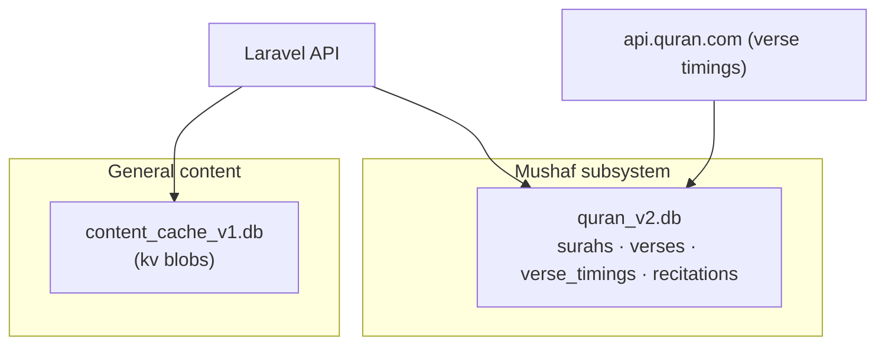
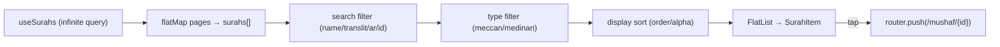
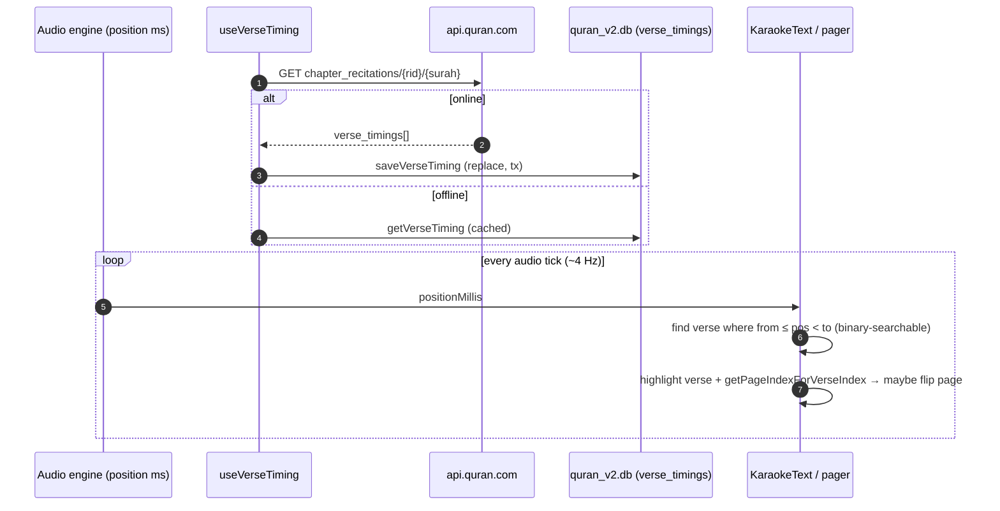
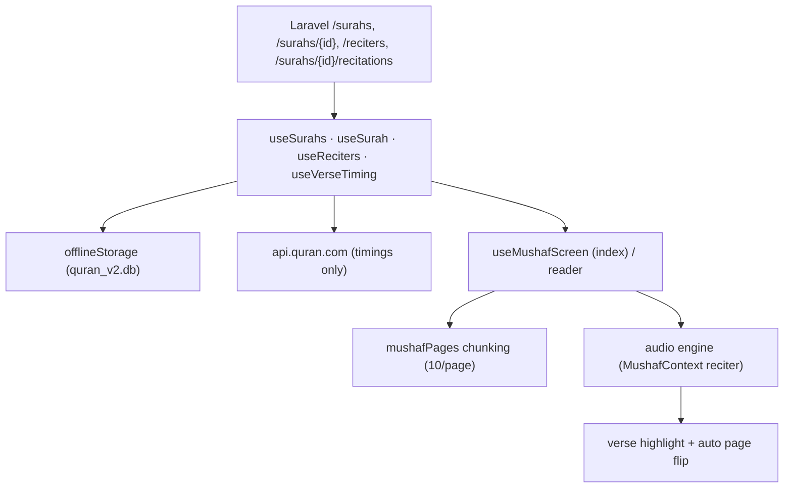

# 52. The Mushaf Reader — Flagship Subsystem Deep Dive

The Mushaf (Qur'an reader) is the product's flagship and the first feature built (per the project plan). It is architecturally distinct from the rest of the app: it has its **own SQLite database**, its **own offline strategy**, an **infinite-scroll surah index**, **page-chunked verse rendering**, and **karaoke verse highlighting** synchronized to per-verse audio timings fetched from an external corpus. This chapter dissects it end to end.

## 52.1 Why the Mushaf is isolated

A deliberate design rule (visible in `contentCache`'s comment and `offlineStorage`) keeps the Mushaf's cache **completely separate** from the rest of the app's content cache:

* Adhkar/Tahsinat/Hospital use `content_cache_v1.db` (a simple key/value blob store, §38.7).
* The Mushaf uses `quran_v2.db` — a **structured relational** SQLite schema (surahs, verses, verse_timings, recitations).

The separation means evolving one cache never risks the other, and the Qur'an text — which must be perfectly stable and fully offline — lives in its own versioned database that is never touched by general content invalidation.



## 52.2 The Mushaf SQLite schema

`offlineStorage.initDatabase()` creates four tables in `quran_v2.db`:

```sql
CREATE TABLE surahs (id INTEGER PRIMARY KEY, name TEXT, transliteration TEXT, type TEXT, total_verses INTEGER);
CREATE TABLE verses (id INTEGER PRIMARY KEY, surah_id INTEGER, verse_number INTEGER, text TEXT,
                     FOREIGN KEY(surah_id) REFERENCES surahs(id));
CREATE TABLE verse_timings (surah_id INTEGER, recitation_id INTEGER, verse_index INTEGER,
                            timestamp_from INTEGER, timestamp_to INTEGER,
                            PRIMARY KEY (surah_id, recitation_id, verse_index));
CREATE TABLE recitations (id INTEGER PRIMARY KEY, reciter_id INTEGER, surah_id INTEGER,
                          audio_url TEXT, duration_seconds REAL, reciter_json TEXT);
```

Design notes:
* **Translatable fields are stored as JSON** (`name`, `text`) — the same `{ar,en}` map as the server (§50), parsed by `parseTranslatable` with a graceful fallback (`{ar: raw}` if the string isn't JSON). The `v2` suffix marks the migration from a single-language `v1` schema to JSON.
* **`verse_timings` has a composite primary key** `(surah_id, recitation_id, verse_index)` — the exact lookup shape for "the timing of verse *i* of surah *s* for reciter *r*," making karaoke sync an indexed point lookup.
* **All writes are transactional** (`withTransactionAsync`) — saving 286 verses of Al-Baqarah is one atomic transaction, not 286 autocommits, which is both faster and crash-safe.
* **`saveVerseTiming` deletes-then-inserts** within the transaction (replace semantics) so a re-fetch never leaves stale partial timings.

## 52.3 The surah index — infinite scroll + client filtering (`useMushafScreen`)

The surah list is a 114-row catalog with rich client-side interaction, all orchestrated by one container hook:

* **Infinite pagination.** `useSurahs()` is a TanStack *infinite query*; `handleEndReached` calls `fetchNextPage()` when the list nears its end and a next page exists — `surahs = surahsData.pages.flatMap(p => p.data)` flattens the pages (§ memoized).
* **Three filter/sort axes**, all `useMemo`-computed so they recompute only when inputs change:
  * **Search** — matches English name, transliteration, Arabic name, or numeric id (`String(s.id) === q`).
  * **Type filter** — `all | meccan | medinan`.
  * **Display mode** — `order` (revelation/mushaf order) or `alpha` (`localeCompare` on transliteration).
* **Reciter selection** lives in `MushafContext` (so the chosen reciter persists across the index and the reader); `filteredReciters` supports searching reciters by Arabic/English name.



Every handler is `useCallback`-wrapped and the derived lists are `useMemo`-ed (§19, §22) — so typing in the search box recomputes only `filteredSurahs`, never the whole screen.

## 52.4 The reader — page chunking algorithm (`mushafPages`)

Inside a surah, verses are paginated into fixed pages of ten for a book-like pager:

```ts
export const VERSES_PER_PAGE = 10;
export function chunkVersesIntoPages(verses: Verse[]): Verse[][] {
  const chunks: Verse[][] = [];
  for (let i = 0; i < verses.length; i += VERSES_PER_PAGE) chunks.push(verses.slice(i, i + VERSES_PER_PAGE));
  return chunks.length > 0 ? chunks : [[]];     // always at least one (empty) page
}
export const getPageIndexForVerseIndex = (vi: number) => vi < 0 ? 0 : Math.floor(vi / VERSES_PER_PAGE);
export const getTotalPagesForSurah  = (n: number)   => Math.max(1, Math.ceil(n / VERSES_PER_PAGE));
```

* **`chunkVersesIntoPages`** — O(n) slicing into pages; the `[[]]` fallback guarantees the pager always has a page to render (no empty-state crash).
* **`getPageIndexForVerseIndex`** — `floor(verseIndex / 10)` maps the *currently-spoken verse* (from karaoke timing) to the page it lives on, so the pager can **auto-advance** as audio plays.
* **`getTotalPagesForSurah`** — `ceil(verseCount / 10)`, min 1, for the page counter.

This trio is the bridge between linear audio playback and the paged visual layout: as the reciter moves to verse 23, `getPageIndexForVerseIndex(22) = 2` flips the pager to page 3.

## 52.5 Karaoke — verse-timing fetch, cache, and highlight (`useVerseTiming`)

The most technically interesting part. Per-verse timestamps are **not** in the app's own backend (the app stores recording-level `segments` for Ruqyah, but full-Qur'an reciter timings come from the **quran.com** corpus):

```ts
const QURANCOM_IDS = { 'Mishary Rashid Al-Afasy': 7 };   // map app reciter → quran.com recitation id

useQuery({
  queryKey: ['verseTiming', surahId, recitationId],
  queryFn: async () => {
    try {
      const res = await fetch(`https://api.quran.com/api/v4/chapter_recitations/${recitationId}/${surahId}`);
      const raw = (await res.json())?.audio_file?.verse_timings ?? [];
      const timings = raw.map(t => ({ timestampFrom: t.timestamp_from, timestampTo: t.timestamp_to }));
      await offlineStorage.saveVerseTiming(surahId, recitationId, timings);   // cache to quran_v2.db
      return timings;
    } catch {
      const cached = await offlineStorage.getVerseTiming(surahId, recitationId);  // offline fallback
      if (cached.length > 0) return cached;
      throw new Error('Verse timing not available offline');
    }
  },
  enabled: !!recitationId && surahId > 0,
  staleTime: 7 * 24 * 60 * 60 * 1000,   // a week — timings never change
  gcTime:    7 * 24 * 60 * 60 * 1000,
  retry: false,
  networkMode: 'offlineFirst',
});
```

**The complete karaoke pipeline:**



**Why this design is notable:**
* **A 7-day `staleTime`/`gcTime`** — verse timings are immutable, so refetching is pointless; once cached they serve from `quran_v2.db` forever in practice.
* **`offlineFirst` + try/catch fallback** — the query runs even offline; on failure it serves the SQLite copy, so a downloaded surah recites with synchronized highlighting with no connectivity (§24).
* **Reciter-id mapping** — the app's reciters are mapped to quran.com recitation ids; only mapped reciters get karaoke (graceful: an unmapped reciter simply plays audio without highlighting, `enabled: !!recitationId`).
* **Active-verse lookup** is the §39.6 algorithm: find the verse whose `[from, to)` window contains the current position. Because timings are sorted, this is binary-searchable as surahs lengthen.

## 52.6 Mushaf data-flow synthesis



The Mushaf is the app in microcosm: server-authoritative text, a structured offline mirror, an external enrichment source (timings) folded into the same offline-first cache, and a tight audio↔visual sync loop — all built on the same TanStack + SQLite + memoized-hook foundations as the rest of the app, but specialized for the demands of a first-class Qur'an reader.

---

> *This concludes the architecture teardown (§1–52). The **code-walkthrough & principles reference** follows: §53 the unified caching architecture (annotated), §54–58 five line-by-line code walkthroughs (read path, write path & lifecycle, authentication, mobile networking, mobile state), and §59–67 a programming-principles reference (constructors, dependency injection, the four OOP pillars, prototypes & object models, type systems, relational modeling, web engineering, data structures, and algorithms & optimization) — each principle shown in the project's real code.*
