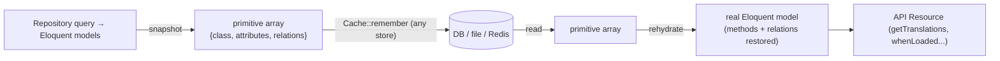
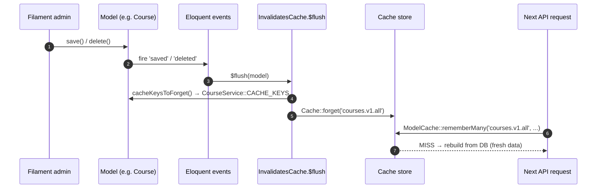
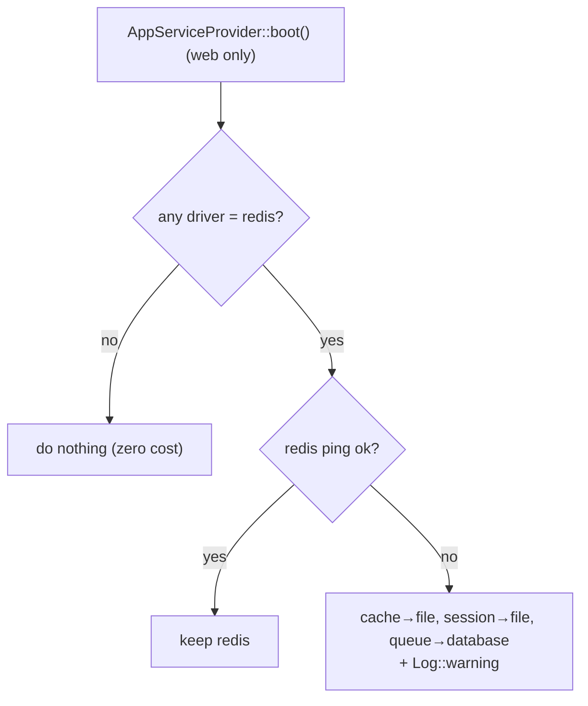

# 53. The Unified Caching Architecture (Annotated)

> This chapter documents the caching refactor (`refactor(backend): unify caching + layered architecture`). It supersedes the high-level §13 with a **line-by-line reading of the real code**: the snapshot/rehydrate cache (`App\Support\ModelCache`), the invalidation trait (`App\Models\Concerns\InvalidatesCache`), and the resilient Redis fallback (`AppServiceProvider`). Each block is the verbatim source followed by an explanation of *what every line does, why it exists, the data structure it manipulates, and how the functions connect*.

## 53.1 The problem this architecture solves

Caching read-heavy endpoints is the single biggest performance lever (§30). The naïve approach — `Cache::remember($key, $ttl, fn () => Model::query()->get())` — stores the **live Eloquent object graph**. That fails in two ways the team hit in production (visible in commit history: *"Fix courses API 500: cache plain attributes, not Eloquent models"*, *"snapshot+rehydrate Eloquent in Adhkar/Tahsinat/Sponsor services"*):

1. **Serialization fragility.** To put a value in a cache store, PHP must `serialize()` it. A live model graph can contain a `Closure`, a resource handle, or a media-library conversion object somewhere in its relations — and `serialize()` throws *"Serialization of 'Closure' is not allowed."* The catch: this happens on the **cache HIT** (when reading back), not the miss — so it passes locally (cold cache) and 500s in production (warm cache). A class-not-found after a deploy yields a `__PHP_Incomplete_Class`, the same failure mode.
2. **Loss of model behavior.** The obvious fix — cache `$model->toArray()` — returns a plain array, but the API Resources call **model methods** (`getTranslations()`, `iconUrl()`, `whenLoaded()`, `whenCounted()`) that only exist on real models. A plain array breaks the Resource layer.

The solution is **snapshot on write, rehydrate on read**: store a primitive, serialization-proof array; rebuild a real model from it on the way out.



## 53.2 `ModelCache` — the read side, line by line

```php
final class ModelCache
{
    public static function rememberMany(string $key, int $ttl, Closure $resolver): EloquentCollection
    {
        $snapshots = Cache::remember($key, $ttl, static function () use ($resolver): array {
            return $resolver()->map(static fn (Model $m): array => self::snapshot($m))->all();
        });

        return new EloquentCollection(
            array_map(static fn (array $snap): Model => self::rehydrate($snap), $snapshots)
        );
    }
```

* **`final class`** — the class is not meant to be extended; it is a stateless utility (all methods `static`). Marking it `final` documents that intent and lets the engine devirtualize calls.
* **`rememberMany(string $key, int $ttl, Closure $resolver)`** — the public read API for a *collection* query. `$resolver` is a closure that, when called, runs the actual repository query (e.g. `fn () => $this->repository->categories()`). Passing a closure (not the data) is **lazy evaluation**: the query runs *only on a cache miss*.
* **`Cache::remember($key, $ttl, ...)`** — the framework primitive: "return the cached value at `$key`, or run the callback, store its result for `$ttl` seconds, and return it." The callback here returns an **`array` of snapshots**, never models — so what lands in the store is always serialization-proof.
* **`$resolver()->map(fn (Model $m) => self::snapshot($m))->all()`** — on a miss: run the query → an Eloquent `Collection`; `map` each model to its primitive snapshot; `->all()` unwraps the Collection to a plain PHP array (arrays serialize cleanly; a Collection might carry surprises). This array is what gets cached.
* **On the way out** — `array_map(... self::rehydrate($snap) ...)` rebuilds a real model per snapshot and wraps them in a fresh `EloquentCollection`, so the caller receives exactly what a non-cached query would have returned: a Collection of models with working methods and relations.

The single-model and paginated variants follow the same shape:

```php
    public static function remember(string $key, int $ttl, Closure $resolver): ?Model
    {
        $snapshot = Cache::remember($key, $ttl, static function () use ($resolver): ?array {
            $model = $resolver();
            return $model instanceof Model ? self::snapshot($model) : null;   // null caches a genuine "not found"
        });
        return $snapshot === null ? null : self::rehydrate($snapshot);
    }
```

* Note it caches **`null`** when the resolver returns no model — so a "not found" is also cached (avoiding a DB hit on every lookup of a missing slug), and the `=== null` guard rebuilds nothing in that case.

```php
    public static function rememberPaginated(string $key, int $ttl, Closure $resolver): LengthAwarePaginator
    {
        $payload = Cache::remember($key, $ttl, static function () use ($resolver): array {
            $paginator = $resolver();
            return [
                'items'       => array_map(fn (Model $m) => self::snapshot($m), $paginator->items()),
                'total'       => $paginator->total(),
                'perPage'     => $paginator->perPage(),
                'currentPage' => $paginator->currentPage(),
                'path'        => $paginator->path(),
                'pageName'    => $paginator->getPageName(),
            ];
        });
        $items = array_map(fn (array $snap) => self::rehydrate($snap), $payload['items']);
        return new LengthAwarePaginator($items, $payload['total'], $payload['perPage'],
            $payload['currentPage'], ['path' => $payload['path'], 'pageName' => $payload['pageName']]);
    }
```

* A `LengthAwarePaginator` is itself unserializable-prone (it holds a closure for URL generation). So only the **page items + the scalar pagination meta** are stored, and a *new* paginator is reconstructed on read — the paginator object never enters the cache.

## 53.3 The `snapshot()` algorithm — recursive tree flattening

```php
    private static function snapshot(Model $model): array
    {
        $relations = [];
        foreach ($model->getRelations() as $name => $value) {
            $relations[$name] = match (true) {
                $value instanceof EloquentCollection,
                $value instanceof SupportCollection => [
                    'type'  => 'many',
                    'items' => $value->map(fn (Model $m) => self::snapshot($m))->all(),
                ],
                $value instanceof Model => ['type' => 'one', 'model' => self::snapshot($value)],
                default                 => ['type' => 'null'],
            };
        }
        return [
            'class'      => $model::class,
            'attributes' => $model->getAttributes(), // raw DB values incl. withCount() aggregates
            'relations'  => $relations,
        ];
    }
```

**What it produces — the snapshot data structure** (a recursive, JSON-shaped tree):
```php
[
  'class'      => 'App\\Models\\AdhkarCategory',
  'attributes' => ['id' => 2, 'name' => '{"ar":..,"en":..}', 'slug' => 'morning', 'items_count' => 30, ...],
  'relations'  => [
     'sections' => ['type' => 'many', 'items' => [ /* recursive snapshots */ ]],
     'items'    => ['type' => 'many', 'items' => [ /* recursive snapshots */ ]],
  ],
]
```

* **`$model->getRelations()`** returns only the relations that were **eager-loaded** (the `$relations` HashTable, §38.2) — so the snapshot captures exactly the tree the repository built with `with(...)`, no more.
* **`match (true)`** is a PHP 8 expression that evaluates each arm's condition in order — here a *type switch*: a Collection becomes `{type:'many', items:[...]}`, a single related model becomes `{type:'one', model:{...}}`, anything else (a null relation) becomes `{type:'null'}`. Tagging the type is what lets `rehydrate` rebuild the correct relation shape.
* **Recursion** — `self::snapshot($m)` on each child means a parent→sections→items tree is flattened depth-first. **Complexity: O(n)** in the total number of nodes (each visited once); **space: O(n)** for the snapshot.
* **`getAttributes()`** captures the *raw* attribute HashTable — including `withCount()` aggregates like `items_count` (which live as a normal attribute) and the undecoded JSON translation strings. Nothing is resolved or cast yet; that happens lazily after rehydration when the Resource reads it.

## 53.4 The `rehydrate()` algorithm — reconstructing the object graph

```php
    private static function rehydrate(array $snapshot): Model
    {
        $model = new $snapshot['class'];                       // dynamic class instantiation
        $model->setRawAttributes($snapshot['attributes'], true); // restore attrs; sync $original
        $model->exists = true;                                  // mark as a persisted (not new) record

        foreach ($snapshot['relations'] as $name => $relation) {
            $model->setRelation($name, match ($relation['type']) {
                'many'  => new EloquentCollection(array_map(fn ($s) => self::rehydrate($s), $relation['items'])),
                'one'   => self::rehydrate($relation['model']),
                default => null,
            });
        }
        return $model;
    }
```

* **`new $snapshot['class']`** — *variable class instantiation*: PHP constructs whatever class the snapshot recorded. This is why `class` is stored — a generic cache that rebuilds the correct concrete model type (`AdhkarCategory`, `Course`, …).
* **`setRawAttributes($attrs, true)`** — writes the attribute HashTable directly (bypassing mutators/`$fillable`, since these are trusted DB values) and the second arg `true` **syncs `$original`** so the model is "clean" (not dirty) — important so a later `save()` wouldn't think every field changed.
* **`$model->exists = true`** — tells Eloquent this represents an existing row (not a new insert), so relations and `getKey()` behave correctly.
* **`setRelation($name, ...)`** — re-attaches each relation into the `$relations` HashTable, recursively rebuilding child collections/models. After this, `$model->whenLoaded('items')` in the Resource sees the relation as loaded — behaving identically to a fresh eager-loaded query.
* **Complexity: O(n)** to walk the snapshot tree; the rebuilt graph is indistinguishable from a DB-hydrated one to every downstream consumer.

**The key invariant:** `rehydrate(snapshot(model))` yields a model that the Resource layer cannot distinguish from a freshly-queried one — same class, same attributes (incl. aggregates), same loaded relations, same methods — but it crossed the cache as a plain array.

## 53.5 How a service uses it (the read side wired up)

`AdhkarService` shows the full integration — note the **cache keys are class constants**, shared with the invalidation side:

```php
class AdhkarService
{
    public const CACHE_CATEGORIES = 'adhkar.v1.categories';
    public const CACHE_TODAY      = 'adhkar.v1.today';
    public const CACHE_KEYS = [self::CACHE_CATEGORIES, self::CACHE_TODAY];   // ← the invalidation contract

    public function __construct(private AdhkarRepositoryInterface $repository) {}

    public function categories(): Collection
    { return ModelCache::rememberMany(self::CACHE_CATEGORIES, 300, fn () => $this->repository->categories()); }

    public function today(): Collection
    { return ModelCache::rememberMany(self::CACHE_TODAY, 300, fn () => $this->repository->todayCategories()); }
}
```

* The service declares the **keys it owns** as constants and exposes `CACHE_KEYS` — the single source of truth that the model's invalidation trait reads (§53.6). Co-locating the key and its TTL in the service keeps read and write logic from drifting (the documented failure mode the trait's docblock warns about).

## 53.6 `InvalidatesCache` — the write side, line by line

```php
trait InvalidatesCache
{
    abstract protected function cacheKeysToForget(): array;

    public static function bootInvalidatesCache(): void
    {
        $flush = static function (Model $model): void {
            foreach ($model->cacheKeysToForget() as $key) {
                Cache::forget($key);
            }
        };

        foreach (['saved', 'deleted', 'restored'] as $event) {
            static::registerModelEvent($event, $flush);
        }
    }
}
```

* **`abstract protected function cacheKeysToForget(): array`** — the trait *requires* each using model to declare which keys its writes invalidate. `Course::cacheKeysToForget()` returns `CourseService::CACHE_KEYS`; `AdhkarItem` returns `AdhkarService::CACHE_KEYS`. This is the **Template Method pattern**: the trait owns the algorithm, the model supplies the data.
* **`bootInvalidatesCache()`** — Laravel automatically calls `boot{TraitName}()` for every trait a model uses during model boot (a convention-based hook). So merely `use InvalidatesCache` wires up invalidation; no per-model boilerplate.
* **`$flush` closure** — for a given saved/deleted/restored model, loop its declared keys and `Cache::forget($key)`. `forget` is an O(1) store deletion.
* **`registerModelEvent($event, $flush)`** vs `static::saved($flush)` — a deliberate choice explained in the code's comment: the static helpers `restored()`/`restoring()` **only exist on SoftDeletes models**; calling a missing one routes through `__callStatic` → `(new static)` → re-`boot()` → infinite recursion. `registerModelEvent` registers the listener directly and simply *never fires* `restored` on a non-soft-deletable model — so the one trait safely serves both soft-deletable (Course? no — Course is hard-deleted) and soft-deletable models uniformly.
* **Why `saved` (not `created`+`updated`)** — `saved` fires for both inserts and updates, so one listener covers create and edit. `deleted` covers removal; `restored` covers un-trashing.



This closes the loop: **`ModelCache` (read) and `InvalidatesCache` (write) share the same key constants**, so an admin edit forgets exactly the keys the read side will look up — content appears on the next request instead of after the 300 s TTL, with zero chance of key drift.

## 53.7 Resilient drivers — the Redis fallback, line by line

```php
public function boot(): void
{
    if (! $this->app->runningInConsole()) {
        $this->applyRedisFallbacks();
    }
    $this->warnOnFileCacheInProduction();
    // ... rate limiters + policies ...
}

private function applyRedisFallbacks(): void
{
    if (! config('scalability.redis.auto_fallback', true)) return;

    $usesRedis = in_array('redis', [
        config('cache.default'), config('session.driver'), config('queue.default'),
    ], true);
    if (! $usesRedis) return;                          // default DB/file setup pays no cost

    try {
        $this->app->make('redis')->connection()->ping();   // health check
    } catch (\Throwable $e) {
        if (config('cache.default') === 'redis')  config(['cache.default' => 'file']);
        if (config('session.driver') === 'redis') config(['session.driver' => 'file']);
        if (config('queue.default') === 'redis')  config(['queue.default' => 'database']);
        Log::warning('Redis unreachable — fell back to file/database drivers.', ['error' => $e->getMessage()]);
    }
}
```

* **Why `boot()` not `register()`** (the bug fixed in `fix(cache): apply Redis fallback in boot(), not register()`): in `register()` the Redis manager and `Log` facade aren't constructed yet, so `app('redis')->ping()` throws prematurely. `boot()` runs after all services are registered — the correct lifecycle phase to probe a connection.
* **Why skip in console** (`runningInConsole()`): during `php artisan config:cache`, the framework compiles config into a single cached file. If the fallback ran then and Redis happened to be down, the *fallback values would be baked into the compiled config permanently*, masking Redis even after it recovers. Skipping console means the **live web request path** applies the fallback dynamically, per request, and `config:cache` always records the true intended driver.
* **`$usesRedis` guard** — the whole probe is skipped unless a Redis driver is actually selected, so the default database/file deployment incurs zero ping cost.
* **`ping()`** — a cheap round-trip health check; on any `Throwable` (connection refused, timeout) the three drivers are swapped *in memory for this request* to `file`/`database`, and a warning is logged. The app keeps serving instead of 500-ing because Redis blinked.
* **`warnOnFileCacheInProduction()`** — a guardrail: file cache is per-node and makes rate limiting inaccurate across multiple servers, so production + `cache.default=file` logs a warning nudging toward Redis/database.



This trio — snapshot/rehydrate reads, trait-based invalidation, and self-healing drivers — is why the caching layer is both *fast* (Redis in prod) and *robust* (degrades to file/database, survives serialization edge cases and deploys). It is the clearest example in the codebase of production lessons (three separate bug-fix commits) being distilled into a reusable, principled design.

---
