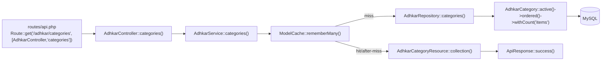
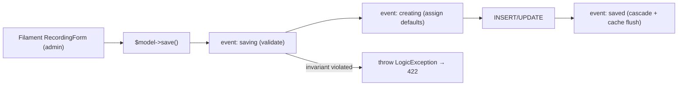

# 54. Annotated Walkthrough — The Read Path, Line by Line

> This chapter takes **one endpoint** — `GET /api/adhkar/categories` — and reads *every function it touches*, in execution order, as verbatim project code with line-level commentary, the data structure at each hop, and a function-connection map. This is the template; every read endpoint in the app is a variation of it.

## 54.1 The function-call chain



## 54.2 Step 1 — the route binds the URL to a controller action

```php
// routes/api.php
Route::middleware(['throttle:api'])->group(function () {
    Route::get('/adhkar/categories', [AdhkarController::class, 'categories']);
});
```

* **`Route::get($uri, [$class, $method])`** registers a GET route. The second argument is a *callable reference* — class + method name — that the router will resolve through the container (§36) when a request matches.
* **`->middleware(['throttle:api'])->group(...)`** wraps every route inside in the `throttle:api` rate-limit bucket. The middleware runs *before* the controller (§6).
* **Data structure:** the router compiles this into a `Route` object stored in a route collection (a hash map keyed by method+URI), so matching an incoming request is an O(1)-ish lookup, not a linear scan.

## 54.3 Step 2 — the controller action

```php
class AdhkarController extends Controller
{
    public function __construct(private AdhkarService $service) {}   // [A] dependency injected

    public function categories(): JsonResponse                       // [B] action
    {
        try {
            return $this->success(                                   // [D] envelope
                AdhkarCategoryResource::collection($this->service->categories())  // [C] delegate + transform
            );
        } catch (\Throwable $e) {
            return $this->error('Server error', 500);                // [E] uniform failure
        }
    }
}
```

* **[A] `private AdhkarService $service`** — constructor-promoted DI. The container built this `AdhkarService` (and its repository) before the action ran (§36). `private` means the dependency is encapsulated; nothing outside can reach it.
* **[B] `categories(): JsonResponse`** — the return type is enforced by PHP; the method *must* return a `JsonResponse` or error. No parameters here (this endpoint has no inputs).
* **[C] `$this->service->categories()`** — the controller does **no** logic; it delegates to the service and receives an `Eloquent\Collection<AdhkarCategory>`. `AdhkarCategoryResource::collection(...)` wraps that collection in a resource collection that knows how to serialize each item.
* **[D] `$this->success(...)`** — from the `ApiResponse` trait (inherited via the abstract `Controller`); wraps the data in `{success, message, data}`.
* **[E] `catch (\Throwable)`** — any failure anywhere downstream is caught and rendered as a uniform 500, so the client never sees a stack trace (§48).
* **Connection:** controller → service is the *only* downward call; the controller is a thin HTTP adapter.

## 54.4 Step 3 — the service (cache boundary)

```php
public function categories(): Collection
{
    return ModelCache::rememberMany(self::CACHE_CATEGORIES, 300, fn () => $this->repository->categories());
}
```

* **`ModelCache::rememberMany($key, $ttl, $resolver)`** (§53.2) — the cache boundary. The third argument `fn () => $this->repository->categories()` is a **closure capturing `$this`** so it can call the repository *lazily* — only if the cache misses.
* **`self::CACHE_CATEGORIES`** = `'adhkar.v1.categories'` — the constant also referenced by the model's invalidation (§53.6).
* **`300`** — TTL in seconds. After 300 s the next request re-runs the resolver.
* **Data structure returned:** an `Eloquent\Collection<AdhkarCategory>` whose models were either rehydrated from the cache snapshot or freshly queried.
* **Connection:** service → `ModelCache` → (on miss) → repository. The service owns *caching policy*; it knows nothing about SQL.

## 54.5 Step 4 — the repository (the only SQL author)

```php
class AdhkarRepository implements AdhkarRepositoryInterface
{
    public function categories(): Collection
    {
        return AdhkarCategory::active()->ordered()->withCount('items')->get();
    }
}
```

* **`AdhkarCategory::active()`** — invokes the model scope `scopeActive(Builder $q)` → appends `WHERE is_active = 1`. Calling `active()` statically starts a query builder.
* **`->ordered()`** — scope `scopeOrdered` → `ORDER BY display_order, id`.
* **`->withCount('items')`** — adds the correlated subquery `(SELECT COUNT(*) ...) AS items_count` (§35.9) without loading the items themselves.
* **`->get()`** — executes; returns `Eloquent\Collection<AdhkarCategory>`, each model carrying an `items_count` attribute.
* **Generated SQL:**
```sql
SELECT adhkar_categories.*,
  (SELECT COUNT(*) FROM adhkar_items WHERE adhkar_items.adhkar_category_id = adhkar_categories.id) AS items_count
FROM adhkar_categories WHERE is_active = 1 ORDER BY display_order, id;
```
* **Connection:** repository → model scopes → query builder → PDO → MySQL. The repository implements an *interface*, so the service depends on the abstraction, not this class (§15 DIP).

## 54.6 Step 5 — the model scopes (query fragments)

```php
class AdhkarCategory extends Model
{
    use HasTranslations;
    public array $translatable = ['name'];

    public function items(): HasMany { return $this->hasMany(AdhkarItem::class); }   // used by withCount

    public function scopeActive(Builder $query): Builder { return $query->where('is_active', true); }
    public function scopeOrdered(Builder $query): Builder { return $query->orderBy('display_order')->orderBy('id'); }

    public function iconUrl(): ?string { /* storage path → absolute URL */ }
}
```

* **`scopeActive` / `scopeOrdered`** — Laravel's *local scopes*: a method prefixed `scope` becomes a chainable query method with the prefix dropped (`active()`, `ordered()`). Each receives the `Builder` and returns it, so they compose. This is the **Builder pattern** (each call mutates and returns the same builder) and an application of **DRY** (the `is_active` filter is written once, reused by every repository method).
* **`items()`** — the `HasMany` relation `withCount('items')` counts; also the relation eager-loaded in the detail endpoint.
* **`iconUrl()`** — a model method the Resource will call; it is *preserved across the cache* precisely because `ModelCache` rehydrates real models (§53.1).

## 54.7 Step 6 — the Resource (model → JSON array)

```php
class AdhkarCategoryResource extends JsonResource
{
    public function toArray($request): array
    {
        return [
            'id'            => $this->id,
            'name'          => $this->getTranslations('name'),        // {"ar":..,"en":..}
            'slug'          => $this->slug,
            'icon'          => $this->iconUrl(),                      // model method (works post-rehydrate)
            'items_count'   => $this->whenCounted('items'),          // present only if withCount ran
            'sections'      => AdhkarSectionResource::collection($this->whenLoaded('sections')),
            'items'         => AdhkarItemResource::collection($this->whenLoaded('items')),
        ];
    }
}
```

* **`$this->...`** — inside a `JsonResource`, `$this` proxies to the wrapped model (via `__get`), so `$this->id` reads the model attribute.
* **`getTranslations('name')`** — returns the full `{ar,en}` map (§50); this only works because `$this` is a *real model*, not a cached array — the core justification for snapshot/rehydrate (§53.1).
* **`whenCounted('items')`** — emits the key *only if* `items_count` exists (it does, because the repository ran `withCount`). On endpoints that didn't count, the key is omitted — zero wasted bytes.
* **`whenLoaded('sections')`** — emits nested resources *only if* the relation was eager-loaded. For this list endpoint neither was loaded, so `sections`/`items` are omitted; the same resource serves the detail endpoint where they *are* loaded. One class, two payload shapes — driven by data, not `if`s (§11).
* **Output data structure:** a plain associative array, ready for `json_encode`.

## 54.8 Step 7 — the envelope and JSON encoding

```php
trait ApiResponse {
    protected function success(mixed $data, string $message = 'Success', int $status = 200): JsonResponse {
        return response()->json(['success' => true, 'message' => $message, 'data' => $data], $status);
    }
}
```

* **`response()->json($payload, $status)`** — serializes the array to a UTF-8 JSON byte string, sets `Content-Type: application/json` and the status code, and returns a `JsonResponse`. The Resource collection inside `$data` is recursively converted to arrays during encoding.
* **Final body:** `{"success":true,"message":"Success","data":[{"id":2,"name":{"ar":"...","en":"..."},"slug":"morning","items_count":30}, ...]}`.

This is the complete read path: **7 functions across 5 layers, each with one job, connected by single downward calls, with the cache transparently interposed at the service boundary.**

---

# 55. Annotated Walkthrough — The Write Path & Model Lifecycle

> Writes flow through Filament (the admin) into the model layer, where **lifecycle hooks** enforce the domain's hardest invariants. This chapter reads `Recording`'s `booted()` hooks line by line — the monetization rules (session numbering, single free session) live here, not in any controller.

## 55.1 Where writes happen, and the event timeline



## 55.2 `Recording::booted()` — the `saving` invariant

```php
protected static function booted(): void
{
    static::saving(function (self $r): void {
        if (! empty($r->subcategory_id)) {
            $sub = Subcategory::find($r->subcategory_id);
            if ($sub && $sub->diseases()->exists()) {
                throw new \LogicException('Cannot assign a recording directly to a subcategory that already has diseases.');
            }
        }
    });
```

* **`static::saving(Closure)`** — registers a listener fired *before every insert and update*, while the model is still mutable. Returning/throwing here can abort the write.
* **`function (self $r)`** — `$r` is the model being saved; `self` type-hints it as a `Recording`.
* **`! empty($r->subcategory_id)`** — guard: only check when the recording is being attached to a subcategory.
* **`$sub->diseases()->exists()`** — runs `SELECT EXISTS(SELECT 1 FROM diseases WHERE subcategory_id = ?)` — an O(1) existence check (§35.9). If the subcategory already holds diseases, attaching a recording directly to it would violate the taxonomy (a node is *either* a disease-container *or* a recording-container, never both).
* **`throw new \LogicException(...)`** — aborts the save; the renderable handler in `bootstrap/app.php` turns it into a **422** for the admin (§45.1, §48.2). This is **fail-fast**: an illegal state never reaches the database.

## 55.3 The `creating` hook — auto session numbering + free-session default

```php
    static::creating(function (Recording $recording) {
        if (! $recording->session_number) {
            $query = match (true) {
                (bool) $recording->category_id    => static::where('category_id', $recording->category_id),
                (bool) $recording->subcategory_id => static::where('subcategory_id', $recording->subcategory_id),
                default                           => static::where('disease_id', $recording->disease_id),
            };
            $recording->session_number = ($query->max('session_number') ?? 0) + 1;
        }

        if (! $recording->is_free) {
            $freeExists = match (true) {
                (bool) $recording->disease_id     => static::where('disease_id', $recording->disease_id)->where('is_free', true)->exists(),
                (bool) $recording->subcategory_id => static::where('subcategory_id', $recording->subcategory_id)->where('is_free', true)->exists(),
                (bool) $recording->category_id    => static::where('category_id', $recording->category_id)->where('is_free', true)->exists(),
                default                           => true,
            };
            if (! $freeExists) {
                $recording->is_free = true;       // first recording in its group is automatically free
            }
        }
    });
```

* **`creating`** fires only on inserts (not updates) — correct for assigning *initial* values.
* **`match (true)` selecting the scope** — picks which parent column scopes the "siblings" query, based on which parent this recording attaches to. This is **polymorphic behavior via data** (the parent type is chosen at runtime).
* **`$query->max('session_number') ?? 0) + 1`** — computes the next session number atomically from the current max (`SELECT MAX(session_number) ...`). The `?? 0` handles the first recording (no rows yet → max is null → start at 1).
* **The free-session rule** — if the admin didn't explicitly mark it free, check whether the group already has a free session; if not, *this* recording becomes free. Encodes "session 1 is free" (§ business rule) without the admin having to remember it.
* **Data structures:** each branch builds a `Builder`; `max()`/`exists()` execute aggregate/existence queries. No collections are loaded — only scalars cross the wire.

## 55.4 The `saved` hook — single-free-session cascade

```php
    static::saved(function (Recording $recording) {
        if (! $recording->is_free) return;

        $siblings = static::where('id', '!=', $recording->id)->where('is_free', true);
        if ($recording->disease_id)        $siblings->where('disease_id', $recording->disease_id);
        elseif ($recording->subcategory_id) $siblings->where('subcategory_id', $recording->subcategory_id);
        elseif ($recording->category_id)    $siblings->where('category_id', $recording->category_id);
        else return;

        $siblings->update(['is_free' => false]);   // enforce: exactly one free session per group
    });
}
```

* **`saved`** fires *after* the row is persisted (insert or update) — the right time to reconcile siblings, since this record's own state is now committed.
* **Guard `if (! $recording->is_free) return;`** — only act when *this* recording is the free one.
* **Build a sibling query** excluding self (`id != ?`), scoped to the same parent group, filtered to currently-free rows.
* **`$siblings->update(['is_free' => false])`** — a single bulk `UPDATE recordings SET is_free = 0 WHERE ...` demotes any previously-free sibling. This guarantees the invariant **exactly one free session per group**, even if an admin marks a second recording free — the newest wins, the old one is auto-demoted.
* **Why a mass `update()`** — it issues one SQL statement and **skips model events** (no recursive `saved` storm). The cache flush is handled separately by `InvalidatesCache` (§53.6) which `Recording` also uses.

## 55.5 The complete write-path connection map

```mermaid
sequenceDiagram
    autonumber
    participant A as Admin
    participant R as Recording model
    participant DB as MySQL
    participant Ca as Cache
    A->>R: save (is_free=true on session 3)
    R->>R: saving → validate subcategory invariant (LogicException if bad)
    R->>DB: creating → MAX(session_number)+1, decide default free
    R->>DB: INSERT
    R->>DB: saved → UPDATE siblings SET is_free=0
    R->>Ca: InvalidatesCache → forget recording-related keys
    Note over R,Ca: model is the domain authority; controllers/services never touch these rules
```

The lesson the write path teaches: **the model is the domain authority.** Validation, defaulting, and cross-row invariants live in lifecycle hooks so they hold no matter who writes (API, Filament, seeder, tinker) — the single most important reason these rules are in `booted()` and not in a controller.

---
