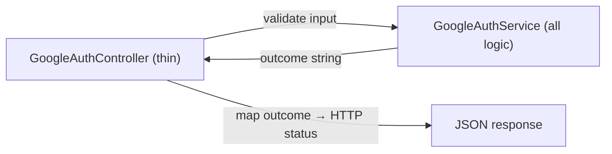
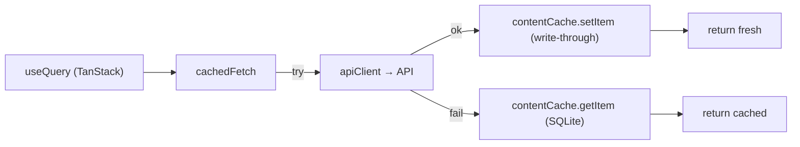

# 56. Annotated Walkthrough — Authentication (GoogleAuthService)

> Authentication is the most stateful, security-sensitive flow. The recent refactor extracted the logic into `GoogleAuthService` (a thin controller now just maps outcomes to HTTP). This chapter reads the service line by line: OTP issuance, the one-time session exchange, brute-force capping, and the soft-deleted-account purge.

## 56.1 Constants and the outcome protocol

```php
class GoogleAuthService
{
    private const OTP_TTL = 600;          // 10 min — pending verification window
    private const EXCHANGE_TTL = 300;     // 5 min — one-time session token life
    private const MAX_OTP_ATTEMPTS = 5;   // wrong-code lockout
    private const MAX_RESEND = 3;         // resend cap
```

* **Named constants** instead of magic numbers — each TTL/limit has one definition with a documenting name. Changing the OTP window is a one-line edit.
* **The "outcome" protocol** — every public method returns an array with an `'outcome'` string (`'success'`, `'verification_required'`, `'invalid_otp'`, `'too_many_attempts'`, `'session_expired'`, …). The controller switches on `outcome` to choose the HTTP status. This decouples *domain result* from *transport* — the service has no knowledge of HTTP status codes (Single Responsibility).

## 56.2 `resolveMobileProfile` — the branching identity resolver

```php
public function resolveMobileProfile(array $googleUser, string $accessToken): array
{
    $oauthProvider = OAuthProvider::where('provider', 'google')
        ->where('provider_user_id', $googleUser['sub'])->first();        // [1] known Google identity?

    if ($oauthProvider) {
        $user = $oauthProvider->user;
        if ($user) {
            $oauthProvider->update(['provider_token' => $accessToken]);   // [2] refresh token, log in
            return $this->successResult($user);
        }
        $oauthProvider->delete();                                         // [3] orphaned link → clean up
    }

    $existingUser = User::where('email', $googleUser['email'])->first();  // [4] same email, other method?
    if ($existingUser) {
        $existingUser->oauthProviders()->create([...]);                   // [5] link Google, log in
        return $this->successResult($existingUser);
    }

    $email = $googleUser['email'];                                        // [6] brand-new → OTP
    $this->issueOtp($email, [...]);
    return ['outcome' => 'verification_required', 'email' => $email];
}
```

* **[1]** Look up the OAuth identity by `(provider, provider_user_id)` — the unique pair (§3.2). `first()` returns the row or null.
* **[2]** *Returning user:* refresh the stored access token and return a `success` outcome (which mints a Sanctum token, §56.4). No OTP — they're already verified.
* **[3]** *Defensive:* an OAuth row whose user was hard-deleted is orphaned; delete it and fall through to treat them as new.
* **[4]–[5]** *Account linking:* a user who originally registered by email/password signs in with Google for the first time → link a new `oauthProviders` row and log in. This prevents duplicate accounts for one human.
* **[6]** *Genuinely new user:* issue an OTP and return `verification_required` — registration is deferred until the code is verified (so a typo'd email never creates a dead account).
* **Connection:** this one method is the decision tree for *every* Google sign-in; the three outcomes (instant login / link+login / OTP) map to the three real-world cases.

## 56.3 `verifyOtp` — brute-force cap + transactional registration + trashed-row purge

```php
public function verifyOtp(string $sessionToken, string $otp): array
{
    $email = Cache::get("otp_session:{$sessionToken}");
    if (! $email) return ['outcome' => 'session_expired'];               // [1] no pending session

    $attemptsKey = "otp_attempts:{$email}";
    if ((int) Cache::get($attemptsKey, 0) >= self::MAX_OTP_ATTEMPTS)
        return ['outcome' => 'too_many_attempts'];                       // [2] locked out

    $cached = Cache::get("otp:{$email}");
    if (! $cached || ! Hash::check($otp, $cached['otp'])) {              // [3] wrong/expired code
        $attempts = (int) Cache::get($attemptsKey, 0) + 1;
        Cache::put($attemptsKey, $attempts, self::OTP_TTL);
        return $attempts >= self::MAX_OTP_ATTEMPTS
            ? ['outcome' => 'too_many_attempts'] : ['outcome' => 'invalid_otp'];
    }

    try {
        $user = DB::transaction(function () use ($cached, $email) {      // [4] atomic registration
            User::onlyTrashed()->where('email', $email)->get()->each(function ($trashed) {
                $trashed->oauthProviders()->forceDelete();              // [5] purge soft-deleted twin
                $trashed->tokens()->delete();
                $trashed->forceDelete();
            });
            $user = User::create([... 'email_verified_at' => now() ...]);// [6] create verified user
            $user->oauthProviders()->create([...]);                     // [7] link Google
            $user->assignRole('user');                                  // [8] default role
            return $user;
        });
    } catch (\Exception $e) {
        Log::error('OTP registration failed', ['exception' => $e]);
        return ['outcome' => 'registration_failed'];
    }

    Cache::forget("otp:{$email}"); Cache::forget("otp_resend:{$email}");
    Cache::forget("otp_attempts:{$email}"); Cache::forget("otp_session:{$sessionToken}");  // [9] cleanup
    return $this->successResult($user->fresh());                        // [10] mint token
}
```

* **[1]** The `otp_session:{token}` cache maps the opaque session token → the email. No PII rides the deep link (§31). Expired/absent → `session_expired`.
* **[2]** Read the attempt counter; at the cap, refuse before even checking the code — **brute-force defense** (a 6-digit code has 10⁶ possibilities; 5 tries makes guessing hopeless).
* **[3]** `Hash::check($otp, $cached['otp'])` — the stored OTP is **bcrypt-hashed** (§39.7), compared in constant time. On failure, increment the counter (TTL-bounded) and return `invalid_otp` (or `too_many_attempts` if the increment hit the cap).
* **[4]** `DB::transaction(fn)` — the whole registration is **atomic**: if any step throws, the user, oauth link, and role assignment all roll back together (ACID).
* **[5]** *The subtle bug-fix:* a soft-deleted account with this email still occupies the unique `email` index. Without purging it, `User::create` at [6] throws a duplicate-key error that surfaces as a misleading "wrong code." `onlyTrashed()` finds trashed rows; `forceDelete()` truly removes them (and their tokens/oauth links) first.
* **[6]–[8]** Create the user with `email_verified_at = now()` (OTP *is* the verification), link the Google identity, assign the default `user` role (spatie).
* **[9]** Forget all four ephemeral cache keys — the flow is single-use.
* **[10]** `successResult($user->fresh())` re-reads the user (so it includes the role) and mints a Sanctum token.

## 56.4 `successResult` and the one-time exchange

```php
private function successResult(User $user): array
{
    return ['outcome' => 'success', 'user' => $user,
            'token' => $user->createToken('mobile-app')->plainTextToken];
}

public function exchangeSession(string $sessionToken): ?array
{
    $key = "auth_exchange:{$sessionToken}";
    $result = Cache::get($key);
    if (! $result) return null;        // expired or already claimed
    Cache::forget($key);               // ← single-use: forget on read
    return $result;
}
```

* **`createToken('mobile-app')->plainTextToken`** — Sanctum generates a random token, stores its **SHA-256 hash** in `personal_access_tokens`, and returns the plaintext **once**. Only the client ever sees it (§31).
* **`exchangeSession`** — the returning-user web flow stashes the result under `auth_exchange:{token}` (TTL 300 s); the app POSTs the token once and `Cache::forget` makes it **single-use** — a replayed token returns `null` (410 at the controller). This keeps the long-lived bearer token off the deep-link URL entirely.

## 56.5 Why a service, and the controller's residual job



The controller now only: validates request shape, calls one service method, and `match`es the returned `outcome` to a status (`success`→200/201, `invalid_otp`→422, `too_many_attempts`→429, `session_expired`→410). All identity logic, caching, transactions, and security live in the testable service — the cleanest possible separation for the riskiest flow.

---

# 57. Annotated Walkthrough — Mobile Networking & Offline Cache

> The client's reliability rests on two files: `apiClient.ts` (the axios layer with auth, environment fallback, and error normalization) and `contentCache.ts` (the SQLite offline tier). This chapter reads both line by line.

## 57.1 The typed error class

```ts
export class ApiError extends Error {
  status: number;
  isNetworkError: boolean;
  isSubscriptionRequired: boolean;
  fieldErrors: Record<string, string[]> | null;

  constructor(message: string, status: number,
    opts?: { network?: boolean; subscription?: boolean; fieldErrors?: Record<string, string[]> | null }) {
    super(message);
    this.name = 'ApiError';
    this.status = status;
    this.isNetworkError = opts?.network ?? false;
    this.isSubscriptionRequired = opts?.subscription ?? false;
    this.fieldErrors = opts?.fieldErrors ?? null;
  }
}
```

* **`extends Error`** — inheritance: `ApiError` *is an* `Error`, so it works with `try/catch`, but adds typed fields (`status`, `isSubscriptionRequired`, …). This is the **OOP "extend a base type with domain data"** pattern in TypeScript.
* **`super(message)`** — calls the parent `Error` constructor to set the message and stack.
* **`opts?.network ?? false`** — optional-chaining + nullish-coalescing: default each flag to false/null when not provided. The constructor *normalizes* an open-ended options bag into definite fields.
* **Why a custom error** — every layer above can branch on `err.isSubscriptionRequired` (→ open the subscription sheet) or `err.isNetworkError` (→ serve cache) without string-matching messages.

## 57.2 The request interceptor — auth + environment

```ts
apiClient.interceptors.request.use(async (config) => {
  if (!(config as RetryableConfig)._localFallbackAttempted) {
    config.baseURL = api.API_URL;                              // [1] choose base URL at call time
    if (__DEV__ && config.baseURL === api.LOCAL_API_URL) {
      config.timeout = 5000;                                   // [2] fail fast on local
    }
  }
  const token = await TokenManager.getToken();                 // [3] read secure-stored token
  if (token) config.headers.Authorization = `Bearer ${token}`;// [4] attach bearer
  return config;
});
```

* **[1]** The base URL is resolved **per request** from `api.API_URL` (local in dev, production otherwise) — never hardcoded. The `_localFallbackAttempted` guard skips this on a retry so the fallback URL set by the response interceptor isn't overwritten.
* **[2]** In dev against local, a short 5 s timeout makes a dead local server fail quickly so the production fallback kicks in fast (instead of the full 20 s).
* **[3]** `await TokenManager.getToken()` — reads the token from `expo-secure-store` (OS keystore), an async I/O — hence the interceptor is `async`.
* **[4]** Attach `Authorization: Bearer <token>` when present. Anonymous requests simply omit it (public endpoints allow that).
* **Connection:** every request, regardless of which service issued it, passes through this one interceptor — a single choke point for auth and environment.

## 57.3 The response interceptor — the fallback ladder + error mapping

```ts
apiClient.interceptors.response.use(
  (response) => response,                                      // pass success through untouched
  (error: AxiosError<ApiEnvelope<unknown>>) => {
    const config = error.config as RetryableConfig | undefined;

    if (config && !config._localFallbackAttempted &&
        config.baseURL === api.LOCAL_API_URL &&
        (!error.response || error.response.status === 404)) {  // [1] local miss → retry prod
      config._localFallbackAttempted = true;
      config.baseURL = api.PRODUCTION_API_URL;
      return apiClient.request(config);
    }

    if (!error.response) {                                      // [2] no response = offline
      return Promise.reject(new ApiError('No internet connection', 0, { network: true }));
    }

    const { status, data } = error.response;
    const message = data?.message ?? error.message ?? 'Request failed';

    if (status === 401) { onUnauthorized?.(); return Promise.reject(new ApiError('Session expired', 401)); }  // [3]
    if (status === 403) return Promise.reject(new ApiError(message, 403, { subscription: true }));            // [4]
    return Promise.reject(new ApiError(message, status, { fieldErrors: data?.errors ?? null }));              // [5]
  },
);
```

* **[1]** *The local→production fallback:* only for a network error or 404 against local, retry **once** against production (the `_localFallbackAttempted` flag prevents loops). Crucially excludes 401/403/422 — those are real failures, not "wrong server" (§48.3).
* **[2]** No `error.response` means the request never reached a server → `ApiError(network:true)`. Hooks catch this and serve the SQLite copy (§57.4).
* **[3]** 401 → call the registered `onUnauthorized` handler (wired in `store.ts` to dispatch `clearAuth`, §23) → app-wide logout from one place, with no circular import.
* **[4]** 403 → `subscription:true`, so the UI opens the `SubscriptionSheet`.
* **[5]** Everything else → carry the server's `errors` map (validation field errors) for forms.
* **Data structure:** every rejection is a normalized `ApiError`; no caller ever inspects a raw axios error.

## 57.4 `contentCache` — the SQLite offline tier, line by line

```ts
let dbPromise: Promise<SQLite.SQLiteDatabase> | null = null;

function getDb(): Promise<SQLite.SQLiteDatabase> {
  if (!dbPromise) {                                            // [1] lazy singleton
    dbPromise = SQLite.openDatabaseAsync('content_cache_v1.db').then(async (db) => {
      await db.execAsync('CREATE TABLE IF NOT EXISTS kv (key TEXT PRIMARY KEY NOT NULL, value TEXT NOT NULL);');
      return db;
    });
  }
  return dbPromise;
}

async function setItem<T>(key: string, value: T): Promise<void> {
  try {
    const db = await getDb();
    await db.runAsync('INSERT OR REPLACE INTO kv (key, value) VALUES (?, ?)', key, JSON.stringify(value)); // [2]
  } catch { /* cache writes are non-fatal */ }                 // [3]
}

async function getItem<T>(key: string): Promise<T | null> {
  try {
    const db = await getDb();
    const row = await db.getFirstAsync<{ value: string }>('SELECT value FROM kv WHERE key = ?', key);
    return row ? (JSON.parse(row.value) as T) : null;          // [4]
  } catch { return null; }
}
```

* **[1] Lazy singleton** — `dbPromise` is created once and reused; concurrent callers all `await` the same promise (no double-open). The table is created idempotently (`IF NOT EXISTS`). `key TEXT PRIMARY KEY` gives an O(log n) B-tree lookup (§39.1).
* **[2]** `INSERT OR REPLACE` — upsert: write or overwrite the value (JSON-serialized) for a key. Parameterized (`?`) — no injection.
* **[3]** Write failures are **swallowed** — a full disk must never break a read (resilience, §48.4).
* **[4]** Read parses the JSON back to the typed value, or returns null on miss.

## 57.5 `cachedFetch` — the three-tier read, tying it together

```ts
export async function cachedFetch<T>(cacheKey: string, fetcher: () => Promise<T>): Promise<T> {
  try {
    const data = await fetcher();             // [1] network (via apiClient)
    void contentCache.setItem(cacheKey, data);// [2] write-through (fire & forget)
    return data;
  } catch (error) {
    const cached = await contentCache.getItem<T>(cacheKey);  // [3] fall back to SQLite
    if (cached !== null) return cached;
    throw error;                              // [4] truly nothing → propagate
  }
}
```

* **[1]** Try the network first (`fetcher` is the service call that goes through `apiClient`).
* **[2]** On success, write through to SQLite — `void` discards the promise (don't await; the fresh data is already returned). Best-effort persistence.
* **[3]** On *any* failure (offline `ApiError`, timeout), return the last persisted copy — the UI shows data instead of an error.
* **[4]** Only if there's no cached copy either does the error propagate to the hook (which shows an empty/error state).
* **Connection:** this is the `queryFn` of every content hook (§24). Combined with TanStack's in-memory cache, it forms the three tiers: **memory → SQLite → network**, read in that order, written in reverse.



---
