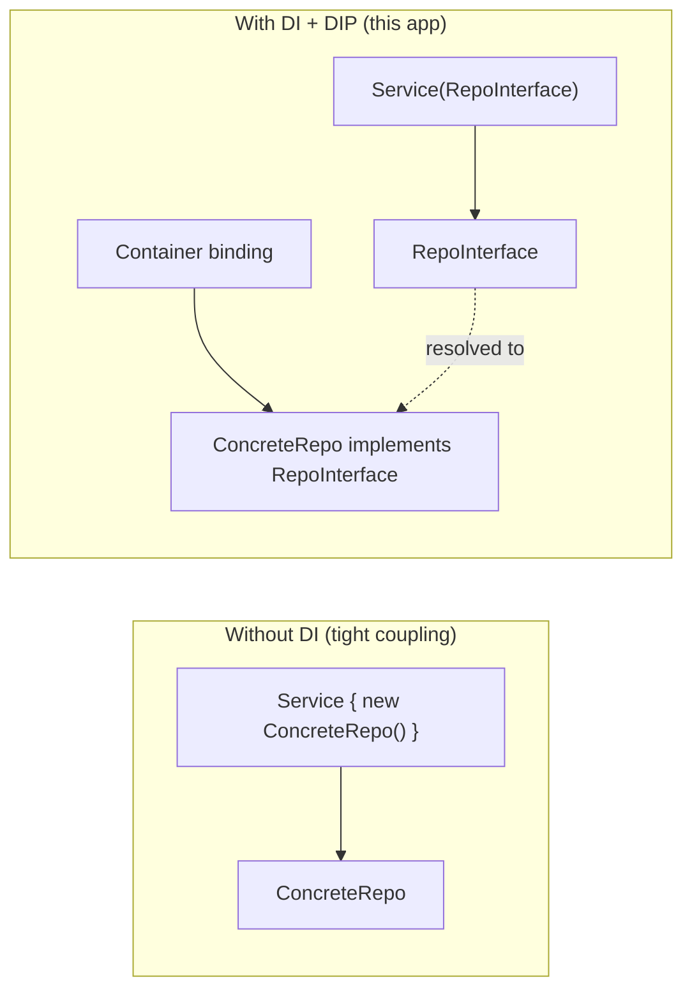
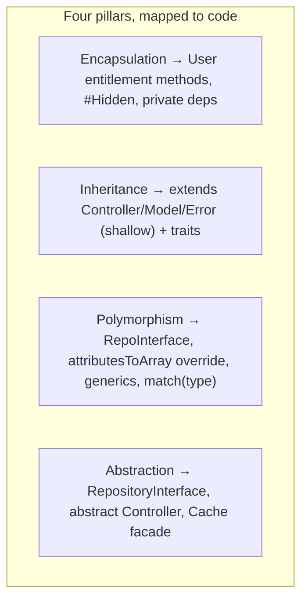
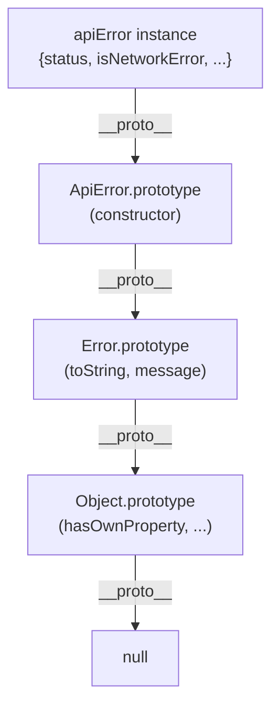
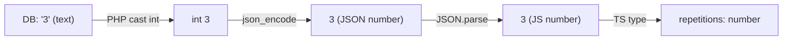

# 59. Principles Reference — Constructors & Object Construction

> The remaining chapters are a **principles reference**: each foundational programming concept is defined formally, then shown *as it actually appears in this codebase*. They turn the dossier into a teaching text — read a principle, then see it working in real code.

## 59.1 What a constructor is

A **constructor** is the special method invoked when an object is instantiated; its job is to bring the object into a valid initial state by assigning its fields (and, ideally, nothing else with side effects). An object should be *usable the instant its constructor returns*.

**PHP (this codebase) — constructor promotion:**
```php
class AdhkarService {
    public function __construct(private AdhkarRepositoryInterface $repository) {}
}
```
* `__construct` is PHP's constructor. The `private AdhkarRepositoryInterface $repository` parameter uses **constructor property promotion** (PHP 8): it simultaneously *declares* a private property and *assigns* the argument to it. Equivalent longhand:
```php
private AdhkarRepositoryInterface $repository;
public function __construct(AdhkarRepositoryInterface $repository) { $this->repository = $repository; }
```
* The promoted property is set **once** and never reassigned — effectively immutable, which is why these objects are safe to share within a request. The constructor does *no work* beyond wiring the dependency; the object is immediately ready.

**JavaScript/TypeScript — class constructor & the custom error:**
```ts
export class ApiError extends Error {
  status: number;
  constructor(message: string, status: number, opts?: {...}) {
    super(message);        // MUST call the parent constructor first
    this.status = status;  // then initialize own fields
  }
}
```
* `super(message)` invokes the parent (`Error`) constructor; in a subclass you **must** call `super()` before touching `this`. Then the subclass initializes its own fields. This is the JS analogue of PHP's constructor, with explicit parent chaining.

**React "construction"** — a function component has no constructor; instead its first render plays that role, and `useState`/`useRef` initializers run once to establish initial state. `useMemo`/`useCallback` then stabilize values across subsequent renders.

## 59.2 Who calls the constructor — manual vs. container

* **Manual:** `new AdhkarRepository()` — you call the constructor directly. Used for value objects, models (`new $snapshot['class']` in `ModelCache::rehydrate`, §53.4), and Eloquent's hydrator.
* **Container-driven (this app's services):** you *never* write `new AdhkarController(new AdhkarService(new AdhkarRepository()))`. The service container reads constructor signatures via reflection and supplies the arguments (§36). The constructor is still the contract; the container is the caller.

## 59.3 Construction as an invariant boundary

The best constructors guarantee invariants. Here, the *model* constructor is intentionally thin (Eloquent needs a no-arg construction path), so invariants are enforced in **lifecycle hooks** instead (§55) — a deliberate trade: Active Record models can't put all invariants in `__construct` because the ORM constructs them empty and fills them later. Plain service/value classes *do* put their invariants in the constructor (a service is invalid without its repository, so the type-hinted parameter makes that impossible to violate).

---

# 60. Principles Reference — Dependency Injection & Inversion of Control

## 60.1 The principle

**Inversion of Control (IoC):** a component does not create its own dependencies; something external supplies them. **Dependency Injection (DI)** is the most common form of IoC — dependencies are *injected* (via constructor, setter, or method) rather than instantiated internally. The **Dependency Inversion Principle (DIP)**, the "D" in SOLID, adds: *depend on abstractions, not concretions* — high-level modules and low-level modules should both depend on an interface.



## 60.2 As embodied here

```php
// High-level module depends on an ABSTRACTION:
class AdhkarService {
    public function __construct(private AdhkarRepositoryInterface $repository) {}
}
// The concretion is wired ONCE, separately:
$this->app->bind(AdhkarRepositoryInterface::class, AdhkarRepository::class);  // RepositoryServiceProvider
```

* `AdhkarService` cannot name `AdhkarRepository` — it only knows the interface. The binding in `RepositoryServiceProvider` (§9) is the *only* place the concrete is chosen.
* **Benefits realized in this codebase:** (1) *Testability* — a unit test injects a fake repo implementing the interface; (2) *Swappability* — switching to a cached/remote/search-backed repository is a one-line binding change; (3) *Clarity* — a class's constructor signature *is* its dependency manifest.
* **Three injection sites here:** constructor injection (services/controllers/repos), method injection (a controller action typing `Request $request`, §36.4), and the container resolving the whole graph (§36.2).

## 60.3 Why constructor injection specifically

Constructor injection makes dependencies **required and immutable** (you cannot construct the object without them, and they never change), versus setter injection (optional, mutable) or service-location (`app()->make()`, hidden and untestable). The whole backend uses constructor injection uniformly — the single design choice that makes DIP physically real (§5.3, §15).

---

# 61. Principles Reference — The Four Pillars of OOP

## 61.1 Encapsulation

**Definition:** bundle data with the methods that operate on it, and hide internal state behind a controlled interface, so invariants can't be violated from outside.

**In this codebase:**
* `User` never exposes a raw "is this user allowed premium?" flag; it exposes **behavior**: `isSubscribed()`, `hasActiveTrial()`, `canGrantTrial()`, `grantTrial()`. Callers ask the object, they don't compute from its fields.
```php
public function isSubscribed(): bool {
    if ($this->is_subscribed) return true;
    return $this->subscription_expires_at !== null && $this->subscription_expires_at->isFuture();
}
```
* `#[Hidden(['password','remember_token'])]` and `$fillable` whitelists are encapsulation enforced by the framework: secret fields never escape serialization; only whitelisted fields are mass-assignable.
* `private AdhkarService $service` — the dependency is private; nothing reaches inside the controller to touch it.

## 61.2 Inheritance

**Definition:** a subclass derives fields/behavior from a base class, modeling an "is-a" relationship and enabling reuse.

**In this codebase (kept deliberately shallow, depth ≤ 2):**
* `class AdhkarController extends Controller` — inherits `ApiResponse` helpers (`success`/`error`).
* `class AdhkarItem extends Model` — inherits all Eloquent machinery.
* `class User extends Authenticatable` — inherits auth scaffolding.
* `class ApiError extends Error` (TS) — inherits error semantics, adds typed fields.

> The codebase prefers **composition over inheritance**: behavior is shared via *traits* (`HasTranslations`, `InvalidatesCache`, `ApiResponse`) and *injected services*, not deep class trees. Traits are "horizontal" reuse (mix capabilities into unrelated classes) where inheritance would force an artificial hierarchy.

## 61.3 Polymorphism

**Definition:** one interface, many implementations; the caller invokes a method without knowing the concrete type. Forms: subtype polymorphism (interfaces/overriding), parametric polymorphism (generics), ad-hoc (overloading).

**In this codebase:**
* **Subtype** — `AdhkarService` calls `$this->repository->categories()`; at runtime `$repository` is an `AdhkarRepository`, but the service only knows `AdhkarRepositoryInterface`. Any conforming implementation is substitutable (Liskov, §15).
* **Method overriding** — `HasTranslations::attributesToArray()` overrides `Model::attributesToArray()` to emit full translation maps (§50).
* **Parametric (generics)** — `ModelCache::rememberMany()` works for *any* model; `cachedFetch<T>` and `apiGet<T>` (TS generics) work for any payload type.
* **Runtime type dispatch** — `ModelCache::snapshot()`'s `match (true)` on the relation's runtime type, and `Recording`'s `match (true)` choosing a parent scope — behavior selected by type/data at runtime.

## 61.4 Abstraction

**Definition:** expose *what* a component does, hide *how*. Achieved with interfaces, abstract classes, and well-named methods.

**In this codebase:**
* **Interfaces** — the 15 `*RepositoryInterface` contracts define "what data operations exist" without any SQL.
* **Abstract class** — `abstract class Controller` defines the shared response surface; it's never instantiated directly.
* **Abstract trait method** — `InvalidatesCache::cacheKeysToForget()` is `abstract` — the trait specifies *that* keys exist without knowing *which* (the model supplies them).
* **Facades** — `Cache::remember(...)` abstracts away whether the store is Redis, file, or database (§53.7).



---

# 62. Principles Reference — Prototypes & the JavaScript Object Model

## 62.1 The principle

JavaScript is **prototype-based**: every object has a hidden link (`[[Prototype]]`, exposed as `__proto__`) to another object. Property lookups that miss on an object walk up this **prototype chain** until found or `null`. `class` syntax (ES6) is *syntactic sugar* over this — a class's methods live on `Class.prototype`, and instances delegate to it. This differs fundamentally from PHP's **class-based** model (where classes are distinct entities and there is no per-object prototype link).



## 62.2 As embodied here

* **`class ApiError extends Error`** — at runtime, `ApiError.prototype.__proto__ === Error.prototype`. Calling `err.message` finds `message` on the instance; calling a missing method walks to `Error.prototype` then `Object.prototype`. `extends` sets up this chain; `super(message)` runs `Error`'s constructor against the new instance.
* **Hermes hidden classes vs. prototypes** — the prototype chain governs *method resolution*; Hermes "hidden classes" (§38.4) optimize *property storage/access*. Both exist simultaneously: prototype for behavior lookup, hidden class for fast field access.
* **React function components** are plain functions (not prototype-based objects); they rely on **closures** over hooks rather than prototype methods. So the app mixes paradigms deliberately: classes (with prototypes) for errors/models, closures for components/hooks.
* **TypeScript adds compile-time types** over this runtime model — interfaces and generics are erased at runtime (the prototype chain is all that remains), so TS is *structural typing on top of prototype-based objects*.

## 62.3 PHP vs JS object models — the contrast a full-stack engineer must hold

| Aspect | PHP (backend) | JavaScript/TS (mobile) |
|--------|---------------|------------------------|
| Model | class-based | prototype-based (class = sugar) |
| Method lookup | class method table | prototype chain walk |
| Inheritance | `extends` (single), traits (horizontal) | `extends` (prototype link), mixins |
| Typing | gradual, runtime-checked + type hints | structural, compile-time (TS), erased at runtime |
| Construction | `__construct` (+ promotion) | `constructor` + `super()` |
| "Interfaces" | first-class (`implements`) | TS `interface` (compile-time only) |

Understanding both models is why the same engineer can write `AdhkarRepository implements AdhkarRepositoryInterface` (PHP, real runtime interface) and `cachedFetch<T>` (TS generic, erased at runtime) and reason correctly about each.

---

# 63. Principles Reference — Data Types & Type Systems

## 63.1 Type-system axes

* **Static vs dynamic:** types checked at compile time (TypeScript) vs runtime (PHP/JS).
* **Strong vs weak:** how much implicit coercion is allowed.
* **Nominal vs structural:** types matched by name (PHP classes/interfaces) vs by shape (TypeScript).

This project spans all of these: **PHP** is gradually-typed (type hints checked at runtime, nominal), **TypeScript** is statically-typed (structural, erased at runtime), and the wire format is **JSON** (untyped text that both sides re-type).

## 63.2 Types as they appear here

**PHP type hints + return types (enforced at runtime):**
```php
public function categories(): Collection { ... }                 // return type
public function __construct(private AdhkarRepositoryInterface $repository) {}  // param type (nominal)
public function findById(int $id): ?Recording { ... }            // nullable type (?Recording)
```
* `?Recording` is a **nullable type** — "a Recording or null," forcing callers to handle the not-found case.
* Eloquent **casts** convert raw DB strings to typed PHP values:
```php
protected function casts(): array {
    return ['repetitions' => 'integer', 'is_free' => 'boolean', 'segments' => 'array', 'price' => 'decimal:2'];
}
```
A DB `"3"` becomes `int 3`; `"1"` becomes `true`; a JSON column becomes a PHP `array`. Casts are a *type-coercion layer* between the stringly-typed database and the typed domain (§38.2).

**TypeScript structural types:**
```ts
type Translatable = { ar: string; en: string };          // the i18n type — used everywhere
interface PlayerState { isPlaying: boolean; queue: Recording[]; queueIndex: number; ... }
export async function apiGet<T>(url: string): Promise<T>  // generic: T is the payload type
```
* `Translatable` is **structural** — any object with `{ar, en}` strings *is* a `Translatable`, no explicit `implements` needed. The bilingual rule (§50) types every translatable field as this, never as `string`.
* `Promise<T>` / `apiGet<T>` — **parametric polymorphism**: one function, any return type, type-safe at the call site.
* Union types (`'stream' | 'local'`, `'ar' | 'en'`) constrain a value to a fixed set — the compiler rejects anything else.

## 63.3 The type boundary at the wire

JSON has only strings, numbers, booleans, null, arrays, objects. So types are **lost and re-established** at each crossing:
1. DB (all text) → **casts** → typed PHP.
2. PHP → `json_encode` → JSON text (types flattened).
3. JSON → `JSON.parse` → JS values → **re-typed** by the service's declared `<T>` and the `Translatable`/`Recording` interfaces.

A bug class this prevents: because `repetitions` is cast to `integer` server-side, the JSON carries `3` (number) not `"3"` (string), and the TS type `number` matches — no client-side `parseInt` needed. The cast and the TS type are two ends of one contract.



---
