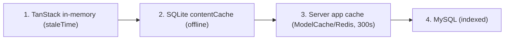
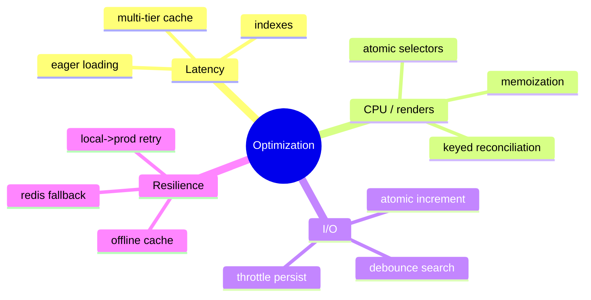

# 64. Principles Reference — Relations & Relational Database Modeling

## 64.1 The relational model

A **relational database** stores data as *relations* (tables) of *tuples* (rows) with named *attributes* (columns). Its foundations:
* **Keys** — a **primary key** uniquely identifies a row; a **foreign key** references another table's primary key, expressing a relationship; a **unique constraint** forbids duplicate values/combinations.
* **Integrity** — *entity integrity* (no null primary keys), *referential integrity* (every FK points to a real row, or null), enforced here by `cascadeOnDelete`/`nullOnDelete` (§3).
* **ACID transactions** — Atomicity, Consistency, Isolation, Durability; used by every multi-write service via `DB::transaction` (§56.3, §48.2).

## 64.2 Normalization — and where this schema sits

**Normalization** removes redundancy and update anomalies by decomposing tables according to functional dependencies:

| Form | Rule | In this schema |
|------|------|----------------|
| **1NF** | atomic columns, no repeating groups | mostly — *except* deliberate JSON i18n columns (see below) |
| **2NF** | 1NF + no partial dependency on part of a composite key | satisfied — surrogate `id` PKs avoid composite-key partial deps |
| **3NF** | 2NF + no transitive dependency (non-key → non-key) | satisfied — e.g. a recording's disease *name* lives in `diseases`, not duplicated on `recordings` |
| **BCNF** | every determinant is a candidate key | effectively satisfied for the domain tables |

* **The deliberate 1NF exception — JSON i18n.** `name = {"ar":..,"en":..}` is technically a non-atomic column. This is a *pragmatic denormalization*: the alternative (a `translations` table with `(model, field, locale, value)`) is fully normalized but turns every read into a join and every model into N rows. The JSON column trades strict 1NF for read simplicity and atomic-per-row i18n (§50) — a justified, common modern choice with MySQL JSON support.
* **The associative entity.** `recitations(reciter_id, surah_id, audio_path, ...)` with `unique(reciter_id, surah_id)` is the textbook resolution of a many-to-many into a first-class table that also carries attributes (§3.3).
* **The pivot.** `favorites(user_id, disease_id)` with `unique(user_id, disease_id)` is a pure junction table (no extra attributes beyond timestamps) — the normalized form of a many-to-many.

## 64.3 The relationship kinds, formally + in code

| Cardinality | Relational mechanism | Eloquent | Example |
|-------------|----------------------|----------|---------|
| 1:1 | FK with a unique constraint on the child | `hasOne`/`belongsTo` | `User` ⟷ `NotificationPreference` (`user_id` unique) |
| 1:N | FK on the "many" side | `hasMany`/`belongsTo` | `Surah` → `Verses` |
| M:N (pure) | junction table, composite unique | `belongsToMany` | `User` ⟷ `Disease` via `favorites` |
| M:N (with data) | associative entity | two `belongsTo` on the bridge | `Reciter` ⟷ `Surah` via `Recitation` |
| Optional parent | nullable FK | nullable `belongsTo` | `Recording` → disease/category/subcategory |

```php
// 1:N declared (model side) → relational FK (DB side)
public function verses(): HasMany { return $this->hasMany(Verse::class); }   // Surah
// generates, when eager-loaded:
//   SELECT * FROM verses WHERE surah_id IN (?) ORDER BY verse_number
```

## 64.4 Indexes — the performance contract

An **index** is a B+ tree (§39.1) that turns an O(n) scan into an O(log n) lookup, at the cost of write overhead and storage. This schema indexes exactly the access paths it uses:
* `unique(slug)` on content tables — slug lookups are the URL access path.
* composite `(surah_id, verse_number)` on `verses` — the "ayah N of surah S" + ordered-pagination path.
* composite `(disease_id, session_number)` on `recordings` — "ordered sessions for this node."
* `(user_id, read_at)` on `push_notifications` — the unread-count badge.

The principle: **index the columns you filter/sort/join on, in the order you use them; don't index what you never query.** Every index here maps to a real query in §46.

---

# 65. Principles Reference — Web Engineering & API Design

## 65.1 Client–server, statelessness, layered system

The app is a **client–server** system with a **stateless** API: each request carries everything needed to process it (the bearer token), and the server keeps no per-client session in memory. Statelessness is what lets the API scale horizontally (any worker can handle any request) and is why auth is a **token in a header**, not a server session, for the mobile client.

It is also a **layered system** (a REST constraint): the client talks to Nginx, which talks to PHP-FPM, which talks to MySQL/Redis — each layer is replaceable without the client knowing (§49).

## 65.2 REST constraints, mapped to this API

| REST constraint | In this API |
|-----------------|-------------|
| Resource-oriented URIs | `/surahs`, `/diseases/{slug}`, `/adhkar/categories` |
| HTTP verbs as semantics | GET (read), POST (create/action), PUT (update), DELETE (remove) |
| Stateless | Sanctum bearer token per request; no session |
| Uniform interface | one envelope `{success, message, data, meta?, errors?}` (§12) |
| Cacheable | server cache (§53) + client cache (§24); reads are safe/cacheable |
| Layered | Nginx → FPM → DB/Redis |

## 65.3 HTTP method semantics & idempotency

* **Safe methods** (GET) — no side effects; freely cacheable and retryable. All the content reads.
* **Idempotent methods** (GET, PUT, DELETE) — applying once or N times yields the same state. `PUT /me` (profile update) and `DELETE /account` are idempotent. `POST /favorites/toggle` is *server-idempotent per resulting state* (toggling is deterministic from current state) and the client makes it safe with optimistic updates + reconciliation (§2.5).
* **Non-idempotent** (POST create) — `POST /register`, `POST /feedback` create new rows; retrying creates duplicates, which is why the client must not blindly retry them (the apiClient fallback explicitly excludes non-network errors, §57.3).

## 65.4 Status codes as a contract

The status code *is* the API's machine-readable result (§12.3, §48.1): 200/201 success, 401 unauthenticated, 403 not entitled (→ subscription sheet), 404 not found, 409 duplicate, 422 validation (with `errors`), 429 rate-limited, 410 expired one-time token, 500 server error. The client's `ApiError` mirrors these into typed branches (§57.1) so UI behavior is driven by status, not message text.

## 65.5 The caching layers of web architecture

A request can be satisfied at several layers, fastest first — the app deliberately uses four:

Each layer absorbs load from the one below: in-memory serves repeat navigations, SQLite serves offline, the server cache collapses N polling clients into ~1 DB read per TTL, and indexes make the eventual DB hit O(log n). This is **caching as a layered optimization**, the dominant performance principle of the system (§30).

---

# 66. Principles Reference — Data Structures Catalog

> Every non-trivial data structure the system relies on, defined and located in the real code, with its operations' complexity.

| Structure | Definition | Where in this project | Key ops (complexity) |
|-----------|-----------|------------------------|----------------------|
| **Dynamic array / list** | contiguous, index-addressable sequence | PHP arrays, JS arrays, `queue: Recording[]`, verse pages | index O(1), push O(1) amortized, search O(n) |
| **Hash map / dictionary** | key→value via hashing | PHP `HashTable` (every array, §38.1), JS objects, cache stores, eager-load dictionary (§39.3), TanStack `Map` | get/put O(1) avg |
| **Ordered map** | hash map preserving insertion order | PHP arrays specifically (ordered HashTable) — SQL bindings, translation maps | as hash map + ordered iteration |
| **B+ tree** | balanced multi-way search tree | every DB index; SQLite `kv` PRIMARY KEY | search/insert O(log n) |
| **Tree (n-ary)** | nodes with children | the eager-loaded model graph (category→sections→items), the `ModelCache` snapshot, the React Fiber tree | traversal O(n) |
| **Stack (LIFO)** | push/pop one end | the call stack (DI resolution recursion §36, snapshot/rehydrate recursion §53) | push/pop O(1) |
| **Queue (FIFO)** | enqueue/dequeue opposite ends | Laravel job queue (`CompressAudioJob`), the download task set | enqueue/dequeue O(1) |
| **Linked structure** | nodes linked by reference | the JS prototype chain (§62), Eloquent relation graph | traversal O(depth) |
| **Set (unique)** | membership without duplicates | unique DB constraints; `recordingId in completed` membership test | contains O(1) avg |
| **Immutable tree w/ structural sharing** | persistent data structure | the Redux state tree via Immer (§38.5) | update O(changed path) |

**Worked: why the eager-load dictionary is the structure that matters most.** Attaching N children to P parents naïvely is O(P·N) (scan all children per parent) or O(P) queries (N+1). Building a `parent_id → [children]` **hash map** once, then doing P O(1) lookups, makes it **O(P+N)** with a single child query (§39.3). The choice of *hash map* over *repeated scan* is the difference between a snappy and a sluggish nested endpoint.

---

# 67. Principles Reference — Algorithms & Optimization

## 67.1 Complexity classes (the vocabulary)

Big-O describes growth as input n→∞: **O(1)** constant, **O(log n)** logarithmic (halving — B-tree, binary search), **O(n)** linear (one pass), **O(n log n)** linearithmic (good sorts), **O(n²)** quadratic (nested loops — avoid at scale), **O(2ⁿ)** exponential (intentional only, e.g. bcrypt work factor §39.7). Space complexity is analyzed the same way.

## 67.2 The algorithms in this system (recap with rationale)

| Algorithm | Where | Time | Why optimal here |
|-----------|-------|------|------------------|
| B+ tree descent | every indexed lookup | O(log n) | the data is large; logarithmic is the right tool |
| Hash lookup | cache get/set, eager-load match | O(1) avg | constant-time joins of result sets |
| Eager-load dictionary match | every nested read | O(P+N) | linear, eliminates N+1 |
| Recursive snapshot/rehydrate | `ModelCache` | O(nodes) | each node visited once |
| Fisher–Yates | adhkar shuffle | O(k) | unbiased, in-place |
| Linear→binary segment scan | karaoke | O(s)→O(log s) | tiny s now; binary-ready |
| Leading-wildcard LIKE | verse/disease search | O(n·m) | acceptable on a fixed tiny corpus + cached |
| bcrypt | password hash | O(2^cost) | slowness *is* the security feature |
| keyed reconciliation | React updates | O(n) | the diffing heuristic |

## 67.3 Optimization techniques applied (a catalog)

The codebase is a compendium of standard optimizations; each is a deliberate technique, not an accident:

1. **Caching (memoization at the system level)** — `ModelCache` + TanStack + SQLite (§53, §24). Trades memory/staleness for latency and DB load. The single biggest lever.
2. **Indexing** — composite indexes matching exact query shapes (§64.4). Trades write cost/storage for read speed.
3. **Eager loading** — fixed query count, no N+1 (§35, §39.3).
4. **Lazy evaluation** — `Cache::remember`'s closure runs only on a miss (§53.2); `enabled:` gates in TanStack queries; relations load only when `with()`-ed.
5. **Atomic operations** — `increment('plays_count')` avoids read-modify-write races (§46.1).
6. **Memoization (component level)** — `useMemo`/`useCallback` to stop re-render cascades (§21, §22).
7. **Granular subscriptions** — atomic selectors so a 4 Hz tick re-renders one component, not the tree (§19, §58.3).
8. **Debouncing** — `useDebounce` on search inputs so each keystroke doesn't fire a request.
9. **Batching / throttling** — `redux-persist throttle:1000` caps disk writes; `LogUserActivity` writes ≤1/hour (§6).
10. **Write-through + invalidation** — cache stays warm and correct via `InvalidatesCache` (§53.6).
11. **Pagination / windowing** — infinite-scroll surah list + `FlatList` windowing (§52.3) so only visible rows mount.
12. **Connection resilience** — Redis health-check fallback, local→prod retry, offline cache (§53.7, §57).
13. **Payload minimization** — `whenLoaded`/`whenCounted` emit only what was loaded (§11); one resource, no over-fetch.



## 67.4 The meta-principle

Every optimization above follows one discipline: **measure the access pattern, then choose the structure/algorithm that makes the common case cheap, and degrade gracefully on the rare case.** Reads dominate → cache and index them. Renders are frequent → memoize and subscribe narrowly. Networks fail → cache offline and fall back. The system is fast not because of one trick but because each layer's hot path was matched to the right data structure and algorithm — which is, ultimately, what this entire dossier has documented.

---

> *The chapters above (§53–67) covered the caching architecture, five annotated code walkthroughs, and the programming-principles reference. The final block (§68–75) follows: **how Laravel works** (framework internals), **how React & React Native work** (rendering internals), an **in-depth memory model** (stack/heap, evaluation, GC, re-render cost), annotated walkthroughs of the **remaining backend & frontend logic**, the **theming system**, and dedicated **scalability** and **security** best-practice catalogs — all shown in the project's real code.*
