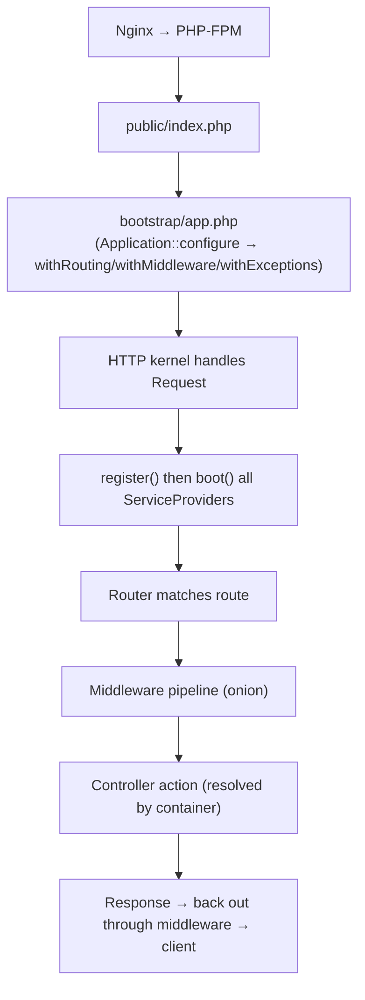
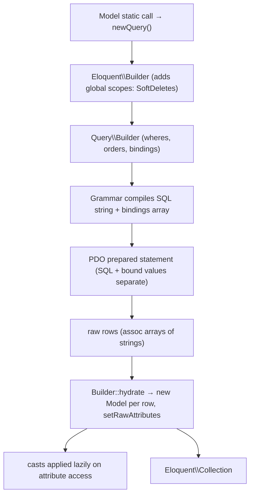
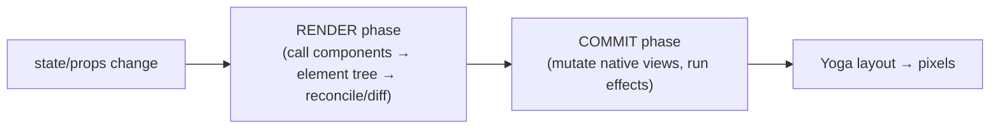
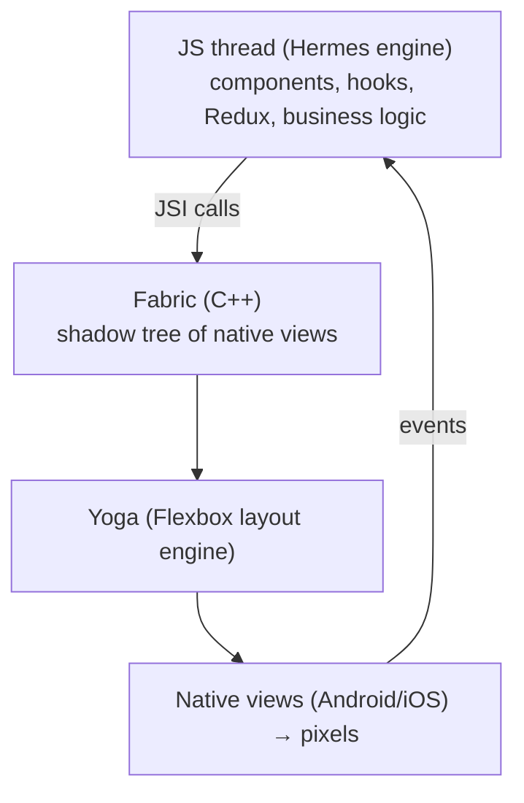

# 68. How Laravel Works — Framework Internals (As Used Here)

> To understand the backend you must understand the machine running it. This chapter explains *how Laravel itself works* — the request lifecycle, the service container, facades, the middleware pipeline, and the Eloquent ORM — then shows exactly where this project plugs into each mechanism.

## 68.1 The request lifecycle (from socket to response)



1. **`public/index.php`** — every request enters here. It loads Composer's autoloader and `bootstrap/app.php`, which returns the configured `Application` (the container).
2. **`bootstrap/app.php`** — this project's slim config (§6): `withRouting(api: routes/api.php)`, `withMiddleware(...)` (trust proxies, Sanctum, SetLocale, LogUserActivity, the `role` alias), and `withExceptions(...)` (the renderable `LogicException`→422). There is no `Kernel.php` class in Laravel 11+; this closure *is* the kernel config.
3. **Provider boot** — the container runs every provider's `register()` (bind services) then `boot()` (use them). `RepositoryServiceProvider::register()` binds the 15 repo interfaces; `AppServiceProvider::boot()` wires rate limiters, policies, and the Redis fallback (§53.7).
4. **Routing** — the router matches method+URI to a `Route` and its `[Controller, method]` callable.
5. **Middleware pipeline** — the request passes through the middleware onion (§68.4) before reaching the controller, and the response passes back out.
6. **Controller resolution & dispatch** — the container builds the controller graph (§36) and calls the action; its `JsonResponse` travels back out through the middleware to Nginx.

## 68.2 The service container — binding & resolution

The container is a **registry + a reflection-based factory** (covered operationally in §36; here is the mechanism). Two operations:

* **Binding** (`bind`/`singleton`/`instance`) records *how* to build an abstract. This project's only app-level bindings are the repository interfaces:
```php
// RepositoryServiceProvider
$this->app->bind(AdhkarRepositoryInterface::class, AdhkarRepository::class);
```
* **Resolution** (`make`, or automatic for type-hinted constructor/method params) reads the binding, then uses `ReflectionClass` to read constructor parameters and recursively resolve each. A class with no binding and only resolvable type-hints is **autowired** with zero configuration — which is why controllers/services/repositories need no explicit registration, only the *interface→concrete* lines do.

**Why this matters in practice:** to add a feature you write the classes and add one binding line; the container assembles the object graph. The container is also what makes the code testable — in a test you `bind` a fake repository and the real service receives it.

## 68.3 Facades — static syntax over the container

`Cache::remember(...)`, `DB::transaction(...)`, `Gate::policy(...)`, `Log::warning(...)` *look* static but are not. A facade is a thin class whose `__callStatic` forwards to a container-resolved instance:

```text
Cache::remember(...)            // what you write
→ Facade::__callStatic('remember', $args)
→ resolves the 'cache' singleton from the container (the CacheManager)
→ calls $cacheManager->remember(...)  // a real instance method
```

* **Consequence for this codebase:** `Cache::` automatically targets whatever store `config('cache.default')` selects — and the Redis-fallback (§53.7) swaps that config in `boot()`, so the *same* `Cache::remember` call in `ModelCache` transparently uses Redis or file depending on health. The facade indirection is precisely what makes the driver swap invisible to every caller.
* **Testability:** `Cache::shouldReceive(...)` / `Cache::spy()` swap the underlying instance for a mock — possible only because the static call is really a container lookup.

## 68.4 The middleware pipeline — Chain of Responsibility / Pipeline pattern

Laravel's middleware is the **Pipeline pattern**: the request is passed through a series of "stages," each of which may act, short-circuit, or delegate to the next via `$next($request)`.

```php
// CheckRole — a single stage
public function handle(Request $request, Closure $next, string ...$roles): Response
{
    if (!$request->user() || !in_array($request->user()->role, $roles)) {
        return response()->json(['success' => false, 'message' => 'Forbidden'], 403);  // short-circuit
    }
    return $next($request);   // delegate to the next stage
}
```

* **The "onion"** — middleware wraps the controller symmetrically: code *before* `$next()` runs on the way in (auth, locale, throttle), code *after* runs on the way out (`LogUserActivity` writing `last_active_at`). The response returned by `$next()` bubbles back through each stage.
* **Composition** — `prepend`/`append`/`alias` (§6) place stages in order. The pattern lets cross-cutting concerns (auth, rate limiting, logging) be added/removed without touching controllers — the open/closed principle applied to the request path.


## 68.5 Eloquent ORM internals — from method chain to hydrated objects

A call like `AdhkarCategory::active()->ordered()->withCount('items')->get()` traverses several Eloquent subsystems:



1. **Static call → query** — `AdhkarCategory::active()` calls `__callStatic` → `(new static)->newQuery()`, returning an `Eloquent\Builder` wrapping a `Query\Builder`. Global scopes (e.g. `SoftDeletes` adding `deleted_at IS NULL`) are applied here.
2. **Scopes / wheres** — `scopeActive` appends a `where`; `withCount('items')` adds a correlated-subquery select (§35.9). These mutate the builder's internal arrays (`wheres`, `columns`, `bindings`).
3. **Compilation** — `->get()` asks the **Grammar** to compile the builder into a SQL string with `?` placeholders plus a separate `bindings` array (the injection-safe split, §37.5).
4. **Execution** — PDO runs the prepared statement; raw rows come back as associative arrays of strings.
5. **Hydration** — `Builder::hydrate` constructs one model per row via `newFromBuilder` → `setRawAttributes` (the `$attributes` HashTable, §38.2), marks `exists = true`, and wraps them in an `Eloquent\Collection`.
6. **Lazy casting** — types (`casts()`) and translations (`getTranslations`) are applied only when an attribute is *read* (§38.2), not at hydration — so unused fields cost nothing.

**Relations & eager loading** — `with('items')` runs a *second* query `WHERE adhkar_category_id IN (...)` and matches children to parents with a hash dictionary (§39.3). **Model events** (`saving`, `saved`, …) fire from within `save()`/`delete()` — the hook into which this project's invariants (`Recording::booted`, §55) and cache invalidation (`InvalidatesCache`, §53.6) attach.

**The project's relationship to Eloquent:** the repository layer is the *only* place these chains are written (§9), the `ModelCache` snapshots the hydrated output (§53), and the resources serialize it (§11) — so Eloquent's internals are encapsulated behind three project layers.

---

# 69. How React & React Native Work — Rendering Internals (As Used Here)

> The mobile UI's behavior — and its performance — only make sense if you know React's two-phase rendering, the Fiber tree, the hooks model, and the React Native runtime. This chapter explains each and points at the project code that exploits it.

## 69.1 Elements, components, and the two phases

* A **component** is a function returning **elements** (`<View>…`), which are *plain description objects* (`{type, props, key}`) — not native views.
* React works in **two phases**:
  1. **Render phase** (pure, interruptible): call components to produce a new element tree, then **reconcile** it against the previous tree to compute the minimal set of changes. No side effects allowed here.
  2. **Commit phase** (synchronous): apply those changes to the host (native views via Fabric), then run layout effects and `useEffect` callbacks.



## 69.2 Fiber & reconciliation

React's internal tree is made of **fibers** — one mutable node per component instance, holding its hooks, props, and links to parent/child/sibling. Reconciliation diffs the new element tree against the current fiber tree using the heuristics in §39.4 (type identity, `key` matching), producing an "effect list" of nodes to mount/update/unmount. Fiber makes rendering **interruptible**: React can pause/resume/abort render work to stay responsive — which is why render functions must be pure (they may run more than once).

**Where the project relies on this:** stable `key`s (model `id`s) in every list (`filteredSurahs.map`, adhkar items) let reconciliation reuse rows on reorder instead of remounting them (§39.4). Pure components mean a re-render that produces an identical element tree commits *nothing*.

## 69.3 The hooks model — why order matters, and closures

Hooks (`useState`, `useEffect`, `useRef`, `useMemo`, `useCallback`, `useSelector`) are stored as a **linked list on the fiber**, indexed by call order. That is the entire reason for the *Rules of Hooks*: hooks must be called in the **same order every render** (no conditionals), so React can match each call to its stored slot.

**Closures & the stale-closure problem** — every render creates fresh closures capturing that render's variables. An effect/callback that captures a value sees the value *as of the render that created it*. The project handles this explicitly in `PlayerContext`:

```ts
const queueRef = useRef<Recording[]>(queue);
useEffect(() => { queueRef.current = queue; }, [queue]);   // keep ref current
// …later, inside the playbackState effect:
const q = queueRef.current;     // reads the LATEST queue, not the render-time closure value
```

* **Why a ref, not the value directly:** the auto-advance effect depends on `status.playbackState` (it must run when playback ends), but it also needs the *current* queue. If it listed `queue` in its deps, it would be re-created on every queue change; if it closed over `queue` directly without listing it, it would read a **stale** queue. The `queueRef` pattern reads the live value without widening the dep array — the canonical solution to stale closures. The same is done for `queueIndexRef`, `rateRef`, `isLoadedRef`, `pendingPlayRef`, `hasSourceRef`.
* **`useRef` semantics:** a ref is a stable, mutable box (`{current}`) that *persists across renders and never triggers a re-render when mutated* — the right tool for "imperative state the render output doesn't depend on" (here: the audio engine's bookkeeping).

## 69.4 What triggers a re-render, and how the project minimizes it

A component re-renders when: its own `useState`/`useReducer` updates, its parent re-renders, its `useContext` value changes, or a subscribed external store slice changes. The project's three render-minimization techniques (each from real code):

1. **Atomic store selectors** — `useSelector(selectIsPlaying)` re-renders only when that boolean flips; the 4 Hz `setProgress` (throttled in `PlayerContext`, §69.5) changes only `positionMillis`, so only the progress bar re-renders (§58.3).
2. **`useMemo`/`useCallback`** — `usePlayer` returns a `useMemo`'d object of `useCallback`'d handlers, so consumers keep stable references and memoized children don't re-render (§58.4). `useStyles` memoizes the StyleSheet per theme (§73).
3. **Context value memoization** — `PlayerContext` provides a `useMemo`'d engine object, so consuming components don't re-render when the provider re-renders for unrelated reasons.

## 69.5 The React Native runtime — JS thread, Fabric, Yoga, Hermes



* **Hermes** — the JS engine (§38.4): bytecode-precompiled, low-memory, hidden-class object model.
* **JSI / Fabric (New Architecture)** — the JS thread calls into C++ directly (no async JSON bridge), building a **shadow tree** of host components; **Yoga** computes Flexbox layout (§29); the platform rasterizes. Keeping the JS thread unblocked is why heavy work (audio buffering, file downloads) is delegated to native modules (`expo-audio`, `expo-file-system`) and why progress updates are **throttled** before hitting React:

```ts
// PlayerContext — throttle native status (which fires very often) into Redux at ~4 Hz
if (now - lastTickRef.current >= PROGRESS_THROTTLE_MS) {   // 250 ms
  lastTickRef.current = now;
  dispatch(setProgress({ position: status.currentTime * 1000, duration: status.duration * 1000 }));
}
```
* Without this throttle, the native player's status callback (which can fire dozens of times per second) would dispatch dozens of Redux updates per second, each potentially re-rendering the progress UI. Throttling to 250 ms caps that at ~4 renders/sec — imperceptible to the user, gentle on the JS thread. This is the *single most important* RN-runtime accommodation in the app.

**The synthesis:** React decides *what* changed (render+reconcile), commits the minimum to Fabric, Yoga lays it out, Hermes runs it all; the project keeps this loop cheap with atomic selectors, memoization, refs to avoid stale closures, and throttled high-frequency events.

---
