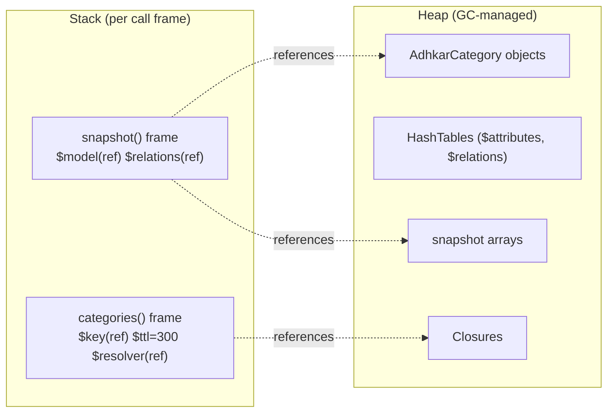

# 70. Memory Model in Depth — Stack, Heap, Evaluation & GC

> §27 and §38 introduced memory; this chapter goes to the metal: what lives on the **stack** vs the **heap**, how a concrete project function allocates, how expressions are **evaluated**, how **garbage collection** reclaims memory, and how **re-renders** cost (and save) allocations.

## 70.1 Stack vs heap — the universal split

* **The stack** holds *call frames*: one frame per active function call, containing its parameters, local variables (for primitives, the value itself; for objects, a *reference*), and the return address. It grows/shrinks as calls enter/return — strictly LIFO, O(1) push/pop, automatically freed on return.
* **The heap** holds *dynamically-sized, longer-lived data*: objects, arrays, strings. References on the stack point into the heap. Heap memory is reclaimed by garbage collection, not by returning from a function.



## 70.2 PHP allocation — walking `ModelCache::rememberMany`

```php
public static function rememberMany(string $key, int $ttl, Closure $resolver): EloquentCollection
{
    $snapshots = Cache::remember($key, $ttl, static function () use ($resolver): array {
        return $resolver()->map(static fn (Model $m): array => self::snapshot($m))->all();
    });
    return new EloquentCollection(array_map(static fn (array $snap) => self::rehydrate($snap), $snapshots));
}
```

* **Stack:** the frame holds `$key` (a `zval` pointing to an interned string on the heap), `$ttl` (the integer `300` stored *inline* in the zval — no heap), and `$resolver` (a zval referencing a `Closure` object on the heap).
* **Heap:** the inner `static function` is a **Closure object** allocated on the heap; `use ($resolver)` captures the resolver by binding it into the closure's scope (a heap reference, not a copy). On a cache miss, `$resolver()` allocates an `Eloquent\Collection` of `AdhkarCategory` objects (each an object + ~6 HashTables, §38.2) on the heap; `->map(...)->all()` allocates the array of snapshot arrays; `Cache::remember` serializes that array to the store. On the way out, `array_map` + `new EloquentCollection` allocate the rebuilt models.
* **Copy-on-write:** passing `$snapshots` into `array_map` does *not* copy the array — PHP shares the buffer (refcount++) until a write would occur; none does here, so no separation (§38.1).
* **Reclamation:** when `rememberMany` returns, its stack frame pops; the intermediate `$snapshots` array's refcount drops to zero and it is freed immediately (PHP reference counting). The whole request arena is freed at request end regardless (§27.1) — so even cyclic garbage can't leak across requests.

## 70.3 The evaluation process — lazy vs eager

**Evaluation** is turning an expression into a value. The order and timing matter:

* **Eager evaluation** (default): arguments are evaluated *before* the call. `$this->repository->categories()` runs the query *now*.
* **Lazy evaluation** (via closures): wrapping work in `fn () => ...` defers it. `Cache::remember($key, 300, fn () => $this->repository->categories())` passes the *closure*, not the result — the query is evaluated **only if** the cache misses. This is the single most important evaluation choice in the read path: it makes the DB query conditional on a cache state decided *inside* `remember`.
* **Short-circuit evaluation:** `$user && $user->isSubscribed()` evaluates the right side only if the left is truthy — `User::isSubscribed()` and `canAccess()` (§8.1) rely on this to avoid null-method calls. `$localUri ?? recording.audio_url` (nullish-coalescing) evaluates the right side only when the left is null.
* **`match (true)`** evaluates arms top-to-bottom and stops at the first truthy condition (§53.3) — a controlled, ordered evaluation.

## 70.4 JavaScript memory — closures capture on the heap

```ts
const loadQueueTrack = useCallback((recs, idx) => {
  const rec = recs[idx];
  dispatch(setRecording({ recording: rec, diseaseId: rec.disease_id, source: 'stream' }));
  engine.load(rec.audio_url);
}, [dispatch, engine]);
```

* **Stack (per call):** `recs` (reference to a heap array), `idx` (a number — but in JS *all* values are 64-bit cells; small integers are NaN-boxed inline, §38.4), `rec` (reference).
* **Heap:** the arrow function is a **closure** allocated on the heap; it captures `dispatch` and `engine` by reference. `useCallback` **memoizes that closure** across renders — without it, a *new* closure object would be allocated every render (GC pressure), and every memoized child receiving it would re-render (§22). So `useCallback` is simultaneously a *render* optimization and a *memory* optimization.
* **The object literal** `{ recording, diseaseId, source }` is a fresh heap object per call; it lives only until the reducer copies its fields into the (Immer-produced) next state, then becomes garbage.
* **GC:** Hermes uses a generational garbage collector — short-lived allocations (the per-tick objects, transient closures) are collected cheaply in the young generation. This is why the throttle (§69.5) matters for memory too: 4 dispatches/sec produce 4 short-lived payload objects/sec instead of dozens.

## 70.5 Re-render allocation cost — measured conceptually

Each React render call **re-executes the component body**, allocating: a new element tree (description objects), and — *unless memoized* — new closures for every inline handler and new objects for every inline literal. The project's discipline directly controls this:

| Without optimization | With the project's pattern |
|----------------------|----------------------------|
| new handler closures every render | `useCallback` → one closure, reused |
| new derived arrays every render (`surahs.filter(...)`) | `useMemo` → recompute only on dep change (§52.3) |
| new StyleSheet object every render | `useStyles` memoizes per theme (§73) |
| new context value every provider render | `useMemo`'d engine object (§69.4) |
| whole subtree re-renders on any store change | atomic selectors → only the changed leaf (§58.3) |

**The principle:** a render is cheap if it allocates little and commits little. Memoization keeps allocation near-zero on unchanged paths; atomic selectors keep the *number* of re-rendering components minimal; keyed reconciliation keeps commits minimal. Together they make a 4 Hz audio tick cost one small object and one component render — not a tree-wide storm.

---

# 71. Uncovered Backend Logic — Annotated

> Logic from the backend not yet shown in full, each with its code, the idea behind it, and the SQL it generates.

## 71.1 `CategoryRepository` — nested eager loading with per-relation counts

```php
public function getAll(): Collection
{
    return Category::active()->ordered()
        ->with([
            'subcategories'  => fn ($q) => $q->active()->ordered()->withCount('diseases'),
            'directDiseases' => fn ($q) => $q->active()->ordered(),
        ])->get();
}
```

* **The idea:** build the hospital's top navigation tree in **one logical fetch** — categories, each with its active subcategories (and *how many diseases* each holds, for a badge), plus diseases attached directly to `disease_direct` categories.
* **Constrained eager loading:** each `with` value is a *closure* that further filters the eager query — so subcategories are themselves `active()->ordered()` and carry a `diseases_count`. The filtering happens in SQL, not PHP.
* **Generated SQL (3 queries, N+1-free):**
```sql
SELECT * FROM categories WHERE is_active=1 AND deleted_at IS NULL ORDER BY display_order, id;
SELECT *, (SELECT COUNT(*) FROM diseases WHERE diseases.subcategory_id = subcategories.id) AS diseases_count
  FROM subcategories WHERE category_id IN (?) AND is_active=1 ... ORDER BY display_order, id;
SELECT * FROM diseases WHERE category_id IN (?) AND is_active=1 ... ORDER BY display_order, id;
```
* `findBySlug` deepens this with `withCount(['diseases','recordings'])` on subcategories and `recordings` ordered by session — the detail screen's full tree, still a fixed query count.

## 71.2 `FavoriteRepository` + `Favorite::toggle` — set membership done right

```php
// Repository: a user's favorites = active diseases that this user has favorited
public function forUser(int $userId): Collection
{
    return Disease::active()
        ->whereHas('favoritedBy', fn ($q) => $q->where('users.id', $userId))
        ->with('subcategory')->ordered()->get();
}
```
```php
// Model: idempotent toggle of a pivot row
public static function toggle(int $userId, int $diseaseId): bool
{
    $existing = static::where('user_id', $userId)->where('disease_id', $diseaseId)->first();
    if ($existing) { $existing->delete(); return false; }   // was favorited → unfavorite
    static::create(['user_id' => $userId, 'disease_id' => $diseaseId]);  // → favorite
    return true;
}
```

* **`whereHas('favoritedBy', ...)`** compiles to an `EXISTS` subquery over the `favorites` pivot — "diseases for which a favorites row by this user exists" (§35.9). Reading favorites *from the disease side* (not the pivot) lets the result reuse the disease list UI directly.
* **`toggle` returns a boolean** = the new state (`true` favorited / `false` unfavorited). It is **idempotent per resulting state**: calling it flips, and the service wraps it in `DB::transaction` (§8.1) so a concurrent double-tap can't create two pivot rows (the `unique(user_id, disease_id)` constraint is the final backstop).
* **The client** mirrors this with an optimistic update + invalidation (§2.5); the boolean return reconciles the optimistic guess.

## 71.3 `RecitationService` — cache-the-aggregate, filter-in-PHP

```php
public function getBySurah(int $surahId): Collection
{
    $all = ModelCache::rememberMany(self::CACHE_ALL, 300, fn () => $this->repository->all());
    return $all->where('surah_id', $surahId)->values();
}
```

* **The idea:** rather than cache one key *per surah* (114 keys, 114 possible misses), cache the **entire recitation set under one key** and slice it in memory. The recitation set is small and fully-shared across users, so one cached collection serves every surah.
* **`$all->where(...)->values()`** — `where` here is the **Collection** method (in-memory filter over already-loaded models), not a DB query; `values()` re-indexes the result 0..n. Zero extra DB round-trips after the single aggregate fetch.
* **Trade-off:** slightly more memory per request (the whole set is rehydrated) for far fewer cache keys and a 100% hit rate after the first load — the right call for a small, hot, read-only dataset (the same pattern the surah/reciter lists use).

## 71.4 `Verse::scopeSearch` — diacritic-insensitive Arabic search (the standout)

```php
public function scopeSearch(Builder $query, string $term): Builder
{
    $term = trim($term);
    return $query->where(function (Builder $q) use ($term) {
        $q->where('text->en', 'like', "%{$term}%");                 // English: plain LIKE on JSON path
        $normalized = self::normalizeArabic($term);                  // strip harakat from the TERM
        if ($normalized !== '') {
            $expr = self::arabicNormalizeSql("JSON_UNQUOTE(JSON_EXTRACT(`text`, '$.ar'))"); // strip from COLUMN
            $q->orWhereRaw("{$expr} LIKE ?", ['%' . $normalized . '%']);
        }
    });
}
```

* **The problem:** the Mushaf text is stored *fully vowelled* (Uthmani, e.g. `ٱللَّه`), but users type bare letters (`الله`). A naïve `LIKE '%الله%'` never matches because the stored text is riddled with combining marks (harakat, dagger alef, Quranic annotation signs U+06D6–06ED, tatweel).
* **The solution — normalize both sides:**
  - **PHP side (`normalizeArabic`)** strips every combining mark via a Unicode `preg_replace`, then folds alef variants (`أ إ آ ٱ → ا`), alef-maksura→ya, ta-marbuta→ha — reducing the *term* to bare letters.
  - **SQL side (`arabicNormalizeSql`)** builds a `REGEXP_REPLACE(...)` expression that performs the *same* normalization on the *stored column* at query time, so `ٱللَّه` in the DB reduces to `الله` before comparison.
* **Why `REGEXP_REPLACE` over a `REPLACE` chain:** the mark set spans dozens of code points (06D6–06ED); a hand-listed `REPLACE` chain could never cover them, and a single regex pass does. (The code comments record exactly this lesson: the previous narrower set let vowelled words never reduce.)
* **The idea behind it:** make search *script-aware*, not byte-aware. This is a genuinely sophisticated bit of domain engineering — correct Arabic search is hard, and the dual PHP+SQL normalization is the right pattern (normalize the query once, normalize the column in the predicate). The cost is that the `REGEXP_REPLACE` defeats indexing (full scan), accepted because the verse corpus is fixed at ~6,236 rows and results are paginated/cached (§10).

## 71.5 `NotificationRepository` — `firstOrCreate` and `forceFill`

```php
public function preferencesFor(User $user): NotificationPreference
{ return NotificationPreference::firstOrCreate(['user_id' => $user->id]); }   // [1]

public function updatePushToken(User $user, string $token): void
{ $user->forceFill(['expo_push_token' => $token])->save(); }                  // [2]
```

* **[1] `firstOrCreate(['user_id' => $id])`** — atomically "get the row or make it." A user's notification preferences are created lazily on first access (the 1:1 row need not exist until needed, §3.6). Returns a real model either way, so callers never branch on existence.
* **[2] `forceFill`** — bypasses the `$fillable` mass-assignment guard to set a single trusted field (`expo_push_token`). Used deliberately for a server-controlled value, then `save()`. (Contrast with `update($data)` in `updatePreferences`, which respects `$fillable` because that data comes from the client.)

## 71.6 `ReciterRepository` — eager nested for the detail view

```php
public function findById(int $id): ?Reciter
{ return Reciter::with(['recitations.surah'])->find($id); }
```

* **Nested eager (`recitations.surah`)** loads a reciter, their recitations, and each recitation's surah in **3 queries** — so the reciter detail page can list "this reciter's surahs" without N+1. The dot syntax is Eloquent's nested-eager notation, each segment a `WHERE … IN (…)` (§39.3).

---
