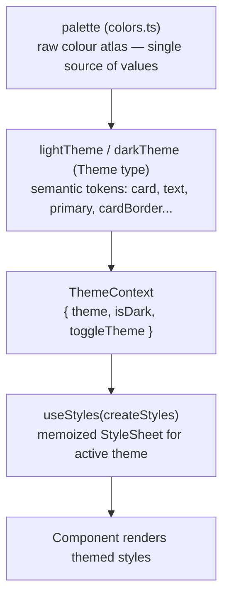
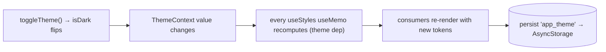

# 72. Uncovered Frontend Logic — Annotated

> Frontend logic with a strong idea behind it, each shown in full with the reasoning and the function flow.

## 72.1 `prayerTimesService` — offline astronomical prayer times

```ts
const FALLBACK_COORDS = { latitude: 21.4225, longitude: 39.8262 };       // Mecca
const calcParams = () => CalculationMethod.UmmAlQura();                   // Saudi official method

async function resolveCoordinates() {
  try {
    let granted = (await Location.getForegroundPermissionsAsync()).granted;
    if (!granted) granted = (await Location.requestForegroundPermissionsAsync()).granted;
    if (!granted) return FALLBACK_COORDS;                                 // [1] graceful default
    const last = await Location.getLastKnownPositionAsync();              // [2] cheap cached fix
    const pos = last ?? (await Location.getCurrentPositionAsync({ accuracy: Location.Accuracy.Low }));
    return { latitude: pos.coords.latitude, longitude: pos.coords.longitude };
  } catch { return FALLBACK_COORDS; }
}

async getDailyPrayerTimes(dates: Date[]): Promise<DayPrayerTimes[]> {
  const { latitude, longitude } = await resolveCoordinates();
  const coords = new Coordinates(latitude, longitude);
  return dates.map((date) => {
    const t = new PrayerTimes(coords, date, calcParams());               // [3] pure math, per day
    return { date, fajr: t.fajr, sunrise: t.sunrise, dhuhr: t.dhuhr, asr: t.asr, maghrib: t.maghrib, isha: t.isha };
  });
}
```

* **The idea:** compute prayer times **on-device, offline, deterministically** using the `adhan` library (pure JS — no native module, no network, no rebuild). This is what lets adhkar reminders be pinned to real prayer times even with no connectivity (§51).
* **[1] Permission-degrades-to-Mecca** — if location is denied/fails, fall back to Mecca's coordinates so callers *always* get usable times (never an error). For a Saudi-focused app, Mecca is a sensible default.
* **[2] `getLastKnownPositionAsync` first** — a cached fix is instant and battery-cheap; only if absent does it request a fresh low-accuracy fix (prayer times don't need GPS precision — city-level is fine).
* **[3] `new PrayerTimes(coords, date, UmmAlQura)`** — pure astronomical computation (O(1) per day) from latitude/longitude/date. The waking window is derived as Fajr→sunrise. No I/O in the calculation itself.
* **Flow:** `notificationScheduler.rescheduleAdhkar` (§51) → `getDailyPrayerTimes(next 7 days)` → schedule dated notifications at each day's Fajr/Asr/Isha.

## 72.2 `useGeneralRuqyah` — subscription-filtered shuffled queue

```ts
const playGeneralRuqyah = useCallback(async () => {
  setIsLoading(true);
  try {
    const all = await ruqyahService.getGeneralRuqyah();
    void contentCache.setItem('clinic_general_ruqyah', all);             // [1] write-through
    const filtered = isPaid ? all : all.filter((r) => r.session_number === 1);  // [2] entitlement filter
    const shuffled = shuffle(filtered);                                  // [3] Fisher–Yates
    if (!shuffled.length) return;
    dispatch(setQueue({ recordings: shuffled, index: 0 }));              // [4] queue → Redux
    loadQueueTrack(shuffled, 0);
  } catch {
    const cached = await contentCache.getItem<Recording[]>('clinic_general_ruqyah');  // [5] offline
    if (cached?.length) { /* same filter + shuffle + play */ }
  } finally { setIsLoading(false); }
}, [isPaid, dispatch, loadQueueTrack]);
```

* **[1]** Cache the full general-ruqyah set on every successful fetch (offline replay later).
* **[2] Entitlement at the data layer** — free users get *only session 1* of each recording (`session_number === 1`); subscribers get all. This enforces the monetization rule on the client *in addition* to the server gate (§8.3) — the free user's queue simply never contains premium tracks, so there's no 403 to handle mid-playlist.
* **[3]** `shuffle` is Fisher–Yates (§39.5) — an unbiased random order each session, giving variety.
* **[4]** The shuffled list + cursor go into `playerSlice` (`queue`, `queueIndex`); `loadQueueTrack` starts track 0.
* **[5] Offline fallback** — on fetch failure, replay the cached set through the *same* filter+shuffle+play path. The catch block mirrors the try block exactly, so offline behavior is identical bar the data source.
* **Auto-advance** is *not* here — it lives in `PlayerContext` (§72.5) so it works regardless of which screen is mounted. `playNext`/`playPrevious` (manual skip) advance `queueIndex` and reload.

## 72.3 `flattenSectioned` — per-view reshuffle of sectioned content

```ts
export function flattenSectioned<TItem extends OrderableItem>(category): TItem[] {
  if (!category) return [];
  const out: TItem[] = [];
  for (const section of [...(category.sections ?? [])].sort(byOrder)) {     // [1] sections by display_order
    const items = section.items ?? [];
    out.push(...(section.order_randomly ? shuffle(items) : [...items].sort(byOrder)));  // [2] per-section
  }
  out.push(...[...(category.items ?? [])].sort(byOrder));                   // [3] section-less items last
  return out;
}
```

* **The idea:** turn the server's *nested* adhkar/tahsinat tree (category → sections → items, plus section-less items) into a single flat ordered list for the pager, honoring two ordering modes per section.
* **[1]** Sections are sorted by their manual `display_order` (spread-copied first so the input isn't mutated — *purity*).
* **[2] The clever bit:** a section flagged `order_randomly` has its items **shuffled** (Fisher–Yates), otherwise sorted by `display_order`. Because this runs **per view** (called in the screen's render/memo), a randomized section *reshuffles every time the screen opens* — variety without any server state or persistence. Ordered sections stay deterministic.
* **[3]** Items directly under the category (no section) are appended last, ordered.
* **Generic `<TItem extends OrderableItem>`** — one function serves both Adhkar and Tahsinat items (parametric polymorphism, §61.3).

## 72.4 `hospital` routing — the client-side navigation state machine

```ts
export function categoryRoute(category: Category): string {
  if (category.type === 'direct')         return `/hospital/recordings/${category.slug}`;
  if (category.type === 'disease_direct') return `/hospital/diseases/${category.slug}?level=category`;
  return `/hospital/subcategories/${category.slug}`;                       // standard
}
export function subcategoryIsDirect(subcategory): boolean {
  const diseaseCount = subcategory.diseases_count ?? subcategory.diseases?.length ?? 0;
  return diseaseCount === 0;                                               // no diseases → holds recordings
}
export function subcategoryRoute(subcategory): string {
  return subcategoryIsDirect(subcategory)
    ? `/hospital/recordings/${subcategory.slug}?level=subcategory`
    : `/hospital/diseases/${subcategory.slug}`;
}
```

* **The idea:** the server's `category.type` enum (`standard`/`direct`/`disease_direct`, §3.4) is a **state machine**, and these pure functions are its *client-side transition table* — mapping a node's type to the next screen. Tapping a `direct` category jumps straight to recordings; a `disease_direct` to a disease list (flagged `level=category`); a `standard` to subcategories.
* **`subcategoryIsDirect`** mirrors the same logic one level down using `diseases_count` (the `withCount` from `CategoryRepository`, §71.1) — a subcategory with zero diseases holds recordings directly. The `?? ... ?? 0` chain tolerates either a count field or a loaded array or neither.
* **Why pure functions, not inline `if`s in components:** the navigation rule is defined **once** and reused by every card/list that links into the hospital, and is unit-testable in isolation (the testing convention targets `utils/*` first). This is the taxonomy invariant (enforced server-side by `LogicException`, §45.3) reflected as client navigation.

## 72.5 `PlayerContext` — the imperative engine & queue auto-advance

`PlayerContext` owns the one non-serializable `expo-audio` player (which *cannot* live in Redux) and mirrors its *state* into `playerSlice`. Its hardest job is **auto-advancing the general-ruqyah queue when a track ends**, from anywhere in the app:

```ts
useEffect(() => {
  const prev = prevPlaybackStateRef.current;
  const curr = status.playbackState;
  if (prev === 'playing' && (curr === 'idle' || curr === 'ended') && hasSourceRef.current) {  // [1] natural end
    const q = queueRef.current; const idx = queueIndexRef.current; const nextIdx = idx + 1;
    if (q.length > 0 && nextIdx < q.length) {
      const next = q[nextIdx];
      if (next?.audio_url) {
        dispatch(setQueueIndex(nextIdx));
        dispatch(setRecording({ recording: next, diseaseId: next.disease_id, source: 'stream' }));
        pendingPlayRef.current = true;                                    // [2] auto-play when loaded
        player.replace({ uri: next.audio_url, headers: { 'ngrok-skip-browser-warning': 'true' } });
      }
    } else if (q.length > 0) { dispatch(clearQueue()); }                  // [3] end of queue
  }
  prevPlaybackStateRef.current = curr;
}, [status.playbackState, dispatch, player]);
```

* **[1] Transition detection** — the effect compares the *previous* playback state (kept in `prevPlaybackStateRef`) to the current one. `playing → idle/ended` means the track finished **naturally** (distinguishing it from a user pause, which is `playing → paused`). This is a classic edge-detection on a state signal.
* **Refs everywhere** — `queueRef`/`queueIndexRef`/`hasSourceRef`/`pendingPlayRef` let this effect read the *latest* queue/state without listing them as deps (which would re-create the effect on every queue change and risk missing the transition) — the stale-closure solution from §69.3.
* **[2] `pendingPlayRef` + `player.replace`** — `expo-audio` loads a new source asynchronously; setting `pendingPlayRef = true` then `replace(...)` defers `play()` to the `isLoaded` effect (which also re-applies the chosen `playbackRate`, since `replace` resets it to 1×). This decouples "request play" from "source ready."
* **[3]** At the queue's end, `clearQueue()` exits general-ruqyah mode.
* **Throttled progress** (§69.5) and the `setAudioModeAsync({ shouldPlayInBackground: true })` (background audio) round out the engine. The `ngrok-skip-browser-warning` header makes the dev tunnel serve the audio file directly instead of an HTML interstitial.
* **Why a Context, not a hook per screen:** the engine and its auto-advance must be **always mounted** (a single instance) so playback survives navigation — exactly what a top-level provider gives (§17.2). Screens consume it via `usePlayer`/`useGeneralRuqyah`, never touching the engine directly.

---

# 73. The Theming System — Light/Dark via Factory + Hook

> The styling chapter (§29) documented the static `StyleSheet` era. The app since migrated to a **theme-aware** system (light/dark) built on a token layer, a style *factory*, and a memoizing hook. This chapter documents it as it now is.

## 73.1 The three layers



1. **`palette`** — the raw colour values (`brand[500] = #135452`, …), the single source of truth for *values*. Direct `palette.*` use is allowed only for colours intentionally constant across modes (brand accents, the Mushaf parchment).
2. **`lightTheme` / `darkTheme`** (type `Theme`) — *semantic* tokens (`theme.card`, `theme.text`, `theme.primary`, `theme.cardBorder`) whose **light values equal the original Figma colours** (so light mode is unchanged) and whose dark values are defined separately.
3. **`ThemeContext`** provides `{ theme, isDark, toggleTheme }`, persists the choice to AsyncStorage, and defaults to light.

## 73.2 The factory + hook pattern

```ts
// ThemeContext.tsx — the source of the active theme
<ThemeContext.Provider value={{ theme: isDark ? darkTheme : lightTheme, isDark, toggleTheme }}>

// useStyles.ts — turn a factory into a memoized StyleSheet
export function useStyles<T>(factory: (theme: Theme) => T): T {
  const { theme } = useTheme();
  return useMemo(() => factory(theme), [theme, factory]);   // recompute only when theme changes
}

// Foo.styles.ts — a factory, not a static object
export const createStyles = (theme: Theme) => StyleSheet.create({
  card: { backgroundColor: theme.card, borderColor: theme.cardBorder },
});

// Foo.tsx — consume
const s = useStyles(createStyles);
```

* **Why a factory `(theme) => StyleSheet.create({...})` and not a static object:** styles must change with the theme. A static `StyleSheet.create` is evaluated once at module load and can't react to a light/dark toggle. A factory defers style creation until a theme is known, and is re-invoked when the theme changes.
* **Why `useMemo` in `useStyles`:** `StyleSheet.create` allocates and registers a style object; doing it every render would be wasteful. Memoizing on `[theme, factory]` recomputes **only on theme toggle** — so a normal re-render reuses the same StyleSheet (a render+memory optimization, §70.5). This requires the `factory` to be a *stable module-level reference* (defined outside the component), which the convention enforces.
* **Toggle flow:** `toggleTheme()` flips `isDark` in `ThemeContext` → context value changes → every `useStyles` consumer's `useMemo` sees a new `theme` → recomputes its StyleSheet → re-renders with dark colours. One state change re-themes the entire app.

## 73.3 Tokens vs palette — the discipline

The rule (from CLAUDE.md): **surfaces/text/borders → `theme.*`** (mode-aware); **constant brand/decorative accents, shadows, the Mushaf parchment → `palette.*`** (deliberately fixed), each such use documented inline. JSX colour props (icon `color=`, `placeholderTextColor=`) read `const { theme } = useTheme()`. The separation keeps a single colour atlas (`palette`) while letting the semantic layer (`theme`) vary by mode — the same "values vs semantics" split that good design systems use, implemented with React Context + memoized factories.



---
