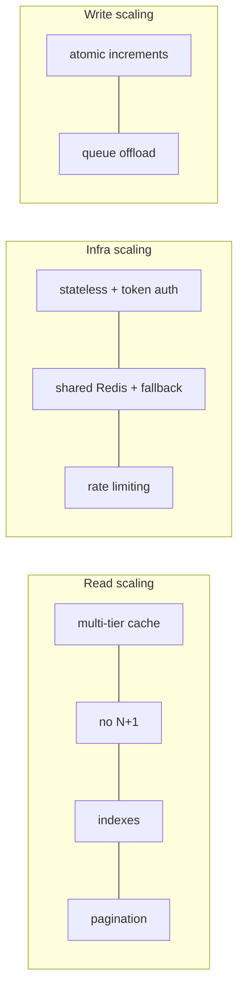
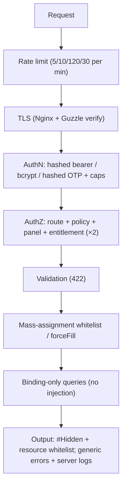

# 74. Scalability Best Practices (As Implemented Here)

> Scalability is the ability to serve more load without redesign. This chapter catalogs the project's scalability techniques — each shown in its real code, with *why* it scales and the trade-off.

## 74.1 Stateless, token-authenticated API → horizontal scale

```php
// routes/api.php — protected group, no server session
Route::middleware('auth:sanctum')->group(function () { Route::get('/me', ...); });
```
* **Why it scales:** every request carries its own credential (the bearer token); the server keeps **no per-client session in memory**. Any FPM worker on any node can serve any request, so you scale by adding stateless app servers behind a load balancer — no sticky sessions, no session replication. The token is verified by a hashed lookup in `personal_access_tokens` (a shared DB), the only shared state.

## 74.2 Multi-tier caching → fewer DB hits per user

* **Server read-through** (`ModelCache`, §53) collapses *N polling clients* into ~**1 DB read per key per 300 s**. The home screen polls several public endpoints ~every 30 s; with the TTL, ~9 of 10 polls never touch MySQL.
* **Client three-tier** (TanStack memory → SQLite → network, §24) means repeat navigations and offline use never hit the API at all.
* **Why it scales:** read load is the dominant traffic; caching turns O(users × polls) DB reads into O(keys / TTL). **Trade-off:** up to 300 s staleness on content (acceptable; admin edits bypass it via invalidation, §53.6).

## 74.3 Store-agnostic snapshot cache + Redis with fallback

```php
// ModelCache caches PRIMITIVE arrays → round-trips through ANY store identically (§53.1)
// AppServiceProvider::applyRedisFallbacks() — ping, else degrade to file/database (§53.7)
```
* **Why it scales:** Redis is a **shared, in-memory** cache across all app nodes — essential when you run more than one server (a file cache would be per-node and incoherent). The snapshot design means moving from file→Redis needs *no code change* (the value is store-agnostic). The health-check fallback means a Redis blip degrades to file/database instead of a site-wide 500 — graceful capacity loss, not an outage. **`warnOnFileCacheInProduction`** nudges operators toward a shared store before multi-node rate limiting goes wrong.

## 74.4 Rate limiting → protect capacity & fairness

```php
RateLimiter::for('api', fn ($r) => $r->user()
    ? Limit::perMinute(120)->by('u:' . $r->user()->id)   // authed: generous, per-user
    : Limit::perMinute(30)->by($r->ip()));               // anon: tighter, per-IP
RateLimiter::for('auth', fn ($r) => Limit::perMinute(5)->by($r->ip()));   // brute-force guard
```
* **Why it scales:** caps the blast radius of a misbehaving client or a credential-stuffing bot, preserving capacity for everyone else. Keying authed users by id (not IP) is correct behind NAT/carrier-grade NAT (many users share an IP). **Note:** the counter lives in the cache store, so accurate cross-node limiting *requires* a shared store (Redis) — tying back to §74.3.

## 74.5 No N+1 — fixed query count per endpoint

```php
Category::active()->ordered()->with(['subcategories' => fn ($q) => $q->withCount('diseases'), ...])->get();
```
* **Why it scales:** eager loading (§39.3) keeps an endpoint's query count **constant** regardless of data volume — the category tree is 3 queries whether there are 5 or 500 subcategories. N+1 would make query count grow with content, the classic scalability cliff. **`withCount`** (correlated subquery) gets aggregates without loading rows.

## 74.6 Atomic writes & offloaded work

```php
$recording->increment('plays_count');                 // single atomic UPDATE, no race (§46.1)
CompressAudioJob::dispatch($class, $id, $path);        // transcoding off the request (§44)
```
* **Why it scales:** the atomic `increment` avoids read-modify-write contention under concurrent plays (no lost updates, no row-lock churn). Pushing FFmpeg transcoding to a **queue** keeps web workers free to serve requests (a 200 MB transcode would otherwise occupy an FPM worker for minutes) — work is absorbed by queue workers you can scale independently.

## 74.7 Pagination, payload minimization, CDN-ability

* **Pagination** — `rememberPaginated` / infinite-scroll surahs (§52.3) bound result size; windowed `FlatList` mounts only visible rows.
* **Payload minimization** — `whenLoaded`/`whenCounted` (§11) send only what was loaded; the full-translation-map choice (§50) trades a few bytes for eliminating per-language refetches.
* **CDN-able media** — audio/images are served as absolute storage URLs (`streamUrl()`, `iconUrl()`), so they can be fronted by a CDN/object store without touching app code.

## 74.8 Scalability scorecard



| Technique | Scales because | Trade-off |
|-----------|----------------|-----------|
| Stateless token auth | any node serves any request | token lookup per request (cached/cheap) |
| Multi-tier cache | collapses repeat reads | bounded staleness |
| Redis + fallback | shared across nodes; degrades, not fails | needs Redis in multi-node |
| No N+1 / eager load | constant query count | must remember to eager-load |
| Atomic increment | no write contention | none |
| Queue offload | web workers stay free | needs queue workers |
| Pagination/windowing | bounded payload/render | more requests for more data |

---

# 75. Security Best Practices (As Implemented Here)

> Security mapped to the project's real code and to the OWASP Top 10. Each control: what it is, the code, why it matters.

## 75.1 Authentication & credential storage

* **Hashed API tokens** — Sanctum stores only the SHA-256 *hash* of a token (`personal_access_tokens.token`); the plaintext is shown once (`->plainTextToken`, §56.4). A DB leak yields no usable tokens. *(OWASP A02 Cryptographic Failures, A07 Auth Failures.)*
* **Bcrypt passwords** — `casts(['password' => 'hashed'])` → bcrypt with a work factor (§39.7); slow by design to resist brute force; `Hash::check` compares in constant time.
* **OTP hashed + capped** — OTPs are bcrypt-hashed in cache, TTL 600 s, with `MAX_OTP_ATTEMPTS = 5` and `MAX_RESEND = 3` (§56.3). A 6-digit code has 10⁶ space; 5 attempts makes guessing infeasible.
* **PKCE + server-side secret** — the mobile OAuth exchange uses `code` + `code_verifier`; `client_secret` never leaves the server (§31). The recent fix sets Guzzle `['verify' => true]` (TLS cert verification on the Google token exchange — closing the earlier `verify:false` MITM gap flagged in §31.5).
* **No PII in deep links** — only an opaque, single-use `session_token` rides the `quranicclinic://auth-callback` URL; the email is resolved server-side from `otp_session:{token}` (§31, §56.4). Custom-scheme URLs can be logged by the OS, so keeping secrets/PII out of them is essential.

## 75.2 Authorization — defense in depth

```php
// Route gate
Route::middleware('auth:sanctum')->group(...);
// Policy (admin-only writes, public reads) — bound to 19 content models
class ContentPolicy { public function update(User $u, $m): bool { return $u->isAdmin(); } /* ... */ }
// Panel gate
public function canAccessPanel(Panel $panel): bool { return $this->isAdmin(); }
// Entitlement gate, enforced in service AND at serialization
public function canAccess(Recording $r, ?User $u): bool { /* free || subscribed || trial */ }
```
* **Three layers:** route (`auth:sanctum`), policy/gate (`isAdmin()` for writes, `canAccessPanel` for the CMS), and **entitlement** for premium audio — checked in `RecordingService::canAccess` *and* the audio URL withheld in the Resource for unentitled users (§31.2). A leaked stream URL still requires `is_free` or an entitled user. *(OWASP A01 Broken Access Control.)*
* **Free user's queue never contains premium tracks** (§72.2) — the client filters by `session_number === 1`, so the access decision is enforced even before a request is made.

## 75.3 Injection prevention

* **SQL injection** — all queries use Eloquent/Query Builder **parameter binding** (SQL template + separate bindings array, §37.5). Even the raw Arabic search binds the term:
```php
$q->orWhereRaw("{$expr} LIKE ?", ['%' . $normalized . '%']);   // term is a BOUND parameter, not concatenated
```
The `$expr` (a `REGEXP_REPLACE` over a *fixed column name*, §71.4) contains no user input; the user's term is always a `?` binding. *(OWASP A03 Injection.)*
* **Mass-assignment** — every model has a `$fillable` whitelist; there is no `$guarded = []`. Client-driven updates go through `$fillable`; only trusted server values use `forceFill` (e.g. `expo_push_token`, §71.5). This prevents a crafted request from setting `is_subscribed` or `role`. *(OWASP A08 / mass assignment.)*
* **XSS** — the API emits JSON consumed by React Native (no HTML rendering). The one server-rendered page (OAuth bounce) escapes the deep link with `htmlspecialchars`/`json_encode` (§31.4).

## 75.4 Output hardening & data lifecycle

* **`#[Hidden(['password','remember_token'])]`** — secrets are stripped from *every* array/JSON serialization globally, on top of the resources' field whitelists (§4.3). *(OWASP A01/A04.)*
* **Soft deletes + recoverability** — content uses `SoftDeletes` so an accidental admin delete is reversible; account deletion uses `forceDelete()` to truly purge and **cascade-clean** favorites/feedback/oauth links, and `verifyOtp` purges trashed twins before re-create to avoid unique-index collisions (§56.3). *(Data integrity + privacy / right-to-erasure.)*
* **Validation everywhere** — every write validates (`required`, `email`, `unique`, `in:`, `size:6`, `min:8`) → uniform 422 (§7.3). Input is never trusted.

## 75.5 Transport, rate limiting, and error hygiene

* **TLS everywhere** — Nginx terminates HTTPS; `TrustProxies` makes generated URLs `https` (§6); Guzzle verifies certs (§75.1).
* **Rate-limit buckets** — `auth` 5/min and `otp` 10/min per IP throttle brute force; `api` 120/30 per user/IP throttles abuse (§74.4). *(OWASP A07.)*
* **Error hygiene** — controllers catch and return generic messages (`'Server error'`, 500) while **logging the full exception** server-side (§48.1); stack traces never reach the client. The duplicate-key→409 mapping avoids leaking schema details. *(OWASP A09 Logging/Monitoring, information-disclosure avoidance.)*

## 75.6 OWASP Top 10 coverage map

| OWASP (2021) | Control in this project |
|--------------|--------------------------|
| A01 Broken Access Control | route auth + policies + panel gate + entitlement (service & serialization) |
| A02 Cryptographic Failures | hashed tokens (SHA-256), bcrypt passwords/OTP, TLS |
| A03 Injection | parameter binding everywhere incl. `whereRaw` bound term; JSON-path operators |
| A04 Insecure Design | layered architecture, model-enforced invariants, defense-in-depth entitlement |
| A05 Security Misconfiguration | Redis fallback, file-cache warning, `TrustProxies` scoped to a controlled proxy |
| A07 Auth Failures | OTP attempt/resend caps, rate-limited auth, single-use session tokens |
| A08 Integrity Failures | `$fillable` whitelists, `forceFill` only for trusted fields |
| A09 Logging Failures | full server-side exception logging, generic client errors |
| A10 SSRF | OAuth calls target fixed Google endpoints only; no user-controlled URLs fetched |

## 75.7 Residual recommendations (honest)

The audit (§31.5) items now largely addressed (Guzzle TLS verify is on). Remaining hardening worth scheduling: unify `CheckRole` on spatie `hasRole()` (§32), add `FULLTEXT`/external index if search traffic grows (§30), and ensure a structured log sink (Sentry) captures the swallowed 500s in production. None are critical for a single-tenant content app; all are low-effort.



---

*This block (§68–75) added: Laravel framework internals (request lifecycle, container, facades, middleware pipeline, Eloquent ORM), React & React Native rendering internals (two-phase render, Fiber, hooks & closures, Fabric/Hermes), an in-depth memory model (stack/heap, allocation, evaluation, GC, re-render cost), annotated walkthroughs of the remaining backend and frontend logic (including diacritic-insensitive Arabic search, the general-ruqyah queue, prayer-time scheduling, and the imperative audio engine), the light/dark theming system, and dedicated scalability and security best-practice catalogs mapped to the project's own code.*

*The reference continues at **§76**, which documents the recent refactors: the Mushaf reader hook split into an orchestrator + four domain hooks, and the Disease/Recording model redefinition (slug auto-generation, the dual-parent grouping that removed the disease/category-direct duplication, and the session/free-session derivation rules) — followed by a line-by-line DSA, memory (stack/heap) and operator (`!`) walkthrough of that code (§78–§79).*
