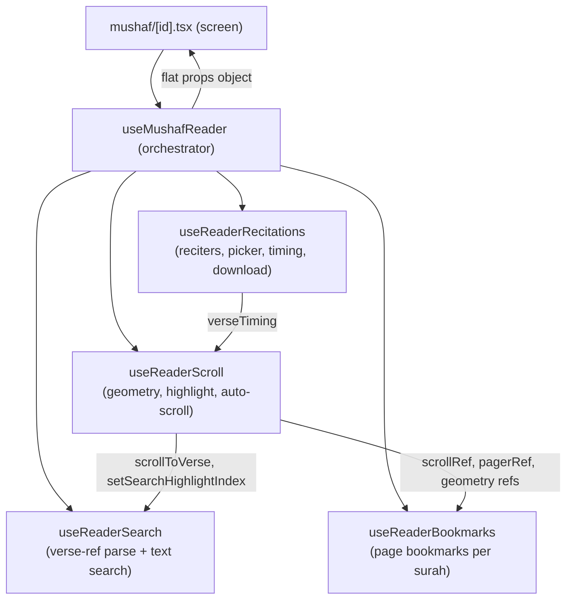
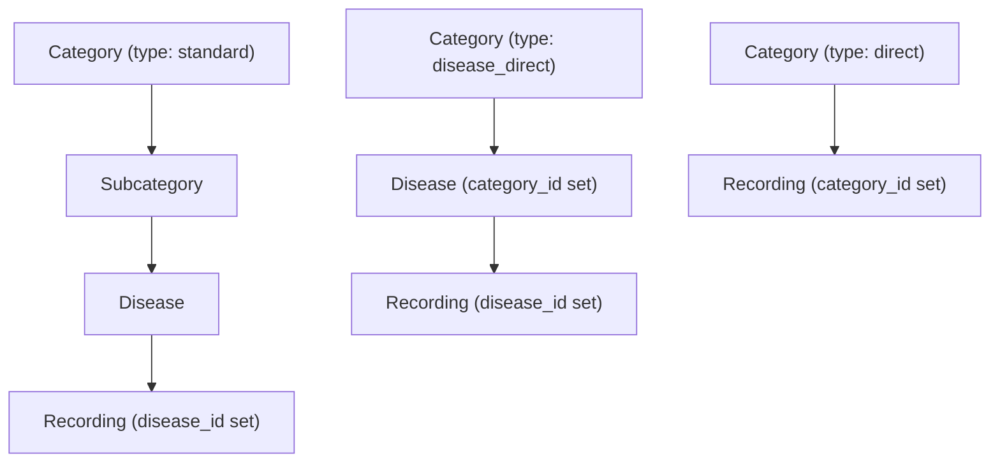

# 76. The Mushaf Reader Refactor — One God-Hook → Orchestrator + Four Domain Hooks

> *This section documents a structural refactor performed on the Mushaf reading
> screen. The behaviour is identical to before; what changed is **where the code
> lives** and **how the pieces talk to each other**. Understanding this refactor is
> the single best way to learn how to decompose a large React hook without breaking
> the rules of hooks, the dependency graph, or referential stability.*

## 76.1 The problem: a 600-line "god hook"

Before the refactor, every concern of the reading screen lived inside one hook,
`useMushafReader`: surah fetching, audio playback glue, the reciter picker and its
search box, reciter-availability probing, per-verse timing, auto-scroll/highlight,
paged-vs-continuous geometry, in-surah text search, verse-reference parsing, and
page bookmarks. That is **seven unrelated responsibilities** sharing one closure.

The symptoms of a god hook are concrete, not cosmetic:

| Symptom | Why it hurts |
|---|---|
| One `useState`/`useEffect` list of ~30 entries | Any reader can no longer hold the whole thing in their head; the dependency arrays become guesswork. |
| Unrelated state in one closure | A change to *search* re-creates the closures used by *scroll* and *bookmarks*, because they were defined in the same function body. |
| Impossible to unit-test a slice | You cannot test "does verse-ref `2:255` parsing work?" without mounting audio, timing, and FlatList refs. |
| Merge conflicts | Two people touching bookmarks and recitations edit the same file. |

The fix is the **Facade / Orchestrator pattern** applied to hooks: keep
`useMushafReader` as the single entry point the screen imports, but have it *delegate*
to four focused hooks, then *compose* their outputs into one flat return object.

## 76.2 The new shape — an orchestrator that wires four hooks



The orchestrator is now [useMushafReader.ts](mobile/src/hooks/useMushafReader.ts).
The four domain hooks are [useReaderRecitations.ts](mobile/src/hooks/useReaderRecitations.ts),
[useReaderScroll.ts](mobile/src/hooks/useReaderScroll.ts),
[useReaderSearch.ts](mobile/src/hooks/useReaderSearch.ts), and
[useReaderBookmarks.ts](mobile/src/hooks/useReaderBookmarks.ts).

**Key insight — the call order *is* the data-dependency order.** Hooks must be
called unconditionally and in the same order every render (the Rule of Hooks,
§69). The orchestrator exploits that constraint as a *feature*: because
`useReaderRecitations` is called first, its `verseTiming` output is already
computed when `useReaderScroll` is called next and needs it. Likewise
`useReaderScroll` runs before `useReaderSearch` and `useReaderBookmarks` because
both consume its `scrollToVerse` / geometry refs. The dependency arrows in the
diagram above are literally the **top-to-bottom order of the `const … = useReaderXxx(...)`
lines** in the orchestrator. This is a topological sort done by hand.

### The orchestrator's three jobs

The orchestrator does only what *cannot* be pushed into a single domain hook,
i.e. anything that crosses two domains:

1. **Owns truly shared display state** — `showEnglish`, `displayMode`,
   `fontScale`, `flipped`. These are read by the JSX and by several hooks, so they
   live at the top.
2. **Wires hooks together** — passes `audio` and `verseTiming` from recitations
   *into* scroll; passes `scroll.scrollToVerse` *into* search; passes scroll's
   geometry refs *into* bookmarks.
3. **Owns cross-domain glue callbacks** — `handlePlay`, `handleSeek`, `handleSkip`,
   `handleRefresh`. Each of these touches **two** domains at once (audio *and*
   scroll, or surah *and* recitations), so neither domain hook can own it.

`handleSeek` is the clearest example of glue that belongs only in the orchestrator:

```ts
const handleSeek = useCallback(
  (ms: number) => {
    const clipped = Math.max(0, ms);            // audio domain: clamp to >= 0
    audio.seekTo(clipped);                       // audio domain: move the player
    const idx = scroll.getIdxAtMs(clipped);      // scroll domain: which verse is that?
    if (idx >= 0) {
      scroll.setActiveVerseIndex(idx);           // scroll domain: highlight it now
      scroll.lastScrolledIndexRef.current = idx; // scroll domain: suppress double-scroll
      scroll.scrollToVerse(idx);                 // scroll domain: bring it into view
    }
  },
  [audio, scroll]                                // both domains in the dep array
);
```

It reads from the **audio** domain and writes to the **scroll** domain in the same
breath. If `handleSeek` lived inside `useReaderScroll` it could not call
`audio.seekTo`; if it lived inside the audio hook it could not call
`scroll.scrollToVerse`. The orchestrator is the only scope that sees both — that is
exactly what an orchestrator is *for*.

## 76.3 What each domain hook now owns

| Hook | Owns (state) | Computes (memo/derived) | Exposes (actions) |
|---|---|---|---|
| `useReaderRecitations` | `recitations[]`, loading/refresh/download flags, `isCached`, picker open, `reciterSearch` | `currentRecitation`, `reciters` (flatMap), `filteredReciters`, `verseTiming`, `unavailableReciterIds` | `handleReciterSelect`, `handleRefreshRecitations` |
| `useReaderScroll` | `activeVerseIndex`, `currentPageIndex`, `searchHighlightIndex`; 8 geometry refs | `verseStartFractions`, `verseCumChars`, `totalChars` (all `useMemo`) | `scrollToVerse`, `getIdxAtMs`, `handleContinuousScroll` |
| `useReaderSearch` | `searchOpen`, `searchQuery`, `searchResults`, `isSearching` | — | `handleSearch`, `handleSearchResultPress` |
| `useReaderBookmarks` | `bookmarks[]`, `bookmarkModalOpen` | `isCurrentBookmarked`, `surahBookmarks` (both `useMemo`) | `handleToggleBookmark`, `handleGoToBookmark` |

Each hook is now independently readable and (per the testing convention)
independently testable: `useReaderSearch`'s verse-reference parser can be tested by
calling `handleSearch('2:255')` with a stub `scrollToVerse` and asserting the
router/scroll calls — no audio, no FlatList, no native modules.

## 76.4 The hardest part of the split: keeping refs stable across hook boundaries

Splitting state across hooks is easy. The subtle part is that the **scroll geometry
refs** (`scrollRef`, `pagerRef`, `versesTopRef`, `versesHeightRef`,
`currentPageRef`) are *created* in `useReaderScroll`, but they are *attached to JSX*
in the screen and *read* in `useReaderBookmarks`. A ref is the correct tool here
precisely because it is the one value that survives the split unchanged:

```ts
// in useReaderScroll — created once, identity never changes
const scrollRef = useRef<ScrollView>(null);
const versesHeightRef = useRef(0);

// in the orchestrator — passed by reference into bookmarks
const bookmarks = useReaderBookmarks({
  /* … */
  scrollRef: scroll.scrollRef,
  versesHeightRef: scroll.versesHeightRef,
  /* … */
});
```

**Why a ref and not state?** Three reasons, each load-bearing:

1. **Stable identity** — `useRef` returns the *same object* every render, so passing
   `scroll.scrollRef` into `useReaderBookmarks` never invalidates that hook's
   `useCallback` deps. If geometry were `useState`, every layout measurement would
   re-create `handleGoToBookmark`.
2. **No re-render on write** — the reader measures `versesHeightRef.current = h`
   inside `onLayout` on every layout pass. If that were state, each measurement
   would re-render the entire 286-verse surah. A ref write is a plain heap mutation
   with zero React cost (§70).
3. **Cross-hook sharing** — the screen attaches `ref={scroll.scrollRef}` to the
   `<ScrollView>`; later `useReaderBookmarks.handleGoToBookmark` calls
   `scrollRef.current?.scrollTo(...)`. Both see the same mutable cell. The
   refactor moved *where the ref is declared* without changing *which DOM/native
   node it points at*.

This is the single rule that made the split safe: **state that triggers UI stays as
`useState`; geometry and "latest value" caches become `useRef` and are passed down
by identity.**

## 76.5 The "always-fresh function in a ref" trick (carried through the split)

`useReaderScroll` keeps two functions inside refs and rewrites them on *every*
render:

```ts
const getIdxAtMsRef = useRef<(ms: number) => number>(() => -1);
getIdxAtMsRef.current = (posMs: number): number => { /* reads verseTiming, … */ };

const scrollToVerse = useCallback((idx: number) => scrollToVerseRef.current(idx), []);
const getIdxAtMs    = useCallback((ms: number) => getIdxAtMsRef.current(ms), []);
```

This is a deliberate **decoupling of identity from freshness**:

* `getIdxAtMsRef.current` is *reassigned every render*, so it always closes over the
  newest `verseTiming` / `verseStartFractions` / `audio.durationMillis`. **Fresh.**
* `getIdxAtMs` (the public wrapper) is wrapped in `useCallback(…, [])` with an empty
  dep array, so its identity **never changes**. **Stable.**

The payoff: the orchestrator's `handleSeek`/`handleSkip` can list `[audio, scroll]`
in their dep arrays and *not* `verseTiming`. When timing data finishes loading,
`handleSeek` does **not** get a new identity, so the `<SeekBar>` that receives it as
a prop does **not** re-render. Without this trick, every timing fetch would ripple a
re-render down through the player controls. (See §78 for the memory-level account of
why the ref body can change while the wrapper's heap address cannot.)

---

# 77. The Disease / Recording Redefinition — Removing the Duplication Between "Disease Recordings" and "Direct Category Recordings"

> *This is the second recent refactor. The clinic originally modelled two separate
> ideas — "a disease has therapy recordings" and "a category plays recordings
> directly" — with overlapping, near-duplicate logic. They were **redefined into a
> single `Recording` shape with a polymorphic-style parent**, and `Disease` gained a
> deterministic, collision-free `slug`. This section explains the data model, the
> de-duplication, and every line of the model hooks that enforce the new rules.*

## 77.1 The taxonomy: why a recording can hang off three different parents

The clinic content tree has two shapes depending on a **category's `type`**:



So a `Recording` row can belong to exactly **one** of three parents, expressed as
three nullable foreign keys — `disease_id`, `subcategory_id`, `category_id` — of
which exactly one is non-null. This is a hand-rolled polymorphic association (chosen
over Laravel's `morphTo` because the three parents are a fixed, small set and each
needs its own real FK constraint and its own admin relation).

**The "similarity" the user referred to** is this: a disease-linked recording and a
category-direct recording are *the same audio object with the same fields and the
same playback/entitlement rules* — they differ only in which parent column is set.
Before the redefinition this was modelled twice; now it is **one `Recording` model**
whose lifecycle hooks branch on "whichever parent is present" via `match (true)`.

## 77.2 `Recording::booted()` — three rules, each de-duplicated with `match(true)`

Here is the model's lifecycle, annotated line by line.
[Recording.php](backend/app/Models/Recording.php):

### Rule A — a subcategory is either "has diseases" or "has direct recordings", never both

```php
static::saving(function (self $r): void {
    if (! empty($r->subcategory_id)) {                        // only relevant for sub-linked recordings
        $sub = Subcategory::find($r->subcategory_id);         // load the parent
        if ($sub && $sub->diseases()->exists()) {             // does it already contain diseases?
            throw new \LogicException('Cannot assign a recording directly to a subcategory that already has diseases.');
        }
    }
});
```

| Line | Input | Output / effect | Why |
|---|---|---|---|
| `if (! empty($r->subcategory_id))` | the recording being saved | proceeds only when sub-linked | The rule is meaningless for disease/category recordings; `! empty` treats both `null` and `0` as "no parent". |
| `Subcategory::find(...)` | the FK integer | a `Subcategory` model or `null` | One indexed PK lookup to inspect the parent's current contents. |
| `$sub && $sub->diseases()->exists()` | the parent | `bool` | `exists()` issues a `SELECT 1 … LIMIT 1` — it never hydrates rows, so it is the cheapest possible "is there at least one?" check. |
| `throw new \LogicException(...)` | — | aborts the save, becomes HTTP 422 (§48) | Enforces the **exclusivity invariant** at the model layer so *no* code path (API, Filament, seeder, tinker) can create an inconsistent tree. |

This is the de-duplication in action: the *same* invariant ("a node holds diseases
**xor** recordings") is enforced from both sides — `Disease::saving` forbids
attaching a disease to a sub/category that already has direct recordings (§77.4),
and `Recording::saving` forbids the reverse. Two guards, one rule, no drift.

### Rule B — auto-assign the next `session_number`, scoped to the parent group

```php
static::creating(function (Recording $recording) {
    if (! $recording->session_number) {                       // only when the admin didn't set one
        $query = match (true) {                               // pick the sibling set by whichever parent is present
            (bool) $recording->category_id    => static::where('category_id', $recording->category_id),
            (bool) $recording->subcategory_id => static::where('subcategory_id', $recording->subcategory_id),
            default                           => static::where('disease_id', $recording->disease_id),
        };
        $recording->session_number = ($query->max('session_number') ?? 0) + 1;
    }
    // … Rule C below …
});
```

| Line | Input | Output / effect | Why |
|---|---|---|---|
| `if (! $recording->session_number)` | the new row | run only when unset | Respects an explicit value if the admin typed one; otherwise auto-numbers. `! 0`/`! null` are both truthy → "no value". |
| `match (true) { (bool) $recording->category_id => … }` | the three FKs | a `Builder` scoped to the correct siblings | **This is the dedup core.** One expression handles all three parent types instead of three near-identical `if` blocks. `match(true)` returns the first arm whose condition is `true`; `(bool) $id` is `true` only for a non-null, non-zero FK. |
| `$query->max('session_number') ?? 0` | the sibling set | the highest existing number, or `0` | A single `SELECT MAX(...)` aggregate — O(1) on an indexed column, no rows hydrated. `?? 0` handles the empty group (first recording). |
| `… + 1` | the max | the new session number | Sessions are 1-based and contiguous per group. |

**Why `match(true)` and not `if/elseif`?** It is an *expression* — it returns a
value that is assigned directly to `$query` — so there is no mutable temporary, no
fall-through risk, and the "exactly one parent" assumption is encoded in the arm
order. It reads as a table, which is exactly what it is.

### Rule C — the first recording in a group is automatically the free session

```php
if (! $recording->is_free) {                                  // admin didn't already flag it free
    $freeExists = match (true) {
        (bool) $recording->disease_id     => static::where('disease_id', $recording->disease_id)->where('is_free', true)->exists(),
        (bool) $recording->subcategory_id => static::where('subcategory_id', $recording->subcategory_id)->where('is_free', true)->exists(),
        (bool) $recording->category_id    => static::where('category_id', $recording->category_id)->where('is_free', true)->exists(),
        default                           => true,            // no parent → behave as "free already exists" (no auto-free)
    };
    if (! $freeExists) {
        $recording->is_free = true;                           // first in an empty group becomes the free taster
    }
}
```

This guarantees **every group always has exactly one free "taster" session** (the
business rule from the mobile side: *session 1 is free for all; sessions ≥ 2 need a
subscription*, §72.2). The `default => true` arm is a safety net: a parentless
recording (which should never happen) is treated as "a free one already exists" so we
never silently flip an orphan to free.

### Rule D — promoting a recording to free demotes its siblings (single-free invariant)

```php
static::saved(function (Recording $recording) {
    if (! $recording->is_free) return;                        // only act when THIS one is now free

    $siblings = static::where('id', '!=', $recording->id)->where('is_free', true);

    if ($recording->disease_id)        $siblings->where('disease_id', $recording->disease_id);
    elseif ($recording->subcategory_id) $siblings->where('subcategory_id', $recording->subcategory_id);
    elseif ($recording->category_id)    $siblings->where('category_id', $recording->category_id);
    else return;

    $siblings->update(['is_free' => false]);                  // one bulk UPDATE, no N+1
});
```

| Line | Input | Output / effect | Why |
|---|---|---|---|
| `if (! $recording->is_free) return;` | saved row | early-exit | Guard clause: if this row isn't free, there is nothing to enforce. Early-return keeps the happy path un-indented. |
| `where('id', '!=', $recording->id)->where('is_free', true)` | — | a query for *other* currently-free siblings | We only need to flip ones that are *currently* free; touching the rest would be wasted writes. |
| the `if/elseif` chain | the parent FK | narrows to the right sibling group | Mirrors the `match(true)` grouping; here written as `if` because it builds onto an existing `$siblings` builder rather than returning a value. |
| `$siblings->update(['is_free' => false])` | the group | **one** SQL `UPDATE … WHERE …` | Bulk update — flips all stale-free siblings in a single statement (no row hydration, no per-row save → no N+1, §74). |

`creating` (Rule C) and `saved` (Rule D) together form a closed loop that maintains
the invariant "**exactly one free recording per group**" no matter how the data is
edited.

## 77.3 The `Recording` shape on the wire — one type, one access flag

On the mobile side the same dedup shows up as a single `Recording` interface with
*both* parent ids nullable, in [recording.ts](mobile/src/types/recording.ts):

```ts
export interface Recording {
  id: number;
  /** Set for disease-linked recordings; null for direct category recordings. */
  disease_id: number | null;
  /** Set for direct category recordings; null for disease-linked recordings. */
  category_id: number | null;
  session_number: number;
  /* …description, segments, audio_url, is_free, requires_subscription… */
}

/** A `Recording` tagged with whether the current user may play it. */
export interface AccessibleRecording extends Recording {
  /** False when the recording is a paid session and the user lacks access. */
  accessible: boolean;
}
```

The two contract docs on `disease_id` / `category_id` are exactly the "mutually
exclusive parent" rule, written once where a reader will see it. `AccessibleRecording`
is the dedup applied to *entitlement*: rather than scatter "can the user play this?"
across components, the decision is computed once and attached as a boolean.

[useRecordings.ts](mobile/src/hooks/useRecordings.ts) derives it in a single memo:

```ts
const recordings = useMemo<AccessibleRecording[]>(() => {
  const list = [...(query.data ?? [])].sort((a, b) => {
    if (a.is_free !== b.is_free) return a.is_free ? -1 : 1;  // free sessions first
    return a.session_number - b.session_number;              // then by session order
  });
  return list.map((r) => ({
    ...r,
    accessible: !r.requires_subscription || isPaid,          // free OR user is paid
  }));
}, [query.data, isPaid]);
```

* `[...(query.data ?? [])]` — copies the array before sorting, because
  `Array.prototype.sort` mutates in place and `query.data` is owned by TanStack
  Query's cache (mutating it would corrupt the cache and break structural sharing,
  §70). The `?? []` makes the empty/loading state a no-op.
* The comparator encodes the same "free first, then by session" ordering the backend
  guarantees, so the UI is stable even if the API order ever changes.
* `accessible: !r.requires_subscription || isPaid` — the single source of truth for
  the lock icon and the play gate. (`!` here is logical-NOT; see §79 for the full
  treatment of every `!` in this codebase.)

## 77.4 `Disease::assignSlug()` — a deterministic, collision-free, soft-delete-aware slug

The `Disease` redefinition added a **slug**: a URL/cache-safe stable identifier
derived from the name. [Disease.php](backend/app/Models/Disease.php):

```php
protected static function booted(): void
{
    static::creating(fn (self $r) => static::assignSlug($r));
    static::updating(function (self $r): void {
        if ($r->isDirty('name')) {            // only re-slug when the NAME actually changed
            static::assignSlug($r);
        }
    });
    static::saving(function (self $r): void { /* parent-exclusivity invariants, §77.5 */ });
}

private static function assignSlug(self $record): void
{
    $en = $record->getTranslation('name', 'en', false);
    $base = $en
        ? Str::slug($en)                                                  // prefer the English name
        : Str::slug(Str::transliterate($record->getTranslation('name', 'ar', false) ?? ''));  // else romanize Arabic

    if (! $base) {
        return;                                                           // nothing to slug from → leave as-is
    }

    $slug = $base;
    $n    = 1;
    while (
        static::withTrashed()                                             // include soft-deleted rows
            ->where('slug', $slug)
            ->when($record->exists, fn ($q) => $q->where('id', '!=', $record->id))  // ignore self on update
            ->exists()
    ) {
        $slug = $base . '-' . $n++;                                       // base, base-1, base-2, …
    }

    $record->slug = $slug;
}
```

Line-by-line:

| Line | Input | Output | Why |
|---|---|---|---|
| `creating(fn … assignSlug)` | new disease | slug set before first INSERT | A row is never persisted without a slug. |
| `updating(... if isDirty('name'))` | edited disease | re-slug only on name change | `isDirty('name')` compares the in-memory value to the original loaded value; re-slugging on every save would churn the slug (and break any external references) for edits that didn't touch the name. |
| `getTranslation('name','en',false)` | the translatable JSON | the English string or empty | `false` = "don't fall back to another locale" — we want to *know* whether an English name truly exists before choosing the slug source. |
| `Str::slug($en)` | "Anxiety Disorder" | `anxiety-disorder` | Lowercases, trims, replaces non-alphanumerics with `-`. |
| `Str::transliterate(... ar ...)` | "القلق" | a Latin approximation | Arabic has no ASCII slug; transliterate first, *then* slug, so an Arabic-only disease still gets a usable identifier. |
| `if (! $base) return;` | empty base | abort | A nameless record gets no slug rather than an empty one. |
| `while ( … ->exists())` | candidate slug | loops until unique | **Collision resolution by suffix.** |
| `withTrashed()` | — | includes soft-deleted rows | The slug column is unique *including* trashed rows, so reusing a deleted disease's slug would collide on a unique index. This is the subtle correctness bit. |
| `when($record->exists, … '!=' id)` | update vs create | excludes self | On update, the row's *own* slug must not count as a collision against itself. |
| `$base . '-' . $n++` | `anxiety`, then `anxiety-1`… | next candidate | Post-increment `$n++` returns the current value then bumps it, giving `-1, -2, -3`. |

This is a classic **linear-probe uniqueness algorithm** (the same family as
open-addressing hash insertion): try the natural key; on collision, probe
`base-1, base-2, …` until a free slot is found. Worst case is O(k) lookups for k
existing same-named diseases — negligible in practice, and each probe is an indexed
`exists()`.

## 77.5 `Disease::saving()` — the parent-exclusivity invariants (the other half of the dedup)

```php
static::saving(function (self $r): void {
    $hasSub = ! empty($r->subcategory_id);
    $hasCat = ! empty($r->category_id);

    if ($hasSub && $hasCat)  throw new \LogicException('A disease cannot belong to both a subcategory and a direct category.');
    if (! $hasSub && ! $hasCat) throw new \LogicException('A disease must belong to either a subcategory or a direct category.');

    if ($hasSub) {
        $sub = Subcategory::find($r->subcategory_id);
        if ($sub && $sub->recordings()->exists())
            throw new \LogicException('Cannot assign a disease to a subcategory that already has direct recordings.');
    }
    if ($hasCat) {
        $cat = Category::find($r->category_id);
        if ($cat && ! $cat->isDiseaseDirect())
            throw new \LogicException('The selected category does not accept direct diseases (must be type disease_direct).');
        if ($cat && $cat->subcategories()->exists())
            throw new \LogicException('Cannot assign a disease directly to a category that already has subcategories.');
    }
});
```

These five `throw`s encode the tree's structural rules as **database-layer
invariants** (XOR parent, no mixing diseases with direct recordings, category must
be the right `type`, no mixing direct diseases with subcategories). Combined with
the symmetric guard in `Recording::saving` (§77.2 Rule A), the model layer makes an
inconsistent content tree *unrepresentable* — the core payoff of the redefinition.
Each `\LogicException` is rendered as a clean 422 with the message shown to the admin
(§48), so Filament surfaces a readable validation error instead of a 500.

---

*Continued in §78: a line-by-line DSA and memory (stack/heap) walkthrough of the
refactored reader hooks and the model code above — every array, closure, ref and
allocation accounted for — followed by §79, a complete reference for the `!`
operator family (logical-NOT, non-null assertion, definite-assignment,
double-bang) as used across this exact code.*
