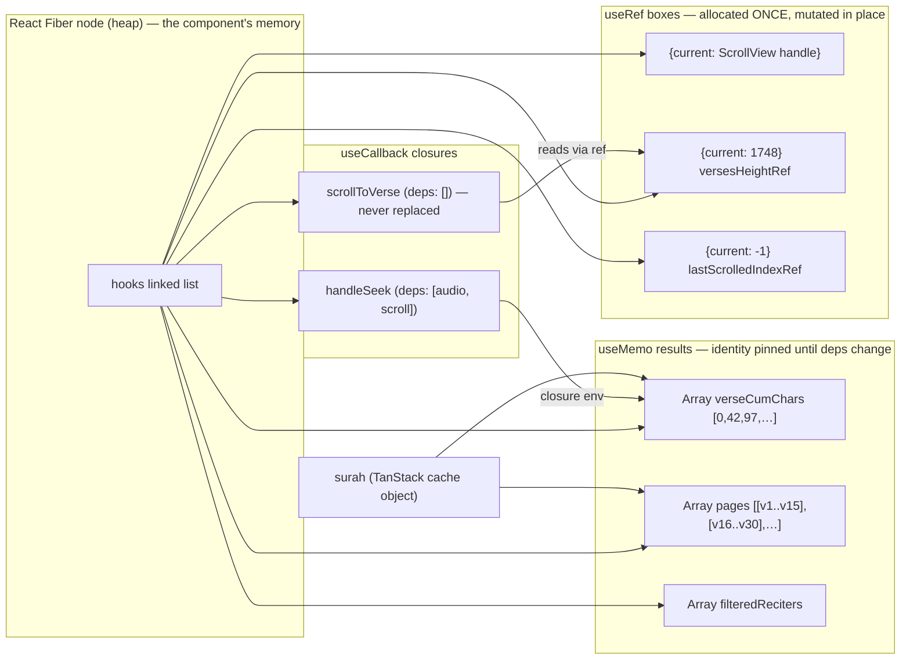
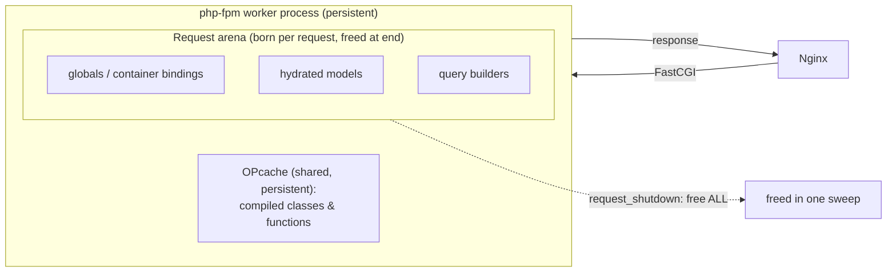
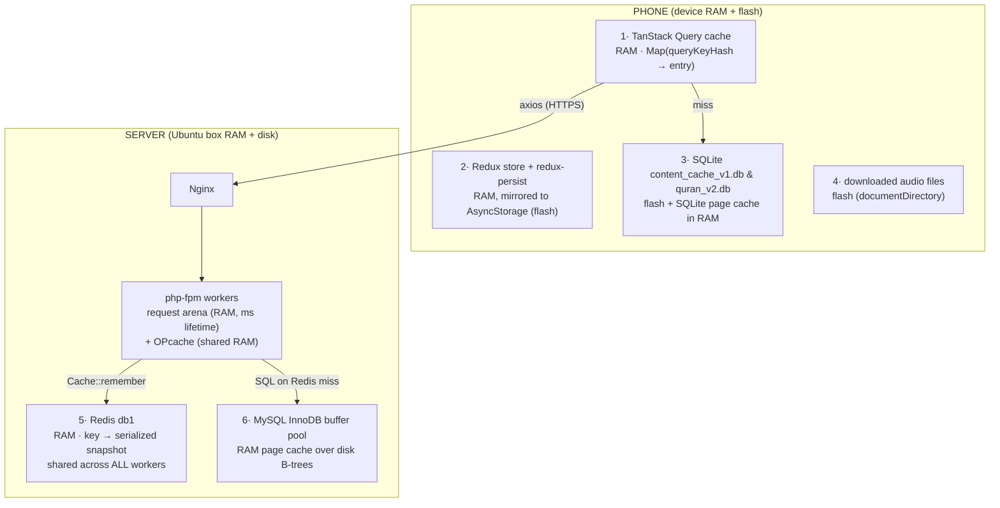

# 80. Visual Memory Atlas — The Stack and the Heap, Drawn

> *Everything in §70 and §78 described memory in words. This section draws it.
> Every diagram below depicts the real code of this project — the reader hooks, the
> Eloquent models, the Redux store — box by box, pointer by pointer. Two engines are
> covered side by side: **Hermes** (the JS engine running the mobile app) and the
> **PHP-FPM worker** (running the Laravel backend). The mental model is identical in
> both: a small, fast, self-cleaning **stack** for calls, and a large, garbage- or
> request-collected **heap** for objects.*

## 80.1 The two regions, drawn

Every running program owns (at least) these memory regions:

```
        LOW ADDRESSES                                      HIGH ADDRESSES
  ┌───────────────┬──────────────┬───────────────────────┬───────────────┐
  │  CODE (text)  │ GLOBALS/DATA │  HEAP  ──── grows ──▶ │ ◀── grows ─── │
  │  compiled fns │ module scope │  objects, arrays,     │     STACK     │
  │  (read-only)  │ singletons   │  closures, strings    │  call frames  │
  └───────────────┴──────────────┴───────────────────────┴───────────────┘
                                     managed by GC             managed by
                                     (Hermes) or               CALL/RETURN
                                     request-end free (PHP)    automatically
```

* **Stack** — one *frame* per function call, holding parameters, local scalars, and
  the return address. Allocation is a pointer bump (nanoseconds); deallocation is
  automatic the instant the function returns. Size is small (~1 MB per JS thread,
  configurable in PHP) — which is why deep recursion overflows it.
* **Heap** — everything whose lifetime outlives a single call: objects, arrays,
  strings, closures, class instances. Allocation is slower, and reclamation needs a
  strategy: Hermes runs a **generational garbage collector**; a PHP-FPM worker
  refcounts zvals continuously and then **frees the entire request arena** when the
  response is sent.
* **Globals / module scope** — in JS, top-level `const`/`let` of a module (e.g. the
  `dbPromise` singleton in §81.2) live here for the app's whole life. In PHP,
  statics and OPcache'd class definitions survive across requests inside a worker.

The golden rule that everything below illustrates: **a variable on the stack never
*contains* an object — it contains either a primitive value or a *pointer* (an
address) to an object on the heap.**

## 80.2 A real call, frame by frame: `getIdxAtMs(5300)`

Take the playback-highlight lookup from [useReaderScroll.ts](mobile/src/hooks/useReaderScroll.ts)
(§78.1) and freeze time at the moment audio position `5300 ms` is resolved to a
verse. Three frames are on the stack; the timing array is on the heap:

```
  STACK (grows downward)                         HEAP
 ┌──────────────────────────────┐
 │ frame: playback effect       │
 │   idx        = ?             │      ┌────────────────────────────────┐
 │   (awaiting return value)    │  ┌──▶│ Array: verseTiming  (length 7) │
 ├──────────────────────────────┤  │   │ [0]──▶{timestampFrom:     0 }  │
 │ frame: getIdxAtMs (wrapper)  │  │   │ [1]──▶{timestampFrom:  4100 }  │
 │   ms         = 5300          │  │   │ [2]──▶{timestampFrom:  9800 }  │
 │   → calls getIdxAtMsRef      │  │   │ [3]──▶{timestampFrom: 15400 }  │
 ├──────────────────────────────┤  │   │  …                             │
 │ frame: getIdxAtMsRef.current │  │   └────────────────────────────────┘
 │   posMs      = 5300   (num)  │  │      each element is itself a
 │   i          = 1      (num)  │  │      pointer to a small heap object
 │   [closure ptr]──────────────┼──┘
 └──────────────────────────────┘
       ▲ pops instantly on return — posMs and i cease to exist
```

Walking the loop: `i` starts at `6`, the comparisons `posMs >= verseTiming[i].timestampFrom`
fail for `i = 6…2`, succeed at `i = 1` (`5300 >= 4100`) → `return 1`. Three facts the
picture makes obvious:

1. `posMs` and `i` are **stack numbers** — no allocation, no GC pressure, even at 4
   calls/second during playback.
2. The function reaches `verseTiming` **through the closure pointer**, not through an
   argument — the array itself was allocated on the heap *once* (when the timing API
   responded) and is only *read* here.
3. When the frames pop, nothing on the heap changes — the array's refcount/reachability
   is untouched, so this hot path creates **zero garbage**.

## 80.3 The mounted reader, as a heap graph

When the Mushaf screen is mounted, the orchestrator and its four domain hooks (§76)
have created this object graph. Boxes are heap objects; arrows are pointers; the
labels show which hook allocated each box:



Reading this graph tells you the *cost model* of a re-render:

* On a re-render where no deps changed, React walks the hooks list and **reuses every
  box above** — the only new allocations are the transient JSX element objects.
* When `surah` changes (user navigates to another surah), exactly `M1`, `M2` and the
  fractions arrays are re-allocated; the old ones become unreachable and the GC
  reclaims them. The `useRef` boxes `R1–R3` are *never* replaced for the life of the
  screen.
* `C1`'s dependency array is `[]`, so its closure is allocated **once**; that is
  why passing it into `useReaderSearch` never invalidates that hook's callbacks
  (§76.5).

## 80.4 A closure, dissected: what `handleSeek` actually captures

A closure is **a function object plus a pointer to the environment it was created
in**. Here is `handleSeek` (§76.2) at the moment of creation:

```
     HEAP
 ┌──────────────────────────────┐        ┌───────────────────────────────┐
 │ Function object: handleSeek  │        │ Environment record (render #N)│
 │  code ptr ──▶ compiled body  │        │   audio  ──▶ {seekTo, play,…} │
 │  env  ptr ───────────────────┼───────▶│   scroll ──▶ {getIdxAtMs,     │
 └──────────────────────────────┘        │              scrollToVerse,   │
                                         │              …refs…}          │
                                         └───────────────────────────────┘
```

* The **environment record** is a heap object holding the variables the function
  body references (`audio`, `scroll`) — *not* copies of their values, but pointers
  to the same objects the render saw.
* This is precisely the mechanics of the **stale closure** problem (§69): if
  `handleSeek` were memoized with `[]` deps but read `verseTiming` directly, its
  environment record would forever point at the *first* render's (empty) timing
  array. The refactor's fix (§76.5) is to route freshness *through a ref*: the
  environment captures `scroll.getIdxAtMs` — a stable wrapper — and the wrapper
  reads `getIdxAtMsRef.current`, which is re-pointed at a fresh closure every
  render. The identity stays; the data flows.

```
   stable wrapper (allocated once)          re-pointed every render
   getIdxAtMs ──▶ [code: call ref.current] ──▶ getIdxAtMsRef{current ─┐}
                                                                      │ render N   ──▶ closure over timing v1 (GC'd)
                                                                      └ render N+1 ──▶ closure over timing v2  ✓ live
```

The GC angle: each render's discarded body closure is small (one function object +
env pointer) and dies young — exactly the population Hermes's **young-generation
collector** reclaims almost for free. This is why "reassign a ref every render" is
cheap while "re-create every callback every render" (which forces child re-renders)
is expensive: the cost of a re-render is not the allocation, it is the **prop
identity change** that cascades reconciliation work (§70).

## 80.5 Hermes hidden classes — why every `Verse` object having the same shape matters

Hermes (like V8) attaches a **hidden class** (shape map) to every object, describing
"property `id` at slot 0, `verse_number` at slot 1, …". Objects created with the
same properties *in the same order* share one hidden class:

```
  verse[0] ─┐                     ┌────────────────────────────────┐
  verse[1] ─┼── all point to ───▶ │ HiddenClass "Verse shape"      │
  verse[2] ─┘                     │  id            → slot 0        │
   each object stores ONLY        │  surah_id      → slot 1        │
   its slot values:               │  verse_number  → slot 2        │
   [287, 2, 32, ptr→text,…]       │  text          → slot 3 (ptr)  │
                                  └────────────────────────────────┘
```

Because the API serializer (Laravel's `VerseResource`) always emits the same keys in
the same order, `JSON.parse` builds 286 verse objects **sharing one hidden class**.
Two consequences:

* **Speed** — `v.text.ar` compiles to "load slot 3, then slot 0" (two indexed loads),
  not a dictionary lookup by string key.
* **Memory** — the property-name table exists **once**, not 286 times; each verse is
  just a compact slot array.

This is also why the codebase never does `delete obj.prop` or adds ad-hoc properties
to API objects (instead it *spreads* into a new object, as in `{...r, accessible}` in
§77.3): mutating the shape would fork the hidden class and de-optimize every
subsequent property access. The spread creates a *new* shape shared by all
`AccessibleRecording`s — same trick, one level up.

## 80.6 The PHP side — a request's memory, born and destroyed

PHP's execution model is the opposite of the always-alive JS app: **memory is
request-scoped**. One FPM worker process serves one request at a time:



* **OPcache** holds the *compiled bytecode* of every class (`Disease`, `ModelCache`,
  the whole framework) in shared memory — this is the "CODE" segment of §80.1 and it
  survives across requests. It is why the second request is fast: no re-parsing of
  ~10 000 PHP files.
* The **request arena** holds every object your code allocates — the service
  container, the hydrated `Category` models, the `Builder` from
  `Recording::where(...)`. When the response is flushed, the engine frees the whole
  arena. A memory leak in PHP therefore lasts milliseconds — but it also means
  **nothing in a worker's heap can be a cache**. Anything worth remembering must be
  written *outside* the process: to Redis, the database, or the filesystem. That
  single fact is the reason `ModelCache` exists (§81.4).

## 80.7 zvals and copy-on-write, drawn on real model code

Every PHP variable is a **zval** — a small struct holding a type tag and either the
value (ints, floats, bools: stored inline, stack-like) or a pointer to a
refcounted heap structure (strings, arrays, objects). Arrays are **copy-on-write**:

```php
$attributes = $model->getAttributes();   // used inside ModelCache::snapshot()
$copy       = $attributes;               // NO copy happens here
$copy['x']  = 1;                         // NOW the engine duplicates the array
```

```
   step 2 (assignment):                    step 3 (write):
   $attributes ─┐                          $attributes ──▶ [array A]  refcount 1
                ├──▶ [array A] refcount 2
   $copy ───────┘                          $copy ────────▶ [array A'] refcount 1
                                                            (duplicated on write)
```

Consequences visible in this codebase:

* `ModelCache::snapshot()` returning `$model->getAttributes()` costs **no copy** —
  the snapshot array shares the model's internal attribute storage until either side
  writes. Passing big arrays around in PHP is cheap *until mutation*.
* **Objects are different**: `$a = $b` for objects copies only the *handle* — both
  names point to the same instance (like JS). That is why `rehydrate()` must build a
  `new $snapshot['class']` per cache read (§81.4): handing two requests… or two
  callers… the same mutable model instance would let one caller's mutation leak into
  another's response.

An Eloquent model instance, in heap terms, is three arrays behind one object handle:

```
  Disease object (heap)
  ├── attributes: ['id'=>7,'name'=>'{"ar":"القلق","en":"Anxiety"}','slug'=>'anxiety',…]   ← raw DB row
  ├── original:   [ …identical copy at hydration time… ]                                  ← for isDirty()
  ├── relations:  ['recordings' => Collection ──▶ [Recording, Recording, …]]              ← eager-loaded graph
  └── (casts cache, exists flag, …)
```

`isDirty('name')` — the guard in `Disease::updating` (§77.4) — is now visually
obvious: it is nothing more than `attributes['name'] !== original['name']`, a
comparison between the two top arrays. And the *memory doubling* is the price:
every hydrated model keeps two copies of its row, which is exactly why bulk
operations use `$siblings->update([...])` (§78.7) instead of hydrating models —
one `UPDATE` statement touches zero PHP heap per row.

---

# 81. The Cache Atlas — Where Every Cached Byte Physically Lives

> *The project caches at **six** distinct layers. This section maps them: for each
> layer, which physical memory holds the bytes, who owns the lifetime, what the data
> structure is, and the exact project code that reads/writes it — line by line.*

## 81.1 The whole system on one map



| # | Layer | Physical location | Data structure | Lifetime owner | Written by |
|---|-------|-------------------|----------------|----------------|-----------|
| 1 | TanStack Query | phone **RAM** (Hermes heap) | `Map` keyed by hashed `queryKey` | `staleTime`/`gcTime` + app process | `useQuery` fetchers |
| 2 | Redux + persist | phone RAM, journaled to **flash** | one big immutable object tree | app lifetime; rehydrated on launch | reducers (Immer) |
| 3 | SQLite kv caches | phone **flash** (B-tree pages) | `kv(key TEXT PK, value TEXT)` | forever, until overwritten | `cachedFetch` (§81.3) |
| 4 | Audio downloads | phone flash files | files named `surah_{id}_reciter_{id}.mp3` | user-controlled (download/delete) | `audioService` |
| 5 | Redis db1 | server **RAM** (single process) | key → PHP-serialized snapshot array, TTL | TTL + `InvalidatesCache` events | `ModelCache` (§81.4) |
| 6 | InnoDB buffer pool | server RAM over **disk** | 16 KB B-tree pages, LRU | MySQL, transparent | every query |

The design rule the map encodes: **each layer only ever falls through to the layer
below it, and every layer can serve the app alone if the layers to its right die.**
Airplane mode → layers 1–4 serve everything text/audio previously seen. Redis down →
the `AppServiceProvider` fallback (§53) drops to file/database cache. MySQL is the
only true source of truth; everything else is disposable acceleration.

## 81.2 Layer 3's engine room — `contentCache.ts` line by line

The mobile offline cache is deliberately tiny — a key/value table over SQLite.
[contentCache.ts](mobile/src/services/contentCache.ts), complete:

```ts
let dbPromise: Promise<SQLite.SQLiteDatabase> | null = null;

function getDb(): Promise<SQLite.SQLiteDatabase> {
  if (!dbPromise) {
    dbPromise = SQLite.openDatabaseAsync('content_cache_v1.db').then(async (db) => {
      await db.execAsync(
        'CREATE TABLE IF NOT EXISTS kv (key TEXT PRIMARY KEY NOT NULL, value TEXT NOT NULL);',
      );
      return db;
    });
  }
  return dbPromise;
}
```

| Line | Input | Output / effect | Why |
|---|---|---|---|
| `let dbPromise: … \| null = null;` | — | one **module-scope** variable | Lives in the module's environment (the "globals" segment, §80.1) for the whole app run — the memoization slot for the singleton. |
| `if (!dbPromise)` | current slot | branch | `!` (logical NOT, §79.2): "not yet opened". Only the *first* caller enters. |
| `dbPromise = SQLite.openDatabaseAsync(…)` | filename | a **Promise** stored immediately | **Promise-as-singleton**: the promise is assigned *before* it resolves, so ten concurrent callers all await the *same* in-flight open — no race that opens the DB ten times. This is memoizing the *operation*, not the result. |
| `.then(async (db) => { await db.execAsync('CREATE TABLE IF NOT EXISTS …'); return db; })` | the open handle | the same handle, after schema | Schema migration is chained *inside* the promise, so no caller can see a database whose table doesn't exist yet. `IF NOT EXISTS` makes it idempotent across launches. |
| `return dbPromise;` | — | the shared promise | Every subsequent call is O(1): return the already-resolved promise. |

```
   MODULE SCOPE (heap, app-lifetime)
   dbPromise ──▶ Promise{fulfilled} ──▶ SQLiteDatabase handle ──▶ [flash file: content_cache_v1.db]
        ▲                                                            B-tree: kv(key PK → value)
        └── every getDb() call returns this same pointer
```

```ts
export async function cachedFetch<T>(cacheKey: string, fetcher: () => Promise<T>): Promise<T> {
  try {
    const data = await fetcher();                    // 1  network first
    void contentCache.setItem(cacheKey, data);       // 2  fire-and-forget write-behind
    return data;                                     // 3  fresh data wins
  } catch (error) {
    const cached = await contentCache.getItem<T>(cacheKey);   // 4  fall back to flash
    if (cached !== null) return cached;              // 5  serve stale
    throw error;                                     // 6  nothing cached → real failure
  }
}
```

| Line | Input | Output | Why |
|---|---|---|---|
| 1 | the API call closure | fresh `T` or throws | **Network-first** policy: text content changes in the CMS, so freshness beats latency when online. |
| 2 | key + fresh data | row upserted (async) | `void` discards the promise deliberately — the caller must **not** wait for a flash write to render. This is a *write-behind* cache; a failed write is swallowed inside `setItem` (`catch {}`) because cache persistence is best-effort. |
| 4 | the key | last good copy or `null` | Only on failure. `JSON.parse` re-inflates the stored string into fresh heap objects. |
| 5 | cached copy | serve it | Stale-but-present beats an error screen — the *offline-first* contract. |
| 6 | — | rethrow | First launch + offline: there is genuinely nothing to show; let the UI error state handle it. |

Note the interplay of layers 1 and 3: `useRecordings` (§77.3) wraps *this* function
as its TanStack `queryFn`. So a screen read is: TanStack RAM map → (miss/stale) →
`cachedFetch` → network → (fail) → SQLite. Three tiers, each with its own memory.

## 81.3 Layer 1, drawn — what the TanStack Query cache looks like in RAM

```
   QueryClient (Hermes heap, app-lifetime)
   └── QueryCache
       └── Map
           ├── '["recordings",12]'  ──▶ Query{ state:{ data ──▶ [Recording, …],
           │                                            dataUpdatedAt: 1720…,
           │                                            status:'success' },
           │                                    observers:[ hook on Disease screen ] }
           ├── '["surah",2]'        ──▶ Query{ data ──▶ SurahWithVerses(286 verses) }
           └── '["adhkar"]'         ──▶ Query{ … }
```

* The key is the **serialized queryKey** (`cacheKeys.recordings(diseaseId)` →
  `["recordings", 12]` → a stable JSON string). Structural, not referential —
  two hooks with equal keys share one entry.
* `staleTime: FIVE_MIN` is not an eviction — it is a *freshness label*. Within 5
  minutes, a remount **reads the map and never touches the network** (0 ms, 0
  bytes). After it, the map still serves instantly, but a background refetch is
  queued.
* Eviction (`gcTime`, default 5 min) happens only when **no observer** (mounted hook)
  is attached — the entry's `data` pointer is dropped and Hermes's GC reclaims the
  object graph. RAM cost is therefore bounded by "what the user recently looked at".

## 81.4 Layer 5 — the exact bytes `ModelCache` puts in Redis

[ModelCache.php](backend/app/Support/ModelCache.php) never stores model *objects*;
it stores a **primitive snapshot** — the recursion in `snapshot()` is a
**depth-first traversal** of the loaded relation graph:

```php
private static function snapshot(Model $model): array
{
    $relations = [];
    foreach ($model->getRelations() as $name => $value) {          // walk loaded relations only
        $relations[$name] = match (true) {
            $value instanceof EloquentCollection,
            $value instanceof SupportCollection => [
                'type'  => 'many',
                'items' => $value->map(static fn (Model $m): array => self::snapshot($m))->all(),  // recurse ↓
            ],
            $value instanceof Model => ['type' => 'one', 'model' => self::snapshot($value)],       // recurse ↓
            default                 => ['type' => 'null'],
        };
    }
    return [
        'class'      => $model::class,
        'attributes' => $model->getAttributes(),   // raw DB values incl. withCount() aggregates
        'relations'  => $relations,
    ];
}
```

| Line | Input | Output | Why |
|---|---|---|---|
| `foreach ($model->getRelations() …)` | the model's `relations` array (§80.7) | iterates *only relations that were eager-loaded* | Lazily-unloaded relations are simply absent — the snapshot never triggers extra queries. |
| `match (true)` with `instanceof` arms | each relation value | a tagged array `{type: many\|one\|null}` | A **tagged union**: the type tag is stored *with* the data so `rehydrate` can decode without guessing. Same dedup idiom as §77.2. |
| `$value->map(… self::snapshot …)` | a Collection of child models | array of child snapshots | **Recursion = DFS**: children are flattened before the parent's array is closed. Depth is bounded by the relation tree (Category→Subcategory→Disease ≈ 3), so no stack-overflow risk (§80.1). |
| `'attributes' => $model->getAttributes()` | the raw attribute array | shared (COW, §80.7) | Raw DB values — no casts applied — so rehydration via `setRawAttributes` reproduces the model *exactly*, including `withCount` aggregates like `recordings_count`. |

**What a cached `Category` (with subcategories) physically looks like inside Redis'
RAM** — a PHP-serialized string under one key in keyspace **db1**:

```
  Redis (server RAM, single process, shared by ALL php-fpm workers)
  db1
  └── "quran_cache:categories.tree"  (TTL: 3600s)
      └── value: serialized bytes of ↓
          [ ['class' => 'App\Models\Category',
             'attributes' => ['id'=>1,'name'=>'{"ar":"…","en":"…"}','type'=>'standard',…],
             'relations'  => ['subcategories' => ['type'=>'many','items' => [
                 ['class'=>'App\Models\Subcategory','attributes'=>[…],'relations'=>[…]],
                 …
             ]]]],
            … one entry per category … ]
```

The read path (`rememberMany`, §53) then runs `rehydrate()` — the mirror-image DFS
that allocates `new $snapshot['class']` per node **in the current request's arena**
(§80.6), reattaches children with `setRelation`, and hands the service real models.
Every request gets *its own* fresh model instances from the *shared* byte snapshot —
that is the object-identity safety discussed in §80.7.

**Why Redis is the right physical home:** the FPM workers' heaps die per-request
(§80.6) and don't share memory with each other. Redis is one long-lived process
whose keyspace all workers reach over a local socket — the *only* RAM on the server
that is both persistent-across-requests and shared-across-workers. Its single-threaded
event loop also makes every command atomic: two workers can `Cache::remember` the
same key concurrently and at worst compute the value twice; they can never interleave
half-written bytes.

## 81.5 Invalidation — how a CMS edit ripples through the layers

```mermaid
sequenceDiagram
    participant Admin as Filament admin
    participant M as Disease model
    participant T as InvalidatesCache trait
    participant R as Redis db1
    participant App as Phone
    Admin->>M: save() (name edited)
    M->>M: updating: isDirty('name') → assignSlug()
    M->>T: saved event fires
    T->>R: Cache::forget(DiseaseService::CACHE_KEYS…)
    Note over R: stale snapshots deleted — next API read recomputes
    App->>App: staleTime expires (≤5 min) → background refetch
    App->>R: GET /diseases → miss → MySQL → fresh snapshot cached
    App->>App: TanStack swaps data ptr → re-render; SQLite overwritten write-behind
```

Each layer has its own invalidation clock, and they compose: **server-side, events
delete precisely** (the `InvalidatesCache` trait's `saved`/`deleted`/`restored`
hooks, §53); **client-side, time heals** (`staleTime` + `refetchInterval` mean the
phone converges within minutes without any push channel). The SQLite layer never
invalidates at all — it is only read when the network already failed, where "the last
thing you saw" is by definition the best available answer.

---

# 82. One Tap, Every Memory Region — the Complete Journey

> *Closing synthesis: the user taps the "Anxiety" disease card and presses play on
> session 1. Below is every memory region that byte-shuffles as a result, in order,
> with the code that runs at each hop. If you can follow this table, you understand
> the entire system.*

| # | Region (physical) | What happens | Code |
|---|---|---|---|
| 1 | Phone RAM — Hermes stack | `onPress` closure frame pushed; `router.push('/disease/7')` | hospital routing state machine (§72) |
| 2 | Phone RAM — Fiber tree | Expo Router mounts the screen; hooks list allocated (§80.3) | `useRecordings(7)` |
| 3 | Phone RAM — TanStack map | key `'["recordings",7]'` looked up — miss (first visit) | §81.3 |
| 4 | Phone RAM — axios | request object built; interceptor stamps `Authorization: Bearer` from SecureStore | `apiClient.ts` |
| 5 | Radio → server | HTTPS bytes to Nginx | — |
| 6 | Server RAM — FPM arena | worker builds container, resolves `RecordingController` → service → repository (§35–40) | DI chain |
| 7 | Server RAM — Redis db1 | `Cache::remember('recordings.disease.7', …)` — **hit**: serialized snapshot returned in ~0.2 ms; MySQL untouched | `ModelCache::rememberMany` (§81.4) |
| 8 | Server RAM — FPM arena | DFS `rehydrate()` allocates fresh `Recording` models; Resource serializes to JSON; **arena freed** after flush (§80.6) | `RecordingResource` |
| 9 | Phone RAM — Hermes heap | `JSON.parse` builds recording objects sharing one hidden class (§80.5); TanStack stores the array; `useMemo` derives `AccessibleRecording[]` (§77.3) | `useRecordings` |
| 10 | Phone flash — SQLite | write-behind `setItem('clinic_recordings_7', …)` upserts the kv row (§81.2) | `cachedFetch` |
| 11 | Phone RAM — Redux | play press dispatches; `PlayerContext` engine loads the stream URL; `loadingActive` toggles per the effect in §79.5 | `PlayerContext.tsx` |
| 12 | Phone RAM — refs | playback ticks mutate `lastScrolledIndexRef` etc. with **zero** re-renders until a verse boundary (§78.5) | reader hooks |

Twelve hops, six memory regions, and the only *disk* touched on the entire hot path
is the phone's own flash — asynchronously, off the render path. That is the
architecture in one sentence: **RAM at every layer, disk only as parachute, and no
byte copied twice where a pointer would do.**

---

*This block (§80–82) drew the memory model: stack frames and heap graphs for the
real reader code, closure environments and the ref-freshness pattern, Hermes hidden
classes, PHP-FPM's request arena and zval copy-on-write, the atlas of all six cache
layers, and the twelve-hop journey of a single tap.*

*The reference continues at **§83**, the **Algorithm Animation Gallery** — every
core algorithm in the project drawn **step by step, pointer by pointer**: the
reverse scan, binary search, prefix-sum build, Fisher–Yates shuffle, hash-set
lookup vs. array scan, the sort comparator, and slug linear probing — followed by
**§84**, which draws how Eloquent loads the category→subcategory→disease tree in
three queries with an in-memory dictionary match instead of the N+1 trap.*
