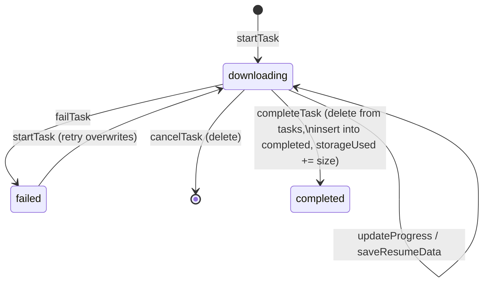

# 85. Complete Code Atlas I — the Mobile Network & Storage Spine

> *From here to §89 the document sweeps the rest of the codebase file by file. The
> ground rule: **no concept is explained twice**. Where a file uses a mechanism
> already drawn (heap boxes §80, bucket jumps §83.5, prefix sums §83.3, guard-clause
> `!` §79.2), the walkthrough cross-references it and spends its space on what is
> *new* in that file — its pointers, its null policy, and who it talks to.*

## 85.1 `api.ts` — a live binding: the one variable the whole app watches

Every request in the app resolves its base URL through one exported variable in
[api.ts](mobile/src/services/api.ts):

```ts
// `let` is intentional: resolveApiBaseUrl() reassigns this once at startup;
// apiClient reads it at request time via the ES module live binding.
export let API_URL: string = OVERRIDE_API_URL ?? (__DEV__ ? LOCAL_API_URL : PRODUCTION_API_URL);
```

**The mechanism — ES module live bindings — drawn.** An `import` does *not* copy
the value; it creates a read-only *view onto the exporting module's binding slot*:

```
   module record: services/api.ts (heap, app-lifetime — §80.1 "globals")
   ┌─────────────────────────────────────────────┐
   │ binding "API_URL" ──▶ "http://10.0.2.2:8000/api"   ← slot, mutable by let
   └─────────────────────────────────────────────┘
            ▲                    ▲
   apiClient.ts reads      resolveApiBaseUrl()
   THROUGH the binding     REASSIGNS the slot once at startup
   at request time         (never copies to importers — they see the new value)
```

This is why the request interceptor writes `config.baseURL = api.API_URL` freshly
**per request** (namespace import `* as api` keeps the binding live) instead of
destructuring `const { API_URL } = …` at module load — destructuring would snapshot
the *initial* string into a local `const` and never see the startup reassignment.
Same identity-vs-freshness split as the ref pattern in §76.5, one level down: the
*binding* is stable, the *value* flows.

The URL detection itself (`getLocalApiUrl`) is a **fallback chain** — each line only
runs if the previous produced nothing, an `??`/guard ladder ending in a hard default:

```ts
const hostUri = Constants.expoConfig?.hostUri ??            // 1 dev-server host
  (Constants as {…}).expoGoConfig?.debuggerHost;            // 2 Expo Go host
let host = typeof hostUri === 'string' ? hostUri.split(':')[0] : undefined;
if (!host && typeof Constants.linkingUri === 'string') {    // 3 parse linking URI
  const m = Constants.linkingUri.match(/^exp?:\/\/([^:/]+)/);
  if (m?.[1]) host = m[1];                                  //   m is null on no-match → ?.
}
if (Platform.OS === 'android' && (!host || host === 'localhost' || host === '127.0.0.1')) {
  return 'http://10.0.2.2:8000/api';                        // 4 emulator loopback alias
}
return host ? `http://${host}:8000/api` : 'http://localhost:8000/api';  // 5 final default
```

Note the two null idioms working together: `?.` **propagates** absence (a `null`
regex match becomes `undefined` index access, no crash), while the final ternary
**terminates** absence with a concrete default. Rule of thumb used all over this
codebase and catalogued in §88: *propagate in the middle of a chain, terminate at
the boundary.*

## 85.2 `apiClient.ts` — the retry as a state machine carried on the request object

[apiClient.ts](mobile/src/services/apiClient.ts) implements the local→production
fallback (the rule in `CLAUDE.md`). The interesting engineering is *where the retry
state lives*: not in a module variable, not in Redux — **on the request config
object itself**:

```ts
type RetryableConfig = AxiosRequestConfig & { _localFallbackAttempted?: boolean };
```

```
  request #1 (heap object, one per call)          the SAME object, mutated, resubmitted
  ┌────────────────────────────────┐   error    ┌────────────────────────────────┐
  │ url: '/diseases'               │  ───────▶  │ url: '/diseases'               │
  │ baseURL: LOCAL_API_URL         │  (404 or   │ baseURL: PRODUCTION_API_URL ✎  │
  │ _localFallbackAttempted: ∅     │   network) │ _localFallbackAttempted: true ✎│
  └────────────────────────────────┘            └────────────────────────────────┘
                                                        │ apiClient.request(config)
                                                        ▼
                                    request interceptor sees the flag → does NOT
                                    overwrite baseURL back to local  → cycle broken
```

The flag is a **visited marker** — the same trick that stops graph traversals from
looping (§84.4's DFS relies on tree shape; here the "graph" is `request → error →
request` and could cycle forever, so the marker caps it at exactly one retry). Two
guards make the retry *safe*, both visible in the condition:

```ts
if (
  config &&
  !config._localFallbackAttempted &&                    // visited marker (cycle break)
  config.baseURL === api.LOCAL_API_URL &&               // only falls FORWARD, never prod→local
  (!error.response || error.response.status === 404)    // only "not there", never "you failed"
)
```

`!error.response` (no response object at all) *is* the network-failure test — axios
attaches `response` only when the server answered. 401/403/422 all have a
`response`, fail the third clause, and surface immediately: a wrong token on local
must not be "healed" by asking production, where it would be wrong too.

**`ApiError` and the prototype chain.** Every failure is normalized into one typed
error class:

```ts
export class ApiError extends Error {
  status: number; isNetworkError: boolean; isSubscriptionRequired: boolean;
  fieldErrors: Record<string, string[]> | null;
}
```

```
   apiError instance ──proto──▶ ApiError.prototype ──proto──▶ Error.prototype ──proto──▶ Object.prototype
   own slots: status=403,        (methods, name)               (message, stack)
   isSubscriptionRequired=true
```

The prototype chain (§69's hidden-class cousin: shape for *data*, prototype for
*behaviour*) is what lets every catch site test `err instanceof ApiError` — the
`instanceof` operator walks exactly the arrow chain drawn above. The class turns
axios's loosely-shaped errors into a **closed contract**: hooks never touch
`error.response?.data?.message ?? …` themselves; the coalescing chain
`data?.message ?? error.message ?? 'Request failed'` runs once, here, at the
boundary (§88's "terminate at the boundary" again).

**Envelope unwrapping — the two halves of one contract.** The backend trait (§87.1)
wraps every payload as `{success, message, data, meta?}`; the client helpers unwrap
it symmetrically:

```ts
export async function apiGet<T>(url: string, config?): Promise<T> {
  const res = await apiClient.get<ApiEnvelope<T>>(url, config);
  return res.data.data;          // axios body (.data) → envelope field (.data)
}
export async function apiGetPaginated<T>(url: string, config?): Promise<Paginated<T>> {
  const res = await apiClient.get<ApiEnvelope<T[]>>(url, config);
  return { items: res.data.data ?? [], meta: res.data.meta ?? FALLBACK_META };
}
```

`res.data.data` reads oddly until you see the two layers: outer `.data` is *axios's*
name for the HTTP body; inner `.data` is *the project envelope's* payload field.
The paginated variant terminates both possible absences with typed defaults —
`?? []` (empty list renders an empty screen, not a crash) and `?? FALLBACK_META`
(a **null-object**: a real `PaginationMeta` whose values mean "one page, nothing in
it", so no consumer ever branches on `meta === undefined`). `FALLBACK_META` is
allocated **once** at module scope and shared by every failed unwrap — safe only
because nothing ever mutates it; a frozen shared default is the cheapest null-object
there is.

Every service file (`ruqyahService`, `adhkarService`, `courseService`,
`sponsorService`, `feedbackService`, `favoriteService`, `featureService`,
`notificationService`, `aiService`…) is now just a **thin catalogue of typed
one-liners** over these three helpers — `getRecordings: (id) =>
apiGet<Recording[]>(\`/diseases/${id}/recordings\`)` and siblings. That is the
family pattern, stated once: *services own URLs and types, nothing else; all
transport policy lives in the two interceptors above.* (`quranService.ts` is the
one deliberate exception — it keeps its original `fetch` implementation so the
Mushaf path stays byte-for-byte stable.)

## 85.3 `useReciterAvailability.ts` — three-valued logic, a race, and a module-scope cache

[useReciterAvailability.ts](mobile/src/hooks/useReciterAvailability.ts) decides
which reciters to hide because their CDN audio 404s. It packs four mechanisms not
seen elsewhere:

**1 — A trinary result type.** The probe deliberately returns `boolean | null`:

```ts
async function probe(url: string, signal: AbortSignal): Promise<boolean | null> {
  const res = await fetch(url, { method: 'GET', headers: { Range: 'bytes=0-1' }, signal });
  if (res.status >= 200 && res.status < 300) return true;    // proven reachable
  if (res.status >= 400 && res.status < 500) return false;   // proven missing
  return null;                                               // 5xx → UNKNOWN
} // catch → null (abort/timeout/network → UNKNOWN)
```

```
        true ── "I saw a 2xx"          → keep reciter
        false ─ "I saw a 4xx"          → hide reciter        only DEFINITIVE
        null ── "I couldn't find out"  → keep reciter        evidence removes
```

Two-valued logic can't express this policy: collapsing "unknown" into `false` would
hide valid reciters on every flaky connection. The `null` here is not a missing
value — it is a **third truth value**, and the caller tests it explicitly
(`if (result === null) return;`), never with `!result` (which would confuse `false`
and `null` — exactly the coercion trap §79.2 warns about; this is the file where the
distinction is load-bearing).

**2 — `Range: bytes=0-1`.** The probe downloads **two bytes** of a multi-megabyte
MP3 — the status code is the answer; the body is irrelevant. (HEAD would be the
textbook verb, but some CDNs reject it; a 2-byte ranged GET is the pragmatic
equivalent.)

**3 — A module-scope `Map` as a session cache.**

```ts
const availabilityCache = new Map<string, boolean>();   // audioUrl → verdict
…
let reachable = availabilityCache.get(url);
if (reachable === undefined) { /* probe, then cache */ }
```

The `Map` lives in the module record (§85.1's drawing) — it outlives every screen,
so navigating Surah 2 → 3 → 2 re-probes **nothing**. Note the miss test:
`=== undefined`, not `!reachable` — because `false` is a *valid cached verdict* and
falsy. `Map.get`'s "not there" sentinel (`undefined`) and the stored value domain
(`true | false`) must not overlap; here they don't, but only because the test is
exact. One more entry for the §88 catalog.

**4 — The unmount race, closed twice.**

```ts
const ctrl = new AbortController();
let active = true;
(async () => { …await Promise.all(probes)…; if (active) setUnavailableReciterIds(next); })();
return () => { active = false; ctrl.abort(); };
```

```
  mount ────── probes flying ──────╳ unmount
                                   │
       ctrl.abort() ──▶ in-flight fetches reject NOW (frees sockets)
       active=false ──▶ the closure's final setState is SKIPPED
                        (a resolved probe from screen A must not
                         write into screen B's state)
```

`ctrl.abort()` cancels the *network*; `active` cancels the *continuation*. You need
both: an already-resolved promise can't be aborted, so without the boolean the
`.then`-half would still run after unmount. `withTimeout` wraps each probe in
`Promise.race([probe, 8s timer → null])` — two racers, first settle wins, the loser's
result is discarded — so one dead CDN can't hold the whole `Promise.all` hostage.

Finally, the state update in `markUnavailable` shows the **immutable-Set discipline**:

```ts
setUnavailableReciterIds((prev) => {
  if (prev.has(reciterId)) return prev;      // no change → SAME reference → React bails out
  const next = new Set(prev); next.add(reciterId); return next;
});
```

Return the *same* reference when nothing changed (zero re-render, §70); copy-then-add
when it did (the `Set` twin of `[...arr]` in §83.4 — never mutate state in place).

## 85.4 `useDebounce.ts` — a timer's lifecycle on a timeline

```ts
export function useDebounce<T>(value: T, delay = 300): T {
  const [debounced, setDebounced] = useState<T>(value);
  useEffect(() => {
    const id = setTimeout(() => setDebounced(value), delay);
    return () => clearTimeout(id);            // cancel the PREVIOUS timer on every change
  }, [value, delay]);
  return debounced;
}
```

```
 keystrokes:   d ──── di ─── dis ──────────(pause ≥300ms)──────▶
 timer #1:     ├──╳ cleared by "di"'s cleanup
 timer #2:          ├──╳ cleared by "dis"'s cleanup
 timer #3:                ├────────300ms────────▶ fires → debounced = "dis"
                                                   └─▶ ONE query instead of three
```

The whole algorithm is the *cleanup ordering* React guarantees: before re-running an
effect, the previous cleanup runs — so every keystroke kills the pending timer and
arms a fresh one; only a 300 ms silence lets one survive. Ten timers may be created,
but at most one exists at a time (each dead timer's closure is young-generation
garbage, §80.4). Every search box in the app (`useDiseaseSearch`,
`useHospitalSearch`, the reciter picker) feeds its raw input through this one hook —
turning O(keystrokes) network requests into O(pauses).

## 85.5 `bookmarks.ts` + `mushafPages.ts` — small files, exact contracts

**`bookmarks.ts`** (AsyncStorage JSON list) is the smallest complete persistence
module in the app, and every function returns *the new list* so callers can
`setBookmarks(next)` without re-reading storage:

```ts
if (list.some((b) => b.surahId === surahId && b.pageIndex === pageIndex)) return list;  // dedupe
const next = [{ surahId, pageIndex, createdAt: new Date().toISOString() }, ...list];    // prepend
```

* `some(...)` — O(n) existence crawl (§83.5's array pointer walk; a `Set` is not
  worth it at bookmark counts, and the key is composite).
* Prepend-by-spread builds a **new** array with the newest first — the "My Reads"
  list renders in recency order with no sort, and the old array (still referenced by
  React state until the setState commits) is never mutated.
* Both storage touchpoints are wrapped `try/catch → safe default` (`[]` on read,
  swallow on write): a corrupted JSON blob degrades to "no bookmarks", never a
  crash. Same policy as `contentCache` (§81.2) — *storage is best-effort, UI is
  guaranteed*.

**`mushafPages.ts`** is pure arithmetic, shared by reader, bookmarks, and pager —
the constant `VERSES_PER_PAGE = 10` lives here **once** so all three agree:

```ts
for (let i = 0; i < verses.length; i += VERSES_PER_PAGE)      // pointer jumps 10 at a time
  chunks.push(verses.slice(i, i + VERSES_PER_PAGE));          // slice COPIES the window
return chunks.length > 0 ? chunks : [[]];                     // sentinel: one empty page
```

`slice` allocates page-arrays of *pointers to the same verse objects* — the verses
are never copied (287 pointers, not 287 verses; §80.3's graph gains one small array
per page). The `[[]]` fallback keeps the invariant **"there is always at least one
page"** so the pager's `pages[currentPageIndex]` can never index into an empty
array — a null-object for lists (compare `FALLBACK_META`, §85.2). Its two siblings
are the inverse (`floor(idx / 10)`) and the total (`max(1, ceil(n / 10))`) — the
same invariant enforced arithmetically.

---

# 86. Complete Code Atlas II — the Redux State Spine

## 86.1 The slice family pattern — stated once

All ten slices (`auth`, `downloads`, `favorites`, `ui`, `features`, `readings`,
`notifications`, `notificationInbox`, `onboarding`, `drivingMode`, `offlineQueue`)
share one anatomy, so it is described exactly once:

```
  createSlice({
    name        — the key under RootState
    initialState — a fully-populated object: NO field is ever undefined
    reducers    — "mutations" on an Immer draft (structural sharing, §70)
  })
  + exported selectors — the ONLY way components read the slice
```

Two family rules do the heavy lifting:

1. **`initialState` is total.** `{ user: null, status: 'idle', error: null }` —
   absent data is an explicit `null` (or `{}`/`0`/`false`), never a missing key.
   Selectors therefore never need `?.` on the slice itself; the *shape* is
   guaranteed at all times, only *values* carry nullability. This is the Redux
   mirror of `$fillable`-plus-defaults on the backend.
2. **Selectors are the null boundary.** Components consume booleans and lists, not
   raw nullable state:

```ts
export const selectIsPaid = (s: RootState): boolean =>
  !!s.auth.user && (s.auth.user.is_subscribed || s.auth.user.has_active_trial);
```

A guest (`user: null`) short-circuits to `false` — the `!!` coercion (§79.4)
guarantees the selector's return *type* stays `boolean` even though the expression
starts from `User | null`. Every premium gate in the app
(`selectCanAccessSession = sessionNumber <= 1 || selectIsPaid(s)`) composes from
this one selector, so the guest-degradation policy exists in exactly one line.

## 86.2 `downloadsSlice.ts` — a finite-state machine stored in a hash map

The download manager is the most stateful slice, and its two structures are chosen
for their access patterns:

```ts
interface DownloadsState {
  tasks: Record<number, DownloadTask>;          // recordingId → live task
  completed: Record<number, CompletedDownload>; // recordingId → finished artifact
  storageUsed: number;
  wifiOnly: boolean;
}
```

`Record<number, T>` is the object-literal hash map — `state.tasks[recordingId]` is
a bucket jump (§83.5), and `selectIsDownloaded` is `recordingId in s.downloads.completed`,
O(1) per card on a list screen. An array would make every progress tick an O(n)
`findIndex`. Each task then walks a **finite-state machine**, one reducer per edge:



The transition code shows the *move* semantics between the two maps:

```ts
completeTask(state, action: PayloadAction<CompletedDownload>) {
  const { recordingId } = action.payload;
  delete state.tasks[recordingId];               // leaves the live map
  state.completed[recordingId] = action.payload; // enters the archive map
  state.storageUsed += action.payload.size;      // running aggregate, O(1)
},
```

`storageUsed` is a **maintained aggregate** — the settings screen reads a number
instead of summing file sizes (the Redux twin of `withCount`, §84.3: keep the
integer, not the recount). Its decrement is clamped
(`Math.max(0, storageUsed - entry.size)`) so double-deletes can't drive it negative
— the same guard family as `Math.max(1, totalChars)` (§78.2). And every mutating
reducer starts with the existence guard `const task = state.tasks[id]; if (task) …`
— a progress event for a task the user already cancelled must be a silent no-op,
because native download callbacks keep firing after the state moved on (the Redux
twin of the `active` flag in §85.3).

The FSM's persistence story is split deliberately: only `completed` + `wifiOnly`
survive restarts (store transforms), while `tasks` is rebuilt by `DownloadResumer`
from `selectResumableTasks` — each task row carries everything needed to restart
(`downloadUrl`, `localPath`, `resumeData: string | null` — `null` meaning "the OS
gave no resume token, restart from byte 0": one more explicit-absence field for the
§88 catalog).

## 86.3 `cacheKeys.ts` — the key namespace as a typed constant tree

```ts
export const cacheKeys = {
  categories: ['categories'] as const,
  recordings: (diseaseId: number) => ['recordings', diseaseId] as const,
  diseases: (subcategoryId?: number) => ['diseases', subcategoryId ?? 'all'] as const,
  …
} as const;
```

Every TanStack map entry (§81.3) is addressed through this one object — the
client-side twin of the backend's `CACHE_KEYS` constants on each service (§53), and
the same "define the namespace once" rule the memory files mandate for palette
colours. Two details:

* `as const` freezes the *types* to literal tuples (`readonly ['recordings',
  number]`), so a typo'd key is a compile error, not a silently-cold cache.
* `subcategoryId ?? 'all'` — the optional parameter is folded into the key **in one
  place**, so "all diseases" and "diseases of subcategory 7" can never collide, and
  no call site invents its own convention for "no filter". Null handled at the
  namespace, not at twenty call sites.

---

*Continued in §87 with the backend request spine — the `ApiResponse` trait whose
envelope §85.2 unwrapped, the two-line middleware, the resource projections, and the
repository family — then §88, the null catalog, and §89, the contact map.*
