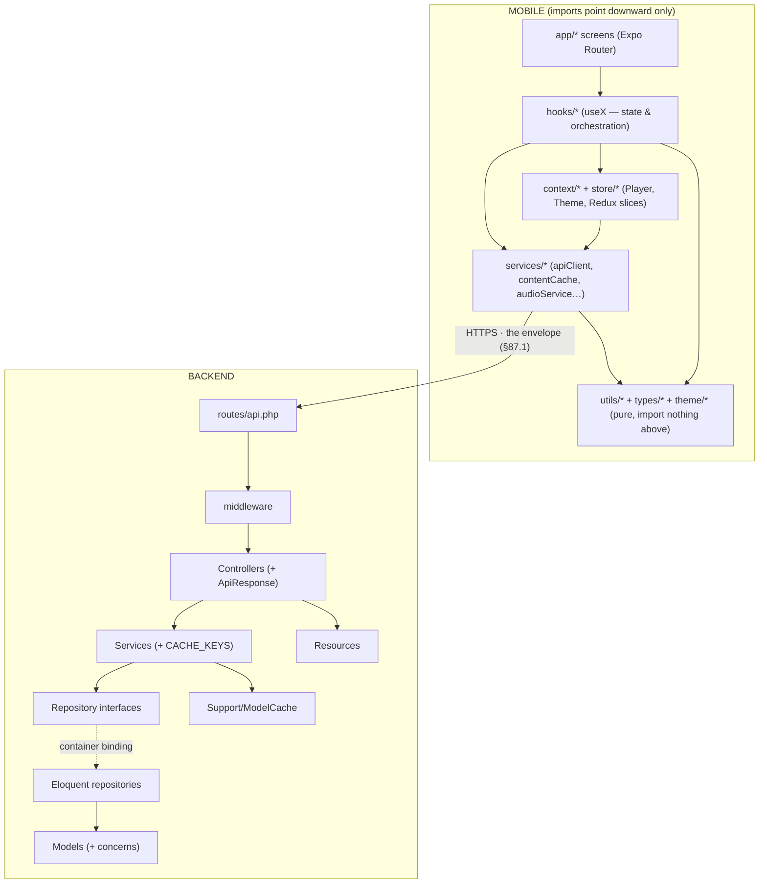

# 87. Complete Code Atlas III — the Backend Request Spine

## 87.1 `ApiResponse` — one trait, one wire contract, two codebases

Every API controller uses the same three methods from
[ApiResponse.php](backend/app/Traits/ApiResponse.php):

```php
trait ApiResponse
{
    protected function success(mixed $data, string $message = 'Success', int $status = 200): JsonResponse
    {
        return response()->json(['success' => true, 'message' => $message, 'data' => $data], $status);
    }

    protected function error(string $message, int $status = 400, mixed $errors = null): JsonResponse
    {
        $payload = ['success' => false, 'message' => $message];
        if ($errors !== null) {                    // key OMITTED entirely when absent
            $payload['errors'] = $errors;
        }
        return response()->json($payload, $status);
    }

    protected function paginated(LengthAwarePaginator $paginator, string $message = 'Success'): JsonResponse
    { /* success + data: items() + meta: {current_page, last_page, per_page, total} */ }
}
```

**A trait is compile-time flattening**: at class-load, the engine copies these
methods *into* each controller as if written there (horizontal reuse without a base
class — no runtime lookup, no extra object; contrast the vertical `extends
Controller` chain the same classes also have). Nineteen controllers therefore emit
*byte-identical* envelope shapes — which is what makes the client's `apiGet`
unwrapping (§85.2) safe to write once. The full round-trip contract, drawn:

```
   PHP builds                          the wire                        TS unwraps
   success($data) ─▶ {success:true, ── HTTP body ──▶ res.data          (axios body)
                      message:"…",                     └─ .data        (envelope)
                      data: […]}                            └─▶ returned to hook
   error(…, 422, $errors) ─▶ {success:false, message, errors} ─▶ ApiError.fieldErrors
   paginated(…) ─▶ {…, data, meta} ─▶ {items: data ?? [], meta: meta ?? FALLBACK_META}
```

One asymmetry worth seeing: PHP *omits* the `errors` key when there are none
(`if ($errors !== null)`), while TS *fills* missing fields with defaults (`?? null`
in the `ApiError` constructor). Omission-on-write plus default-on-read is the
tightest version of the wire contract — no `"errors": null` noise in every response,
no `undefined` leaking into client code. (§88.3 catalogues this pairing.)

## 87.2 The middleware family — one shape, per-request policy

All custom middleware share the pipeline signature (§68's Chain of Responsibility):
*read something from the request → set process-wide or request state → delegate to
`$next`*. [SetLocale.php](backend/app/Http/Middleware/SetLocale.php) is the whole
pattern in two lines:

```php
public function handle(Request $request, Closure $next): Response
{
    $acceptLanguage = $request->header('Accept-Language', 'en');   // default INLINE at the read
    App::setLocale(str_starts_with($acceptLanguage, 'ar') ? 'ar' : 'en');
    return $next($request);
}
```

* `header('Accept-Language', 'en')` — the second argument is the null-termination
  point: a missing header never reaches the branching logic.
* `str_starts_with(…, 'ar')` — a *prefix* test, not equality, because real headers
  arrive as `ar-SA,ar;q=0.9,en;q=0.8`. Everything non-Arabic collapses to `'en'`:
  a **whitelist-to-binary** normalization, so `App::getLocale()` downstream has a
  two-value domain, and Spatie's `getTranslation(field, locale)` can never be asked
  for a locale that doesn't exist in the JSON column.
* The set locale lives in the request arena (§80.6) — it dies with the request, so
  concurrent requests in different languages can't bleed into each other (each FPM
  worker handles one request at a time; the "global" is only process-global for
  those milliseconds).

`CheckRole` (route-level `role:admin`) and `LogUserActivity` (fire-and-forget audit
write after `$next` returns — policy on the *response* side of the pipeline) follow
the same shape and are not re-drawn.

## 87.3 The Resource family — projections, and where nulls become shapes

[VerseResource.php](backend/app/Http/Resources/VerseResource.php) is the family's
minimal member:

```php
class VerseResource extends JsonResource
{
    public function toArray($request): array
    {
        return [
            'id'           => $this->id,
            'surah_id'     => $this->surah_id,
            'verse_number' => $this->verse_number,
            'text'         => $this->getTranslations('text'),   // {'ar': …, 'en': …}
        ];
    }
}
```

Three mechanics, each stated once for all ~20 resources:

* **`$this` is a proxy.** The resource wraps the model and `__get`-forwards unknown
  properties to it — `$this->id` walks resource → model attributes. This is why
  rehydrated models (§81.4) must be *real* models: the proxy forwards method calls
  like `getTranslations()` too.
* **A resource is a projection** (SQL π, §30): the whitelist decides what exists on
  the wire. `Verse` has timestamps and internal columns; the API shape has four
  keys. Security-by-omission (§75.4) and hidden-class stability (§80.5 — every verse
  JSON has the same keys in the same order) both fall out of the same array literal.
* **Conditional fields** (`whenLoaded`, `whenCounted` in the richer resources) emit
  the key *only when the relation/count is present in memory* — the server-side twin
  of §87.1's key omission: a relation that wasn't eager-loaded produces no key at
  all (never a `null` that could be mistaken for "loaded but empty"), and — crucially
  — never triggers a lazy query from inside serialization (the N+1 trap's last
  hiding place, §84.1).

`getTranslations('text')` returns the *whole* `{ar, en}` object rather than one
locale — the deliberate contract with the mobile `Translatable` type: locale
selection happens client-side at render (`item.text[currentLocale]`), so switching
language never refetches. `SetLocale` (§87.2) still matters for server-*rendered*
strings (validation messages, Filament).

## 87.4 The repository family — query vocabulary, and the null contract at the edge

[RecordingRepository.php](backend/app/Repositories/RecordingRepository.php), the
family's clearest member:

```php
public function byDisease(int $diseaseId): Collection
{
    return Recording::where('disease_id', $diseaseId)->orderBy('session_number')->get();
}

public function findById(int $id): ?Recording          // ← nullable RETURN TYPE
{
    return Recording::with('disease')->find($id);
}

public function incrementPlays(Recording $recording): void
{
    $recording->increment('plays_count');               // one atomic UPDATE … SET x = x + 1
}
```

* **Return types are the null contract.** `byDisease` promises `Collection` — never
  null; "no recordings" is an *empty* collection (the list null-object again,
  §85.5). `findById` promises `?Recording` — the single-item case is where absence
  is real, and the `?` forces every caller through a null check the type-checker
  can see. The two shapes — *plural = empty, singular = nullable* — hold across
  every repository in the project.
* **`increment()` compiles to `UPDATE recordings SET plays_count = plays_count + 1
  WHERE id = ?`** — the addition happens *inside MySQL*, one statement, atomic under
  concurrency. The read-modify-write alternative (`$r->plays_count++; $r->save()`)
  is a lost-update race: two simultaneous listeners would both read 41 and both
  write 42. Pushing the arithmetic to the row's owner is the same
  move-the-work-to-the-data principle as `withCount` (§84.3) and the bulk sibling
  update (§78.7).
* `with('disease')` on the single-item path — eager loading is not only an N+1 tool
  (§84.2); on a one-row query it simply pins the relation into `model->relations`
  (§80.7) so the resource's `whenLoaded('disease')` finds it.

The interface indirection (`RecordingRepositoryInterface` bound in the provider,
resolved by constructor autowiring — mechanics in §35/§68) is what the whole family
hangs from: services depend on the *contract*, the container injects the Eloquent
implementation, tests may inject a fake.

---

# 88. The Null & Data Handling Catalog — One Policy, Every File

> *Every mechanism below has now appeared in a real walkthrough. This section is the
> unified reference the user asked for: how the project handles "nothing", in both
> languages, as one coherent policy — with each idiom's diagram-of-record cited
> instead of redrawn.*

## 88.1 The four kinds of "nothing" — kept distinct on purpose

| Kind | TS spelling | PHP spelling | Project example |
|---|---|---|---|
| **Not yet loaded** | `undefined` (TanStack `data` before first fetch) | — (sync model) | `query.data ?? []` (§77.3) |
| **Loaded, and absent** | `null`, explicit | `null` / `?Type` | `user: null` in authSlice; `find() → ?Recording` (§87.4) |
| **Empty but present** | `[]`, `''`, `{}` | empty `Collection` | `byDisease` returns empty, never null |
| **Unknown / can't tell** | `null` as a third truth value | — | the probe's `boolean \| null` (§85.3) |

The discipline is that these never masquerade as each other: a list is empty, not
null (§85.5, §87.4); a guest is `user: null`, not a missing key (§86.1); "unknown"
is `null` tested with `===`, never coerced with `!` (§85.3). Once each domain picks
its representation, the *checks* become mechanical.

## 88.2 The operator toolbox — which check, when

| Operator | Semantics | Use it when | Trap it avoids / carries |
|---|---|---|---|
| `??` | default only on `null`/`undefined` | terminating absence with a default: `data?.message ?? error.message ?? 'Request failed'` (§85.2) | unlike `\|\|`, keeps valid falsy values: `0`, `''`, `false` pass through |
| `\|\|` | default on any falsy | genuine boolean logic, or when `''`/`0` *should* default | would turn page `0` or empty search into the default — why `??` dominates data paths |
| `?.` | propagate absence through a chain | mid-chain, shape not guaranteed: `m?.[1]`, `Constants.expoConfig?.hostUri` (§85.1) | short-circuits to `undefined`; must end in a terminator (`??`, `if`) before use |
| `!x` | guard clause | preconditions: `if (!surah) return [];` (§79.2) | coerces — don't use where `false`≠`null` matters (§85.3) |
| `x!` | assert non-null (compile-time) | only beside its visible proof (§79.3) | erased at runtime; a lie crashes later |
| `=== undefined` / `=== null` | exact sentinel test | Map misses (`§85.3`), trinary logic | immune to falsy-value collisions |
| PHP `??` / `?->` | as TS `??` / `?.` | `$paginator->max() ?? 0` (§77.2) | same falsy-preserving contrast with PHP's `?:` |
| PHP `! empty()` | "set and truthy" | nullable FKs: `! empty($r->subcategory_id)` (§77.2) | treats `0`/`'0'`/`[]` as absent — right for FKs, wrong for counters |
| PHP `?Type` return | contract-level nullability | `findById(): ?Recording` (§87.4) | forces callers to branch; plural methods return empty instead |

## 88.3 The three placement rules

Everything above composes into three rules about *where* null handling lives:

1. **Terminate at boundaries, propagate in the middle.** Chains use `?.`; the last
   step before a value is *used* applies `??`/ternary with a typed default
   (§85.1). Boundaries in this project: the envelope unwrap (§85.2), selectors
   (§86.1), repository return types (§87.4), the `header(…, 'en')` default (§87.2).
2. **Prefer null-objects over null checks for containers.** `[]`, `[[]]`,
   `FALLBACK_META`, empty `Collection`, `new Set()` — a real value with "nothing
   inside" lets every downstream `map`/`filter`/`render` run unconditionally
   (§85.2, §85.5). Reserve `null` for *scalars and single entities*, where absence
   is information (`user`, `resumeData`, `findById`).
3. **Write omission, read defaults.** The producer omits keys that don't apply
   (`errors` §87.1, `whenLoaded` §87.3); the consumer fills defaults on read
   (`?? []`, `?? null`). Both sides stay clean, and the wire carries no noise.

Rule-of-thumb test used throughout: *if a value can be absent, either the type says
so (`?Recording`, `User | null`, `boolean | null`) or a default has already made
absence impossible. A nullable value with neither is a bug waiting for §79.3's
runtime crash.*

# 89. The Contact Map — Who May Import Whom

> *Last piece: the project's modules as a layered graph. Every arrow below is an
> allowed dependency direction; anything not drawn is forbidden. The layers are why
> every walkthrough in this atlas could be read in isolation — each file only ever
> talks to the layer directly beneath it.*



The load-bearing prohibitions, each enforced somewhere already documented:

* **Services never import hooks or React** — transport stays render-free; the one
  inversion needed (a 401 clearing auth state) goes through the registered callback
  `setUnauthorizedHandler` (§85.2), not an import — breaking what would otherwise be
  a `store → apiClient → store` cycle. The dependency *points* downward; the
  *notification* rides a function pointer upward. (The same inversion, backend-side,
  is the repository interface: §87.4.)
* **`utils/` and `types/` import nothing above them** — which is what makes them
  unit-testable with zero mocks (the testing convention) and reusable from any
  layer.
* **Screens never touch `apiClient` or SQLite directly** — every byte reaches JSX
  through a hook, so caching (§81), fallback (§85.2), and null policy (§88) are
  applied exactly once, in one layer. A screen that imported axios would bypass all
  three.
* **Controllers never touch Eloquent** — they speak to services; services speak to
  interfaces; only `Repositories/*` and models speak SQL. The container binding
  (dashed arrow) is the seam where a fake slides in for tests.

That layered discipline — one direction, one job per layer, inversions only via
contracts — is the reason this document could explain the system file by file
without circular hand-waving: the code itself has no circles to wave at.

---

*The Complete Code Atlas (§85–89) swept the remaining shared infrastructure and
unified the project's null policy and contact map.*

*The reference concludes with **§90, the Vertical Slices**: every functional module
walked end-to-end with the real code from **every file in its chain** — the route
line in `api.php`, the controller method, the service, the repository, the model
logic, the resource, then across the wire into the mobile service one-liner, the
hook, and the screen. This is where the early functional descriptions (roles,
entitlement, favorites, gated audio, the content modules) finally meet the code
that implements them, file by file.*
