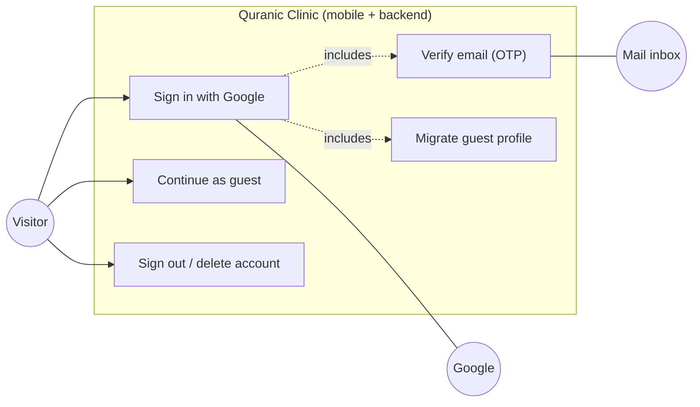
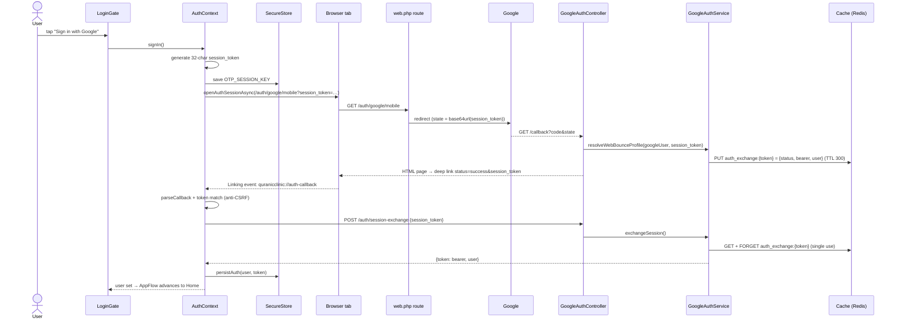

# 92. The Auth Mega-Slice — the Complete Login Process, Every File, Every Concept

> *This is the template the whole document builds toward: one feature — Google
> sign-in — followed from the button to the database and back, with **all nine
> source files printed in full** and every concept from the brief annotated on the
> exact lines where it lives: user story, use-case and sequence diagrams, stack &
> heap, pointers, OOP & SOLID, dependency injection, algorithms & data structures,
> memory-leak prevention, rendering & evaluation, memoization, and re-render
> elimination. A closing matrix (§92.9) indexes every concept to its line.*

## 92.1 User story, use cases, and the two sequence diagrams

**User story (the agile artifact):**

> *As a visitor, I want to sign in with my Google account — or continue as a guest —
> so that my favorites and subscription follow me across devices, without ever
> creating a password.*
> **Acceptance criteria:** an existing Google user reaches Home with no extra step;
> a first-time user proves email ownership with a 6-digit emailed code; a guest can
> skip sign-in entirely and later inherit their locally-saved profile; rate-limited
> and failed attempts show readable errors; the bearer token never appears in a URL.

**Use-case diagram** — the actors and the system boundary:



**Sequence diagram — branch A, existing user (session exchange, no OTP):**



**Sequence diagram — branch B, new user (OTP):**

```mermaid
sequenceDiagram
    actor U as User
    participant AC as AuthContext
    participant S as GoogleAuthService
    participant R as Cache (Redis)
    participant M as Mail
    participant OG as OtpGate
    S->>S: no OAuthProvider, no email match → new user
    S->>R: PUT otp:{email} = {hashed OTP + google payload} (TTL 600)
    S->>R: PUT otp_session:{session_token} = email
    S->>M: send OtpVerificationMail(otp)
    S-->>AC: deep link status=verification_required
    AC->>AC: setAwaitingOtp(true) → AppFlow shows OtpGate
    U->>OG: types 6 digits (auto-submit)
    OG->>AC: verifyOtp("492817")
    AC->>S: POST /auth/verify-otp {session_token, otp}
    S->>R: GET otp_session → email; check attempts < 5
    S->>R: GET otp:{email}; Hash::check(otp)
    S->>S: DB::transaction: purge trashed twin → create User → assignRole('user') → OAuthProvider
    S->>R: FORGET otp / resend / attempts / session keys
    S-->>AC: {token, user} → finishLogin → Home
```

The two branches share everything up to the service's decision; the diagrams are
the specification the nine files below implement.

## 92.2 File 1 — `LoginGate.tsx` (the button), full source + annotations

```tsx
import React from 'react';
import { ActivityIndicator, Alert, Pressable, Text, View } from 'react-native';
import { SafeAreaView } from 'react-native-safe-area-context';
import LogoTop from '@/assets/figma/login-logo-3.svg';
import LogoMid from '@/assets/figma/login-logo-2.svg';
import LogoBottom from '@/assets/figma/login-logo-1.svg';
import GoogleIcon from '@/assets/figma/google-icon.svg';
import { PatternedBackground } from '@/components/layout/PatternedBackground';
import { FigmaTopBar } from '@/components/layout/FigmaTopBar';
import { useAuth } from '@/context/AuthContext';
import { useLanguage } from '@/context/LanguageContext';
import { useTheme } from '@/context/ThemeContext';
import { useStyles } from '@/hooks/useStyles';
import { createStyles } from './LoginGate.styles';

type Props = { onSuccess: () => void };

export function LoginGate({ onSuccess }: Props) {
  const { t } = useLanguage();
  const { theme } = useTheme();
  const s = useStyles(createStyles);
  const { signIn, loading } = useAuth();

  const handleGoogleSignIn = async () => {
    try {
      await signIn();
      // AppFlow watches user + awaitingOtp to advance automatically.
    } catch (error: any) {
      if (error?.message === 'too_many_requests') {
        Alert.alert(t.login.error, t.login.rateLimitError);
      } else {
        Alert.alert(t.login.error, t.login.errorBody);
      }
    }
  };

  return (
    <View style={s.root}>
      <PatternedBackground />
      <FigmaTopBar title={t.login.title} />
      <SafeAreaView style={s.flex} edges={['bottom']}>
        <View style={s.body}>
          <View style={s.logoBlock}>
            <View style={s.logoTop}><LogoTop width="100%" height="100%" /></View>
            <View style={s.logoMid}><LogoMid width="100%" height="100%" /></View>
            <View style={s.logoBottom}><LogoBottom width="100%" height="100%" /></View>
          </View>

          <View style={s.ctaBlock}>
            <View style={s.textBlock}>
              <Text style={s.welcome}>{t.login.welcome}</Text>
              <Text style={s.subtitle}>{t.login.subtitle}</Text>
            </View>

            <View style={s.buttons}>
              <Pressable
                onPress={handleGoogleSignIn}
                disabled={loading}
                style={({ pressed }) => [s.googleBtn, pressed && !loading && s.pressed, loading && { opacity: 0.6 }]}
              >
                {loading ? (
                  <ActivityIndicator color={theme.textOnBrand} />
                ) : (
                  <>
                    <Text style={s.googleBtnText}>{t.login.googleSignIn}</Text>
                    <View style={s.googleIcon}><GoogleIcon width={16} height={16} /></View>
                  </>
                )}
              </Pressable>

              <Pressable onPress={onSuccess} style={({ pressed }) => [s.guestBtn, pressed && s.pressed]}>
                <Text style={s.guestBtnText}>{t.login.guest}</Text>
              </Pressable>
            </View>

            <Text style={s.terms}>
              {t.login.termsPrefix}{' '}
              <Text style={s.termsLink}>{t.login.terms}</Text>
              {' '}{t.login.and}{' '}
              <Text style={s.termsLink}>{t.login.privacy}</Text>
            </Text>
          </View>
        </View>
      </SafeAreaView>
    </View>
  );
}
```

**Rendering & memory annotations:**

* **Dependency injection, React-style.** The component declares *what it needs*
  (`useAuth`, `useLanguage`, `useTheme`, `useStyles`) and never *how to build it* —
  the providers up the tree (§92.5's `AuthProvider` and friends) are the injectors.
  This is constructor injection's hook twin: swap the provider, and the component
  tests with a fake auth without one line changing.
* **`useStyles(createStyles)`** — the memoized style factory (§73): the
  `StyleSheet.create` result is a heap object cached per theme, so re-renders reuse
  the same style ids (RN sends numeric ids over the bridge, not style objects).
* **`handleGoogleSignIn` is deliberately *not* `useCallback`-wrapped.** Memoizing a
  callback pays only when a *memoized child* receives it (§70's cost model);
  `Pressable` is a host component that re-renders with its parent anyway. The
  function closure is young-generation garbage (§80.4) — cheaper than the
  bookkeeping of a `useCallback` would be. Knowing when *not* to memoize is the
  other half of the optimization discipline.
* **The style prop is a *function*** — `style={({ pressed }) => [...]}` — evaluated
  by `Pressable` on press-state changes only, so the pressed feedback never
  re-renders the component; the array literal `[base, cond && override]` relies on
  RN's style-array semantics where `false`/`undefined` entries are skipped —
  short-circuit evaluation (§80) as a styling idiom.
* **Conditional render as a ternary** (`loading ? spinner : label+icon`): both
  branches are cheap element allocations; React unmounts one subtree and mounts the
  other on toggle — the `disabled={loading}` prop meanwhile closes the
  double-submit race at the source.
* **Error handling is message-keyed:** the context throws `Error('too_many_requests')`
  and the UI maps message → localized alert (`t.login.rateLimitError`). The string
  is a *contract* between layers — the mobile mirror of the backend's `outcome`
  strings (§92.7) — and `error?.message` (§88: `?.` mid-chain) survives non-Error
  throws.

## 92.3 File 2 — `AuthContext.tsx` (the engine), full source + annotations

```tsx
import React, { createContext, useContext, useState, useEffect } from "react";
import * as WebBrowser from "expo-web-browser";
import * as SecureStore from "expo-secure-store";
import { Linking } from "react-native";
import { PRODUCTION_API_URL } from "@/services/api";
import { store } from "@/store/store";
import { setUser as setAuthUser } from "@/store/slices/authSlice";
import { clearAll as clearAllDownloads } from "@/store/slices/downloadsSlice";
import { audioService } from "@/services/audioService";

// SecureStore key holding the in-flight OAuth session token. Persisting it (rather than
// keeping it only in a signIn() closure) lets verifyOtp/resendOtp resolve the pending
// sign-in even if the app is backgrounded while the user reads the email.
const OTP_SESSION_KEY = "otp_session_token";
const GUEST_PROFILE_KEY = "guest_profile";

// The deep link the backend redirects to once Google auth finishes. Only `status` and the
// opaque `session_token` ever ride in the URL — never the bearer token or profile data.
const RETURN_URL = "quranicclinic://auth-callback";

interface ProfileUpdate {
  name?: string;
  phone?: string | null;
  country?: string | null;
  gender?: "male" | "female" | null;
  avatar_path?: string | null;
}

interface AuthContextProps {
  user: any;
  profile: any;
  isGuest: boolean;
  token: string | null;
  loading: boolean;
  awaitingOtp: boolean;
  signIn: () => Promise<void>;
  signOut: () => Promise<void>;
  updateProfile: (changes: ProfileUpdate) => Promise<void>;
  deleteAccount: () => Promise<void>;
  verifyOtp: (otp: string) => Promise<void>;
  resendOtp: () => Promise<void>;
  clearAuthOnStart: () => Promise<void>;
}

const AuthContext = createContext<AuthContextProps | undefined>(undefined);

export const AuthProvider: React.FC<{ children: React.ReactNode }> = ({ children }) => {
  const [user, setUser] = useState<any>(null);
  const [guestProfile, setGuestProfile] = useState<any>(null);
  const [token, setToken] = useState<string | null>(null);
  const [loading, setLoading] = useState(true);
  const [awaitingOtp, setAwaitingOtp] = useState(false);

  // OAuth must always go through production — Google's servers can't reach a local IP
  const OAUTH_BASE_URL = PRODUCTION_API_URL.replace(/\/api$/, "");

  useEffect(() => { bootstrap(); }, []);
  useEffect(() => { store.dispatch(setAuthUser(user ?? null)); }, [user]);

  const bootstrap = async () => {
    try {
      const storedToken = await SecureStore.getItemAsync("token");
      const storedUser = await SecureStore.getItemAsync("user");
      if (storedToken && storedUser) {
        setToken(storedToken);
        setUser(JSON.parse(storedUser));
      } else {
        const storedGuest = await SecureStore.getItemAsync(GUEST_PROFILE_KEY);
        if (storedGuest) setGuestProfile(JSON.parse(storedGuest));
      }
    } catch {
      await SecureStore.deleteItemAsync("token");
      await SecureStore.deleteItemAsync("user");
    } finally {
      setLoading(false);
    }
  };

  const clearAuthOnStart = async () => {
    try {
      await SecureStore.deleteItemAsync("token");
      await SecureStore.deleteItemAsync("user");
      setUser(null);
      setToken(null);
    } catch {}
  };

  const persistAuth = async (authUser: any, authToken: string) => {
    setUser(authUser);
    setToken(authToken);
    await SecureStore.setItemAsync("user", JSON.stringify(authUser));
    await SecureStore.setItemAsync("token", authToken);
  };

  // Finalize a login. Persist immediately with the user we already have so sign-in feels
  // instant — then refresh the full profile in the background.
  const finishLogin = async (authToken: string, authUser: any) => {
    await persistAuth(authUser, authToken);
    setAwaitingOtp(false);
    await SecureStore.deleteItemAsync(OTP_SESSION_KEY);
    migrateGuestProfile(authToken, authUser).then(() => refreshProfile(authToken));
  };

  const migrateGuestProfile = async (authToken: string, authUser: any) => {
    try {
      const raw = await SecureStore.getItemAsync(GUEST_PROFILE_KEY);
      if (!raw) return;
      const guest = JSON.parse(raw);

      const payload: ProfileUpdate = {};
      if (!authUser?.phone && guest.phone) payload.phone = guest.phone;
      if (!authUser?.country && guest.country) payload.country = guest.country;
      if (!authUser?.gender && guest.gender) payload.gender = guest.gender;

      if (Object.keys(payload).length > 0) {
        await fetch(`${PRODUCTION_API_URL}/me`, {
          method: "PUT",
          headers: {
            Authorization: `Bearer ${authToken}`,
            "Content-Type": "application/json",
            Accept: "application/json",
          },
          body: JSON.stringify(payload),
        });
      }
    } catch {}
    await SecureStore.deleteItemAsync(GUEST_PROFILE_KEY);
    setGuestProfile(null);
  };

  const refreshProfile = async (authToken: string) => {
    try {
      const meRes = await fetch(`${PRODUCTION_API_URL}/me`, {
        headers: { Authorization: `Bearer ${authToken}`, Accept: "application/json" },
      });
      if (!meRes.ok) return;
      const meData = await meRes.json();
      if (meData?.data) {
        setUser(meData.data);
        await SecureStore.setItemAsync("user", JSON.stringify(meData.data));
      }
    } catch {}
  };

  // Parse the `#status=…&session_token=…` fragment (falls back to a `?` query).
  const parseCallback = (url: string): Record<string, string> => {
    const out: Record<string, string> = {};
    const raw = url.split("#")[1] ?? url.split("?")[1] ?? "";
    raw.split("&").forEach((pair) => {
      const [k, v] = pair.split("=");
      if (k) out[decodeURIComponent(k)] = decodeURIComponent(v ?? "");
    });
    return out;
  };

  // Open the OAuth tab and resolve with the deep-link URL the backend redirects to.
  const openAndAwaitCallback = (authUrl: string): Promise<string | null> =>
    new Promise((resolve) => {
      let settled = false;
      const done = (url: string | null) => {
        if (settled) return;
        settled = true;
        sub.remove();
        resolve(url);
      };

      const sub = Linking.addEventListener("url", ({ url }) => {
        if (url && url.includes("auth-callback")) done(url);
      });

      WebBrowser.openAuthSessionAsync(authUrl, RETURN_URL)
        .then((res) => {
          if (res.type === "success" && res.url) {
            done(res.url);
          } else {
            setTimeout(() => done(null), 1200);
          }
        })
        .catch(() => done(null));
    });

  const signIn = async () => {
    setLoading(true);
    setAwaitingOtp(false);

    try {
      const sessionToken = Array.from({ length: 32 }, () =>
        Math.floor(Math.random() * 36).toString(36)
      ).join("");
      await SecureStore.setItemAsync(OTP_SESSION_KEY, sessionToken);

      const authUrl = `${OAUTH_BASE_URL}/auth/google/mobile?session_token=${encodeURIComponent(sessionToken)}`;

      const callbackUrl = await openAndAwaitCallback(authUrl);
      if (!callbackUrl) {
        setLoading(false);
        return;
      }

      const params = parseCallback(callbackUrl);
      if (params.session_token !== sessionToken) {
        setLoading(false);
        throw new Error("session_mismatch");
      }

      if (params.status === "success") {
        // Existing user — trade the session_token for the bearer token in one call.
        await exchangeSession(sessionToken);
      } else if (params.status === "verification_required") {
        // New user — show the native OTP screen (AppFlow advances on awaitingOtp).
        setAwaitingOtp(true);
        setLoading(false);
      } else {
        setLoading(false);
        throw new Error("auth_failed");
      }
    } catch (err) {
      setLoading(false);
      throw err;
    }
  };

  const exchangeSession = async (sessionToken: string) => {
    const res = await fetch(`${PRODUCTION_API_URL}/auth/session-exchange`, {
      method: "POST",
      headers: { "Content-Type": "application/json", Accept: "application/json" },
      body: JSON.stringify({ session_token: sessionToken }),
    });
    if (!res.ok) throw new Error("auth_failed");
    const data = await res.json();
    if (data.status !== "success" || !data.token) throw new Error("auth_failed");
    await finishLogin(data.token, data.user);
    setLoading(false);
  };

  const verifyOtp = async (otp: string) => {
    const sessionToken = await SecureStore.getItemAsync(OTP_SESSION_KEY);
    if (!sessionToken) throw new Error("no_pending_session");
    setLoading(true);
    try {
      const res = await fetch(`${PRODUCTION_API_URL}/auth/verify-otp`, {
        method: "POST",
        headers: { "Content-Type": "application/json", Accept: "application/json" },
        body: JSON.stringify({ session_token: sessionToken, otp }),
      });

      if (res.status === 429) throw new Error("too_many_requests");

      const data = await res.json();
      if (data.error === "invalid_otp") throw new Error("invalid_otp");
      if (data.error === "session_expired") throw new Error("session_expired");
      if (!data.token) throw new Error("auth_failed");

      await finishLogin(data.token, data.user);
    } finally {
      setLoading(false);
    }
  };

  const resendOtp = async () => {
    const sessionToken = await SecureStore.getItemAsync(OTP_SESSION_KEY);
    if (!sessionToken) throw new Error("no_pending_session");
    const res = await fetch(`${PRODUCTION_API_URL}/auth/resend-otp`, {
      method: "POST",
      headers: { "Content-Type": "application/json", Accept: "application/json" },
      body: JSON.stringify({ session_token: sessionToken }),
    });
    if (res.status === 429) throw new Error("too_many_requests");
    const data = await res.json();
    if (data.error) throw new Error(data.error);
  };

  const clearDownloads = async () => {
    try { await audioService.clearAllRecordings(); } catch {}
    store.dispatch(clearAllDownloads());
  };

  const updateProfile = async (changes: ProfileUpdate) => {
    if (!token) {
      const merged = { ...(guestProfile ?? {}), ...changes };
      setGuestProfile(merged);
      await SecureStore.setItemAsync(GUEST_PROFILE_KEY, JSON.stringify(merged));
      return;
    }

    const res = await fetch(`${PRODUCTION_API_URL}/me`, {
      method: "PUT",
      headers: {
        Authorization: `Bearer ${token}`,
        "Content-Type": "application/json",
        Accept: "application/json",
      },
      body: JSON.stringify(changes),
    });

    if (res.status === 422) {
      const body = await res.json().catch(() => null);
      const err = new Error("validation_failed") as Error & { errors?: unknown };
      err.errors = body?.errors;
      throw err;
    }
    if (!res.ok) throw new Error("update_failed");

    const data = await res.json();
    const updated = data?.data;
    if (updated) {
      setUser(updated);
      await SecureStore.setItemAsync("user", JSON.stringify(updated));
    }
  };

  const signOut = async () => {
    setToken(null);
    setUser(null);
    setAwaitingOtp(false);
    await clearDownloads();
    await SecureStore.deleteItemAsync("token");
    await SecureStore.deleteItemAsync("user");
    await SecureStore.deleteItemAsync(OTP_SESSION_KEY);
  };

  const deleteAccount = async () => {
    if (!token) return;
    await fetch(`${PRODUCTION_API_URL}/account`, {
      method: "DELETE",
      headers: { Authorization: `Bearer ${token}`, Accept: "application/json" },
    });
    setToken(null);
    setUser(null);
    setAwaitingOtp(false);
    await clearDownloads();
    await SecureStore.deleteItemAsync("token");
    await SecureStore.deleteItemAsync("user");
    await SecureStore.deleteItemAsync(OTP_SESSION_KEY);
  };

  const profile = user ?? guestProfile;
  const isGuest = !token;

  return (
    <AuthContext.Provider
      value={{ user, profile, isGuest, token, loading, awaitingOtp, signIn, signOut, updateProfile, deleteAccount, verifyOtp, resendOtp, clearAuthOnStart }}
    >
      {children}
    </AuthContext.Provider>
  );
};

export const useAuth = () => {
  const context = useContext(AuthContext);
  if (!context) throw new Error("useAuth must be used within AuthProvider");
  return context;
};
```

**The deep annotations, concept by concept:**

**① `openAndAwaitCallback` — a promise with an idempotent resolver (memory-leak
prevention drawn).** Two independent sources can report the callback: the OS
`Linking` event and `openAuthSessionAsync`'s own result. Racing them naively would
resolve twice and leak the listener. The `settled` flag + `done()` wrapper make
resolution **idempotent** — first caller wins, exactly like `Promise.race` (§85.3),
but hand-rolled because the loser must also be *cleaned up*:

```
   heap during sign-in:
   Promise ◀── resolve captured by done()
   done() closure ──▶ { settled: false, sub ──▶ [OS listener registry entry] }
                                   │
   first caller (Linking event OR browser result OR 1200ms timeout):
        settled=true ─▶ sub.remove() ─▶ listener DELETED from OS registry ─▶ resolve(url)
   any later caller: `if (settled) return;` — no double resolve, no double remove
```

`sub.remove()` is the leak-prevention line: the `Linking` listener lives in a
**native registry** outside the GC's reach — un-removed, it would survive the
sign-in, fire on every future deep link, and hold the closure (and everything it
captures) alive forever. The `setTimeout(…, 1200)` grace on the non-success branch
exists because on Android the browser can report "dismissed" *before* the deep-link
event arrives — the timeout gives the event a window to win the race.

**② `signIn`'s session token — the algorithm and the security role.**

```ts
const sessionToken = Array.from({ length: 32 }, () =>
  Math.floor(Math.random() * 36).toString(36)
).join("");
```

`Array.from({length: 32}, fn)` allocates one 32-slot heap array and fills it by
calling `fn` per slot: `Math.random()*36 → floor → base-36 digit` (`0-9a-z`), then
one `join` allocates the final string — 36³² ≈ 2¹⁶⁵ possibilities. Its job is
**correlation + CSRF defense**, not secrecy of the account: the check
`params.session_token !== sessionToken` proves the deep link that returned is the
answer to *this* device's request — a link forged or replayed from elsewhere fails
the equality and throws `session_mismatch`. (It also rides to the backend as
OAuth's `state` parameter, §92.6 — the same value serving both ends of the
round-trip.) Persisting it in SecureStore rather than a closure variable is a
*process-death* decision, stated in the file's own comment: the user may background
the app to read the OTP email; a closure would die with the JS context, the
keychain entry survives.

**③ `parseCallback` — string → dictionary in O(n).** `split("#")[1] ?? split("?")[1]
?? ""` tries fragment first, then query, then the empty null-object (§88 rule 2 —
the parser never branches on absence again). Each `&`-pair is split once, decoded,
and inserted into a `Record` — one pass, one small heap object; `v ?? ""` covers
valueless keys (`?flag`).

**④ `finishLogin` — perceived-performance sequencing.** `persistAuth` runs with the
user object *already in hand* → the UI unblocks **now**; then
`migrateGuestProfile(...).then(() => refreshProfile(...))` chains two network calls
**un-awaited** in the background. Deliberate ordering: migrate *then* refresh, so
the refreshed profile includes the migrated fields. The user reaches Home while
that chain is still in flight — eventual consistency chosen where the user is the
one waiting.

**⑤ `migrateGuestProfile` — a merge with a precedence rule.** Each field copies
only when the server side is empty *and* the guest side has a value
(`!authUser?.phone && guest.phone`): server data always wins over guest data.
`Object.keys(payload).length > 0` skips the PUT entirely when nothing qualifies —
don't send empty writes. The trailing cleanup (delete key + `setGuestProfile(null)`)
runs even on fetch failure — migration is best-effort, the guest cache must not
survive into an authenticated session.

**⑥ Two `useEffect`s only — and why there aren't more.** `bootstrap` on mount
(`[]`) restores the session from the keychain before first meaningful paint;
`store.dispatch(setAuthUser(user ?? null))` on `[user]` **bridges context → Redux**
so selectors like `selectIsPaid` (§86.1) see the same user without a circular
import (the §89 inversion, again). Everything else is event-driven — no polling
effects, no derived-state effects (the `set-state-in-effect` smell): `profile` and
`isGuest` are computed *during render* from existing state, which is the §70 rule —
*derive, don't sync*.

**⑦ The provider `value` and the honest re-render analysis.** The `value={{ … }}`
object literal is **rebuilt every render**, and none of the function properties are
`useCallback`-wrapped — so every state change inside the provider re-renders every
`useAuth` consumer. Why this is *correct here*: the provider's state changes only
on auth-lifecycle events (bootstrap, sign-in/out, OTP), each of which the consumers
*must* re-render for anyway; between them it never re-renders. Memoizing the value
(`useMemo` + `useCallback` × 8) would add permanent heap and bookkeeping to
optimize transitions that all-consumers-care-about by definition. Contrast
`PlayerContext` (§72), which ticks 4×/second and therefore *does* split state and
pay the full memoization cost. **The rule the two files teach together: memoize by
*event frequency × consumer indifference*, not by habit.**

**⑧ `signOut`/`deleteAccount` — teardown ordering.** State first (UI flips to
guest instantly), then downloaded-audio purge (`clearDownloads` — files + Redux
FSM, §86.2), then the three keychain deletes. Both methods end in the *same*
idle state from different directions — and `deleteAccount`'s backend call is the
`AuthService::deleteAccount` printed in §91.1: token revoked server-side even
though the local copy is already gone.

**⑨ `useAuth`'s guard** — `if (!context) throw` turns "used outside the provider"
from a silent `undefined` crash somewhere downstream into a named error at the
call site. The `createContext<… | undefined>(undefined)` + throwing hook pair is
the standard TS pattern for *mandatory* context.

---

*§92 continues in the next block with the OTP screen, the flow state machine, and
the backend files (routes, controller, service, mail) — followed by the
concept-to-line matrix.*
