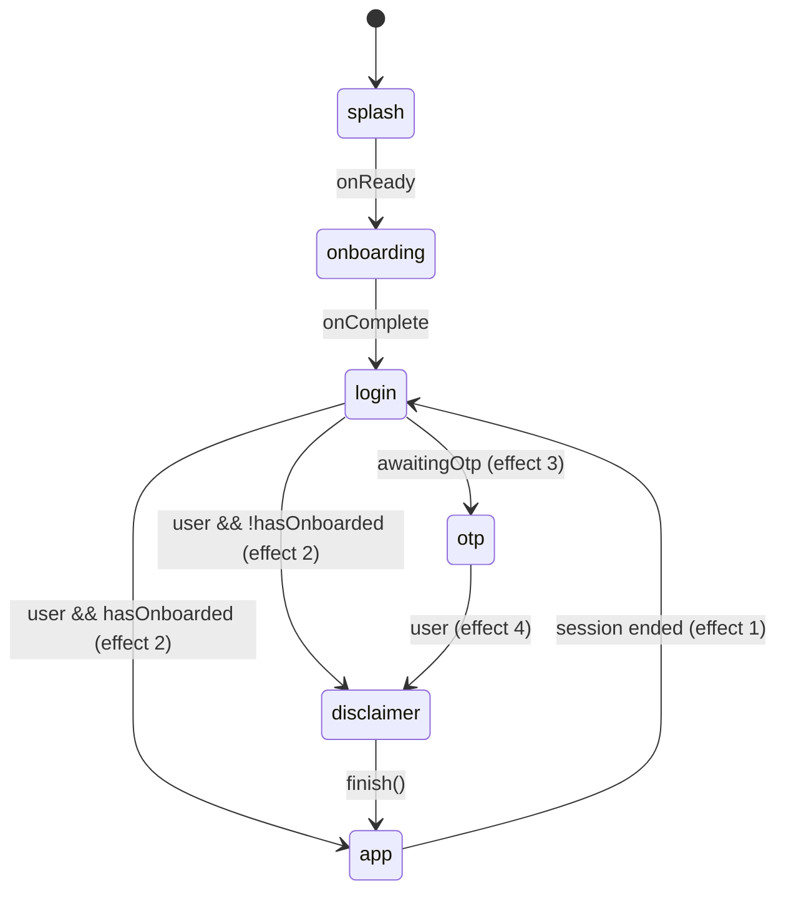

## 92.4 File 3 — `OtpGate.tsx` (six boxes, auto-submit), full source + annotations

```tsx
import React, { useRef, useState, useEffect } from 'react';
import { ActivityIndicator, Alert, Pressable, Text, TextInput, View } from 'react-native';
import { SafeAreaView } from 'react-native-safe-area-context';
import { PatternedBackground } from '@/components/layout/PatternedBackground';
import { FigmaTopBar } from '@/components/layout/FigmaTopBar';
import { useAuth } from '@/context/AuthContext';
import { useLanguage } from '@/context/LanguageContext';
import { useTheme } from '@/context/ThemeContext';
import { useStyles } from '@/hooks/useStyles';
import { createStyles } from './OtpGate.styles';

const OTP_LENGTH = 6;
const RESEND_COOLDOWN = 60;

export function OtpGate() {
  const { t } = useLanguage();
  const { theme } = useTheme();
  const s = useStyles(createStyles);
  const { verifyOtp, resendOtp, loading } = useAuth();

  const [digits, setDigits] = useState<string[]>(Array(OTP_LENGTH).fill(''));
  const [error, setError] = useState<string | null>(null);
  const [cooldown, setCooldown] = useState(0);
  const inputs = useRef<(TextInput | null)[]>([]);

  useEffect(() => {
    if (cooldown <= 0) return;
    const id = setTimeout(() => setCooldown(c => c - 1), 1000);
    return () => clearTimeout(id);
  }, [cooldown]);

  const handleChange = (text: string, index: number) => {
    const digit = text.replace(/[^0-9]/g, '').slice(-1);
    const next = [...digits];
    next[index] = digit;
    setDigits(next);
    setError(null);
    if (digit && index < OTP_LENGTH - 1) {
      inputs.current[index + 1]?.focus();
    }
    if (next.every(d => d !== '') && digit) {
      submitOtp(next.join(''));
    }
  };

  const handleKeyPress = (key: string, index: number) => {
    if (key === 'Backspace' && !digits[index] && index > 0) {
      inputs.current[index - 1]?.focus();
    }
  };

  const submitOtp = async (otp: string) => {
    try {
      await verifyOtp(otp);
      // AppFlow watches user state to advance automatically.
    } catch (err: any) {
      const msg = err?.message;
      if (msg === 'too_many_requests') {
        setError(t.otp.errorRateLimit);
      } else {
        setError(t.otp.errorInvalid);
      }
      setDigits(Array(OTP_LENGTH).fill(''));
      inputs.current[0]?.focus();
    }
  };

  const handleResend = async () => {
    if (cooldown > 0) return;
    try {
      await resendOtp();
      setCooldown(RESEND_COOLDOWN);
      setDigits(Array(OTP_LENGTH).fill(''));
      setError(null);
      inputs.current[0]?.focus();
    } catch (err: any) {
      if (err?.message === 'too_many_requests') {
        Alert.alert(t.login.error, t.otp.errorResendLimit);
      }
    }
  };

  return (
    <View style={s.root}>
      <PatternedBackground />
      <FigmaTopBar title={t.otp.title} />
      <SafeAreaView style={s.flex} edges={['bottom']}>
        <View style={s.body}>
          <Text style={s.heading}>{t.otp.heading}</Text>
          <Text style={s.emailHint}>{t.otp.sentToGeneric}</Text>

          <View style={s.boxRow}>
            {digits.map((digit, i) => (
              <TextInput
                key={i}
                ref={el => { inputs.current[i] = el; }}
                style={[s.box, error ? s.boxError : digit ? s.boxFilled : null]}
                value={digit}
                onChangeText={text => handleChange(text, i)}
                onKeyPress={({ nativeEvent }) => handleKeyPress(nativeEvent.key, i)}
                keyboardType="number-pad"
                maxLength={1}
                selectTextOnFocus
                editable={!loading}
              />
            ))}
          </View>

          {error && <Text style={s.errorText}>{error}</Text>}
          {loading && <ActivityIndicator style={s.spinner} color={theme.primary} />}

          <Pressable
            onPress={handleResend}
            disabled={cooldown > 0}
            style={({ pressed }) => [s.resendBtn, (cooldown > 0 || pressed) && s.resendDisabled]}
          >
            <Text style={s.resendText}>
              {cooldown > 0 ? `${t.otp.resendIn} ${cooldown}s` : t.otp.resend}
            </Text>
          </Pressable>
        </View>
      </SafeAreaView>
    </View>
  );
}
```

**Annotations — the state/refs split, the countdown, the input algorithm:**

* **Two structures for six boxes.** `digits: string[]` is *render state* — each
  keystroke swaps in a fresh array (`const next = [...digits]` — copy-then-write,
  the §83.4/§85.3 ownership rule) so React sees a new reference and repaints the
  boxes. `inputs = useRef<(TextInput | null)[]>([])` is an **array of pointers to
  native views** — imperative focus handles, mutated freely with zero re-renders
  (§78.5's table, one more row). Data on state, handles on refs — the whole §80.3
  memory split in two lines.
* **The countdown is a self-rescheduling effect.** `setCooldown(60)` →  effect runs,
  arms *one* 1 s timer → timer fires `setCooldown(c => c - 1)` → the `[cooldown]`
  dep re-runs the effect → next timer. Sixty single-shot timers instead of a
  `setInterval` — and the cleanup `clearTimeout(id)` (the §85.4 timeline) means
  unmounting mid-count leaks nothing and, crucially, never calls `setCooldown` on
  an unmounted component. The `if (cooldown <= 0) return;` guard is the loop's
  base case — an effect-shaped recursion, terminating at 0. Note the **functional
  update** `c => c - 1`: the timer closure would otherwise capture a stale
  `cooldown` (§80.4's stale-closure drawing — avoided here by asking React for the
  latest value instead of remembering one).
* **`handleChange` — sanitization then two O(1) decisions.**
  `text.replace(/[^0-9]/g, '').slice(-1)` handles every input shape: letters
  stripped, and on fast typing or paste the *last* digit wins (`slice(-1)`).
  Auto-advance is a pointer move: `inputs.current[index + 1]?.focus()` (`?.`
  because the ref array fills lazily). Auto-submit checks
  `next.every(d => d !== '') && digit` — `every` is an O(6) scan, and the `&& digit`
  term stops a *deletion* that happens to leave old digits from re-submitting.
  No submit button exists: the completed state *is* the submission event.
* **`handleKeyPress` — backspace on an *empty* box moves focus backward**
  (`!digits[index] && index > 0`): delete-through, matching every native OTP field.
  Two tiny handlers produce the full editing UX; there is no state machine object —
  the *focus position itself* is the machine's state, stored in the OS.
* **Failure resets are total:** wrong code → error text set, all six boxes cleared
  (fresh `Array(6).fill('')`), focus returned to box 0 — the user retypes rather
  than hunts for the wrong digit. `editable={!loading}` freezes input during the
  round-trip so a second submission can't race the first (§92.2's
  `disabled={loading}`, field edition).

## 92.5 File 4 — `AppFlow.tsx` + `useAppFlow.ts` (the step machine), full source + annotations

```tsx
import React, { useEffect, useRef } from 'react';
import { AppSplash } from '@/components/AppSplash';
import { OnboardingPager } from '@/components/onboarding/OnboardingPager';
import { LoginGate } from '@/components/auth/LoginGate';
import { OtpGate } from '@/components/auth/OtpGate';
import { DisclaimerPopup } from '@/components/common/DisclaimerPopup';
import { MainApp } from '@/components/layout/MainApp';
import { useAppFlow } from '@/hooks/useAppFlow';
import { useAuth } from '@/context/AuthContext';

interface AppFlowProps {
  fontsLoaded: boolean;
}

export function AppFlow({ fontsLoaded }: AppFlowProps) {
  const { step, go, finish, hasOnboarded } = useAppFlow();
  const { user, awaitingOtp } = useAuth();

  // When an authenticated session ends (sign out / delete account), return to login.
  const wasAuthed = useRef(false);
  useEffect(() => {
    if (wasAuthed.current && !user) go('login');
    wasAuthed.current = !!user;
  }, [user, go]);

  // Google sign-in succeeded → advance. Skip disclaimer if already accepted once.
  useEffect(() => {
    if (step === 'login' && user) {
      hasOnboarded ? go('app') : go('disclaimer');
    }
  }, [user, step, hasOnboarded]);

  // New user — backend emailed an OTP → show the native OTP screen.
  useEffect(() => {
    if (step === 'login' && awaitingOtp) go('otp');
  }, [awaitingOtp, step]);

  // OTP verified successfully → advance.
  useEffect(() => {
    if (step === 'otp' && user) go('disclaimer');
  }, [user, step]);

  if (!fontsLoaded) return null;

  switch (step) {
    case 'splash':      return <AppSplash onReady={() => go('onboarding')} />;
    case 'onboarding':  return <OnboardingPager onComplete={() => go('login')} />;
    case 'login':       return <LoginGate onSuccess={() => go('disclaimer')} />;
    case 'otp':         return <OtpGate />;
    case 'disclaimer':
      // Mount MainApp (the expo-router navigator) underneath the disclaimer popup so the
      // quranicclinic://auth-callback deep link resolves to home, not "Unmatched Route".
      return (
        <>
          <MainApp />
          <DisclaimerPopup visible onAccept={finish} />
        </>
      );
    case 'app': return <MainApp />;   // ← HOME
  }
}
```

```ts
// mobile/src/hooks/useAppFlow.ts
import { useCallback, useState } from 'react';
import { useAppDispatch, useAppSelector } from '@/store/hooks';
import { completeOnboarding, selectHasCompletedOnboarding } from '@/store/slices/onboardingSlice';

export type FlowStep = 'splash' | 'onboarding' | 'login' | 'otp' | 'disclaimer' | 'app';

export function useAppFlow() {
  const hasOnboarded = useAppSelector(selectHasCompletedOnboarding);
  const dispatch = useAppDispatch();

  const [step, setStep] = useState<FlowStep>(() =>
    __DEV__ || !hasOnboarded ? 'splash' : 'app',
  );

  const go = useCallback((next: FlowStep) => setStep(next), []);

  const finish = useCallback(() => {
    dispatch(completeOnboarding());
    setStep('app');   // ← final redirect to home
  }, [dispatch]);

  return { step, go, finish, hasOnboarded };
}
```

**Annotations — a finite-state machine rendered by a `switch`:**



* **The four `useEffect`s are the FSM's transition table**, one guarded edge each —
  every guard names its source state (`step === 'login' && …`) so a stray
  `awaitingOtp` can never yank the user out of the app. This is the *legitimate*
  use of effects the §70 "avoid useless useEffect" rule carves out: reacting to
  **external** state (auth context) with a transition, not deriving renderable data.
* **Effect 1 is edge detection with a previous-value ref** — `wasAuthed.current`
  remembers last render's truth; `wasAuthed.current && !user` fires only on the
  `true → false` *transition*, not on every guest render. This is the same
  latch pattern as `lastScrolledIndexRef` (§78.5) and the loading-effect's
  `next !== loadingActive` (§79.5): compare against a remembered previous value,
  act only on change. Without the ref, a fresh install (never authed) would
  bounce to `login` on mount.
* **Lazy initial state:** `useState<FlowStep>(() => …)` computes the boot step
  *once* — the function form matters because the expression consults persisted
  Redux; re-evaluating it every render would be waste (and the `__DEV__ ||` term
  forces the full flow in development so the splash/onboarding path stays
  exercised).
* **`go = useCallback(…, [])`** — here memoization *is* right (contrast §92.2's
  deliberate omission): `go` appears in the effects' dependency arrays; an
  unstable identity would re-run them every render. Stable-by-construction
  dependencies keep effect re-runs meaning "the *data* changed."
* **The `disclaimer` trick** — mounting `<MainApp />` *underneath* the popup —
  exists for the deep link: expo-router must have the routes mounted when
  `quranicclinic://auth-callback` resolves, or the OS-delivered URL lands on
  "Unmatched Route". A rendering decision made for a *navigation* invariant, and
  the comment (correctly) documents the why, not the what.
* **The exhaustive `switch`** returns exactly one screen per step — no
  `{step === 'login' && …}` chains where two truthy branches could stack. With a
  union type `FlowStep`, TypeScript checks exhaustiveness: add a step, and every
  unhandled `switch` fails the build.

## 92.6 Files 5–6 — the backend routes (web + api legs), full source + annotations

```php
// backend/routes/web.php — the BROWSER leg
// Step 1: mobile app opens this URL in a browser; we redirect to Google with
// session_token in state.
Route::get('/auth/google/mobile', function (Request $request) {
    $sessionToken = $request->query('session_token', '');
    $state        = rtrim(strtr(base64_encode($sessionToken), '+/', '-_'), '=');

    return Socialite::driver('google')
        ->stateless()
        ->redirectUrl(config('services.google.mobile_redirect'))
        ->with(['state' => $state])
        ->scopes(['openid', 'profile', 'email'])
        ->redirect();
});

// Step 2: Google redirects here; we store result in cache and show a "done" page.
Route::get('/auth/google/mobile/callback', [GoogleAuthController::class, 'handleGoogleMobileWebCallback']);
```

```php
// backend/routes/api.php — the API leg (§90.1's rings)
Route::middleware(['throttle:otp'])->group(function () {
    Route::post('/auth/verify-otp', [GoogleAuthController::class, 'verifyOtp']);
    Route::post('/auth/resend-otp', [GoogleAuthController::class, 'resendOtp']);
});
Route::middleware(['throttle:auth'])->group(function () {
    Route::post('/auth/session-exchange', [GoogleAuthController::class, 'exchangeSession']);
});
```

* **The base64url algorithm, one line each way.** OAuth's `state` must survive a
  URL round-trip; standard base64 uses `+ / =` which URLs mangle. Encode:
  `base64_encode` → `strtr(…, '+/', '-_')` (translate the two unsafe chars) →
  `rtrim(…, '=')` (padding stripped — recomputable). The controller's decode
  (§92.7) reverses each step, *re-deriving the padding arithmetically*:
  `str_repeat('=', (4 - strlen($raw) % 4) % 4)` — base64 length must be ≡ 0
  (mod 4); the inner `4 - len%4` computes the missing pad, and the outer `% 4`
  turns the "already aligned → 4" case into 0. Modular arithmetic as a data-format
  repair, in one expression.
* **`stateless()`** — Socialite normally validates `state` against the *session*;
  a phone's browser tab shares no session with the API, so the flow opts out and
  the **mobile does its own state check instead** (§92.3 ②: `session_token`
  equality). The CSRF defense moved ends of the wire, but it exists.
* **Why the web leg exists at all** — the split the whole slice hangs on: Google
  can redirect only to *registered public HTTPS URLs*, never to `quranicclinic://`.
  So the browser leg lands on the server, and the server bounces to the custom
  scheme. The web route is session-signed identity's *airlock*: everything inside
  it carries only the opaque token.

## 92.7 File 7 — `GoogleAuthController.php`, full source + annotations

```php
<?php

namespace App\Http\Controllers\Auth;

use App\Http\Controllers\Controller;
use App\Http\Resources\AuthUserResource;
use App\Services\GoogleAuthService;
use Illuminate\Http\Request;
use Illuminate\Support\Facades\Log;
use Laravel\Socialite\Facades\Socialite;

class GoogleAuthController extends Controller
{
    public function __construct(private GoogleAuthService $service) {}

    // Google redirects back here after the user picks an account (browser leg).
    public function handleGoogleMobileWebCallback(Request $request)
    {
        $stateRaw     = $request->query('state', '');
        $sessionToken = base64_decode(strtr($stateRaw, '-_', '+/') . str_repeat('=', (4 - strlen($stateRaw) % 4) % 4));

        try {
            $driver = Socialite::driver('google');
            assert($driver instanceof \Laravel\Socialite\Two\AbstractProvider);
            $googleUser = $driver
                ->stateless()
                ->redirectUrl(config('services.google.mobile_redirect'))
                ->user();
            assert($googleUser instanceof \Laravel\Socialite\Two\User);
        } catch (\Exception $e) {
            return $this->callbackRedirect('error', $sessionToken);
        }

        $result = $this->service->resolveWebBounceProfile($googleUser, $sessionToken);

        return $this->callbackRedirect($result['outcome'], $sessionToken);
    }

    // Existing user: trade the one-time session_token for the Sanctum bearer token.
    public function exchangeSession(Request $request)
    {
        $request->validate(['session_token' => 'required|string']);

        $result = $this->service->exchangeSession($request->input('session_token'));

        if (! $result) {
            return response()->json(['error' => 'session_expired'], 410);
        }

        return response()->json($result);
    }

    // New user: verify the emailed 6-digit code, create the account, return the token.
    public function verifyOtp(Request $request)
    {
        $request->validate([
            'session_token' => 'required|string',
            'otp'           => 'required|string|size:6',
        ]);

        $result = $this->service->verifyOtp($request->input('session_token'), $request->input('otp'));

        return match ($result['outcome']) {
            'success' => response()->json([
                'status' => 'success',
                'user'   => new AuthUserResource($result['user']),
                'token'  => $result['token'],
            ]),
            'session_expired'     => response()->json(['error' => 'session_expired'], 410),
            'too_many_attempts'   => response()->json(['error' => 'too_many_attempts'], 429),
            'invalid_otp'         => response()->json(['error' => 'invalid_otp'], 422),
            'registration_failed' => response()->json(['error' => 'Registration failed'], 500),
        };
    }

    public function resendOtp(Request $request)
    {
        $request->validate(['session_token' => 'required|string']);

        $result = $this->service->resendOtp($request->input('session_token'));

        return match ($result['outcome']) {
            'sent'            => response()->json(['status' => 'sent']),
            'session_expired' => response()->json(['error' => 'session_expired'], 410),
            'no_pending'      => response()->json(['error' => 'No pending verification for this email'], 422),
            'too_many_resend' => response()->json(['error' => 'too_many_resend_attempts'], 429),
        };
    }

    // Bounce the browser back into the app with only status + opaque session_token.
    private function callbackRedirect(string $status, string $sessionToken)
    {
        $deepLink = 'quranicclinic://auth-callback?status=' . rawurlencode($status)
            . '&session_token=' . rawurlencode($sessionToken);

        return response()
            ->view('auth.google-callback', ['deepLink' => $deepLink], 200)
            ->header('Content-Type', 'text/html; charset=utf-8');
    }
}
```

* **The `outcome` string is a tagged union crossing three layers.** The service
  returns `['outcome' => …]`; the controller `match`es it to an HTTP status
  (`410 Gone` for burned sessions, `429` for caps, `422` for bad codes); the mobile
  context re-keys the JSON `error` into `Error(message)`; the UI maps message →
  localized text. One vocabulary, four representations — and the exhaustive
  `match` (no `default`) means an *unmapped* outcome throws
  `\UnhandledMatchError` loudly instead of shipping a silent 200.
* **DI + prototype note:** `private GoogleAuthService $service` in the constructor
  is autowired by the container (§68); every controller *instance* shares the
  method code via the class entry (PHP's compiled-class equivalent of the
  §85.2 prototype-chain drawing — behaviour on the class, state on the instance).
* **Failure inside the Google exchange degrades to a deep link too** — the catch
  returns `callbackRedirect('error', …)`, so even a Socialite exception lands the
  user *back in the app* with a readable failure, never stranded on a server error
  page in a browser tab.

## 92.8 Files 8–9 — `GoogleAuthService.php` + `OtpVerificationMail.php`, full source + annotations

```php
<?php

namespace App\Services;

use App\Mail\OtpVerificationMail;
use App\Models\OAuthProvider;
use App\Models\User;
use Illuminate\Support\Facades\Cache;
use Illuminate\Support\Facades\DB;
use Illuminate\Support\Facades\Hash;
use Illuminate\Support\Facades\Log;
use Illuminate\Support\Facades\Mail;
use Illuminate\Support\Str;
use Laravel\Socialite\Two\User as SocialiteUser;

class GoogleAuthService
{
    private const OTP_TTL          = 600;   // OTP + session validity: 10 min
    private const EXCHANGE_TTL     = 300;   // one-time exchange result: 5 min
    private const MAX_OTP_ATTEMPTS = 5;
    private const MAX_RESEND       = 3;

    // Decide: existing user → cache success for session-exchange; new user → send OTP.
    public function resolveWebBounceProfile(SocialiteUser $googleUser, string $sessionToken): array
    {
        $oauthProvider = OAuthProvider::where('provider', 'google')
            ->where('provider_user_id', $googleUser->getId())
            ->first();

        if ($oauthProvider) {
            $user = $oauthProvider->user;
            if (! $user) {
                $oauthProvider->delete();                      // orphaned link: self-heal
            } else {
                $this->cacheExchangeResult($sessionToken, $user->fresh());
                return ['outcome' => 'success'];
            }
        }

        $existingUser = User::where('email', $googleUser->getEmail())->first();
        if ($existingUser) {
            $existingUser->oauthProviders()->create([
                'provider'         => 'google',
                'provider_user_id' => $googleUser->getId(),
                'provider_token'   => $googleUser->token,
            ]);
            if (! $existingUser->google_id) {
                $existingUser->update([
                    'google_id'   => $googleUser->getId(),
                    'avatar_path' => $existingUser->avatar_path ?? $googleUser->getAvatar(),
                ]);
            }
            $this->cacheExchangeResult($sessionToken, $existingUser->fresh());
            return ['outcome' => 'success'];
        }

        // Brand-new user → email them a 6-digit OTP and remember the pending session.
        $email = $googleUser->getEmail();
        $this->issueOtp($email, [
            'google_sub'     => $googleUser->getId(),
            'google_token'   => $googleUser->token,
            'name'           => $googleUser->getName() ?? 'User',
            'avatar_url'     => $googleUser->getAvatar(),
            'email_verified' => true,
        ]);
        Cache::put("otp_session:{$sessionToken}", $email, self::OTP_TTL);

        return ['outcome' => 'verification_required'];
    }

    // One-time: return the cached {status, token, user} then burn it.
    public function exchangeSession(string $sessionToken): ?array
    {
        $key    = "auth_exchange:{$sessionToken}";
        $result = Cache::get($key);

        if (! $result) {
            return null;
        }

        Cache::forget($key);                                   // single use: read once, burn

        return $result;
    }

    public function verifyOtp(string $sessionToken, string $otp): array
    {
        $email = Cache::get("otp_session:{$sessionToken}");
        if (! $email) {
            return ['outcome' => 'session_expired'];
        }

        $attemptsKey = "otp_attempts:{$email}";
        if ((int) Cache::get($attemptsKey, 0) >= self::MAX_OTP_ATTEMPTS) {
            return ['outcome' => 'too_many_attempts'];
        }

        $cached = Cache::get("otp:{$email}");

        if (! $cached || ! Hash::check($otp, $cached['otp'])) {
            $attempts = (int) Cache::get($attemptsKey, 0) + 1;
            Cache::put($attemptsKey, $attempts, self::OTP_TTL);
            if ($attempts >= self::MAX_OTP_ATTEMPTS) {
                return ['outcome' => 'too_many_attempts'];
            }
            return ['outcome' => 'invalid_otp'];
        }

        try {
            $user = DB::transaction(function () use ($cached, $email) {
                User::onlyTrashed()->where('email', $email)->get()->each(function ($trashed) {
                    $trashed->oauthProviders()->forceDelete();
                    $trashed->tokens()->delete();
                    $trashed->forceDelete();
                });

                $user = User::create([
                    'name'              => $cached['name'],
                    'email'             => $email,
                    'email_verified_at' => now(),
                    'password'          => bcrypt(Str::random(32)),
                    'google_id'         => $cached['google_sub'],
                    'avatar_path'       => $cached['avatar_url'] ?? null,
                ]);

                $user->oauthProviders()->create([
                    'provider'         => 'google',
                    'provider_user_id' => $cached['google_sub'],
                    'provider_token'   => $cached['google_token'],
                ]);

                $user->assignRole('user');

                return $user;
            });
        } catch (\Exception $e) {
            Log::error('OTP registration failed', ['message' => $e->getMessage(), 'exception' => $e]);
            return ['outcome' => 'registration_failed'];
        }

        Cache::forget("otp:{$email}");
        Cache::forget("otp_resend:{$email}");
        Cache::forget("otp_attempts:{$email}");
        Cache::forget("otp_session:{$sessionToken}");

        return $this->successResult($user->fresh());
    }

    public function resendOtp(string $sessionToken): array
    {
        $email = Cache::get("otp_session:{$sessionToken}");
        if (! $email) {
            return ['outcome' => 'session_expired'];
        }

        $cached = Cache::get("otp:{$email}");
        if (! $cached) {
            return ['outcome' => 'no_pending'];
        }

        $resendKey   = "otp_resend:{$email}";
        $resendCount = Cache::get($resendKey, 0);
        if ($resendCount >= self::MAX_RESEND) {
            return ['outcome' => 'too_many_resend'];
        }

        $otp = str_pad((string) random_int(0, 999999), 6, '0', STR_PAD_LEFT);

        Cache::put("otp:{$email}", array_merge($cached, [
            'otp' => Hash::make($otp),
        ]), self::OTP_TTL);

        Cache::forget("otp_attempts:{$email}");
        Cache::put($resendKey, $resendCount + 1, self::OTP_TTL);

        Mail::to($email)->send(new OtpVerificationMail($otp));

        return ['outcome' => 'sent'];
    }

    private function successResult(User $user): array
    {
        return [
            'outcome' => 'success',
            'user'    => $user,
            'token'   => $user->createToken('mobile-app')->plainTextToken,   // Sanctum
        ];
    }

    private function issueOtp(string $email, array $payload): void
    {
        $otp = str_pad((string) random_int(0, 999999), 6, '0', STR_PAD_LEFT);

        Cache::put("otp:{$email}", array_merge(['otp' => Hash::make($otp)], $payload), self::OTP_TTL);

        Mail::to($email)->send(new OtpVerificationMail($otp));
    }

    private function cacheExchangeResult(string $sessionToken, User $user): void
    {
        Cache::put("auth_exchange:{$sessionToken}", [
            'status' => 'success',
            'token'  => $user->createToken('mobile-app')->plainTextToken,
            'user'   => $user->only(['id', 'name', 'email', 'avatar_path']),
        ], self::EXCHANGE_TTL);
    }
}
```

```php
<?php
// backend/app/Mail/OtpVerificationMail.php — complete

namespace App\Mail;

use Illuminate\Bus\Queueable;
use Illuminate\Mail\Mailable;
use Illuminate\Mail\Mailables\Content;
use Illuminate\Mail\Mailables\Envelope;
use Illuminate\Queue\SerializesModels;

class OtpVerificationMail extends Mailable
{
    use Queueable, SerializesModels;

    public function __construct(public string $otp) {}

    public function envelope(): Envelope
    {
        return new Envelope(subject: 'رمز التحقق — Quranic Clinic');
    }

    public function content(): Content
    {
        return new Content(view: 'emails.otp-verification');
    }
}
```

**The service, annotated — the cache as a five-key state machine:**

| Redis key (db1, §81.4) | Value | TTL | Written by | Burned by |
|---|---|---|---|---|
| `otp_session:{token}` | the email | 600 s | web bounce | verifyOtp success / TTL |
| `otp:{email}` | **hashed** OTP + Google payload | 600 s | issueOtp / resendOtp | verifyOtp success / TTL |
| `otp_attempts:{email}` | wrong-guess counter | 600 s | each failure | success / resend / TTL |
| `otp_resend:{email}` | resend counter | 600 s | each resend | success / TTL |
| `auth_exchange:{token}` | `{status, token, user}` | 300 s | existing-user bounce | **first read** |

* **All pending-signup state lives in the cache, not the database** — a user row is
  created only *after* the email is proven (the transaction). Abandoned sign-ins
  cost five Redis keys that TTL away; the `users` table never accumulates
  unverified ghosts. The keys *are* the state machine, and expiry is the garbage
  collector — the server-side twin of §80.6's "the arena frees itself."
* **`exchangeSession` = read-once semantics.** `Cache::get` then `Cache::forget`:
  the bearer-token package can be redeemed exactly once; a replayed deep link
  gets `null` → 410 Gone. Combined with the §92.3 ② client-side equality, both
  ends verify the round-trip independently.
* **`random_int` vs `Math.random`** — the *OTP* uses PHP's CSPRNG (`random_int`,
  cryptographically secure) because guessing it is the attack; the *session token*
  (§92.3 ②) used `Math.random` acceptably because it is a correlation id whose
  security lies in the server-side burn + equality check. Right tool per threat,
  and the pairing shows the distinction. `str_pad(…, 6, '0', STR_PAD_LEFT)`
  preserves leading zeros — `042817` is a valid code and must not become five
  digits.
* **The OTP is stored hashed** (`Hash::make`) — a Redis snapshot leak reveals no
  usable codes; verification is `Hash::check` (§75.1's bcrypt discussion). The
  wrong-guess path *re-reads and increments* the attempts counter and re-`put`s it
  with a fresh TTL — 5 tries per address, and `resendOtp` resets attempts (a new
  code deserves fresh tries) while capping resends at 3.
* **The trashed-twin purge inside the transaction** — a previously soft-deleted
  account with the same email would collide with the unique index on re-signup;
  the purge (`forceDelete` + provider/token cleanup) runs *inside* the same
  transaction as the create, so either both happen or neither (§91.1's
  atomicity, higher stakes). `assignRole('user')` — the §91.1 claim's line,
  identical in the OAuth path: *every* registration route converges on the same
  single role.
* **`resolveWebBounceProfile`'s three-rung ladder** mirrors `canAccess` (§91.2):
  provider match (returning user) → email match (existing account: *link* the
  provider, backfill `google_id`/avatar with `??` — never overwrite) → brand-new
  (issue OTP). The orphaned-provider self-heal (`if (! $user) delete()`) quietly
  repairs a dangling FK instead of crashing on it.
* **`cacheExchangeResult` whitelists** `only(['id','name','email','avatar_path'])`
  — the cached package holds the minimum the app needs to paint; the full profile
  arrives via `refreshProfile` (§92.3 ④) on a proper authenticated call.
* **The Mailable** is a value object: constructor promotion (`public string $otp`)
  makes the code its own schema; `Queueable` lets `Mail::send` become a queued job
  (§74's offload) without changing this class; `SerializesModels` is the trait that
  makes queueing safe by storing model *ids*, not object graphs — the same
  serialization problem `ModelCache` solves (§81.4), solved the framework's way.

## 92.9 The concept ↦ line matrix

Every concept from the brief, located in this one slice:

| Concept | Where it lives in §92 |
|---|---|
| **User story / use case / sequence diagrams** | §92.1 — story + acceptance criteria, use-case diagram, two sequence diagrams |
| **Stack & heap / allocation** | session-token build (§92.3 ②: one array + one string on the heap, loop scalars on the stack); `parseCallback`'s single dictionary; digits copy per keystroke (§92.4) |
| **Pointers** | `inputs.current[i]` native-view handles (§92.4); the `done()` closure holding the listener registry entry (§92.3 ①); `wasAuthed` previous-value ref (§92.5) |
| **Memory-leak prevention** | `sub.remove()` on the idempotent resolver (§92.3 ①); countdown `clearTimeout` cleanup (§92.4); cache-TTL-as-GC for pending signups (§92.8) |
| **OOP / prototype** | `ApiError`-style behaviour-on-class/state-on-instance in the controller (§92.7); the Mailable value object (§92.8) |
| **SOLID / dependency injection** | constructor injection in controller + service (§92.7); hook-based DI in LoginGate (§92.2); single-responsibility split UI / context / service; the `outcome` union as an interface between layers |
| **Algorithms** | base64url encode/decode with modular padding (§92.6); parseCallback O(n) tokenizer (§92.3 ③); OTP focus/auto-submit scans (§92.4); the three-rung identity ladder (§92.8) |
| **Data structures** | the five-key Redis state machine (§92.8 table); `Record<string,string>` params; `digits: string[]` + parallel ref array (§92.4); tagged-union outcomes (§92.7) |
| **Render / evaluation / re-render elimination** | Pressable's function-style prop (§92.2); derive-don't-sync `profile`/`isGuest` (§92.3 ⑥); edge-detection effect (§92.5); `editable={!loading}` freeze (§92.4) |
| **useMemo / useCallback discipline** | when *not* to memoize (§92.2, §92.3 ⑦) vs when it's load-bearing (`go`, §92.5); event-frequency × consumer-indifference rule |
| **useEffect done right** | four guarded FSM transitions + one bridge + one bootstrap — zero derived-state effects (§92.3 ⑥, §92.5) |
| **Optimization / perceived performance** | `finishLogin`'s unblock-then-refresh (§92.3 ④); read-once exchange avoiding a second Google trip (§92.8); no-DB pending signups |
| **Security interplay** | state/CSRF equality both ends (§92.3 ②, §92.6); hashed OTP + caps; single-use exchange; token never in a URL (§92.1 criteria) |

---

*The Auth Mega-Slice (§92) set the template: one user story, drawn as diagrams,
implemented across nine fully-printed files, closed by a concept-to-line matrix.*

*The reference's final chapter, **§93, applies the same template to the second
richest feature — audio playback and offline downloads**: the shared `expo-audio`
engine with its ref-mirrored queue and edge-detected auto-advance, the filesystem
service with its cancellation registry and OS resume tokens, the download-manager
facade, and the run-once relaunch resumer — all printed in full, all annotated.*
