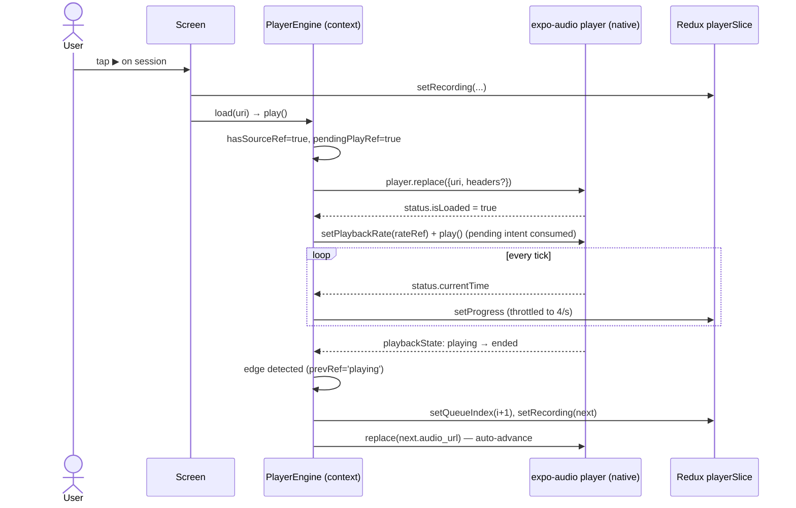
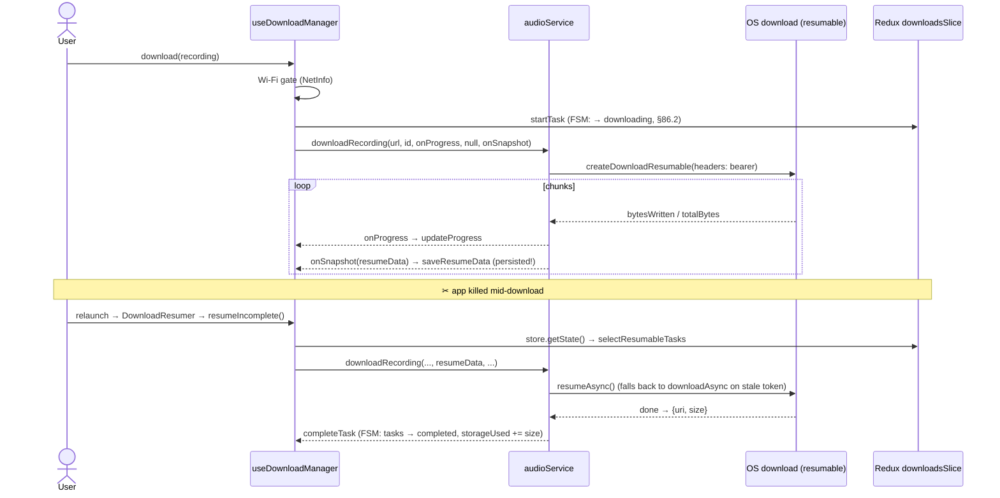

# 93. The Playback & Downloads Mega-Slice — Engine, Files, Resume: Every Line

> *The §92 template applied to the app's second-richest feature. Four files printed
> in full: the shared audio engine (`PlayerContext`), the filesystem service
> (`audioService`), the download-manager facade (`useDownloadManager`), and the
> headless relaunch resumer (`DownloadResumer`). The backend half of this slice —
> the gated `/recordings/{id}/audio` route with X-Accel-Redirect and CDN proxying —
> was printed in §90.4; this chapter is the client that consumes it.*

## 93.1 User story and the two sequence diagrams

> *As a listener, I want ruqyah sessions to keep playing through my queue while I
> use other screens — and to download sessions over Wi-Fi so they survive airplane
> mode, resuming interrupted downloads after the app is killed.*
> **Acceptance criteria:** one track ending auto-plays the next queue entry from any
> screen; progress UI updates smoothly without lagging playback; downloads show live
> progress, can be cancelled, respect a Wi-Fi-only preference, and continue from
> where they stopped after a relaunch; deleting a download frees exactly its bytes.

**Playback, including auto-advance:**



**Download, kill, and resume:**



## 93.2 File 1 — `PlayerContext.tsx`, full source + annotations

```tsx
import React, { createContext, useCallback, useContext, useEffect, useMemo, useRef } from 'react';
import { useAudioPlayer, useAudioPlayerStatus, setAudioModeAsync } from 'expo-audio';
import { useAppDispatch, useAppSelector } from '@/store/hooks';
import {
  setProgress, play as playAction, pause as pauseAction, setLoading, setLoadError,
  setRecording, setQueueIndex, clearQueue,
  selectQueue, selectQueueIndex, selectPlaybackRate, selectPlayerLoading,
} from '@/store/slices/playerSlice';
import type { Recording } from '@/types/recording';

/**
 * Single shared `expo-audio` engine for ruqyah recordings. Holds the
 * non-serializable player object (which cannot live in Redux); playback STATE
 * is mirrored into `playerSlice`. Completely separate from the Mushaf
 * `useAudio` engine — the two never share a player (RULE_42).
 */
export interface PlayerEngine {
  load: (uri: string) => void;
  play: () => void;
  pause: () => void;
  seek: (millis: number) => void;
  setRate: (rate: number) => void;
}

const PlayerContext = createContext<PlayerEngine | null>(null);
const PROGRESS_THROTTLE_MS = 250;

export function PlayerProvider({ children }: { children: React.ReactNode }) {
  const dispatch = useAppDispatch();
  const player = useAudioPlayer(null);
  const status = useAudioPlayerStatus(player);
  const lastTickRef = useRef(0);
  const hasSourceRef = useRef(false);
  const pendingPlayRef = useRef(false);
  const isLoadedRef = useRef(false);
  const prevPlaybackStateRef = useRef<string | undefined>(undefined);

  // Keep queue in refs so the playbackState effect never has stale values
  // without re-creating the effect on every queue update.
  const queue = useAppSelector(selectQueue);
  const queueIndex = useAppSelector(selectQueueIndex);
  const queueRef = useRef<Recording[]>(queue);
  const queueIndexRef = useRef<number>(queueIndex);
  useEffect(() => { queueRef.current = queue; }, [queue]);
  useEffect(() => { queueIndexRef.current = queueIndex; }, [queueIndex]);

  // Mirror the chosen playback speed so it can be re-applied after a source
  // swap (expo-audio resets the rate to 1× on `replace`).
  const playbackRate = useAppSelector(selectPlaybackRate);
  const rateRef = useRef(playbackRate);
  useEffect(() => { rateRef.current = playbackRate; }, [playbackRate]);

  useEffect(() => {
    setAudioModeAsync({
      allowsRecording: false,
      playsInSilentMode: true,
      shouldPlayInBackground: true,
    }).catch(() => {});
  }, []);

  // Throttle high-frequency progress updates into Redux (~4/sec).
  useEffect(() => {
    const now = Date.now();
    if (now - lastTickRef.current >= PROGRESS_THROTTLE_MS) {
      lastTickRef.current = now;
      dispatch(setProgress({
        position: (status.currentTime ?? 0) * 1000,
        duration: (status.duration ?? 0) * 1000,
      }));
    }
  }, [status.currentTime, status.duration, dispatch]);

  useEffect(() => {
    dispatch(status.playing ? playAction() : pauseAction());
  }, [status.playing, dispatch]);

  // Keep isLoaded ref fresh so play() can check it without a stale closure.
  // Auto-play as soon as the source is ready when a play was requested.
  useEffect(() => {
    isLoadedRef.current = status.isLoaded;
    if (status.isLoaded) {
      if (rateRef.current !== 1.0) {
        try { player.setPlaybackRate(rateRef.current); } catch {}
      }
      if (pendingPlayRef.current) {
        pendingPlayRef.current = false;
        player.play();
      }
    }
  }, [status.isLoaded, player]);

  // Loading = a source is attached but not ready yet. A track is "ready" once it
  // is playing OR has progressed past 0 — a fast local (downloaded) source can
  // finish loading without `isLoaded`/`playing` ever re-toggling, which would
  // otherwise leave the play-button spinner running forever.
  const loadingActive = useAppSelector(selectPlayerLoading);
  useEffect(() => {
    const ready = status.playing || (status.currentTime ?? 0) > 0;
    const next = hasSourceRef.current && !status.isLoaded && !ready;
    if (next !== loadingActive) dispatch(setLoading(next));
  }, [status.isLoaded, status.playing, status.currentTime, loadingActive, dispatch]);

  // AVPlayer (iOS) reports 'failed'; ExoPlayer (Android) may surface similar.
  useEffect(() => {
    if (hasSourceRef.current && status.playbackState === 'failed') {
      dispatch(setLoadError(true));
    }
  }, [status.playbackState, dispatch]);

  // Auto-advance the general ruqyah queue when a track ends naturally.
  // Detects the playing → idle/ended transition to distinguish from user pause.
  useEffect(() => {
    const prev = prevPlaybackStateRef.current;
    const curr = status.playbackState;

    if (prev === 'playing' && (curr === 'idle' || curr === 'ended') && hasSourceRef.current) {
      const q = queueRef.current;
      const idx = queueIndexRef.current;
      const nextIdx = idx + 1;

      if (q.length > 0 && nextIdx < q.length) {
        const next = q[nextIdx];
        if (next?.audio_url) {
          dispatch(setQueueIndex(nextIdx));
          dispatch(setRecording({ recording: next, diseaseId: next.disease_id, source: 'stream' }));
          pendingPlayRef.current = true;
          player.replace({ uri: next.audio_url, headers: { 'ngrok-skip-browser-warning': 'true' } });
        }
      } else if (q.length > 0) {
        dispatch(clearQueue());       // reached the end — clear
      }
    }

    prevPlaybackStateRef.current = curr;
  }, [status.playbackState, dispatch, player]);

  const load = useCallback((uri: string) => {
    hasSourceRef.current = true;
    pendingPlayRef.current = true;
    dispatch(setLoadError(false));
    // Sending HTTP headers with a downloaded `file://` source can stall the
    // load — omit them locally.
    const isRemote = /^https?:/i.test(uri);
    player.replace(isRemote ? { uri, headers: { 'ngrok-skip-browser-warning': 'true' } } : { uri });
  }, [player, dispatch]);

  const play = useCallback(() => {
    if (isLoadedRef.current) {
      player.play();
    } else {
      pendingPlayRef.current = true;   // source not ready — auto-play once isLoaded fires
    }
  }, [player]);

  const pause = useCallback(() => {
    pendingPlayRef.current = false;    // cancel any pending auto-play
    player.pause();
  }, [player]);

  const seek = useCallback((millis: number) => { player.seekTo(millis / 1000); }, [player]);

  const setRate = useCallback((rate: number) => {
    try { player.setPlaybackRate(rate); } catch {}
  }, [player]);

  const value = useMemo<PlayerEngine>(
    () => ({ load, play, pause, seek, setRate }),
    [load, play, pause, seek, setRate],
  );

  return <PlayerContext.Provider value={value}>{children}</PlayerContext.Provider>;
}

/** Internal — the imperative engine handle. Screens use `usePlayer` instead. */
export function useRuqyahEngine(): PlayerEngine {
  const ctx = useContext(PlayerContext);
  if (!ctx) throw new Error('useRuqyahEngine must be used within a PlayerProvider');
  return ctx;
}
```

**Annotations — six refs, seven effects, one memoized handle:**

* **Why a context at all: the player object is non-serializable.** Redux state must
  be plain data (persistable, devtools-diffable, §70); the native player is a live
  handle full of methods. The architecture splits them: the *object* lives here on
  the context's heap; its *state* is mirrored into `playerSlice` as numbers and
  booleans. One direction each: commands flow in through `PlayerEngine`, status
  flows out through dispatches.
* **The ref-mirror pattern, three times** (`queueRef`, `queueIndexRef`, `rateRef`):
  each selector value is copied into a ref by a one-line effect. The payoff is in
  the auto-advance effect's dependency array — `[status.playbackState, dispatch,
  player]` — **no queue**. If the effect depended on `queue`, every queue update
  would tear it down and re-create it; instead it re-runs only on playback-state
  changes and reads the *latest* queue through the ref at fire time. This is
  §76.5's identity-vs-freshness split applied to effect dependencies rather than
  callbacks.
* **`pendingPlayRef` is a deferred intent, not state.** `play()` before the source
  is ready can't call the native player; it records the intent, and the
  `status.isLoaded` effect consumes it (`pendingPlayRef.current = false;
  player.play()`). `pause()` cancels the intent. A boolean handshake between an
  imperative call and an async event — as state it would cause two renders per
  track start for something no UI displays.
* **The auto-advance is edge detection again** — `prev === 'playing' && curr ===
  'idle'|'ended'` distinguishes *natural end* from *user pause* (pause never passes
  through `playing → idle` with a source attached in the same way; and a fresh
  `replace` doesn't either because `prev` isn't `'playing'`). Same
  previous-value-ref pattern as §92.5's `wasAuthed`, third appearance — by now
  recognizable as *the* way to turn level-based signals into events.
* **The 250 ms throttle** (`lastTickRef`) caps Redux dispatches at 4/s no matter
  how fast the native side ticks — every dispatch wakes every subscribed selector
  (§70's cost model), so the throttle is what keeps the progress bar from taxing
  the whole app. Trailing precision is irrelevant: the bar moves 4×/s smoothly.
* **`value = useMemo(...)` — the counter-example to §92.3 ⑦, on purpose.** This
  provider re-renders 4×/second during playback (the status hook). Without the
  memo, every tick would hand consumers a fresh `PlayerEngine` object and re-render
  every screen holding the engine — the exact disaster the auth provider doesn't
  risk. All five callbacks are `useCallback([player, …])`-stable, so the memoized
  object survives ticks unchanged: **consumers of the engine never re-render from
  playback progress at all**; only components that *select* progress from Redux do,
  and those asked for it. This pair of providers is the document's cleanest
  demonstration of the §92 rule: memoize by event frequency × consumer
  indifference.
* **`load`'s `file://` guard** — headers ride only on `https?:` URIs; passing HTTP
  headers to a local file source can stall native loading. One regex test routes
  the two worlds. And `setLoadError(false)` on every load resets the §85.3-style
  error latch before the new attempt.

## 93.3 File 2 — `audioService.ts`, full source + annotations

```ts
import * as FileSystem from 'expo-file-system/legacy';
import { buildAudioHeaders } from '@/lib/audioAuth';

function getLocalPath(surahId: number, reciterId: number): string {
  const base = FileSystem.documentDirectory ?? FileSystem.cacheDirectory ?? '';
  return `${base}audio/surah_${surahId}_reciter_${reciterId}.mp3`;
}

async function isAudioCached(surahId: number, reciterId: number): Promise<boolean> {
  const info = await FileSystem.getInfoAsync(getLocalPath(surahId, reciterId));
  return info.exists;
}

async function downloadAudio(
  downloadUrl: string, surahId: number, reciterId: number,
  onProgress?: (progress: number) => void
): Promise<string> {
  const localPath = getLocalPath(surahId, reciterId);

  const dir = localPath.substring(0, localPath.lastIndexOf('/'));
  const dirInfo = await FileSystem.getInfoAsync(dir);
  if (!dirInfo.exists) {
    await FileSystem.makeDirectoryAsync(dir, { intermediates: true });
  }

  const downloadResumable = FileSystem.createDownloadResumable(
    downloadUrl, localPath, {},
    (downloadProgress) => {
      if (onProgress && downloadProgress.totalBytesExpectedToWrite > 0) {
        onProgress(downloadProgress.totalBytesWritten / downloadProgress.totalBytesExpectedToWrite);
      }
    }
  );

  const result = await downloadResumable.downloadAsync();
  if (!result) throw new Error('Download failed');
  return result.uri;
}

async function deleteAudio(surahId: number, reciterId: number): Promise<void> {
  const path = getLocalPath(surahId, reciterId);
  const info = await FileSystem.getInfoAsync(path);
  if (info.exists) await FileSystem.deleteAsync(path);
}

// --- Ruqyah recordings (Hospital module) — additive, keyed by recordingId ---
const activeRecordingDownloads = new Map<number, FileSystem.DownloadResumable>();

function getRecordingPath(recordingId: number): string {
  const base = FileSystem.documentDirectory ?? FileSystem.cacheDirectory ?? '';
  return `${base}audio/recording_${recordingId}.mp3`;
}

async function isRecordingCached(recordingId: number): Promise<boolean> {
  const info = await FileSystem.getInfoAsync(getRecordingPath(recordingId));
  return info.exists;
}

async function ensureAudioDir(localPath: string): Promise<void> {
  const dir = localPath.substring(0, localPath.lastIndexOf('/'));
  const dirInfo = await FileSystem.getInfoAsync(dir);
  if (!dirInfo.exists) {
    await FileSystem.makeDirectoryAsync(dir, { intermediates: true });
  }
}

async function downloadRecording(
  downloadUrl: string, recordingId: number,
  onProgress?: (progress: number, totalBytes: number) => void,
  resumeData?: string | null,                 // previously persisted OS resume token
  onSnapshot?: (resumeData: string) => void,  // persist fresh tokens for post-kill resume
): Promise<{ uri: string; size: number }> {
  const localPath = getRecordingPath(recordingId);
  await ensureAudioDir(localPath);

  // Gated recording audio requires the bearer token (attached only for our own backend).
  const headers = await buildAudioHeaders(downloadUrl);

  const resumable = FileSystem.createDownloadResumable(
    downloadUrl, localPath, { headers },
    (p) => {
      if (onProgress && p.totalBytesExpectedToWrite > 0) {
        onProgress(p.totalBytesWritten / p.totalBytesExpectedToWrite, p.totalBytesExpectedToWrite);
      }
      if (onSnapshot) {
        const token = resumable.savable().resumeData;
        if (token) onSnapshot(token);
      }
    },
    resumeData ?? undefined,
  );
  activeRecordingDownloads.set(recordingId, resumable);

  try {
    let result: Awaited<ReturnType<typeof resumable.downloadAsync>>;
    if (resumeData) {
      try {
        result = await resumable.resumeAsync();     // continue the partial file
      } catch {
        result = await resumable.downloadAsync();   // stale token → start over
      }
    } else {
      result = await resumable.downloadAsync();
    }
    if (!result) throw new Error('Download cancelled');
    const info = await FileSystem.getInfoAsync(result.uri);
    return { uri: result.uri, size: info.exists && !info.isDirectory ? info.size : 0 };
  } finally {
    activeRecordingDownloads.delete(recordingId);   // registry cleanup, success OR failure
  }
}

async function cancelRecordingDownload(recordingId: number): Promise<void> {
  const resumable = activeRecordingDownloads.get(recordingId);
  if (resumable) {
    try { await resumable.cancelAsync(); } catch { /* already finished */ }
    activeRecordingDownloads.delete(recordingId);
  }
  await FileSystem.deleteAsync(getRecordingPath(recordingId), { idempotent: true });
}

async function deleteRecording(recordingId: number): Promise<void> {
  await FileSystem.deleteAsync(getRecordingPath(recordingId), { idempotent: true });
}

async function getRecordingsStorageUsage(): Promise<number> {
  const base = FileSystem.documentDirectory ?? FileSystem.cacheDirectory ?? '';
  const dir = `${base}audio`;
  const dirInfo = await FileSystem.getInfoAsync(dir);
  if (!dirInfo.exists) return 0;
  const files = await FileSystem.readDirectoryAsync(dir);
  let total = 0;
  for (const f of files) {
    if (!f.startsWith('recording_')) continue;
    const info = await FileSystem.getInfoAsync(`${dir}/${f}`);
    if (info.exists && !info.isDirectory) total += info.size;
  }
  return total;
}

/** Device-wide storage figures (bytes) used by the Downloads screen. */
async function getDeviceStorage(): Promise<{ free: number; total: number }> {
  try {
    const [free, total] = await Promise.all([
      FileSystem.getFreeDiskStorageAsync(),
      FileSystem.getTotalDiskCapacityAsync(),
    ]);
    return { free, total };
  } catch {
    return { free: 0, total: 0 };
  }
}

async function clearAllRecordings(): Promise<void> {
  const base = FileSystem.documentDirectory ?? FileSystem.cacheDirectory ?? '';
  const dir = `${base}audio`;
  const dirInfo = await FileSystem.getInfoAsync(dir);
  if (!dirInfo.exists) return;
  const files = await FileSystem.readDirectoryAsync(dir);
  for (const f of files) {
    if (f.startsWith('recording_')) {
      await FileSystem.deleteAsync(`${dir}/${f}`, { idempotent: true });
    }
  }
}

export const audioService = {
  getLocalPath, isAudioCached, downloadAudio, deleteAudio,               // Mushaf (unchanged)
  getRecordingPath, isRecordingCached, downloadRecording,               // Ruqyah recordings
  cancelRecordingDownload, deleteRecording, getRecordingsStorageUsage,
  getDeviceStorage, clearAllRecordings,
};
```

**Annotations — the filesystem as a keyed store, and the cancellation registry:**

* **The path scheme *is* the database.** `surah_{id}_reciter_{id}.mp3` and
  `recording_{id}.mp3` encode the primary key in the filename — `isRecordingCached`
  is a key lookup (`getInfoAsync`, one stat call), `clearAllRecordings` is a
  prefix scan. The two namespaces (Mushaf vs recordings) share the directory but
  not prefixes, which is what lets `clearAllRecordings` purge ruqyah downloads on
  sign-out (§92.3 ⑧) *without touching Mushaf audio* — a deliberate blast-radius
  boundary, the file-level twin of the two-databases rule (§81.2).
* **`activeRecordingDownloads: Map<number, DownloadResumable>`** — a module-scope
  registry (§85.3's pattern) whose only job is **cancellation**: `downloadRecording`
  registers the handle; `cancelRecordingDownload` looks it up and aborts. The
  `try/finally` guarantees deregistration on success, failure, *and* cancellation —
  without it, a failed download would leak its native handle in the Map forever
  (the §92.3 ① leak class, filesystem edition).
* **The resume-token round-trip** is the slice's heart: on every progress callback,
  `resumable.savable().resumeData` snapshots the OS's continuation token, and
  `onSnapshot` hands it *up* to be persisted in Redux (`saveResumeData`, §86.2 —
  which redux-persist writes to disk). After a kill, the token comes back *down*
  as `resumeData`, and `resumeAsync()` continues the partial file — with the
  `catch → downloadAsync()` downgrade when the OS rejects a stale token. Optimistic
  resume, pessimistic fallback: the file arrives either way, the token only decides
  how many bytes get re-fetched.
* **`buildAudioHeaders`** attaches the bearer token *only for our own backend* —
  the download URL may be the §90.4 gated route (needs `Authorization`) or a public
  CDN (must NOT receive the token: §75's don't-leak-credentials-to-third-parties).
  The decision lives in one helper, keyed on the URL's host.
* **`?? ''` fallback chains on `documentDirectory`** and the `{ idempotent: true }`
  delete flag are the §88 catalog applied to the filesystem: absence of a directory
  or file is an expected state, never an exception path.
* **`getDeviceStorage`'s `Promise.all`** — two independent native calls run
  concurrently (§85.3's parallel probes, n=2), and the `catch → {free: 0, total: 0}`
  null-object keeps the Downloads screen's math total-safe.

## 93.4 Files 3–4 — `useDownloadManager.ts` + `DownloadResumer.tsx`, full source + annotations

```ts
import { useCallback, useMemo } from 'react';
import NetInfo from '@react-native-community/netinfo';
import { useAppDispatch, useAppSelector } from '@/store/hooks';
import {
  startTask, saveResumeData, updateProgress, completeTask, failTask, cancelTask,
  removeDownload, clearAll as clearAllAction, setStorageUsed,
  selectCompletedDownloads, selectResumableTasks, selectStorageUsed, selectWifiOnly,
  type DownloadTask,
} from '@/store/slices/downloadsSlice';
import { showToast } from '@/store/slices/uiSlice';
import { store } from '@/store/store';
import type { RootState } from '@/store/rootReducer';
import { audioService } from '@/services/audioService';
import type { Recording } from '@/types/recording';

const selectTasks = (s: RootState): Record<number, DownloadTask> => s.downloads.tasks;

interface RunParams {
  recordingId: number; audioUrl: string; diseaseId: number;
  title: string; sessionNumber: number; resumeData?: string | null;
}

/** Wraps `downloadsSlice` + `audioService` — the per-recording download manager. */
export function useDownloadManager() {
  const dispatch = useAppDispatch();
  const completed = useAppSelector(selectCompletedDownloads);
  const tasks = useAppSelector(selectTasks);
  const storageUsed = useAppSelector(selectStorageUsed);
  const wifiOnly = useAppSelector(selectWifiOnly);

  // Shared download runner used by both a fresh tap and the relaunch resume path.
  const runDownload = useCallback(async (params: RunParams) => {
    const { recordingId, audioUrl, diseaseId, title, sessionNumber, resumeData } = params;
    try {
      const { uri, size } = await audioService.downloadRecording(
        audioUrl, recordingId,
        (progress, totalBytes) => dispatch(updateProgress({ recordingId, progress, totalBytes })),
        resumeData,
        (token) => dispatch(saveResumeData({ recordingId, resumeData: token })),
      );
      dispatch(completeTask({
        recordingId, diseaseId, title, sessionNumber,
        localPath: uri, size, downloadedAt: Date.now(),
      }));
    } catch (e) {
      dispatch(failTask({ recordingId, error: (e as Error).message ?? 'failed' }));
    }
  }, [dispatch]);

  const download = useCallback(async (recording: Recording, diseaseId: number) => {
    if (!recording.audio_url || recording.id in completed) return;

    if (wifiOnly) {
      const net = await NetInfo.fetch();
      if (net.type !== 'wifi') {
        dispatch(showToast({ message: 'Wi-Fi required to download', type: 'info' }));
        return;
      }
    }

    const title = `#${recording.session_number}`;
    dispatch(startTask({
      recordingId: recording.id, downloadUrl: recording.audio_url, diseaseId,
      title, sessionNumber: recording.session_number,
      localPath: audioService.getRecordingPath(recording.id),
    }));
    await runDownload({
      recordingId: recording.id, audioUrl: recording.audio_url,
      diseaseId, title, sessionNumber: recording.session_number,
    });
  }, [dispatch, completed, wifiOnly, runDownload]);

  // Continue any download left unfinished by a previous app session. Reads the store
  // directly so it reflects the just-rehydrated tasks rather than a stale render closure.
  const resumeIncomplete = useCallback(async () => {
    const state = store.getState();
    const pending = selectResumableTasks(state);
    if (pending.length === 0) return;

    if (state.downloads.wifiOnly) {
      const net = await NetInfo.fetch();
      if (net.type !== 'wifi') return;   // parked: they resume on the next Wi-Fi launch
    }

    for (const t of pending) {
      if (t.recordingId in state.downloads.completed) continue;
      void runDownload({
        recordingId: t.recordingId, audioUrl: t.downloadUrl, diseaseId: t.diseaseId,
        title: t.title, sessionNumber: t.sessionNumber, resumeData: t.resumeData,
      });
    }
  }, [runDownload]);

  const cancel = useCallback(async (recordingId: number) => {
    await audioService.cancelRecordingDownload(recordingId);
    dispatch(cancelTask(recordingId));
  }, [dispatch]);

  const deleteDownload = useCallback(async (recordingId: number) => {
    await audioService.deleteRecording(recordingId);
    dispatch(removeDownload(recordingId));
  }, [dispatch]);

  const clearAll = useCallback(async () => {
    await audioService.clearAllRecordings();
    dispatch(clearAllAction());
  }, [dispatch]);

  /** Reconcile the persisted `storageUsed` with what's actually on disk. */
  const refreshStorage = useCallback(async (): Promise<{ free: number; total: number }> => {
    const [used, device] = await Promise.all([
      audioService.getRecordingsStorageUsage(),
      audioService.getDeviceStorage(),
    ]);
    dispatch(setStorageUsed(used));
    return device;
  }, [dispatch]);

  const getTask = useCallback((recordingId: number) => tasks[recordingId], [tasks]);
  const isDownloaded = useCallback((recordingId: number) => recordingId in completed, [completed]);
  const getLocalUri = useCallback(
    (recordingId: number) => completed[recordingId]?.localPath ?? null,
    [completed],
  );

  return useMemo(
    () => ({
      downloads: completed, storageUsed, wifiOnly,
      download, resumeIncomplete, cancel, deleteDownload, clearAll, refreshStorage,
      getTask, isDownloaded, getLocalUri,
    }),
    [completed, storageUsed, wifiOnly, download, resumeIncomplete, cancel,
     deleteDownload, clearAll, refreshStorage, getTask, isDownloaded, getLocalUri],
  );
}
```

```tsx
// mobile/src/components/layout/DownloadResumer.tsx — complete
import { useEffect } from 'react';
import { useDownloadManager } from '@/hooks/useDownloadManager';

// Module-level guard: resume runs once per app session even if this mounts more than once.
let resumeStarted = false;

/**
 * Headless launch hook: once the persisted store has rehydrated, continue any per-recording
 * download that a previous app session left unfinished. Renders nothing.
 */
export function DownloadResumer() {
  const { resumeIncomplete } = useDownloadManager();

  useEffect(() => {
    if (resumeStarted) return;
    resumeStarted = true;
    void resumeIncomplete();
  }, [resumeIncomplete]);

  return null;
}
```

**Annotations — the facade, the escape hatch, and the run-once singleton:**

* **`useDownloadManager` is a facade** (the §76 orchestrator's sibling pattern): it
  owns *no* state of its own — every read is a selector over `downloadsSlice`
  (§86.2's FSM), every write pairs one `audioService` filesystem effect with one
  slice dispatch, in the order that keeps them consistent (**disk first, then
  state**: `cancel`/`deleteDownload`/`clearAll` all await the file operation before
  dispatching, so Redux never claims a file exists that doesn't).
* **`runDownload` is the DRY core** — the fresh-tap path (`download`) and the
  relaunch path (`resumeIncomplete`) differ only in where their parameters come
  from (a `Recording` object vs a persisted `DownloadTask` row); both funnel into
  one runner whose two callbacks wire the service's progress/snapshot streams
  straight into dispatches. The `catch → failTask` at the runner's bottom is the
  single place a download can fail *into* the FSM.
* **`store.getState()` in `resumeIncomplete` — the deliberate escape hatch.** At
  launch, this callback is created before redux-persist finishes rehydrating; the
  `useAppSelector` values captured in the render closure could be the *pre*-hydration
  emptiness. Reading the store imperatively at *call time* sees the just-rehydrated
  tasks. It's the Redux twin of the ref-mirror (§93.2): when a callback's execution
  time is far from its creation time, don't trust the closure — ask the source.
* **`void runDownload({...})` in the loop** — resumed downloads run *concurrently*
  (no `await` in the loop body); the `void` marks fire-and-forget intent (§81.2's
  write-behind). Each runner settles independently into `completeTask`/`failTask`;
  parallel resumption of three files takes as long as the largest, not the sum.
* **Wi-Fi gating appears twice with different UX** — the tap path *toasts* (the
  user is watching); the resume path *returns silently* (nobody is watching; the
  comment says the policy: parked until a Wi-Fi launch). Same check, two correct
  behaviours — policy belongs to the caller, which is exactly why the gate isn't
  buried in `audioService`.
* **`refreshStorage` is reconciliation** — `storageUsed` is a maintained aggregate
  (§86.2) that can drift (a crash between file-delete and dispatch); rescanning the
  directory and `setStorageUsed(actual)` heals it. Aggregate for speed, scan for
  truth, reconcile on the screen that displays it.
* **`DownloadResumer`** is a *headless component* — `return null`, exists purely to
  run one effect inside the providers' scope. The module-level `resumeStarted`
  boolean is the run-once guard: React 18 dev double-mounting, layout remounts, or
  a second `<DownloadResumer />` anywhere would otherwise double-resume every file.
  Module scope (§80.1) outlives every mount — the cheapest possible singleton
  latch, same species as `dbPromise` (§81.2) but for an *action* instead of a
  resource.

## 93.5 The concept ↦ line matrix, slice 2

| Concept | Where it lives in §93 |
|---|---|
| **User story / sequence diagrams** | §93.1 — story + playback and download/kill/resume sequences |
| **Pointers / refs** | six refs of the engine (§93.2); the `Map` of native download handles (§93.3) |
| **Stale-closure avoidance** | ref-mirrors for queue/rate (§93.2); `store.getState()` at call time (§93.4) |
| **Memory-leak prevention** | `try/finally` registry cleanup (§93.3); throttle capping dispatch pressure (§93.2); run-once module latch (§93.4) |
| **useMemo/useCallback done right** | the memoized `PlayerEngine` under 4 Hz re-renders — the load-bearing counter-example to §92's non-memoized auth value (§93.2) |
| **Edge detection / FSM** | `prevPlaybackStateRef` playing→ended transition (§93.2); the §86.2 task FSM driven by `startTask`/`completeTask`/`failTask` (§93.4) |
| **Data structures** | filename-as-primary-key store + prefix namespaces (§93.3); `Record<number, Task>` bucket jumps (§93.4) |
| **Algorithms** | queue-by-index advance (§83.8 realized in the engine); resume-token optimistic/fallback ladder (§93.3) |
| **Optimization** | 250 ms throttle; concurrent `void` resumes; disk-first consistency ordering; aggregate + reconciliation (§93.4) |
| **DI / facade / SRP** | engine object injected via context; manager facade over slice + service; Wi-Fi policy kept in the caller (§93.4) |
| **Null & absence** | `?? ''` directory fallbacks, `{idempotent: true}`, `?.localPath ?? null`, `resumeData ?? undefined` (§93.3–4) |

---

*The Playback & Downloads Mega-Slice (§93) applied the template to the audio
backbone: engine, filesystem service, manager facade, and run-once resumer.*

*The final chapter, **§94, prints the Mushaf Reader in full** — the orchestrator
and all four domain hooks whose refactor §76 analysed and §78 dissected, now as
complete files: the reading screen's entire client-side logic, from the karaoke
verse highlight to search, bookmarks, and the reciter picker, closed by the
document's last concept matrix.*
