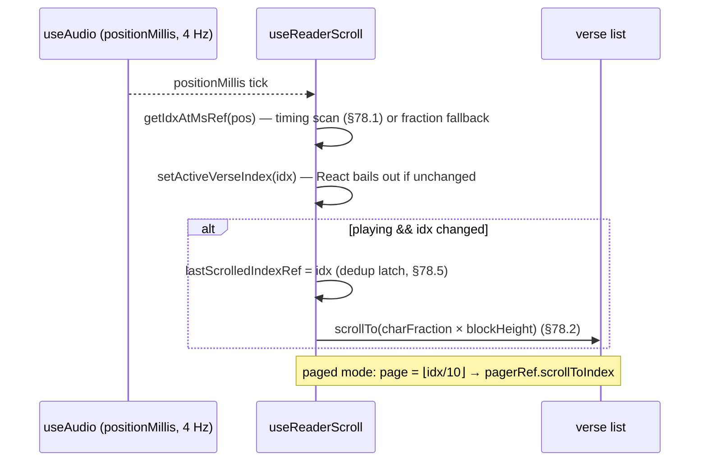

# 94. The Mushaf Reader Mega-Slice — the Five Hooks, Printed Whole

> *§76 analysed this refactor's architecture; §78 dissected its algorithms and
> memory. This closing chapter completes the treatment by printing all five files
> whole — the orchestrator and its four domain hooks — so the reading screen's
> entire client logic sits in one place. Annotations here cover only what the
> earlier dissections did not line-annotate; everything else is a §-pointer.*

## 94.1 User story and the karaoke loop

> *As a reader, I want the playing verse highlighted and kept in view — across
> continuous and paged modes, at any playback speed, with per-verse timing when
> available — while I search, bookmark pages, switch reciters, download audio for
> offline, and flip the display to read across a table.*



## 94.2 File 1 — `useMushafReader.ts` (the orchestrator), complete

```ts
import { useLocalSearchParams, useRouter } from 'expo-router';
import * as ScreenOrientation from 'expo-screen-orientation';
import { useCallback, useEffect, useMemo, useState } from 'react';
import { API_URL } from '@/services/api';
import { audioService } from '@/services/audioService';
import { useMushafContext } from '@/context/MushafContext';
import { useAudio, type PlaybackSpeed } from '@/hooks/useAudio';
import { useSurah } from '@/hooks/useSurah';
import { useReaderScroll } from '@/hooks/useReaderScroll';
import { useReaderRecitations } from '@/hooks/useReaderRecitations';
import { useReaderSearch } from '@/hooks/useReaderSearch';
import { useReaderBookmarks } from '@/hooks/useReaderBookmarks';
import { chunkVersesIntoPages, getTotalPagesForSurah } from '@/utils/mushafPages';
import { TOTAL_SURAHS, type FontScale, type ReaderDisplayMode } from '@/utils/mushafReader';
import type { Verse } from '@/types/verse';
import type { Recitation } from '@/types/recitation';

// CDN/remote recitations expose an absolute `audio_url` we can stream directly —
// this also sidesteps the local API base, which is unreachable from a device
// when the backend isn't on the LAN. Only backend-stored files (relative path)
// need the API proxy endpoint.
function resolveRecitationUri(recitation: Recitation): string {
  const url = recitation.audio_url ?? '';
  if (url.startsWith('http://') || url.startsWith('https://')) return url;
  return `${API_URL}/recitations/${recitation.id}/audio`;
}

export function useMushafReader() {
  const { id, highlight } = useLocalSearchParams() as { id: string; highlight?: string };
  const surahId = Number(id);
  const highlightVerseNumber = highlight ? Number(highlight) : null;
  const router = useRouter();

  const { selectedReciterId, setSelectedReciterId, isContextReady } = useMushafContext();
  const { data: surah, isLoading, error, refetch: refetchSurah, isRefetching: isSurahRefetching } = useSurah(surahId);
  const audio = useAudio();

  // ── Display options ────────────────────────────────────────────────────────
  const [showEnglish, setShowEnglish] = useState(false);
  const [displayMode, setDisplayMode] = useState<ReaderDisplayMode>('continuous');
  const [fontScale, setFontScale] = useState<FontScale>('md');
  const [fontScaleOpen, setFontScaleOpen] = useState(false);
  // Rotates the reading content 180° for reading from the opposite side of a
  // table. Header, toolbar and player stay upright.
  const [flipped, setFlipped] = useState(false);

  const pages = useMemo<Verse[][]>(() => {
    if (!surah) return [];
    return chunkVersesIntoPages(surah.verses);
  }, [surah]);

  const totalPages = useMemo(
    () => (surah ? getTotalPagesForSurah(surah.verses.length) : 0),
    [surah]
  );

  // ── Domain hooks (call order = dependency order, §76.2) ─────────────────────
  const recitations = useReaderRecitations({ surahId, selectedReciterId, setSelectedReciterId, audio });
  const { currentRecitation, unavailableReciterIds, verseTiming } = recitations;

  const scroll = useReaderScroll({
    surah, surahId, highlightVerseNumber, audio, verseTiming, pages, displayMode,
  });

  const search = useReaderSearch({
    surahId, surah,
    scrollToVerse: scroll.scrollToVerse,
    setSearchHighlightIndex: scroll.setSearchHighlightIndex,
  });

  const bookmarks = useReaderBookmarks({
    surahId, pages, displayMode,
    currentPageIndex: scroll.currentPageIndex,
    setCurrentPageIndex: scroll.setCurrentPageIndex,
    scrollRef: scroll.scrollRef, pagerRef: scroll.pagerRef,
    versesTopRef: scroll.versesTopRef, versesHeightRef: scroll.versesHeightRef,
    currentPageRef: scroll.currentPageRef,
  });

  // ── Orientation lock / unmount cleanup ──────────────────────────────────────
  useEffect(() => {
    if (flipped) {
      ScreenOrientation.lockAsync(ScreenOrientation.OrientationLock.LANDSCAPE).catch(() => {});
    } else {
      ScreenOrientation.lockAsync(ScreenOrientation.OrientationLock.PORTRAIT_UP).catch(() => {});
    }
    return () => {
      ScreenOrientation.lockAsync(ScreenOrientation.OrientationLock.PORTRAIT_UP).catch(() => {});
    };
  }, [flipped]);

  useEffect(() => {
    return () => { audio.unload(); };
  }, []);

  // ── Playback glue (ties audio ↔ recitations ↔ scroll, §76.2) ───────────────
  const handlePlay = useCallback(async () => {
    if (!currentRecitation || !selectedReciterId) return;
    if (audio.hasError || unavailableReciterIds.has(selectedReciterId)) {
      recitations.setShowReciterPicker(true);
      return;
    }
    if (audio.isPlaying) {
      await audio.pause();
      return;
    }
    // Only load if no source has been set — prevents restarting from 0 on every resume
    if (!audio.hasSource) {
      const cached = await audioService.isAudioCached(surahId, selectedReciterId);
      const uri = cached
        ? audioService.getLocalPath(surahId, selectedReciterId)
        : resolveRecitationUri(currentRecitation);
      await audio.loadAudio(uri);
    }
    await audio.play();
  }, [currentRecitation, selectedReciterId, surahId, audio, unavailableReciterIds, recitations]);

  const handleDownload = useCallback(async () => {
    if (!currentRecitation || !selectedReciterId) return;
    recitations.setIsDownloading(true);
    try {
      await audioService.downloadAudio(
        resolveRecitationUri(currentRecitation),
        surahId, selectedReciterId,
        recitations.setDownloadProgress
      );
      recitations.setIsCached(true);
    } finally {
      recitations.setIsDownloading(false);
      recitations.setDownloadProgress(0);
    }
  }, [currentRecitation, selectedReciterId, surahId, recitations]);

  const handleSeek = useCallback((ms: number) => {
    const clipped = Math.max(0, ms);
    audio.seekTo(clipped);
    // Snap highlight immediately — don't wait for positionMillis to async-update
    const idx = scroll.getIdxAtMs(clipped);
    if (idx >= 0) {
      scroll.setActiveVerseIndex(idx);
      scroll.lastScrolledIndexRef.current = idx;
      scroll.scrollToVerse(idx);
    }
  }, [audio, scroll]);

  const handleSkip = useCallback((deltaSecs: number) => {
    const newMs = Math.max(0, audio.positionMillis + deltaSecs * 1000);
    audio.seekTo(newMs);
    const idx = scroll.getIdxAtMs(newMs);
    if (idx >= 0) {
      scroll.setActiveVerseIndex(idx);
      scroll.lastScrolledIndexRef.current = idx;
      scroll.scrollToVerse(idx);
    }
  }, [audio, scroll]);

  const handleSetRate = useCallback((spd: PlaybackSpeed) => {
    audio.setRate(spd);
  }, [audio]);

  const handleRefresh = useCallback(async () => {
    recitations.setIsRefreshingRecitations(true);
    try {
      await refetchSurah();
      await recitations.handleRefreshRecitations();
    } catch {
      // keep existing data on failure
    } finally {
      recitations.setIsRefreshingRecitations(false);
    }
  }, [refetchSurah, recitations]);

  const goToPrev = useCallback(() => {
    if (surahId > 1) router.setParams({ id: String(surahId - 1) });
  }, [surahId, router]);

  const goToNext = useCallback(() => {
    if (surahId < TOTAL_SURAHS) router.setParams({ id: String(surahId + 1) });
  }, [surahId, router]);

  // ── Derived display flags ────────────────────────────────────────────────────
  const hasAudio = audio.durationMillis > 0;

  const selectedReciterUnavailable =
    selectedReciterId != null && unavailableReciterIds.has(selectedReciterId);
  const showAudioError = audio.hasError || selectedReciterUnavailable;

  // True while the reciter is saying the basmalah before verse 1.
  const timingLoaded = verseTiming != null && verseTiming.length > 0;
  const firstVerseMs = timingLoaded ? verseTiming![0].timestampFrom : 0;
  const isBasmalahPhase = !!surah && surah.id !== 1 && surah.id !== 9; // Fatiha v1 IS basmalah; Tawbah has none
  const isBasmalahActive =
    audio.isPlaying &&
    isBasmalahPhase &&
    (timingLoaded
      ? firstVerseMs > 0 && audio.positionMillis < firstVerseMs   // exact window
      : audio.positionMillis < 3000);                             // fallback: assume ≤3 s bismillah

  return {
    surahId, surah, isLoading, error, refetchSurah, isContextReady,
    currentRecitation,
    isLoadingRecitations: recitations.isLoadingRecitations,
    selectedReciterId,
    filteredReciters: recitations.filteredReciters,
    reciterSearch: recitations.reciterSearch,
    setReciterSearch: recitations.setReciterSearch,
    showReciterPicker: recitations.showReciterPicker,
    setShowReciterPicker: recitations.setShowReciterPicker,
    handleReciterSelect: recitations.handleReciterSelect,
    audio, hasAudio, showAudioError, isBasmalahActive,
    handlePlay, handleSeek, handleSkip, handleSetRate,
    isCached: recitations.isCached,
    isDownloading: recitations.isDownloading,
    downloadProgress: recitations.downloadProgress,
    handleDownload,
    isSurahRefetching,
    isRefreshingRecitations: recitations.isRefreshingRecitations,
    handleRefresh,
    showEnglish, setShowEnglish, displayMode, setDisplayMode,
    fontScale, setFontScale, fontScaleOpen, setFontScaleOpen, flipped, setFlipped,
    pages, totalPages,
    activeVerseIndex: scroll.activeVerseIndex,
    searchHighlightIndex: scroll.searchHighlightIndex,
    scrollRef: scroll.scrollRef, pagerRef: scroll.pagerRef,
    versesTopRef: scroll.versesTopRef, versesHeightRef: scroll.versesHeightRef,
    contentHeightRef: scroll.contentHeightRef,
    viewabilityConfig: scroll.viewabilityConfig,
    onViewableItemsChanged: scroll.onViewableItemsChanged,
    handleContinuousScroll: scroll.handleContinuousScroll,
    goToPrev, goToNext,
    currentPageIndex: scroll.currentPageIndex,
    isCurrentBookmarked: bookmarks.isCurrentBookmarked,
    surahBookmarks: bookmarks.surahBookmarks,
    bookmarkModalOpen: bookmarks.bookmarkModalOpen,
    setBookmarkModalOpen: bookmarks.setBookmarkModalOpen,
    handleToggleBookmark: bookmarks.handleToggleBookmark,
    handleGoToBookmark: bookmarks.handleGoToBookmark,
    searchOpen: search.searchOpen, setSearchOpen: search.setSearchOpen,
    searchQuery: search.searchQuery, setSearchQuery: search.setSearchQuery,
    searchResults: search.searchResults, setSearchResults: search.setSearchResults,
    isSearching: search.isSearching,
    handleSearch: search.handleSearch,
    handleSearchResultPress: search.handleSearchResultPress,
  };
}
```

New annotations (architecture: §76.2; algorithms: §78):

* **`resolveRecitationUri`** routes by URL shape: absolute → stream the CDN
  directly (bypasses the local-API problem the file's comment documents); relative
  → the backend proxy route. The mobile mirror of `streamUrl()` (§91.2).
* **`handlePlay`'s cache-first source pick** — `isAudioCached ? localPath :
  remoteUri` is the offline tier (§81.1 layer 4) joining playback; and the
  `!audio.hasSource` guard means *resume never reloads*: pausing and re-tapping
  play continues at position instead of restarting at 0.
* **`goToPrev/goToNext` use `router.setParams`, not `push`** — same screen, new
  `id`; no navigation-stack growth from paging through 114 surahs (a leak-shaped
  UX bug avoided). The cost is that *nothing remounts*, which is exactly why
  `useReaderScroll` and `useReaderRecitations` carry explicit `[surahId]` reset
  effects (§94.3–4).
* **The basmalah flag** — two-mode evaluation with the postfix `!` proven by
  `timingLoaded` one line above (the §79.3 exemplar in situ), the domain rule
  encoded in plain reads: Fatiha's first verse *is* the basmalah, Tawbah has none.
* **`handleDownload`'s `try/finally`** — progress resets to 0 and the flag drops
  whether the download succeeded or threw: spinner-stuck-forever is made
  impossible by structure, not by remembering to reset in two places (§93.3's
  finally, UI edition).

## 94.3 File 2 — `useReaderScroll.ts`, complete

```ts
import { useCallback, useEffect, useMemo, useRef, useState } from 'react';
import type { FlatList, NativeScrollEvent, NativeSyntheticEvent, ScrollView } from 'react-native';
import { getPageIndexForVerseIndex } from '@/utils/mushafPages';
import type { ReaderDisplayMode } from '@/utils/mushafReader';
import type { VerseTiming } from '@/hooks/useVerseTiming';
import type { SurahWithVerses } from '@/types/surah';
import type { Verse } from '@/types/verse';

type AudioSlice = { positionMillis: number; durationMillis: number; isPlaying: boolean };

type Params = {
  surah: SurahWithVerses | undefined;
  surahId: number;
  highlightVerseNumber: number | null;
  audio: AudioSlice;
  verseTiming: VerseTiming[] | undefined;
  pages: Verse[][];
  displayMode: ReaderDisplayMode;
};

export function useReaderScroll({
  surah, surahId, highlightVerseNumber, audio, verseTiming, pages, displayMode,
}: Params) {
  const [activeVerseIndex, setActiveVerseIndex] = useState(-1);
  const [currentPageIndex, setCurrentPageIndex] = useState(0);
  const [searchHighlightIndex, setSearchHighlightIndex] = useState(-1);

  const scrollRef = useRef<ScrollView>(null);
  const contentHeightRef = useRef(0);
  const lastScrolledIndexRef = useRef(-1);
  const versesTopRef = useRef(0);
  const versesHeightRef = useRef(0);
  const scrollToVerseRef = useRef((_idx: number) => {});
  const pagerRef = useRef<FlatList<Verse[]>>(null);
  const lastPageRef = useRef(-1);
  const currentPageRef = useRef(0);
  const viewabilityConfig = useRef({ itemVisiblePercentThreshold: 60 }).current;
  const onViewableItemsChanged = useRef(
    ({ viewableItems }: { viewableItems: Array<{ index: number | null }> }) => {
      const first = viewableItems[0];
      if (first && typeof first.index === 'number') {
        currentPageRef.current = first.index;
        setCurrentPageIndex(first.index);
      }
    }
  ).current;

  // Text-length proportional fractions — fallback while verseTiming is loading
  const verseStartFractions = useMemo(() => {
    if (!surah) return [] as number[];
    const lengths = surah.verses.map((v) => Math.max(v.text.ar.replace(/\s/g, '').length, 8));
    const total = lengths.reduce((a, b) => a + b, 0);
    let cum = 0;
    return lengths.map((len) => { const s = cum / total; cum += len; return s; });
  }, [surah]);

  // Cumulative char offset before each verse — drives character-proportional scroll.
  const verseCumChars = useMemo(() => {
    if (!surah) return [] as number[];
    let cum = 0;
    return surah.verses.map((v) => { const s = cum; cum += v.text.ar.length; return s; });
  }, [surah]);

  const totalChars = useMemo(
    () => (surah ? Math.max(1, surah.verses.reduce((s, v) => s + v.text.ar.length, 0)) : 1),
    [surah]
  );

  // Always-fresh lookup function in a ref (§76.5, §78.1).
  const getIdxAtMsRef = useRef<(ms: number) => number>(() => -1);
  getIdxAtMsRef.current = (posMs: number): number => {
    if (verseTiming && verseTiming.length > 0) {
      for (let i = verseTiming.length - 1; i >= 0; i--) {
        if (posMs >= verseTiming[i].timestampFrom) return i;
      }
      return 0;
    }
    if (verseStartFractions.length === 0 || audio.durationMillis === 0) return -1;
    const progress = posMs / audio.durationMillis;
    for (let i = verseStartFractions.length - 1; i >= 0; i--) {
      if (progress >= verseStartFractions[i]) return i;
    }
    return 0;
  };

  // Always-fresh scroll helper (§78.2's prefix-sum payoff).
  scrollToVerseRef.current = (idx: number) => {
    if (idx < 0) return;
    const blockH = versesHeightRef.current;
    const blockTop = versesTopRef.current;
    const targetY = blockH > 0
      ? blockTop + (verseCumChars[idx] ?? 0) / totalChars * blockH - 150
      : idx * 90;
    scrollRef.current?.scrollTo({ y: Math.max(0, targetY), animated: true });
  };

  // Stable wrappers so consumer hooks can depend on these without re-creating.
  const scrollToVerse = useCallback((idx: number) => scrollToVerseRef.current(idx), []);
  const getIdxAtMs = useCallback((ms: number) => getIdxAtMsRef.current(ms), []);

  // Auto-scroll and highlight the verse requested via the ?highlight= URL param
  useEffect(() => {
    if (!surah || !highlightVerseNumber) return;
    const idx = surah.verses.findIndex((v) => v.verse_number === highlightVerseNumber);
    if (idx < 0) return;
    setSearchHighlightIndex(idx);
    const timer = setTimeout(() => scrollToVerseRef.current(idx), 700);
    return () => clearTimeout(timer);
  }, [surah?.id, highlightVerseNumber]);

  useEffect(() => {
    setCurrentPageIndex(0);
    currentPageRef.current = 0;
  }, [surahId]);

  // setParams doesn't remount — manually reset scroll state when the surah changes
  useEffect(() => {
    setActiveVerseIndex(-1);
    lastScrolledIndexRef.current = -1;
    scrollRef.current?.scrollTo({ y: 0, animated: false });
    pagerRef.current?.scrollToOffset({ offset: 0, animated: false });
  }, [surahId]);

  useEffect(() => {
    if (!surah || audio.durationMillis === 0) { setActiveVerseIndex(-1); return; }
    const idx = getIdxAtMsRef.current(audio.positionMillis);
    if (idx < 0) return;
    // Update highlight — React bails out if idx hasn't changed, so no extra re-render
    setActiveVerseIndex(idx);
    if (audio.isPlaying && idx !== lastScrolledIndexRef.current) {
      lastScrolledIndexRef.current = idx;
      scrollToVerseRef.current(idx);
    }
  }, [audio.positionMillis, audio.durationMillis, audio.isPlaying, surah]);

  useEffect(() => {
    if (!audio.isPlaying) {
      lastScrolledIndexRef.current = -1;
      lastPageRef.current = -1;
    }
  }, [audio.isPlaying]);

  useEffect(() => {
    if (displayMode !== 'pages' || activeVerseIndex < 0 || !audio.isPlaying) return;
    const page = getPageIndexForVerseIndex(activeVerseIndex);
    if (page === lastPageRef.current) return;
    lastPageRef.current = page;
    pagerRef.current?.scrollToIndex({ index: page, animated: true });
  }, [activeVerseIndex, displayMode, audio.isPlaying]);

  // Continuous-mode scroll → derive the current Mushaf page from offset (§78.6).
  const handleContinuousScroll = useCallback(
    (e: NativeSyntheticEvent<NativeScrollEvent>) => {
      const y = e.nativeEvent.contentOffset.y;
      if (pages.length > 0 && versesHeightRef.current > 0) {
        const relativeY = Math.max(0, y - versesTopRef.current);
        const pageH = versesHeightRef.current / pages.length;
        const idx = Math.max(0, Math.min(pages.length - 1, Math.floor(relativeY / pageH)));
        if (idx !== currentPageRef.current) {
          currentPageRef.current = idx;
          setCurrentPageIndex(idx);
        }
      }
    },
    [pages.length]
  );

  return {
    scrollRef, pagerRef, contentHeightRef, versesTopRef, versesHeightRef,
    currentPageRef, lastScrolledIndexRef,
    viewabilityConfig, onViewableItemsChanged,
    activeVerseIndex, setActiveVerseIndex,
    currentPageIndex, setCurrentPageIndex,
    searchHighlightIndex, setSearchHighlightIndex,
    scrollToVerse, getIdxAtMs, handleContinuousScroll,
  };
}
```

New annotations (refs: §78.5; scan & prefix sums: §78.1–78.2, §83.1, §83.3):

* **`AudioSlice`/`Params` are narrowing types** — the hook asks for *three* audio
  fields, not the whole engine (interface-segregation at hook scale): a test can
  drive it with `{positionMillis, durationMillis, isPlaying}` literals.
* **`onViewableItemsChanged` lives in a `useRef(...).current`** — FlatList requires
  this callback's identity to *never* change (it throws if it does); a ref-wrapped
  function is identity-frozen at mount, stronger than `useCallback`. Same for
  `viewabilityConfig`. The 60 % threshold means a page "becomes current" when most
  of it is visible.
* **The `?highlight=` deep-link effect** — `findIndex` maps verse *number* to array
  *index* (they differ — index is 0-based), the 700 ms `setTimeout` waits for layout
  to settle before scrolling (`versesHeightRef` must be measured first), and the
  cleanup clears the timer if the user navigates away inside the window (§85.4's
  leak rule). Dep `surah?.id` — not `surah` — re-fires on a *different* surah but
  not on a refetch of the same one.
* **The two `[surahId]` reset effects** are the price of `setParams` navigation
  (§94.2): no remount means no fresh state, so page index, highlight, latch and
  scroll offsets are re-zeroed by hand. State that survives navigation must be
  reset *by* navigation.
* **Fraction floor `Math.max(…, 8)`** in `verseStartFractions` gives ultra-short
  verses a minimum share so the fallback highlight doesn't sweep through them
  instantly — a smoothing constant, the timing-less cousin of §78.2's divide-guard.

## 94.4 File 3 — `useReaderRecitations.ts`, complete

```ts
import { useCallback, useEffect, useMemo, useState } from 'react';
import { audioService } from '@/services/audioService';
import { offlineStorage } from '@/services/offlineStorage';
import { quranService } from '@/services/quranService';
import { useReciterAvailability } from '@/hooks/useReciterAvailability';
import { useVerseTiming } from '@/hooks/useVerseTiming';
import type { Recitation } from '@/types/recitation';

type AudioSlice = { hasError: boolean; unload: () => void | Promise<void> };

type Params = {
  surahId: number;
  selectedReciterId: number | null;
  setSelectedReciterId: (id: number | null) => void;
  audio: AudioSlice;
};

export function useReaderRecitations({ surahId, selectedReciterId, setSelectedReciterId, audio }: Params) {
  const [recitations, setRecitations] = useState<Recitation[]>([]);
  const [isLoadingRecitations, setIsLoadingRecitations] = useState(true);
  const [isRefreshingRecitations, setIsRefreshingRecitations] = useState(false);
  const [isDownloading, setIsDownloading] = useState(false);
  const [downloadProgress, setDownloadProgress] = useState(0);
  const [isCached, setIsCached] = useState(false);
  const [showReciterPicker, setShowReciterPicker] = useState(false);
  const [reciterSearch, setReciterSearch] = useState('');

  const currentRecitation = recitations.find((r) => r.reciter_id === selectedReciterId);

  // Detects reciters whose audio actually 404s for this surah (§85.3).
  const { unavailableReciterIds, markUnavailable } = useReciterAvailability(recitations);

  const reciters = useMemo(
    () =>
      recitations.flatMap((r) =>
        r.reciter && !unavailableReciterIds.has(r.reciter_id) ? [r.reciter] : []
      ),
    [recitations, unavailableReciterIds]
  );

  const filteredReciters = useMemo(() => {
    const q = reciterSearch.trim().toLowerCase();
    if (!q) return reciters;
    return reciters.filter(
      (r) => r.name.ar.toLowerCase().includes(q) || (r.name.en ?? '').toLowerCase().includes(q)
    );
  }, [reciters, reciterSearch]);

  const handleReciterSelect = useCallback(
    (id: number | null) => {
      setSelectedReciterId(id);
      setShowReciterPicker(false);
      setReciterSearch('');
      audio.unload();
    },
    [setSelectedReciterId, audio]
  );

  // Precise per-verse timestamps from Quran.com v4 (same recitation ID the seeder uses)
  const { data: verseTiming } = useVerseTiming(surahId, currentRecitation?.reciter?.name?.en ?? undefined);

  useEffect(() => {
    setIsLoadingRecitations(true);
    quranService
      .getSurahRecitations(surahId)
      .then((res) => {
        const list = res.data ?? [];
        setRecitations(list);
        offlineStorage.saveRecitations(list).catch(() => {});
      })
      .catch(async () => {
        const cached = await offlineStorage.getRecitationsBySurah(surahId);
        setRecitations(cached);
      })
      .finally(() => setIsLoadingRecitations(false));
  }, [surahId]);

  useEffect(() => {
    if (!currentRecitation || !selectedReciterId) return;
    audioService.isAudioCached(surahId, selectedReciterId).then(setIsCached);
  }, [currentRecitation, surahId, selectedReciterId]);

  // setParams doesn't remount — unload audio and clear the cached flag on surah change.
  useEffect(() => {
    audio.unload();
    setIsCached(false);
  }, [surahId]);

  // When the selected reciter's audio fails to load (e.g. CDN 404), hide that
  // reciter from the picker so the user can pick one that actually works.
  useEffect(() => {
    if (audio.hasError && selectedReciterId) {
      markUnavailable(selectedReciterId, currentRecitation?.audio_url);
    }
  }, [audio.hasError, selectedReciterId, currentRecitation?.audio_url, markUnavailable]);

  const handleRefreshRecitations = useCallback(async () => {
    const res = await quranService.getSurahRecitations(surahId);
    const list = res.data ?? [];
    setRecitations(list);
    offlineStorage.saveRecitations(list).catch(() => {});
  }, [surahId]);

  return {
    recitations, currentRecitation, verseTiming, unavailableReciterIds,
    isLoadingRecitations, isRefreshingRecitations, setIsRefreshingRecitations,
    isCached, setIsCached, isDownloading, setIsDownloading,
    downloadProgress, setDownloadProgress,
    showReciterPicker, setShowReciterPicker,
    reciterSearch, setReciterSearch, filteredReciters,
    handleReciterSelect, handleRefreshRecitations,
  };
}
```

New annotations (flatMap/filter: §78.3–78.4; probe: §85.3):

* **The load effect is `cachedFetch` hand-rolled in reverse** — network `.then`
  (state + write-behind to the Mushaf's own SQLite, `offlineStorage`) with
  `.catch` falling back to the cached rows. Same offline policy as §81.2, kept
  separate because the Mushaf predates `contentCache` and its store must never be
  touched (the §81.2 comment's "deliberately a SEPARATE database").
* **`currentRecitation` is a plain `find` on every render** — O(n) over ~50 rows,
  cheaper than a memo's bookkeeping; the §92 memoization rule applied downward.
* **`handleReciterSelect` bundles four updates** — new id, close picker, clear
  search, `audio.unload()` — the last being the correctness one: the old reciter's
  source must not keep playing under the new reciter's label.
* **The timing hook keys on the reciter's *English name*** — the Quran.com v4
  timing catalogue is looked up by reciter, `?? undefined` folding the whole
  optional chain (`currentRecitation?.reciter?.name?.en`) into "no timing
  available" (the fractions fallback then carries the highlight, §94.3).

## 94.5 Files 4–5 — `useReaderSearch.ts` + `useReaderBookmarks.ts`, complete

```ts
import { useCallback, useState } from 'react';
import { useRouter } from 'expo-router';
import { quranService } from '@/services/quranService';
import { VERSE_REF_RE, normalizeArabicDigits } from '@/utils/mushafReader';
import type { SurahWithVerses } from '@/types/surah';
import type { Verse } from '@/types/verse';

type Params = {
  surahId: number;
  surah: SurahWithVerses | undefined;
  scrollToVerse: (idx: number) => void;
  setSearchHighlightIndex: (idx: number) => void;
};

export function useReaderSearch({ surahId, surah, scrollToVerse, setSearchHighlightIndex }: Params) {
  const router = useRouter();
  const [searchOpen, setSearchOpen] = useState(false);
  const [searchQuery, setSearchQuery] = useState('');
  const [searchResults, setSearchResults] = useState<Verse[] | null>(null);
  const [isSearching, setIsSearching] = useState(false);

  const handleSearch = useCallback(
    async (rawQuery: string) => {
      const q = normalizeArabicDigits(rawQuery.trim());
      if (!q) return;
      const match = q.match(VERSE_REF_RE);
      if (match) {
        const sid = Number(match[1]);
        const vnum = Number(match[2]);
        if (sid >= 1 && sid <= 114 && vnum >= 1) {
          setSearchOpen(false);
          setSearchQuery('');
          setSearchResults(null);
          if (sid === surahId && surah) {
            const idx = surah.verses.findIndex((v) => v.verse_number === vnum);
            if (idx >= 0) {
              setSearchHighlightIndex(idx);
              scrollToVerse(idx);
            }
          } else {
            router.replace(`/mushaf/${sid}?highlight=${vnum}` as any);
          }
          return;
        }
      }
      if (q.length < 2) return;
      setIsSearching(true);
      try {
        const res = await quranService.searchVerses(rawQuery.trim());
        setSearchResults(res.data ?? []);
      } catch {
        setSearchResults([]);
      } finally {
        setIsSearching(false);
      }
    },
    [surahId, surah, router, scrollToVerse, setSearchHighlightIndex]
  );

  const handleSearchResultPress = useCallback(
    (result: Verse) => {
      setSearchOpen(false);
      setSearchQuery('');
      setSearchResults(null);
      if (result.surah_id === surahId && surah) {
        const idx = surah.verses.findIndex((v) => v.id === result.id);
        if (idx >= 0) {
          setSearchHighlightIndex(idx);
          scrollToVerse(idx);
        }
      } else {
        router.replace(`/mushaf/${result.surah_id}?highlight=${result.verse_number}` as any);
      }
    },
    [surahId, surah, router, scrollToVerse, setSearchHighlightIndex]
  );

  return {
    searchOpen, setSearchOpen, searchQuery, setSearchQuery,
    searchResults, setSearchResults, isSearching,
    handleSearch, handleSearchResultPress,
  };
}
```

```ts
import { useCallback, useEffect, useMemo, useState } from 'react';
import { useRouter } from 'expo-router';
import type { FlatList, ScrollView } from 'react-native';
import {
  addPageBookmark, getAllPageBookmarks, removePageBookmark, type PageBookmark,
} from '@/services/bookmarks';
import type { ReaderDisplayMode } from '@/utils/mushafReader';
import type { Verse } from '@/types/verse';

type Params = {
  surahId: number;
  pages: Verse[][];
  displayMode: ReaderDisplayMode;
  currentPageIndex: number;
  setCurrentPageIndex: (i: number) => void;
  scrollRef: React.RefObject<ScrollView | null>;
  pagerRef: React.RefObject<FlatList<Verse[]> | null>;
  versesTopRef: React.MutableRefObject<number>;
  versesHeightRef: React.MutableRefObject<number>;
  currentPageRef: React.MutableRefObject<number>;
};

export function useReaderBookmarks({
  surahId, pages, displayMode, currentPageIndex, setCurrentPageIndex,
  scrollRef, pagerRef, versesTopRef, versesHeightRef, currentPageRef,
}: Params) {
  const router = useRouter();
  const [bookmarks, setBookmarks] = useState<PageBookmark[]>([]);
  const [bookmarkModalOpen, setBookmarkModalOpen] = useState(false);

  useEffect(() => {
    getAllPageBookmarks().then(setBookmarks).catch(() => {});
  }, []);

  const isCurrentBookmarked = useMemo(
    () => bookmarks.some((b) => b.surahId === surahId && b.pageIndex === currentPageIndex),
    [bookmarks, surahId, currentPageIndex]
  );

  // The in-reader sheet only lists pages bookmarked within THIS surah.
  const surahBookmarks = useMemo(
    () => bookmarks.filter((b) => b.surahId === surahId),
    [bookmarks, surahId]
  );

  const handleToggleBookmark = useCallback(async () => {
    const next = isCurrentBookmarked
      ? await removePageBookmark(surahId, currentPageIndex)
      : await addPageBookmark(surahId, currentPageIndex);
    setBookmarks(next);
  }, [isCurrentBookmarked, surahId, currentPageIndex]);

  const handleGoToBookmark = useCallback((b: PageBookmark) => {
    setBookmarkModalOpen(false);
    if (b.surahId !== surahId) {
      router.replace(`/mushaf/${b.surahId}` as any);
      return;
    }
    currentPageRef.current = b.pageIndex;
    setCurrentPageIndex(b.pageIndex);
    if (displayMode === 'pages') {
      pagerRef.current?.scrollToIndex({ index: b.pageIndex, animated: true });
    } else {
      const pageH = versesHeightRef.current > 0 && pages.length > 0
        ? versesHeightRef.current / pages.length
        : 0;
      const y = versesTopRef.current + pageH * b.pageIndex - 16;
      scrollRef.current?.scrollTo({ y: Math.max(0, y), animated: true });
    }
  }, [surahId, displayMode, pages.length, router, setCurrentPageIndex, currentPageRef, pagerRef, versesHeightRef, versesTopRef, scrollRef]);

  return {
    bookmarks, bookmarkModalOpen, setBookmarkModalOpen,
    isCurrentBookmarked, surahBookmarks,
    handleToggleBookmark, handleGoToBookmark,
  };
}
```

New annotations:

* **`handleSearch` is a two-strategy dispatcher.** Strategy 1: the input parses as
  a verse reference (`VERSE_REF_RE` matches `2:255` — with `normalizeArabicDigits`
  first, so `٢:٢٥٥` works identically) → *navigate*, in-surah (highlight + scroll)
  or cross-surah (`router.replace` with the `?highlight=` param that §94.3's
  deep-link effect consumes — the two hooks meet through the URL, not an import).
  Strategy 2: free text ≥ 2 chars → the backend's diacritic-insensitive search
  (§71's `REGEXP_REPLACE`). The mobile side sends `rawQuery.trim()` — *not* the
  digit-normalized `q` — because Arabic *text* must arrive untouched for the
  server's own normalizer.
* **`searchResults: Verse[] | null`** is a deliberate trinary render state:
  `null` = "no search performed" (show nothing), `[]` = "searched, nothing found"
  (show the empty-state message), non-empty = results. The §88.1 taxonomy driving
  UI copy.
* **`handleGoToBookmark`'s continuous-mode math** inverts §78.6: scroll→page there,
  page→scroll here — `top + pageH × index` with the divide-guard ternary and the
  `Math.max(0, …)` clamp. The two functions are bijective on purpose; the bookmark
  you set while scrolling is the position you return to.
* **Cross-surah bookmark jump is two-phase**: `router.replace` to the other surah
  and *stop* — this hook's own `[]`-dep load effect and the reset effects (§94.3)
  take over in the new surah's render pass. No state is smuggled across; the URL
  is the only message.

## 94.6 The final matrix — slice 3

| Concept | Where in §94 |
|---|---|
| Orchestrator & DI | §94.2 — call order as dependency order; narrowed `AudioSlice` params |
| Prefix sums / scans | §94.3 — printed in situ; mechanics §78.1–78.2, animations §83.1, §83.3 |
| Refs & identity | frozen FlatList callbacks; always-fresh fn-in-ref pair; the reset latches |
| Re-render discipline | React's `setState` bail-out on unchanged index; deliberate non-memo `find` |
| Leak prevention | highlight-timer cleanup; unmount `audio.unload()`; `try/finally` progress reset |
| Null taxonomy | `Verse[] \| null` trinary; `?? undefined` optional-chain folding; `?? []` fallbacks |
| Algorithms | two-strategy search dispatch; page↔scroll bijection; Arabic digit normalization |
| Offline tiers | cache-first source pick; hand-rolled network-then-SQLite recitation load |

---

*The three mega-slices (§92–94) printed the code whole with concept commentary.
The reference closes with **§95, the Line Ledgers** — the same code revisited
**line by line in table form**: every row one line of source, what enters it, what
leaves it, and which concept of the brief (stack, heap, pointer, DI, algorithm,
data structure, leak prevention, optimization, render, useMemo/useCallback/useEffect,
OOP/prototype, SOLID) that exact line embodies — followed by the Master Concept
Index.*
